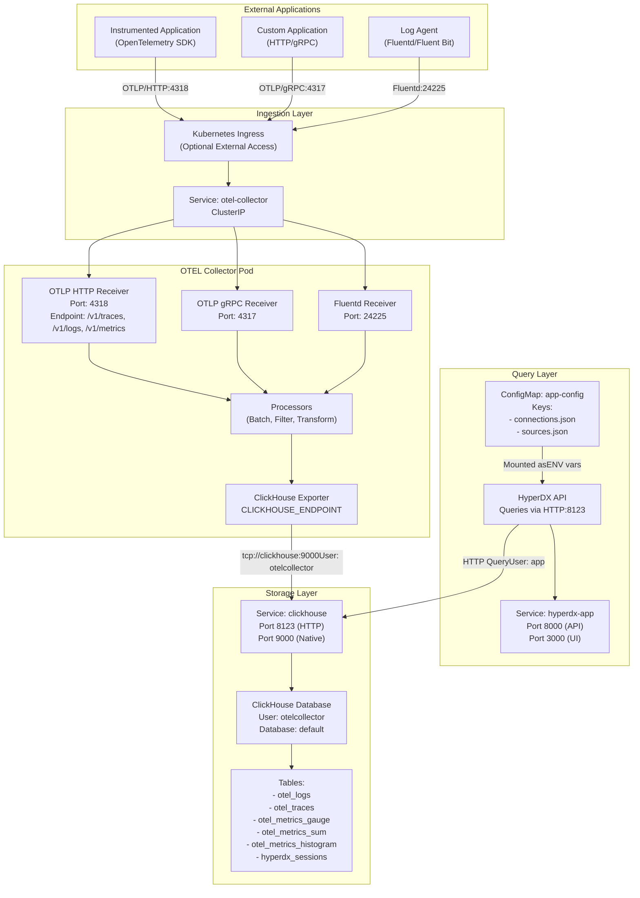
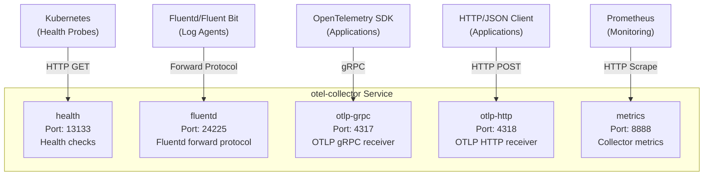
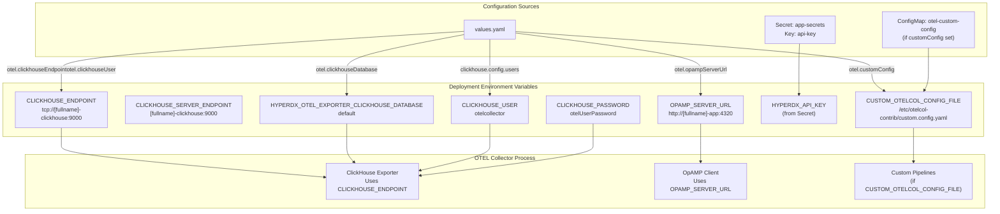
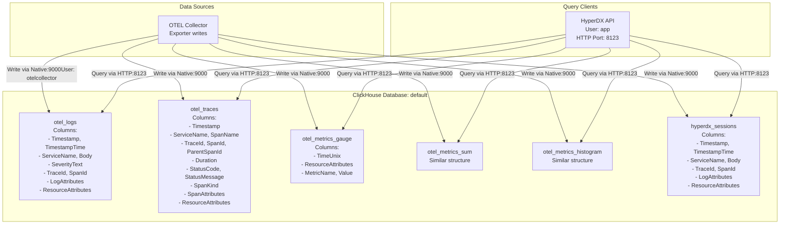
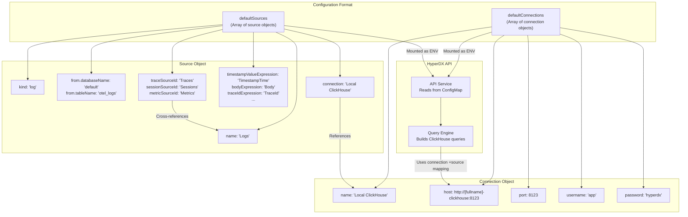
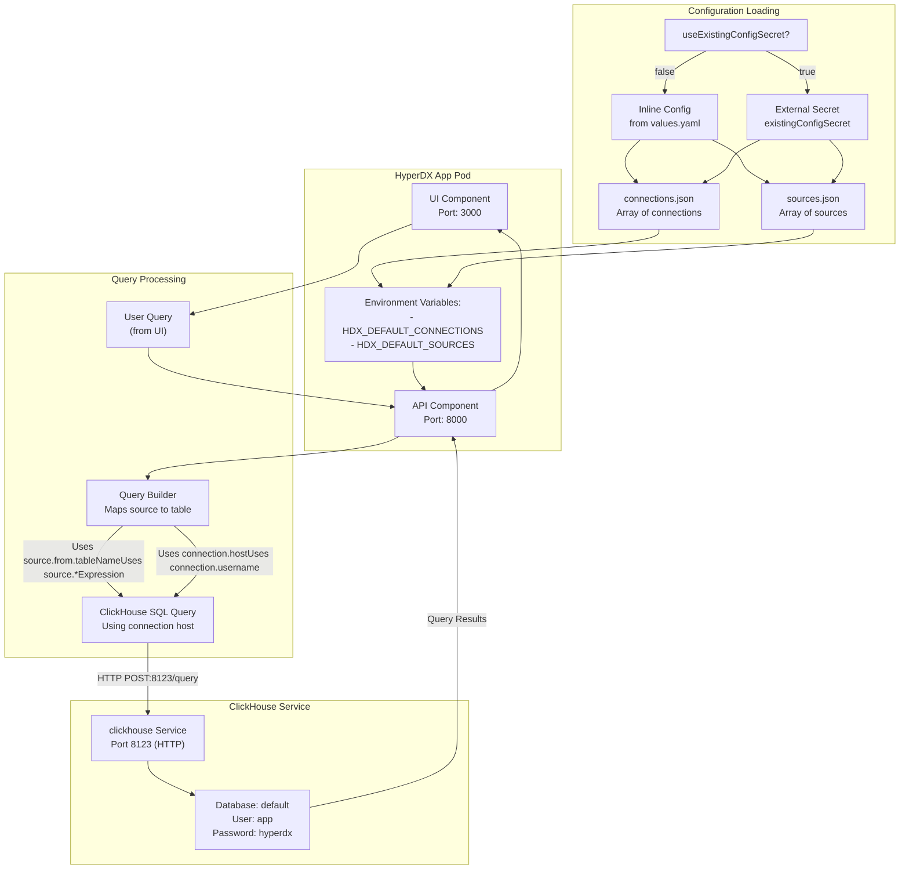
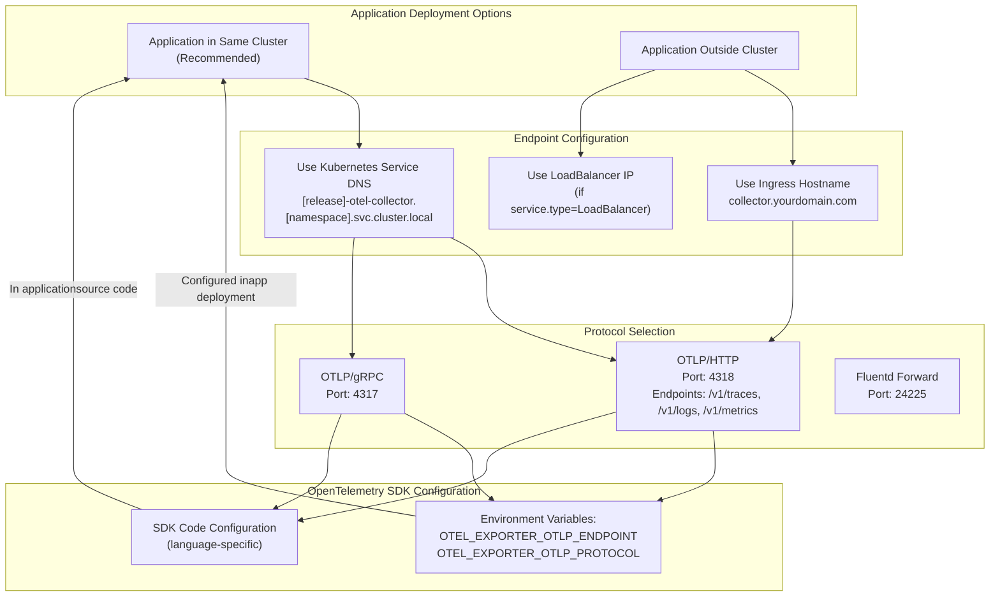

# Data Flow and Integration

> **Relevant source files**
> * [README.md](https://github.com/hyperdxio/helm-charts/blob/845dd482/README.md)
> * [charts/hdx-oss-v2/templates/otel-collector-deployment.yaml](https://github.com/hyperdxio/helm-charts/blob/845dd482/charts/hdx-oss-v2/templates/otel-collector-deployment.yaml)
> * [charts/hdx-oss-v2/values.yaml](https://github.com/hyperdxio/helm-charts/blob/845dd482/charts/hdx-oss-v2/values.yaml)

## Purpose and Scope

This document describes how observability data flows through the HyperDX system, from instrumented applications to storage and visualization. It covers the complete telemetry pipeline, data source configuration, and integration patterns for sending telemetry data to HyperDX.

For details on individual component architecture, see [Component Deep Dives](/hyperdxio/helm-charts/5-component-deep-dives). For network configuration and security aspects, see [Networking and Security](/hyperdxio/helm-charts/7-networking-and-security). For step-by-step integration instructions, see [Integrating Applications](/hyperdxio/helm-charts/6.3-integrating-applications).

---

## End-to-End Data Flow Architecture

The following diagram shows the complete data flow from instrumented applications through the OTEL Collector to ClickHouse storage, with actual port numbers and service names used in the deployment.

### Complete Telemetry Pipeline



**Sources:** [charts/hdx-oss-v2/templates/otel-collector-deployment.yaml L49-L54](https://github.com/hyperdxio/helm-charts/blob/845dd482/charts/hdx-oss-v2/templates/otel-collector-deployment.yaml#L49-L54)

 [charts/hdx-oss-v2/templates/otel-collector-deployment.yaml L80-L102](https://github.com/hyperdxio/helm-charts/blob/845dd482/charts/hdx-oss-v2/templates/otel-collector-deployment.yaml#L80-L102)

 [charts/hdx-oss-v2/values.yaml L400-L404](https://github.com/hyperdxio/helm-charts/blob/845dd482/charts/hdx-oss-v2/values.yaml#L400-L404)

 [charts/hdx-oss-v2/values.yaml L289-L292](https://github.com/hyperdxio/helm-charts/blob/845dd482/charts/hdx-oss-v2/values.yaml#L289-L292)

### Key Data Flow Stages

| Stage | Component | Input | Output | Configuration |
| --- | --- | --- | --- | --- |
| **Ingestion** | OTEL Collector | OTLP HTTP/gRPC, Fluentd | Received telemetry | `otel.httpPort`, `otel.grpcPort`, `otel.nativePort` |
| **Processing** | OTEL Processors | Raw telemetry | Processed data | `otel.customConfig` (optional) |
| **Storage** | ClickHouse Exporter | Processed data | ClickHouse writes | `otel.clickhouseEndpoint`, `otel.clickhouseDatabase` |
| **Querying** | HyperDX API | User queries | Query results | `hyperdx.defaultConnections`, `hyperdx.defaultSources` |

**Sources:** [charts/hdx-oss-v2/values.yaml L400-L452](https://github.com/hyperdxio/helm-charts/blob/845dd482/charts/hdx-oss-v2/values.yaml#L400-L452)

 [charts/hdx-oss-v2/templates/otel-collector-deployment.yaml L79-L109](https://github.com/hyperdxio/helm-charts/blob/845dd482/charts/hdx-oss-v2/templates/otel-collector-deployment.yaml#L79-L109)

---

## Telemetry Ingestion Endpoints

The OTEL Collector exposes multiple protocols for receiving telemetry data. Each protocol serves different use cases and client types.

### OTEL Collector Service Ports



**Sources:** [charts/hdx-oss-v2/templates/otel-collector-deployment.yaml L125-L140](https://github.com/hyperdxio/helm-charts/blob/845dd482/charts/hdx-oss-v2/templates/otel-collector-deployment.yaml#L125-L140)

 [charts/hdx-oss-v2/values.yaml L400-L404](https://github.com/hyperdxio/helm-charts/blob/845dd482/charts/hdx-oss-v2/values.yaml#L400-L404)

### Protocol Details

| Port | Protocol | Path | Purpose | Configuration Key |
| --- | --- | --- | --- | --- |
| 4317 | gRPC | N/A | OTLP gRPC endpoint for traces, logs, metrics | `otel.grpcPort` |
| 4318 | HTTP | `/v1/traces`, `/v1/logs`, `/v1/metrics` | OTLP HTTP/JSON endpoint | `otel.httpPort` |
| 24225 | TCP | N/A | Fluentd forward protocol | `otel.nativePort` |
| 13133 | HTTP | `/` | Health check endpoint | `otel.port` |
| 8888 | HTTP | `/metrics` | Prometheus metrics | `otel.healthPort` |

**Sources:** [charts/hdx-oss-v2/templates/otel-collector-deployment.yaml L125-L140](https://github.com/hyperdxio/helm-charts/blob/845dd482/charts/hdx-oss-v2/templates/otel-collector-deployment.yaml#L125-L140)

 [charts/hdx-oss-v2/values.yaml L400-L404](https://github.com/hyperdxio/helm-charts/blob/845dd482/charts/hdx-oss-v2/values.yaml#L400-L404)

### Exposing Endpoints via Ingress

To expose OTEL Collector endpoints externally (for telemetry from outside the cluster), configure `additionalIngresses`:

```python
# Example from values.yaml
hyperdx:
  ingress:
    enabled: true
    additionalIngresses:
      - name: otel-collector
        hosts:
          - host: collector.example.com
            paths:
              - path: /v1/(traces|metrics|logs)
                pathType: Prefix
                port: 4318  # Routes to otel.httpPort
```

**Sources:** [charts/hdx-oss-v2/values.yaml L223-L239](https://github.com/hyperdxio/helm-charts/blob/845dd482/charts/hdx-oss-v2/values.yaml#L223-L239)

 [README.md L436-L463](https://github.com/hyperdxio/helm-charts/blob/845dd482/README.md#L436-L463)

---

## OTEL Collector Configuration and Processing

The OTEL Collector processes telemetry data before storage. It is configured via environment variables and an optional custom configuration file.

### Environment Variables and Connection Configuration



**Sources:** [charts/hdx-oss-v2/templates/otel-collector-deployment.yaml L79-L109](https://github.com/hyperdxio/helm-charts/blob/845dd482/charts/hdx-oss-v2/templates/otel-collector-deployment.yaml#L79-L109)

 [charts/hdx-oss-v2/values.yaml L441-L452](https://github.com/hyperdxio/helm-charts/blob/845dd482/charts/hdx-oss-v2/values.yaml#L441-L452)

### Key Environment Variables

| Environment Variable | Default Value | Purpose | Source |
| --- | --- | --- | --- |
| `CLICKHOUSE_ENDPOINT` | `tcp://[fullname]-clickhouse:9000?dial_timeout=10s` | Native protocol endpoint for data writes | [otel-collector-deployment.yaml L80-L81](https://github.com/hyperdxio/helm-charts/blob/845dd482/otel-collector-deployment.yaml#L80-L81) |
| `CLICKHOUSE_SERVER_ENDPOINT` | `[fullname]-clickhouse:9000` | Server hostname and port | [otel-collector-deployment.yaml L82-L83](https://github.com/hyperdxio/helm-charts/blob/845dd482/otel-collector-deployment.yaml#L82-L83) |
| `CLICKHOUSE_USER` | `otelcollector` | ClickHouse user for writes | [otel-collector-deployment.yaml L99-L100](https://github.com/hyperdxio/helm-charts/blob/845dd482/otel-collector-deployment.yaml#L99-L100) |
| `CLICKHOUSE_PASSWORD` | `otelUserPassword` | ClickHouse password | [otel-collector-deployment.yaml L101-L102](https://github.com/hyperdxio/helm-charts/blob/845dd482/otel-collector-deployment.yaml#L101-L102) |
| `HYPERDX_OTEL_EXPORTER_CLICKHOUSE_DATABASE` | `default` | Target database name | [otel-collector-deployment.yaml L92-L93](https://github.com/hyperdxio/helm-charts/blob/845dd482/otel-collector-deployment.yaml#L92-L93) |
| `OPAMP_SERVER_URL` | `http://[fullname]-app:4320` | OpAMP server for dynamic config | [otel-collector-deployment.yaml L88-L89](https://github.com/hyperdxio/helm-charts/blob/845dd482/otel-collector-deployment.yaml#L88-L89) |
| `HYPERDX_API_KEY` | (from Secret) | API key for authentication | [otel-collector-deployment.yaml L94-L98](https://github.com/hyperdxio/helm-charts/blob/845dd482/otel-collector-deployment.yaml#L94-L98) |
| `CUSTOM_OTELCOL_CONFIG_FILE` | `/etc/otelcol-contrib/custom.config.yaml` | Path to custom config (if provided) | [otel-collector-deployment.yaml L104-L105](https://github.com/hyperdxio/helm-charts/blob/845dd482/otel-collector-deployment.yaml#L104-L105) |

**Sources:** [charts/hdx-oss-v2/templates/otel-collector-deployment.yaml L79-L109](https://github.com/hyperdxio/helm-charts/blob/845dd482/charts/hdx-oss-v2/templates/otel-collector-deployment.yaml#L79-L109)

### Custom Configuration

Users can provide custom OTEL Collector configuration via `otel.customConfig`:

```yaml
otel:
  customConfig: |
    receivers:
      hostmetrics:
        collection_interval: 5s
        scrapers:
          cpu:
          memory:
    service:
      pipelines:
        metrics/hostmetrics:
          receivers: [hostmetrics]
          processors: [batch]
          exporters: [clickhouse]
```

This configuration is mounted as a ConfigMap volume at `/etc/otelcol-contrib/custom.config.yaml`.

**Sources:** [charts/hdx-oss-v2/values.yaml L417-L436](https://github.com/hyperdxio/helm-charts/blob/845dd482/charts/hdx-oss-v2/values.yaml#L417-L436)

 [charts/hdx-oss-v2/templates/otel-collector-deployment.yaml L39-L44](https://github.com/hyperdxio/helm-charts/blob/845dd482/charts/hdx-oss-v2/templates/otel-collector-deployment.yaml#L39-L44)

 [charts/hdx-oss-v2/templates/otel-collector-deployment.yaml L110-L116](https://github.com/hyperdxio/helm-charts/blob/845dd482/charts/hdx-oss-v2/templates/otel-collector-deployment.yaml#L110-L116)

---

## ClickHouse Storage Schema

Telemetry data is stored in ClickHouse tables with specific schemas. The HyperDX API queries these tables via the `defaultSources` configuration.

### Table Structure and Purpose



**Sources:** [charts/hdx-oss-v2/values.yaml L104-L202](https://github.com/hyperdxio/helm-charts/blob/845dd482/charts/hdx-oss-v2/values.yaml#L104-L202)

### Table and Column Mapping

| Table Name | Kind | Key Columns | Purpose |
| --- | --- | --- | --- |
| `otel_logs` | log | `Timestamp`, `ServiceName`, `Body`, `TraceId`, `SpanId` | Stores log entries with attributes and context |
| `otel_traces` | trace | `Timestamp`, `TraceId`, `SpanId`, `ParentSpanId`, `Duration`, `SpanName` | Stores distributed trace spans |
| `otel_metrics_gauge` | metric | `TimeUnix`, `MetricName`, `Value`, `ResourceAttributes` | Stores gauge-type metrics |
| `otel_metrics_sum` | metric | Similar to gauge | Stores sum/counter-type metrics |
| `otel_metrics_histogram` | metric | Similar to gauge | Stores histogram-type metrics |
| `hyperdx_sessions` | session | `Timestamp`, `ServiceName`, `Body`, `TraceId` | Stores session data (browser sessions, etc.) |

**Sources:** [charts/hdx-oss-v2/values.yaml L106-L201](https://github.com/hyperdxio/helm-charts/blob/845dd482/charts/hdx-oss-v2/values.yaml#L106-L201)

---

## Data Sources and Connections Configuration

HyperDX uses two configuration structures to map ClickHouse tables to queryable data sources: `defaultConnections` defines database connections, and `defaultSources` defines how to query tables.

### Connections and Sources Relationship



**Sources:** [charts/hdx-oss-v2/values.yaml L77-L202](https://github.com/hyperdxio/helm-charts/blob/845dd482/charts/hdx-oss-v2/values.yaml#L77-L202)

### Connection Schema

Each connection in `defaultConnections` defines how to reach a ClickHouse instance:

| Field | Type | Example | Description |
| --- | --- | --- | --- |
| `name` | string | `"Local ClickHouse"` | Unique identifier for this connection |
| `host` | string | `"http://my-hdx-clickhouse:8123"` | HTTP endpoint (port 8123) |
| `port` | number | `8123` | HTTP port number |
| `username` | string | `"app"` | ClickHouse user for queries |
| `password` | string | `"hyperdx"` | ClickHouse password |

**Example:**

```
[
  {
    "name": "Local ClickHouse",
    "host": "http://{{ include "hdx-oss.fullname" . }}-clickhouse:8123",
    "port": 8123,
    "username": "app",
    "password": "{{ .Values.clickhouse.config.users.appUserPassword }}"
  }
]
```

**Sources:** [charts/hdx-oss-v2/values.yaml L92-L101](https://github.com/hyperdxio/helm-charts/blob/845dd482/charts/hdx-oss-v2/values.yaml#L92-L101)

### Source Schema

Each source in `defaultSources` defines how to query a specific telemetry type:

#### Common Fields

| Field | Type | Example | Description |
| --- | --- | --- | --- |
| `name` | string | `"Logs"` | Display name for this source |
| `kind` | string | `"log"`, `"trace"`, `"metric"`, `"session"` | Type of telemetry data |
| `connection` | string | `"Local ClickHouse"` | References a connection by name |
| `from.databaseName` | string | `"default"` | ClickHouse database name |
| `from.tableName` | string | `"otel_logs"` | ClickHouse table name |

#### Expression Fields (Logs & Traces)

| Field | Example Value | Description |
| --- | --- | --- |
| `timestampValueExpression` | `"TimestampTime"` | Column for query filtering |
| `displayedTimestampValueExpression` | `"Timestamp"` | Column for display |
| `bodyExpression` | `"Body"` | Main content column |
| `serviceNameExpression` | `"ServiceName"` | Service identifier |
| `traceIdExpression` | `"TraceId"` | Trace correlation ID |
| `spanIdExpression` | `"SpanId"` | Span identifier |
| `eventAttributesExpression` | `"LogAttributes"` | Event-specific attributes |
| `resourceAttributesExpression` | `"ResourceAttributes"` | Resource attributes |

**Sources:** [charts/hdx-oss-v2/values.yaml L106-L128](https://github.com/hyperdxio/helm-charts/blob/845dd482/charts/hdx-oss-v2/values.yaml#L106-L128)

 [charts/hdx-oss-v2/values.yaml L129-L157](https://github.com/hyperdxio/helm-charts/blob/845dd482/charts/hdx-oss-v2/values.yaml#L129-L157)

#### Trace-Specific Fields

| Field | Example Value | Description |
| --- | --- | --- |
| `durationExpression` | `"Duration"` | Span duration column |
| `durationPrecision` | `9` | Nanosecond precision (10^9) |
| `parentSpanIdExpression` | `"ParentSpanId"` | Parent span for hierarchy |
| `spanNameExpression` | `"SpanName"` | Span operation name |
| `spanKindExpression` | `"SpanKind"` | Span type (server, client, etc.) |
| `statusCodeExpression` | `"StatusCode"` | Status code column |
| `statusMessageExpression` | `"StatusMessage"` | Status message column |

**Sources:** [charts/hdx-oss-v2/values.yaml L143-L152](https://github.com/hyperdxio/helm-charts/blob/845dd482/charts/hdx-oss-v2/values.yaml#L143-L152)

#### Metric-Specific Fields

| Field | Example Value | Description |
| --- | --- | --- |
| `metricTables.gauge` | `"otel_metrics_gauge"` | Table for gauge metrics |
| `metricTables.histogram` | `"otel_metrics_histogram"` | Table for histogram metrics |
| `metricTables.sum` | `"otel_metrics_sum"` | Table for sum/counter metrics |

**Sources:** [charts/hdx-oss-v2/values.yaml L167-L173](https://github.com/hyperdxio/helm-charts/blob/845dd482/charts/hdx-oss-v2/values.yaml#L167-L173)

#### Cross-Reference Fields

| Field | Example Value | Description |
| --- | --- | --- |
| `traceSourceId` | `"Traces"` | Links to trace source for correlation |
| `logSourceId` | `"Logs"` | Links to log source for correlation |
| `sessionSourceId` | `"Sessions"` | Links to session source for correlation |
| `metricSourceId` | `"Metrics"` | Links to metric source for correlation |

These fields enable the UI to navigate between related telemetry types (e.g., from a log entry to its trace).

**Sources:** [charts/hdx-oss-v2/values.yaml L125-L127](https://github.com/hyperdxio/helm-charts/blob/845dd482/charts/hdx-oss-v2/values.yaml#L125-L127)

 [charts/hdx-oss-v2/values.yaml L154-L156](https://github.com/hyperdxio/helm-charts/blob/845dd482/charts/hdx-oss-v2/values.yaml#L154-L156)

### Using External Secrets for Configuration

For production deployments, instead of inline configuration, use an external Kubernetes secret:

```yaml
hyperdx:
  useExistingConfigSecret: true
  existingConfigSecret: "hyperdx-external-config"
  existingConfigConnectionsKey: "connections.json"
  existingConfigSourcesKey: "sources.json"
```

The secret must contain two keys with JSON arrays:

* `connections.json`: Array of connection objects
* `sources.json`: Array of source objects

**Sources:** [charts/hdx-oss-v2/values.yaml L80-L90](https://github.com/hyperdxio/helm-charts/blob/845dd482/charts/hdx-oss-v2/values.yaml#L80-L90)

 [README.md L98-L183](https://github.com/hyperdxio/helm-charts/blob/845dd482/README.md#L98-L183)

---

## Query Flow: API to ClickHouse

The HyperDX API service queries ClickHouse using the HTTP protocol (port 8123) with the `app` user. The `defaultConnections` and `defaultSources` configuration drives query generation.

### API Query Architecture



**Sources:** [charts/hdx-oss-v2/values.yaml L92-L101](https://github.com/hyperdxio/helm-charts/blob/845dd482/charts/hdx-oss-v2/values.yaml#L92-L101)

 [charts/hdx-oss-v2/values.yaml L104-L202](https://github.com/hyperdxio/helm-charts/blob/845dd482/charts/hdx-oss-v2/values.yaml#L104-L202)

 [charts/hdx-oss-v2/values.yaml L80-L90](https://github.com/hyperdxio/helm-charts/blob/845dd482/charts/hdx-oss-v2/values.yaml#L80-L90)

### Query Example

When a user queries logs, the API:

1. Identifies the "Logs" source from `defaultSources`
2. Extracts the `connection` reference ("Local ClickHouse")
3. Looks up connection details in `defaultConnections`
4. Builds a ClickHouse query using the source's expression mappings: * `from.tableName` → `otel_logs` * `timestampValueExpression` → `WHERE TimestampTime BETWEEN ...` * `bodyExpression` → `SELECT Body ...` * `serviceNameExpression` → `WHERE ServiceName = ...`
5. Executes the query via HTTP to `http://[fullname]-clickhouse:8123`
6. Returns results to the UI

**Sources:** [charts/hdx-oss-v2/values.yaml L106-L128](https://github.com/hyperdxio/helm-charts/blob/845dd482/charts/hdx-oss-v2/values.yaml#L106-L128)

 [charts/hdx-oss-v2/values.yaml L92-L101](https://github.com/hyperdxio/helm-charts/blob/845dd482/charts/hdx-oss-v2/values.yaml#L92-L101)

---

## Integrating Applications

Applications send telemetry data to HyperDX by instrumenting with OpenTelemetry SDKs and configuring them to export to the OTEL Collector endpoints.

### Integration Endpoint Discovery



**Sources:** [charts/hdx-oss-v2/templates/otel-collector-deployment.yaml L125-L140](https://github.com/hyperdxio/helm-charts/blob/845dd482/charts/hdx-oss-v2/templates/otel-collector-deployment.yaml#L125-L140)

 [charts/hdx-oss-v2/values.yaml L223-L239](https://github.com/hyperdxio/helm-charts/blob/845dd482/charts/hdx-oss-v2/values.yaml#L223-L239)

### In-Cluster Application Integration

For applications running in the same Kubernetes cluster, use the OTEL Collector service DNS name:

**HTTP Endpoint:**

```yaml
http://[release-name]-otel-collector.[namespace].svc.cluster.local:4318
```

**gRPC Endpoint:**

```yaml
http://[release-name]-otel-collector.[namespace].svc.cluster.local:4317
```

**Example Application Deployment:**

```yaml
apiVersion: apps/v1
kind: Deployment
metadata:
  name: my-app
spec:
  template:
    spec:
      containers:
      - name: app
        env:
        - name: OTEL_EXPORTER_OTLP_ENDPOINT
          value: "http://my-hyperdx-hdx-oss-v2-otel-collector.default.svc.cluster.local:4318"
        - name: OTEL_EXPORTER_OTLP_PROTOCOL
          value: "http/protobuf"
```

**Sources:** [charts/hdx-oss-v2/templates/otel-collector-deployment.yaml L118-L144](https://github.com/hyperdxio/helm-charts/blob/845dd482/charts/hdx-oss-v2/templates/otel-collector-deployment.yaml#L118-L144)

### External Application Integration

For applications outside the cluster, expose the OTEL Collector via Ingress:

```yaml
hyperdx:
  ingress:
    enabled: true
    additionalIngresses:
      - name: otel-collector
        hosts:
          - host: collector.example.com
            paths:
              - path: /v1/(traces|metrics|logs)
                pathType: Prefix
                port: 4318
        tls:
          - hosts:
              - collector.example.com
            secretName: collector-tls
```

Then configure applications to use:

```yaml
https://collector.example.com/v1/traces
https://collector.example.com/v1/logs
https://collector.example.com/v1/metrics
```

**Sources:** [charts/hdx-oss-v2/values.yaml L223-L239](https://github.com/hyperdxio/helm-charts/blob/845dd482/charts/hdx-oss-v2/values.yaml#L223-L239)

 [README.md L436-L463](https://github.com/hyperdxio/helm-charts/blob/845dd482/README.md#L436-L463)

### Integration Checklist

| Step | Action | Configuration |
| --- | --- | --- |
| 1. Install OpenTelemetry SDK | Add SDK dependency to application | Language-specific package |
| 2. Configure Exporter Endpoint | Set OTLP endpoint URL | Environment variable or SDK config |
| 3. Configure Protocol | Choose HTTP or gRPC | `OTEL_EXPORTER_OTLP_PROTOCOL` |
| 4. Set Service Name | Identify application in telemetry | `OTEL_SERVICE_NAME` or SDK config |
| 5. Configure Signals | Enable traces, logs, metrics | SDK-specific configuration |
| 6. Deploy Application | Deploy with OTEL configuration | Kubernetes deployment manifest |
| 7. Verify Data Flow | Check HyperDX UI for data | Query logs/traces/metrics |

**Sources:** [README.md L1-L631](https://github.com/hyperdxio/helm-charts/blob/845dd482/README.md#L1-L631)

### Common Integration Patterns

**Pattern 1: HTTP/Protobuf (Recommended for most applications)**

* Protocol: OTLP/HTTP
* Port: 4318
* Paths: `/v1/traces`, `/v1/logs`, `/v1/metrics`
* Best for: REST-based applications, polyglot environments

**Pattern 2: gRPC (Recommended for high-throughput applications)**

* Protocol: OTLP/gRPC
* Port: 4317
* Best for: High-volume telemetry, low-latency requirements

**Pattern 3: Fluentd Forward (Log aggregation)**

* Protocol: Fluentd forward protocol
* Port: 24225
* Best for: Existing Fluentd/Fluent Bit infrastructure

**Sources:** [charts/hdx-oss-v2/values.yaml L400-L404](https://github.com/hyperdxio/helm-charts/blob/845dd482/charts/hdx-oss-v2/values.yaml#L400-L404)

 [charts/hdx-oss-v2/templates/otel-collector-deployment.yaml L125-L140](https://github.com/hyperdxio/helm-charts/blob/845dd482/charts/hdx-oss-v2/templates/otel-collector-deployment.yaml#L125-L140)

---

## Data Flow Summary

The complete telemetry pipeline follows this sequence:

1. **Application Instrumentation**: Applications use OpenTelemetry SDKs to generate telemetry
2. **Export**: SDKs export to OTEL Collector via OTLP/HTTP (4318), OTLP/gRPC (4317), or Fluentd (24225)
3. **Ingestion**: OTEL Collector receives telemetry on configured ports
4. **Processing**: Collector processes data (batch, filter, transform) via processors
5. **Storage**: Collector exports to ClickHouse native protocol (port 9000) as user `otelcollector`
6. **Schema Mapping**: Data stored in tables: `otel_logs`, `otel_traces`, `otel_metrics_*`, `hyperdx_sessions`
7. **Configuration**: API reads `defaultConnections` and `defaultSources` from ConfigMap or external Secret
8. **Querying**: API queries ClickHouse HTTP endpoint (port 8123) as user `app`
9. **Visualization**: UI displays results from API queries

Each stage is independently configurable, supporting both full-stack deployments and external component integration.

**Sources:** [charts/hdx-oss-v2/values.yaml L1-L477](https://github.com/hyperdxio/helm-charts/blob/845dd482/charts/hdx-oss-v2/values.yaml#L1-L477)

 [charts/hdx-oss-v2/templates/otel-collector-deployment.yaml L1-L145](https://github.com/hyperdxio/helm-charts/blob/845dd482/charts/hdx-oss-v2/templates/otel-collector-deployment.yaml#L1-L145)

 [README.md L1-L631](https://github.com/hyperdxio/helm-charts/blob/845dd482/README.md#L1-L631)