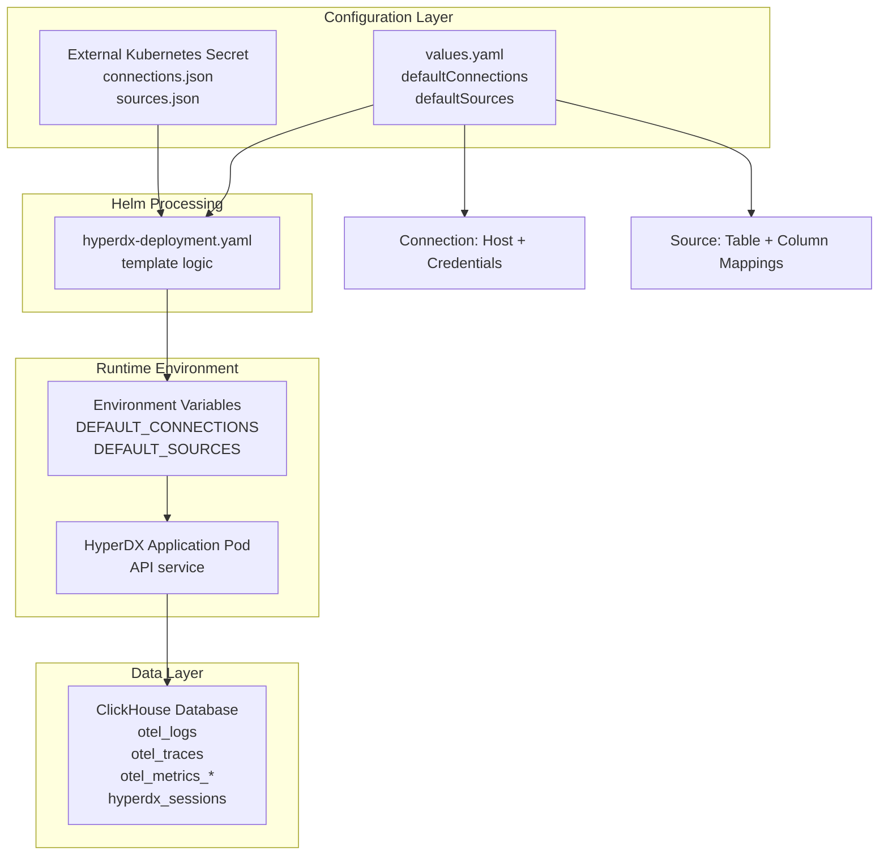
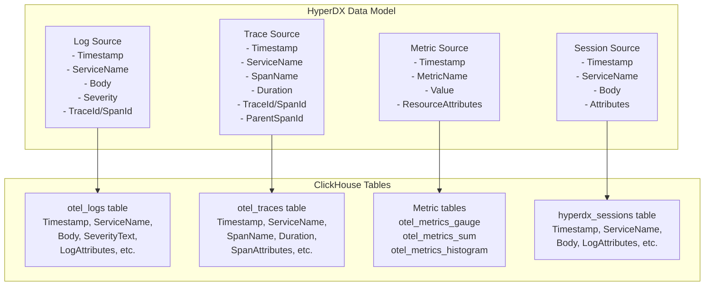
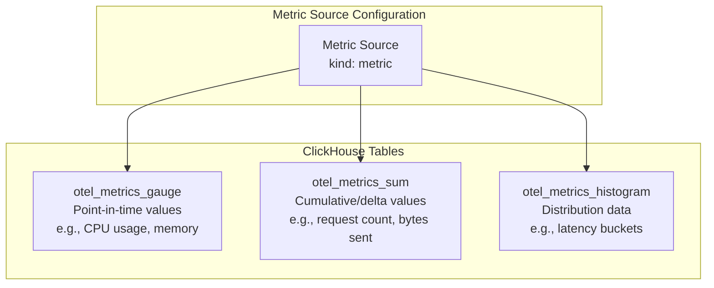
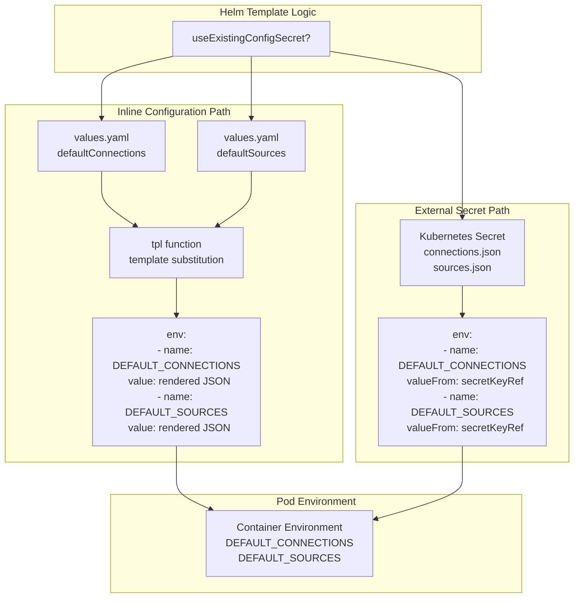

# Data Sources and Connections

> **Relevant source files**
> * [README.md](https://github.com/hyperdxio/helm-charts/blob/845dd482/README.md)
> * [charts/hdx-oss-v2/templates/hyperdx-deployment.yaml](https://github.com/hyperdxio/helm-charts/blob/845dd482/charts/hdx-oss-v2/templates/hyperdx-deployment.yaml)
> * [charts/hdx-oss-v2/values.yaml](https://github.com/hyperdxio/helm-charts/blob/845dd482/charts/hdx-oss-v2/values.yaml)

## Purpose and Scope

This page documents how to configure HyperDX's data source connections and query definitions. It covers the `defaultConnections` and `defaultSources` configuration options that define how the HyperDX application connects to ClickHouse and queries telemetry data stored in various tables.

For information about the end-to-end telemetry data pipeline from ingestion to storage, see [Telemetry Data Pipeline](/hyperdxio/helm-charts/6.1-telemetry-data-pipeline). For information about instrumenting applications to send data to HyperDX, see [Integrating Applications](/hyperdxio/helm-charts/6.3-integrating-applications).

---

## Overview of Connections and Sources

HyperDX uses two separate but related configuration structures to enable querying of telemetry data:

1. **Connections** (`defaultConnections`): Define database connection parameters (host, port, credentials) for ClickHouse instances
2. **Sources** (`defaultSources`): Define how to query specific ClickHouse tables by mapping table columns to HyperDX's data model

These configurations are provided as JSON arrays that get injected into the HyperDX application as environment variables at deployment time.



**Sources:** [charts/hdx-oss-v2/values.yaml L77-L202](https://github.com/hyperdxio/helm-charts/blob/845dd482/charts/hdx-oss-v2/values.yaml#L77-L202)

 [charts/hdx-oss-v2/templates/hyperdx-deployment.yaml L101-L123](https://github.com/hyperdxio/helm-charts/blob/845dd482/charts/hdx-oss-v2/templates/hyperdx-deployment.yaml#L101-L123)

---

## Connection Configuration

### Connection Structure

Connections define how to reach a ClickHouse database. Each connection object contains:

| Field | Type | Description |
| --- | --- | --- |
| `name` | string | Unique identifier for this connection, referenced by sources |
| `host` | string | ClickHouse HTTP endpoint URL (e.g., `http://hostname:8123`) |
| `port` | number | ClickHouse HTTP port (typically 8123) |
| `username` | string | ClickHouse username |
| `password` | string | ClickHouse password |

### Default Connection Configuration

The Helm chart provides a default connection to the built-in ClickHouse instance:

```json
[
  {
    "name": "Local ClickHouse",
    "host": "http://{{ release-name }}-clickhouse:8123",
    "port": 8123,
    "username": "app",
    "password": "{{ clickhouse.config.users.appUserPassword }}"
  }
]
```

The connection uses:

* **Service name**: Helm template generates the full service name using `{{ include "hdx-oss.fullname" . }}-clickhouse`
* **User**: The `app` user created by the ClickHouse configuration
* **Password**: Defaults to `"hyperdx"` but should be changed for production

**Sources:** [charts/hdx-oss-v2/values.yaml L92-L101](https://github.com/hyperdxio/helm-charts/blob/845dd482/charts/hdx-oss-v2/values.yaml#L92-L101)

### External ClickHouse Configuration

When using an external ClickHouse cluster (`clickhouse.enabled: false`), you must provide custom connection details:

```yaml
hyperdx:
  defaultConnections: |
    [
      {
        "name": "Production ClickHouse",
        "host": "https://clickhouse.production.example.com:8123",
        "port": 8123,
        "username": "hyperdx_prod",
        "password": "secure-password-here"
      }
    ]
```

**Important**: When using external ClickHouse, you must also update the OTEL collector's connection settings separately via `otel.clickhouseEndpoint`, `otel.clickhouseUser`, and `otel.clickhousePassword` to ensure telemetry data is written to the same database.

**Sources:** [README.md L70-L96](https://github.com/hyperdxio/helm-charts/blob/845dd482/README.md#L70-L96)

 [charts/hdx-oss-v2/values.yaml L441-L446](https://github.com/hyperdxio/helm-charts/blob/845dd482/charts/hdx-oss-v2/values.yaml#L441-L446)

---

## Source Configuration

### Source Purpose and Structure

Sources define how HyperDX interprets and queries data from ClickHouse tables. Each source maps a ClickHouse table to HyperDX's observability data model by specifying column expressions for timestamps, service names, attributes, and other fields.



**Sources:** [charts/hdx-oss-v2/values.yaml L104-L202](https://github.com/hyperdxio/helm-charts/blob/845dd482/charts/hdx-oss-v2/values.yaml#L104-L202)

### Source Kinds

HyperDX supports four kinds of data sources:

| Kind | Purpose | ClickHouse Table |
| --- | --- | --- |
| `log` | Query log entries | `otel_logs` |
| `trace` | Query distributed traces and spans | `otel_traces` |
| `metric` | Query metrics (gauges, counters, histograms) | `otel_metrics_gauge`, `otel_metrics_sum`, `otel_metrics_histogram` |
| `session` | Query session replay data | `hyperdx_sessions` |

### Common Source Fields

All source types share these fields:

| Field | Type | Description |
| --- | --- | --- |
| `name` | string | Display name for this source in the UI |
| `kind` | string | Source type: `"log"`, `"trace"`, `"metric"`, or `"session"` |
| `connection` | string | Name of the connection to use (references `defaultConnections`) |
| `from.databaseName` | string | ClickHouse database name (typically `"default"`) |
| `from.tableName` | string | ClickHouse table name |
| `timestampValueExpression` | string | Column expression for the timestamp used in queries |
| `displayedTimestampValueExpression` | string | Column expression for the timestamp displayed in UI |
| `serviceNameExpression` | string | Column expression for service name |
| `resourceAttributesExpression` | string | Column expression for OTEL resource attributes |

### Cross-Source References

Sources reference each other to enable correlated querying across telemetry types:

| Field | Description |
| --- | --- |
| `logSourceId` | ID of the log source (for correlating with logs) |
| `traceSourceId` | ID of the trace source (for correlating with traces) |
| `metricSourceId` | ID of the metric source (for correlating with metrics) |
| `sessionSourceId` | ID of the session source (for correlating with sessions) |

**Sources:** [charts/hdx-oss-v2/values.yaml L124-L127](https://github.com/hyperdxio/helm-charts/blob/845dd482/charts/hdx-oss-v2/values.yaml#L124-L127)

 [charts/hdx-oss-v2/values.yaml L154-L156](https://github.com/hyperdxio/helm-charts/blob/845dd482/charts/hdx-oss-v2/values.yaml#L154-L156)

---

## Log Source Configuration

Log sources query the `otel_logs` table and define how to display log entries.

### Key Fields for Log Sources

```json
{
  "from": {
    "databaseName": "default",
    "tableName": "otel_logs"
  },
  "kind": "log",
  "timestampValueExpression": "TimestampTime",
  "displayedTimestampValueExpression": "Timestamp",
  "implicitColumnExpression": "Body",
  "serviceNameExpression": "ServiceName",
  "bodyExpression": "Body",
  "eventAttributesExpression": "LogAttributes",
  "resourceAttributesExpression": "ResourceAttributes",
  "defaultTableSelectExpression": "Timestamp,ServiceName,SeverityText,Body",
  "severityTextExpression": "SeverityText",
  "traceIdExpression": "TraceId",
  "spanIdExpression": "SpanId"
}
```

### Column Expression Mappings

| Field | ClickHouse Column | Purpose |
| --- | --- | --- |
| `timestampValueExpression` | `TimestampTime` | Internal timestamp for queries (DateTime64) |
| `displayedTimestampValueExpression` | `Timestamp` | Timestamp shown in UI (string format) |
| `bodyExpression` | `Body` | Main log message content |
| `severityTextExpression` | `SeverityText` | Log level (INFO, WARN, ERROR, etc.) |
| `eventAttributesExpression` | `LogAttributes` | OTEL log attributes (Map type) |
| `traceIdExpression` | `TraceId` | Trace ID for correlation |
| `spanIdExpression` | `SpanId` | Span ID for correlation |

**Sources:** [charts/hdx-oss-v2/values.yaml L106-L128](https://github.com/hyperdxio/helm-charts/blob/845dd482/charts/hdx-oss-v2/values.yaml#L106-L128)

---

## Trace Source Configuration

Trace sources query the `otel_traces` table and define how to display spans and traces.

### Key Fields for Trace Sources

```json
{
  "from": {
    "databaseName": "default",
    "tableName": "otel_traces"
  },
  "kind": "trace",
  "timestampValueExpression": "Timestamp",
  "displayedTimestampValueExpression": "Timestamp",
  "implicitColumnExpression": "SpanName",
  "serviceNameExpression": "ServiceName",
  "bodyExpression": "SpanName",
  "eventAttributesExpression": "SpanAttributes",
  "resourceAttributesExpression": "ResourceAttributes",
  "defaultTableSelectExpression": "Timestamp,ServiceName,StatusCode,round(Duration/1e6),SpanName",
  "traceIdExpression": "TraceId",
  "spanIdExpression": "SpanId",
  "durationExpression": "Duration",
  "durationPrecision": 9,
  "parentSpanIdExpression": "ParentSpanId",
  "spanNameExpression": "SpanName",
  "spanKindExpression": "SpanKind",
  "statusCodeExpression": "StatusCode",
  "statusMessageExpression": "StatusMessage"
}
```

### Trace-Specific Fields

| Field | ClickHouse Column | Purpose |
| --- | --- | --- |
| `durationExpression` | `Duration` | Span duration in nanoseconds |
| `durationPrecision` | - | Precision for duration values (9 = nanoseconds) |
| `parentSpanIdExpression` | `ParentSpanId` | Parent span ID for building trace trees |
| `spanNameExpression` | `SpanName` | Operation name for the span |
| `spanKindExpression` | `SpanKind` | Span kind (CLIENT, SERVER, INTERNAL, etc.) |
| `statusCodeExpression` | `StatusCode` | Span status code (OK, ERROR, UNSET) |
| `statusMessageExpression` | `StatusMessage` | Optional status message |

**Sources:** [charts/hdx-oss-v2/values.yaml L129-L157](https://github.com/hyperdxio/helm-charts/blob/845dd482/charts/hdx-oss-v2/values.yaml#L129-L157)

---

## Metric Source Configuration

Metric sources query multiple ClickHouse tables for different metric types.

### Metric Tables

Unlike logs and traces, metrics are stored in separate tables by metric type:

```json
{
  "from": {
    "databaseName": "default",
    "tableName": ""
  },
  "kind": "metric",
  "timestampValueExpression": "TimeUnix",
  "resourceAttributesExpression": "ResourceAttributes",
  "metricTables": {
    "gauge": "otel_metrics_gauge",
    "histogram": "otel_metrics_histogram",
    "sum": "otel_metrics_sum"
  }
}
```

### Metric Table Structure



The `tableName` field is empty for metric sources because the actual table is determined by the metric type at query time.

**Sources:** [charts/hdx-oss-v2/values.yaml L158-L178](https://github.com/hyperdxio/helm-charts/blob/845dd482/charts/hdx-oss-v2/values.yaml#L158-L178)

---

## Session Source Configuration

Session sources query the `hyperdx_sessions` table for session replay data.

```json
{
  "from": {
    "databaseName": "default",
    "tableName": "hyperdx_sessions"
  },
  "kind": "session",
  "timestampValueExpression": "TimestampTime",
  "displayedTimestampValueExpression": "Timestamp",
  "implicitColumnExpression": "Body",
  "serviceNameExpression": "ServiceName",
  "bodyExpression": "Body",
  "eventAttributesExpression": "LogAttributes",
  "resourceAttributesExpression": "ResourceAttributes",
  "severityTextExpression": "SeverityText",
  "traceIdExpression": "TraceId",
  "spanIdExpression": "SpanId"
}
```

Session sources use a similar structure to log sources since session events are stored with log-like attributes.

**Sources:** [charts/hdx-oss-v2/values.yaml L179-L202](https://github.com/hyperdxio/helm-charts/blob/845dd482/charts/hdx-oss-v2/values.yaml#L179-L202)

---

## Configuration Methods

### Inline Configuration (Default)

By default, connections and sources are configured inline in `values.yaml` as multi-line YAML strings. Helm templates these values with the `tpl` function to enable dynamic substitution:

```yaml
hyperdx:
  defaultConnections: |
    [
      {
        "name": "Local ClickHouse",
        "host": "http://{{ include "hdx-oss.fullname" . }}-clickhouse:8123",
        "port": 8123,
        "username": "app",
        "password": "{{ .Values.clickhouse.config.users.appUserPassword }}"
      }
    ]
  
  defaultSources: |
    [
      { "kind": "log", ... },
      { "kind": "trace", ... }
    ]
```

**Advantages:**

* Simple for development and testing
* No separate secret management required
* Easy to version control

**Disadvantages:**

* Credentials stored in values files
* Not suitable for production environments

**Sources:** [charts/hdx-oss-v2/values.yaml L92-L202](https://github.com/hyperdxio/helm-charts/blob/845dd482/charts/hdx-oss-v2/values.yaml#L92-L202)

### External Secret Configuration

For production deployments, you should use a Kubernetes secret to store connections and sources separately:

```yaml
hyperdx:
  useExistingConfigSecret: true
  existingConfigSecret: "hyperdx-external-config"
  existingConfigConnectionsKey: "connections.json"
  existingConfigSourcesKey: "sources.json"
```

The secret must contain two keys with JSON array data:

```sql
kubectl create secret generic hyperdx-external-config \
  --from-file=connections.json=./connections.json \
  --from-file=sources.json=./sources.json
```

**Advantages:**

* Credentials separated from Helm configuration
* Compatible with secret management tools (Vault, Sealed Secrets, etc.)
* Follows security best practices

**Disadvantages:**

* Additional operational complexity
* Secret must be created before Helm installation

**Sources:** [charts/hdx-oss-v2/values.yaml L80-L90](https://github.com/hyperdxio/helm-charts/blob/845dd482/charts/hdx-oss-v2/values.yaml#L80-L90)

 [README.md L98-L183](https://github.com/hyperdxio/helm-charts/blob/845dd482/README.md#L98-L183)

---

## Runtime Injection Process

### Environment Variable Injection

The deployment template conditionally injects connections and sources as environment variables based on the `useExistingConfigSecret` flag:



### Deployment Template Logic

The template uses conditional blocks to handle both configuration methods:

```css
# From hyperdx-deployment.yaml lines 101-123
env:
  {{- if .Values.hyperdx.useExistingConfigSecret }}
  - name: DEFAULT_CONNECTIONS
    valueFrom:
      secretKeyRef:
        name: {{ .Values.hyperdx.existingConfigSecret | quote }}
        key: {{ .Values.hyperdx.existingConfigConnectionsKey | quote }}
        optional: false
  - name: DEFAULT_SOURCES
    valueFrom:
      secretKeyRef:
        name: {{ .Values.hyperdx.existingConfigSecret | quote }}
        key: {{ .Values.hyperdx.existingConfigSourcesKey | quote }}
        optional: false
  {{- else }}
  {{- if .Values.hyperdx.defaultConnections }}
  - name: DEFAULT_CONNECTIONS
    value: {{ tpl .Values.hyperdx.defaultConnections . | quote }}
  {{- end }}
  {{- if .Values.hyperdx.defaultSources }}
  - name: DEFAULT_SOURCES
    value: {{ tpl .Values.hyperdx.defaultSources . | quote }}
  {{- end }}
  {{- end }}
```

**Key points:**

* The `tpl` function enables Helm template substitution in inline JSON strings
* The `optional: false` flag ensures pods fail to start if the secret is missing
* Empty values can be set to disable default connections or sources

**Sources:** [charts/hdx-oss-v2/templates/hyperdx-deployment.yaml L101-L123](https://github.com/hyperdxio/helm-charts/blob/845dd482/charts/hdx-oss-v2/templates/hyperdx-deployment.yaml#L101-L123)

---

## Disabling Default Configuration

To disable default connections or sources (e.g., when using only external configuration), set them to empty strings:

```yaml
hyperdx:
  defaultConnections: ""
  defaultSources: ""
```

This is documented in the values file comments and can be useful for custom deployment scenarios.

**Sources:** [charts/hdx-oss-v2/values.yaml L78-L79](https://github.com/hyperdxio/helm-charts/blob/845dd482/charts/hdx-oss-v2/values.yaml#L78-L79)

 [charts/hdx-oss-v2/values.yaml L103](https://github.com/hyperdxio/helm-charts/blob/845dd482/charts/hdx-oss-v2/values.yaml#L103-L103)

---

## Example: Multi-Environment Configuration

### Development Environment (Inline)

```yaml
hyperdx:
  defaultConnections: |
    [
      {
        "name": "Dev ClickHouse",
        "host": "http://{{ include "hdx-oss.fullname" . }}-clickhouse:8123",
        "port": 8123,
        "username": "app",
        "password": "devpassword"
      }
    ]
```

### Production Environment (External Secret)

```python
# values-production.yaml
clickhouse:
  enabled: false

otel:
  clickhouseEndpoint: "tcp://prod-clickhouse.example.com:9000"
  clickhouseUser: "hyperdx_prod"
  clickhousePassword: "{{ secret from vault }}"

hyperdx:
  useExistingConfigSecret: true
  existingConfigSecret: "hyperdx-prod-config"
  existingConfigConnectionsKey: "connections.json"
  existingConfigSourcesKey: "sources.json"
```

Create the production secret from a secure source:

```python
# Production connections.json (from secret manager)
cat > connections.json <<EOF
[
  {
    "name": "Production ClickHouse Cluster",
    "host": "https://prod-clickhouse.example.com:8123",
    "port": 8123,
    "username": "hyperdx_prod",
    "password": "${CLICKHOUSE_PASSWORD}"
  }
]
EOF

# Production sources.json (same schema as default)
kubectl create secret generic hyperdx-prod-config \
  --from-file=connections.json \
  --from-file=sources.json \
  --dry-run=client -o yaml | kubectl apply -f -
```

**Sources:** [README.md L98-L183](https://github.com/hyperdxio/helm-charts/blob/845dd482/README.md#L98-L183)

 [charts/hdx-oss-v2/values.yaml L80-L90](https://github.com/hyperdxio/helm-charts/blob/845dd482/charts/hdx-oss-v2/values.yaml#L80-L90)

---

## Validation and Troubleshooting

### Verifying Configuration at Runtime

Check the environment variables in the running pod:

```markdown
# Check if DEFAULT_CONNECTIONS is set
kubectl exec deployment/my-hyperdx-hdx-oss-v2-app -- \
  printenv DEFAULT_CONNECTIONS

# Check if DEFAULT_SOURCES is set
kubectl exec deployment/my-hyperdx-hdx-oss-v2-app -- \
  printenv DEFAULT_SOURCES
```

### Common Issues

| Issue | Cause | Solution |
| --- | --- | --- |
| Empty DEFAULT_CONNECTIONS | Set to `""` or secret missing | Verify values.yaml or check secret exists |
| Template rendering errors | Invalid JSON or template syntax | Validate JSON structure, check for unescaped quotes |
| Connection timeout | Wrong host/port | Verify ClickHouse service name and port |
| Authentication failed | Wrong credentials | Check username/password match ClickHouse users |
| Source not appearing in UI | Missing connection reference | Ensure `connection` field matches a connection `name` |

### Validating JSON Structure

Before applying configuration, validate the JSON structure locally:

```php
# Extract and validate connections
echo "$CONNECTIONS_JSON" | jq empty && echo "Valid JSON" || echo "Invalid JSON"

# Extract and validate sources
echo "$SOURCES_JSON" | jq empty && echo "Valid JSON" || echo "Invalid JSON"
```

**Sources:** [charts/hdx-oss-v2/templates/hyperdx-deployment.yaml L101-L123](https://github.com/hyperdxio/helm-charts/blob/845dd482/charts/hdx-oss-v2/templates/hyperdx-deployment.yaml#L101-L123)

---

## Integration with ClickHouse Schema

The source configuration must align with the actual ClickHouse table schema. The default OTEL schema created by the OpenTelemetry Collector uses these standard tables:

| Table | Primary Columns | Purpose |
| --- | --- | --- |
| `otel_logs` | `Timestamp`, `TimestampTime`, `ServiceName`, `Body`, `SeverityText`, `LogAttributes`, `ResourceAttributes`, `TraceId`, `SpanId` | OTEL log entries |
| `otel_traces` | `Timestamp`, `ServiceName`, `SpanName`, `SpanId`, `TraceId`, `ParentSpanId`, `Duration`, `StatusCode`, `SpanAttributes`, `ResourceAttributes` | OTEL spans |
| `otel_metrics_gauge` | `TimeUnix`, `MetricName`, `Value`, `ResourceAttributes` | Gauge metrics |
| `otel_metrics_sum` | `TimeUnix`, `MetricName`, `Value`, `ResourceAttributes` | Sum/counter metrics |
| `otel_metrics_histogram` | `TimeUnix`, `MetricName`, `BucketCounts`, `ExplicitBounds`, `ResourceAttributes` | Histogram metrics |
| `hyperdx_sessions` | Similar to `otel_logs` | Session replay events |

If you customize the ClickHouse schema, you must update the source column expressions accordingly.

**Sources:** [charts/hdx-oss-v2/values.yaml L104-L202](https://github.com/hyperdxio/helm-charts/blob/845dd482/charts/hdx-oss-v2/values.yaml#L104-L202)