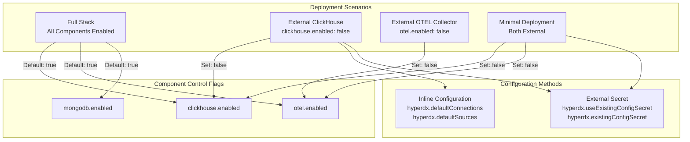
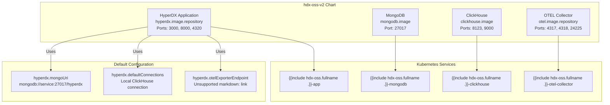
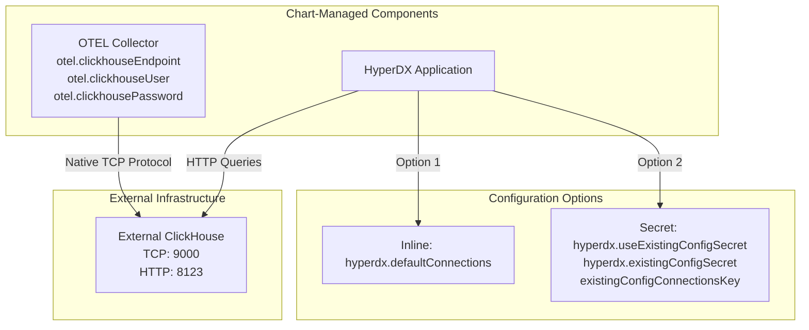
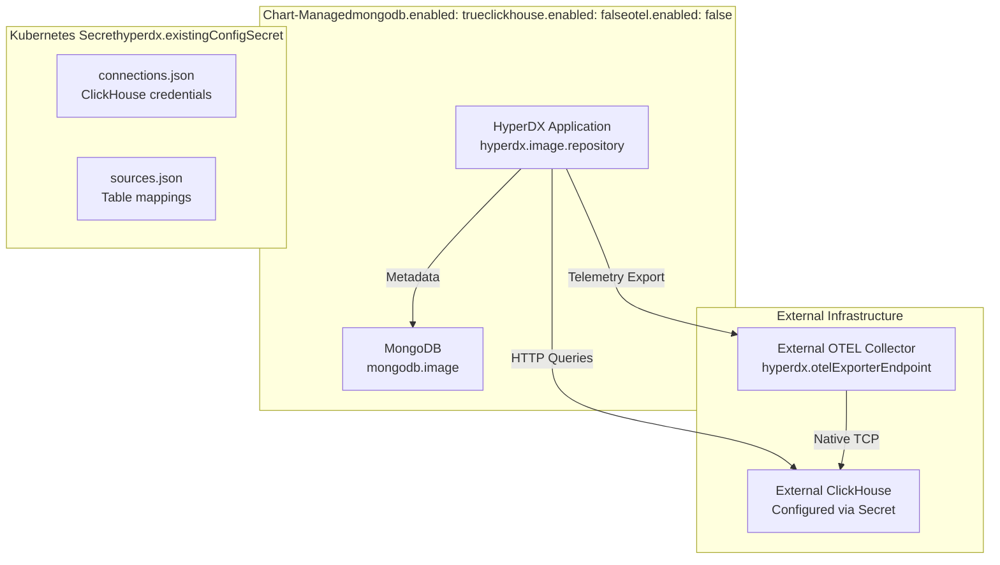
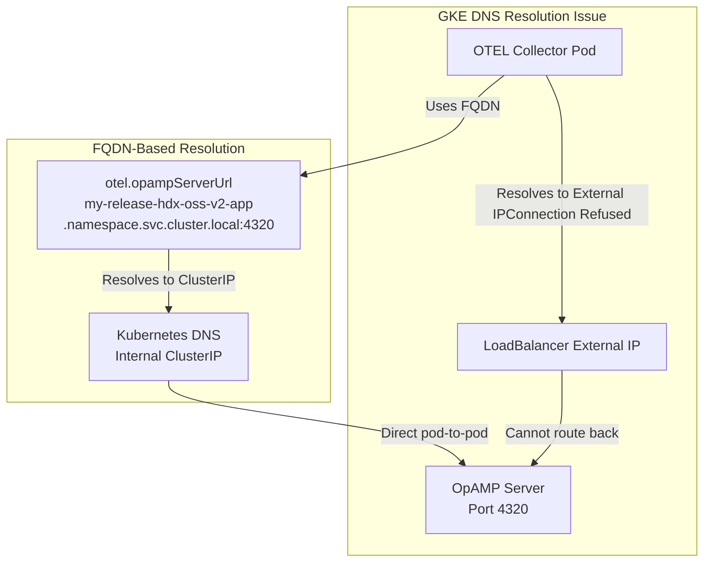

# Deployment Scenarios

> **Relevant source files**
> * [README.md](https://github.com/hyperdxio/helm-charts/blob/845dd482/README.md)
> * [charts/hdx-oss-v2/values.yaml](https://github.com/hyperdxio/helm-charts/blob/845dd482/charts/hdx-oss-v2/values.yaml)

This document describes the different deployment configurations supported by the HyperDX Helm chart. It covers progressive externalization patterns, from full-stack deployments where all components are managed by the chart, to minimal deployments where only the HyperDX application is deployed with external infrastructure dependencies. For detailed configuration of individual components, see [Configuration Reference](/hyperdxio/helm-charts/3-configuration-reference). For cloud-specific operational considerations beyond deployment configuration, see [Operations and Maintenance](/hyperdxio/helm-charts/8-operations-and-maintenance).

## Deployment Architecture Overview

The HyperDX Helm chart supports flexible deployment patterns based on whether components are managed internally by the chart or externally by your infrastructure:



**Sources:** [charts/hdx-oss-v2/values.yaml L1-L477](https://github.com/hyperdxio/helm-charts/blob/845dd482/charts/hdx-oss-v2/values.yaml#L1-L477)

 [README.md L54-L234](https://github.com/hyperdxio/helm-charts/blob/845dd482/README.md#L54-L234)

## Component Deployment Matrix

The following table shows which components are deployed in each scenario:

| Deployment Scenario | HyperDX App | MongoDB | ClickHouse | OTEL Collector | Configuration Method |
| --- | --- | --- | --- | --- | --- |
| Full Stack | ✓ | ✓ | ✓ | ✓ | Inline (default) |
| External ClickHouse | ✓ | ✓ | ✗ | ✓ | Inline or Secret |
| External OTEL | ✓ | ✓ | ✓ | ✗ | Inline (default) |
| Minimal | ✓ | ✓ | ✗ | ✗ | Secret (recommended) |

**Sources:** [charts/hdx-oss-v2/values.yaml L14-L62](https://github.com/hyperdxio/helm-charts/blob/845dd482/charts/hdx-oss-v2/values.yaml#L14-L62)

 [charts/hdx-oss-v2/values.yaml L256-L287](https://github.com/hyperdxio/helm-charts/blob/845dd482/charts/hdx-oss-v2/values.yaml#L256-L287)

 [charts/hdx-oss-v2/values.yaml L289-L367](https://github.com/hyperdxio/helm-charts/blob/845dd482/charts/hdx-oss-v2/values.yaml#L289-L367)

 [charts/hdx-oss-v2/values.yaml L368-L464](https://github.com/hyperdxio/helm-charts/blob/845dd482/charts/hdx-oss-v2/values.yaml#L368-L464)

## Full Stack Deployment

The default deployment configuration includes all components managed by the Helm chart. This is the recommended approach for development, testing, and production environments where you want a self-contained HyperDX deployment.

### Component Architecture



**Sources:** [charts/hdx-oss-v2/values.yaml L14-L62](https://github.com/hyperdxio/helm-charts/blob/845dd482/charts/hdx-oss-v2/values.yaml#L14-L62)

 [charts/hdx-oss-v2/values.yaml L256-L287](https://github.com/hyperdxio/helm-charts/blob/845dd482/charts/hdx-oss-v2/values.yaml#L256-L287)

 [charts/hdx-oss-v2/values.yaml L289-L367](https://github.com/hyperdxio/helm-charts/blob/845dd482/charts/hdx-oss-v2/values.yaml#L289-L367)

 [charts/hdx-oss-v2/values.yaml L368-L464](https://github.com/hyperdxio/helm-charts/blob/845dd482/charts/hdx-oss-v2/values.yaml#L368-L464)

### Installation Command

```
helm install my-hyperdx hyperdx/hdx-oss-v2
```

### Default Component Flags

All components are enabled by default:

* `clickhouse.enabled: true` - [values.yaml L321](https://github.com/hyperdxio/helm-charts/blob/845dd482/values.yaml#L321-L321)
* `mongodb.enabled: true` - [values.yaml L259](https://github.com/hyperdxio/helm-charts/blob/845dd482/values.yaml#L259-L259)
* `otel.enabled: true` - [values.yaml L405](https://github.com/hyperdxio/helm-charts/blob/845dd482/values.yaml#L405-L405)

### Default Connection Configuration

The chart automatically configures internal service connections using Helm template functions:

* **MongoDB URI**: [values.yaml L61](https://github.com/hyperdxio/helm-charts/blob/845dd482/values.yaml#L61-L61)  - `mongodb://{{ include "hdx-oss.fullname" . }}-mongodb:{{ .Values.mongodb.port }}/hyperdx`
* **OTEL Endpoint**: [values.yaml L60](https://github.com/hyperdxio/helm-charts/blob/845dd482/values.yaml#L60-L60)  - `http://{{ include "hdx-oss.fullname" . }}-otel-collector:{{ .Values.otel.httpPort }}`
* **ClickHouse Connection**: [values.yaml L92-L101](https://github.com/hyperdxio/helm-charts/blob/845dd482/values.yaml#L92-L101)  - Configured in `hyperdx.defaultConnections` with service name `{{ include "hdx-oss.fullname" . }}-clickhouse:8123`

**Sources:** [README.md L56-L68](https://github.com/hyperdxio/helm-charts/blob/845dd482/README.md#L56-L68)

 [charts/hdx-oss-v2/values.yaml L14-L101](https://github.com/hyperdxio/helm-charts/blob/845dd482/charts/hdx-oss-v2/values.yaml#L14-L101)

## External ClickHouse Deployment

When using an existing ClickHouse cluster, disable the built-in ClickHouse deployment and configure external connection details. This scenario is common for production environments with centralized data infrastructure.

### Configuration Architecture



**Sources:** [charts/hdx-oss-v2/values.yaml L289-L367](https://github.com/hyperdxio/helm-charts/blob/845dd482/charts/hdx-oss-v2/values.yaml#L289-L367)

 [charts/hdx-oss-v2/values.yaml L77-L101](https://github.com/hyperdxio/helm-charts/blob/845dd482/charts/hdx-oss-v2/values.yaml#L77-L101)

 [README.md L70-L183](https://github.com/hyperdxio/helm-charts/blob/845dd482/README.md#L70-L183)

### Configuration Method 1: Inline

Suitable for development and testing environments:

```yaml
clickhouse:
  enabled: false

otel:
  clickhouseEndpoint: "tcp://your-clickhouse-server:9000"
  clickhouseUser: "otelcollector"
  clickhousePassword: "your-password"

hyperdx:
  defaultConnections: |
    [
      {
        "name": "External ClickHouse",
        "host": "http://your-clickhouse-server:8123",
        "port": 8123,
        "username": "app",
        "password": "your-password"
      }
    ]
```

**Key Configuration Paths:**

* Disable built-in ClickHouse: [values.yaml L321](https://github.com/hyperdxio/helm-charts/blob/845dd482/values.yaml#L321-L321)  `clickhouse.enabled: false`
* OTEL native endpoint: [values.yaml L441-L446](https://github.com/hyperdxio/helm-charts/blob/845dd482/values.yaml#L441-L446)  `otel.clickhouseEndpoint`
* API HTTP connections: [values.yaml L92-L101](https://github.com/hyperdxio/helm-charts/blob/845dd482/values.yaml#L92-L101)  `hyperdx.defaultConnections`

**Sources:** [README.md L74-L96](https://github.com/hyperdxio/helm-charts/blob/845dd482/README.md#L74-L96)

 [charts/hdx-oss-v2/values.yaml L289-L367](https://github.com/hyperdxio/helm-charts/blob/845dd482/charts/hdx-oss-v2/values.yaml#L289-L367)

 [charts/hdx-oss-v2/values.yaml L441-L446](https://github.com/hyperdxio/helm-charts/blob/845dd482/charts/hdx-oss-v2/values.yaml#L441-L446)

### Configuration Method 2: External Secret

Recommended for production environments to separate sensitive credentials from Helm values:

```yaml
clickhouse:
  enabled: false

otel:
  clickhouseEndpoint: "tcp://your-clickhouse-server:9000"
  clickhouseUser: "otelcollector"
  clickhousePassword: "your-password"

hyperdx:
  useExistingConfigSecret: true
  existingConfigSecret: "hyperdx-external-config"
  existingConfigConnectionsKey: "connections.json"
  existingConfigSourcesKey: "sources.json"
```

**Secret Creation:**

```sql
kubectl create secret generic hyperdx-external-config \
  --from-file=connections.json=connections.json \
  --from-file=sources.json=sources.json
```

**Configuration Flags:**

* Enable external secret: [values.yaml L87](https://github.com/hyperdxio/helm-charts/blob/845dd482/values.yaml#L87-L87)  `hyperdx.useExistingConfigSecret: true`
* Secret name: [values.yaml L88](https://github.com/hyperdxio/helm-charts/blob/845dd482/values.yaml#L88-L88)  `hyperdx.existingConfigSecret`
* Connections key: [values.yaml L89](https://github.com/hyperdxio/helm-charts/blob/845dd482/values.yaml#L89-L89)  `hyperdx.existingConfigConnectionsKey`
* Sources key: [values.yaml L90](https://github.com/hyperdxio/helm-charts/blob/845dd482/values.yaml#L90-L90)  `hyperdx.existingConfigSourcesKey`

**Sources:** [README.md L98-L183](https://github.com/hyperdxio/helm-charts/blob/845dd482/README.md#L98-L183)

 [charts/hdx-oss-v2/values.yaml L77-L91](https://github.com/hyperdxio/helm-charts/blob/845dd482/charts/hdx-oss-v2/values.yaml#L77-L91)

### ClickHouse Port Configuration

External ClickHouse requires two different endpoints:

| Port | Protocol | Used By | Configuration Path | Purpose |
| --- | --- | --- | --- | --- |
| 9000 | Native TCP | OTEL Collector | `otel.clickhouseEndpoint` | Writing telemetry data |
| 8123 | HTTP | HyperDX API | `hyperdx.defaultConnections[].host` | Querying data |

**Sources:** [charts/hdx-oss-v2/values.yaml L289-L292](https://github.com/hyperdxio/helm-charts/blob/845dd482/charts/hdx-oss-v2/values.yaml#L289-L292)

 [charts/hdx-oss-v2/values.yaml L441-L446](https://github.com/hyperdxio/helm-charts/blob/845dd482/charts/hdx-oss-v2/values.yaml#L441-L446)

 [charts/hdx-oss-v2/values.yaml L92-L101](https://github.com/hyperdxio/helm-charts/blob/845dd482/charts/hdx-oss-v2/values.yaml#L92-L101)

## External OTEL Collector Deployment

Use this scenario when you have an existing OpenTelemetry Collector infrastructure and want to integrate HyperDX as a backend for data visualization and querying.

### Configuration

```yaml
otel:
  enabled: false

hyperdx:
  otelExporterEndpoint: "http://your-otel-collector:4318"
```

**Configuration Paths:**

* Disable built-in OTEL: [values.yaml L405](https://github.com/hyperdxio/helm-charts/blob/845dd482/values.yaml#L405-L405)  `otel.enabled: false`
* HyperDX telemetry endpoint: [values.yaml L60](https://github.com/hyperdxio/helm-charts/blob/845dd482/values.yaml#L60-L60)  `hyperdx.otelExporterEndpoint`

### External OTEL Requirements

Your external OTEL Collector must:

1. Accept OTLP/HTTP on the configured endpoint
2. Export data to ClickHouse (either the chart's built-in or external)
3. Use the ClickHouse schema expected by HyperDX (tables: `otel_logs`, `otel_traces`, `otel_metrics_*`)

**Sources:** [README.md L186-L197](https://github.com/hyperdxio/helm-charts/blob/845dd482/README.md#L186-L197)

 [charts/hdx-oss-v2/values.yaml L59-L60](https://github.com/hyperdxio/helm-charts/blob/845dd482/charts/hdx-oss-v2/values.yaml#L59-L60)

 [charts/hdx-oss-v2/values.yaml L405](https://github.com/hyperdxio/helm-charts/blob/845dd482/charts/hdx-oss-v2/values.yaml#L405-L405)

## Minimal Deployment

Deploys only the HyperDX application and MongoDB, with both ClickHouse and OTEL Collector external to the chart. This is the most lightweight deployment, suitable for organizations with existing observability infrastructure.

### Deployment Architecture



**Sources:** [README.md L204-L234](https://github.com/hyperdxio/helm-charts/blob/845dd482/README.md#L204-L234)

 [charts/hdx-oss-v2/values.yaml L14-L477](https://github.com/hyperdxio/helm-charts/blob/845dd482/charts/hdx-oss-v2/values.yaml#L14-L477)

### Configuration Example

```yaml
clickhouse:
  enabled: false

otel:
  enabled: false

hyperdx:
  otelExporterEndpoint: "http://your-otel-collector:4318"
  useExistingConfigSecret: true
  existingConfigSecret: "hyperdx-external-config"
  existingConfigConnectionsKey: "connections.json"
  existingConfigSourcesKey: "sources.json"
```

**Configuration Flags:**

* Disable ClickHouse: [values.yaml L321](https://github.com/hyperdxio/helm-charts/blob/845dd482/values.yaml#L321-L321)
* Disable OTEL: [values.yaml L405](https://github.com/hyperdxio/helm-charts/blob/845dd482/values.yaml#L405-L405)
* External OTEL endpoint: [values.yaml L60](https://github.com/hyperdxio/helm-charts/blob/845dd482/values.yaml#L60-L60)
* Use external secret: [values.yaml L87-L90](https://github.com/hyperdxio/helm-charts/blob/845dd482/values.yaml#L87-L90)

**Sources:** [README.md L207-L234](https://github.com/hyperdxio/helm-charts/blob/845dd482/README.md#L207-L234)

 [charts/hdx-oss-v2/values.yaml L321](https://github.com/hyperdxio/helm-charts/blob/845dd482/charts/hdx-oss-v2/values.yaml#L321-L321)

 [charts/hdx-oss-v2/values.yaml L405](https://github.com/hyperdxio/helm-charts/blob/845dd482/charts/hdx-oss-v2/values.yaml#L405-L405)

 [charts/hdx-oss-v2/values.yaml L87-L90](https://github.com/hyperdxio/helm-charts/blob/845dd482/charts/hdx-oss-v2/values.yaml#L87-L90)

## Cloud Provider Specific Configurations

Different cloud providers have specific networking characteristics that require configuration adjustments, particularly for `clusterCidrs` and service discovery.

### Google Kubernetes Engine (GKE)

GKE requires special handling for service discovery due to LoadBalancer DNS resolution behavior.

#### OpAMP Server FQDN Configuration



**Sources:** [README.md L530-L567](https://github.com/hyperdxio/helm-charts/blob/845dd482/README.md#L530-L567)

 [charts/hdx-oss-v2/values.yaml L437-L440](https://github.com/hyperdxio/helm-charts/blob/845dd482/charts/hdx-oss-v2/values.yaml#L437-L440)

#### GKE Configuration Values

```yaml
hyperdx:
  frontendUrl: "http://34.123.61.99"  # LoadBalancer external IP

otel:
  opampServerUrl: "http://my-hyperdx-hdx-oss-v2-app.default.svc.cluster.local:4320"

clickhouse:
  config:
    clusterCidrs:
      - "10.8.0.0/16"  # GKE default pod CIDR
      - "10.0.0.0/8"   # Fallback
```

**Configuration Paths:**

* Frontend URL: [values.yaml L52-L56](https://github.com/hyperdxio/helm-charts/blob/845dd482/values.yaml#L52-L56)  `hyperdx.frontendUrl`
* OpAMP FQDN: [values.yaml L437-L440](https://github.com/hyperdxio/helm-charts/blob/845dd482/values.yaml#L437-L440)  `otel.opampServerUrl`
* ClickHouse network access: [values.yaml L359-L366](https://github.com/hyperdxio/helm-charts/blob/845dd482/values.yaml#L359-L366)  `clickhouse.config.clusterCidrs`

**Symptoms of Misconfiguration:**

* OTEL collector logs: `dial tcp 34.118.227.30:4320: connect: connection refused`
* OpAMP connection failures in collector pod

**Sources:** [README.md L534-L567](https://github.com/hyperdxio/helm-charts/blob/845dd482/README.md#L534-L567)

 [charts/hdx-oss-v2/values.yaml L437-L440](https://github.com/hyperdxio/helm-charts/blob/845dd482/charts/hdx-oss-v2/values.yaml#L437-L440)

 [charts/hdx-oss-v2/values.yaml L359-L366](https://github.com/hyperdxio/helm-charts/blob/845dd482/charts/hdx-oss-v2/values.yaml#L359-L366)

### Amazon EKS

EKS deployments primarily require correct pod CIDR configuration for ClickHouse network access control.

```yaml
hyperdx:
  frontendUrl: "http://your-alb-domain.com"

clickhouse:
  config:
    clusterCidrs:
      - "192.168.0.0/16"  # Common EKS pod CIDR
      - "10.0.0.0/8"      # Alternative configurations

hyperdx:
  ingress:
    enabled: true
    host: "hyperdx.yourdomain.com"
    tls:
      enabled: true
```

**Configuration Paths:**

* Pod CIDRs: [values.yaml L363-L366](https://github.com/hyperdxio/helm-charts/blob/845dd482/values.yaml#L363-L366)  `clickhouse.config.clusterCidrs`
* Frontend URL: [values.yaml L52-L56](https://github.com/hyperdxio/helm-charts/blob/845dd482/values.yaml#L52-L56)  `hyperdx.frontendUrl`
* Ingress: [values.yaml L207-L221](https://github.com/hyperdxio/helm-charts/blob/845dd482/values.yaml#L207-L221)  `hyperdx.ingress`

**Sources:** [README.md L569-L593](https://github.com/hyperdxio/helm-charts/blob/845dd482/README.md#L569-L593)

 [charts/hdx-oss-v2/values.yaml L363-L366](https://github.com/hyperdxio/helm-charts/blob/845dd482/charts/hdx-oss-v2/values.yaml#L363-L366)

### Azure AKS

AKS uses different default pod CIDRs that must be configured for ClickHouse access control.

```yaml
hyperdx:
  frontendUrl: "http://your-azure-lb.com"

clickhouse:
  config:
    clusterCidrs:
      - "10.244.0.0/16"  # AKS default pod CIDR
      - "10.0.0.0/8"     # Fallback
```

**Configuration Paths:**

* Pod CIDRs: [values.yaml L363-L366](https://github.com/hyperdxio/helm-charts/blob/845dd482/values.yaml#L363-L366)  `clickhouse.config.clusterCidrs`

**Sources:** [README.md L595-L609](https://github.com/hyperdxio/helm-charts/blob/845dd482/README.md#L595-L609)

 [charts/hdx-oss-v2/values.yaml L363-L366](https://github.com/hyperdxio/helm-charts/blob/845dd482/charts/hdx-oss-v2/values.yaml#L363-L366)

### Cloud CIDR Configuration Table

| Provider | Default Pod CIDR | Configuration Path | Notes |
| --- | --- | --- | --- |
| GKE | `10.8.0.0/16` | [values.yaml L363-L366](https://github.com/hyperdxio/helm-charts/blob/845dd482/values.yaml#L363-L366) | Requires OpAMP FQDN |
| EKS | `192.168.0.0/16` | [values.yaml L363-L366](https://github.com/hyperdxio/helm-charts/blob/845dd482/values.yaml#L363-L366) | May vary by VPC config |
| AKS | `10.244.0.0/16` | [values.yaml L363-L366](https://github.com/hyperdxio/helm-charts/blob/845dd482/values.yaml#L363-L366) | Standard kubenet CIDR |
| Development | Multiple ranges | [values.yaml L363-L366](https://github.com/hyperdxio/helm-charts/blob/845dd482/values.yaml#L363-L366) | Includes Docker Desktop, Minikube |

**Purpose of `clusterCidrs`:**
The `clickhouse.config.clusterCidrs` configuration at [values.yaml L359-L366](https://github.com/hyperdxio/helm-charts/blob/845dd482/values.yaml#L359-L366)

 controls which IP ranges can access ClickHouse. This ensures that only pods within the Kubernetes cluster can connect to the database, preventing external access to the native TCP port (9000).

**Sources:** [charts/hdx-oss-v2/values.yaml L359-L366](https://github.com/hyperdxio/helm-charts/blob/845dd482/charts/hdx-oss-v2/values.yaml#L359-L366)

 [README.md L530-L609](https://github.com/hyperdxio/helm-charts/blob/845dd482/README.md#L530-L609)

## Configuration Method Comparison

### Inline vs External Secret Configuration

```mermaid
flowchart TD

K8sSecret["Kubernetes Secret<br>hyperdx.existingConfigSecret"]
SecretVolume["Volume Mount<br>/etc/hyperdx/config"]
SecretPod["HyperDX Pod<br>Reads from volume"]
InlineValues["values.yaml"]
InlineConfigMap["ConfigMap<br>app-config"]
InlinePod["HyperDX Pod<br>envFrom: configMapRef"]

subgraph SecretMethod ["External Secret Methodhyperdx.useExistingConfigSecret"]
    K8sSecret
    SecretVolume
    SecretPod
    K8sSecret -->|"volumeMount"| SecretVolume
    SecretVolume -->|"File System"| SecretPod
end

subgraph InlineMethod ["Inline Configurationhyperdx.defaultConnectionshyperdx.defaultSources"]
    InlineValues
    InlineConfigMap
    InlinePod
    InlineValues -->|"helm template"| InlineConfigMap
    InlineConfigMap -->|"Environment Variables"| InlinePod
end
```



**Sources:** [charts/hdx-oss-v2/values.yaml L77-L101](https://github.com/hyperdxio/helm-charts/blob/845dd482/charts/hdx-oss-v2/values.yaml#L77-L101)

 [README.md L98-L183](https://github.com/hyperdxio/helm-charts/blob/845dd482/README.md#L98-L183)

### Method Selection Guidelines

| Use Case | Recommended Method | Rationale |
| --- | --- | --- |
| Development/Testing | Inline | Simple, all config in one file |
| Production | External Secret | Credentials separated from Helm values |
| GitOps/Version Control | External Secret | Secrets managed outside of Git |
| External ClickHouse | External Secret | Centralized credential management |
| Minimal Deployment | External Secret | Required for sources configuration |
| Full Stack | Inline (default) | Auto-generated internal connections |

**Configuration Flags:**

* Enable external secret: [values.yaml L87](https://github.com/hyperdxio/helm-charts/blob/845dd482/values.yaml#L87-L87)  `hyperdx.useExistingConfigSecret: true`
* Disable inline config: Set `hyperdx.defaultConnections: ""` and `hyperdx.defaultSources: ""`

**Sources:** [charts/hdx-oss-v2/values.yaml L77-L91](https://github.com/hyperdxio/helm-charts/blob/845dd482/charts/hdx-oss-v2/values.yaml#L77-L91)

 [README.md L98-L183](https://github.com/hyperdxio/helm-charts/blob/845dd482/README.md#L98-L183)

### Secret Structure Requirements

When using external secrets, the secret must contain two JSON keys:

```yaml
apiVersion: v1
kind: Secret
metadata:
  name: hyperdx-external-config
type: Opaque
stringData:
  connections.json: |
    [
      {
        "name": "External ClickHouse",
        "host": "http://clickhouse.example.com:8123",
        "port": 8123,
        "username": "app",
        "password": "secure-password"
      }
    ]
  sources.json: |
    [
      {
        "from": {
          "databaseName": "default",
          "tableName": "otel_logs"
        },
        "kind": "log",
        "name": "Logs",
        "connection": "External ClickHouse",
        ...
      }
    ]
```

**Key Names (Configurable):**

* Connections: [values.yaml L89](https://github.com/hyperdxio/helm-charts/blob/845dd482/values.yaml#L89-L89)  `hyperdx.existingConfigConnectionsKey` (default: `"connections.json"`)
* Sources: [values.yaml L90](https://github.com/hyperdxio/helm-charts/blob/845dd482/values.yaml#L90-L90)  `hyperdx.existingConfigSourcesKey` (default: `"sources.json"`)

**Sources:** [README.md L119-L183](https://github.com/hyperdxio/helm-charts/blob/845dd482/README.md#L119-L183)

 [charts/hdx-oss-v2/values.yaml L87-L90](https://github.com/hyperdxio/helm-charts/blob/845dd482/charts/hdx-oss-v2/values.yaml#L87-L90)