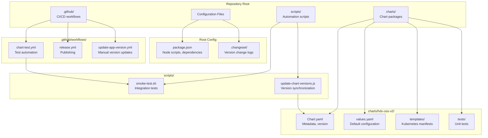
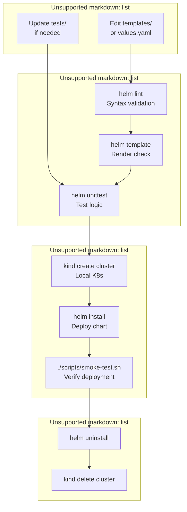
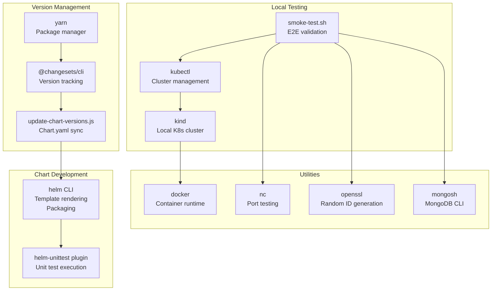
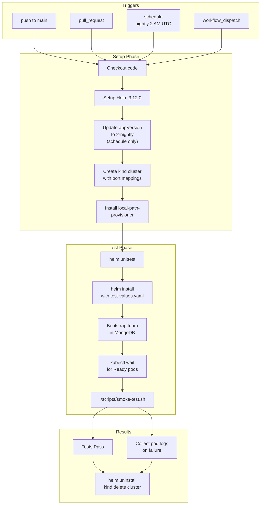

# Development Setup

> **Relevant source files**
> * [.github/workflows/chart-test.yml](https://github.com/hyperdxio/helm-charts/blob/845dd482/.github/workflows/chart-test.yml)
> * [charts/hdx-oss-v2/Chart.yaml](https://github.com/hyperdxio/helm-charts/blob/845dd482/charts/hdx-oss-v2/Chart.yaml)
> * [package.json](https://github.com/hyperdxio/helm-charts/blob/845dd482/package.json)
> * [scripts/smoke-test.sh](https://github.com/hyperdxio/helm-charts/blob/845dd482/scripts/smoke-test.sh)

## Purpose and Scope

This document describes how to set up a local development environment for contributing to the HyperDX Helm Charts repository. It covers the required tools, repository structure, and workflows for developing, testing, and validating chart changes locally.

For information about the release and versioning process, see [Release Management](/hyperdxio/helm-charts/9.3-release-management). For details about the CI/CD pipeline that runs in GitHub Actions, see [CI/CD Pipeline](/hyperdxio/helm-charts/9.4-cicd-pipeline). For comprehensive testing documentation, see [Testing](/hyperdxio/helm-charts/9.2-testing).

## Prerequisites

The following tools are required to develop and test the Helm charts locally:

| Tool | Minimum Version | Purpose |
| --- | --- | --- |
| `helm` | 3.12.0 | Helm CLI for chart development and templating |
| `kubectl` | 1.25+ | Kubernetes CLI for cluster interaction |
| `kind` | 0.20+ | Kubernetes in Docker for local testing |
| `docker` | 20.10+ | Container runtime required by kind |
| `node` | 18+ | JavaScript runtime for version management scripts |
| `yarn` | 4.9.2+ | Package manager (managed via Corepack) |
| `git` | 2.30+ | Version control |

Optional tools for enhanced development:

| Tool | Purpose |
| --- | --- |
| `helm-unittest` | Unit testing plugin for Helm charts |
| `nc` (netcat) | Network connectivity testing in smoke tests |
| `openssl` | Generating test data (trace IDs, span IDs) |
| `mongosh` | MongoDB shell for database verification |

Sources: [.github/workflows/chart-test.yml L24-L27](https://github.com/hyperdxio/helm-charts/blob/845dd482/.github/workflows/chart-test.yml#L24-L27)

 [package.json L18](https://github.com/hyperdxio/helm-charts/blob/845dd482/package.json#L18-L18)

## Repository Structure



**Development Environment File Structure**

Sources: [package.json L1-L19](https://github.com/hyperdxio/helm-charts/blob/845dd482/package.json#L1-L19)

 [charts/hdx-oss-v2/Chart.yaml L1-L7](https://github.com/hyperdxio/helm-charts/blob/845dd482/charts/hdx-oss-v2/Chart.yaml#L1-L7)

 [.github/workflows/chart-test.yml L1-L184](https://github.com/hyperdxio/helm-charts/blob/845dd482/.github/workflows/chart-test.yml#L1-L184)

### Key Files and Their Roles

| File Path | Purpose | Key Content |
| --- | --- | --- |
| `charts/hdx-oss-v2/Chart.yaml` | Chart metadata | Chart name, version (`0.8.4`), appVersion (`2.7.1`) |
| `charts/hdx-oss-v2/values.yaml` | Default configuration | Component settings, resources, image tags |
| `charts/hdx-oss-v2/templates/*.yaml` | Kubernetes manifests | Deployments, Services, ConfigMaps, etc. |
| `charts/hdx-oss-v2/tests/*.yaml` | Helm unit tests | Test cases for template rendering |
| `package.json` | Node.js project config | Scripts: `version`, `release`, `update-chart-versions` |
| `scripts/update-chart-versions.js` | Version sync script | Synchronizes Chart.yaml version with package.json |
| `scripts/smoke-test.sh` | Integration test suite | End-to-end deployment validation |
| `.changeset/*.md` | Version change logs | Describes changes for next release |
| `.github/workflows/chart-test.yml` | Test automation | Runs unit, integration, and smoke tests |

Sources: [package.json L1-L19](https://github.com/hyperdxio/helm-charts/blob/845dd482/package.json#L1-L19)

 [charts/hdx-oss-v2/Chart.yaml L1-L7](https://github.com/hyperdxio/helm-charts/blob/845dd482/charts/hdx-oss-v2/Chart.yaml#L1-L7)

## Initial Setup

### Clone and Install Dependencies

```markdown
# Clone the repository
git clone https://github.com/hyperdxio/helm-charts.git
cd helm-charts

# Enable Corepack for Yarn 4.x
corepack enable

# Install Node.js dependencies
yarn install
```

The repository uses Yarn 4.9.2 as specified in `package.json:18`. The primary dependencies are:

* `@changesets/cli` - Version management tool
* `js-yaml` - YAML parsing for version synchronization script

Sources: [package.json L14-L19](https://github.com/hyperdxio/helm-charts/blob/845dd482/package.json#L14-L19)

### Install Helm Plugin for Unit Testing

```markdown
# Install helm-unittest plugin
helm plugin install https://github.com/helm-unittest/helm-unittest.git

# Verify installation
helm unittest --help
```

This plugin is used in the CI workflow at [.github/workflows/chart-test.yml L64-L67](https://github.com/hyperdxio/helm-charts/blob/845dd482/.github/workflows/chart-test.yml#L64-L67)

 and enables local unit test execution.

Sources: [.github/workflows/chart-test.yml L64-L67](https://github.com/hyperdxio/helm-charts/blob/845dd482/.github/workflows/chart-test.yml#L64-L67)

## Local Development Workflow



**Local Development Iteration Cycle**

Sources: [.github/workflows/chart-test.yml L64-L103](https://github.com/hyperdxio/helm-charts/blob/845dd482/.github/workflows/chart-test.yml#L64-L103)

 [scripts/smoke-test.sh L1-L202](https://github.com/hyperdxio/helm-charts/blob/845dd482/scripts/smoke-test.sh#L1-L202)

### Step 1: Validate Chart Syntax

```markdown
# Lint the chart for syntax errors
helm lint charts/hdx-oss-v2

# Generate templates to verify rendering
helm template test-release charts/hdx-oss-v2 > /tmp/rendered.yaml

# Review rendered manifests
cat /tmp/rendered.yaml
```

The `helm lint` command validates:

* Chart.yaml structure
* Template syntax
* Required fields
* YAML formatting

### Step 2: Run Unit Tests

```markdown
# Run all unit tests
helm unittest charts/hdx-oss-v2

# Run with verbose output
helm unittest charts/hdx-oss-v2 -v

# Run specific test file
helm unittest charts/hdx-oss-v2 -f tests/deployment_test.yaml
```

Unit tests verify template logic, conditionals, and value substitutions without requiring a Kubernetes cluster.

Sources: [.github/workflows/chart-test.yml L64-L67](https://github.com/hyperdxio/helm-charts/blob/845dd482/.github/workflows/chart-test.yml#L64-L67)

### Step 3: Test with Local Kubernetes

Create a kind configuration file matching the CI environment:

```yaml
cat > kind-config.yaml << EOF
kind: Cluster
apiVersion: kind.x-k8s.io/v1alpha4
nodes:
- role: control-plane
  extraPortMappings:
  - containerPort: 30000
    hostPort: 3000
    protocol: TCP
  - containerPort: 30001
    hostPort: 4318
    protocol: TCP
EOF
```

This configuration mirrors [.github/workflows/chart-test.yml L37-L51](https://github.com/hyperdxio/helm-charts/blob/845dd482/.github/workflows/chart-test.yml#L37-L51)

 exposing:

* Port 3000: HyperDX UI
* Port 4318: OTLP HTTP endpoint

Sources: [.github/workflows/chart-test.yml L37-L51](https://github.com/hyperdxio/helm-charts/blob/845dd482/.github/workflows/chart-test.yml#L37-L51)

### Step 4: Create Test Environment

```python
# Create kind cluster
kind create cluster --name hyperdx-dev --config kind-config.yaml

# Install local-path-provisioner for persistent volumes
kubectl apply -f https://raw.githubusercontent.com/rancher/local-path-provisioner/v0.0.24/deploy/local-path-storage.yaml

# Set as default storage class
kubectl patch storageclass local-path -p '{"metadata": {"annotations":{"storageclass.kubernetes.io/is-default-class":"true"}}}'
```

The local-path-provisioner is required for ClickHouse and MongoDB PVCs. This setup matches [.github/workflows/chart-test.yml L59-L62](https://github.com/hyperdxio/helm-charts/blob/845dd482/.github/workflows/chart-test.yml#L59-L62)

Sources: [.github/workflows/chart-test.yml L53-L62](https://github.com/hyperdxio/helm-charts/blob/845dd482/.github/workflows/chart-test.yml#L53-L62)

### Step 5: Deploy Chart Locally

Create a minimal test values file:

```yaml
cat > test-values.yaml << EOF
hyperdx:
  apiKey: "dev-test-key"
  frontendUrl: "http://localhost:3000"
  replicas: 1
  service:
    type: NodePort
    nodePort: 30000

clickhouse:
  persistence:
    enabled: true
    dataSize: 2Gi
    logSize: 1Gi

mongodb:
  persistence:
    enabled: true
    dataSize: 2Gi

otel:
  resources:
    requests:
      memory: "128Mi"
      cpu: "100m"
    limits:
      memory: "256Mi"
      cpu: "200m"
EOF
```

This configuration matches [.github/workflows/chart-test.yml L71-L100](https://github.com/hyperdxio/helm-charts/blob/845dd482/.github/workflows/chart-test.yml#L71-L100)

 using reduced resource limits for local development.

Deploy the chart:

```markdown
# Install chart with test values
helm install hyperdx-dev ./charts/hdx-oss-v2 -f test-values.yaml --timeout=5m

# Watch pod startup
kubectl get pods -w
```

Sources: [.github/workflows/chart-test.yml L69-L107](https://github.com/hyperdxio/helm-charts/blob/845dd482/.github/workflows/chart-test.yml#L69-L107)

### Step 6: Bootstrap Test Data

The deployment requires a team entry in MongoDB to function properly:

```sql
# Wait for MongoDB to be ready
kubectl wait --for=condition=Ready pods -l app=mongodb --timeout=300s

# Create test team
kubectl exec deployment/hyperdx-dev-hdx-oss-v2-mongodb -- mongosh hyperdx --eval "
  db.teams.insertOne({
    name: 'Dev Test Team',
    apiKey: 'dev-test-key',
    collectorAuthenticationEnforced: false,
    createdAt: new Date(),
    updatedAt: new Date()
  })
"

# Wait for OpAMP server to reconfigure collectors
sleep 30
```

This bootstrap process mirrors [.github/workflows/chart-test.yml L109-L137](https://github.com/hyperdxio/helm-charts/blob/845dd482/.github/workflows/chart-test.yml#L109-L137)

 and is necessary for the OTEL Collector to accept telemetry data.

Sources: [.github/workflows/chart-test.yml L109-L137](https://github.com/hyperdxio/helm-charts/blob/845dd482/.github/workflows/chart-test.yml#L109-L137)

### Step 7: Run Smoke Tests

```markdown
# Make smoke test script executable
chmod +x ./scripts/smoke-test.sh

# Run comprehensive smoke tests
RELEASE_NAME=hyperdx-dev NAMESPACE=default ./scripts/smoke-test.sh
```

The smoke test script performs:

1. Pod readiness verification
2. UI endpoint accessibility check (`http://localhost:3000`)
3. OTEL Collector metrics endpoint check (`:8888/metrics`)
4. OTLP data ingestion test (sends test logs and traces)
5. Database connectivity verification (ClickHouse, MongoDB)
6. Data persistence validation

Sources: [scripts/smoke-test.sh L1-L202](https://github.com/hyperdxio/helm-charts/blob/845dd482/scripts/smoke-test.sh#L1-L202)

 [.github/workflows/chart-test.yml L152-L156](https://github.com/hyperdxio/helm-charts/blob/845dd482/.github/workflows/chart-test.yml#L152-L156)

### Step 8: Manual Testing

Access deployed services:

```css
# Access HyperDX UI
open http://localhost:3000

# Port-forward API for direct access
kubectl port-forward service/hyperdx-dev-hdx-oss-v2-app 8000:8000 &

# Port-forward ClickHouse HTTP interface
kubectl port-forward service/hyperdx-dev-hdx-oss-v2-clickhouse 8123:8123 &

# Send test telemetry
curl -X POST http://localhost:4318/v1/logs \
  -H "Content-Type: application/json" \
  -d '{
    "resourceLogs": [{
      "resource": {
        "attributes": [
          {"key": "service.name", "value": {"stringValue": "test-service"}}
        ]
      },
      "scopeLogs": [{
        "logRecords": [{
          "timeUnixNano": "'$(date +%s)'000000000",
          "body": {"stringValue": "Test log message"}
        }]
      }]
    }]
  }'
```

### Step 9: Clean Up

```sql
# Uninstall Helm release
helm uninstall hyperdx-dev

# Delete kind cluster
kind delete cluster --name hyperdx-dev
```

Sources: [.github/workflows/chart-test.yml L179-L183](https://github.com/hyperdxio/helm-charts/blob/845dd482/.github/workflows/chart-test.yml#L179-L183)

## Development Tools Deep Dive



**Development Toolchain Architecture**

Sources: [package.json L1-L19](https://github.com/hyperdxio/helm-charts/blob/845dd482/package.json#L1-L19)

 [scripts/smoke-test.sh L1-L202](https://github.com/hyperdxio/helm-charts/blob/845dd482/scripts/smoke-test.sh#L1-L202)

 [.github/workflows/chart-test.yml L24-L62](https://github.com/hyperdxio/helm-charts/blob/845dd482/.github/workflows/chart-test.yml#L24-L62)

### Helm and helm-unittest

The `helm` CLI (version 3.12.0+) provides:

* **Template rendering**: `helm template` generates Kubernetes manifests
* **Linting**: `helm lint` validates chart structure
* **Installation**: `helm install` deploys to Kubernetes
* **Packaging**: `helm package` creates `.tgz` archives

The `helm-unittest` plugin extends Helm with testing capabilities:

* Test file location: `charts/hdx-oss-v2/tests/*.yaml`
* Syntax: Similar to Jest/Mocha with assertions
* Execution: `helm unittest charts/hdx-oss-v2`

Sources: [.github/workflows/chart-test.yml L24-L27](https://github.com/hyperdxio/helm-charts/blob/845dd482/.github/workflows/chart-test.yml#L24-L27)

 [.github/workflows/chart-test.yml L64-L67](https://github.com/hyperdxio/helm-charts/blob/845dd482/.github/workflows/chart-test.yml#L64-L67)

### Kind (Kubernetes in Docker)

Kind provides ephemeral Kubernetes clusters for testing:

**Configuration**: [.github/workflows/chart-test.yml L37-L51](https://github.com/hyperdxio/helm-charts/blob/845dd482/.github/workflows/chart-test.yml#L37-L51)

```yaml
kind: Cluster
apiVersion: kind.x-k8s.io/v1alpha4
nodes:
- role: control-plane
  extraPortMappings:
  - containerPort: 30000    # HyperDX UI NodePort
    hostPort: 3000
  - containerPort: 30001    # OTLP HTTP NodePort
    hostPort: 4318
```

**Commands**:

* Create: `kind create cluster --name hyperdx-dev --config kind-config.yaml`
* Delete: `kind delete cluster --name hyperdx-dev`
* List: `kind get clusters`

Sources: [.github/workflows/chart-test.yml L37-L57](https://github.com/hyperdxio/helm-charts/blob/845dd482/.github/workflows/chart-test.yml#L37-L57)

### Version Management with Changesets

The repository uses `@changesets/cli` for semantic versioning:

**package.json scripts**: [package.json L9-L12](https://github.com/hyperdxio/helm-charts/blob/845dd482/package.json#L9-L12)

* `yarn run version`: Consumes changesets, bumps versions
* `yarn run update-chart-versions`: Syncs `Chart.yaml` with `package.json`
* `yarn run release`: Publishes releases

**Workflow**:

1. Developer creates `.changeset/*.md` file describing change
2. CI runs `yarn run version` which: * Updates `package.json:3` version * Generates/updates `CHANGELOG.md` * Runs `update-chart-versions.js` to sync `Chart.yaml:5`

Sources: [package.json L9-L12](https://github.com/hyperdxio/helm-charts/blob/845dd482/package.json#L9-L12)

### Smoke Test Script Analysis

The `scripts/smoke-test.sh` script provides comprehensive validation:

| Test Phase | Lines | Purpose |
| --- | --- | --- |
| Pod Readiness | [scripts/smoke-test.sh L54-L59](https://github.com/hyperdxio/helm-charts/blob/845dd482/scripts/smoke-test.sh#L54-L59) | Waits for all pods to be `Ready` |
| UI Accessibility | [scripts/smoke-test.sh L61-L71](https://github.com/hyperdxio/helm-charts/blob/845dd482/scripts/smoke-test.sh#L61-L71) | Port-forwards and checks HTTP 200 |
| OTEL Metrics | [scripts/smoke-test.sh L73-L83](https://github.com/hyperdxio/helm-charts/blob/845dd482/scripts/smoke-test.sh#L73-L83) | Verifies `:8888/metrics` endpoint |
| Data Ingestion | [scripts/smoke-test.sh L85-L160](https://github.com/hyperdxio/helm-charts/blob/845dd482/scripts/smoke-test.sh#L85-L160) | Sends test logs and traces via OTLP |
| Database Tests | [scripts/smoke-test.sh L162-L177](https://github.com/hyperdxio/helm-charts/blob/845dd482/scripts/smoke-test.sh#L162-L177) | Executes queries in ClickHouse and MongoDB |
| Data Verification | [scripts/smoke-test.sh L179-L194](https://github.com/hyperdxio/helm-charts/blob/845dd482/scripts/smoke-test.sh#L179-L194) | Queries for ingested test data |

**Helper Functions**:

* `wait_for_service()`: [scripts/smoke-test.sh L13-L34](https://github.com/hyperdxio/helm-charts/blob/845dd482/scripts/smoke-test.sh#L13-L34)  - Retries URL checks
* `check_endpoint()`: [scripts/smoke-test.sh L36-L52](https://github.com/hyperdxio/helm-charts/blob/845dd482/scripts/smoke-test.sh#L36-L52)  - Validates HTTP status codes

Sources: [scripts/smoke-test.sh L1-L202](https://github.com/hyperdxio/helm-charts/blob/845dd482/scripts/smoke-test.sh#L1-L202)

## CI Workflow Integration

The local development workflow mirrors the CI pipeline defined in `.github/workflows/chart-test.yml`:



**CI/CD Test Workflow Execution Flow**

Sources: [.github/workflows/chart-test.yml L1-L184](https://github.com/hyperdxio/helm-charts/blob/845dd482/.github/workflows/chart-test.yml#L1-L184)

### Nightly Testing with Latest Images

The CI workflow includes special handling for nightly builds: [.github/workflows/chart-test.yml L29-L35](https://github.com/hyperdxio/helm-charts/blob/845dd482/.github/workflows/chart-test.yml#L29-L35)

```
if [ "$GITHUB_EVENT_NAME" = "schedule" ]; then
  sed -i 's/^appVersion:.*/appVersion: 2-nightly/' charts/hdx-oss-v2/Chart.yaml
fi
```

This updates the `appVersion` to `2-nightly` for scheduled runs, testing against the latest development images instead of stable releases.

Sources: [.github/workflows/chart-test.yml L29-L35](https://github.com/hyperdxio/helm-charts/blob/845dd482/.github/workflows/chart-test.yml#L29-L35)

### Failure Diagnostics

On test failure, the CI collects comprehensive logs: [.github/workflows/chart-test.yml L158-L177](https://github.com/hyperdxio/helm-charts/blob/845dd482/.github/workflows/chart-test.yml#L158-L177)

```markdown
# Pod status and events
kubectl get pods -o wide
kubectl get events --sort-by=.metadata.creationTimestamp

# Component logs (last 100 lines)
kubectl logs -l app=app --tail=100
kubectl logs -l app=clickhouse --tail=100
kubectl logs -l app=mongodb --tail=100
kubectl logs -l app=otel-collector --tail=100
```

Sources: [.github/workflows/chart-test.yml L158-L177](https://github.com/hyperdxio/helm-charts/blob/845dd482/.github/workflows/chart-test.yml#L158-L177)

## Common Development Tasks

### Testing Template Changes

When modifying templates:

```markdown
# Render templates with default values
helm template test ./charts/hdx-oss-v2 > default.yaml

# Render with custom values
helm template test ./charts/hdx-oss-v2 -f test-values.yaml > custom.yaml

# Compare outputs
diff default.yaml custom.yaml

# Check specific resource
helm template test ./charts/hdx-oss-v2 --show-only templates/deployment.yaml
```

### Testing Value Overrides

Verify that value overrides work correctly:

```markdown
# Test with external ClickHouse disabled
helm template test ./charts/hdx-oss-v2 \
  --set clickhouse.enabled=false \
  --set hyperdx.defaultConnections.clickhouse.host=external-ch.example.com

# Test with custom image registry
helm template test ./charts/hdx-oss-v2 \
  --set imageRegistry=myregistry.io

# Test with TLS enabled
helm template test ./charts/hdx-oss-v2 \
  --set ingress.tls.enabled=true \
  --set ingress.hostname=hyperdx.local
```

### Debugging Deployment Issues

Use kubectl to investigate issues:

```html
# Check pod status
kubectl get pods -l app.kubernetes.io/instance=hyperdx-dev

# Describe pod for events
kubectl describe pod <pod-name>

# View logs
kubectl logs <pod-name> -f

# Execute commands in pod
kubectl exec -it <pod-name> -- /bin/sh

# Check persistent volume claims
kubectl get pvc

# Inspect service endpoints
kubectl get endpoints
```

### Testing Configuration Changes

Validate ConfigMap and Secret generation:

```markdown
# Show only config resources
helm template test ./charts/hdx-oss-v2 \
  --show-only templates/configmap.yaml

helm template test ./charts/hdx-oss-v2 \
  --show-only templates/secret.yaml

# Verify environment variable injection
helm template test ./charts/hdx-oss-v2 \
  --show-only templates/deployment.yaml | grep -A 50 "env:"
```

## Version Management in Development

### Understanding Version Numbers

The chart uses two version numbers: [charts/hdx-oss-v2/Chart.yaml L5-L6](https://github.com/hyperdxio/helm-charts/blob/845dd482/charts/hdx-oss-v2/Chart.yaml#L5-L6)

* **Chart version** (`0.8.4`): Version of the Helm chart packaging
* **appVersion** (`2.7.1`): Version of the HyperDX application

**Chart version** increments when:

* Template changes
* Configuration changes
* Documentation updates

**appVersion** increments when:

* New HyperDX application release
* Docker image tag updates

### Synchronizing Versions

The `update-chart-versions.js` script maintains consistency between `package.json:3` and `Chart.yaml:5`:

```sql
# Run version sync manually
node scripts/update-chart-versions.js

# Automatically triggered by
yarn run version
```

Sources: [package.json L11-L12](https://github.com/hyperdxio/helm-charts/blob/845dd482/package.json#L11-L12)

## Environment Variables

The smoke test script accepts environment configuration:

| Variable | Default | Purpose |
| --- | --- | --- |
| `NAMESPACE` | `default` | Kubernetes namespace for testing |
| `RELEASE_NAME` | `hyperdx-test` | Helm release name |
| `TIMEOUT` | `300` | Pod readiness timeout in seconds |

Usage:

```
NAMESPACE=dev RELEASE_NAME=my-test TIMEOUT=600 ./scripts/smoke-test.sh
```

Sources: [scripts/smoke-test.sh L5-L7](https://github.com/hyperdxio/helm-charts/blob/845dd482/scripts/smoke-test.sh#L5-L7)

## Best Practices for Chart Development

1. **Always run unit tests** before integration testing * Fast feedback loop * Catches template errors early
2. **Use kind for local testing** instead of production clusters * Isolated environment * Easy cleanup
3. **Test with minimal resources** during development * Faster startup times * Lower system requirements
4. **Bootstrap test data** after deployment * MongoDB team entry required for OTEL Collector * Matches production setup
5. **Clean up between test runs** * Prevents port conflicts * Ensures clean state
6. **Review rendered manifests** before deploying * Validates template logic * Catches configuration errors

Sources: [.github/workflows/chart-test.yml L1-L184](https://github.com/hyperdxio/helm-charts/blob/845dd482/.github/workflows/chart-test.yml#L1-L184)

 [scripts/smoke-test.sh L1-L202](https://github.com/hyperdxio/helm-charts/blob/845dd482/scripts/smoke-test.sh#L1-L202)