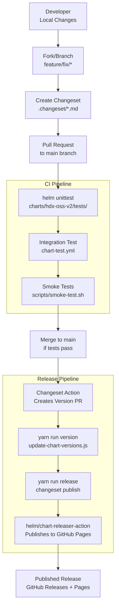
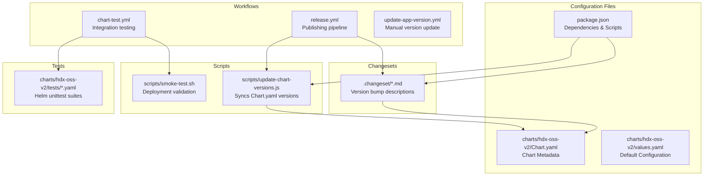
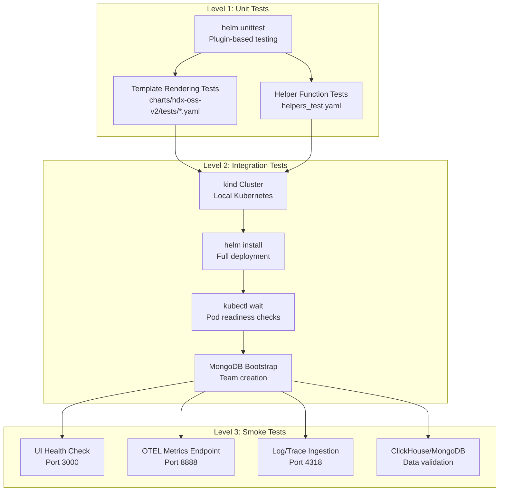
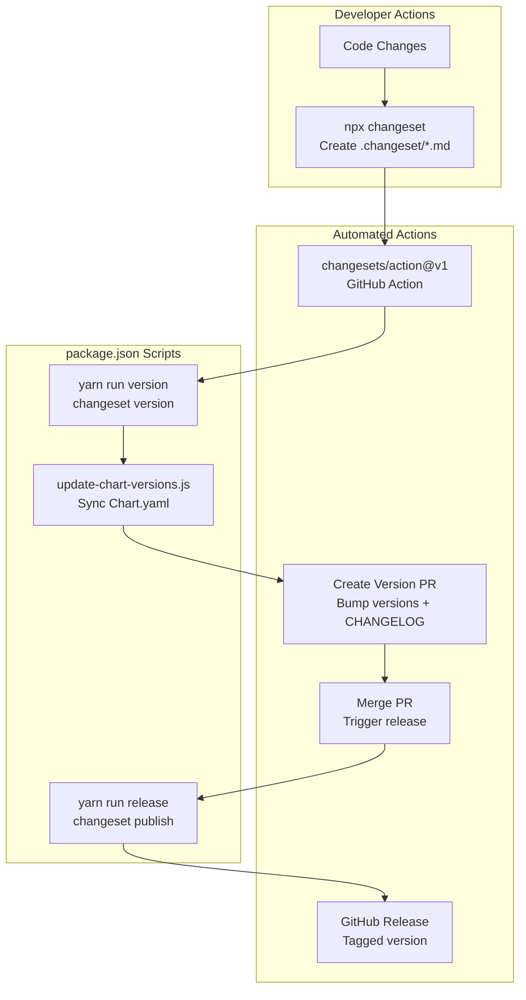
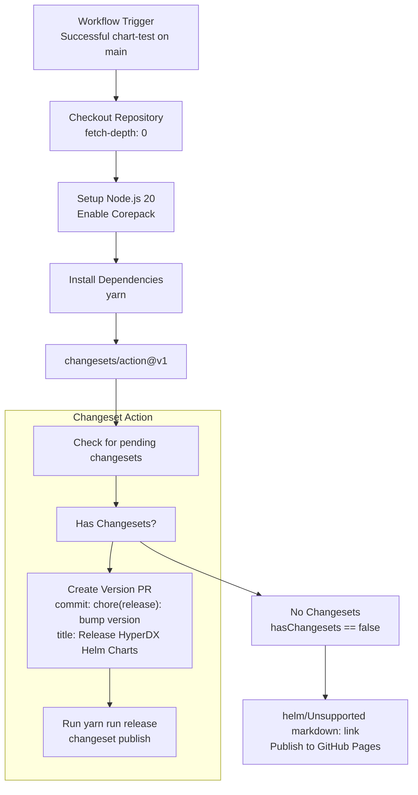

# Development and Contributing

> **Relevant source files**
> * [.github/workflows/chart-test.yml](https://github.com/hyperdxio/helm-charts/blob/845dd482/.github/workflows/chart-test.yml)
> * [.github/workflows/release.yml](https://github.com/hyperdxio/helm-charts/blob/845dd482/.github/workflows/release.yml)
> * [charts/hdx-oss-v2/tests/helpers_test.yaml](https://github.com/hyperdxio/helm-charts/blob/845dd482/charts/hdx-oss-v2/tests/helpers_test.yaml)
> * [package.json](https://github.com/hyperdxio/helm-charts/blob/845dd482/package.json)
> * [scripts/smoke-test.sh](https://github.com/hyperdxio/helm-charts/blob/845dd482/scripts/smoke-test.sh)

This document provides an overview of how to contribute to the HyperDX Helm Charts repository. It covers the development workflow, testing methodology, version management approach, and CI/CD pipeline that automates chart validation and publication.

**Scope**: This page provides a high-level introduction to the development process. For detailed information about specific topics, see:

* Development environment setup: [Development Setup](/hyperdxio/helm-charts/9.1-development-setup)
* Detailed testing procedures: [Testing](/hyperdxio/helm-charts/9.2-testing)
* Version management with changesets: [Release Management](/hyperdxio/helm-charts/9.3-release-management)
* GitHub Actions workflows: [CI/CD Pipeline](/hyperdxio/helm-charts/9.4-cicd-pipeline)
* Chart versioning and packaging: [Chart Metadata and Packaging](/hyperdxio/helm-charts/9.5-chart-metadata-and-packaging)

## Development Workflow Overview

The repository uses a changeset-based workflow for managing versions and releases. All code changes follow a standard pull request workflow with automated testing before merge.

### Contribution Flow



**Contribution Workflow Diagram**: Shows the complete flow from local development through testing, merge, and automated release.

Sources: [.github/workflows/release.yml L1-L51](https://github.com/hyperdxio/helm-charts/blob/845dd482/.github/workflows/release.yml#L1-L51)

 [.github/workflows/chart-test.yml L1-L184](https://github.com/hyperdxio/helm-charts/blob/845dd482/.github/workflows/chart-test.yml#L1-L184)

 [package.json L1-L19](https://github.com/hyperdxio/helm-charts/blob/845dd482/package.json#L1-L19)

## Repository Structure

The repository is organized with the following key components for development and contribution:

| Component | Location | Purpose |
| --- | --- | --- |
| Helm Chart | `charts/hdx-oss-v2/` | Chart templates, values, metadata |
| Unit Tests | `charts/hdx-oss-v2/tests/` | Helm unittest test suites |
| Integration Tests | `.github/workflows/chart-test.yml` | Full deployment testing workflow |
| Smoke Tests | `scripts/smoke-test.sh` | Post-deployment validation script |
| Changesets | `.changeset/` | Version change descriptions |
| Version Scripts | `scripts/update-chart-versions.js` | Chart version synchronization |
| CI Workflows | `.github/workflows/` | Automated testing and release |
| Package Config | `package.json` | Node.js dependencies and scripts |

### Key Development Files



**Development File Structure**: Key files and their relationships in the development workflow.

Sources: [package.json L1-L19](https://github.com/hyperdxio/helm-charts/blob/845dd482/package.json#L1-L19)

 [.github/workflows/chart-test.yml L1-L184](https://github.com/hyperdxio/helm-charts/blob/845dd482/.github/workflows/chart-test.yml#L1-L184)

 [.github/workflows/release.yml L1-L51](https://github.com/hyperdxio/helm-charts/blob/845dd482/.github/workflows/release.yml#L1-L51)

 [scripts/smoke-test.sh L1-L202](https://github.com/hyperdxio/helm-charts/blob/845dd482/scripts/smoke-test.sh#L1-L202)

## Testing Architecture

The repository implements a three-tier testing strategy to validate chart changes:

### Test Levels



**Testing Architecture**: Three-tier testing approach from unit tests to integration to smoke tests.

Sources: [.github/workflows/chart-test.yml L64-L157](https://github.com/hyperdxio/helm-charts/blob/845dd482/.github/workflows/chart-test.yml#L64-L157)

 [scripts/smoke-test.sh L1-L202](https://github.com/hyperdxio/helm-charts/blob/845dd482/scripts/smoke-test.sh#L1-L202)

 [charts/hdx-oss-v2/tests/helpers_test.yaml L1-L50](https://github.com/hyperdxio/helm-charts/blob/845dd482/charts/hdx-oss-v2/tests/helpers_test.yaml#L1-L50)

### Test Execution Flow

Tests are executed automatically on pull requests and merges to the main branch:

1. **Unit Tests** ([.github/workflows/chart-test.yml L64-L67](https://github.com/hyperdxio/helm-charts/blob/845dd482/.github/workflows/chart-test.yml#L64-L67) ): Run `helm unittest` against test suites in `charts/hdx-oss-v2/tests/`
2. **Integration Tests** ([.github/workflows/chart-test.yml L69-L138](https://github.com/hyperdxio/helm-charts/blob/845dd482/.github/workflows/chart-test.yml#L69-L138) ): Deploy chart to kind cluster, bootstrap MongoDB with test team, wait for readiness
3. **Smoke Tests** ([scripts/smoke-test.sh L1-L202](https://github.com/hyperdxio/helm-charts/blob/845dd482/scripts/smoke-test.sh#L1-L202) ): Validate endpoints, test data ingestion, verify database connectivity

The test workflow also supports nightly builds ([.github/workflows/chart-test.yml L29-L35](https://github.com/hyperdxio/helm-charts/blob/845dd482/.github/workflows/chart-test.yml#L29-L35)

) that automatically update `appVersion` to `2-nightly` for testing the latest development version of HyperDX.

## Version Management with Changesets

The repository uses the `@changesets/cli` package for managing versions and changelogs. This approach decouples version decisions from code changes and automates changelog generation.

### Changeset Workflow



**Version Management Flow**: How changesets flow through the versioning and release pipeline.

Sources: [package.json L9-L12](https://github.com/hyperdxio/helm-charts/blob/845dd482/package.json#L9-L12)

 [.github/workflows/release.yml L36-L45](https://github.com/hyperdxio/helm-charts/blob/845dd482/.github/workflows/release.yml#L36-L45)

### Scripts and Commands

The following npm/yarn scripts manage the versioning process:

| Script | Command | Purpose |
| --- | --- | --- |
| `version` | `changeset version && npm run update-chart-versions` | Consume changesets, bump versions, update Chart.yaml |
| `update-chart-versions` | `node scripts/update-chart-versions.js` | Synchronize package.json version to Chart.yaml |
| `release` | `changeset publish` | Create GitHub releases (triggered after version PR merge) |

These scripts are invoked by the GitHub Actions workflow in [.github/workflows/release.yml L42-L43](https://github.com/hyperdxio/helm-charts/blob/845dd482/.github/workflows/release.yml#L42-L43)

 which uses the `changesets/action@v1` to orchestrate the process.

## CI/CD Pipeline

The repository uses GitHub Actions workflows to automate testing, versioning, and publishing. The workflows are triggered by different events to support both continuous integration and release automation.

### Workflow Trigger Matrix

| Workflow | File | Triggers | Purpose |
| --- | --- | --- | --- |
| Integration Tests | `chart-test.yml` | Push to main, PRs, nightly schedule, manual | Full deployment testing |
| Release | `release.yml` | Successful test workflow on main | Version management and publishing |
| Update App Version | `update-app-version.yml` | Manual workflow_dispatch | Update HyperDX appVersion |

### Release Workflow Details

The release workflow ([.github/workflows/release.yml L1-L51](https://github.com/hyperdxio/helm-charts/blob/845dd482/.github/workflows/release.yml#L1-L51)

) executes the following steps:



**Release Pipeline**: The automated release workflow triggered by successful tests.

Sources: [.github/workflows/release.yml L1-L51](https://github.com/hyperdxio/helm-charts/blob/845dd482/.github/workflows/release.yml#L1-L51)

The workflow uses two key actions:

* **changesets/action@v1** ([.github/workflows/release.yml L38-L45](https://github.com/hyperdxio/helm-charts/blob/845dd482/.github/workflows/release.yml#L38-L45) ): Manages version bumps and PR creation
* **helm/chart-releaser-action@v1.7.0** ([.github/workflows/release.yml L48-L50](https://github.com/hyperdxio/helm-charts/blob/845dd482/.github/workflows/release.yml#L48-L50) ): Packages and publishes charts to GitHub Pages

### Concurrency Control

The release workflow implements concurrency control ([.github/workflows/release.yml L10](https://github.com/hyperdxio/helm-charts/blob/845dd482/.github/workflows/release.yml#L10-L10)

):

```
concurrency: ${{ github.workflow }}-${{ github.ref }}
```

This ensures only one release workflow runs per branch at a time, preventing race conditions in version management.

## Contributing Guidelines

### Prerequisites

To contribute to this repository, you need:

1. **Git**: Version control system
2. **Helm**: Version 3.12.0 or later (used in CI: [.github/workflows/chart-test.yml L26-L27](https://github.com/hyperdxio/helm-charts/blob/845dd482/.github/workflows/chart-test.yml#L26-L27) )
3. **Node.js**: Version 20 (used in CI: [.github/workflows/release.yml L28-L31](https://github.com/hyperdxio/helm-charts/blob/845dd482/.github/workflows/release.yml#L28-L31) )
4. **Yarn**: Version 4.9.2 or later ([package.json L18](https://github.com/hyperdxio/helm-charts/blob/845dd482/package.json#L18-L18) )
5. **kubectl**: For local testing
6. **kind** (optional): For local integration testing

### Development Process

1. **Fork and Clone**: Fork the repository and clone your fork locally
2. **Create Branch**: Create a feature or fix branch from `main`
3. **Make Changes**: Modify chart templates, values, or other files
4. **Create Changeset**: Run `npx changeset` to describe your changes
5. **Run Tests**: Execute unit tests locally with `helm unittest charts/hdx-oss-v2`
6. **Submit PR**: Create a pull request targeting the `main` branch
7. **CI Validation**: Wait for automated tests to pass
8. **Review**: Address review feedback from maintainers
9. **Merge**: Once approved and tests pass, the PR will be merged

### Changeset Creation

When creating a changeset, you'll be prompted to:

1. Select which packages are affected (typically `helm-charts`)
2. Choose version bump type: `major`, `minor`, or `patch`
3. Provide a summary of changes for the changelog

Example changeset file ([.changeset/*.md](https://github.com/hyperdxio/helm-charts/blob/845dd482/.changeset/*.md)

):

```
---
"helm-charts": patch
---

Fix ClickHouse persistence configuration for external storage classes
```

### Testing Your Changes

Before submitting a PR:

1. **Unit Tests**: Run `helm unittest charts/hdx-oss-v2` to validate template rendering
2. **Lint Templates**: Run `helm lint charts/hdx-oss-v2` to check for issues
3. **Render Templates**: Run `helm template test charts/hdx-oss-v2 -f your-values.yaml` to inspect generated manifests
4. **Integration Test** (optional): Use kind to test full deployment locally

The CI pipeline will automatically run all test suites ([.github/workflows/chart-test.yml L1-L184](https://github.com/hyperdxio/helm-charts/blob/845dd482/.github/workflows/chart-test.yml#L1-L184)

) when you submit your PR.

## Integration Testing Environment

The integration tests use a kind cluster with specific port mappings to enable local testing:

```python
# kind-config.yaml (from chart-test.yml:37-51)
kind: Cluster
apiVersion: kind.x-k8s.io/v1alpha4
nodes:
- role: control-plane
  extraPortMappings:
  - containerPort: 30000
    hostPort: 3000
    protocol: TCP
  - containerPort: 30001
    hostPort: 4318
    protocol: TCP
```

This configuration:

* Maps HyperDX UI (NodePort 30000) to localhost:3000
* Maps OTEL HTTP endpoint (NodePort 30001) to localhost:4318
* Enables testing without external ingress setup

The test deployment uses minimal resource allocations ([.github/workflows/chart-test.yml L73-L100](https://github.com/hyperdxio/helm-charts/blob/845dd482/.github/workflows/chart-test.yml#L73-L100)

) to run efficiently in CI:

* ClickHouse: 2Gi data + 1Gi logs
* MongoDB: 2Gi data
* OTEL Collector: 128Mi-256Mi memory, 100m-200m CPU

Sources: [.github/workflows/chart-test.yml L37-L100](https://github.com/hyperdxio/helm-charts/blob/845dd482/.github/workflows/chart-test.yml#L37-L100)

 [scripts/smoke-test.sh L1-L202](https://github.com/hyperdxio/helm-charts/blob/845dd482/scripts/smoke-test.sh#L1-L202)

## Chart Version vs. App Version

The chart maintains two distinct version numbers:

| Version | Location | Purpose | Updated By |
| --- | --- | --- | --- |
| Chart Version | `Chart.yaml` `version` field | Chart packaging changes | `update-chart-versions.js` |
| App Version | `Chart.yaml` `appVersion` field | HyperDX application version | Manual or automated workflow |

**Chart Version**: Incremented for any change to the Helm chart itself (templates, values, configurations). Follows semantic versioning based on changesets.

**App Version**: Tracks the version of the HyperDX application being deployed. Can be updated independently via the `update-app-version.yml` workflow or synchronized with chart releases.

The `scripts/update-chart-versions.js` script ensures that the chart version in `Chart.yaml` stays synchronized with the version in `package.json` during the release process.

Sources: [package.json L3](https://github.com/hyperdxio/helm-charts/blob/845dd482/package.json#L3-L3)

 [.github/workflows/release.yml L42](https://github.com/hyperdxio/helm-charts/blob/845dd482/.github/workflows/release.yml#L42-L42)

## Smoke Test Implementation

The smoke test script ([scripts/smoke-test.sh L1-L202](https://github.com/hyperdxio/helm-charts/blob/845dd482/scripts/smoke-test.sh#L1-L202)

) performs comprehensive validation:

1. **Pod Readiness** ([scripts/smoke-test.sh L54-L59](https://github.com/hyperdxio/helm-charts/blob/845dd482/scripts/smoke-test.sh#L54-L59) ): Waits for all pods with release label to become ready
2. **UI Accessibility** ([scripts/smoke-test.sh L62-L68](https://github.com/hyperdxio/helm-charts/blob/845dd482/scripts/smoke-test.sh#L62-L68) ): Port-forwards to UI service and checks HTTP 200 response
3. **OTEL Metrics** ([scripts/smoke-test.sh L74-L81](https://github.com/hyperdxio/helm-charts/blob/845dd482/scripts/smoke-test.sh#L74-L81) ): Validates OTEL Collector metrics endpoint
4. **Data Ingestion** ([scripts/smoke-test.sh L86-L158](https://github.com/hyperdxio/helm-charts/blob/845dd482/scripts/smoke-test.sh#L86-L158) ): Sends test logs and traces via OTLP HTTP protocol
5. **Database Connectivity** ([scripts/smoke-test.sh L163-L177](https://github.com/hyperdxio/helm-charts/blob/845dd482/scripts/smoke-test.sh#L163-L177) ): Executes test queries against ClickHouse and MongoDB
6. **Data Verification** ([scripts/smoke-test.sh L180-L194](https://github.com/hyperdxio/helm-charts/blob/845dd482/scripts/smoke-test.sh#L180-L194) ): Queries ClickHouse for ingested test data

The script uses environment variables for configuration:

* `NAMESPACE`: Kubernetes namespace (default: `default`)
* `RELEASE_NAME`: Helm release name (default: `hyperdx-test`)
* `TIMEOUT`: Readiness timeout in seconds (default: `300`)

Sources: [scripts/smoke-test.sh L1-L202](https://github.com/hyperdxio/helm-charts/blob/845dd482/scripts/smoke-test.sh#L1-L202)

---

**Related Documentation**: For implementation details of the topics covered here, refer to the child pages: [Development Setup](/hyperdxio/helm-charts/9.1-development-setup), [Testing](/hyperdxio/helm-charts/9.2-testing), [Release Management](/hyperdxio/helm-charts/9.3-release-management), [CI/CD Pipeline](/hyperdxio/helm-charts/9.4-cicd-pipeline), and [Chart Metadata and Packaging](/hyperdxio/helm-charts/9.5-chart-metadata-and-packaging).