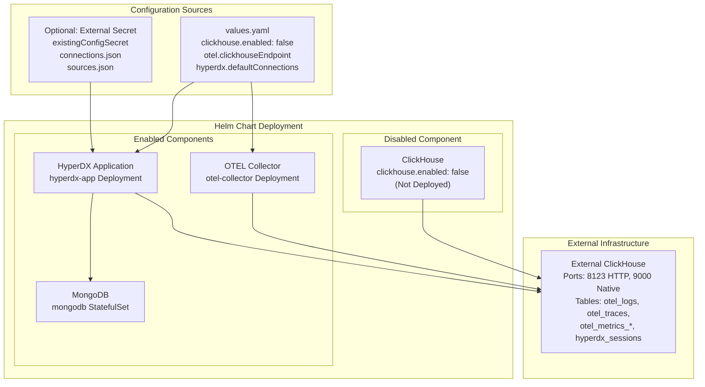
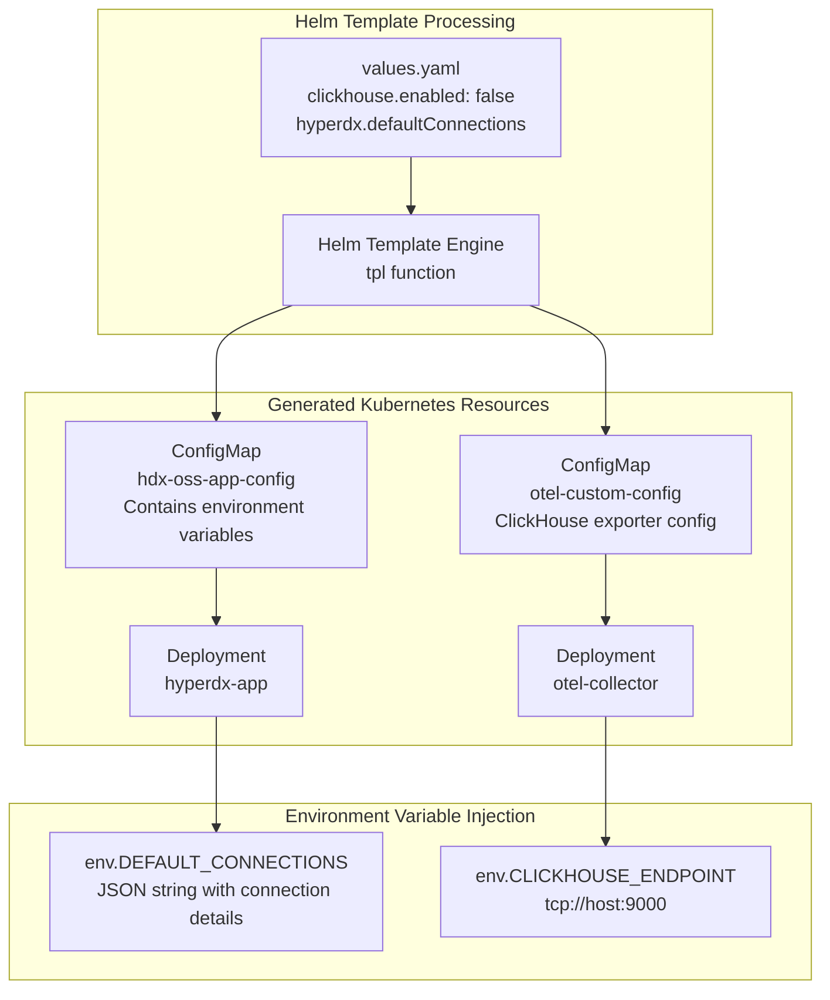
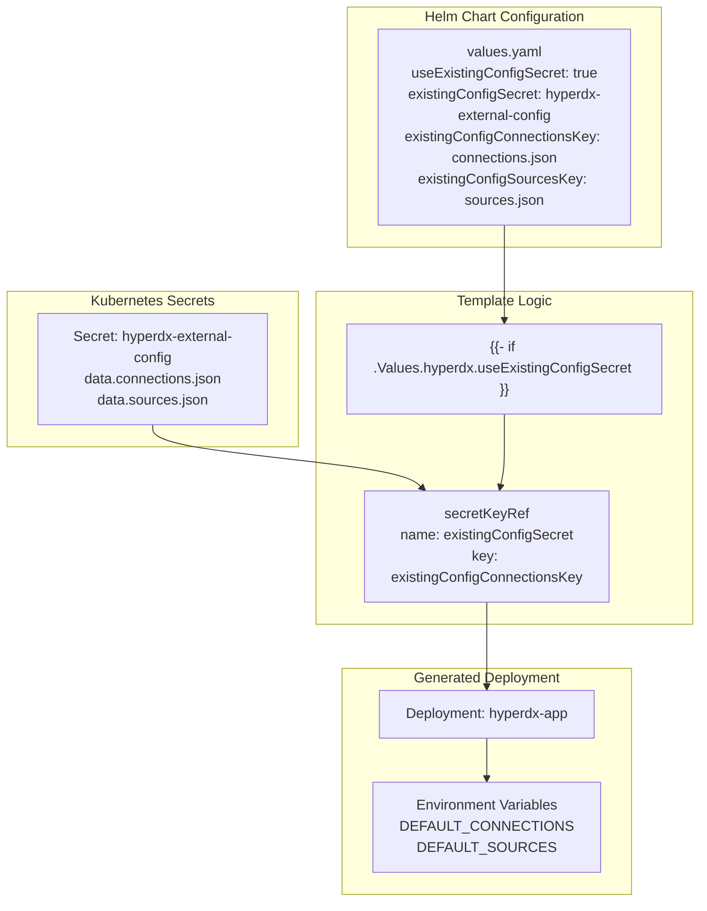
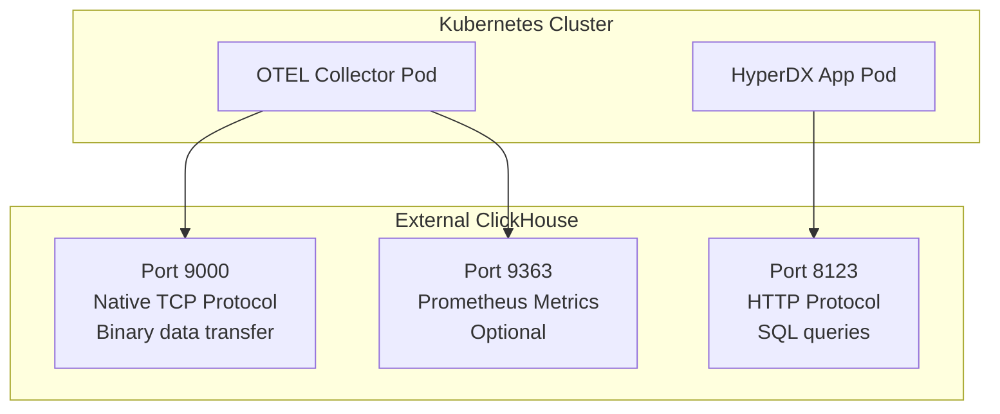
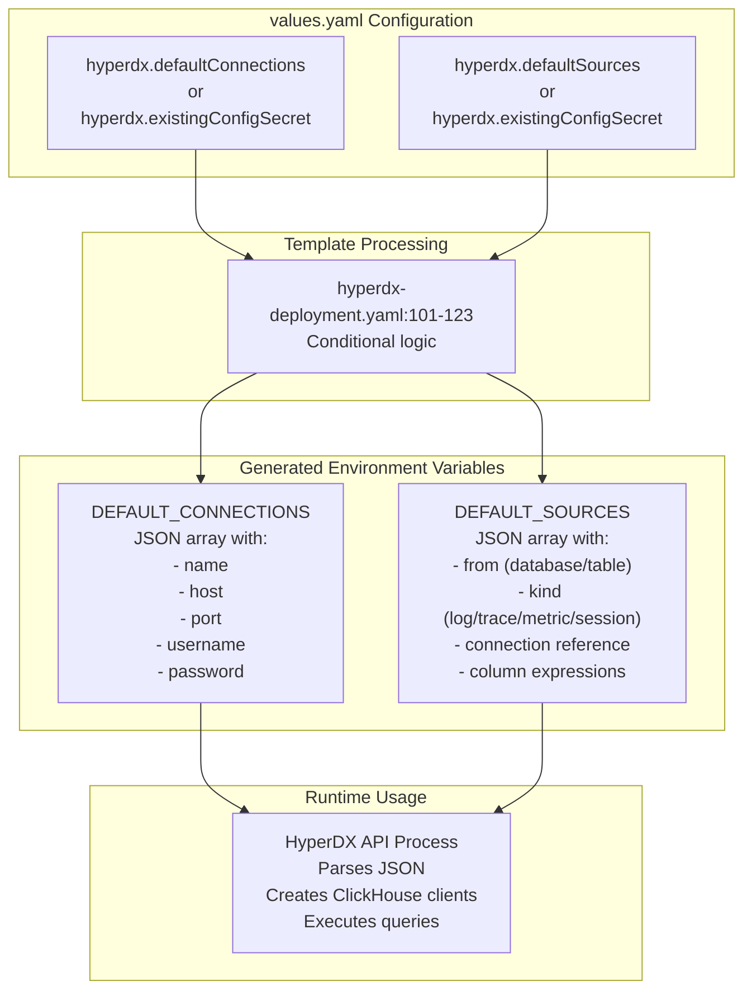

# External ClickHouse

> **Relevant source files**
> * [README.md](https://github.com/hyperdxio/helm-charts/blob/845dd482/README.md)
> * [charts/hdx-oss-v2/templates/hyperdx-deployment.yaml](https://github.com/hyperdxio/helm-charts/blob/845dd482/charts/hdx-oss-v2/templates/hyperdx-deployment.yaml)
> * [charts/hdx-oss-v2/values.yaml](https://github.com/hyperdxio/helm-charts/blob/845dd482/charts/hdx-oss-v2/values.yaml)

## Purpose and Scope

This page documents how to deploy HyperDX using an external ClickHouse cluster instead of the built-in ClickHouse instance provided by the Helm chart. This deployment scenario is useful when you have an existing ClickHouse infrastructure, need to share ClickHouse across multiple HyperDX instances, or require a production-grade managed ClickHouse service.

For information about the built-in ClickHouse deployment and its configuration, see [ClickHouse Database](/hyperdxio/helm-charts/5.2-clickhouse-database). For a complete minimal deployment with both external ClickHouse and external OTEL Collector, see [Minimal Deployment](/hyperdxio/helm-charts/4.4-minimal-deployment). For the default full-stack deployment, see [Full Stack Deployment](/hyperdxio/helm-charts/4.1-full-stack-deployment).

## Architecture Overview

When deploying with external ClickHouse, the Helm chart disables the built-in ClickHouse StatefulSet and reconfigures two primary components to connect to your external cluster:

1. **OTEL Collector** - Configured to export telemetry data to the external ClickHouse instance
2. **HyperDX Application** - Configured to query the external ClickHouse for data visualization



**Diagram: External ClickHouse Deployment Architecture**

Sources: [charts/hdx-oss-v2/values.yaml L289-L367](https://github.com/hyperdxio/helm-charts/blob/845dd482/charts/hdx-oss-v2/values.yaml#L289-L367)

 [charts/hdx-oss-v2/values.yaml L441-L452](https://github.com/hyperdxio/helm-charts/blob/845dd482/charts/hdx-oss-v2/values.yaml#L441-L452)

 [README.md L70-L98](https://github.com/hyperdxio/helm-charts/blob/845dd482/README.md#L70-L98)

## Configuration Components

Three primary configuration sections must be modified when using an external ClickHouse cluster:

| Configuration Area | Values Key | Purpose | Required |
| --- | --- | --- | --- |
| Disable Built-in ClickHouse | `clickhouse.enabled` | Prevents deployment of ClickHouse StatefulSet | Yes |
| OTEL Collector Endpoint | `otel.clickhouseEndpoint` | Configures where OTEL writes telemetry data | Yes |
| HyperDX Connection | `hyperdx.defaultConnections` | Configures HyperDX API to query ClickHouse | Yes |
| ClickHouse Credentials (OTEL) | `otel.clickhouseUser`, `otel.clickhousePassword` | Credentials for OTEL Collector to write data | If auth enabled |
| ClickHouse Database | `otel.clickhouseDatabase` | Target database for telemetry data | No (default: "default") |
| Prometheus Endpoint | `otel.clickhousePrometheusEndpoint` | Optional metrics scraping from ClickHouse | No |

Sources: [charts/hdx-oss-v2/values.yaml L289-L321](https://github.com/hyperdxio/helm-charts/blob/845dd482/charts/hdx-oss-v2/values.yaml#L289-L321)

 [charts/hdx-oss-v2/values.yaml L441-L452](https://github.com/hyperdxio/helm-charts/blob/845dd482/charts/hdx-oss-v2/values.yaml#L441-L452)

 [charts/hdx-oss-v2/values.yaml L92-L101](https://github.com/hyperdxio/helm-charts/blob/845dd482/charts/hdx-oss-v2/values.yaml#L92-L101)

## Configuration Method 1: Inline Configuration

The inline configuration method embeds ClickHouse connection details directly in the `values.yaml` file. This approach is simpler for development and testing environments but exposes credentials in the Helm configuration.

### Minimal Configuration Example

```css
# values-external-clickhouse.yaml
clickhouse:
  enabled: false  # Disable built-in ClickHouse

otel:
  clickhouseEndpoint: "tcp://your-clickhouse-server.example.com:9000"
  clickhouseUser: "otelcollector"
  clickhousePassword: "otelcollectorpass"
  clickhouseDatabase: "default"
  
hyperdx:
  defaultConnections: |
    [
      {
        "name": "External ClickHouse",
        "host": "http://your-clickhouse-server.example.com:8123",
        "port": 8123,
        "username": "app",
        "password": "hyperdx"
      }
    ]
```

### How Inline Configuration is Processed



**Diagram: Inline Configuration Flow from values.yaml to Running Pods**

The `tpl` function in Helm templates evaluates the `defaultConnections` string, allowing Helm template expressions within the JSON configuration. This is used in [charts/hdx-oss-v2/templates/hyperdx-deployment.yaml L117](https://github.com/hyperdxio/helm-charts/blob/845dd482/charts/hdx-oss-v2/templates/hyperdx-deployment.yaml#L117-L117)

 where `tpl .Values.hyperdx.defaultConnections .` renders the connection template.

Sources: [charts/hdx-oss-v2/values.yaml L92-L101](https://github.com/hyperdxio/helm-charts/blob/845dd482/charts/hdx-oss-v2/values.yaml#L92-L101)

 [charts/hdx-oss-v2/templates/hyperdx-deployment.yaml L115-L122](https://github.com/hyperdxio/helm-charts/blob/845dd482/charts/hdx-oss-v2/templates/hyperdx-deployment.yaml#L115-L122)

### Connection JSON Schema

The `defaultConnections` value must be a JSON array with objects containing these fields:

| Field | Type | Description | Example |
| --- | --- | --- | --- |
| `name` | string | Display name for the connection | `"External ClickHouse"` |
| `host` | string | HTTP endpoint URL including protocol | `"http://clickhouse.example.com:8123"` |
| `port` | number | HTTP port for queries | `8123` |
| `username` | string | ClickHouse user for HyperDX queries | `"app"` |
| `password` | string | Password for the ClickHouse user | `"hyperdx"` |

The HyperDX API uses this connection to execute ClickHouse HTTP queries for logs, traces, metrics, and sessions data. The connection name is referenced in `defaultSources` configuration at [charts/hdx-oss-v2/values.yaml L124](https://github.com/hyperdxio/helm-charts/blob/845dd482/charts/hdx-oss-v2/values.yaml#L124-L124)

 [charts/hdx-oss-v2/values.yaml L153](https://github.com/hyperdxio/helm-charts/blob/845dd482/charts/hdx-oss-v2/values.yaml#L153-L153)

 [charts/hdx-oss-v2/values.yaml L174](https://github.com/hyperdxio/helm-charts/blob/845dd482/charts/hdx-oss-v2/values.yaml#L174-L174)

 and [charts/hdx-oss-v2/values.yaml L197](https://github.com/hyperdxio/helm-charts/blob/845dd482/charts/hdx-oss-v2/values.yaml#L197-L197)

Sources: [charts/hdx-oss-v2/values.yaml L92-L101](https://github.com/hyperdxio/helm-charts/blob/845dd482/charts/hdx-oss-v2/values.yaml#L92-L101)

 [charts/hdx-oss-v2/values.yaml L104-L202](https://github.com/hyperdxio/helm-charts/blob/845dd482/charts/hdx-oss-v2/values.yaml#L104-L202)

## Configuration Method 2: External Secret (Production)

For production deployments, credentials should be managed through Kubernetes Secrets rather than inline in `values.yaml`. This approach separates sensitive data from Helm chart configuration and integrates with secret management systems.

### External Secret Configuration

```yaml
# values-external-clickhouse-secret.yaml
clickhouse:
  enabled: false

otel:
  clickhouseEndpoint: "tcp://your-clickhouse-server.example.com:9000"
  clickhouseUser: "otelcollector"
  clickhousePassword: "otelcollectorpass"

hyperdx:
  useExistingConfigSecret: true
  existingConfigSecret: "hyperdx-external-config"
  existingConfigConnectionsKey: "connections.json"
  existingConfigSourcesKey: "sources.json"
```

### Secret Creation Process

Create two JSON files containing the ClickHouse connection and data source configurations:

**connections.json:**

```json
[
  {
    "name": "Production ClickHouse",
    "host": "https://clickhouse.production.example.com:8123",
    "port": 8123,
    "username": "hyperdx_user",
    "password": "your-secure-password"
  }
]
```

**sources.json:**

```json
[
  {
    "from": {
      "databaseName": "default",
      "tableName": "otel_logs"
    },
    "kind": "log",
    "name": "Logs",
    "connection": "Production ClickHouse",
    "timestampValueExpression": "TimestampTime",
    "displayedTimestampValueExpression": "Timestamp",
    "implicitColumnExpression": "Body",
    "serviceNameExpression": "ServiceName",
    "bodyExpression": "Body",
    "eventAttributesExpression": "LogAttributes",
    "resourceAttributesExpression": "ResourceAttributes",
    "defaultTableSelectExpression": "Timestamp,ServiceName,SeverityText,Body",
    "severityTextExpression": "SeverityText",
    "traceIdExpression": "TraceId",
    "spanIdExpression": "SpanId",
    "traceSourceId": "Traces",
    "sessionSourceId": "Sessions",
    "metricSourceId": "Metrics"
  },
  {
    "from": {
      "databaseName": "default",
      "tableName": "otel_traces"
    },
    "kind": "trace",
    "name": "Traces",
    "connection": "Production ClickHouse",
    "timestampValueExpression": "Timestamp",
    "displayedTimestampValueExpression": "Timestamp",
    "implicitColumnExpression": "SpanName",
    "serviceNameExpression": "ServiceName",
    "bodyExpression": "SpanName",
    "eventAttributesExpression": "SpanAttributes",
    "resourceAttributesExpression": "ResourceAttributes",
    "defaultTableSelectExpression": "Timestamp,ServiceName,StatusCode,round(Duration/1e6),SpanName",
    "traceIdExpression": "TraceId",
    "spanIdExpression": "SpanId",
    "durationExpression": "Duration",
    "durationPrecision": 9,
    "parentSpanIdExpression": "ParentSpanId",
    "spanNameExpression": "SpanName",
    "spanKindExpression": "SpanKind",
    "statusCodeExpression": "StatusCode",
    "statusMessageExpression": "StatusMessage",
    "logSourceId": "Logs",
    "sessionSourceId": "Sessions",
    "metricSourceId": "Metrics"
  },
  {
    "from": {
      "databaseName": "default",
      "tableName": ""
    },
    "kind": "metric",
    "name": "Metrics",
    "connection": "Production ClickHouse",
    "timestampValueExpression": "TimeUnix",
    "resourceAttributesExpression": "ResourceAttributes",
    "metricTables": {
      "gauge": "otel_metrics_gauge",
      "histogram": "otel_metrics_histogram",
      "sum": "otel_metrics_sum"
    },
    "logSourceId": "Logs",
    "traceSourceId": "Traces",
    "sessionSourceId": "Sessions"
  },
  {
    "from": {
      "databaseName": "default",
      "tableName": "hyperdx_sessions"
    },
    "kind": "session",
    "name": "Sessions",
    "connection": "Production ClickHouse",
    "timestampValueExpression": "TimestampTime",
    "displayedTimestampValueExpression": "Timestamp",
    "implicitColumnExpression": "Body",
    "serviceNameExpression": "ServiceName",
    "bodyExpression": "Body",
    "eventAttributesExpression": "LogAttributes",
    "resourceAttributesExpression": "ResourceAttributes",
    "defaultTableSelectExpression": "Timestamp,ServiceName,SeverityText,Body",
    "severityTextExpression": "SeverityText",
    "traceIdExpression": "TraceId",
    "spanIdExpression": "SpanId",
    "logSourceId": "Logs",
    "traceSourceId": "Traces",
    "metricSourceId": "Metrics"
  }
]
```

Create the Kubernetes Secret:

```sql
kubectl create secret generic hyperdx-external-config \
  --from-file=connections.json=connections.json \
  --from-file=sources.json=sources.json

# Clean up local files
rm connections.json sources.json
```

Sources: [README.md L98-L183](https://github.com/hyperdxio/helm-charts/blob/845dd482/README.md#L98-L183)

 [charts/hdx-oss-v2/values.yaml L78-L90](https://github.com/hyperdxio/helm-charts/blob/845dd482/charts/hdx-oss-v2/values.yaml#L78-L90)

### External Secret Injection Flow



**Diagram: External Secret Configuration Flow**

The conditional logic at [charts/hdx-oss-v2/templates/hyperdx-deployment.yaml L101-L113](https://github.com/hyperdxio/helm-charts/blob/845dd482/charts/hdx-oss-v2/templates/hyperdx-deployment.yaml#L101-L113)

 checks `useExistingConfigSecret` and configures the `DEFAULT_CONNECTIONS` and `DEFAULT_SOURCES` environment variables using `secretKeyRef` instead of inline values.

Sources: [charts/hdx-oss-v2/templates/hyperdx-deployment.yaml L101-L123](https://github.com/hyperdxio/helm-charts/blob/845dd482/charts/hdx-oss-v2/templates/hyperdx-deployment.yaml#L101-L123)

 [charts/hdx-oss-v2/values.yaml L87-L90](https://github.com/hyperdxio/helm-charts/blob/845dd482/charts/hdx-oss-v2/values.yaml#L87-L90)

## OTEL Collector ClickHouse Configuration

The OTEL Collector requires separate configuration to write telemetry data to the external ClickHouse instance. The collector uses the native TCP protocol (port 9000) for high-performance data ingestion, while the HyperDX application uses HTTP (port 8123) for queries.

### OTEL Configuration Parameters

| Parameter | Purpose | Default | Notes |
| --- | --- | --- | --- |
| `otel.clickhouseEndpoint` | Native TCP endpoint for writing data | Uses chart's ClickHouse service | Format: `tcp://host:port` |
| `otel.clickhouseUser` | Username for authentication | Empty (uses config default) | Must have INSERT permissions |
| `otel.clickhousePassword` | Password for authentication | Empty (uses config default) | Recommend using external secret |
| `otel.clickhouseDatabase` | Target database name | `"default"` | Database must exist with proper schema |
| `otel.clickhousePrometheusEndpoint` | Optional Prometheus metrics scraping | Empty (disabled) | Format: `http://host:port` |

Configuration example for external ClickHouse:

```yaml
otel:
  clickhouseEndpoint: "tcp://clickhouse.production.example.com:9000"
  clickhouseUser: "otelcollector"
  clickhousePassword: "secure-password-here"
  clickhouseDatabase: "default"
  clickhousePrometheusEndpoint: "http://clickhouse.production.example.com:9363"
```

Sources: [charts/hdx-oss-v2/values.yaml L441-L452](https://github.com/hyperdxio/helm-charts/blob/845dd482/charts/hdx-oss-v2/values.yaml#L441-L452)

### OTEL ClickHouse Exporter Configuration

The OTEL Collector's ClickHouse exporter configuration is generated based on these values. When `clickhouseEndpoint` is provided, it overrides the default internal service endpoint. The collector environment variables are set based on these values and consumed by the collector's configuration file.

Required ClickHouse permissions for the OTEL user:

* `INSERT` on `otel_logs` table
* `INSERT` on `otel_traces` table
* `INSERT` on `otel_metrics_gauge` table
* `INSERT` on `otel_metrics_sum` table
* `INSERT` on `otel_metrics_histogram` table
* `INSERT` on `hyperdx_sessions` table

Sources: [charts/hdx-oss-v2/values.yaml L441-L446](https://github.com/hyperdxio/helm-charts/blob/845dd482/charts/hdx-oss-v2/values.yaml#L441-L446)

## Network Requirements and Access Control

External ClickHouse deployments must be accessible from the Kubernetes cluster where HyperDX is deployed. Network configuration requirements differ between the OTEL Collector and the HyperDX application.

### Required Network Connectivity



**Diagram: Network Connectivity Requirements**

| Source | Target Port | Protocol | Purpose | Volume |
| --- | --- | --- | --- | --- |
| OTEL Collector | 9000 | Native TCP | Write logs, traces, metrics, sessions | High (continuous stream) |
| HyperDX API | 8123 | HTTP/HTTPS | Query telemetry data for UI | Low-Medium (on-demand) |
| OTEL Collector | 9363 | HTTP | Scrape ClickHouse metrics (optional) | Low (periodic polling) |

Sources: [charts/hdx-oss-v2/values.yaml L289-L292](https://github.com/hyperdxio/helm-charts/blob/845dd482/charts/hdx-oss-v2/values.yaml#L289-L292)

 [charts/hdx-oss-v2/values.yaml L441-L450](https://github.com/hyperdxio/helm-charts/blob/845dd482/charts/hdx-oss-v2/values.yaml#L441-L450)

### ClickHouse Access Control Configuration

When using external ClickHouse, you must configure ClickHouse's network access control to allow connections from your Kubernetes cluster. The built-in ClickHouse configuration includes `clusterCidrs` at [charts/hdx-oss-v2/values.yaml L363-L366](https://github.com/hyperdxio/helm-charts/blob/845dd482/charts/hdx-oss-v2/values.yaml#L363-L366)

 for reference.

For your external ClickHouse, add similar network restrictions in your ClickHouse configuration:

**ClickHouse `config.xml` example:**

```xml
<clickhouse>
  <networks>
    <ip>::/0</ip>  <!-- Allow all IPs (for testing only) -->
    <!-- Or restrict to specific CIDRs: -->
    <ip>10.0.0.0/8</ip>      <!-- Kubernetes pod network -->
    <ip>172.16.0.0/12</ip>   <!-- Additional cluster network -->
  </networks>
</clickhouse>
```

Determine your Kubernetes cluster's pod CIDR:

```
kubectl cluster-info dump | grep -m 1 cluster-cidr
```

Common cloud provider pod CIDRs:

* **GKE**: `10.8.0.0/16` or `10.0.0.0/8`
* **EKS**: `192.168.0.0/16` or `10.0.0.0/8`
* **AKS**: `10.244.0.0/16` or `10.0.0.0/8`

Sources: [charts/hdx-oss-v2/values.yaml L359-L366](https://github.com/hyperdxio/helm-charts/blob/845dd482/charts/hdx-oss-v2/values.yaml#L359-L366)

## Required ClickHouse Schema

Your external ClickHouse instance must have the required tables and schema before deploying HyperDX. The OpenTelemetry Collector expects specific table structures for writing telemetry data.

### Required Tables

The following tables must exist in your target database (default: `default`):

| Table Name | Purpose | Used By |
| --- | --- | --- |
| `otel_logs` | OpenTelemetry log records | OTEL Collector (write), HyperDX API (read) |
| `otel_traces` | OpenTelemetry trace spans | OTEL Collector (write), HyperDX API (read) |
| `otel_metrics_gauge` | Gauge metric data points | OTEL Collector (write), HyperDX API (read) |
| `otel_metrics_sum` | Sum/counter metric data points | OTEL Collector (write), HyperDX API (read) |
| `otel_metrics_histogram` | Histogram metric data points | OTEL Collector (write), HyperDX API (read) |
| `hyperdx_sessions` | Session/RUM data | OTEL Collector (write), HyperDX API (read) |

These table names are referenced in the `defaultSources` configuration:

* Logs: [charts/hdx-oss-v2/values.yaml L109](https://github.com/hyperdxio/helm-charts/blob/845dd482/charts/hdx-oss-v2/values.yaml#L109-L109)
* Traces: [charts/hdx-oss-v2/values.yaml L132](https://github.com/hyperdxio/helm-charts/blob/845dd482/charts/hdx-oss-v2/values.yaml#L132-L132)
* Metrics: [charts/hdx-oss-v2/values.yaml L168-L172](https://github.com/hyperdxio/helm-charts/blob/845dd482/charts/hdx-oss-v2/values.yaml#L168-L172)
* Sessions: [charts/hdx-oss-v2/values.yaml L182](https://github.com/hyperdxio/helm-charts/blob/845dd482/charts/hdx-oss-v2/values.yaml#L182-L182)

### Schema Requirements

The exact schema requirements depend on the OpenTelemetry Collector version. Refer to the [ClickHouse exporter documentation](https://github.com/hyperdxio/helm-charts/blob/845dd482/ClickHouse exporter documentation)

 for schema definitions.

At minimum, ensure your external ClickHouse has:

1. Database created (if not using `default`)
2. Tables created with OpenTelemetry schema
3. Users configured with appropriate permissions
4. Network access configured from Kubernetes cluster

Sources: [charts/hdx-oss-v2/values.yaml L104-L202](https://github.com/hyperdxio/helm-charts/blob/845dd482/charts/hdx-oss-v2/values.yaml#L104-L202)

## Deployment and Verification

### Installation Steps

1. **Prepare external ClickHouse:** * Create database and tables * Configure users and permissions * Configure network access
2. **Create configuration (choose one method):** * Method 1: Update `values.yaml` with inline configuration * Method 2: Create Kubernetes secret with connection details
3. **Install Helm chart:**

```sql
# Using inline configuration
helm install my-hyperdx hyperdx/hdx-oss-v2 -f values-external-clickhouse.yaml

# Using external secret
kubectl create secret generic hyperdx-external-config \
  --from-file=connections.json --from-file=sources.json
helm install my-hyperdx hyperdx/hdx-oss-v2 -f values-external-clickhouse-secret.yaml
```

Sources: [README.md L70-L98](https://github.com/hyperdxio/helm-charts/blob/845dd482/README.md#L70-L98)

### Verification Steps

After deployment, verify the external ClickHouse connection:

**1. Check OTEL Collector logs:**

```markdown
kubectl logs -l app=my-hyperdx-hdx-oss-v2-otel-collector

# Look for successful ClickHouse connections
# Should NOT see "connection refused" or "dial tcp" errors
```

**2. Check HyperDX application logs:**

```markdown
kubectl logs -l app=my-hyperdx-hdx-oss-v2-app

# Look for successful database connections during startup
```

**3. Verify data ingestion:**

```sql
# Connect to your external ClickHouse
clickhouse-client --host your-clickhouse-server.example.com

# Check for recent data
SELECT count() FROM otel_logs WHERE Timestamp > now() - INTERVAL 5 MINUTE;
SELECT count() FROM otel_traces WHERE Timestamp > now() - INTERVAL 5 MINUTE;
```

**4. Verify UI connectivity:**

* Access HyperDX UI
* Navigate to search/logs view
* Verify that data appears from your external ClickHouse

Sources: [README.md L626-L631](https://github.com/hyperdxio/helm-charts/blob/845dd482/README.md#L626-L631)

## Environment Variable Reference

The following environment variables are configured in the HyperDX application deployment based on external ClickHouse settings:



**Diagram: Environment Variable Configuration Flow**

| Environment Variable | Source Values | Purpose | Format |
| --- | --- | --- | --- |
| `DEFAULT_CONNECTIONS` | `hyperdx.defaultConnections` or secret | ClickHouse connection details for HyperDX API | JSON array |
| `DEFAULT_SOURCES` | `hyperdx.defaultSources` or secret | Data source mappings (tables, columns) | JSON array |
| `CLICKHOUSE_ENDPOINT` | `otel.clickhouseEndpoint` | OTEL Collector write endpoint | String: `tcp://host:port` |
| `CLICKHOUSE_DATABASE` | `otel.clickhouseDatabase` | Target database for telemetry | String (default: "default") |

Sources: [charts/hdx-oss-v2/templates/hyperdx-deployment.yaml L92-L126](https://github.com/hyperdxio/helm-charts/blob/845dd482/charts/hdx-oss-v2/templates/hyperdx-deployment.yaml#L92-L126)

 [charts/hdx-oss-v2/values.yaml L92-L101](https://github.com/hyperdxio/helm-charts/blob/845dd482/charts/hdx-oss-v2/values.yaml#L92-L101)

## Troubleshooting

### Connection Issues

**Symptom:** OTEL Collector logs show "connection refused" or "dial tcp" errors

**Diagnosis:**

```
kubectl logs -l app=my-hyperdx-hdx-oss-v2-otel-collector | grep -i error
```

**Common Causes:**

1. External ClickHouse not reachable from cluster
2. Incorrect port (should be 9000 for native protocol)
3. Network policy blocking traffic
4. ClickHouse not allowing connections from cluster CIDR

**Resolution:**

* Verify network connectivity: `kubectl run -it --rm debug --image=busybox --restart=Never -- nc -zv your-clickhouse-server 9000`
* Check ClickHouse network configuration
* Verify `otel.clickhouseEndpoint` format is `tcp://host:9000`

Sources: [README.md L534-L549](https://github.com/hyperdxio/helm-charts/blob/845dd482/README.md#L534-L549)

### Authentication Failures

**Symptom:** Logs show authentication errors or "Access denied"

**Common Causes:**

1. Incorrect username/password in configuration
2. User doesn't have required permissions
3. User not configured for network access from cluster

**Resolution:**

* Verify credentials in ClickHouse
* Grant required INSERT permissions on all `otel_*` and `hyperdx_*` tables
* Check ClickHouse user configuration for network restrictions

Sources: [charts/hdx-oss-v2/values.yaml L445-L446](https://github.com/hyperdxio/helm-charts/blob/845dd482/charts/hdx-oss-v2/values.yaml#L445-L446)

### Data Not Appearing in UI

**Symptom:** HyperDX UI shows no data despite OTEL Collector writing successfully

**Diagnosis:**

```sql
# Check HyperDX app logs for query errors
kubectl logs -l app=my-hyperdx-hdx-oss-v2-app | grep -i clickhouse

# Verify data exists in ClickHouse
clickhouse-client --host your-clickhouse-server.example.com
SELECT count() FROM otel_logs LIMIT 1;
```

**Common Causes:**

1. Incorrect connection details in `defaultConnections`
2. Wrong HTTP port (should be 8123)
3. Incorrect database/table names in `defaultSources`
4. User in `defaultConnections` lacks SELECT permissions

**Resolution:**

* Verify `defaultConnections` host uses HTTP port 8123
* Check that connection `name` in `defaultConnections` matches connection reference in `defaultSources`
* Grant SELECT permissions to app user on all tables
* Verify table names match actual tables in ClickHouse

Sources: [charts/hdx-oss-v2/values.yaml L92-L101](https://github.com/hyperdxio/helm-charts/blob/845dd482/charts/hdx-oss-v2/values.yaml#L92-L101)

 [charts/hdx-oss-v2/values.yaml L104-L202](https://github.com/hyperdxio/helm-charts/blob/845dd482/charts/hdx-oss-v2/values.yaml#L104-L202)

### Configuration Secret Issues

**Symptom:** Pod fails to start with "secret not found" or "key not found" errors

**Diagnosis:**

```
kubectl describe pod -l app=my-hyperdx-hdx-oss-v2-app
kubectl get secret hyperdx-external-config -o yaml
```

**Common Causes:**

1. Secret not created before Helm install
2. Wrong secret name in `existingConfigSecret`
3. Wrong key names in secret
4. Secret in different namespace

**Resolution:**

* Create secret before installing chart
* Verify secret name matches `hyperdx.existingConfigSecret` value
* Verify secret contains keys matching `existingConfigConnectionsKey` and `existingConfigSourcesKey`
* Ensure secret is in same namespace as HyperDX deployment

Sources: [charts/hdx-oss-v2/templates/hyperdx-deployment.yaml L101-L113](https://github.com/hyperdxio/helm-charts/blob/845dd482/charts/hdx-oss-v2/templates/hyperdx-deployment.yaml#L101-L113)

 [README.md L119-L183](https://github.com/hyperdxio/helm-charts/blob/845dd482/README.md#L119-L183)