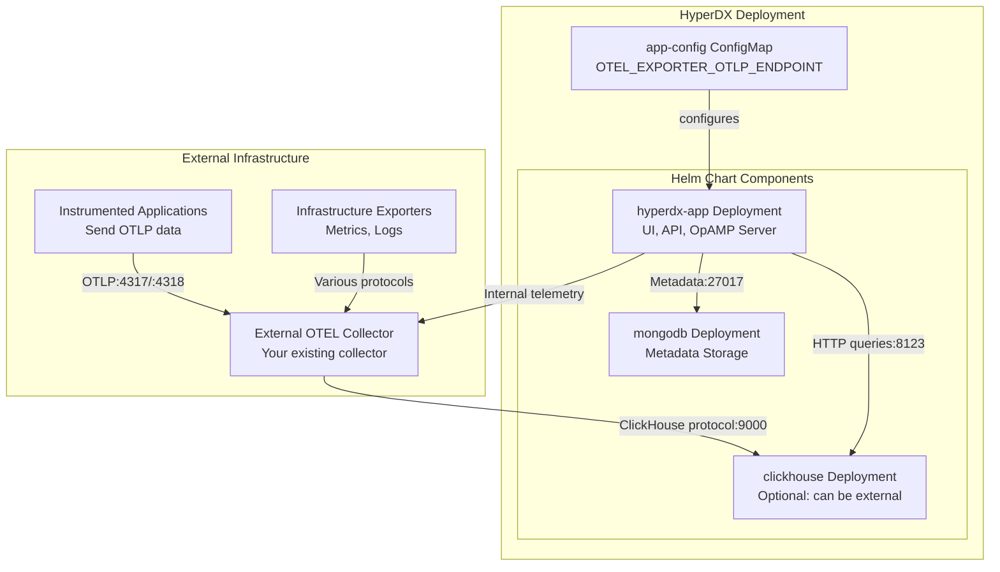
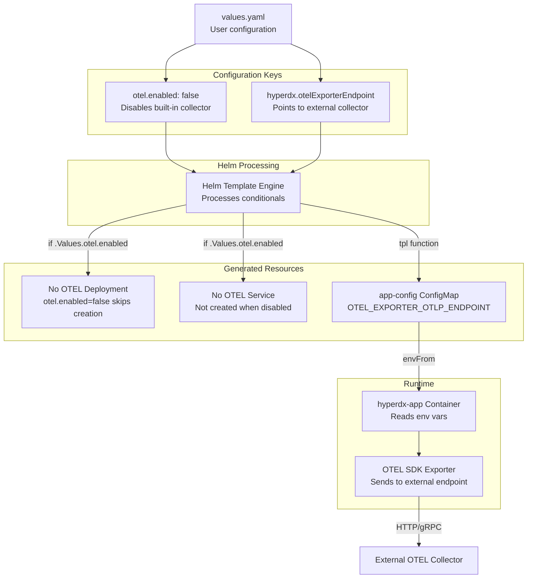
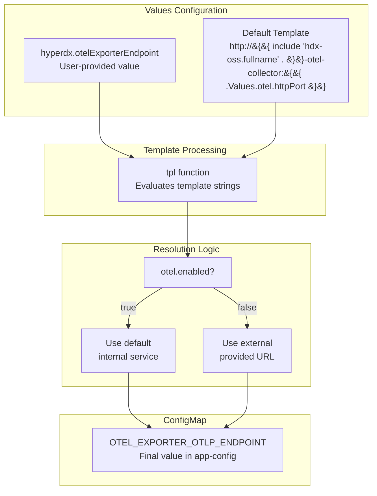

# External OTEL Collector

> **Relevant source files**
> * [README.md](https://github.com/hyperdxio/helm-charts/blob/845dd482/README.md)
> * [charts/hdx-oss-v2/templates/configmaps/app-configmap.yaml](https://github.com/hyperdxio/helm-charts/blob/845dd482/charts/hdx-oss-v2/templates/configmaps/app-configmap.yaml)
> * [charts/hdx-oss-v2/values.yaml](https://github.com/hyperdxio/helm-charts/blob/845dd482/charts/hdx-oss-v2/values.yaml)

## Purpose and Scope

This document describes how to deploy HyperDX with an existing external OpenTelemetry Collector instead of the built-in collector provided by the Helm chart. This deployment scenario is useful for organizations that already have a standardized OTEL infrastructure or want to manage telemetry collection separately from the observability platform.

This page covers configuration for disabling the built-in collector and connecting HyperDX to an external endpoint. For information about the built-in OTEL Collector architecture and configuration, see [OpenTelemetry Collector](/hyperdxio/helm-charts/5.3-opentelemetry-collector). For using both external ClickHouse and external OTEL Collector, see [Minimal Deployment](/hyperdxio/helm-charts/4.4-minimal-deployment).

**Sources:** [README.md L185-L201](https://github.com/hyperdxio/helm-charts/blob/845dd482/README.md#L185-L201)

## Overview

By default, the HyperDX Helm chart deploys an OpenTelemetry Collector as part of the stack. When using an external OTEL Collector, you disable this built-in component and configure HyperDX to send its internal telemetry data to your external collector endpoint.

The external OTEL Collector must be configured to:

1. Accept telemetry data from applications and infrastructure (OTLP, Fluentd, etc.)
2. Export processed data to ClickHouse (either the chart's ClickHouse or an external instance)
3. Accept telemetry from the HyperDX application itself for internal monitoring

**Sources:** [values.yaml L368-L465](https://github.com/hyperdxio/helm-charts/blob/845dd482/values.yaml#L368-L465)

 [README.md L185-L201](https://github.com/hyperdxio/helm-charts/blob/845dd482/README.md#L185-L201)

## Architecture

### External OTEL Collector Data Flow



**Diagram: External OTEL Collector deployment architecture showing telemetry flow bypassing the built-in collector**

**Sources:** [values.yaml L59-L60](https://github.com/hyperdxio/helm-charts/blob/845dd482/values.yaml#L59-L60)

 [charts/hdx-oss-v2/templates/configmaps/app-configmap.yaml L20](https://github.com/hyperdxio/helm-charts/blob/845dd482/charts/hdx-oss-v2/templates/configmaps/app-configmap.yaml#L20-L20)

### Configuration Value Flow



**Diagram: How configuration values flow from values.yaml through Helm templates to runtime**

**Sources:** [values.yaml L405](https://github.com/hyperdxio/helm-charts/blob/845dd482/values.yaml#L405-L405)

 [values.yaml L59-L60](https://github.com/hyperdxio/helm-charts/blob/845dd482/values.yaml#L59-L60)

 [charts/hdx-oss-v2/templates/configmaps/app-configmap.yaml L20](https://github.com/hyperdxio/helm-charts/blob/845dd482/charts/hdx-oss-v2/templates/configmaps/app-configmap.yaml#L20-L20)

## Configuration Steps

### Basic External OTEL Configuration

To use an external OTEL Collector, create a values file that disables the built-in collector and specifies the external endpoint:

```yaml
# values-external-otel.yaml
otel:
  enabled: false  # Disable the built-in OTEL collector

hyperdx:
  # Point to your external OTEL collector endpoint
  otelExporterEndpoint: "http://your-otel-collector:4318"
```

Install or upgrade with this configuration:

```
helm install my-hyperdx hyperdx/hdx-oss-v2 -f values-external-otel.yaml
```

**Sources:** [README.md L185-L197](https://github.com/hyperdxio/helm-charts/blob/845dd482/README.md#L185-L197)

 [values.yaml L59-L60](https://github.com/hyperdxio/helm-charts/blob/845dd482/values.yaml#L59-L60)

 [values.yaml L405](https://github.com/hyperdxio/helm-charts/blob/845dd482/values.yaml#L405-L405)

### Configuration Reference

| Parameter | Description | Default | Required |
| --- | --- | --- | --- |
| `otel.enabled` | Enable/disable built-in OTEL Collector deployment | `true` | Yes |
| `hyperdx.otelExporterEndpoint` | External OTEL Collector endpoint URL for HyperDX internal telemetry | `http://{{ include "hdx-oss.fullname" . }}-otel-collector:{{ .Values.otel.httpPort }}` | Yes |

The `hyperdx.otelExporterEndpoint` parameter accepts:

* HTTP endpoints: `http://hostname:4318`
* HTTPS endpoints: `https://hostname:4318`
* Kubernetes service FQDNs: `http://otel-collector.monitoring.svc.cluster.local:4318`
* External URLs: `https://collector.example.com:4318`

**Sources:** [values.yaml L59-L60](https://github.com/hyperdxio/helm-charts/blob/845dd482/values.yaml#L59-L60)

 [values.yaml L405](https://github.com/hyperdxio/helm-charts/blob/845dd482/values.yaml#L405-L405)

### External Collector Endpoint Resolution



**Diagram: How the OTEL exporter endpoint is resolved during Helm template processing**

**Sources:** [values.yaml L59-L60](https://github.com/hyperdxio/helm-charts/blob/845dd482/values.yaml#L59-L60)

 [charts/hdx-oss-v2/templates/configmaps/app-configmap.yaml L20](https://github.com/hyperdxio/helm-charts/blob/845dd482/charts/hdx-oss-v2/templates/configmaps/app-configmap.yaml#L20-L20)

## External Collector Requirements

### ClickHouse Export Configuration

Your external OTEL Collector must be configured to export data to ClickHouse (either the chart's built-in ClickHouse or an external instance). The collector needs:

1. **ClickHouse Exporter**: Export telemetry to the ClickHouse database
2. **Correct Tables**: Export to the expected HyperDX tables: * `otel_logs` - for log data * `otel_traces` - for trace data * `otel_metrics_gauge`, `otel_metrics_sum`, `otel_metrics_histogram` - for metrics * `hyperdx_sessions` - for session data

Example external collector configuration snippet:

```yaml
exporters:
  clickhouse:
    endpoint: tcp://clickhouse-server:9000
    database: default
    username: otelcollector
    password: otelcollectorpass
    ttl: 72h
    traces_table_name: otel_traces
    logs_table_name: otel_logs
    metrics_table_name: otel_metrics

service:
  pipelines:
    traces:
      receivers: [otlp]
      processors: [batch, memory_limiter]
      exporters: [clickhouse]
    logs:
      receivers: [otlp, fluentforward]
      processors: [batch, memory_limiter]
      exporters: [clickhouse]
    metrics:
      receivers: [otlp, prometheus]
      processors: [batch, memory_limiter]
      exporters: [clickhouse]
```

**Sources:** [values.yaml L441-L452](https://github.com/hyperdxio/helm-charts/blob/845dd482/values.yaml#L441-L452)

 [values.yaml L92-L201](https://github.com/hyperdxio/helm-charts/blob/845dd482/values.yaml#L92-L201)

### Protocol Support

The external collector should support:

* **OTLP HTTP** (port 4318) - for HyperDX internal telemetry
* **OTLP gRPC** (port 4317) - for application telemetry
* **Fluentd Forward** (port 24225) - optional, for log forwarding
* **Prometheus Remote Write** - optional, for metrics scraping

**Sources:** [values.yaml L400-L404](https://github.com/hyperdxio/helm-charts/blob/845dd482/values.yaml#L400-L404)

## Deployment Variations

### External OTEL with Built-in ClickHouse

This is the most common external OTEL scenario - using your own collector but keeping the chart's ClickHouse:

```css
# External OTEL, internal ClickHouse
otel:
  enabled: false

hyperdx:
  otelExporterEndpoint: "http://my-otel-collector.monitoring:4318"
  # defaultConnections still points to chart's ClickHouse
  defaultConnections: |
    [
      {
        "name": "Local ClickHouse",
        "host": "http://{{ include "hdx-oss.fullname" . }}-clickhouse:8123",
        "port": 8123,
        "username": "app",
        "password": "{{ .Values.clickhouse.config.users.appUserPassword }}"
      }
    ]

clickhouse:
  enabled: true
```

Your external collector must export to the chart's ClickHouse service at: `tcp://my-hyperdx-hdx-oss-v2-clickhouse:9000`

**Sources:** [values.yaml L92-L101](https://github.com/hyperdxio/helm-charts/blob/845dd482/values.yaml#L92-L101)

 [values.yaml L289-L321](https://github.com/hyperdxio/helm-charts/blob/845dd482/values.yaml#L289-L321)

### External OTEL with External ClickHouse

For fully external telemetry infrastructure, disable both components:

```css
# Both OTEL and ClickHouse external
otel:
  enabled: false

clickhouse:
  enabled: false

hyperdx:
  otelExporterEndpoint: "http://my-otel-collector.monitoring:4318"
  defaultConnections: |
    [
      {
        "name": "External ClickHouse",
        "host": "http://clickhouse.data.example.com:8123",
        "port": 8123,
        "username": "hyperdx_app",
        "password": "secure-password"
      }
    ]
```

Your external collector must export to your external ClickHouse instance.

**Sources:** [README.md L204-L234](https://github.com/hyperdxio/helm-charts/blob/845dd482/README.md#L204-L234)

 [values.yaml L289](https://github.com/hyperdxio/helm-charts/blob/845dd482/values.yaml#L289-L289)

 [values.yaml L405](https://github.com/hyperdxio/helm-charts/blob/845dd482/values.yaml#L405-L405)

## Exposing External Collector via Ingress

If you need to send telemetry from outside the Kubernetes cluster to your external collector, configure ingress for the collector endpoints:

```yaml
hyperdx:
  ingress:
    enabled: true
    additionalIngresses:
      - name: otel-collector-external
        annotations:
          nginx.ingress.kubernetes.io/ssl-redirect: "false"
          nginx.ingress.kubernetes.io/use-regex: "true"
        ingressClassName: nginx
        hosts:
          - host: collector.example.com
            paths:
              - path: /v1/(traces|metrics|logs)
                pathType: Prefix
                port: 4318  # External collector service port
                name: my-external-otel-collector-service
        tls:
          - hosts:
              - collector.example.com
            secretName: collector-tls
```

**Note**: The `name` field in the path configuration must match your external collector's Kubernetes service name.

**Sources:** [README.md L436-L467](https://github.com/hyperdxio/helm-charts/blob/845dd482/README.md#L436-L467)

 [values.yaml L226-L239](https://github.com/hyperdxio/helm-charts/blob/845dd482/values.yaml#L226-L239)

## Use Cases

### Centralized Telemetry Collection

Organizations with multiple Kubernetes clusters can use a centralized OTEL Collector:

* Deploy HyperDX in multiple clusters with `otel.enabled: false`
* All instances point to a central collector: `hyperdx.otelExporterEndpoint: "http://central-collector.telemetry.svc:4318"`
* The central collector aggregates, processes, and routes telemetry
* Each HyperDX instance queries its own ClickHouse (or a shared external one)

### Existing OTEL Infrastructure

Organizations already running OpenTelemetry Collectors for other observability tools:

* Reuse existing collector infrastructure
* Add ClickHouse exporter to existing collector configuration
* Point HyperDX to existing collector endpoint
* Maintain consistent telemetry processing pipelines

### Advanced Processing Requirements

When you need custom processing that the built-in collector doesn't provide:

* Custom processors (sampling, filtering, enrichment)
* Integration with other exporters (Kafka, S3, etc.)
* Advanced routing logic
* Multi-destination export

**Sources:** [README.md L185-L201](https://github.com/hyperdxio/helm-charts/blob/845dd482/README.md#L185-L201)

## Environment Variable Mapping

When the configuration is applied, Helm templates generate the `app-config` ConfigMap with the following environment variable:

```yaml
# Generated ConfigMap
apiVersion: v1
kind: ConfigMap
metadata:
  name: my-hyperdx-hdx-oss-v2-app-config
data:
  OTEL_EXPORTER_OTLP_ENDPOINT: "http://my-otel-collector.monitoring:4318"
```

This environment variable is consumed by the HyperDX application container through the `envFrom` directive, configuring the OpenTelemetry SDK to export to the specified endpoint.

**Sources:** [charts/hdx-oss-v2/templates/configmaps/app-configmap.yaml L20](https://github.com/hyperdxio/helm-charts/blob/845dd482/charts/hdx-oss-v2/templates/configmaps/app-configmap.yaml#L20-L20)

## Considerations and Limitations

### No Built-in OpAMP Integration

When using an external OTEL Collector, the HyperDX OpAMP server (port 4320) cannot manage the external collector. The OpAMP integration only works with the chart's built-in collector. You'll need to manage external collector configuration through your own methods.

**Sources:** [values.yaml L51](https://github.com/hyperdxio/helm-charts/blob/845dd482/values.yaml#L51-L51)

 [values.yaml L437-L440](https://github.com/hyperdxio/helm-charts/blob/845dd482/values.yaml#L437-L440)

### Internal Telemetry Only

The `hyperdx.otelExporterEndpoint` configuration only affects where the HyperDX application itself sends its internal telemetry. Application telemetry from your monitored services must be configured separately to reach your external collector.

**Sources:** [values.yaml L59-L60](https://github.com/hyperdxio/helm-charts/blob/845dd482/values.yaml#L59-L60)

### Service Discovery

When specifying external collector endpoints:

* Use Kubernetes service FQDNs for in-cluster collectors: `http://service.namespace.svc.cluster.local:4318`
* Use external URLs for collectors outside the cluster: `https://collector.external.com:4318`
* Ensure network policies allow traffic from HyperDX namespace to collector

### Health Checks

The HyperDX application does not actively health-check the OTEL exporter endpoint. If the external collector is unavailable:

* Internal telemetry from HyperDX will fail to export
* HyperDX UI and API will continue to function normally
* Application telemetry (from your services) depends on your external collector's availability

**Sources:** [charts/hdx-oss-v2/templates/configmaps/app-configmap.yaml L1-L21](https://github.com/hyperdxio/helm-charts/blob/845dd482/charts/hdx-oss-v2/templates/configmaps/app-configmap.yaml#L1-L21)

## Verification

After deploying with an external OTEL Collector, verify the configuration:

### Check ConfigMap Value

```
kubectl get configmap my-hyperdx-hdx-oss-v2-app-config -o yaml | grep OTEL_EXPORTER_OTLP_ENDPOINT
```

Expected output:

```yaml
OTEL_EXPORTER_OTLP_ENDPOINT: "http://your-otel-collector:4318"
```

### Check No OTEL Collector Deployment

```
kubectl get deployments | grep otel-collector
```

Expected: No output (the deployment should not exist when `otel.enabled: false`)

### Check Application Logs

```
kubectl logs -l app.kubernetes.io/name=hdx-oss-v2 -l app.kubernetes.io/component=app | grep -i otel
```

Look for successful OTEL SDK initialization and export to the configured endpoint.

### Verify External Collector Receives Data

Check your external collector's logs for incoming telemetry from the HyperDX service name:

```markdown
# Example for a collector in the monitoring namespace
kubectl logs -n monitoring -l app=otel-collector | grep "hdx-oss-api"
```

**Sources:** [charts/hdx-oss-v2/templates/configmaps/app-configmap.yaml L16](https://github.com/hyperdxio/helm-charts/blob/845dd482/charts/hdx-oss-v2/templates/configmaps/app-configmap.yaml#L16-L16)