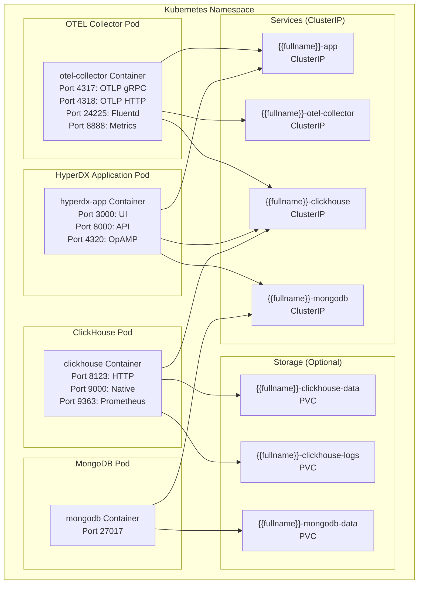
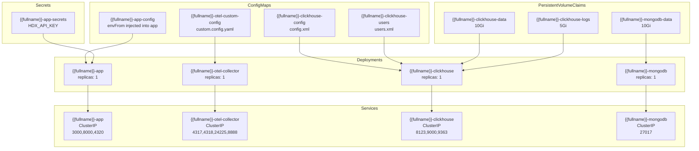
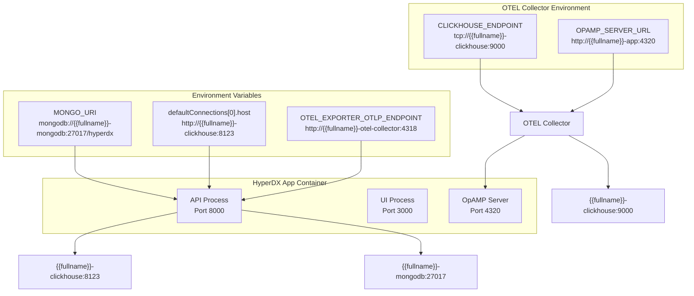

# Full Stack Deployment

> **Relevant source files**
> * [README.md](https://github.com/hyperdxio/helm-charts/blob/845dd482/README.md)
> * [charts/hdx-oss-v2/Chart.yaml](https://github.com/hyperdxio/helm-charts/blob/845dd482/charts/hdx-oss-v2/Chart.yaml)
> * [charts/hdx-oss-v2/values.yaml](https://github.com/hyperdxio/helm-charts/blob/845dd482/charts/hdx-oss-v2/values.yaml)

## Purpose and Scope

This document describes the default full stack deployment of HyperDX using the `hdx-oss-v2` Helm chart, where all components are deployed and managed within the Kubernetes cluster. This deployment mode is ideal for getting started quickly, development environments, and smaller production deployments where self-contained infrastructure is preferred.

In full stack mode, the chart deploys and manages all required infrastructure components. For scenarios where you want to use external services, see:

* External ClickHouse: [4.2](/hyperdxio/helm-charts/4.2-external-clickhouse)
* External OTEL Collector: [4.3](/hyperdxio/helm-charts/4.3-external-otel-collector)
* Minimal deployment with both external: [4.4](/hyperdxio/helm-charts/4.4-minimal-deployment)

For detailed configuration of individual components, refer to the Configuration Reference section [3](/hyperdxio/helm-charts/3-configuration-reference).

## Full Stack Architecture

In full stack mode, the Helm chart deploys four primary components as Kubernetes Deployments, each with associated Services, ConfigMaps, and optional PersistentVolumeClaims.



**Sources:** [charts/hdx-oss-v2/Chart.yaml L1-L7](https://github.com/hyperdxio/helm-charts/blob/845dd482/charts/hdx-oss-v2/Chart.yaml#L1-L7)

 [charts/hdx-oss-v2/values.yaml L14-L256](https://github.com/hyperdxio/helm-charts/blob/845dd482/charts/hdx-oss-v2/values.yaml#L14-L256)

## Component Enablement Configuration

All components are enabled by default in the full stack deployment. The enablement is controlled through boolean flags in `values.yaml`:

| Component | Configuration Key | Default Value | Line Reference |
| --- | --- | --- | --- |
| HyperDX Application | Always enabled | N/A | N/A |
| MongoDB | `mongodb.enabled` | `true` | [charts/hdx-oss-v2/values.yaml L259](https://github.com/hyperdxio/helm-charts/blob/845dd482/charts/hdx-oss-v2/values.yaml#L259-L259) |
| ClickHouse | `clickhouse.enabled` | `true` | [charts/hdx-oss-v2/values.yaml L321](https://github.com/hyperdxio/helm-charts/blob/845dd482/charts/hdx-oss-v2/values.yaml#L321-L321) |
| OTEL Collector | `otel.enabled` | `true` | [charts/hdx-oss-v2/values.yaml L405](https://github.com/hyperdxio/helm-charts/blob/845dd482/charts/hdx-oss-v2/values.yaml#L405-L405) |
| Scheduled Tasks | `tasks.enabled` | `false` | [charts/hdx-oss-v2/values.yaml L467](https://github.com/hyperdxio/helm-charts/blob/845dd482/charts/hdx-oss-v2/values.yaml#L467-L467) |

The HyperDX application deployment is always created, as it contains the core UI and API services. To deploy only the application with external dependencies, disable the other components as described in [4.2](/hyperdxio/helm-charts/4.2-external-clickhouse), [4.3](/hyperdxio/helm-charts/4.3-external-otel-collector), and [4.4](/hyperdxio/helm-charts/4.4-minimal-deployment).

**Sources:** [charts/hdx-oss-v2/values.yaml L259](https://github.com/hyperdxio/helm-charts/blob/845dd482/charts/hdx-oss-v2/values.yaml#L259-L259)

 [charts/hdx-oss-v2/values.yaml L321](https://github.com/hyperdxio/helm-charts/blob/845dd482/charts/hdx-oss-v2/values.yaml#L321-L321)

 [charts/hdx-oss-v2/values.yaml L405](https://github.com/hyperdxio/helm-charts/blob/845dd482/charts/hdx-oss-v2/values.yaml#L405-L405)

 [charts/hdx-oss-v2/values.yaml L467](https://github.com/hyperdxio/helm-charts/blob/845dd482/charts/hdx-oss-v2/values.yaml#L467-L467)

## Deployed Kubernetes Resources

### Full Stack Deployment Resource Map



**Sources:** [charts/hdx-oss-v2/values.yaml L14-L477](https://github.com/hyperdxio/helm-charts/blob/845dd482/charts/hdx-oss-v2/values.yaml#L14-L477)

### Resource Summary Table

| Resource Type | Count | Purpose | Configuration Reference |
| --- | --- | --- | --- |
| Deployments | 4 | Application runtime containers | [3.2](/hyperdxio/helm-charts/3.2-hyperdx-application-configuration), [3.3](/hyperdxio/helm-charts/3.3-clickhouse-configuration), [3.4](/hyperdxio/helm-charts/3.4-opentelemetry-collector-configuration), [3.5](/hyperdxio/helm-charts/3.5-mongodb-configuration) |
| Services | 4 | Internal networking endpoints | [7.1](/hyperdxio/helm-charts/7.1-service-architecture) |
| ConfigMaps | 4 | Non-sensitive configuration | [3](/hyperdxio/helm-charts/3-configuration-reference) |
| Secrets | 1 | API keys and credentials | [7.3](/hyperdxio/helm-charts/7.3-security-configuration) |
| PersistentVolumeClaims | 3 | Data persistence | [8.3](/hyperdxio/helm-charts/8.3-persistence-and-backups) |
| Ingress (optional) | 0-N | External access | [3.6](/hyperdxio/helm-charts/3.6-ingress-configuration) |
| CronJobs (optional) | 0-N | Scheduled tasks | [3.7](/hyperdxio/helm-charts/3.7-scheduled-tasks-configuration) |

**Sources:** [charts/hdx-oss-v2/values.yaml L1-L477](https://github.com/hyperdxio/helm-charts/blob/845dd482/charts/hdx-oss-v2/values.yaml#L1-L477)

## Service Connection Architecture

The full stack deployment uses Kubernetes internal DNS for service discovery. Each component connects to others using service names that are templated based on the Helm release name.



**Sources:** [charts/hdx-oss-v2/values.yaml L60-L61](https://github.com/hyperdxio/helm-charts/blob/845dd482/charts/hdx-oss-v2/values.yaml#L60-L61)

 [charts/hdx-oss-v2/values.yaml L92-L101](https://github.com/hyperdxio/helm-charts/blob/845dd482/charts/hdx-oss-v2/values.yaml#L92-L101)

### Connection String Templates

The service names use Helm's template function `{{ include "hdx-oss.fullname" . }}` to generate unique service names based on the release name. For a release named `my-hyperdx`, the service names resolve to:

| Service Purpose | Template | Example FQDN |
| --- | --- | --- |
| MongoDB | `{{ include "hdx-oss.fullname" . }}-mongodb` | `my-hyperdx-hdx-oss-v2-mongodb.default.svc.cluster.local` |
| ClickHouse HTTP | `{{ include "hdx-oss.fullname" . }}-clickhouse` | `my-hyperdx-hdx-oss-v2-clickhouse.default.svc.cluster.local` |
| OTEL Collector | `{{ include "hdx-oss.fullname" . }}-otel-collector` | `my-hyperdx-hdx-oss-v2-otel-collector.default.svc.cluster.local` |
| HyperDX App | `{{ include "hdx-oss.fullname" . }}-app` | `my-hyperdx-hdx-oss-v2-app.default.svc.cluster.local` |

**Sources:** [charts/hdx-oss-v2/values.yaml L60-L61](https://github.com/hyperdxio/helm-charts/blob/845dd482/charts/hdx-oss-v2/values.yaml#L60-L61)

 [charts/hdx-oss-v2/values.yaml L96](https://github.com/hyperdxio/helm-charts/blob/845dd482/charts/hdx-oss-v2/values.yaml#L96-L96)

## Default Configuration Values

### HyperDX Application Configuration

The HyperDX application is configured with the following defaults:

```css
hyperdx:
  image:
    repository: docker.hyperdx.io/hyperdx/hyperdx
    tag: "" # Defaults to Chart appVersion 2.7.1
    pullPolicy: IfNotPresent
  apiPort: 8000
  appPort: 3000
  opampPort: 4320
  apiKey: "xxxxxxxx-xxxx-xxxx-xxxx-xxxxxxxxxxxx"
  frontendUrl: "http://localhost:3000"
  mongoUri: "mongodb://{{fullname}}-mongodb:27017/hyperdx"
  otelExporterEndpoint: "http://{{fullname}}-otel-collector:4318"
  replicas: 1
  service:
    type: ClusterIP
```

**Note:** The default `apiKey` value should be replaced with a proper UUID immediately after deployment. See [7.3](/hyperdxio/helm-charts/7.3-security-configuration) for security configuration details.

**Sources:** [charts/hdx-oss-v2/values.yaml L14-L248](https://github.com/hyperdxio/helm-charts/blob/845dd482/charts/hdx-oss-v2/values.yaml#L14-L248)

 [charts/hdx-oss-v2/Chart.yaml L6](https://github.com/hyperdxio/helm-charts/blob/845dd482/charts/hdx-oss-v2/Chart.yaml#L6-L6)

### MongoDB Configuration

```yaml
mongodb:
  image: "mongo:5.0.14-focal"
  port: 27017
  enabled: true
  persistence:
    enabled: true
    dataSize: 10Gi
```

MongoDB stores application metadata including user accounts, alert configurations, and dashboard definitions. The default persistence size of 10Gi is suitable for development and small production deployments.

**Sources:** [charts/hdx-oss-v2/values.yaml L256-L287](https://github.com/hyperdxio/helm-charts/blob/845dd482/charts/hdx-oss-v2/values.yaml#L256-L287)

### ClickHouse Configuration

```yaml
clickhouse:
  image: "clickhouse/clickhouse-server:25.7-alpine"
  port: 8123      # HTTP interface
  nativePort: 9000  # Native TCP protocol
  enabled: true
  persistence:
    enabled: true
    dataSize: 10Gi
    logSize: 5Gi
  config:
    users:
      appUserPassword: "hyperdx"
      otelUserPassword: "otelcollectorpass"
      otelUserName: "otelcollector"
    clusterCidrs:
      - "10.0.0.0/8"
      - "172.16.0.0/12"
      - "192.168.0.0/16"
```

ClickHouse stores all telemetry data (logs, traces, metrics). The `clusterCidrs` configuration implements network access control to restrict connections to the cluster's pod network. For cloud deployments, adjust these CIDRs as described in [4.5](/hyperdxio/helm-charts/4.5-cloud-provider-specific-configurations).

**Sources:** [charts/hdx-oss-v2/values.yaml L289-L366](https://github.com/hyperdxio/helm-charts/blob/845dd482/charts/hdx-oss-v2/values.yaml#L289-L366)

### OTEL Collector Configuration

```css
otel:
  image:
    repository: docker.hyperdx.io/hyperdx/hyperdx-otel-collector
    tag: "" # Defaults to Chart appVersion 2.7.1
    pullPolicy: IfNotPresent
  grpcPort: 4317     # OTLP gRPC receiver
  httpPort: 4318     # OTLP HTTP receiver
  nativePort: 24225  # Fluentd receiver
  healthPort: 8888   # Health check and metrics
  enabled: true
  replicas: 1
  clickhouseEndpoint: "" # Defaults to {{fullname}}-clickhouse:9000
  opampServerUrl: ""     # Defaults to {{fullname}}-app:4320
  clickhouseDatabase: "default"
```

When `clickhouseEndpoint` and `opampServerUrl` are left empty, they default to the chart's internal services using the same templating pattern.

**Sources:** [charts/hdx-oss-v2/values.yaml L368-L464](https://github.com/hyperdxio/helm-charts/blob/845dd482/charts/hdx-oss-v2/values.yaml#L368-L464)

## Default Data Sources Configuration

The chart includes pre-configured `defaultConnections` and `defaultSources` that map the HyperDX application to the internal ClickHouse tables. These are configured as multi-line YAML strings that are rendered as JSON.

### Default Connection

```yaml
defaultConnections: |
  [
    {
      "name": "Local ClickHouse",
      "host": "http://{{ include "hdx-oss.fullname" . }}-clickhouse:8123",
      "port": 8123,
      "username": "app",
      "password": "{{ .Values.clickhouse.config.users.appUserPassword }}"
    }
  ]
```

This connection uses the `app` user with password from [charts/hdx-oss-v2/values.yaml L356](https://github.com/hyperdxio/helm-charts/blob/845dd482/charts/hdx-oss-v2/values.yaml#L356-L356)

**Sources:** [charts/hdx-oss-v2/values.yaml L92-L101](https://github.com/hyperdxio/helm-charts/blob/845dd482/charts/hdx-oss-v2/values.yaml#L92-L101)

### Default Sources

The chart configures four default data sources:

| Source Name | Kind | ClickHouse Table | Purpose |
| --- | --- | --- | --- |
| Logs | `log` | `default.otel_logs` | Application and infrastructure logs |
| Traces | `trace` | `default.otel_traces` | Distributed tracing spans |
| Metrics | `metric` | `default.otel_metrics_*` | Time-series metrics (gauge, histogram, sum) |
| Sessions | `session` | `default.hyperdx_sessions` | User session data |

Each source includes field mappings that define how HyperDX queries the ClickHouse tables. For example, the Logs source maps:

* `timestampValueExpression: "TimestampTime"`
* `bodyExpression: "Body"`
* `severityTextExpression: "SeverityText"`
* `traceIdExpression: "TraceId"`
* `spanIdExpression: "SpanId"`

**Sources:** [charts/hdx-oss-v2/values.yaml L104-L202](https://github.com/hyperdxio/helm-charts/blob/845dd482/charts/hdx-oss-v2/values.yaml#L104-L202)

## Installation Process

### Basic Full Stack Installation

```sql
# Add the Helm repository
helm repo add hyperdx https://hyperdxio.github.io/helm-charts
helm repo update

# Install with default values
helm install my-hyperdx hyperdx/hdx-oss-v2

# Verify deployment
kubectl get pods -l app.kubernetes.io/instance=my-hyperdx
```

This deploys all four components with their default configurations. The chart uses:

* **Chart version:** 0.8.4
* **App version:** 2.7.1

**Sources:** [charts/hdx-oss-v2/Chart.yaml L5-L6](https://github.com/hyperdxio/helm-charts/blob/845dd482/charts/hdx-oss-v2/Chart.yaml#L5-L6)

 [README.md L38-L44](https://github.com/hyperdxio/helm-charts/blob/845dd482/README.md#L38-L44)

### Installation with Custom Values

```sql
# Create a custom values file
cat <<EOF > my-values.yaml
hyperdx:
  frontendUrl: "http://hyperdx.example.com"
  apiKey: "your-secure-api-key-uuid"
  
clickhouse:
  persistence:
    dataSize: 50Gi
  resources:
    requests:
      memory: "2Gi"
      cpu: "1000m"
    limits:
      memory: "4Gi"
      cpu: "2000m"

mongodb:
  persistence:
    dataSize: 20Gi
EOF

# Install with custom values
helm install my-hyperdx hyperdx/hdx-oss-v2 -f my-values.yaml
```

**Sources:** [README.md L38-L68](https://github.com/hyperdxio/helm-charts/blob/845dd482/README.md#L38-L68)

### Post-Installation Verification

After installation, verify that all pods are running:

```markdown
# Check pod status
kubectl get pods -l app.kubernetes.io/instance=my-hyperdx

# Expected output:
# NAME                                                READY   STATUS
# my-hyperdx-hdx-oss-v2-app-xxxxxxxxxx-xxxxx         1/1     Running
# my-hyperdx-hdx-oss-v2-clickhouse-xxxxxxxxxx-xxxxx  1/1     Running
# my-hyperdx-hdx-oss-v2-mongodb-xxxxxxxxxx-xxxxx     1/1     Running
# my-hyperdx-hdx-oss-v2-otel-collector-xxxxx-xxxxx   1/1     Running

# Check services
kubectl get svc -l app.kubernetes.io/instance=my-hyperdx

# Verify PVCs are bound
kubectl get pvc -l app.kubernetes.io/instance=my-hyperdx
```

**Sources:** [README.md L46-L52](https://github.com/hyperdxio/helm-charts/blob/845dd482/README.md#L46-L52)

## Accessing the Deployment

### Internal Cluster Access

From within the cluster, services are accessible via their service names:

* **UI:** `http://my-hyperdx-hdx-oss-v2-app:3000`
* **API:** `http://my-hyperdx-hdx-oss-v2-app:8000`
* **OTEL Collector (HTTP):** `http://my-hyperdx-hdx-oss-v2-otel-collector:4318`
* **OTEL Collector (gRPC):** `my-hyperdx-hdx-oss-v2-otel-collector:4317`

### External Access via Port-Forward

For development and testing:

```markdown
# Forward UI port
kubectl port-forward svc/my-hyperdx-hdx-oss-v2-app 3000:3000

# Access UI at http://localhost:3000

# Forward OTEL collector ports
kubectl port-forward svc/my-hyperdx-hdx-oss-v2-otel-collector 4318:4318
```

### External Access via Ingress

For production access, enable ingress:

```yaml
hyperdx:
  frontendUrl: "https://hyperdx.example.com"
  ingress:
    enabled: true
    ingressClassName: nginx
    host: "hyperdx.example.com"
    tls:
      enabled: true
      secretName: "hyperdx-tls"
```

See [3.6](/hyperdxio/helm-charts/3.6-ingress-configuration) for detailed ingress configuration.

**Sources:** [charts/hdx-oss-v2/values.yaml L207-L221](https://github.com/hyperdxio/helm-charts/blob/845dd482/charts/hdx-oss-v2/values.yaml#L207-L221)

 [README.md L342-L416](https://github.com/hyperdxio/helm-charts/blob/845dd482/README.md#L342-L416)

## Storage and Persistence

### Persistent Volume Claims

When persistence is enabled (default), the chart creates three PVCs:

| PVC Name Pattern | Default Size | Purpose | Configuration Key |
| --- | --- | --- | --- |
| `{{fullname}}-clickhouse-data` | 10Gi | ClickHouse data directory | `clickhouse.persistence.dataSize` |
| `{{fullname}}-clickhouse-logs` | 5Gi | ClickHouse logs directory | `clickhouse.persistence.logSize` |
| `{{fullname}}-mongodb-data` | 10Gi | MongoDB data directory | `mongodb.persistence.dataSize` |

**Sources:** [charts/hdx-oss-v2/values.yaml L273-L275](https://github.com/hyperdxio/helm-charts/blob/845dd482/charts/hdx-oss-v2/values.yaml#L273-L275)

 [charts/hdx-oss-v2/values.yaml L346-L349](https://github.com/hyperdxio/helm-charts/blob/845dd482/charts/hdx-oss-v2/values.yaml#L346-L349)

### Storage Class

The chart uses the global `storageClassName` setting:

```yaml
global:
  storageClassName: "local-path"
```

This defaults to `local-path` which works with K3s, K3d, and many local development clusters. For cloud deployments, override with your provider's storage class:

* **GKE:** `standard` or `standard-rwo`
* **EKS:** `gp2` or `gp3`
* **AKS:** `default` or `managed-premium`

**Sources:** [charts/hdx-oss-v2/values.yaml L10](https://github.com/hyperdxio/helm-charts/blob/845dd482/charts/hdx-oss-v2/values.yaml#L10-L10)

### PVC Retention

The chart includes a `keepPVC` option to control whether PVCs are deleted on uninstall:

```yaml
global:
  keepPVC: false  # Set to true to retain data on uninstall
```

When `keepPVC: true`, the PVCs will remain after `helm uninstall`, allowing data preservation across reinstalls.

**Sources:** [charts/hdx-oss-v2/values.yaml L12](https://github.com/hyperdxio/helm-charts/blob/845dd482/charts/hdx-oss-v2/values.yaml#L12-L12)

## Health Checks and Probes

All components include liveness and readiness probes for Kubernetes health monitoring:

### Probe Configuration Summary

| Component | Liveness Probe | Readiness Probe | Configuration Keys |
| --- | --- | --- | --- |
| HyperDX App | Enabled, initial 10s, period 30s | Enabled, initial 1s, period 10s | `hyperdx.livenessProbe`, `hyperdx.readinessProbe` |
| MongoDB | Enabled, initial 10s, period 30s | Enabled, initial 1s, period 10s | `mongodb.livenessProbe`, `mongodb.readinessProbe` |
| ClickHouse | Enabled, initial 10s, period 30s | Enabled, initial 1s, period 10s | `clickhouse.livenessProbe`, `clickhouse.readinessProbe` |
| OTEL Collector | Enabled, initial 10s, period 30s | Enabled, initial 5s, period 10s | `otel.livenessProbe`, `otel.readinessProbe` |

ClickHouse additionally includes a startup probe with `failureThreshold: 30` to allow for longer initialization times.

**Sources:** [charts/hdx-oss-v2/values.yaml L23-L34](https://github.com/hyperdxio/helm-charts/blob/845dd482/charts/hdx-oss-v2/values.yaml#L23-L34)

 [charts/hdx-oss-v2/values.yaml L276-L287](https://github.com/hyperdxio/helm-charts/blob/845dd482/charts/hdx-oss-v2/values.yaml#L276-L287)

 [charts/hdx-oss-v2/values.yaml L303-L320](https://github.com/hyperdxio/helm-charts/blob/845dd482/charts/hdx-oss-v2/values.yaml#L303-L320)

 [charts/hdx-oss-v2/values.yaml L453-L464](https://github.com/hyperdxio/helm-charts/blob/845dd482/charts/hdx-oss-v2/values.yaml#L453-L464)

## Resource Allocation

By default, the chart does not set resource requests or limits, allowing Kubernetes to schedule pods based on available resources. For production deployments, configure resource constraints:

```yaml
clickhouse:
  resources:
    requests:
      memory: "2Gi"
      cpu: "1000m"
    limits:
      memory: "4Gi"
      cpu: "2000m"

otel:
  resources:
    requests:
      memory: "256Mi"
      cpu: "200m"
    limits:
      memory: "512Mi"
      cpu: "400m"
```

See [8.2](/hyperdxio/helm-charts/8.2-resource-management) for detailed resource management guidance.

**Sources:** [charts/hdx-oss-v2/values.yaml L294-L302](https://github.com/hyperdxio/helm-charts/blob/845dd482/charts/hdx-oss-v2/values.yaml#L294-L302)

 [charts/hdx-oss-v2/values.yaml L374-L382](https://github.com/hyperdxio/helm-charts/blob/845dd482/charts/hdx-oss-v2/values.yaml#L374-L382)

## Scaling Considerations

The default full stack deployment uses single replicas for all components:

* `hyperdx.replicas: 1` [charts/hdx-oss-v2/values.yaml L241](https://github.com/hyperdxio/helm-charts/blob/845dd482/charts/hdx-oss-v2/values.yaml#L241-L241)
* `otel.replicas: 1` [charts/hdx-oss-v2/values.yaml L373](https://github.com/hyperdxio/helm-charts/blob/845dd482/charts/hdx-oss-v2/values.yaml#L373-L373)
* MongoDB and ClickHouse: Single instance (StatefulSet-like behavior with PVCs)

For production scaling:

1. Increase `hyperdx.replicas` for the application layer
2. Increase `otel.replicas` for telemetry ingestion
3. MongoDB and ClickHouse require more complex scaling strategies (see [5.2](/hyperdxio/helm-charts/5.2-clickhouse-database) and [5.4](/hyperdxio/helm-charts/5.4-mongodb))

**Sources:** [charts/hdx-oss-v2/values.yaml L241](https://github.com/hyperdxio/helm-charts/blob/845dd482/charts/hdx-oss-v2/values.yaml#L241-L241)

 [charts/hdx-oss-v2/values.yaml L373](https://github.com/hyperdxio/helm-charts/blob/845dd482/charts/hdx-oss-v2/values.yaml#L373-L373)