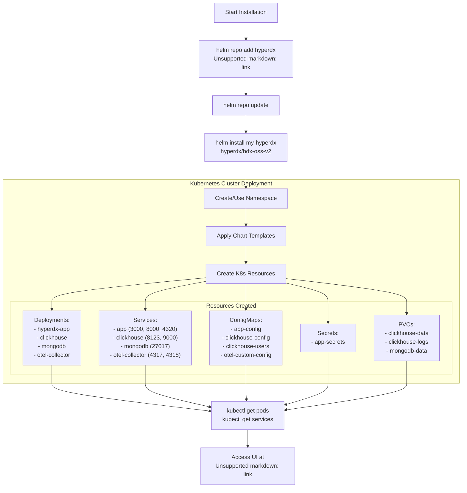
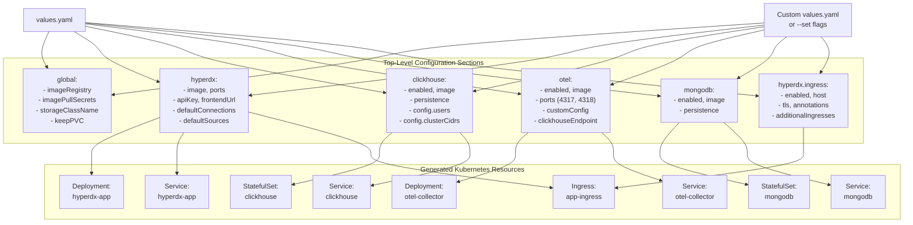
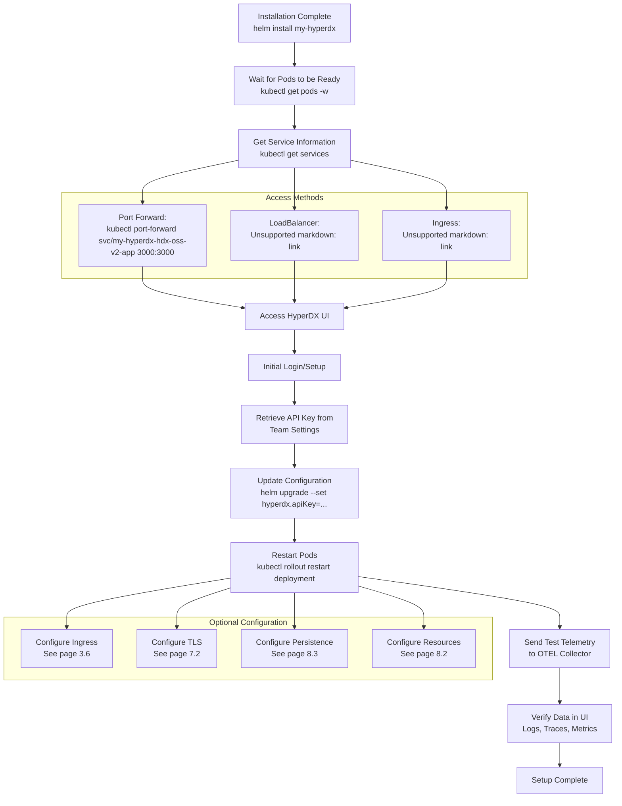
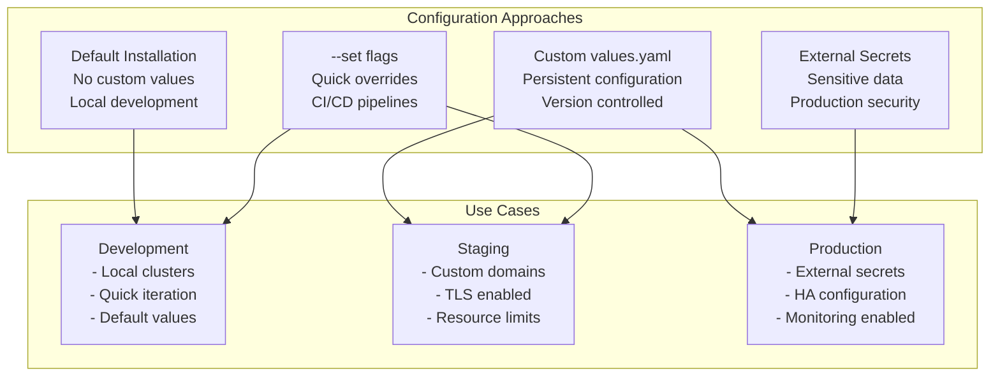

# Getting Started

> **Relevant source files**
> * [README.md](https://github.com/hyperdxio/helm-charts/blob/845dd482/README.md)
> * [charts/hdx-oss-v2/Chart.yaml](https://github.com/hyperdxio/helm-charts/blob/845dd482/charts/hdx-oss-v2/Chart.yaml)
> * [charts/hdx-oss-v2/values.yaml](https://github.com/hyperdxio/helm-charts/blob/845dd482/charts/hdx-oss-v2/values.yaml)

This page provides an overview of the initial setup process for deploying HyperDX OSS V2 using the Helm chart. It covers the basic installation workflow, what happens during deployment, and the essential first steps to get your observability platform running.

For detailed step-by-step installation instructions, see [Installation](/hyperdxio/helm-charts/2.1-installation). For a minimal example to get running quickly, see [Quick Start Guide](/hyperdxio/helm-charts/2.2-quick-start-guide). For information on upgrading existing deployments, see [Upgrading](/hyperdxio/helm-charts/2.3-upgrading).

## Prerequisites

Before installing HyperDX, ensure you have:

| Requirement | Minimum Version | Purpose |
| --- | --- | --- |
| Kubernetes cluster | v1.20+ | Runtime environment for HyperDX |
| Helm | v3+ | Package manager for Kubernetes |
| kubectl | Compatible with cluster | Command-line tool for Kubernetes |
| Storage provisioner | Any | Dynamic PVC provisioning for data persistence |

**Sources:** [README.md L30-L34](https://github.com/hyperdxio/helm-charts/blob/845dd482/README.md#L30-L34)

## Installation Overview

The installation process involves three main steps: adding the Helm repository, installing the chart, and verifying the deployment.

### Installation Flow



**Sources:** [README.md L38-L52](https://github.com/hyperdxio/helm-charts/blob/845dd482/README.md#L38-L52)

 [charts/hdx-oss-v2/Chart.yaml L1-L7](https://github.com/hyperdxio/helm-charts/blob/845dd482/charts/hdx-oss-v2/Chart.yaml#L1-L7)

### Basic Installation Commands

The minimal installation requires only three commands:

```sql
# Add the HyperDX Helm repository
helm repo add hyperdx https://hyperdxio.github.io/helm-charts

# Update repository cache
helm repo update

# Install HyperDX with default configuration
helm install my-hyperdx hyperdx/hdx-oss-v2
```

This installs the complete stack including all components (HyperDX application, ClickHouse, OTEL Collector, MongoDB) in the current namespace with default configuration.

**Sources:** [README.md L38-L52](https://github.com/hyperdxio/helm-charts/blob/845dd482/README.md#L38-L52)

## Configuration Hierarchy

Understanding how configuration flows from `values.yaml` to deployed resources is essential for customization.



**Sources:** [charts/hdx-oss-v2/values.yaml L1-L477](https://github.com/hyperdxio/helm-charts/blob/845dd482/charts/hdx-oss-v2/values.yaml#L1-L477)

## First-Time Setup Workflow

After installation, there are several steps to complete before HyperDX is fully operational.



**Sources:** [README.md L38-L52](https://github.com/hyperdxio/helm-charts/blob/845dd482/README.md#L38-L52)

 [README.md L240-L273](https://github.com/hyperdxio/helm-charts/blob/845dd482/README.md#L240-L273)

## Default Component Ports

Understanding the port architecture is crucial for networking configuration and troubleshooting.

| Component | Service Name | Port | Protocol | Purpose |
| --- | --- | --- | --- | --- |
| HyperDX UI | `<release>-hdx-oss-v2-app` | 3000 | HTTP | Web interface |
| HyperDX API | `<release>-hdx-oss-v2-app` | 8000 | HTTP | API endpoints |
| OpAMP Server | `<release>-hdx-oss-v2-app` | 4320 | HTTP | OTEL Collector management |
| OTEL Collector | `<release>-hdx-oss-v2-otel-collector` | 4317 | gRPC | OTLP gRPC receiver |
| OTEL Collector | `<release>-hdx-oss-v2-otel-collector` | 4318 | HTTP | OTLP HTTP receiver |
| OTEL Collector | `<release>-hdx-oss-v2-otel-collector` | 24225 | TCP | Fluentd forward receiver |
| OTEL Collector | `<release>-hdx-oss-v2-otel-collector` | 8888 | HTTP | Health/metrics endpoint |
| ClickHouse | `<release>-hdx-oss-v2-clickhouse` | 8123 | HTTP | HTTP query interface |
| ClickHouse | `<release>-hdx-oss-v2-clickhouse` | 9000 | TCP | Native protocol |
| MongoDB | `<release>-hdx-oss-v2-mongodb` | 27017 | TCP | MongoDB protocol |

**Sources:** [charts/hdx-oss-v2/values.yaml L49-L51](https://github.com/hyperdxio/helm-charts/blob/845dd482/charts/hdx-oss-v2/values.yaml#L49-L51)

 [charts/hdx-oss-v2/values.yaml L290-L292](https://github.com/hyperdxio/helm-charts/blob/845dd482/charts/hdx-oss-v2/values.yaml#L290-L292)

 [charts/hdx-oss-v2/values.yaml L400-L404](https://github.com/hyperdxio/helm-charts/blob/845dd482/charts/hdx-oss-v2/values.yaml#L400-L404)

 [charts/hdx-oss-v2/values.yaml L258](https://github.com/hyperdxio/helm-charts/blob/845dd482/charts/hdx-oss-v2/values.yaml#L258-L258)

## Essential Configuration Parameters

For most deployments, only a few configuration parameters need to be customized initially.

### Minimal Production Configuration

```python
# Minimum values for production deployment
hyperdx:
  # API key for telemetry collection (obtain from UI after first login)
  apiKey: "xxxxxxxx-xxxx-xxxx-xxxx-xxxxxxxxxxxx"
  
  # Frontend URL for external access
  frontendUrl: "https://hyperdx.yourdomain.com"
  
  # Enable ingress for external access
  ingress:
    enabled: true
    host: "hyperdx.yourdomain.com"
    tls:
      enabled: true
      secretName: "hyperdx-tls"

# Configure storage class for your environment
global:
  storageClassName: "standard"  # or "gp2" (EKS), "standard-rwo" (GKE), etc.

# Enable persistent storage
clickhouse:
  persistence:
    enabled: true
    dataSize: 50Gi

mongodb:
  persistence:
    enabled: true
    dataSize: 10Gi
```

**Sources:** [charts/hdx-oss-v2/values.yaml L48](https://github.com/hyperdxio/helm-charts/blob/845dd482/charts/hdx-oss-v2/values.yaml#L48-L48)

 [charts/hdx-oss-v2/values.yaml L54-L56](https://github.com/hyperdxio/helm-charts/blob/845dd482/charts/hdx-oss-v2/values.yaml#L54-L56)

 [charts/hdx-oss-v2/values.yaml L207-L221](https://github.com/hyperdxio/helm-charts/blob/845dd482/charts/hdx-oss-v2/values.yaml#L207-L221)

 [charts/hdx-oss-v2/values.yaml L10](https://github.com/hyperdxio/helm-charts/blob/845dd482/charts/hdx-oss-v2/values.yaml#L10-L10)

 [charts/hdx-oss-v2/values.yaml L346-L349](https://github.com/hyperdxio/helm-charts/blob/845dd482/charts/hdx-oss-v2/values.yaml#L346-L349)

 [charts/hdx-oss-v2/values.yaml L273-L275](https://github.com/hyperdxio/helm-charts/blob/845dd482/charts/hdx-oss-v2/values.yaml#L273-L275)

### Common Configuration Patterns



**Sources:** [charts/hdx-oss-v2/values.yaml L1-L477](https://github.com/hyperdxio/helm-charts/blob/845dd482/charts/hdx-oss-v2/values.yaml#L1-L477)

 [README.md L76-L96](https://github.com/hyperdxio/helm-charts/blob/845dd482/README.md#L76-L96)

 [README.md L98-L183](https://github.com/hyperdxio/helm-charts/blob/845dd482/README.md#L98-L183)

## Verification Steps

After installation, verify that all components are running correctly.

### Check Pod Status

```markdown
# View all pods in the deployment
kubectl get pods -l "app.kubernetes.io/instance=my-hyperdx"

# Expected output (all pods should be Running):
# NAME                                              READY   STATUS
# my-hyperdx-hdx-oss-v2-app-xxxxxxxxxx-xxxxx       1/1     Running
# my-hyperdx-hdx-oss-v2-clickhouse-0               1/1     Running
# my-hyperdx-hdx-oss-v2-mongodb-0                  1/1     Running
# my-hyperdx-hdx-oss-v2-otel-collector-xxxxx-xxxx  1/1     Running
```

### Check Service Endpoints

```markdown
# View all services
kubectl get services -l "app.kubernetes.io/instance=my-hyperdx"

# Test internal connectivity
kubectl run -it --rm debug --image=busybox --restart=Never -- sh
# Inside the pod:
wget -qO- http://my-hyperdx-hdx-oss-v2-app:3000
```

### Access the UI

```markdown
# Port forward for local access
kubectl port-forward svc/my-hyperdx-hdx-oss-v2-app 3000:3000

# Open browser to http://localhost:3000
```

**Sources:** [README.md L46-L52](https://github.com/hyperdxio/helm-charts/blob/845dd482/README.md#L46-L52)

 [README.md L627-L631](https://github.com/hyperdxio/helm-charts/blob/845dd482/README.md#L627-L631)

## Next Steps

After successful installation and verification:

1. **Configure API Key**: Retrieve from the UI and update deployment (see [API Key Setup](/hyperdxio/helm-charts/3.2-hyperdx-application-configuration))
2. **Set Up Ingress**: Configure external access with TLS (see [Ingress Configuration](/hyperdxio/helm-charts/3.6-ingress-configuration))
3. **Send Telemetry Data**: Instrument applications to send data (see [Integrating Applications](/hyperdxio/helm-charts/6.3-integrating-applications))
4. **Configure Data Sources**: Verify `defaultConnections` and `defaultSources` (see [Data Sources and Connections](/hyperdxio/helm-charts/6.2-data-sources-and-connections))
5. **Enable Scheduled Tasks**: Configure alert checking (see [Scheduled Tasks Configuration](/hyperdxio/helm-charts/3.7-scheduled-tasks-configuration))
6. **Configure Persistence**: Set up backup strategies (see [Persistence and Backups](/hyperdxio/helm-charts/8.3-persistence-and-backups))
7. **Set Resource Limits**: Configure CPU/memory for production (see [Resource Management](/hyperdxio/helm-charts/8.2-resource-management))

For detailed deployment scenarios including external ClickHouse, external OTEL Collector, or minimal deployments, see [Deployment Scenarios](/hyperdxio/helm-charts/4-deployment-scenarios).

**Sources:** [README.md L1-L631](https://github.com/hyperdxio/helm-charts/blob/845dd482/README.md#L1-L631)

## Common Initial Issues

| Issue | Symptom | Solution |
| --- | --- | --- |
| Pods not starting | `CrashLoopBackOff` status | Check logs with `kubectl logs <pod-name>` |
| Storage issues | `Pending` PVC status | Verify storage class exists: `kubectl get storageclass` |
| Service not accessible | Connection refused | Check service and pod status, verify ports |
| ClickHouse connection errors | API logs show connection failures | Verify `clusterCidrs` includes pod network CIDR |
| OpAMP connection failures (GKE) | OTEL collector can't connect to OpAMP | Set `otel.opampServerUrl` to FQDN format |

For detailed troubleshooting, see [Troubleshooting](/hyperdxio/helm-charts/8.4-troubleshooting).

**Sources:** [README.md L625-L631](https://github.com/hyperdxio/helm-charts/blob/845dd482/README.md#L625-L631)

 [README.md L530-L567](https://github.com/hyperdxio/helm-charts/blob/845dd482/README.md#L530-L567)

 [charts/hdx-oss-v2/values.yaml L363-L366](https://github.com/hyperdxio/helm-charts/blob/845dd482/charts/hdx-oss-v2/values.yaml#L363-L366)