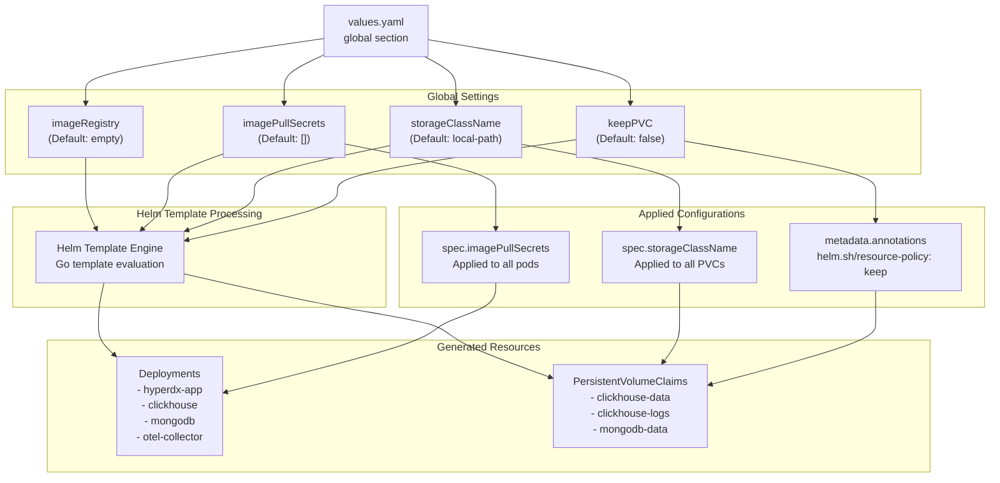
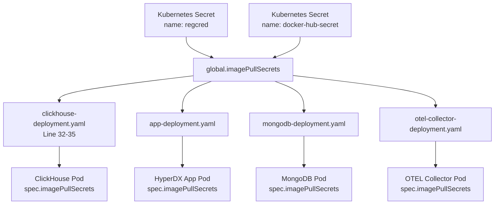
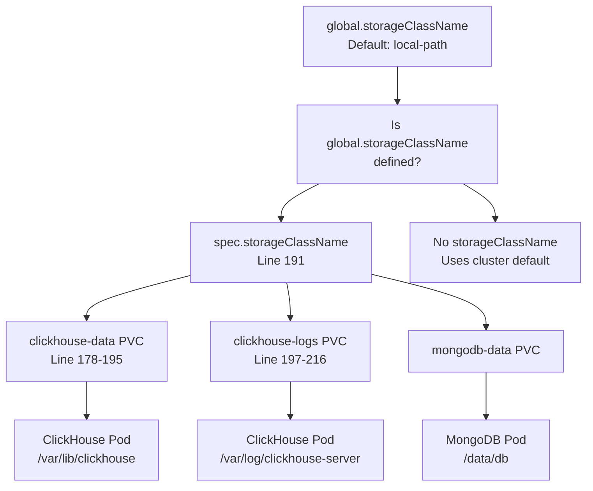
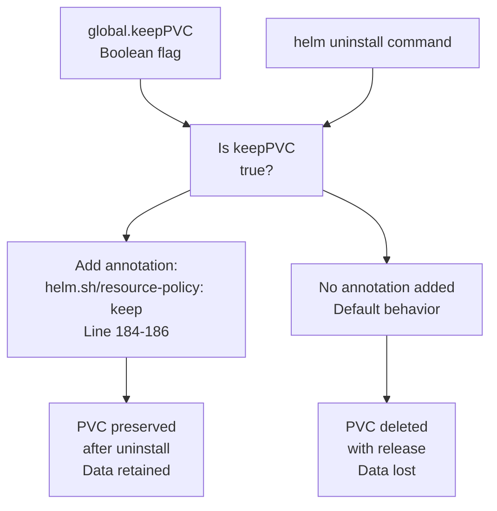
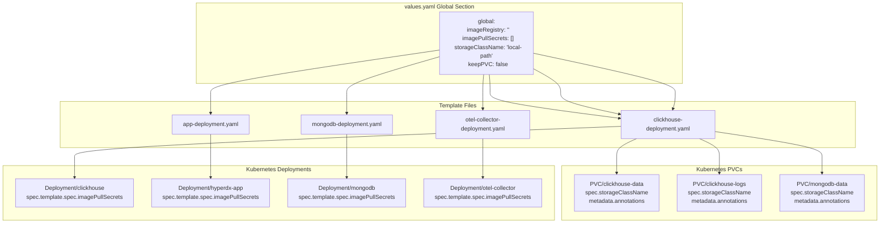

# Global Configuration

> **Relevant source files**
> * [charts/hdx-oss-v2/templates/clickhouse-deployment.yaml](https://github.com/hyperdxio/helm-charts/blob/845dd482/charts/hdx-oss-v2/templates/clickhouse-deployment.yaml)
> * [charts/hdx-oss-v2/values.yaml](https://github.com/hyperdxio/helm-charts/blob/845dd482/charts/hdx-oss-v2/values.yaml)

## Purpose and Scope

This document covers the global configuration settings defined under the `global` key in the HyperDX Helm chart's `values.yaml`. These settings apply universally across all components deployed by the chart (HyperDX application, ClickHouse, MongoDB, and OpenTelemetry Collector). Global configuration provides a centralized way to control cross-cutting concerns such as container image sources, authentication for private registries, persistent storage behavior, and data retention policies.

For component-specific configuration options, see the following pages:

* HyperDX Application: [3.2](/hyperdxio/helm-charts/3.2-hyperdx-application-configuration)
* ClickHouse: [3.3](/hyperdxio/helm-charts/3.3-clickhouse-configuration)
* OpenTelemetry Collector: [3.4](/hyperdxio/helm-charts/3.4-opentelemetry-collector-configuration)
* MongoDB: [3.5](/hyperdxio/helm-charts/3.5-mongodb-configuration)

## Global Configuration Structure

The `global` section in `values.yaml` contains four primary settings that influence how all components in the chart are deployed and managed:

```yaml
global:
  imageRegistry: ""
  imagePullSecrets: []
  storageClassName: "local-path"
  keepPVC: false
```

**Global Configuration Flow Through System**



Sources: [charts/hdx-oss-v2/values.yaml L1-L12](https://github.com/hyperdxio/helm-charts/blob/845dd482/charts/hdx-oss-v2/values.yaml#L1-L12)

## Configuration Settings Reference

### imageRegistry

**Type:** `string`
**Default:** `""` (empty string)
**Purpose:** Override the default container image registry for all component images

The `imageRegistry` setting allows you to specify an alternative container registry to pull images from. When empty, components use their configured registries (e.g., `docker.hyperdx.io` for HyperDX components, Docker Hub for MongoDB and ClickHouse). This is useful for:

* Using a private mirror registry
* Complying with organizational policies that require all images to come from an internal registry
* Working in air-gapped environments

**Example Configuration:**

```yaml
global:
  imageRegistry: "registry.mycompany.com"
```

When set, this value would typically be prepended to image names during template rendering, though the current implementation relies on component-specific image configurations.

**Component Image Defaults:**

| Component | Default Image | Values Path |
| --- | --- | --- |
| HyperDX Application | `docker.hyperdx.io/hyperdx/hyperdx` | `hyperdx.image.repository` |
| OpenTelemetry Collector | `docker.hyperdx.io/hyperdx/hyperdx-otel-collector` | `otel.image.repository` |
| ClickHouse | `clickhouse/clickhouse-server:25.7-alpine` | `clickhouse.image` |
| MongoDB | `mongo:5.0.14-focal` | `mongodb.image` |

Sources: [charts/hdx-oss-v2/values.yaml L2](https://github.com/hyperdxio/helm-charts/blob/845dd482/charts/hdx-oss-v2/values.yaml#L2-L2)

### imagePullSecrets

**Type:** `array` of objects
**Default:** `[]` (empty array)
**Purpose:** Provide authentication credentials for pulling images from private container registries

The `imagePullSecrets` setting specifies Kubernetes secrets containing Docker registry credentials. These secrets are referenced in the pod specifications of all deployments to authenticate with private registries. This is critical for:

* Avoiding Docker Hub rate limiting (429 errors)
* Accessing images stored in private registries
* Ensuring reliable image pulls in production environments

**Configuration Example:**

```yaml
global:
  imagePullSecrets:
    - name: regcred
    - name: docker-hub-secret
```

**Template Implementation Pattern**



**Implementation in Templates:**

The `imagePullSecrets` configuration is injected into deployment specifications using the following pattern:

```yaml
{{- if .Values.global.imagePullSecrets }}
imagePullSecrets:
  {{- toYaml .Values.global.imagePullSecrets | nindent 8 }}
{{- end }}
```

This pattern appears in:

* [charts/hdx-oss-v2/templates/clickhouse-deployment.yaml L32-L35](https://github.com/hyperdxio/helm-charts/blob/845dd482/charts/hdx-oss-v2/templates/clickhouse-deployment.yaml#L32-L35)
* All other deployment templates for consistency

**Creating Image Pull Secrets:**

Before using `imagePullSecrets`, you must create the corresponding Kubernetes secret:

```sql
kubectl create secret docker-registry regcred \
  --docker-server=<registry-url> \
  --docker-username=<username> \
  --docker-password=<password> \
  --docker-email=<email>
```

Sources: [charts/hdx-oss-v2/values.yaml L3-L9](https://github.com/hyperdxio/helm-charts/blob/845dd482/charts/hdx-oss-v2/values.yaml#L3-L9)

 [charts/hdx-oss-v2/templates/clickhouse-deployment.yaml L32-L35](https://github.com/hyperdxio/helm-charts/blob/845dd482/charts/hdx-oss-v2/templates/clickhouse-deployment.yaml#L32-L35)

### storageClassName

**Type:** `string`
**Default:** `"local-path"`
**Purpose:** Specify the Kubernetes StorageClass for all PersistentVolumeClaims

The `storageClassName` setting determines which StorageClass is used when provisioning persistent volumes for stateful components. This setting is critical for:

* Matching storage performance characteristics to workload requirements
* Ensuring compatibility with the underlying Kubernetes cluster infrastructure
* Controlling storage costs and retention policies

**Storage Class Usage by Component:**

| Component | PVC Name | Purpose | Size (Default) | Values Path |
| --- | --- | --- | --- | --- |
| ClickHouse | `clickhouse-data` | Database files | 10Gi | `clickhouse.persistence.dataSize` |
| ClickHouse | `clickhouse-logs` | Server logs | 5Gi | `clickhouse.persistence.logSize` |
| MongoDB | `mongodb-data` | Database files | 10Gi | `mongodb.persistence.dataSize` |

**Configuration Example:**

```yaml
global:
  storageClassName: "standard-rwo"
```

**Common StorageClass Values by Platform:**

| Platform | Recommended StorageClass | Characteristics |
| --- | --- | --- |
| Google Kubernetes Engine (GKE) | `standard-rwo` | Persistent disk, single-node RW |
| Amazon EKS | `gp3` or `gp2` | EBS volumes |
| Azure AKS | `managed-premium` | Premium SSD |
| Local Development (Docker Desktop) | `hostpath` | Local filesystem |
| Local Development (k3s/k3d) | `local-path` | Local path provisioner |

**Template Implementation:**



**Template Pattern in PVC Definitions:**

The storage class is conditionally included in PVC specifications:

```yaml
spec:
  accessModes:
    - ReadWriteOnce
  {{- if .Values.global.storageClassName }}
  storageClassName: {{ .Values.global.storageClassName }}
  {{- end }}
  resources:
    requests:
      storage: {{ .Values.clickhouse.persistence.dataSize }}
```

When `global.storageClassName` is not set, the PVC will use the cluster's default StorageClass.

Sources: [charts/hdx-oss-v2/values.yaml L10](https://github.com/hyperdxio/helm-charts/blob/845dd482/charts/hdx-oss-v2/values.yaml#L10-L10)

 [charts/hdx-oss-v2/templates/clickhouse-deployment.yaml L190-L192](https://github.com/hyperdxio/helm-charts/blob/845dd482/charts/hdx-oss-v2/templates/clickhouse-deployment.yaml#L190-L192)

### keepPVC

**Type:** `boolean`
**Default:** `false`
**Purpose:** Control whether PersistentVolumeClaims are preserved when the Helm release is uninstalled

The `keepPVC` setting determines data retention behavior during chart uninstallation. When enabled, it adds a Helm resource policy annotation to all PVCs, instructing Helm to preserve them even when the release is deleted. This is essential for:

* Protecting production data from accidental deletion
* Enabling safe chart upgrades by preserving data across releases
* Maintaining data for disaster recovery scenarios

**Configuration Example:**

```yaml
global:
  keepPVC: true
```

**Data Preservation Mechanism**



**Template Implementation Pattern:**

The annotation is conditionally added to PVC metadata:

```yaml
metadata:
  name: {{ include "hdx-oss.fullname" . }}-clickhouse-data
  labels:
    {{- include "hdx-oss.labels" . | nindent 4 }}
  {{- if .Values.global.keepPVC }}
  annotations:
    "helm.sh/resource-policy": keep
  {{- end }}
```

This pattern is applied to:

* [charts/hdx-oss-v2/templates/clickhouse-deployment.yaml L183-L186](https://github.com/hyperdxio/helm-charts/blob/845dd482/charts/hdx-oss-v2/templates/clickhouse-deployment.yaml#L183-L186)  - ClickHouse data PVC
* [charts/hdx-oss-v2/templates/clickhouse-deployment.yaml L203-L206](https://github.com/hyperdxio/helm-charts/blob/845dd482/charts/hdx-oss-v2/templates/clickhouse-deployment.yaml#L203-L206)  - ClickHouse logs PVC
* MongoDB data PVC (in mongodb-deployment.yaml)

**Lifecycle Behavior:**

| Scenario | keepPVC: false | keepPVC: true |
| --- | --- | --- |
| `helm uninstall` | PVCs deleted, data lost | PVCs preserved, data retained |
| `helm upgrade` | PVCs remain, data retained | PVCs remain, data retained |
| Manual `kubectl delete pvc` | PVC deleted | PVC deleted |

**Important Considerations:**

1. **Manual Cleanup Required:** When `keepPVC: true`, orphaned PVCs must be manually deleted after uninstalling the chart
2. **Storage Costs:** Preserved PVCs continue to incur storage costs until manually deleted
3. **Reinstallation:** To reuse preserved PVCs, the new installation must use the same release name
4. **Production Recommendation:** Set `keepPVC: true` for production deployments to prevent accidental data loss

Sources: [charts/hdx-oss-v2/values.yaml L11-L12](https://github.com/hyperdxio/helm-charts/blob/845dd482/charts/hdx-oss-v2/values.yaml#L11-L12)

 [charts/hdx-oss-v2/templates/clickhouse-deployment.yaml L183-L186](https://github.com/hyperdxio/helm-charts/blob/845dd482/charts/hdx-oss-v2/templates/clickhouse-deployment.yaml#L183-L186)

 [charts/hdx-oss-v2/templates/clickhouse-deployment.yaml L203-L206](https://github.com/hyperdxio/helm-charts/blob/845dd482/charts/hdx-oss-v2/templates/clickhouse-deployment.yaml#L203-L206)

## Configuration Application Flow

**Global Settings to Kubernetes Resources**



Sources: [charts/hdx-oss-v2/values.yaml L1-L12](https://github.com/hyperdxio/helm-charts/blob/845dd482/charts/hdx-oss-v2/values.yaml#L1-L12)

 [charts/hdx-oss-v2/templates/clickhouse-deployment.yaml L32-L35](https://github.com/hyperdxio/helm-charts/blob/845dd482/charts/hdx-oss-v2/templates/clickhouse-deployment.yaml#L32-L35)

 [charts/hdx-oss-v2/templates/clickhouse-deployment.yaml L183-L186](https://github.com/hyperdxio/helm-charts/blob/845dd482/charts/hdx-oss-v2/templates/clickhouse-deployment.yaml#L183-L186)

 [charts/hdx-oss-v2/templates/clickhouse-deployment.yaml L190-L192](https://github.com/hyperdxio/helm-charts/blob/845dd482/charts/hdx-oss-v2/templates/clickhouse-deployment.yaml#L190-L192)

## Configuration Examples

### Development Environment

```yaml
global:
  imageRegistry: ""
  imagePullSecrets: []
  storageClassName: "local-path"
  keepPVC: false
```

This default configuration is suitable for local development environments using k3s, k3d, or Docker Desktop.

### Production Environment with Private Registry

```yaml
global:
  imageRegistry: "registry.mycompany.com"
  imagePullSecrets:
    - name: company-registry-secret
  storageClassName: "fast-ssd"
  keepPVC: true
```

### Cloud Provider Configurations

**Google Kubernetes Engine (GKE):**

```yaml
global:
  imagePullSecrets:
    - name: gcr-json-key
  storageClassName: "standard-rwo"
  keepPVC: true
```

**Amazon EKS:**

```yaml
global:
  imagePullSecrets:
    - name: ecr-registry-helper
  storageClassName: "gp3"
  keepPVC: true
```

**Azure AKS:**

```yaml
global:
  imagePullSecrets:
    - name: acr-secret
  storageClassName: "managed-premium"
  keepPVC: true
```

Sources: [charts/hdx-oss-v2/values.yaml L1-L12](https://github.com/hyperdxio/helm-charts/blob/845dd482/charts/hdx-oss-v2/values.yaml#L1-L12)