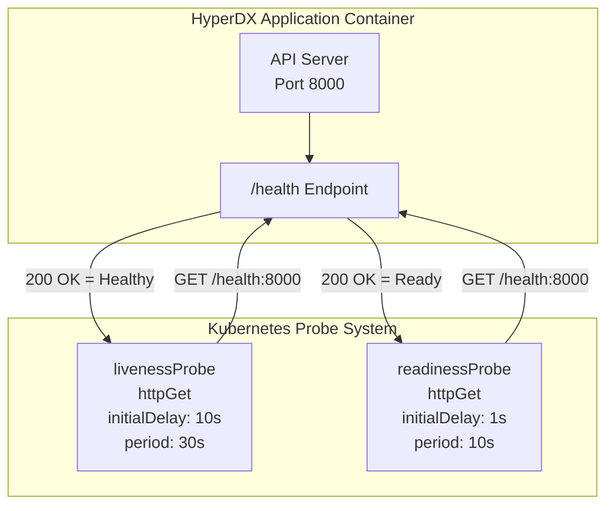
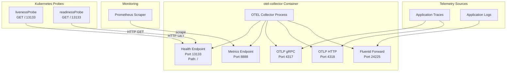
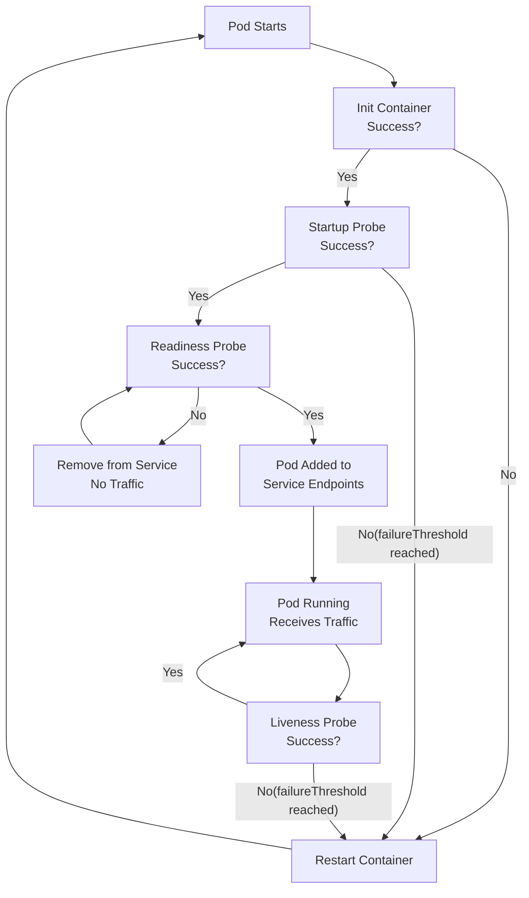

# Health Checks and Monitoring

> **Relevant source files**
> * [charts/hdx-oss-v2/templates/hyperdx-deployment.yaml](https://github.com/hyperdxio/helm-charts/blob/845dd482/charts/hdx-oss-v2/templates/hyperdx-deployment.yaml)
> * [charts/hdx-oss-v2/templates/otel-collector-deployment.yaml](https://github.com/hyperdxio/helm-charts/blob/845dd482/charts/hdx-oss-v2/templates/otel-collector-deployment.yaml)
> * [charts/hdx-oss-v2/values.yaml](https://github.com/hyperdxio/helm-charts/blob/845dd482/charts/hdx-oss-v2/values.yaml)

This document describes the health check and monitoring capabilities built into the HyperDX Helm chart deployment. It covers Kubernetes health probes, Prometheus metrics endpoints, and how to monitor the operational status of your HyperDX deployment.

For troubleshooting unhealthy deployments or debugging issues, see [Troubleshooting](/hyperdxio/helm-charts/8.4-troubleshooting). For configuring resource limits and scaling, see [Resource Management](/hyperdxio/helm-charts/8.2-resource-management).

## Overview of Health Check Strategy

The HyperDX Helm chart implements comprehensive health checking across all components using Kubernetes native probes. Each component exposes health endpoints that Kubernetes uses to determine pod readiness and liveness. Additionally, certain components expose Prometheus-compatible metrics endpoints for detailed operational monitoring.

### Health Check Architecture

```mermaid
flowchart TD

Kubelet["Kubelet<br>(Health Check Controller)"]
AppContainer["app container<br>hyperdx:AppVersion"]
AppLiveness["Liveness Probe<br>GET /health:8000"]
AppReadiness["Readiness Probe<br>GET /health:8000"]
CHContainer["clickhouse-server container"]
CHLiveness["Liveness Probe<br>HTTP :8123"]
CHReadiness["Readiness Probe<br>HTTP :8123"]
CHStartup["Startup Probe<br>HTTP :8123"]
CHPrometheus["Prometheus Endpoint<br>GET /metrics:9363"]
OTELContainer["otel-collector container"]
OTELLiveness["Liveness Probe<br>GET /:13133"]
OTELReadiness["Readiness Probe<br>GET /:13133"]
OTELMetrics["Metrics Endpoint<br>:8888"]
MongoContainer["mongo container"]
MongoLiveness["Liveness Probe"]
MongoReadiness["Readiness Probe"]
Prometheus["Prometheus Server<br>(optional)"]

Kubelet -->|"periodSeconds: 30"| AppLiveness
Kubelet -->|"periodSeconds: 10"| AppReadiness
Kubelet -->|"periodSeconds: 30"| CHLiveness
Kubelet -->|"periodSeconds: 10"| CHReadiness
Kubelet -->|"periodSeconds: 10"| CHStartup
Kubelet -->|"periodSeconds: 30"| OTELLiveness
Kubelet -->|"periodSeconds: 10"| OTELReadiness
Kubelet --> MongoLiveness
Kubelet --> MongoReadiness
Prometheus -->|"scrape"| CHPrometheus
Prometheus -->|"scrape"| OTELMetrics

subgraph subGraph5 ["Monitoring System"]
    Prometheus
end

subgraph subGraph4 ["MongoDB Pod"]
    MongoContainer
    MongoLiveness
    MongoReadiness
    MongoLiveness --> MongoContainer
    MongoReadiness --> MongoContainer
end

subgraph subGraph3 ["OTEL Collector Pod"]
    OTELContainer
    OTELLiveness
    OTELReadiness
    OTELMetrics
    OTELLiveness --> OTELContainer
    OTELReadiness --> OTELContainer
    OTELMetrics --> OTELContainer
end

subgraph subGraph2 ["ClickHouse Pod"]
    CHContainer
    CHLiveness
    CHReadiness
    CHStartup
    CHPrometheus
    CHLiveness --> CHContainer
    CHReadiness --> CHContainer
    CHStartup --> CHContainer
    CHPrometheus --> CHContainer
end

subgraph subGraph1 ["HyperDX Application Pod"]
    AppContainer
    AppLiveness
    AppReadiness
    AppLiveness --> AppContainer
    AppReadiness --> AppContainer
end

subgraph subGraph0 ["Kubernetes Control Plane"]
    Kubelet
end
```



**Sources:** [charts/hdx-oss-v2/values.yaml L23-L34](https://github.com/hyperdxio/helm-charts/blob/845dd482/charts/hdx-oss-v2/values.yaml#L23-L34)

 [charts/hdx-oss-v2/values.yaml L276-L287](https://github.com/hyperdxio/helm-charts/blob/845dd482/charts/hdx-oss-v2/values.yaml#L276-L287)

 [charts/hdx-oss-v2/values.yaml L303-L320](https://github.com/hyperdxio/helm-charts/blob/845dd482/charts/hdx-oss-v2/values.yaml#L303-L320)

 [charts/hdx-oss-v2/values.yaml L453-L464](https://github.com/hyperdxio/helm-charts/blob/845dd482/charts/hdx-oss-v2/values.yaml#L453-L464)

## Kubernetes Health Probes

Kubernetes uses three types of health probes to manage pod lifecycle:

| Probe Type | Purpose | Failure Action |
| --- | --- | --- |
| **Liveness** | Determines if container is running properly | Restarts the container |
| **Readiness** | Determines if pod can accept traffic | Removes pod from service endpoints |
| **Startup** | Gives slow-starting containers extra time | Restarts if not ready within window |

All probes in this chart use HTTP GET requests and support the following configuration parameters:

| Parameter | Description | Default Value |
| --- | --- | --- |
| `initialDelaySeconds` | Time to wait before first probe | Component-specific |
| `periodSeconds` | Frequency of probe execution | Component-specific |
| `timeoutSeconds` | Probe timeout duration | 5 seconds |
| `failureThreshold` | Consecutive failures before action | 3 attempts |

**Sources:** [charts/hdx-oss-v2/values.yaml L23-L34](https://github.com/hyperdxio/helm-charts/blob/845dd482/charts/hdx-oss-v2/values.yaml#L23-L34)

 [charts/hdx-oss-v2/values.yaml L276-L287](https://github.com/hyperdxio/helm-charts/blob/845dd482/charts/hdx-oss-v2/values.yaml#L276-L287)

 [charts/hdx-oss-v2/values.yaml L303-L320](https://github.com/hyperdxio/helm-charts/blob/845dd482/charts/hdx-oss-v2/values.yaml#L303-L320)

 [charts/hdx-oss-v2/values.yaml L453-L464](https://github.com/hyperdxio/helm-charts/blob/845dd482/charts/hdx-oss-v2/values.yaml#L453-L464)

## HyperDX Application Health Checks

The HyperDX application pod exposes a `/health` endpoint on the API port (default: 8000) used by both liveness and readiness probes.

### Configuration

```yaml
hyperdx:
  livenessProbe:
    enabled: true
    initialDelaySeconds: 10
    periodSeconds: 30
    timeoutSeconds: 5
    failureThreshold: 3
  readinessProbe:
    enabled: true
    initialDelaySeconds: 1
    periodSeconds: 10
    timeoutSeconds: 5
    failureThreshold: 3
```

### Implementation Details

The probes are implemented as HTTP GET requests in the deployment manifest:



The deployment template renders these probes conditionally based on the `enabled` flag:

* Liveness probe: [charts/hdx-oss-v2/templates/hyperdx-deployment.yaml L72-L81](https://github.com/hyperdxio/helm-charts/blob/845dd482/charts/hdx-oss-v2/templates/hyperdx-deployment.yaml#L72-L81)
* Readiness probe: [charts/hdx-oss-v2/templates/hyperdx-deployment.yaml L82-L91](https://github.com/hyperdxio/helm-charts/blob/845dd482/charts/hdx-oss-v2/templates/hyperdx-deployment.yaml#L82-L91)

### Wait-for-MongoDB Init Container

Before health checks begin, the HyperDX pod uses an init container to ensure MongoDB is reachable:

```yaml
initContainers:
  - name: wait-for-mongodb
    image: busybox@sha256:1fcf5df59121b92d61e066df1788e8df0cc35623f5d62d9679a41e163b6a0cdb
    command: ['sh', '-c', 'until nc -z <mongodb-service> 27017; do echo waiting for mongodb; sleep 2; done;']
```

This prevents the application container from starting before its dependencies are ready.

**Sources:** [charts/hdx-oss-v2/values.yaml L23-L34](https://github.com/hyperdxio/helm-charts/blob/845dd482/charts/hdx-oss-v2/values.yaml#L23-L34)

 [charts/hdx-oss-v2/templates/hyperdx-deployment.yaml L50-L56](https://github.com/hyperdxio/helm-charts/blob/845dd482/charts/hdx-oss-v2/templates/hyperdx-deployment.yaml#L50-L56)

 [charts/hdx-oss-v2/templates/hyperdx-deployment.yaml L72-L91](https://github.com/hyperdxio/helm-charts/blob/845dd482/charts/hdx-oss-v2/templates/hyperdx-deployment.yaml#L72-L91)

## ClickHouse Health Checks

ClickHouse implements all three probe types, including a startup probe to accommodate its longer initialization time.

### Configuration

```yaml
clickhouse:
  livenessProbe:
    enabled: true
    initialDelaySeconds: 10
    periodSeconds: 30
    timeoutSeconds: 5
    failureThreshold: 3
  readinessProbe:
    enabled: true
    initialDelaySeconds: 1
    periodSeconds: 10
    timeoutSeconds: 5
    failureThreshold: 3
  startupProbe:
    enabled: true
    initialDelaySeconds: 5
    periodSeconds: 10
    timeoutSeconds: 5
    failureThreshold: 30
```

### Startup Probe Strategy

The startup probe gives ClickHouse up to 300 seconds (30 failures × 10 seconds) to complete initialization. This is critical for ClickHouse because:

1. It needs to initialize its data directory structure
2. It must load configuration files
3. It performs schema initialization on first start
4. It may need to recover from previous unclean shutdowns

Once the startup probe succeeds, liveness and readiness probes take over normal health monitoring.

### Prometheus Metrics Endpoint

ClickHouse exposes Prometheus-compatible metrics when enabled:

```yaml
clickhouse:
  prometheus:
    enabled: true
    port: 9363
    endpoint: "/metrics"
```

The metrics endpoint provides detailed operational metrics including:

* Query performance statistics
* Connection pool status
* Memory usage
* Disk I/O metrics
* Table-level statistics

**Example scrape configuration for Prometheus:**

```yaml
scrape_configs:
  - job_name: 'clickhouse'
    static_configs:
      - targets: ['<release-name>-clickhouse:9363']
```

**Sources:** [charts/hdx-oss-v2/values.yaml L303-L320](https://github.com/hyperdxio/helm-charts/blob/845dd482/charts/hdx-oss-v2/values.yaml#L303-L320)

 [charts/hdx-oss-v2/values.yaml L350-L353](https://github.com/hyperdxio/helm-charts/blob/845dd482/charts/hdx-oss-v2/values.yaml#L350-L353)

## OpenTelemetry Collector Health Checks

The OTEL Collector exposes health endpoints on multiple ports for different purposes.

### Health Check Configuration

```yaml
otel:
  port: 13133          # Health check endpoint
  healthPort: 8888     # Metrics endpoint
  livenessProbe:
    enabled: true
    initialDelaySeconds: 10
    periodSeconds: 30
    timeoutSeconds: 5
    failureThreshold: 3
  readinessProbe:
    enabled: true
    initialDelaySeconds: 5
    periodSeconds: 10
    timeoutSeconds: 5
    failureThreshold: 3
```

### Port Architecture



### Implementation in Deployment

The probes are configured in the OTEL Collector deployment:

* Liveness probe: [charts/hdx-oss-v2/templates/otel-collector-deployment.yaml L59-L68](https://github.com/hyperdxio/helm-charts/blob/845dd482/charts/hdx-oss-v2/templates/otel-collector-deployment.yaml#L59-L68)
* Readiness probe: [charts/hdx-oss-v2/templates/otel-collector-deployment.yaml L69-L78](https://github.com/hyperdxio/helm-charts/blob/845dd482/charts/hdx-oss-v2/templates/otel-collector-deployment.yaml#L69-L78)

Both probes check the root path `/` on port `13133`, which is the OTEL Collector's health check extension endpoint.

### Metrics Port

Port `8888` exposes internal OTEL Collector metrics in Prometheus format. These metrics include:

* Pipeline throughput (spans/logs/metrics per second)
* Queue lengths and backpressure indicators
* Export success/failure rates
* Memory and CPU usage
* Receiver-specific metrics

**Sources:** [charts/hdx-oss-v2/values.yaml L400-L404](https://github.com/hyperdxio/helm-charts/blob/845dd482/charts/hdx-oss-v2/values.yaml#L400-L404)

 [charts/hdx-oss-v2/values.yaml L453-L464](https://github.com/hyperdxio/helm-charts/blob/845dd482/charts/hdx-oss-v2/values.yaml#L453-L464)

 [charts/hdx-oss-v2/templates/otel-collector-deployment.yaml L49-L78](https://github.com/hyperdxio/helm-charts/blob/845dd482/charts/hdx-oss-v2/templates/otel-collector-deployment.yaml#L49-L78)

## MongoDB Health Checks

MongoDB uses standard Kubernetes probes without custom endpoints.

### Configuration

```yaml
mongodb:
  livenessProbe:
    enabled: true
    initialDelaySeconds: 10
    periodSeconds: 30
    timeoutSeconds: 5
    failureThreshold: 3
  readinessProbe:
    enabled: true
    initialDelaySeconds: 1
    periodSeconds: 10
    timeoutSeconds: 5
    failureThreshold: 3
```

The MongoDB probes typically use TCP socket checks or command execution (e.g., `mongo --eval "db.adminCommand('ping')"`), depending on the MongoDB image implementation.

**Sources:** [charts/hdx-oss-v2/values.yaml L276-L287](https://github.com/hyperdxio/helm-charts/blob/845dd482/charts/hdx-oss-v2/values.yaml#L276-L287)

## Health Check Status Summary

The following table summarizes all health checks across components:

| Component | Liveness Probe | Readiness Probe | Startup Probe | Metrics Port |
| --- | --- | --- | --- | --- |
| **HyperDX App** | `/health:8000` (30s) | `/health:8000` (10s) | - | - |
| **ClickHouse** | `:8123` (30s) | `:8123` (10s) | `:8123` (10s) | `:9363` |
| **OTEL Collector** | `/:13133` (30s) | `/:13133` (10s) | - | `:8888` |
| **MongoDB** | (30s) | (10s) | - | - |

**Sources:** [charts/hdx-oss-v2/values.yaml L23-L34](https://github.com/hyperdxio/helm-charts/blob/845dd482/charts/hdx-oss-v2/values.yaml#L23-L34)

 [charts/hdx-oss-v2/values.yaml L276-L287](https://github.com/hyperdxio/helm-charts/blob/845dd482/charts/hdx-oss-v2/values.yaml#L276-L287)

 [charts/hdx-oss-v2/values.yaml L303-L320](https://github.com/hyperdxio/helm-charts/blob/845dd482/charts/hdx-oss-v2/values.yaml#L303-L320)

 [charts/hdx-oss-v2/values.yaml L453-L464](https://github.com/hyperdxio/helm-charts/blob/845dd482/charts/hdx-oss-v2/values.yaml#L453-L464)

## Accessing Health Status

### Using kubectl

Check pod health status:

```html
# View pod status and restarts
kubectl get pods -l app.kubernetes.io/name=hdx-oss-v2

# Describe a pod to see probe status
kubectl describe pod <pod-name>

# Check events for probe failures
kubectl get events --sort-by='.lastTimestamp' | grep -i probe
```

### Testing Health Endpoints Directly

You can port-forward to test health endpoints:

```markdown
# HyperDX application health endpoint
kubectl port-forward svc/<release-name>-app 8000:8000
curl http://localhost:8000/health

# OTEL Collector health endpoint
kubectl port-forward svc/<release-name>-otel-collector 13133:13133
curl http://localhost:13133/

# ClickHouse metrics endpoint
kubectl port-forward svc/<release-name>-clickhouse 9363:9363
curl http://localhost:9363/metrics

# OTEL Collector metrics endpoint
kubectl port-forward svc/<release-name>-otel-collector 8888:8888
curl http://localhost:8888/metrics
```

### Pod Status Conditions

Kubernetes maintains status conditions for each pod that reflect probe results:

```html
kubectl get pod <pod-name> -o jsonpath='{.status.conditions[*].type}' | tr ' ' '\n'
```

Key conditions:

* `Initialized`: All init containers completed
* `Ready`: Readiness probe passing
* `ContainersReady`: All containers ready
* `PodScheduled`: Pod assigned to node

**Sources:** Standard Kubernetes operations

## Integrating with Monitoring Systems

### Prometheus ServiceMonitor

If using the Prometheus Operator, create a `ServiceMonitor` resource:

```yaml
apiVersion: monitoring.coreos.com/v1
kind: ServiceMonitor
metadata:
  name: hyperdx-clickhouse
spec:
  selector:
    matchLabels:
      app.kubernetes.io/name: hdx-oss-v2
      app: clickhouse
  endpoints:
    - port: prometheus
      interval: 30s
      path: /metrics
---
apiVersion: monitoring.coreos.com/v1
kind: ServiceMonitor
metadata:
  name: hyperdx-otel-collector
spec:
  selector:
    matchLabels:
      app.kubernetes.io/name: hdx-oss-v2
      app: otel-collector
  endpoints:
    - port: metrics
      interval: 30s
```

### Custom Health Checks

For custom monitoring solutions, the health endpoints can be integrated with:

* Datadog APM
* New Relic
* Grafana Cloud
* Custom monitoring scripts

All endpoints return HTTP 200 for healthy status and non-200 codes for unhealthy status.

**Sources:** Standard Prometheus Operator patterns

## Disabling Health Checks

Health checks can be disabled per component if needed (not recommended for production):

```yaml
hyperdx:
  livenessProbe:
    enabled: false
  readinessProbe:
    enabled: false

clickhouse:
  livenessProbe:
    enabled: false
  readinessProbe:
    enabled: false
  startupProbe:
    enabled: false

otel:
  livenessProbe:
    enabled: false
  readinessProbe:
    enabled: false

mongodb:
  livenessProbe:
    enabled: false
  readinessProbe:
    enabled: false
```

Disabling health checks removes Kubernetes' ability to automatically detect and recover from failures.

**Sources:** [charts/hdx-oss-v2/values.yaml L23-L34](https://github.com/hyperdxio/helm-charts/blob/845dd482/charts/hdx-oss-v2/values.yaml#L23-L34)

 [charts/hdx-oss-v2/values.yaml L276-L287](https://github.com/hyperdxio/helm-charts/blob/845dd482/charts/hdx-oss-v2/values.yaml#L276-L287)

 [charts/hdx-oss-v2/values.yaml L303-L320](https://github.com/hyperdxio/helm-charts/blob/845dd482/charts/hdx-oss-v2/values.yaml#L303-L320)

 [charts/hdx-oss-v2/values.yaml L453-L464](https://github.com/hyperdxio/helm-charts/blob/845dd482/charts/hdx-oss-v2/values.yaml#L453-L464)

## Tuning Health Check Parameters

### Adjusting for Slow Environments

In resource-constrained environments, you may need to increase timeouts:

```yaml
clickhouse:
  livenessProbe:
    initialDelaySeconds: 30
    periodSeconds: 60
    timeoutSeconds: 10
    failureThreshold: 5
  startupProbe:
    initialDelaySeconds: 10
    periodSeconds: 15
    failureThreshold: 60  # 15 minutes total startup time
```

### Aggressive Failure Detection

For faster failure detection in production with adequate resources:

```yaml
hyperdx:
  livenessProbe:
    initialDelaySeconds: 5
    periodSeconds: 10
    timeoutSeconds: 3
    failureThreshold: 2
  readinessProbe:
    initialDelaySeconds: 1
    periodSeconds: 5
    timeoutSeconds: 3
    failureThreshold: 2
```

**Sources:** [charts/hdx-oss-v2/values.yaml L23-L34](https://github.com/hyperdxio/helm-charts/blob/845dd482/charts/hdx-oss-v2/values.yaml#L23-L34)

 [charts/hdx-oss-v2/values.yaml L303-L320](https://github.com/hyperdxio/helm-charts/blob/845dd482/charts/hdx-oss-v2/values.yaml#L303-L320)

## Health Check Failure Scenarios

### Common Failure Patterns



### Debugging Failed Probes

1. **Check probe configuration:** ```html kubectl get pod <pod-name> -o yaml | grep -A 20 "livenessProbe\|readinessProbe" ```
2. **View probe failure events:** ```html kubectl describe pod <pod-name> | grep -A 5 "Liveness\|Readiness" ```
3. **Check container logs:** ```python kubectl logs <pod-name> --previous  # Logs from crashed container ```
4. **Manually test endpoint:** ```html kubectl exec <pod-name> -- curl -v http://localhost:8000/health ```

**Sources:** Standard Kubernetes debugging practices