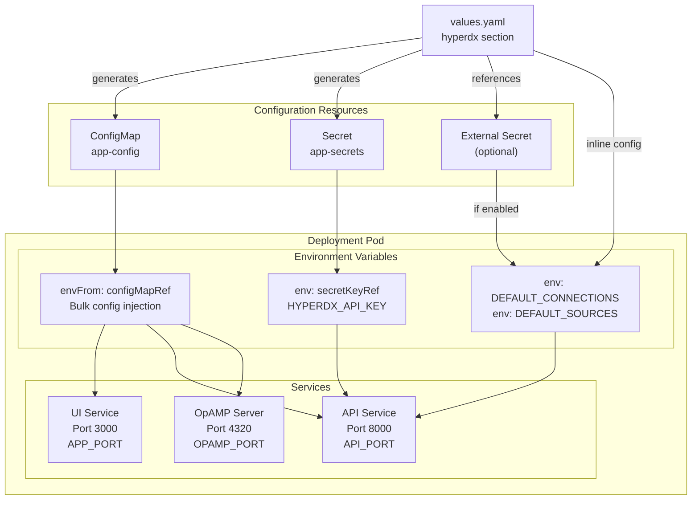
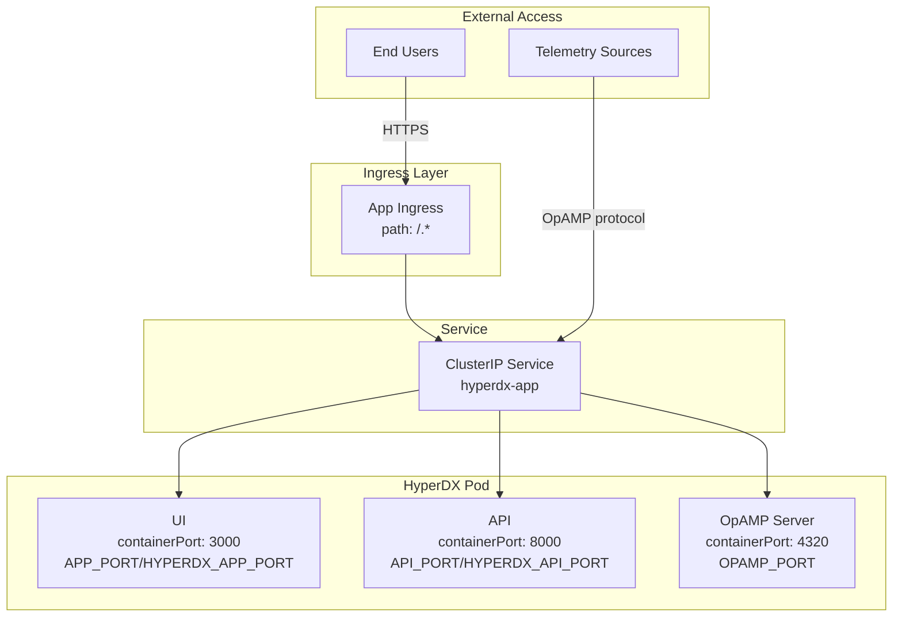
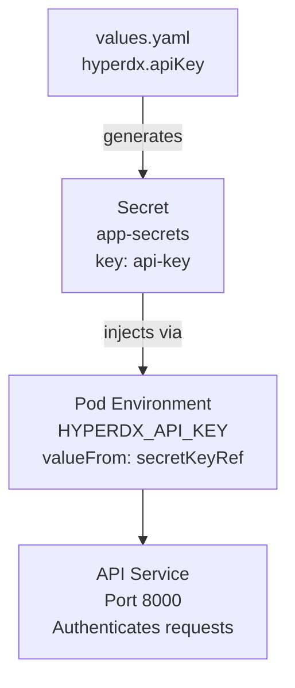
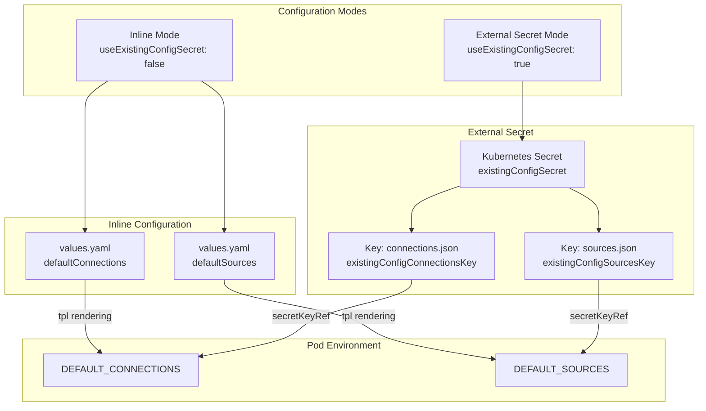
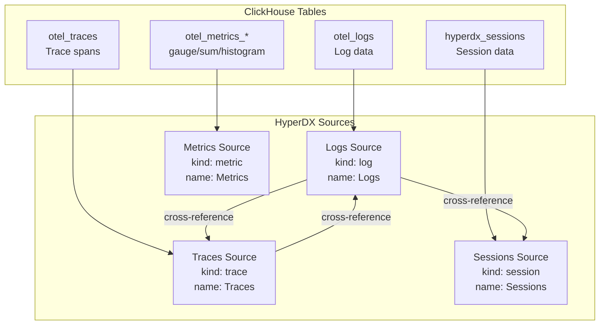
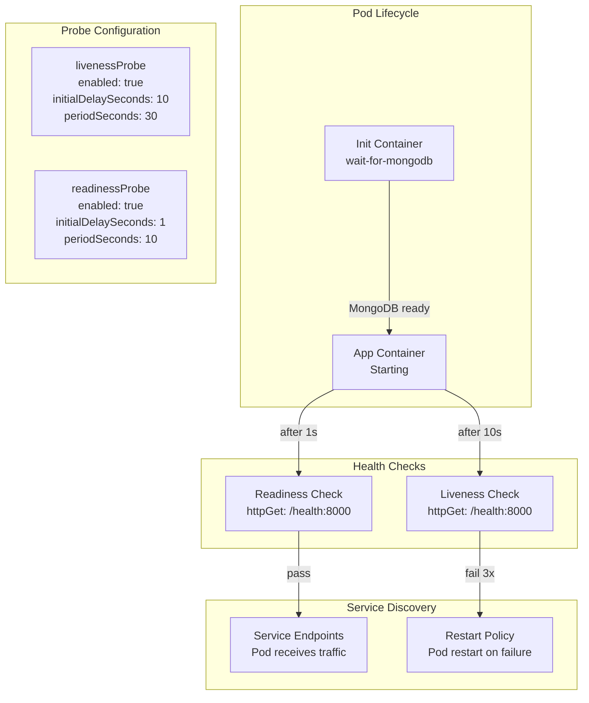

# HyperDX Application Configuration

> **Relevant source files**
> * [charts/hdx-oss-v2/templates/configmaps/app-configmap.yaml](https://github.com/hyperdxio/helm-charts/blob/845dd482/charts/hdx-oss-v2/templates/configmaps/app-configmap.yaml)
> * [charts/hdx-oss-v2/templates/hyperdx-deployment.yaml](https://github.com/hyperdxio/helm-charts/blob/845dd482/charts/hdx-oss-v2/templates/hyperdx-deployment.yaml)
> * [charts/hdx-oss-v2/values.yaml](https://github.com/hyperdxio/helm-charts/blob/845dd482/charts/hdx-oss-v2/values.yaml)

This page documents the configuration options for the HyperDX application deployment, which includes the UI frontend (port 3000), API backend (port 8000), and OpAMP server (port 4320). These settings are defined under the `hyperdx:` section in [values.yaml](https://github.com/hyperdxio/helm-charts/blob/845dd482/values.yaml)

For configurations specific to other system components, see:

* ClickHouse database configuration: [3.3](/hyperdxio/helm-charts/3.3-clickhouse-configuration)
* OpenTelemetry Collector configuration: [3.4](/hyperdxio/helm-charts/3.4-opentelemetry-collector-configuration)
* MongoDB configuration: [3.5](/hyperdxio/helm-charts/3.5-mongodb-configuration)
* Ingress and external access: [3.6](/hyperdxio/helm-charts/3.6-ingress-configuration)
* Global settings (image registry, storage): [3.1](/hyperdxio/helm-charts/3.1-global-configuration)

## Configuration Overview

The HyperDX application is deployed as a single pod containing the unified application binary that serves three distinct services on separate ports. Configuration is injected through multiple mechanisms:



**Sources:** [values.yaml L14-L255](https://github.com/hyperdxio/helm-charts/blob/845dd482/values.yaml#L14-L255)

 [templates/hyperdx-deployment.yaml L92-L126](https://github.com/hyperdxio/helm-charts/blob/845dd482/templates/hyperdx-deployment.yaml#L92-L126)

 [templates/configmaps/app-configmap.yaml L1-L21](https://github.com/hyperdxio/helm-charts/blob/845dd482/templates/configmaps/app-configmap.yaml#L1-L21)

## Image Configuration

The HyperDX application image is configured under `hyperdx.image`:

| Parameter | Default | Description |
| --- | --- | --- |
| `repository` | `docker.hyperdx.io/hyperdx/hyperdx` | Container image repository |
| `tag` | (uses `Chart.AppVersion`) | Image tag to pull |
| `pullPolicy` | `IfNotPresent` | Image pull policy |

The image tag defaults to `.Chart.AppVersion` if not explicitly set. The deployment uses this configuration at [templates/hyperdx-deployment.yaml L59](https://github.com/hyperdxio/helm-charts/blob/845dd482/templates/hyperdx-deployment.yaml#L59-L59)

 to construct the full image reference.

**Example Configuration:**

```yaml
hyperdx:
  image:
    repository: my-registry.example.com/hyperdx
    tag: "2.7.1"
    pullPolicy: Always
```

**Sources:** [values.yaml L15-L18](https://github.com/hyperdxio/helm-charts/blob/845dd482/values.yaml#L15-L18)

 [templates/hyperdx-deployment.yaml L59-L60](https://github.com/hyperdxio/helm-charts/blob/845dd482/templates/hyperdx-deployment.yaml#L59-L60)

## Port Configuration

The HyperDX application exposes three services on separate ports:



| Port Variable | Default | Environment Variable | Purpose |
| --- | --- | --- | --- |
| `appPort` | `3000` | `APP_PORT`, `HYPERDX_APP_PORT` | Frontend UI service |
| `apiPort` | `8000` | `API_PORT`, `HYPERDX_API_PORT` | Backend API and health checks |
| `opampPort` | `4320` | `OPAMP_PORT` | OpAMP management protocol |

All three ports are exposed as container ports in the deployment [templates/hyperdx-deployment.yaml L61-L67](https://github.com/hyperdxio/helm-charts/blob/845dd482/templates/hyperdx-deployment.yaml#L61-L67)

 and injected as environment variables via the ConfigMap [templates/configmaps/app-configmap.yaml L8-L19](https://github.com/hyperdxio/helm-charts/blob/845dd482/templates/configmaps/app-configmap.yaml#L8-L19)

**Sources:** [values.yaml L49-L51](https://github.com/hyperdxio/helm-charts/blob/845dd482/values.yaml#L49-L51)

 [templates/hyperdx-deployment.yaml L61-L67](https://github.com/hyperdxio/helm-charts/blob/845dd482/templates/hyperdx-deployment.yaml#L61-L67)

 [templates/configmaps/app-configmap.yaml L8-L19](https://github.com/hyperdxio/helm-charts/blob/845dd482/templates/configmaps/app-configmap.yaml#L8-L19)

## URL Configuration

### Frontend URL

The `frontendUrl` setting determines the external URL used to access the HyperDX UI. This is critical for proper CORS configuration and frontend routing:

| Parameter | Default | Description |
| --- | --- | --- |
| `appUrl` | `http://localhost` | **Deprecated**: Legacy base URL |
| `frontendUrl` | `{{ .Values.hyperdx.appUrl }}:{{ .Values.hyperdx.appPort }}` | Full URL to access the frontend |

The `frontendUrl` uses Helm templating and defaults to combining `appUrl` and `appPort`. When ingress is enabled, this **must** be updated to match the ingress host and protocol:

```yaml
hyperdx:
  frontendUrl: "https://hyperdx.example.com"
  
ingress:
  enabled: true
  host: "hyperdx.example.com"
  tls:
    enabled: true
```

The `FRONTEND_URL` environment variable is injected into the pod at [templates/configmaps/app-configmap.yaml L10](https://github.com/hyperdxio/helm-charts/blob/845dd482/templates/configmaps/app-configmap.yaml#L10-L10)

**Sources:** [values.yaml L52-L56](https://github.com/hyperdxio/helm-charts/blob/845dd482/values.yaml#L52-L56)

 [templates/configmaps/app-configmap.yaml L10](https://github.com/hyperdxio/helm-charts/blob/845dd482/templates/configmaps/app-configmap.yaml#L10-L10)

## API Key and Secrets Management

### API Key Configuration

The HyperDX API key is used for authentication and authorization. It is stored in a Kubernetes Secret and injected as the `HYPERDX_API_KEY` environment variable:



**Configuration:**

```yaml
hyperdx:
  apiKey: "xxxxxxxx-xxxx-xxxx-xxxx-xxxxxxxxxxxx"
```

The API key is referenced in the deployment at [templates/hyperdx-deployment.yaml L96-L100](https://github.com/hyperdxio/helm-charts/blob/845dd482/templates/hyperdx-deployment.yaml#L96-L100)

 using `secretKeyRef` to securely inject the value.

**Sources:** [values.yaml L48](https://github.com/hyperdxio/helm-charts/blob/845dd482/values.yaml#L48-L48)

 [templates/hyperdx-deployment.yaml L96-L100](https://github.com/hyperdxio/helm-charts/blob/845dd482/templates/hyperdx-deployment.yaml#L96-L100)

### Image Pull Secrets

For private container registries, configure image pull secrets globally:

```yaml
global:
  imagePullSecrets:
    - name: regcred
    - name: docker-hub-secret
```

These are referenced in the deployment at [templates/hyperdx-deployment.yaml L46-L49](https://github.com/hyperdxio/helm-charts/blob/845dd482/templates/hyperdx-deployment.yaml#L46-L49)

**Sources:** [values.yaml L3-L9](https://github.com/hyperdxio/helm-charts/blob/845dd482/values.yaml#L3-L9)

 [templates/hyperdx-deployment.yaml L46-L49](https://github.com/hyperdxio/helm-charts/blob/845dd482/templates/hyperdx-deployment.yaml#L46-L49)

## Database Connection Configuration

### MongoDB URI

The MongoDB connection string is configured via `mongoUri` and defaults to the internal MongoDB service:

```yaml
hyperdx:
  mongoUri: "mongodb://{{ include \"hdx-oss.fullname\" . }}-mongodb:{{ .Values.mongodb.port }}/hyperdx"
```

The URI uses Helm templating to construct the connection string dynamically. For external MongoDB:

```yaml
hyperdx:
  mongoUri: "mongodb://external-mongodb.example.com:27017/hyperdx"

mongodb:
  enabled: false
```

The `MONGO_URI` environment variable is set at [templates/configmaps/app-configmap.yaml L15](https://github.com/hyperdxio/helm-charts/blob/845dd482/templates/configmaps/app-configmap.yaml#L15-L15)

**Sources:** [values.yaml L61](https://github.com/hyperdxio/helm-charts/blob/845dd482/values.yaml#L61-L61)

 [templates/configmaps/app-configmap.yaml L15](https://github.com/hyperdxio/helm-charts/blob/845dd482/templates/configmaps/app-configmap.yaml#L15-L15)

### ClickHouse Connections

ClickHouse connectivity is configured through the `defaultConnections` and `defaultSources` mechanisms, which define how the HyperDX API queries telemetry data.

## Default Connections and Sources

The `defaultConnections` and `defaultSources` configuration is a core feature that defines data source connections and query mappings. This configuration can be provided inline or via external secrets.

### Configuration Methods



**Configuration Parameters:**

| Parameter | Default | Description |
| --- | --- | --- |
| `useExistingConfigSecret` | `false` | Use external secret instead of inline config |
| `existingConfigSecret` | `""` | Name of the secret containing connections/sources |
| `existingConfigConnectionsKey` | `"connections.json"` | Key for connections data in secret |
| `existingConfigSourcesKey` | `"sources.json"` | Key for sources data in secret |

The deployment template implements this logic at [templates/hyperdx-deployment.yaml L101-L123](https://github.com/hyperdxio/helm-charts/blob/845dd482/templates/hyperdx-deployment.yaml#L101-L123)

 checking `useExistingConfigSecret` to determine the injection method.

**Sources:** [values.yaml L77-L91](https://github.com/hyperdxio/helm-charts/blob/845dd482/values.yaml#L77-L91)

 [templates/hyperdx-deployment.yaml L101-L123](https://github.com/hyperdxio/helm-charts/blob/845dd482/templates/hyperdx-deployment.yaml#L101-L123)

### Default Connections Structure

The `defaultConnections` defines ClickHouse database connections as a JSON array:

```yaml
hyperdx:
  defaultConnections: |
    [
      {
        "name": "Local ClickHouse",
        "host": "http://{{ include "hdx-oss.fullname" . }}-clickhouse:8123",
        "port": 8123,
        "username": "app",
        "password": "{{ .Values.clickhouse.config.users.appUserPassword }}"
      }
    ]
```

**Connection Object Schema:**

| Field | Type | Description |
| --- | --- | --- |
| `name` | string | Display name for the connection |
| `host` | string | ClickHouse HTTP endpoint URL |
| `port` | number | ClickHouse HTTP port (typically 8123) |
| `username` | string | ClickHouse username |
| `password` | string | ClickHouse password |

The default configuration uses Helm templating with `tpl` function [templates/hyperdx-deployment.yaml L117](https://github.com/hyperdxio/helm-charts/blob/845dd482/templates/hyperdx-deployment.yaml#L117-L117)

 to dynamically resolve service names and passwords.

**Sources:** [values.yaml L92-L101](https://github.com/hyperdxio/helm-charts/blob/845dd482/values.yaml#L92-L101)

### Default Sources Structure

The `defaultSources` defines mappings between ClickHouse tables and HyperDX data source types. Four source types are preconfigured:



Each source object contains:

| Field | Description |
| --- | --- |
| `name` | Display name for the source |
| `kind` | Source type: `log`, `trace`, `metric`, or `session` |
| `from.databaseName` | ClickHouse database name |
| `from.tableName` | ClickHouse table name |
| `connection` | Reference to connection name |
| `timestampValueExpression` | Column expression for timestamp |
| `serviceNameExpression` | Column expression for service name |
| `bodyExpression` | Column expression for message body |
| `eventAttributesExpression` | Column for attributes/tags |
| `resourceAttributesExpression` | Column for resource attributes |

**Cross-References:**
Sources include cross-reference IDs to link related data:

* `logSourceId`: Reference to logs source
* `traceSourceId`: Reference to traces source
* `metricSourceId`: Reference to metrics source
* `sessionSourceId`: Reference to sessions source

**Example - Logs Source ([values.yaml L106-L128](https://github.com/hyperdxio/helm-charts/blob/845dd482/values.yaml#L106-L128)

):**

```json
{
  "from": {
    "databaseName": "default",
    "tableName": "otel_logs"
  },
  "kind": "log",
  "name": "Logs",
  "timestampValueExpression": "TimestampTime",
  "serviceNameExpression": "ServiceName",
  "bodyExpression": "Body",
  "connection": "Local ClickHouse",
  "traceSourceId": "Traces",
  "sessionSourceId": "Sessions"
}
```

**Example - Metrics Source ([values.yaml L158-L178](https://github.com/hyperdxio/helm-charts/blob/845dd482/values.yaml#L158-L178)

):**

```json
{
  "from": {
    "databaseName": "default",
    "tableName": ""
  },
  "kind": "metric",
  "name": "Metrics",
  "metricTables": {
    "gauge": "otel_metrics_gauge",
    "histogram": "otel_metrics_histogram",
    "sum": "otel_metrics_sum"
  },
  "connection": "Local ClickHouse"
}
```

Note that metric sources have a special `metricTables` object mapping metric types to table names, and an empty `tableName` in the `from` object.

**Disabling Default Configuration:**
To disable default connections or sources, set them to an empty string:

```yaml
hyperdx:
  defaultConnections: ""
  defaultSources: ""
```

**Sources:** [values.yaml L104-L202](https://github.com/hyperdxio/helm-charts/blob/845dd482/values.yaml#L104-L202)

 [templates/hyperdx-deployment.yaml L115-L122](https://github.com/hyperdxio/helm-charts/blob/845dd482/templates/hyperdx-deployment.yaml#L115-L122)

## OTEL Exporter Configuration

The HyperDX application can send its own telemetry (self-monitoring) to an OTEL Collector:

```yaml
hyperdx:
  otelExporterEndpoint: "http://{{ include \"hdx-oss.fullname\" . }}-otel-collector:{{ .Values.otel.httpPort }}"
```

This defaults to the chart's internal OTEL Collector. For external collectors:

```yaml
hyperdx:
  otelExporterEndpoint: "http://external-otel-collector.example.com:4318"
```

The endpoint is set via `OTEL_EXPORTER_OTLP_ENDPOINT` at [templates/configmaps/app-configmap.yaml L20](https://github.com/hyperdxio/helm-charts/blob/845dd482/templates/configmaps/app-configmap.yaml#L20-L20)

**Sources:** [values.yaml L59-L60](https://github.com/hyperdxio/helm-charts/blob/845dd482/values.yaml#L59-L60)

 [templates/configmaps/app-configmap.yaml L20](https://github.com/hyperdxio/helm-charts/blob/845dd482/templates/configmaps/app-configmap.yaml#L20-L20)

## Additional Environment Variables

Custom environment variables can be added via the `hyperdx.env` array:

```yaml
hyperdx:
  env:
    - name: CUSTOM_VAR
      value: "my-value"
    - name: SECRET_VAR
      valueFrom:
        secretKeyRef:
          name: my-secret
          key: secret-key
```

These are appended to the container environment at [templates/hyperdx-deployment.yaml L124-L126](https://github.com/hyperdxio/helm-charts/blob/845dd482/templates/hyperdx-deployment.yaml#L124-L126)

**Standard Environment Variables:**

The following environment variables are automatically configured via ConfigMap:

| Variable | Source | Description |
| --- | --- | --- |
| `APP_PORT` | `hyperdx.appPort` | UI service port |
| `API_PORT` | `hyperdx.apiPort` | API service port |
| `FRONTEND_URL` | `hyperdx.frontendUrl` | External frontend URL |
| `HYPERDX_LOG_LEVEL` | `hyperdx.logLevel` | Log level (default: "info") |
| `MONGO_URI` | `hyperdx.mongoUri` | MongoDB connection string |
| `USAGE_STATS_ENABLED` | `hyperdx.usageStatsEnabled` | Enable usage statistics (default: true) |
| `RUN_SCHEDULED_TASKS_EXTERNALLY` | `tasks.enabled` | Use external CronJobs for scheduled tasks |
| `OTEL_SERVICE_NAME` | - | Service name for self-monitoring ("hdx-oss-api") |

**Sources:** [values.yaml L72-L75](https://github.com/hyperdxio/helm-charts/blob/845dd482/values.yaml#L72-L75)

 [templates/hyperdx-deployment.yaml L124-L126](https://github.com/hyperdxio/helm-charts/blob/845dd482/templates/hyperdx-deployment.yaml#L124-L126)

 [templates/configmaps/app-configmap.yaml L8-L20](https://github.com/hyperdxio/helm-charts/blob/845dd482/templates/configmaps/app-configmap.yaml#L8-L20)

## Health Probes Configuration

The HyperDX application includes configurable liveness and readiness probes that check the `/health` endpoint on the API port:



**Liveness Probe Parameters:**

| Parameter | Default | Description |
| --- | --- | --- |
| `enabled` | `true` | Enable liveness probe |
| `initialDelaySeconds` | `10` | Wait before first check |
| `periodSeconds` | `30` | Check interval |
| `timeoutSeconds` | `5` | Probe timeout |
| `failureThreshold` | `3` | Failures before restart |

**Readiness Probe Parameters:**

| Parameter | Default | Description |
| --- | --- | --- |
| `enabled` | `true` | Enable readiness probe |
| `initialDelaySeconds` | `1` | Wait before first check |
| `periodSeconds` | `10` | Check interval |
| `timeoutSeconds` | `5` | Probe timeout |
| `failureThreshold` | `3` | Failures before marking unready |

Both probes are configured at [templates/hyperdx-deployment.yaml L72-L91](https://github.com/hyperdxio/helm-charts/blob/845dd482/templates/hyperdx-deployment.yaml#L72-L91)

 and check the same `/health` endpoint on port 8000.

**Sources:** [values.yaml L23-L34](https://github.com/hyperdxio/helm-charts/blob/845dd482/values.yaml#L23-L34)

 [templates/hyperdx-deployment.yaml L72-L91](https://github.com/hyperdxio/helm-charts/blob/845dd482/templates/hyperdx-deployment.yaml#L72-L91)

## Resource Management

CPU and memory resources can be configured via the `hyperdx.resources` section:

```yaml
hyperdx:
  resources:
    requests:
      memory: "512Mi"
      cpu: "500m"
    limits:
      memory: "2Gi"
      cpu: "2000m"
```

Resources are applied to the container at [templates/hyperdx-deployment.yaml L68-L71](https://github.com/hyperdxio/helm-charts/blob/845dd482/templates/hyperdx-deployment.yaml#L68-L71)

**Sources:** [templates/hyperdx-deployment.yaml L68-L71](https://github.com/hyperdxio/helm-charts/blob/845dd482/templates/hyperdx-deployment.yaml#L68-L71)

## Node Scheduling and Placement

### Node Selector

Schedule pods to specific nodes using labels:

```yaml
hyperdx:
  nodeSelector:
    kubernetes.io/os: linux
    node-role.kubernetes.io/worker: "true"
```

Applied at [templates/hyperdx-deployment.yaml L31-L34](https://github.com/hyperdxio/helm-charts/blob/845dd482/templates/hyperdx-deployment.yaml#L31-L34)

### Tolerations

Allow scheduling on tainted nodes:

```yaml
hyperdx:
  tolerations:
    - key: "key1"
      operator: "Equal"
      value: "value1"
      effect: "NoSchedule"
```

Applied at [templates/hyperdx-deployment.yaml L35-L38](https://github.com/hyperdxio/helm-charts/blob/845dd482/templates/hyperdx-deployment.yaml#L35-L38)

### Topology Spread Constraints

Distribute pods across topology domains:

```yaml
hyperdx:
  topologySpreadConstraints:
    - maxSkew: 1
      topologyKey: topology.kubernetes.io/zone
      whenUnsatisfiable: DoNotSchedule
```

Applied at [templates/hyperdx-deployment.yaml L39-L42](https://github.com/hyperdxio/helm-charts/blob/845dd482/templates/hyperdx-deployment.yaml#L39-L42)

### Priority Class

Set pod priority for scheduling:

```yaml
hyperdx:
  priorityClassName: "high-priority"
```

Applied at [templates/hyperdx-deployment.yaml L43-L45](https://github.com/hyperdxio/helm-charts/blob/845dd482/templates/hyperdx-deployment.yaml#L43-L45)

**Sources:** [values.yaml L35-L47](https://github.com/hyperdxio/helm-charts/blob/845dd482/values.yaml#L35-L47)

 [templates/hyperdx-deployment.yaml L31-L45](https://github.com/hyperdxio/helm-charts/blob/845dd482/templates/hyperdx-deployment.yaml#L31-L45)

## Pod Annotations and Labels

### Pod Annotations

Add custom annotations to pods (e.g., for service meshes):

```yaml
hyperdx:
  annotations:
    myAnnotation: "myValue"
    sidecar.istio.io/inject: "true"
```

Applied at [templates/hyperdx-deployment.yaml L24-L29](https://github.com/hyperdxio/helm-charts/blob/845dd482/templates/hyperdx-deployment.yaml#L24-L29)

### Pod Labels

Add custom labels to pods:

```yaml
hyperdx:
  labels:
    myLabel: "myValue"
    environment: "production"
```

Applied at [templates/hyperdx-deployment.yaml L8-L12](https://github.com/hyperdxio/helm-charts/blob/845dd482/templates/hyperdx-deployment.yaml#L8-L12)

**Sources:** [values.yaml L64-L71](https://github.com/hyperdxio/helm-charts/blob/845dd482/values.yaml#L64-L71)

 [templates/hyperdx-deployment.yaml L8-L29](https://github.com/hyperdxio/helm-charts/blob/845dd482/templates/hyperdx-deployment.yaml#L8-L29)

## Service Configuration

The HyperDX application is exposed via a Kubernetes Service:

```yaml
hyperdx:
  service:
    type: ClusterIP
    annotations:
      service.beta.kubernetes.io/aws-load-balancer-internal: "true"
```

**Service Type:**

* Default: `ClusterIP` (recommended for security)
* For external access without Ingress, consider `LoadBalancer` or `NodePort`
* Best practice: Use Ingress with TLS for external access

**Service Annotations:**
Custom annotations can be added for cloud provider integrations (load balancer settings, internal routing, etc.).

**Sources:** [values.yaml L247-L254](https://github.com/hyperdxio/helm-charts/blob/845dd482/values.yaml#L247-L254)

## Replica Configuration

Scale the HyperDX application horizontally:

```yaml
hyperdx:
  replicas: 3
```

The replica count is applied at [templates/hyperdx-deployment.yaml L14](https://github.com/hyperdxio/helm-charts/blob/845dd482/templates/hyperdx-deployment.yaml#L14-L14)

### Pod Disruption Budget

Ensure availability during voluntary disruptions:

```yaml
hyperdx:
  podDisruptionBudget:
    enabled: true
```

When enabled, a PodDisruptionBudget resource is created to maintain minimum pod availability during operations like node drains.

**Sources:** [values.yaml L241-L244](https://github.com/hyperdxio/helm-charts/blob/845dd482/values.yaml#L241-L244)

 [templates/hyperdx-deployment.yaml L14](https://github.com/hyperdxio/helm-charts/blob/845dd482/templates/hyperdx-deployment.yaml#L14-L14)

## Ingress Configuration

Ingress configuration for the HyperDX application is documented in detail in [3.6](/hyperdxio/helm-charts/3.6-ingress-configuration). Key parameters under `hyperdx.ingress`:

```yaml
hyperdx:
  ingress:
    enabled: true
    ingressClassName: nginx
    host: "hyperdx.example.com"
    path: "/(.*)"
    tls:
      enabled: true
      secretName: "hyperdx-tls"
```

When ingress is enabled, ensure `hyperdx.frontendUrl` matches the ingress host and protocol.

**Sources:** [values.yaml L207-L239](https://github.com/hyperdxio/helm-charts/blob/845dd482/values.yaml#L207-L239)

## MongoDB Initialization Wait Container

When using the internal MongoDB (`mongodb.enabled: true`), an init container ensures MongoDB is ready before starting the application:

```yaml
hyperdx:
  waitForMongodb:
    image: "busybox@sha256:..."
    pullPolicy: IfNotPresent
```

The init container runs `nc -z` checks until MongoDB port 27017 is reachable [templates/hyperdx-deployment.yaml L50-L56](https://github.com/hyperdxio/helm-charts/blob/845dd482/templates/hyperdx-deployment.yaml#L50-L56)

**Sources:** [values.yaml L19-L22](https://github.com/hyperdxio/helm-charts/blob/845dd482/values.yaml#L19-L22)

 [templates/hyperdx-deployment.yaml L50-L56](https://github.com/hyperdxio/helm-charts/blob/845dd482/templates/hyperdx-deployment.yaml#L50-L56)

## Configuration Best Practices

### Production Deployment

```yaml
hyperdx:
  # Use specific image tag
  image:
    tag: "2.7.1"
    pullPolicy: IfNotPresent
  
  # Configure frontend URL with ingress domain
  frontendUrl: "https://hyperdx.example.com"
  
  # Use external secret for sensitive config
  useExistingConfigSecret: true
  existingConfigSecret: "hyperdx-prod-config"
  
  # Set resource limits
  resources:
    requests:
      memory: "1Gi"
      cpu: "1000m"
    limits:
      memory: "4Gi"
      cpu: "4000m"
  
  # Enable high availability
  replicas: 3
  podDisruptionBudget:
    enabled: true
  
  # Configure ingress with TLS
  ingress:
    enabled: true
    host: "hyperdx.example.com"
    tls:
      enabled: true
      secretName: "hyperdx-tls"
```

### External ClickHouse Configuration

When using external ClickHouse [4.2](/hyperdxio/helm-charts/4.2-external-clickhouse):

```yaml
hyperdx:
  defaultConnections: |
    [
      {
        "name": "Production ClickHouse",
        "host": "https://clickhouse.prod.example.com:8443",
        "port": 8443,
        "username": "hyperdx_prod",
        "password": "secure-password"
      }
    ]

clickhouse:
  enabled: false
```

### Development Configuration

```yaml
hyperdx:
  # Use latest for development
  image:
    tag: "latest"
    pullPolicy: Always
  
  # Local access
  frontendUrl: "http://localhost:3000"
  
  # Inline configuration for simplicity
  useExistingConfigSecret: false
  
  # Minimal resources
  resources:
    requests:
      memory: "256Mi"
      cpu: "250m"
  
  # Single replica
  replicas: 1
```

**Sources:** [values.yaml L14-L255](https://github.com/hyperdxio/helm-charts/blob/845dd482/values.yaml#L14-L255)