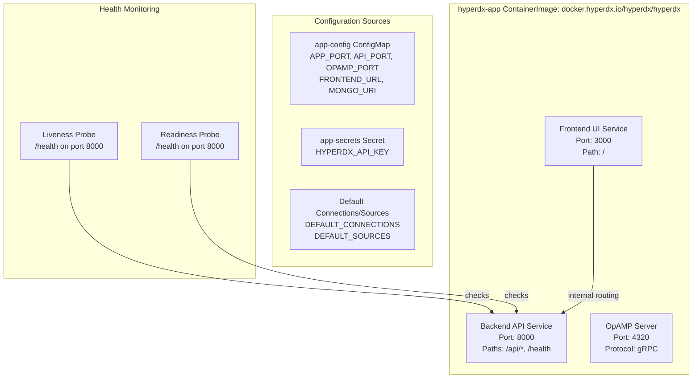
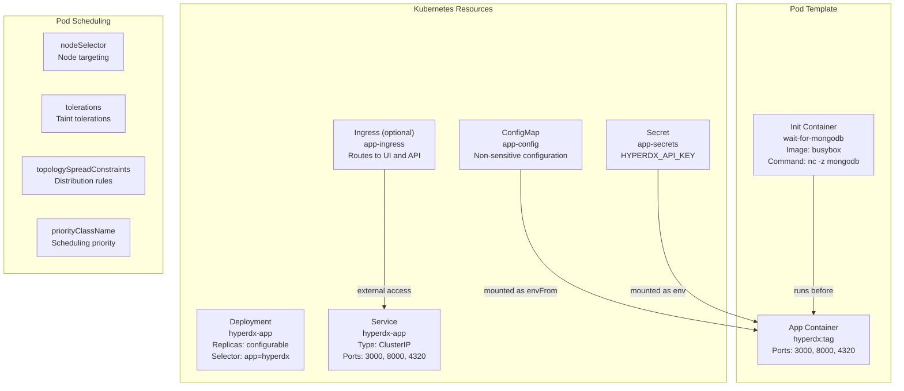
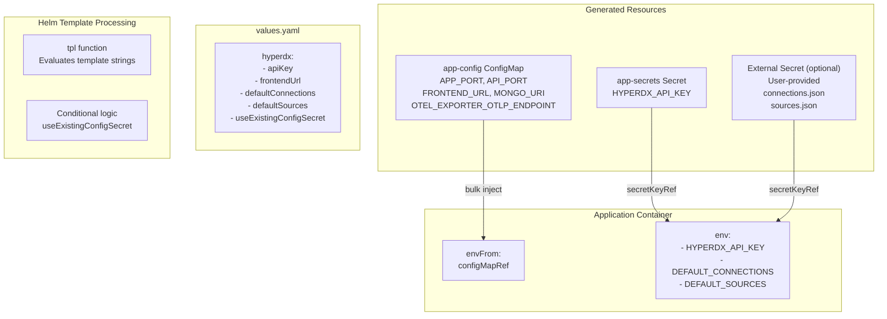
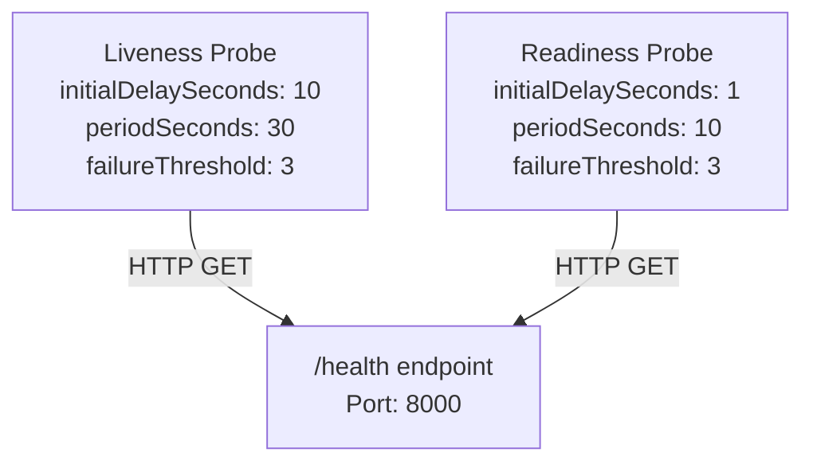
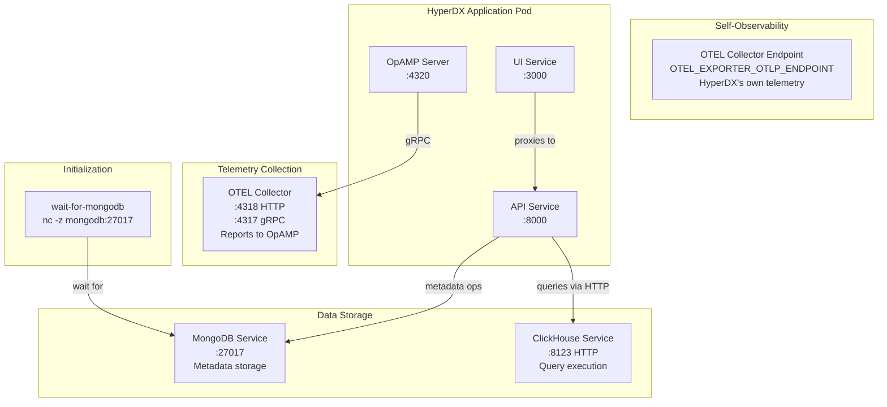

# HyperDX Application

> **Relevant source files**
> * [charts/hdx-oss-v2/templates/configmaps/app-configmap.yaml](https://github.com/hyperdxio/helm-charts/blob/845dd482/charts/hdx-oss-v2/templates/configmaps/app-configmap.yaml)
> * [charts/hdx-oss-v2/templates/hyperdx-deployment.yaml](https://github.com/hyperdxio/helm-charts/blob/845dd482/charts/hdx-oss-v2/templates/hyperdx-deployment.yaml)
> * [charts/hdx-oss-v2/values.yaml](https://github.com/hyperdxio/helm-charts/blob/845dd482/charts/hdx-oss-v2/values.yaml)

The HyperDX Application is the core user-facing component of the HyperDX observability platform. It consists of three integrated services running within a single deployment: the frontend UI (port 3000), the backend API (port 8000), and the OpAMP server (port 4320) for dynamic OTEL Collector configuration management. This page provides detailed technical documentation on how the application is deployed, configured, and integrated with other system components.

For information about the OpenTelemetry Collector that sends telemetry to storage, see [OpenTelemetry Collector](/hyperdxio/helm-charts/5.3-opentelemetry-collector). For ClickHouse database details, see [ClickHouse Database](/hyperdxio/helm-charts/5.2-clickhouse-database). For scheduled task execution, see [Scheduled Tasks System](/hyperdxio/helm-charts/5.5-scheduled-tasks-system).

## Architecture Overview

The HyperDX Application consolidates three distinct services into a single containerized deployment. This design simplifies deployment while maintaining clear service boundaries through port separation.

**HyperDX Application Multi-Service Architecture**



Sources: [charts/hdx-oss-v2/templates/hyperdx-deployment.yaml L58-L67](https://github.com/hyperdxio/helm-charts/blob/845dd482/charts/hdx-oss-v2/templates/hyperdx-deployment.yaml#L58-L67)

 [charts/hdx-oss-v2/values.yaml L14-L61](https://github.com/hyperdxio/helm-charts/blob/845dd482/charts/hdx-oss-v2/values.yaml#L14-L61)

## Deployment Structure

The application is deployed as a Kubernetes Deployment with supporting resources for configuration, secrets, and service exposure.

**Kubernetes Resources for HyperDX Application**



Sources: [charts/hdx-oss-v2/templates/hyperdx-deployment.yaml L1-L127](https://github.com/hyperdxio/helm-charts/blob/845dd482/charts/hdx-oss-v2/templates/hyperdx-deployment.yaml#L1-L127)

 [charts/hdx-oss-v2/values.yaml L241-L255](https://github.com/hyperdxio/helm-charts/blob/845dd482/charts/hdx-oss-v2/values.yaml#L241-L255)

### Deployment Resource Configuration

The deployment is created with the following key specifications:

| Specification | Configuration Path | Default Value |
| --- | --- | --- |
| Name | `{{ include "hdx-oss.fullname" . }}-app` | `{release-name}-app` |
| Replicas | `hyperdx.replicas` | 1 |
| Image Repository | `hyperdx.image.repository` | `docker.hyperdx.io/hyperdx/hyperdx` |
| Image Tag | `hyperdx.image.tag` | Chart's `appVersion` |
| Pull Policy | `hyperdx.image.pullPolicy` | `IfNotPresent` |
| Container Name | Fixed | `app` |

Sources: [charts/hdx-oss-v2/templates/hyperdx-deployment.yaml L1-L14](https://github.com/hyperdxio/helm-charts/blob/845dd482/charts/hdx-oss-v2/templates/hyperdx-deployment.yaml#L1-L14)

 [charts/hdx-oss-v2/templates/hyperdx-deployment.yaml L58-L60](https://github.com/hyperdxio/helm-charts/blob/845dd482/charts/hdx-oss-v2/templates/hyperdx-deployment.yaml#L58-L60)

 [charts/hdx-oss-v2/values.yaml L15-L18](https://github.com/hyperdxio/helm-charts/blob/845dd482/charts/hdx-oss-v2/values.yaml#L15-L18)

## Configuration System

The HyperDX Application supports multiple configuration methods to accommodate different deployment scenarios, from simple development setups to production environments requiring external secret management.

**Configuration Injection Flow**



Sources: [charts/hdx-oss-v2/templates/hyperdx-deployment.yaml L92-L126](https://github.com/hyperdxio/helm-charts/blob/845dd482/charts/hdx-oss-v2/templates/hyperdx-deployment.yaml#L92-L126)

 [charts/hdx-oss-v2/templates/configmaps/app-configmap.yaml L1-L21](https://github.com/hyperdxio/helm-charts/blob/845dd482/charts/hdx-oss-v2/templates/configmaps/app-configmap.yaml#L1-L21)

 [charts/hdx-oss-v2/values.yaml L72-L203](https://github.com/hyperdxio/helm-charts/blob/845dd482/charts/hdx-oss-v2/values.yaml#L72-L203)

### Configuration Methods

#### Method 1: Inline Configuration (Default)

Configuration is specified directly in `values.yaml` and templated into Kubernetes resources. This method is suitable for development and simple deployments.

**Key Configuration Variables (from app-config ConfigMap):**

| Environment Variable | Value Source | Purpose |
| --- | --- | --- |
| `APP_PORT` | `hyperdx.appPort` | Frontend UI port (default: 3000) |
| `API_PORT` | `hyperdx.apiPort` | Backend API port (default: 8000) |
| `OPAMP_PORT` | `hyperdx.opampPort` | OpAMP server port (default: 4320) |
| `FRONTEND_URL` | `hyperdx.frontendUrl` | Public-facing URL for the UI |
| `MONGO_URI` | `hyperdx.mongoUri` | MongoDB connection string |
| `OTEL_EXPORTER_OTLP_ENDPOINT` | `hyperdx.otelExporterEndpoint` | Where to send HyperDX's own telemetry |
| `USAGE_STATS_ENABLED` | `hyperdx.usageStatsEnabled` | Enable usage statistics (default: true) |
| `RUN_SCHEDULED_TASKS_EXTERNALLY` | `tasks.enabled` | Whether tasks run as CronJobs |

Sources: [charts/hdx-oss-v2/templates/configmaps/app-configmap.yaml L7-L21](https://github.com/hyperdxio/helm-charts/blob/845dd482/charts/hdx-oss-v2/templates/configmaps/app-configmap.yaml#L7-L21)

 [charts/hdx-oss-v2/values.yaml L48-L61](https://github.com/hyperdxio/helm-charts/blob/845dd482/charts/hdx-oss-v2/values.yaml#L48-L61)

**Sensitive Configuration (from app-secrets Secret):**

The `HYPERDX_API_KEY` is stored in a separate Secret and injected via `secretKeyRef`:

```yaml
env:
  - name: HYPERDX_API_KEY
    valueFrom:
      secretKeyRef:
        name: {{ include "hdx-oss.fullname" . }}-app-secrets
        key: api-key
```

Sources: [charts/hdx-oss-v2/templates/hyperdx-deployment.yaml L96-L100](https://github.com/hyperdxio/helm-charts/blob/845dd482/charts/hdx-oss-v2/templates/hyperdx-deployment.yaml#L96-L100)

 [charts/hdx-oss-v2/values.yaml L48](https://github.com/hyperdxio/helm-charts/blob/845dd482/charts/hdx-oss-v2/values.yaml#L48-L48)

#### Method 2: External Secret Configuration

For production environments, connection and source configurations can be externalized to a user-managed Kubernetes Secret. This allows sensitive connection strings and credentials to be managed outside the Helm values.

Configuration:

```yaml
hyperdx:
  useExistingConfigSecret: true
  existingConfigSecret: "my-hyperdx-config"
  existingConfigConnectionsKey: "connections.json"  # default
  existingConfigSourcesKey: "sources.json"  # default
```

When enabled, the deployment injects `DEFAULT_CONNECTIONS` and `DEFAULT_SOURCES` from the external secret instead of inline values:

Sources: [charts/hdx-oss-v2/templates/hyperdx-deployment.yaml L101-L123](https://github.com/hyperdxio/helm-charts/blob/845dd482/charts/hdx-oss-v2/templates/hyperdx-deployment.yaml#L101-L123)

 [charts/hdx-oss-v2/values.yaml L80-L90](https://github.com/hyperdxio/helm-charts/blob/845dd482/charts/hdx-oss-v2/values.yaml#L80-L90)

### Default Connections and Sources

The application uses two critical JSON configurations that define how it connects to and queries data stores:

**DEFAULT_CONNECTIONS**: Defines ClickHouse database connections. Default configuration:

* Connection name: "Local ClickHouse"
* Host: `http://{{ release-name }}-clickhouse:8123`
* Username: `app`
* Password: templated from `clickhouse.config.users.appUserPassword`

**DEFAULT_SOURCES**: Defines data source mappings for logs, traces, metrics, and sessions. Includes four default sources:

1. **Logs**: Maps to `otel_logs` table with timestamp, service name, body, and attribute expressions
2. **Traces**: Maps to `otel_traces` table with trace/span identifiers and duration metrics
3. **Metrics**: Maps to `otel_metrics_gauge`, `otel_metrics_histogram`, and `otel_metrics_sum` tables
4. **Sessions**: Maps to `hyperdx_sessions` table for session replay data

Each source configuration includes cross-references to other sources via `logSourceId`, `traceSourceId`, `sessionSourceId`, and `metricSourceId` fields, enabling correlation between different telemetry types.

Sources: [charts/hdx-oss-v2/values.yaml L92-L202](https://github.com/hyperdxio/helm-charts/blob/845dd482/charts/hdx-oss-v2/values.yaml#L92-L202)

## Application Services

### Frontend UI Service (Port 3000)

The UI service serves the HyperDX web interface for querying, visualizing, and analyzing telemetry data. It is accessed via the `appPort` (default 3000) and routes internally to the API service.

**Key Configuration:**

* Port configured via `APP_PORT` environment variable
* Public URL configured via `FRONTEND_URL` environment variable
* Must match ingress configuration when external access is enabled

Sources: [charts/hdx-oss-v2/templates/configmaps/app-configmap.yaml L8](https://github.com/hyperdxio/helm-charts/blob/845dd482/charts/hdx-oss-v2/templates/configmaps/app-configmap.yaml#L8-L8)

 [charts/hdx-oss-v2/templates/configmaps/app-configmap.yaml L10](https://github.com/hyperdxio/helm-charts/blob/845dd482/charts/hdx-oss-v2/templates/configmaps/app-configmap.yaml#L10-L10)

 [charts/hdx-oss-v2/values.yaml L50-L56](https://github.com/hyperdxio/helm-charts/blob/845dd482/charts/hdx-oss-v2/values.yaml#L50-L56)

### Backend API Service (Port 8000)

The API service provides the REST API for querying telemetry data, managing configurations, and handling authentication. It connects to both ClickHouse (for telemetry queries) and MongoDB (for metadata storage).

**Key Responsibilities:**

* Query execution against ClickHouse via connections defined in `DEFAULT_CONNECTIONS`
* Metadata management in MongoDB via `MONGO_URI`
* Health check endpoint at `/health` (used by Kubernetes probes)
* Authentication via `HYPERDX_API_KEY`

**Health Check Configuration:**



Sources: [charts/hdx-oss-v2/templates/hyperdx-deployment.yaml L72-L91](https://github.com/hyperdxio/helm-charts/blob/845dd482/charts/hdx-oss-v2/templates/hyperdx-deployment.yaml#L72-L91)

 [charts/hdx-oss-v2/values.yaml L23-L34](https://github.com/hyperdxio/helm-charts/blob/845dd482/charts/hdx-oss-v2/values.yaml#L23-L34)

### OpAMP Server (Port 4320)

The OpAMP (Open Agent Management Protocol) server provides dynamic configuration management for OpenTelemetry Collectors. It allows the HyperDX application to:

* Push configuration updates to OTEL Collectors
* Receive status reports from collectors
* Manage collector health and connectivity

The OpAMP server listens on port 4320 (configured via `OPAMP_PORT`) and is accessed by OTEL Collectors via the OpAMP endpoint URL.

Sources: [charts/hdx-oss-v2/templates/configmaps/app-configmap.yaml L19](https://github.com/hyperdxio/helm-charts/blob/845dd482/charts/hdx-oss-v2/templates/configmaps/app-configmap.yaml#L19-L19)

 [charts/hdx-oss-v2/values.yaml L51](https://github.com/hyperdxio/helm-charts/blob/845dd482/charts/hdx-oss-v2/values.yaml#L51-L51)

## Integration Points

The HyperDX Application integrates with other system components through well-defined connection patterns.

**Component Integration Architecture**



Sources: [charts/hdx-oss-v2/templates/hyperdx-deployment.yaml L50-L56](https://github.com/hyperdxio/helm-charts/blob/845dd482/charts/hdx-oss-v2/templates/hyperdx-deployment.yaml#L50-L56)

 [charts/hdx-oss-v2/templates/configmaps/app-configmap.yaml L15-L20](https://github.com/hyperdxio/helm-charts/blob/845dd482/charts/hdx-oss-v2/templates/configmaps/app-configmap.yaml#L15-L20)

### MongoDB Initialization Wait

The application uses an init container to ensure MongoDB is available before starting the main application:

```yaml
initContainers:
  - name: wait-for-mongodb
    image: busybox@sha256:...
    command: ['sh', '-c', 'until nc -z {{ fullname }}-mongodb {{ port }}; do echo waiting for mongodb; sleep 2; done;']
```

This prevents startup failures when MongoDB takes time to initialize, particularly important during fresh installations.

Sources: [charts/hdx-oss-v2/templates/hyperdx-deployment.yaml L50-L56](https://github.com/hyperdxio/helm-charts/blob/845dd482/charts/hdx-oss-v2/templates/hyperdx-deployment.yaml#L50-L56)

 [charts/hdx-oss-v2/values.yaml L19-L22](https://github.com/hyperdxio/helm-charts/blob/845dd482/charts/hdx-oss-v2/values.yaml#L19-L22)

### ClickHouse Connection

The API connects to ClickHouse using the HTTP protocol (port 8123) with credentials defined in `DEFAULT_CONNECTIONS`. The default connection configuration is:

```json
{
  "name": "Local ClickHouse",
  "host": "http://{{ release-name }}-clickhouse:8123",
  "port": 8123,
  "username": "app",
  "password": "{{ clickhouse.config.users.appUserPassword }}"
}
```

Sources: [charts/hdx-oss-v2/values.yaml L92-L101](https://github.com/hyperdxio/helm-charts/blob/845dd482/charts/hdx-oss-v2/values.yaml#L92-L101)

### Self-Observability

The HyperDX Application sends its own telemetry (logs, traces, metrics) to the OTEL Collector endpoint specified in `OTEL_EXPORTER_OTLP_ENDPOINT`. This defaults to the chart's OTEL Collector service:

```
http://{{ release-name }}-otel-collector:{{ otel.httpPort }}
```

The application identifies itself with the service name `hdx-oss-api` (set via `OTEL_SERVICE_NAME`).

Sources: [charts/hdx-oss-v2/templates/configmaps/app-configmap.yaml L16](https://github.com/hyperdxio/helm-charts/blob/845dd482/charts/hdx-oss-v2/templates/configmaps/app-configmap.yaml#L16-L16)

 [charts/hdx-oss-v2/templates/configmaps/app-configmap.yaml L20](https://github.com/hyperdxio/helm-charts/blob/845dd482/charts/hdx-oss-v2/templates/configmaps/app-configmap.yaml#L20-L20)

 [charts/hdx-oss-v2/values.yaml L59-L60](https://github.com/hyperdxio/helm-charts/blob/845dd482/charts/hdx-oss-v2/values.yaml#L59-L60)

## Pod Scheduling and Placement

The deployment supports advanced Kubernetes scheduling features for production environments:

| Feature | Configuration Path | Purpose |
| --- | --- | --- |
| Node Selector | `hyperdx.nodeSelector` | Target specific nodes by labels |
| Tolerations | `hyperdx.tolerations` | Tolerate node taints |
| Topology Spread Constraints | `hyperdx.topologySpreadConstraints` | Control pod distribution across topology domains |
| Priority Class | `hyperdx.priorityClassName` | Define scheduling priority |
| Image Pull Secrets | `global.imagePullSecrets` | Access private registries |

Example node selector configuration:

```yaml
hyperdx:
  nodeSelector:
    kubernetes.io/os: linux
    node-role.kubernetes.io/worker: "true"
```

Sources: [charts/hdx-oss-v2/templates/hyperdx-deployment.yaml L31-L49](https://github.com/hyperdxio/helm-charts/blob/845dd482/charts/hdx-oss-v2/templates/hyperdx-deployment.yaml#L31-L49)

 [charts/hdx-oss-v2/values.yaml L35-L47](https://github.com/hyperdxio/helm-charts/blob/845dd482/charts/hdx-oss-v2/values.yaml#L35-L47)

## Service Exposure

The application is exposed via a Kubernetes Service of type `ClusterIP` (default) with three ports:

```yaml
Service: {{ release-name }}-app
Type: ClusterIP
Ports:
  - name: app-port, port: 3000, targetPort: 3000
  - name: api-port, port: 8000, targetPort: 8000
  - name: opamp-port, port: 4320, targetPort: 4320
```

For external access, enable the Ingress resource which routes to the service:

* Ingress enabled via `hyperdx.ingress.enabled: true`
* Defaults to nginx ingress class
* Supports TLS configuration
* Path-based routing with regex support: `/(.*)`

Sources: [charts/hdx-oss-v2/values.yaml L207-L221](https://github.com/hyperdxio/helm-charts/blob/845dd482/charts/hdx-oss-v2/values.yaml#L207-L221)

 [charts/hdx-oss-v2/values.yaml L247-L255](https://github.com/hyperdxio/helm-charts/blob/845dd482/charts/hdx-oss-v2/values.yaml#L247-L255)

## Advanced Configuration Options

### Pod-Level Metadata

Custom labels and annotations can be applied to pods for integration with service meshes, monitoring systems, or policy enforcement:

```yaml
hyperdx:
  labels:
    myLabel: "myValue"
  annotations:
    myAnnotation: "myValue"
```

Labels are applied at both the deployment and pod levels, while annotations are applied only to pods.

Sources: [charts/hdx-oss-v2/templates/hyperdx-deployment.yaml L8-L29](https://github.com/hyperdxio/helm-charts/blob/845dd482/charts/hdx-oss-v2/templates/hyperdx-deployment.yaml#L8-L29)

 [charts/hdx-oss-v2/values.yaml L64-L71](https://github.com/hyperdxio/helm-charts/blob/845dd482/charts/hdx-oss-v2/values.yaml#L64-L71)

### Additional Environment Variables

Beyond the standard configuration, custom environment variables can be injected:

```yaml
hyperdx:
  env:
    - name: CUSTOM_VAR
      value: "custom-value"
    - name: SECRET_VAR
      valueFrom:
        secretKeyRef:
          name: my-secret
          key: secret-key
```

Sources: [charts/hdx-oss-v2/templates/hyperdx-deployment.yaml L124-L126](https://github.com/hyperdxio/helm-charts/blob/845dd482/charts/hdx-oss-v2/templates/hyperdx-deployment.yaml#L124-L126)

 [charts/hdx-oss-v2/values.yaml L72-L75](https://github.com/hyperdxio/helm-charts/blob/845dd482/charts/hdx-oss-v2/values.yaml#L72-L75)

### Replica Scaling

The application supports horizontal scaling via the `replicas` configuration. For multi-replica deployments, consider:

* Stateless design allows safe scaling
* MongoDB and ClickHouse connections are shared
* Pod Disruption Budget can be enabled via `hyperdx.podDisruptionBudget.enabled`

Sources: [charts/hdx-oss-v2/templates/hyperdx-deployment.yaml L14](https://github.com/hyperdxio/helm-charts/blob/845dd482/charts/hdx-oss-v2/templates/hyperdx-deployment.yaml#L14-L14)

 [charts/hdx-oss-v2/values.yaml L241-L244](https://github.com/hyperdxio/helm-charts/blob/845dd482/charts/hdx-oss-v2/values.yaml#L241-L244)

### Resource Limits

Resource requests and limits can be configured via `hyperdx.resources`:

```yaml
hyperdx:
  resources:
    requests:
      memory: "512Mi"
      cpu: "500m"
    limits:
      memory: "2Gi"
      cpu: "2000m"
```

Sources: [charts/hdx-oss-v2/templates/hyperdx-deployment.yaml L68-L71](https://github.com/hyperdxio/helm-charts/blob/845dd482/charts/hdx-oss-v2/templates/hyperdx-deployment.yaml#L68-L71)