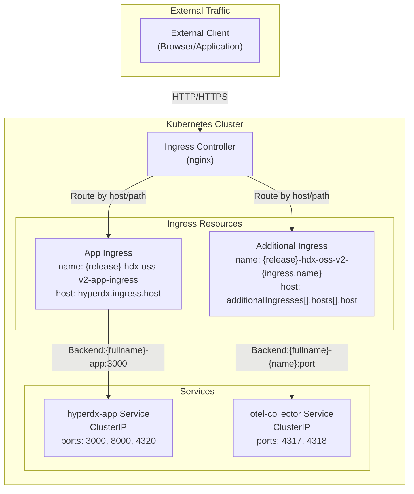
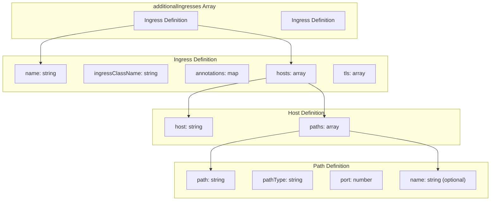
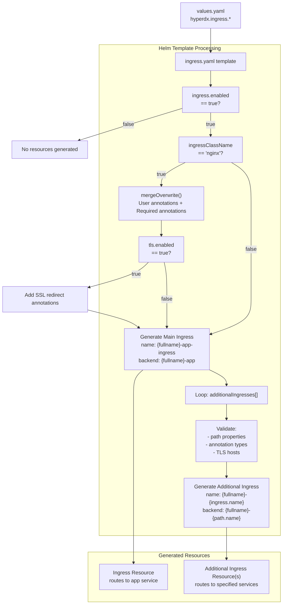

# Ingress Configuration

> **Relevant source files**
> * [README.md](https://github.com/hyperdxio/helm-charts/blob/845dd482/README.md)
> * [charts/hdx-oss-v2/templates/ingress.yaml](https://github.com/hyperdxio/helm-charts/blob/845dd482/charts/hdx-oss-v2/templates/ingress.yaml)
> * [charts/hdx-oss-v2/tests/ingress_test.yaml](https://github.com/hyperdxio/helm-charts/blob/845dd482/charts/hdx-oss-v2/tests/ingress_test.yaml)
> * [charts/hdx-oss-v2/values.yaml](https://github.com/hyperdxio/helm-charts/blob/845dd482/charts/hdx-oss-v2/values.yaml)

This page documents the Ingress configuration options available in the HyperDX Helm chart. Ingress resources provide external HTTP/HTTPS access to the HyperDX application and optionally to other services like the OpenTelemetry Collector.

For broader networking topics including service architecture and internal DNS resolution, see [Service Architecture](/hyperdxio/helm-charts/7.1-service-architecture). For security aspects of external access including authentication and TLS certificate management, see [Ingress and External Access](/hyperdxio/helm-charts/7.2-ingress-and-external-access).

## Configuration Scope

The ingress configuration is located under `hyperdx.ingress` in [charts/hdx-oss-v2/values.yaml L207-L239](https://github.com/hyperdxio/helm-charts/blob/845dd482/charts/hdx-oss-v2/values.yaml#L207-L239)

 When enabled, the chart generates Kubernetes Ingress resources that route external traffic to internal ClusterIP services. The ingress system supports:

* Main application ingress for the HyperDX UI and API
* Additional ingresses for exposing other services (e.g., OTEL Collector endpoints)
* TLS/HTTPS termination
* Custom annotations for ingress controller behavior
* Configurable path routing and rewriting

**Sources:** [charts/hdx-oss-v2/values.yaml L207-L239](https://github.com/hyperdxio/helm-charts/blob/845dd482/charts/hdx-oss-v2/values.yaml#L207-L239)

## Ingress Architecture



The ingress controller reads Ingress resources and configures itself to route traffic based on host and path rules. The main app ingress always routes to the `{release}-hdx-oss-v2-app` service, while additional ingresses can target any service.

**Sources:** [charts/hdx-oss-v2/templates/ingress.yaml L1-L96](https://github.com/hyperdxio/helm-charts/blob/845dd482/charts/hdx-oss-v2/templates/ingress.yaml#L1-L96)

 [charts/hdx-oss-v2/values.yaml L207-L239](https://github.com/hyperdxio/helm-charts/blob/845dd482/charts/hdx-oss-v2/values.yaml#L207-L239)

## Main Application Ingress

### Basic Configuration

The main application ingress is controlled by `hyperdx.ingress.enabled` and provides access to the HyperDX UI (port 3000) and API (port 8000).

| Parameter | Type | Default | Description |
| --- | --- | --- | --- |
| `hyperdx.ingress.enabled` | boolean | `false` | Enable or disable ingress resource creation |
| `hyperdx.ingress.ingressClassName` | string | `"nginx"` | Ingress controller class name |
| `hyperdx.ingress.host` | string | `"localhost"` | Hostname for the ingress rule |
| `hyperdx.ingress.path` | string | `"/(.*)"` | URL path pattern (regex supported) |
| `hyperdx.ingress.pathType` | string | `"ImplementationSpecific"` | Path matching type (`Exact`, `Prefix`, `ImplementationSpecific`) |

**Minimal Configuration Example:**

```yaml
hyperdx:
  frontendUrl: "https://hyperdx.example.com"
  ingress:
    enabled: true
    host: "hyperdx.example.com"
```

This generates an Ingress resource at [charts/hdx-oss-v2/templates/ingress.yaml L2-L42](https://github.com/hyperdxio/helm-charts/blob/845dd482/charts/hdx-oss-v2/templates/ingress.yaml#L2-L42)

 named `{release}-hdx-oss-v2-app-ingress` that routes traffic from `hyperdx.example.com` to the `{release}-hdx-oss-v2-app` service on port 3000.

**Sources:** [charts/hdx-oss-v2/values.yaml L207-L221](https://github.com/hyperdxio/helm-charts/blob/845dd482/charts/hdx-oss-v2/values.yaml#L207-L221)

 [charts/hdx-oss-v2/templates/ingress.yaml L2-L42](https://github.com/hyperdxio/helm-charts/blob/845dd482/charts/hdx-oss-v2/templates/ingress.yaml#L2-L42)

 [charts/hdx-oss-v2/tests/ingress_test.yaml L29-L68](https://github.com/hyperdxio/helm-charts/blob/845dd482/charts/hdx-oss-v2/tests/ingress_test.yaml#L29-L68)

### Path Configuration

The default path configuration uses a regex pattern `/(.*)" with`ImplementationSpecific` path type to support Next.js asset serving. This configuration is critical for single-page applications.

**Template Logic:**

[charts/hdx-oss-v2/templates/ingress.yaml L36-L42](https://github.com/hyperdxio/helm-charts/blob/845dd482/charts/hdx-oss-v2/templates/ingress.yaml#L36-L42)

 shows how the path is rendered:

```yaml
paths:
  - path: {{ .Values.hyperdx.ingress.path | default "/(.*)" }}
    pathType: {{ .Values.hyperdx.ingress.pathType | default "ImplementationSpecific" }}
    backend:
      service:
        name: {{ include "hdx-oss.fullname" . }}-app
        port:
          number: {{ .Values.hyperdx.appPort }}
```

For custom routing, you can override the path and pathType:

```yaml
hyperdx:
  ingress:
    enabled: true
    host: "hyperdx.example.com"
    path: "/hyperdx/(.*)"
    pathType: "Prefix"
```

**Sources:** [charts/hdx-oss-v2/templates/ingress.yaml L36-L42](https://github.com/hyperdxio/helm-charts/blob/845dd482/charts/hdx-oss-v2/templates/ingress.yaml#L36-L42)

 [charts/hdx-oss-v2/tests/ingress_test.yaml L500-L563](https://github.com/hyperdxio/helm-charts/blob/845dd482/charts/hdx-oss-v2/tests/ingress_test.yaml#L500-L563)

## Annotations and Proxy Settings

### Nginx-Specific Annotations

When `ingressClassName` is set to `"nginx"`, the chart automatically applies required annotations for proper path rewriting and proxy behavior.

| Parameter | Type | Default | Description |
| --- | --- | --- | --- |
| `hyperdx.ingress.proxyBodySize` | string | `"100m"` | Maximum client request body size |
| `hyperdx.ingress.proxyConnectTimeout` | string | `"60"` | Timeout for establishing connection to backend (seconds) |
| `hyperdx.ingress.proxySendTimeout` | string | `"60"` | Timeout for transmitting request to backend (seconds) |
| `hyperdx.ingress.proxyReadTimeout` | string | `"60"` | Timeout for reading response from backend (seconds) |

**Annotation Generation Logic:**

[charts/hdx-oss-v2/templates/ingress.yaml L9-L23](https://github.com/hyperdxio/helm-charts/blob/845dd482/charts/hdx-oss-v2/templates/ingress.yaml#L9-L23)

 shows the conditional annotation creation:

```
{{ $reqAnnotations := dict }}
{{- if eq .Values.hyperdx.ingress.ingressClassName "nginx" }}
  {{ $reqAnnotations = dict "nginx.ingress.kubernetes.io/rewrite-target" "/$1"
                           "nginx.ingress.kubernetes.io/use-regex" "true"
                           "nginx.ingress.kubernetes.io/proxy-body-size" .Values.hyperdx.ingress.proxyBodySize
                           ...
  }}
  {{- if .Values.hyperdx.ingress.tls.enabled }}
    {{ $_ := set $reqAnnotations "nginx.ingress.kubernetes.io/ssl-redirect" "true" }}
    {{ $_ := set $reqAnnotations "nginx.ingress.kubernetes.io/force-ssl-redirect" "true" }}
  {{- end }}
{{- end }}
{{ toYaml (mergeOverwrite .Values.hyperdx.ingress.annotations $reqAnnotations) | nindent 4}}
```

The `mergeOverwrite` function ensures that required annotations cannot be overridden by user-provided annotations.

**Sources:** [charts/hdx-oss-v2/templates/ingress.yaml L9-L23](https://github.com/hyperdxio/helm-charts/blob/845dd482/charts/hdx-oss-v2/templates/ingress.yaml#L9-L23)

 [charts/hdx-oss-v2/values.yaml L214-L221](https://github.com/hyperdxio/helm-charts/blob/845dd482/charts/hdx-oss-v2/values.yaml#L214-L221)

 [charts/hdx-oss-v2/tests/ingress_test.yaml L126-L158](https://github.com/hyperdxio/helm-charts/blob/845dd482/charts/hdx-oss-v2/tests/ingress_test.yaml#L126-L158)

### Custom Annotations

Users can add custom annotations that will be merged with required annotations:

```yaml
hyperdx:
  ingress:
    enabled: true
    annotations:
      cert-manager.io/cluster-issuer: "letsencrypt-prod"
      nginx.ingress.kubernetes.io/rate-limit: "100"
```

For non-nginx ingress controllers, set `ingressClassName` to a different value and provide all necessary annotations manually:

```yaml
hyperdx:
  ingress:
    enabled: true
    ingressClassName: "traefik"
    annotations:
      traefik.ingress.kubernetes.io/router.entrypoints: "web,websecure"
```

**Sources:** [charts/hdx-oss-v2/tests/ingress_test.yaml L94-L158](https://github.com/hyperdxio/helm-charts/blob/845dd482/charts/hdx-oss-v2/tests/ingress_test.yaml#L94-L158)

 [charts/hdx-oss-v2/templates/ingress.yaml L8-L23](https://github.com/hyperdxio/helm-charts/blob/845dd482/charts/hdx-oss-v2/templates/ingress.yaml#L8-L23)

## TLS Configuration

### Enabling TLS/HTTPS

TLS termination is configured under `hyperdx.ingress.tls`:

| Parameter | Type | Default | Description |
| --- | --- | --- | --- |
| `hyperdx.ingress.tls.enabled` | boolean | `false` | Enable TLS termination |
| `hyperdx.ingress.tls.secretName` | string | `"hyperdx-tls"` | Name of Kubernetes TLS secret containing certificate and key |

**Configuration Example:**

```yaml
hyperdx:
  frontendUrl: "https://hyperdx.example.com"
  ingress:
    enabled: true
    host: "hyperdx.example.com"
    tls:
      enabled: true
      secretName: "hyperdx-tls-cert"
```

**Generated TLS Block:**

[charts/hdx-oss-v2/templates/ingress.yaml L26-L31](https://github.com/hyperdxio/helm-charts/blob/845dd482/charts/hdx-oss-v2/templates/ingress.yaml#L26-L31)

 shows the TLS rendering:

```yaml
{{- if .Values.hyperdx.ingress.tls.enabled }}
tls:
- hosts:
  - {{ .Values.hyperdx.ingress.host | default "localhost" }}
  secretName: {{ .Values.hyperdx.ingress.tls.secretName | default "hyperdx-tls" }}
{{- end }}
```

When TLS is enabled for nginx ingress, SSL redirect annotations are automatically added [charts/hdx-oss-v2/templates/ingress.yaml L18-L21](https://github.com/hyperdxio/helm-charts/blob/845dd482/charts/hdx-oss-v2/templates/ingress.yaml#L18-L21)

**Sources:** [charts/hdx-oss-v2/templates/ingress.yaml L26-L31](https://github.com/hyperdxio/helm-charts/blob/845dd482/charts/hdx-oss-v2/templates/ingress.yaml#L26-L31)

 [charts/hdx-oss-v2/values.yaml L219-L221](https://github.com/hyperdxio/helm-charts/blob/845dd482/charts/hdx-oss-v2/values.yaml#L219-L221)

 [charts/hdx-oss-v2/tests/ingress_test.yaml L160-L210](https://github.com/hyperdxio/helm-charts/blob/845dd482/charts/hdx-oss-v2/tests/ingress_test.yaml#L160-L210)

### Creating TLS Secrets

The TLS secret must be created separately using `kubectl` or a certificate manager:

```sql
# Manual certificate
kubectl create secret tls hyperdx-tls-cert \
  --cert=path/to/tls.crt \
  --key=path/to/tls.key

# Or using cert-manager annotation
hyperdx:
  ingress:
    annotations:
      cert-manager.io/cluster-issuer: "letsencrypt-prod"
    tls:
      enabled: true
      secretName: "hyperdx-tls-cert"
```

**Important:** The `frontendUrl` parameter must match the ingress host and use the correct protocol (`https://` when TLS is enabled) to ensure proper cookie and redirect behavior.

**Sources:** [README.md L369-L388](https://github.com/hyperdxio/helm-charts/blob/845dd482/README.md#L369-L388)

 [charts/hdx-oss-v2/values.yaml L54-L56](https://github.com/hyperdxio/helm-charts/blob/845dd482/charts/hdx-oss-v2/values.yaml#L54-L56)

## Additional Ingresses

### Purpose and Use Cases

The `additionalIngresses` array allows exposing other services beyond the main application. Common use cases include:

* Exposing OTEL Collector endpoints for external telemetry submission
* Creating separate ingresses with different TLS certificates
* Using different ingress controllers for different services
* Applying service-specific annotations or rate limiting

**Configuration Structure:**



**Sources:** [charts/hdx-oss-v2/values.yaml L223-L239](https://github.com/hyperdxio/helm-charts/blob/845dd482/charts/hdx-oss-v2/values.yaml#L223-L239)

 [charts/hdx-oss-v2/templates/ingress.yaml L43-L95](https://github.com/hyperdxio/helm-charts/blob/845dd482/charts/hdx-oss-v2/templates/ingress.yaml#L43-L95)

### OTEL Collector Ingress Example

A complete example for exposing OTEL Collector endpoints:

```yaml
hyperdx:
  ingress:
    enabled: true
    host: "hyperdx.example.com"
    additionalIngresses:
      - name: otel-collector
        ingressClassName: nginx
        annotations:
          nginx.ingress.kubernetes.io/ssl-redirect: "false"
          nginx.ingress.kubernetes.io/use-regex: "true"
        hosts:
          - host: "collector.example.com"
            paths:
              - path: "/v1/(traces|metrics|logs)"
                pathType: "Prefix"
                port: 4318
                name: "otel-collector"
        tls:
          - secretName: "collector-tls"
            hosts:
              - "collector.example.com"
```

**Template Processing:**

[charts/hdx-oss-v2/templates/ingress.yaml L43-L95](https://github.com/hyperdxio/helm-charts/blob/845dd482/charts/hdx-oss-v2/templates/ingress.yaml#L43-L95)

 iterates over `additionalIngresses` and generates separate Ingress resources:

```yaml
{{- range .Values.hyperdx.ingress.additionalIngresses}}
---
apiVersion: networking.k8s.io/v1
kind: Ingress
metadata:
  name: {{ printf "%s-%s" (include "hdx-oss.fullname" $) .name }}
  ...
```

The ingress name is generated as `{release}-hdx-oss-v2-{ingress.name}` where `ingress.name` comes from the `name` field in the additionalIngresses array.

**Sources:** [charts/hdx-oss-v2/templates/ingress.yaml L43-L95](https://github.com/hyperdxio/helm-charts/blob/845dd482/charts/hdx-oss-v2/templates/ingress.yaml#L43-L95)

 [README.md L436-L472](https://github.com/hyperdxio/helm-charts/blob/845dd482/README.md#L436-L472)

 [charts/hdx-oss-v2/tests/ingress_test.yaml L211-L402](https://github.com/hyperdxio/helm-charts/blob/845dd482/charts/hdx-oss-v2/tests/ingress_test.yaml#L211-L402)

### Service Name Resolution

The backend service name is determined by the optional `name` field in each path definition:

**With `name` specified:**

```css
paths:
  - path: "/api"
    pathType: "Prefix"
    port: 8000
    name: "api-service"  # Results in: {release}-hdx-oss-v2-api-service
```

**Without `name` (defaults to release name):**

```css
paths:
  - path: "/metrics"
    pathType: "Exact"
    port: 9090
    # Results in: {release}-hdx-oss-v2
```

**Template Logic:**

[charts/hdx-oss-v2/templates/ingress.yaml L88-L92](https://github.com/hyperdxio/helm-charts/blob/845dd482/charts/hdx-oss-v2/templates/ingress.yaml#L88-L92)

 shows the service name resolution:

```yaml
backend:
  service:
    name: {{ if .name }}{{ printf "%s-%s" (include "hdx-oss.fullname" $) .name }}{{ else }}{{ include "hdx-oss.fullname" $ }}{{ end }}
    port:
      number: {{ .port }}
```

**Sources:** [charts/hdx-oss-v2/templates/ingress.yaml L88-L92](https://github.com/hyperdxio/helm-charts/blob/845dd482/charts/hdx-oss-v2/templates/ingress.yaml#L88-L92)

 [charts/hdx-oss-v2/tests/ingress_test.yaml L564-L627](https://github.com/hyperdxio/helm-charts/blob/845dd482/charts/hdx-oss-v2/tests/ingress_test.yaml#L564-L627)

### Validation Rules

The template enforces validation rules to prevent misconfiguration:

**Required Path Fields:**

[charts/hdx-oss-v2/templates/ingress.yaml L83-L85](https://github.com/hyperdxio/helm-charts/blob/845dd482/charts/hdx-oss-v2/templates/ingress.yaml#L83-L85)

 validates that each path has required properties:

```
{{- if or (not .path) (not .pathType) (not .port) }}
{{- fail "Each path in additional ingress must contain path, pathType, and port properties" }}
{{- end }}
```

**Annotations Must Be a Map:**

[charts/hdx-oss-v2/templates/ingress.yaml L52-L54](https://github.com/hyperdxio/helm-charts/blob/845dd482/charts/hdx-oss-v2/templates/ingress.yaml#L52-L54)

 validates annotation structure:

```
{{- if not (kindIs "map" .annotations) }}
{{- fail "annotations must be a map of string key-value pairs" }}
{{- end }}
```

**TLS Must Include Hosts:**

[charts/hdx-oss-v2/templates/ingress.yaml L65-L67](https://github.com/hyperdxio/helm-charts/blob/845dd482/charts/hdx-oss-v2/templates/ingress.yaml#L65-L67)

 validates TLS configuration:

```
{{- if not .hosts }}
{{- fail "TLS configuration must contain hosts property" }}
{{- end }}
```

**Sources:** [charts/hdx-oss-v2/templates/ingress.yaml L52-L85](https://github.com/hyperdxio/helm-charts/blob/845dd482/charts/hdx-oss-v2/templates/ingress.yaml#L52-L85)

 [charts/hdx-oss-v2/tests/ingress_test.yaml L404-L498](https://github.com/hyperdxio/helm-charts/blob/845dd482/charts/hdx-oss-v2/tests/ingress_test.yaml#L404-L498)

## Configuration Flow Diagram



This diagram shows how configuration values flow through the Helm template engine to generate Ingress resources. The `mergeOverwrite` function at [charts/hdx-oss-v2/templates/ingress.yaml L23](https://github.com/hyperdxio/helm-charts/blob/845dd482/charts/hdx-oss-v2/templates/ingress.yaml#L23-L23)

 ensures required nginx annotations cannot be overridden by user-provided annotations.

**Sources:** [charts/hdx-oss-v2/templates/ingress.yaml L1-L96](https://github.com/hyperdxio/helm-charts/blob/845dd482/charts/hdx-oss-v2/templates/ingress.yaml#L1-L96)

 [charts/hdx-oss-v2/values.yaml L207-L239](https://github.com/hyperdxio/helm-charts/blob/845dd482/charts/hdx-oss-v2/values.yaml#L207-L239)

## Configuration Reference Table

### Main Ingress Parameters

| Parameter Path | Type | Default | Required | Description |
| --- | --- | --- | --- | --- |
| `hyperdx.ingress.enabled` | boolean | `false` | Yes | Master switch for ingress resource generation |
| `hyperdx.ingress.ingressClassName` | string | `"nginx"` | No | Ingress controller implementation |
| `hyperdx.ingress.annotations` | map | `{}` | No | Custom annotations (merged with required annotations) |
| `hyperdx.ingress.host` | string | `"localhost"` | Yes | Hostname for routing rules |
| `hyperdx.ingress.path` | string | `"/(.*)"` | No | URL path pattern for matching |
| `hyperdx.ingress.pathType` | string | `"ImplementationSpecific"` | No | Path matching semantics |
| `hyperdx.ingress.proxyBodySize` | string | `"100m"` | No | Max request body size (nginx only) |
| `hyperdx.ingress.proxyConnectTimeout` | string | `"60"` | No | Backend connection timeout (nginx only) |
| `hyperdx.ingress.proxySendTimeout` | string | `"60"` | No | Backend send timeout (nginx only) |
| `hyperdx.ingress.proxyReadTimeout` | string | `"60"` | No | Backend read timeout (nginx only) |
| `hyperdx.ingress.tls.enabled` | boolean | `false` | No | Enable TLS termination |
| `hyperdx.ingress.tls.secretName` | string | `"hyperdx-tls"` | No | Name of TLS secret |
| `hyperdx.ingress.additionalIngresses` | array | `[]` | No | Additional ingress definitions |

### Additional Ingress Schema

Each element in `hyperdx.ingress.additionalIngresses[]` has the following structure:

| Field | Type | Required | Description |
| --- | --- | --- | --- |
| `name` | string | Yes | Suffix for ingress resource name |
| `ingressClassName` | string | No | Ingress controller for this ingress |
| `annotations` | map | No | Custom annotations for this ingress |
| `hosts[]` | array | Yes | List of host rules |
| `hosts[].host` | string | Yes | Hostname for this rule |
| `hosts[].paths[]` | array | Yes | List of path rules |
| `hosts[].paths[].path` | string | Yes | URL path pattern |
| `hosts[].paths[].pathType` | string | Yes | Path matching type |
| `hosts[].paths[].port` | number | Yes | Backend service port |
| `hosts[].paths[].name` | string | No | Service name suffix (defaults to release name) |
| `tls[]` | array | No | TLS configuration |
| `tls[].secretName` | string | No | TLS secret name |
| `tls[].hosts[]` | array | Yes | Hosts covered by this certificate |

**Sources:** [charts/hdx-oss-v2/values.yaml L207-L239](https://github.com/hyperdxio/helm-charts/blob/845dd482/charts/hdx-oss-v2/values.yaml#L207-L239)

 [charts/hdx-oss-v2/templates/ingress.yaml L43-L95](https://github.com/hyperdxio/helm-charts/blob/845dd482/charts/hdx-oss-v2/templates/ingress.yaml#L43-L95)

## Relationship with Frontend URL

The `hyperdx.frontendUrl` parameter must be configured to match the ingress configuration:

```yaml
hyperdx:
  frontendUrl: "https://hyperdx.example.com"  # Must match ingress.host with correct protocol
  ingress:
    enabled: true
    host: "hyperdx.example.com"
    tls:
      enabled: true  # Enables HTTPS, so frontendUrl uses https://
```

**Why This Matters:**

The frontend URL is used by the HyperDX application for:

* Generating absolute URLs in API responses
* Setting cookie domains
* Constructing OAuth redirect URIs
* Generating email links

Mismatched values will cause authentication issues, broken redirects, and asset loading failures. See [HyperDX Application Configuration](/hyperdxio/helm-charts/3.2-hyperdx-application-configuration) for more details on `frontendUrl`.

**Sources:** [README.md L351-L365](https://github.com/hyperdxio/helm-charts/blob/845dd482/README.md#L351-L365)

 [charts/hdx-oss-v2/values.yaml L54-L56](https://github.com/hyperdxio/helm-charts/blob/845dd482/charts/hdx-oss-v2/values.yaml#L54-L56)