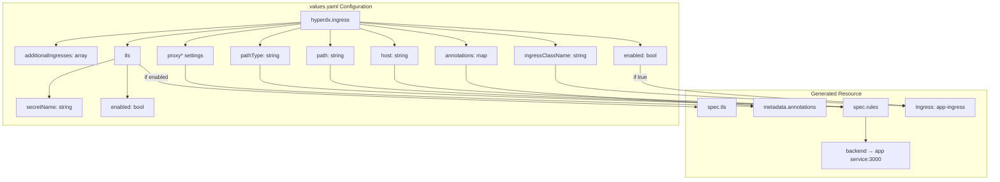
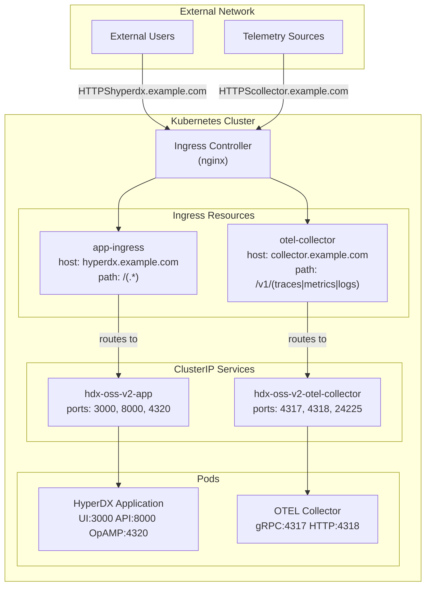
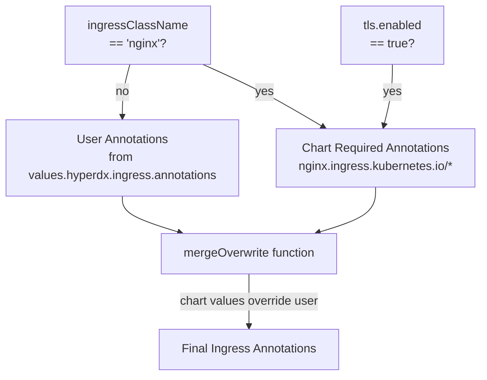
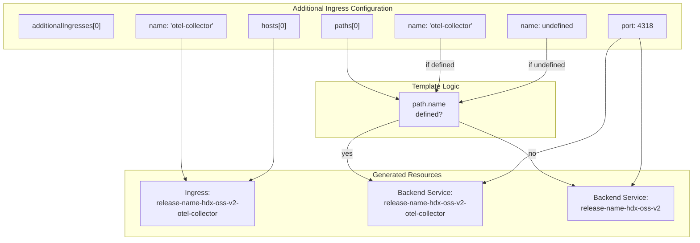
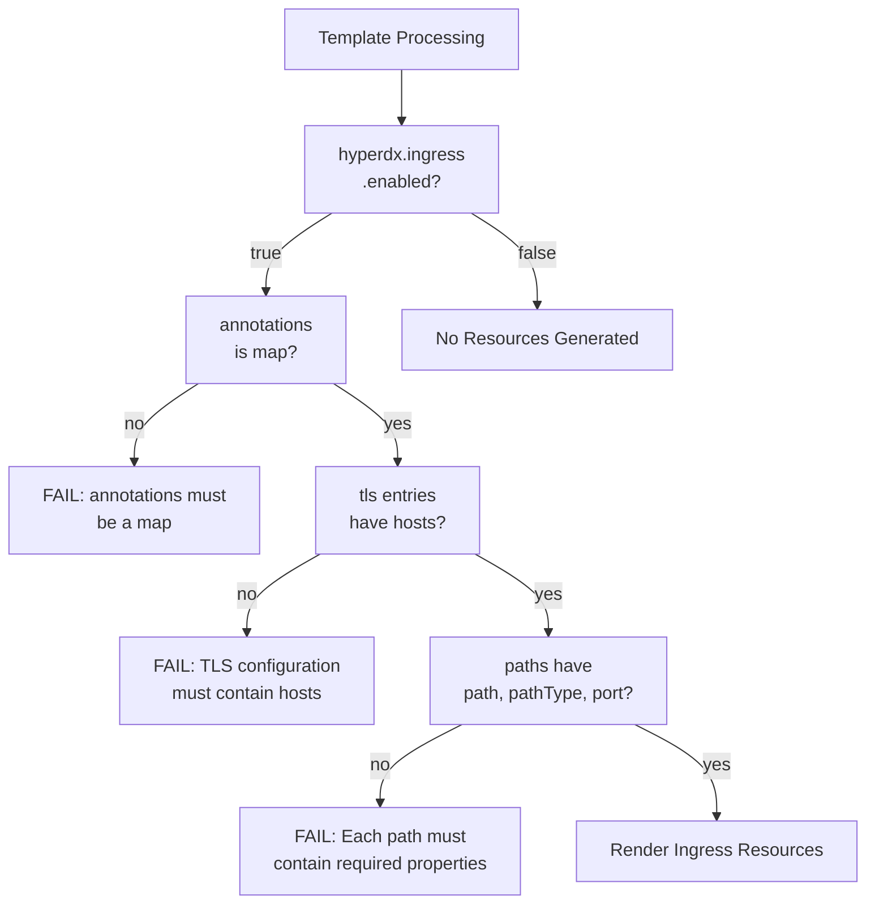

# Ingress and External Access

> **Relevant source files**
> * [README.md](https://github.com/hyperdxio/helm-charts/blob/845dd482/README.md)
> * [charts/hdx-oss-v2/templates/ingress.yaml](https://github.com/hyperdxio/helm-charts/blob/845dd482/charts/hdx-oss-v2/templates/ingress.yaml)
> * [charts/hdx-oss-v2/tests/ingress_test.yaml](https://github.com/hyperdxio/helm-charts/blob/845dd482/charts/hdx-oss-v2/tests/ingress_test.yaml)
> * [charts/hdx-oss-v2/values.yaml](https://github.com/hyperdxio/helm-charts/blob/845dd482/charts/hdx-oss-v2/values.yaml)

## Purpose and Scope

This document covers the configuration and management of Kubernetes Ingress resources for external access to HyperDX components. It explains how the chart exposes the HyperDX UI, API, and telemetry collection endpoints to external clients through ingress controllers.

For information about internal service-to-service communication within the cluster, see [Service Architecture](/hyperdxio/helm-charts/7.1-service-architecture). For authentication and access control mechanisms, see [Security Configuration](/hyperdxio/helm-charts/7.3-security-configuration).

---

## Overview

The HyperDX Helm chart uses Kubernetes Ingress resources to provide external access to deployed services. By default, all services are configured with `type: ClusterIP` for security, meaning they are only accessible within the cluster. Ingress resources act as the entry point for external traffic, routing requests to the appropriate backend services.

The chart supports two types of ingress configurations:

1. **Main Application Ingress**: Routes traffic to the HyperDX UI (port 3000) and API (port 8000)
2. **Additional Ingresses**: Optional ingress resources for exposing other services like the OTEL Collector

Sources: [charts/hdx-oss-v2/values.yaml L207-L240](https://github.com/hyperdxio/helm-charts/blob/845dd482/charts/hdx-oss-v2/values.yaml#L207-L240)

 [charts/hdx-oss-v2/templates/ingress.yaml L1-L97](https://github.com/hyperdxio/helm-charts/blob/845dd482/charts/hdx-oss-v2/templates/ingress.yaml#L1-L97)

---

## Ingress Configuration Structure

### Main Application Ingress

The main ingress configuration is defined under `hyperdx.ingress` in values.yaml. All ingress rendering is controlled by the `enabled` flag:

```css
hyperdx:
  ingress:
    enabled: false                    # Master switch for all ingress resources
    ingressClassName: nginx           # Ingress controller to use
    annotations: {}                   # Custom annotations
    host: "localhost"                 # Domain name for the ingress
    path: "/(.*)"                     # Path pattern (regex)
    pathType: "ImplementationSpecific" # Kubernetes path matching type
    proxyBodySize: "100m"             # Max request body size
    proxyConnectTimeout: "60"         # Connection timeout in seconds
    proxySendTimeout: "60"            # Send timeout in seconds
    proxyReadTimeout: "60"            # Read timeout in seconds
    tls:
      enabled: false                  # Enable HTTPS/TLS
      secretName: "hyperdx-tls"       # Name of TLS secret
    additionalIngresses: []           # Array of additional ingress configs
```

**Configuration Diagram: Main Ingress Values Structure**



Sources: [charts/hdx-oss-v2/values.yaml L207-L222](https://github.com/hyperdxio/helm-charts/blob/845dd482/charts/hdx-oss-v2/values.yaml#L207-L222)

 [charts/hdx-oss-v2/templates/ingress.yaml L1-L42](https://github.com/hyperdxio/helm-charts/blob/845dd482/charts/hdx-oss-v2/templates/ingress.yaml#L1-L42)

### Ingress Class Support

The chart defaults to `ingressClassName: nginx` but supports any ingress controller. When using nginx, the template automatically injects required annotations for proper operation. For other ingress controllers, annotations must be configured manually:

```yaml
hyperdx:
  ingress:
    enabled: true
    ingressClassName: traefik  # Non-nginx controller
    annotations:
      # Controller-specific annotations required
      traefik.ingress.kubernetes.io/router.middlewares: default-strip-prefix@kubernetescrd
```

Sources: [charts/hdx-oss-v2/templates/ingress.yaml L10-L22](https://github.com/hyperdxio/helm-charts/blob/845dd482/charts/hdx-oss-v2/templates/ingress.yaml#L10-L22)

 [charts/hdx-oss-v2/tests/ingress_test.yaml L70-L93](https://github.com/hyperdxio/helm-charts/blob/845dd482/charts/hdx-oss-v2/tests/ingress_test.yaml#L70-L93)

---

## Traffic Routing Architecture

**Diagram: External Access Flow**



Sources: [charts/hdx-oss-v2/templates/ingress.yaml L32-L42](https://github.com/hyperdxio/helm-charts/blob/845dd482/charts/hdx-oss-v2/templates/ingress.yaml#L32-L42)

 [charts/hdx-oss-v2/templates/ingress.yaml L77-L94](https://github.com/hyperdxio/helm-charts/blob/845dd482/charts/hdx-oss-v2/templates/ingress.yaml#L77-L94)

---

## Nginx-Specific Annotations

When `ingressClassName` is set to `nginx`, the template automatically generates required annotations for correct operation with Next.js applications:

| Annotation | Value | Purpose |
| --- | --- | --- |
| `nginx.ingress.kubernetes.io/rewrite-target` | `/$1` | Strips path prefix, forwards captured group |
| `nginx.ingress.kubernetes.io/use-regex` | `"true"` | Enables regex path matching |
| `nginx.ingress.kubernetes.io/proxy-body-size` | `proxyBodySize` | Maximum client request body size |
| `nginx.ingress.kubernetes.io/proxy-connect-timeout` | `proxyConnectTimeout` | Timeout for establishing connection to backend |
| `nginx.ingress.kubernetes.io/proxy-send-timeout` | `proxySendTimeout` | Timeout for transmitting request to backend |
| `nginx.ingress.kubernetes.io/proxy-read-timeout` | `proxyReadTimeout` | Timeout for reading response from backend |

When TLS is enabled (`hyperdx.ingress.tls.enabled: true`), additional annotations are added:

| Annotation | Value | Purpose |
| --- | --- | --- |
| `nginx.ingress.kubernetes.io/ssl-redirect` | `"true"` | Redirect HTTP to HTTPS |
| `nginx.ingress.kubernetes.io/force-ssl-redirect` | `"true"` | Force HTTPS even if ingress is not TLS |

These annotations are merged with user-provided annotations, with chart-defined values taking precedence to prevent misconfiguration.

**Annotation Merge Logic:**



Sources: [charts/hdx-oss-v2/templates/ingress.yaml L9-L23](https://github.com/hyperdxio/helm-charts/blob/845dd482/charts/hdx-oss-v2/templates/ingress.yaml#L9-L23)

 [charts/hdx-oss-v2/tests/ingress_test.yaml L126-L159](https://github.com/hyperdxio/helm-charts/blob/845dd482/charts/hdx-oss-v2/tests/ingress_test.yaml#L126-L159)

---

## TLS Configuration

### Enabling TLS

TLS is configured through the `hyperdx.ingress.tls` section:

```yaml
hyperdx:
  ingress:
    enabled: true
    host: "hyperdx.example.com"
    tls:
      enabled: true
      secretName: "hyperdx-tls"
```

When TLS is enabled, the template generates a `spec.tls` section in the ingress resource:

```yaml
spec:
  tls:
  - hosts:
    - hyperdx.example.com
    secretName: hyperdx-tls
```

The referenced secret must be created separately using `kubectl create secret tls` with a valid certificate and key.

### TLS Secret Requirements

The TLS secret must be of type `kubernetes.io/tls` and contain:

* `tls.crt`: The certificate file
* `tls.key`: The private key file

Example secret creation:

```sql
kubectl create secret tls hyperdx-tls \
  --cert=path/to/tls.crt \
  --key=path/to/tls.key
```

Sources: [charts/hdx-oss-v2/templates/ingress.yaml L26-L31](https://github.com/hyperdxio/helm-charts/blob/845dd482/charts/hdx-oss-v2/templates/ingress.yaml#L26-L31)

 [charts/hdx-oss-v2/tests/ingress_test.yaml L160-L210](https://github.com/hyperdxio/helm-charts/blob/845dd482/charts/hdx-oss-v2/tests/ingress_test.yaml#L160-L210)

 [README.md L367-L387](https://github.com/hyperdxio/helm-charts/blob/845dd482/README.md#L367-L387)

---

## Additional Ingresses Configuration

The `additionalIngresses` array allows creating multiple ingress resources for different services. This is commonly used to expose the OTEL Collector endpoints on a separate domain.

### Additional Ingress Structure

Each additional ingress entry supports:

```css
hyperdx:
  ingress:
    enabled: true
    additionalIngresses:
      - name: "otel-collector"                    # Ingress resource name suffix
        annotations: {}                            # Custom annotations (optional)
        ingressClassName: "nginx"                  # Ingress controller
        hosts:
          - host: "collector.example.com"         # Host for this ingress
            paths:
              - path: "/v1/(traces|metrics|logs)" # Regex path pattern
                pathType: "Prefix"                 # Path matching type
                port: 4318                         # Backend service port
                name: "otel-collector"             # Service name suffix (optional)
        tls:                                       # TLS configuration (optional)
          - secretName: "collector-tls"
            hosts:
              - "collector.example.com"
```

**Additional Ingress Service Resolution**



Sources: [charts/hdx-oss-v2/values.yaml L223-L240](https://github.com/hyperdxio/helm-charts/blob/845dd482/charts/hdx-oss-v2/values.yaml#L223-L240)

 [charts/hdx-oss-v2/templates/ingress.yaml L43-L95](https://github.com/hyperdxio/helm-charts/blob/845dd482/charts/hdx-oss-v2/templates/ingress.yaml#L43-L95)

### Service Name Resolution

The template resolves backend service names based on the `name` field in each path:

* **If `name` is provided**: Service name is `{{ include "hdx-oss.fullname" . }}-{{ .name }}`
* **If `name` is omitted**: Service name is `{{ include "hdx-oss.fullname" . }}`

This allows routing different paths to different services within a single ingress resource.

Sources: [charts/hdx-oss-v2/templates/ingress.yaml L88-L92](https://github.com/hyperdxio/helm-charts/blob/845dd482/charts/hdx-oss-v2/templates/ingress.yaml#L88-L92)

 [charts/hdx-oss-v2/tests/ingress_test.yaml L564-L627](https://github.com/hyperdxio/helm-charts/blob/845dd482/charts/hdx-oss-v2/tests/ingress_test.yaml#L564-L627)

---

## Template Validation and Error Handling

The ingress template includes validation logic to prevent misconfiguration:

### Validation Rules

| Rule | Error Message | Location |
| --- | --- | --- |
| `annotations` must be a map | `"annotations must be a map of string key-value pairs"` | [templates/ingress.yaml L52-L54](https://github.com/hyperdxio/helm-charts/blob/845dd482/templates/ingress.yaml#L52-L54) |
| TLS entries must include `hosts` | `"TLS configuration must contain hosts property"` | [templates/ingress.yaml L65-L67](https://github.com/hyperdxio/helm-charts/blob/845dd482/templates/ingress.yaml#L65-L67) |
| Paths must include `path`, `pathType`, and `port` | `"Each path in additional ingress must contain path, pathType, and port properties"` | [templates/ingress.yaml L83-L85](https://github.com/hyperdxio/helm-charts/blob/845dd482/templates/ingress.yaml#L83-L85) |

**Validation Flow Diagram**



Sources: [charts/hdx-oss-v2/templates/ingress.yaml L51-L85](https://github.com/hyperdxio/helm-charts/blob/845dd482/charts/hdx-oss-v2/templates/ingress.yaml#L51-L85)

 [charts/hdx-oss-v2/tests/ingress_test.yaml L404-L498](https://github.com/hyperdxio/helm-charts/blob/845dd482/charts/hdx-oss-v2/tests/ingress_test.yaml#L404-L498)

---

## Configuration Examples

### Minimal HTTP Configuration

```yaml
hyperdx:
  frontendUrl: "http://hyperdx.example.com"
  ingress:
    enabled: true
    host: "hyperdx.example.com"
```

This creates a basic HTTP ingress routing all paths to the HyperDX application service.

### HTTPS with TLS

```yaml
hyperdx:
  frontendUrl: "https://hyperdx.example.com"
  ingress:
    enabled: true
    host: "hyperdx.example.com"
    tls:
      enabled: true
      secretName: "hyperdx-tls"
```

Enables HTTPS with automatic SSL redirect annotations for nginx.

### OTEL Collector Ingress

```yaml
hyperdx:
  ingress:
    enabled: true
    host: "hyperdx.example.com"
    additionalIngresses:
      - name: otel-collector
        annotations:
          nginx.ingress.kubernetes.io/ssl-redirect: "false"
          nginx.ingress.kubernetes.io/force-ssl-redirect: "false"
          nginx.ingress.kubernetes.io/use-regex: "true"
        ingressClassName: nginx
        hosts:
          - host: collector.example.com
            paths:
              - path: /v1/(traces|metrics|logs)
                pathType: Prefix
                port: 4318
                name: otel-collector
        tls:
          - hosts:
              - collector.example.com
            secretName: collector-tls
```

Creates a separate ingress for OTEL Collector endpoints on a different domain with regex path matching for all OTLP signal types.

### Custom Path and PathType

```yaml
hyperdx:
  ingress:
    enabled: true
    host: "hyperdx.example.com"
    path: "/hyperdx"
    pathType: "Exact"
```

Uses exact path matching instead of regex for specific routing requirements.

Sources: [README.md L340-L432](https://github.com/hyperdxio/helm-charts/blob/845dd482/README.md#L340-L432)

 [README.md L436-L472](https://github.com/hyperdxio/helm-charts/blob/845dd482/README.md#L436-L472)

 [charts/hdx-oss-v2/tests/ingress_test.yaml L500-L563](https://github.com/hyperdxio/helm-charts/blob/845dd482/charts/hdx-oss-v2/tests/ingress_test.yaml#L500-L563)

---

## Generated Ingress Resources

### Resource Naming Convention

The template generates ingress resources with predictable names:

* **Main Ingress**: `{{ include "hdx-oss.fullname" . }}-app-ingress` * Example: `my-hyperdx-hdx-oss-v2-app-ingress`
* **Additional Ingresses**: `{{ include "hdx-oss.fullname" . }}-{{ .name }}` * Example: `my-hyperdx-hdx-oss-v2-otel-collector`

### Resource Labels

All ingress resources receive standard labels from the `hdx-oss.labels` template include, ensuring consistency with other chart resources:

```yaml
metadata:
  labels:
    helm.sh/chart: hdx-oss-v2-0.8.4
    app.kubernetes.io/name: hdx-oss-v2
    app.kubernetes.io/instance: my-hyperdx
    app.kubernetes.io/version: "2.7.1"
    app.kubernetes.io/managed-by: Helm
```

Sources: [charts/hdx-oss-v2/templates/ingress.yaml L4-L7](https://github.com/hyperdxio/helm-charts/blob/845dd482/charts/hdx-oss-v2/templates/ingress.yaml#L4-L7)

 [charts/hdx-oss-v2/templates/ingress.yaml L48-L50](https://github.com/hyperdxio/helm-charts/blob/845dd482/charts/hdx-oss-v2/templates/ingress.yaml#L48-L50)

---

## Relationship to Frontend Configuration

The `hyperdx.frontendUrl` value must match the ingress configuration for proper operation:

| Configuration | Frontend URL | Ingress Host |
| --- | --- | --- |
| HTTP | `http://hyperdx.example.com` | `hyperdx.example.com` |
| HTTPS | `https://hyperdx.example.com` | `hyperdx.example.com` with TLS |
| With Port | `http://hyperdx.example.com:8080` | `hyperdx.example.com` |

Mismatched values cause issues with:

* Cookie domain resolution
* Asset URL generation
* OAuth redirects
* CORS validation

Sources: [README.md L351-L366](https://github.com/hyperdxio/helm-charts/blob/845dd482/README.md#L351-L366)

 [charts/hdx-oss-v2/values.yaml L54-L56](https://github.com/hyperdxio/helm-charts/blob/845dd482/charts/hdx-oss-v2/values.yaml#L54-L56)

---

## Cloud-Specific Considerations

### Google Kubernetes Engine (GKE)

GKE's LoadBalancer service type can cause DNS resolution issues. When using ingress, ensure proper FQDN configuration:

```yaml
otel:
  opampServerUrl: "http://my-hyperdx-hdx-oss-v2-app.default.svc.cluster.local:4320"
```

This prevents the OTEL collector from resolving the OpAMP server to external IPs.

### Amazon EKS and Azure AKS

Both platforms work well with standard ingress configurations. Ensure the ingress controller is properly installed and the cluster's network policies allow ingress traffic.

Sources: [README.md L530-L567](https://github.com/hyperdxio/helm-charts/blob/845dd482/README.md#L530-L567)

---

## Troubleshooting

### Common Issues

**Ingress Not Created**

* Verify `hyperdx.ingress.enabled: true`
* Check Helm template output: `helm template my-hyperdx hyperdx/hdx-oss-v2 -f values.yaml`

**404 Errors on Static Assets**

* Ensure regex path `/(.*)`  is configured
* Verify `nginx.ingress.kubernetes.io/rewrite-target: /$1` annotation is present
* Check that `nginx.ingress.kubernetes.io/use-regex: "true"` is set

**TLS Certificate Issues**

* Verify TLS secret exists: `kubectl get secret hyperdx-tls`
* Check secret contains `tls.crt` and `tls.key` keys
* Validate certificate matches ingress host

**Path Validation Failures**

* Each path in `additionalIngresses` must include `path`, `pathType`, and `port`
* TLS configurations must include `hosts` array
* Annotations must be key-value string maps

### Debugging Commands

```markdown
# View generated ingress resources
kubectl get ingress -A

# Describe ingress for detailed information
kubectl describe ingress my-hyperdx-hdx-oss-v2-app-ingress

# Check ingress controller logs
kubectl logs -l app.kubernetes.io/name=ingress-nginx -n ingress-nginx

# Test ingress routing
curl -v http://hyperdx.example.com
```

Sources: [README.md L475-L499](https://github.com/hyperdxio/helm-charts/blob/845dd482/README.md#L475-L499)

 [charts/hdx-oss-v2/tests/ingress_test.yaml L404-L498](https://github.com/hyperdxio/helm-charts/blob/845dd482/charts/hdx-oss-v2/tests/ingress_test.yaml#L404-L498)