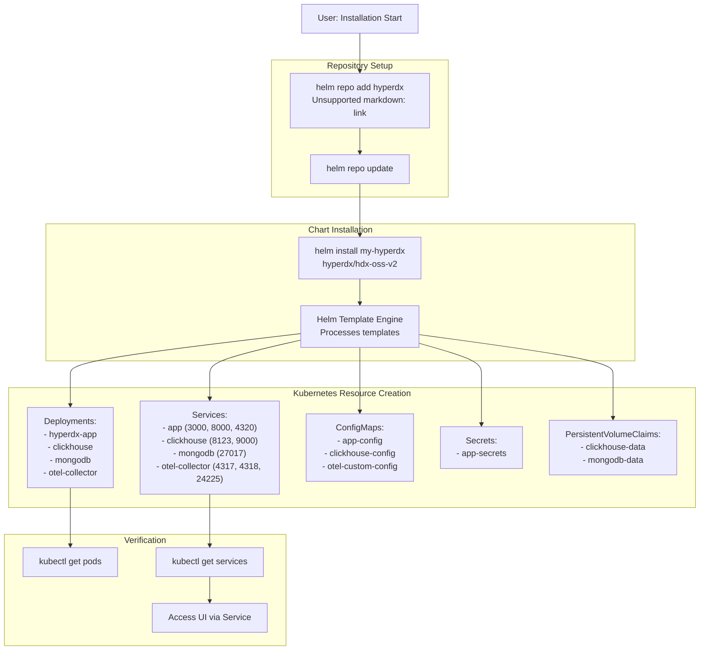

# Installation

> **Relevant source files**
> * [README.md](https://github.com/hyperdxio/helm-charts/blob/845dd482/README.md)
> * [charts/hdx-oss-v2/Chart.yaml](https://github.com/hyperdxio/helm-charts/blob/845dd482/charts/hdx-oss-v2/Chart.yaml)

This page provides step-by-step instructions for installing HyperDX OSS V2 using Helm. It covers adding the Helm repository, installing the chart with default values, and verifying the deployment. For detailed configuration options beyond the basic installation, see [Configuration Reference](/hyperdxio/helm-charts/3-configuration-reference). For a minimal working example and sending your first telemetry data, see [Quick Start Guide](/hyperdxio/helm-charts/2.2-quick-start-guide).

## Prerequisites

Before installing HyperDX, ensure your environment meets the following requirements:

| Requirement | Minimum Version | Notes |
| --- | --- | --- |
| Helm | 3.0+ | Package manager for Kubernetes |
| Kubernetes | 1.20+ | Target cluster for deployment |
| kubectl | Compatible with cluster | Configured to interact with your cluster |

Verify your environment:

```markdown
# Check Helm version
helm version

# Check Kubernetes cluster connectivity
kubectl cluster-info

# Check Kubernetes version
kubectl version --short
```

**Sources:** [README.md L30-L34](https://github.com/hyperdxio/helm-charts/blob/845dd482/README.md#L30-L34)

## Installation Workflow

The following diagram illustrates the complete installation process from adding the Helm repository to accessing the deployed application:



**Sources:** [README.md L38-L50](https://github.com/hyperdxio/helm-charts/blob/845dd482/README.md#L38-L50)

 [charts/hdx-oss-v2/Chart.yaml L1-L7](https://github.com/hyperdxio/helm-charts/blob/845dd482/charts/hdx-oss-v2/Chart.yaml#L1-L7)

## Adding the Helm Repository

The HyperDX Helm charts are hosted on GitHub Pages at `https://hyperdxio.github.io/helm-charts`. Add this repository to your local Helm installation:

```sql
# Add the HyperDX Helm repository
helm repo add hyperdx https://hyperdxio.github.io/helm-charts

# Update your local repository cache
helm repo update
```

Verify the repository was added successfully:

```python
# List available charts from the HyperDX repository
helm search repo hyperdx

# Expected output:
# NAME                    CHART VERSION   APP VERSION   DESCRIPTION
# hyperdx/hdx-oss-v2      0.8.4          2.7.1         A Helm chart for HyperDX OSS V2
```

**Sources:** [README.md L39-L41](https://github.com/hyperdxio/helm-charts/blob/845dd482/README.md#L39-L41)

 [charts/hdx-oss-v2/Chart.yaml L1-L7](https://github.com/hyperdxio/helm-charts/blob/845dd482/charts/hdx-oss-v2/Chart.yaml#L1-L7)

## Installing the Chart

### Basic Installation

Install HyperDX with default values using the `helm install` command. The release name (e.g., `my-hyperdx`) is used as a prefix for all Kubernetes resources created by the chart.

```csharp
# Install HyperDX with default configuration
helm install my-hyperdx hyperdx/hdx-oss-v2

# Install in a specific namespace
helm install my-hyperdx hyperdx/hdx-oss-v2 --namespace hyperdx --create-namespace
```

The installation command accepts several options:

| Option | Description | Example |
| --- | --- | --- |
| Release name | First argument, prefixes all resources | `my-hyperdx` |
| Chart reference | Repository/chart format | `hyperdx/hdx-oss-v2` |
| `--namespace` | Target Kubernetes namespace | `--namespace hyperdx` |
| `--create-namespace` | Create namespace if it doesn't exist | `--create-namespace` |
| `--values` or `-f` | Path to custom values file | `-f my-values.yaml` |
| `--set` | Override individual values | `--set hyperdx.apiKey=xyz` |

**Sources:** [README.md L44](https://github.com/hyperdxio/helm-charts/blob/845dd482/README.md#L44-L44)

 [charts/hdx-oss-v2/Chart.yaml L2](https://github.com/hyperdxio/helm-charts/blob/845dd482/charts/hdx-oss-v2/Chart.yaml#L2-L2)

### Understanding the Release Name

The release name (`my-hyperdx` in the examples) is important because it:

1. Prefixes all Kubernetes resources: `<release-name>-<component>`
2. Identifies the deployment in Helm operations
3. Must be unique within the namespace

**Example resource names created:**

* Deployment: `my-hyperdx-hdx-oss-v2-app`
* Service: `my-hyperdx-hdx-oss-v2-app`
* ConfigMap: `my-hyperdx-app-config`
* Secret: `my-hyperdx-app-secrets`

**Sources:** [README.md L270-L271](https://github.com/hyperdxio/helm-charts/blob/845dd482/README.md#L270-L271)

### Default Component Installation

The following diagram shows the Kubernetes resources created during a default installation:

```mermaid
flowchart TD

Chart["Chart: hdx-oss-v2<br>Version: 0.8.4<br>AppVersion: 2.7.1"]
AppDeploy["my-hyperdx-hdx-oss-v2-app<br>Replicas: 1<br>Containers:<br>- hyperdx-app"]
CHDeploy["my-hyperdx-clickhouse<br>Replicas: 1<br>Containers:<br>- clickhouse"]
MongoDeploy["my-hyperdx-mongodb<br>Replicas: 1<br>Containers:<br>- mongodb"]
OTELDeploy["my-hyperdx-hdx-oss-v2-otel-collector<br>Replicas: 1<br>Containers:<br>- otel-collector"]
AppSvc["my-hyperdx-hdx-oss-v2-app<br>Ports:<br>- 3000 (UI)<br>- 8000 (API)<br>- 4320 (OpAMP)"]
CHSvc["my-hyperdx-clickhouse<br>Ports:<br>- 8123 (HTTP)<br>- 9000 (Native)"]
MongoSvc["my-hyperdx-mongodb<br>Port: 27017"]
OTELSvc["my-hyperdx-hdx-oss-v2-otel-collector<br>Ports:<br>- 4317 (OTLP gRPC)<br>- 4318 (OTLP HTTP)<br>- 24225 (Fluentd)<br>- 8888 (Metrics)"]
AppCM["my-hyperdx-app-config<br>Environment variables"]
CHCM["my-hyperdx-clickhouse-config<br>ClickHouse configuration"]
CHUsersCM["my-hyperdx-clickhouse-users<br>User definitions"]
OTELCM["my-hyperdx-otel-custom-config<br>OTEL Collector config"]
AppSecret["my-hyperdx-app-secrets<br>API keys and credentials"]
CHPVC["my-hyperdx-clickhouse-data<br>Size: 50Gi"]
CHLogsPVC["my-hyperdx-clickhouse-logs<br>Size: 5Gi"]
MongoPVC["my-hyperdx-mongodb-data<br>Size: 8Gi"]

Chart --> AppDeploy
Chart --> CHDeploy
Chart --> MongoDeploy
Chart --> OTELDeploy
Chart --> AppSvc
Chart --> CHSvc
Chart --> MongoSvc
Chart --> OTELSvc
Chart --> AppCM
Chart --> CHCM
Chart --> CHUsersCM
Chart --> OTELCM
Chart --> AppSecret
Chart --> CHPVC
Chart --> CHLogsPVC
Chart --> MongoPVC
AppDeploy --> AppSvc
CHDeploy --> CHSvc
MongoDeploy --> MongoSvc
OTELDeploy --> OTELSvc
AppDeploy -->|"mounts"| AppCM
AppDeploy -->|"mounts"| AppSecret
CHDeploy -->|"mounts"| CHCM
CHDeploy -->|"mounts"| CHUsersCM
CHDeploy -->|"mounts"| CHPVC
CHDeploy -->|"mounts"| CHLogsPVC
MongoDeploy -->|"mounts"| MongoPVC
OTELDeploy -->|"mounts"| OTELCM

subgraph PersistentVolumeClaims ["PersistentVolumeClaims"]
    CHPVC
    CHLogsPVC
    MongoPVC
end

subgraph Secrets ["Secrets"]
    AppSecret
end

subgraph ConfigMaps ["ConfigMaps"]
    AppCM
    CHCM
    CHUsersCM
    OTELCM
end

subgraph subGraph2 ["Services (ClusterIP)"]
    AppSvc
    CHSvc
    MongoSvc
    OTELSvc
end

subgraph Deployments ["Deployments"]
    AppDeploy
    CHDeploy
    MongoDeploy
    OTELDeploy
end

subgraph subGraph0 ["Helm Release: my-hyperdx"]
    Chart
end
```



**Sources:** [README.md L56-L62](https://github.com/hyperdxio/helm-charts/blob/845dd482/README.md#L56-L62)

 [charts/hdx-oss-v2/Chart.yaml L1-L7](https://github.com/hyperdxio/helm-charts/blob/845dd482/charts/hdx-oss-v2/Chart.yaml#L1-L7)

## Verifying the Installation

After installation, verify that all components are running correctly.

### Check Pod Status

```markdown
# View all pods in the release
kubectl get pods -l app.kubernetes.io/instance=my-hyperdx

# Expected output (all should show STATUS: Running):
# NAME                                                    READY   STATUS    RESTARTS   AGE
# my-hyperdx-hdx-oss-v2-app-xxxxxxxxx-xxxxx              1/1     Running   0          2m
# my-hyperdx-clickhouse-xxxxxxxxx-xxxxx                  1/1     Running   0          2m
# my-hyperdx-mongodb-xxxxxxxxx-xxxxx                     1/1     Running   0          2m
# my-hyperdx-hdx-oss-v2-otel-collector-xxxxxxxxx-xxxxx   1/1     Running   0          2m
```

### Check Service Endpoints

```markdown
# List all services created by the release
kubectl get services -l app.kubernetes.io/instance=my-hyperdx

# View detailed service information
kubectl get services
```

Expected services:

| Service Name | Type | Ports | Purpose |
| --- | --- | --- | --- |
| `my-hyperdx-hdx-oss-v2-app` | ClusterIP | 3000, 8000, 4320 | HyperDX UI, API, and OpAMP server |
| `my-hyperdx-clickhouse` | ClusterIP | 8123, 9000 | ClickHouse HTTP and Native protocol |
| `my-hyperdx-mongodb` | ClusterIP | 27017 | MongoDB metadata storage |
| `my-hyperdx-hdx-oss-v2-otel-collector` | ClusterIP | 4317, 4318, 24225, 8888 | OTEL Collector endpoints |

### Check PersistentVolumeClaims

```markdown
# View PVC status
kubectl get pvc -l app.kubernetes.io/instance=my-hyperdx

# Expected output (all should show STATUS: Bound):
# NAME                               STATUS   VOLUME                                     CAPACITY   ACCESS MODES   STORAGECLASS
# my-hyperdx-clickhouse-data         Bound    pvc-xxxxxxxx-xxxx-xxxx-xxxx-xxxxxxxxxxxx   50Gi       RWO            standard
# my-hyperdx-clickhouse-logs         Bound    pvc-xxxxxxxx-xxxx-xxxx-xxxx-xxxxxxxxxxxx   5Gi        RWO            standard
# my-hyperdx-mongodb-data            Bound    pvc-xxxxxxxx-xxxx-xxxx-xxxx-xxxxxxxxxxxx   8Gi        RWO            standard
```

### Check Helm Release Status

```markdown
# View the release status
helm status my-hyperdx

# List all Helm releases in the namespace
helm list

# View values used in the installation
helm get values my-hyperdx
```

**Sources:** [README.md L46-L50](https://github.com/hyperdxio/helm-charts/blob/845dd482/README.md#L46-L50)

 [README.md L628-L631](https://github.com/hyperdxio/helm-charts/blob/845dd482/README.md#L628-L631)

## Accessing the Deployment

After successful installation, you can access HyperDX through various methods depending on your environment.

### Method 1: Port Forwarding (Development)

For local development or testing, use `kubectl port-forward`:

```markdown
# Forward the UI port (3000) to localhost
kubectl port-forward service/my-hyperdx-hdx-oss-v2-app 3000:3000

# Access the UI at http://localhost:3000
```

```markdown
# Forward the API port (8000) if needed
kubectl port-forward service/my-hyperdx-hdx-oss-v2-app 8000:8000

# Forward the OTEL Collector HTTP port (4318) for sending telemetry
kubectl port-forward service/my-hyperdx-hdx-oss-v2-otel-collector 4318:4318
```

### Method 2: LoadBalancer Service (Cloud)

For cloud deployments, get the external IP assigned to the service:

```markdown
# Get service external IP
kubectl get services my-hyperdx-hdx-oss-v2-app

# Wait for EXTERNAL-IP to be assigned (may take a few minutes)
# Access the UI at http://<EXTERNAL-IP>:3000
```

**Note:** By default, services are created as `ClusterIP` type. To expose via LoadBalancer, you'll need to modify the service configuration. See [Service Architecture](/hyperdxio/helm-charts/7.1-service-architecture) for details.

### Method 3: Ingress (Production)

For production deployments, configure an Ingress resource to expose HyperDX via a domain name with optional TLS. This is the recommended approach.

See [Ingress Configuration](/hyperdxio/helm-charts/3.6-ingress-configuration) for detailed setup instructions, including:

* Configuring domain names
* Enabling TLS/HTTPS
* Setting up ingress annotations

**Sources:** [README.md L46-L50](https://github.com/hyperdxio/helm-charts/blob/845dd482/README.md#L46-L50)

## Post-Installation Configuration

After installation, several configuration steps are recommended for a fully functional deployment.

### API Key Configuration

The HyperDX application requires an API key for telemetry collection. After deployment:

1. Access the HyperDX UI (using one of the access methods above)
2. Log into the dashboard
3. Navigate to Team settings to generate an API key
4. Update your deployment with the API key:

```sql
# Update via Helm upgrade with --set
helm upgrade my-hyperdx hyperdx/hdx-oss-v2 --set hyperdx.apiKey="your-api-key-here"

# Restart pods to pick up the new configuration
kubectl rollout restart deployment my-hyperdx-hdx-oss-v2-app
kubectl rollout restart deployment my-hyperdx-hdx-oss-v2-otel-collector
```

For detailed API key configuration including using Kubernetes secrets, see [Security Configuration](/hyperdxio/helm-charts/7.3-security-configuration).

**Sources:** [README.md L240-L273](https://github.com/hyperdxio/helm-charts/blob/845dd482/README.md#L240-L273)

### Frontend URL Configuration

If you're accessing HyperDX via a specific domain or external IP, configure the `frontendUrl`:

```markdown
# For LoadBalancer deployments
helm upgrade my-hyperdx hyperdx/hdx-oss-v2 \
  --set hyperdx.frontendUrl="http://34.123.61.99"

# For Ingress deployments with domain
helm upgrade my-hyperdx hyperdx/hdx-oss-v2 \
  --set hyperdx.frontendUrl="https://hyperdx.yourdomain.com"
```

This ensures that generated links, cookies, and redirects work correctly.

**Sources:** [README.md L350-L365](https://github.com/hyperdxio/helm-charts/blob/845dd482/README.md#L350-L365)

## Installation Troubleshooting

### Pods Not Starting

Check pod status and logs:

```html
# View pod status
kubectl get pods -l app.kubernetes.io/instance=my-hyperdx

# Check pod events
kubectl describe pod <pod-name>

# View pod logs
kubectl logs <pod-name>
```

Common issues:

* Image pull errors: Check `imagePullSecrets` configuration
* Resource constraints: Verify cluster has sufficient CPU/memory
* PVC binding issues: Check storage class availability

### Service Not Accessible

```markdown
# Verify service endpoints are populated
kubectl get endpoints -l app.kubernetes.io/instance=my-hyperdx

# Check if pods are ready
kubectl get pods -l app.kubernetes.io/instance=my-hyperdx
```

### ClickHouse Connection Issues

If the application cannot connect to ClickHouse:

```python
# Check ClickHouse pod logs
kubectl logs deployment/my-hyperdx-clickhouse

# Test ClickHouse connectivity from within the cluster
kubectl run -it --rm debug --image=curlimages/curl --restart=Never -- \
  curl http://my-hyperdx-clickhouse:8123/ping
```

### Helm Installation Failures

```markdown
# Check Helm installation history
helm history my-hyperdx

# View detailed release information
helm get all my-hyperdx

# Rollback to previous version if needed
helm rollback my-hyperdx
```

For more troubleshooting guidance, see [Troubleshooting](/hyperdxio/helm-charts/8.4-troubleshooting).

**Sources:** [README.md L625-L631](https://github.com/hyperdxio/helm-charts/blob/845dd482/README.md#L625-L631)

## Installation Variants

The basic installation deploys all components (full stack). For other deployment scenarios:

* **External ClickHouse:** See [External ClickHouse](/hyperdxio/helm-charts/4.2-external-clickhouse)
* **External OTEL Collector:** See [External OTEL Collector](/hyperdxio/helm-charts/4.3-external-otel-collector)
* **Minimal Deployment:** See [Minimal Deployment](/hyperdxio/helm-charts/4.4-minimal-deployment)
* **Cloud-Specific:** See [Cloud Provider Specific Configurations](/hyperdxio/helm-charts/4.5-cloud-provider-specific-configurations)

## Next Steps

After successful installation:

1. **Complete the Quick Start:** Follow [Quick Start Guide](/hyperdxio/helm-charts/2.2-quick-start-guide) to send your first telemetry data
2. **Configure your deployment:** Review [Configuration Reference](/hyperdxio/helm-charts/3-configuration-reference) for available options
3. **Set up Ingress:** Configure external access via [Ingress Configuration](/hyperdxio/helm-charts/3.6-ingress-configuration)
4. **Integrate applications:** See [Integrating Applications](/hyperdxio/helm-charts/6.3-integrating-applications) to instrument your applications
5. **Plan for production:** Review [Persistence and Backups](/hyperdxio/helm-charts/8.3-persistence-and-backups) and [Security Configuration](/hyperdxio/helm-charts/7.3-security-configuration)

**Sources:** [README.md L28-L52](https://github.com/hyperdxio/helm-charts/blob/845dd482/README.md#L28-L52)