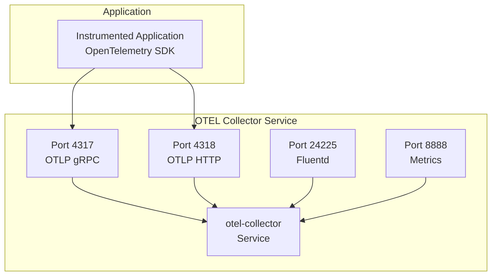
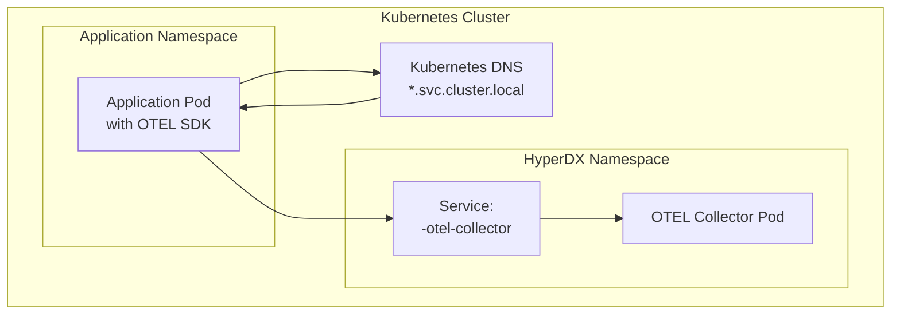
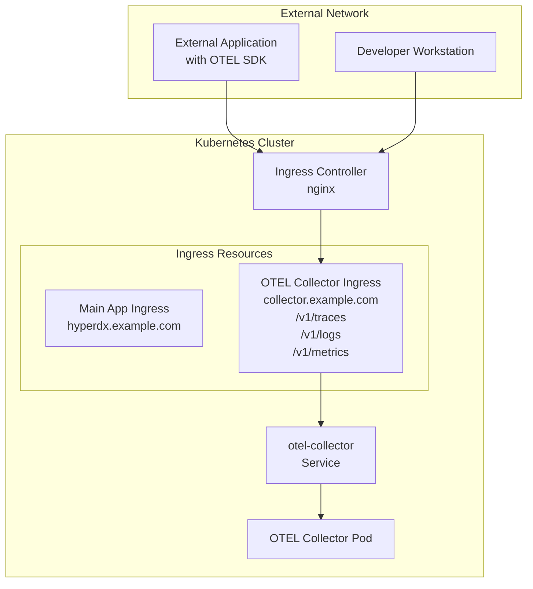
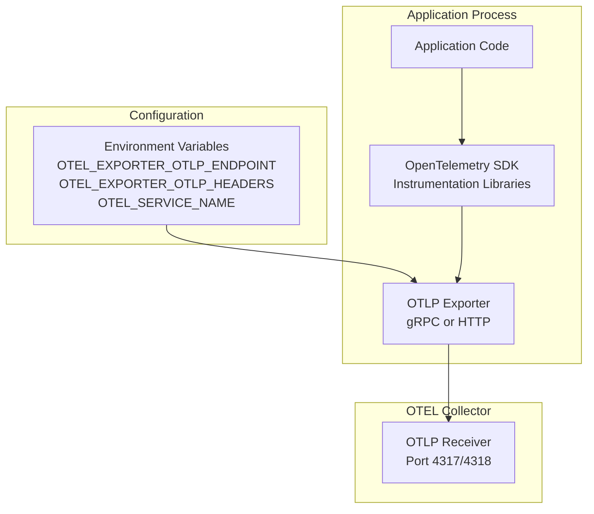

# Integrating Applications

> **Relevant source files**
> * [README.md](https://github.com/hyperdxio/helm-charts/blob/845dd482/README.md)
> * [charts/hdx-oss-v2/templates/otel-collector-deployment.yaml](https://github.com/hyperdxio/helm-charts/blob/845dd482/charts/hdx-oss-v2/templates/otel-collector-deployment.yaml)
> * [charts/hdx-oss-v2/values.yaml](https://github.com/hyperdxio/helm-charts/blob/845dd482/charts/hdx-oss-v2/values.yaml)

## Purpose and Scope

This page describes how to instrument and configure applications to send telemetry data (logs, traces, and metrics) to HyperDX. It covers the available telemetry ingestion endpoints, network access patterns, ingress configuration, and practical examples for instrumenting applications using OpenTelemetry SDKs.

For information about the end-to-end telemetry data pipeline and how data flows through the system, see [Telemetry Data Pipeline](/hyperdxio/helm-charts/6.1-telemetry-data-pipeline). For configuring how HyperDX queries stored telemetry from ClickHouse, see [Data Sources and Connections](/hyperdxio/helm-charts/6.2-data-sources-and-connections).

---

## Telemetry Ingestion Endpoints

The OpenTelemetry Collector deployed by this Helm chart exposes multiple endpoints for receiving telemetry data from instrumented applications.

### Available Ports and Protocols

| Port | Protocol | Purpose | Service Name |
| --- | --- | --- | --- |
| 4317 | OTLP gRPC | OpenTelemetry Protocol over gRPC (binary) | `otlp-grpc` |
| 4318 | OTLP HTTP | OpenTelemetry Protocol over HTTP/JSON | `otlp-http` |
| 24225 | Fluentd | Fluentd forward protocol for log collection | `fluentd` |
| 8888 | HTTP | Collector metrics and health endpoints | `metrics` |
| 13133 | HTTP | Health check endpoint | `health` |

The primary integration method is through **OTLP (OpenTelemetry Protocol)**, which supports traces, metrics, and logs. Both gRPC (port 4317) and HTTP (port 4318) transports are available.

**OTLP Endpoint Diagram**



Sources: [charts/hdx-oss-v2/templates/otel-collector-deployment.yaml L125-L143](https://github.com/hyperdxio/helm-charts/blob/845dd482/charts/hdx-oss-v2/templates/otel-collector-deployment.yaml#L125-L143)

 [charts/hdx-oss-v2/values.yaml L400-L404](https://github.com/hyperdxio/helm-charts/blob/845dd482/charts/hdx-oss-v2/values.yaml#L400-L404)

---

## Network Access Patterns

Applications can send telemetry to HyperDX through two primary access patterns, depending on whether the application runs inside or outside the Kubernetes cluster.

### Internal Cluster Access

For applications running within the same Kubernetes cluster, use the internal ClusterIP service DNS name. This provides the most secure and performant access pattern.

**Internal Access Diagram**



**Internal Endpoint Format:**

```yaml
http://<release-name>-otel-collector.<namespace>.svc.cluster.local:4318
```

For example, if the Helm release is named `my-hyperdx` in the `default` namespace:

* OTLP HTTP: `http://my-hyperdx-hdx-oss-v2-otel-collector.default.svc.cluster.local:4318`
* OTLP gRPC: `http://my-hyperdx-hdx-oss-v2-otel-collector.default.svc.cluster.local:4317`

If the application is in the same namespace, the short service name can be used:

```yaml
http://my-hyperdx-hdx-oss-v2-otel-collector:4318
```

Sources: [charts/hdx-oss-v2/templates/otel-collector-deployment.yaml L118-L144](https://github.com/hyperdxio/helm-charts/blob/845dd482/charts/hdx-oss-v2/templates/otel-collector-deployment.yaml#L118-L144)

 [charts/hdx-oss-v2/values.yaml L60](https://github.com/hyperdxio/helm-charts/blob/845dd482/charts/hdx-oss-v2/values.yaml#L60-L60)

### External Access via Ingress

For applications running outside the Kubernetes cluster (on-premises servers, external cloud services, developer workstations), expose the OTEL Collector through an Ingress resource.

**External Access Diagram**



Sources: [charts/hdx-oss-v2/values.yaml L223-L239](https://github.com/hyperdxio/helm-charts/blob/845dd482/charts/hdx-oss-v2/values.yaml#L223-L239)

 [README.md L436-L468](https://github.com/hyperdxio/helm-charts/blob/845dd482/README.md#L436-L468)

---

## Configuring External Access to OTEL Collector

To expose the OTEL Collector endpoints externally, configure the `additionalIngresses` option in your values file. This creates a separate Ingress resource specifically for telemetry ingestion.

### Basic Ingress Configuration

```yaml
hyperdx:
  ingress:
    enabled: true
    # Main ingress configuration for UI/API
    host: "hyperdx.example.com"
    
    # Additional ingress for OTEL collector
    additionalIngresses:
      - name: otel-collector
        annotations:
          nginx.ingress.kubernetes.io/use-regex: "true"
        ingressClassName: nginx
        hosts:
          - host: collector.example.com
            paths:
              - path: /v1/(traces|metrics|logs)
                pathType: Prefix
                port: 4318
        tls:
          - hosts:
              - collector.example.com
            secretName: collector-tls
```

This configuration:

1. Creates an Ingress resource named `otel-collector`
2. Routes OTLP HTTP requests to port 4318 of the OTEL Collector service
3. Uses regex to match standard OTLP endpoint paths: `/v1/traces`, `/v1/logs`, `/v1/metrics`
4. Optionally enables TLS for secure external access

### Ingress Configuration Options

| Field | Purpose | Required |
| --- | --- | --- |
| `name` | Identifier for this additional ingress | Yes |
| `ingressClassName` | Ingress controller to use (e.g., `nginx`, `traefik`) | Yes |
| `hosts[].host` | Domain name for the collector endpoint | Yes |
| `hosts[].paths[].path` | URL path pattern (supports regex with nginx) | Yes |
| `hosts[].paths[].port` | Target service port (4318 for OTLP HTTP, 4317 for gRPC) | Yes |
| `tls` | TLS configuration for HTTPS | No |
| `annotations` | Ingress-specific annotations | No |

### OTLP Endpoint Paths

When configuring the ingress path, use the standard OpenTelemetry endpoint paths:

| Telemetry Type | Path |
| --- | --- |
| Traces | `/v1/traces` |
| Metrics | `/v1/metrics` |
| Logs | `/v1/logs` |

The regex pattern `/v1/(traces|metrics|logs)` matches all three endpoints with a single rule.

Sources: [charts/hdx-oss-v2/values.yaml L223-L239](https://github.com/hyperdxio/helm-charts/blob/845dd482/charts/hdx-oss-v2/values.yaml#L223-L239)

 [README.md L436-L472](https://github.com/hyperdxio/helm-charts/blob/845dd482/README.md#L436-L472)

---

## Instrumenting Applications with OpenTelemetry

Applications send telemetry to HyperDX by instrumenting their code with OpenTelemetry SDKs. The SDK automatically collects traces, metrics, and logs, then exports them to the OTEL Collector using the OTLP protocol.

### OpenTelemetry SDK Integration Flow



### Common Configuration Environment Variables

The following environment variables configure the OpenTelemetry SDK to send data to HyperDX:

| Variable | Purpose | Example Value |
| --- | --- | --- |
| `OTEL_EXPORTER_OTLP_ENDPOINT` | OTLP endpoint URL | `http://my-hyperdx-hdx-oss-v2-otel-collector:4318` |
| `OTEL_EXPORTER_OTLP_PROTOCOL` | Protocol to use | `http/protobuf` or `grpc` |
| `OTEL_EXPORTER_OTLP_HEADERS` | Authentication headers | `x-api-key=your-api-key` |
| `OTEL_SERVICE_NAME` | Service identifier | `my-service` |
| `OTEL_RESOURCE_ATTRIBUTES` | Additional resource attributes | `environment=production,version=1.0` |

Sources: [charts/hdx-oss-v2/values.yaml L48](https://github.com/hyperdxio/helm-charts/blob/845dd482/charts/hdx-oss-v2/values.yaml#L48-L48)

 [charts/hdx-oss-v2/values.yaml L94-L98](https://github.com/hyperdxio/helm-charts/blob/845dd482/charts/hdx-oss-v2/values.yaml#L94-L98)

### Language-Specific Examples

#### Node.js / JavaScript

**Installation:**

```
npm install @opentelemetry/api \
            @opentelemetry/sdk-node \
            @opentelemetry/auto-instrumentations-node \
            @opentelemetry/exporter-trace-otlp-http
```

**Configuration (tracing.js):**

```javascript
const { NodeSDK } = require('@opentelemetry/sdk-node');
const { getNodeAutoInstrumentations } = require('@opentelemetry/auto-instrumentations-node');
const { OTLPTraceExporter } = require('@opentelemetry/exporter-trace-otlp-http');

const sdk = new NodeSDK({
  traceExporter: new OTLPTraceExporter({
    url: process.env.OTEL_EXPORTER_OTLP_ENDPOINT || 'http://localhost:4318/v1/traces',
    headers: {
      'x-api-key': process.env.HYPERDX_API_KEY
    }
  }),
  instrumentations: [getNodeAutoInstrumentations()],
  serviceName: process.env.OTEL_SERVICE_NAME || 'my-node-app'
});

sdk.start();
```

**Environment Variables:**

```javascript
export OTEL_EXPORTER_OTLP_ENDPOINT=http://my-hyperdx-hdx-oss-v2-otel-collector:4318
export HYPERDX_API_KEY=xxxxxxxx-xxxx-xxxx-xxxx-xxxxxxxxxxxx
export OTEL_SERVICE_NAME=my-node-app
```

#### Python

**Installation:**

```
pip install opentelemetry-api \
            opentelemetry-sdk \
            opentelemetry-instrumentation \
            opentelemetry-exporter-otlp
```

**Configuration:**

```javascript
from opentelemetry import trace
from opentelemetry.sdk.trace import TracerProvider
from opentelemetry.sdk.trace.export import BatchSpanProcessor
from opentelemetry.exporter.otlp.proto.http.trace_exporter import OTLPSpanExporter

# Configure the tracer provider
trace.set_tracer_provider(TracerProvider())

# Configure OTLP exporter
otlp_exporter = OTLPSpanExporter(
    endpoint="http://my-hyperdx-hdx-oss-v2-otel-collector:4318/v1/traces",
    headers={
        "x-api-key": "xxxxxxxx-xxxx-xxxx-xxxx-xxxxxxxxxxxx"
    }
)

# Add the exporter to the tracer provider
trace.get_tracer_provider().add_span_processor(
    BatchSpanProcessor(otlp_exporter)
)
```

#### Java

**Maven Dependencies:**

```xml
<dependencies>
  <dependency>
    <groupId>io.opentelemetry</groupId>
    <artifactId>opentelemetry-api</artifactId>
    <version>1.32.0</version>
  </dependency>
  <dependency>
    <groupId>io.opentelemetry</groupId>
    <artifactId>opentelemetry-sdk</artifactId>
    <version>1.32.0</version>
  </dependency>
  <dependency>
    <groupId>io.opentelemetry</groupId>
    <artifactId>opentelemetry-exporter-otlp</artifactId>
    <version>1.32.0</version>
  </dependency>
</dependencies>
```

**Java Agent (Automatic Instrumentation):**

```
java -javaagent:opentelemetry-javaagent.jar \
     -Dotel.exporter.otlp.endpoint=http://my-hyperdx-hdx-oss-v2-otel-collector:4318 \
     -Dotel.exporter.otlp.headers=x-api-key=xxxxxxxx-xxxx-xxxx-xxxx-xxxxxxxxxxxx \
     -Dotel.service.name=my-java-app \
     -jar myapp.jar
```

#### Go

**Installation:**

```go
go get go.opentelemetry.io/otel
go get go.opentelemetry.io/otel/exporters/otlp/otlptrace/otlptracehttp
go get go.opentelemetry.io/otel/sdk/trace
```

**Configuration:**

```javascript
package main

import (
    "context"
    "go.opentelemetry.io/otel"
    "go.opentelemetry.io/otel/exporters/otlp/otlptrace/otlptracehttp"
    "go.opentelemetry.io/otel/sdk/trace"
)

func initTracer() {
    ctx := context.Background()
    
    exporter, err := otlptracehttp.New(ctx,
        otlptracehttp.WithEndpoint("my-hyperdx-hdx-oss-v2-otel-collector:4318"),
        otlptracehttp.WithInsecure(),
        otlptracehttp.WithHeaders(map[string]string{
            "x-api-key": "xxxxxxxx-xxxx-xxxx-xxxx-xxxxxxxxxxxx",
        }),
    )
    
    tp := trace.NewTracerProvider(
        trace.WithBatcher(exporter),
    )
    
    otel.SetTracerProvider(tp)
}
```

Sources: [charts/hdx-oss-v2/values.yaml L60](https://github.com/hyperdxio/helm-charts/blob/845dd482/charts/hdx-oss-v2/values.yaml#L60-L60)

---

## Authentication with API Keys

HyperDX uses API keys to authenticate telemetry data submissions. The API key must be included in the OTLP request headers.

### Configuring the API Key

The API key is set during Helm installation or upgrade:

```yaml
hyperdx:
  apiKey: "xxxxxxxx-xxxx-xxxx-xxxx-xxxxxxxxxxxx"
```

This creates a Kubernetes Secret named `<release-name>-app-secrets` containing the API key. The OTEL Collector automatically reads this secret and validates incoming telemetry requests.

Sources: [charts/hdx-oss-v2/values.yaml L48](https://github.com/hyperdxio/helm-charts/blob/845dd482/charts/hdx-oss-v2/values.yaml#L48-L48)

 [charts/hdx-oss-v2/templates/otel-collector-deployment.yaml L94-L98](https://github.com/hyperdxio/helm-charts/blob/845dd482/charts/hdx-oss-v2/templates/otel-collector-deployment.yaml#L94-L98)

### Including the API Key in OTLP Requests

The API key must be sent as an HTTP header with each OTLP request:

**Header Format:**

```
x-api-key: xxxxxxxx-xxxx-xxxx-xxxx-xxxxxxxxxxxx
```

**OpenTelemetry SDK Configuration:**

Most OpenTelemetry SDKs support setting custom headers through the `OTEL_EXPORTER_OTLP_HEADERS` environment variable:

```javascript
export OTEL_EXPORTER_OTLP_HEADERS="x-api-key=xxxxxxxx-xxxx-xxxx-xxxx-xxxxxxxxxxxx"
```

Or through SDK-specific configuration:

**Node.js:**

```javascript
const exporter = new OTLPTraceExporter({
  headers: {
    'x-api-key': 'xxxxxxxx-xxxx-xxxx-xxxx-xxxxxxxxxxxx'
  }
});
```

**Python:**

```
exporter = OTLPSpanExporter(
    headers={
        "x-api-key": "xxxxxxxx-xxxx-xxxx-xxxx-xxxxxxxxxxxx"
    }
)
```

**Java:**

```
-Dotel.exporter.otlp.headers=x-api-key=xxxxxxxx-xxxx-xxxx-xxxx-xxxxxxxxxxxx
```

Sources: [charts/hdx-oss-v2/templates/otel-collector-deployment.yaml L94-L98](https://github.com/hyperdxio/helm-charts/blob/845dd482/charts/hdx-oss-v2/templates/otel-collector-deployment.yaml#L94-L98)

### Obtaining the API Key

1. Access the HyperDX UI after initial deployment
2. Navigate to Team Settings
3. Generate or retrieve your API key
4. Update your Helm values and upgrade the deployment:

```
helm upgrade my-hyperdx hyperdx/hdx-oss-v2 --set hyperdx.apiKey="your-new-api-key"
```

1. Restart the OTEL Collector to pick up the new key:

```
kubectl rollout restart deployment my-hyperdx-hdx-oss-v2-otel-collector
```

Sources: [README.md L240-L271](https://github.com/hyperdxio/helm-charts/blob/845dd482/README.md#L240-L271)

---

## Complete Integration Example

This example demonstrates a complete application deployment with OpenTelemetry instrumentation sending data to HyperDX within a Kubernetes cluster.

### Application Deployment with OTEL SDK

**Kubernetes Deployment Manifest:**

```yaml
apiVersion: apps/v1
kind: Deployment
metadata:
  name: my-instrumented-app
spec:
  replicas: 1
  selector:
    matchLabels:
      app: my-app
  template:
    metadata:
      labels:
        app: my-app
    spec:
      containers:
      - name: app
        image: my-app:latest
        env:
        # OTLP configuration
        - name: OTEL_EXPORTER_OTLP_ENDPOINT
          value: "http://my-hyperdx-hdx-oss-v2-otel-collector.default.svc.cluster.local:4318"
        - name: OTEL_EXPORTER_OTLP_PROTOCOL
          value: "http/protobuf"
        - name: OTEL_EXPORTER_OTLP_HEADERS
          value: "x-api-key=xxxxxxxx-xxxx-xxxx-xxxx-xxxxxxxxxxxx"
        
        # Service identification
        - name: OTEL_SERVICE_NAME
          value: "my-app"
        - name: OTEL_RESOURCE_ATTRIBUTES
          value: "environment=production,version=1.0.0"
        
        # Optional: Configure sampling
        - name: OTEL_TRACES_SAMPLER
          value: "parentbased_traceidratio"
        - name: OTEL_TRACES_SAMPLER_ARG
          value: "0.1"  # Sample 10% of traces
```

### Integration Flow Diagram

```mermaid
sequenceDiagram
  participant Instrumented App
  participant my-app:latest
  participant OTEL SDK
  participant in Application
  participant Kubernetes DNS
  participant OTEL Collector
  participant Service
  participant ClickHouse

  Instrumented App->>OTEL SDK: Execute application code
  OTEL SDK->>OTEL SDK: Generate trace spans
  OTEL SDK->>Kubernetes DNS: Collect metrics
  Kubernetes DNS-->>OTEL SDK: Capture logs
  OTEL SDK->>OTEL Collector: Resolve my-hyperdx-hdx-oss-v2-otel-collector
  OTEL Collector->>OTEL Collector: Returns ClusterIP
  OTEL Collector->>ClickHouse: POST /v1/traces
  OTEL SDK->>OTEL Collector: Header: x-api-key
  OTEL Collector->>ClickHouse: Payload: OTLP binary
  OTEL SDK->>OTEL Collector: Validate API key
  OTEL Collector->>ClickHouse: Process telemetry
```

Sources: [charts/hdx-oss-v2/templates/otel-collector-deployment.yaml L79-L109](https://github.com/hyperdxio/helm-charts/blob/845dd482/charts/hdx-oss-v2/templates/otel-collector-deployment.yaml#L79-L109)

 [charts/hdx-oss-v2/values.yaml L60](https://github.com/hyperdxio/helm-charts/blob/845dd482/charts/hdx-oss-v2/values.yaml#L60-L60)

---

## Verification and Troubleshooting

### Verifying OTLP Connectivity

Test connectivity to the OTEL Collector from within the cluster:

```markdown
# Start a test pod
kubectl run test-curl --rm -it --image=curlimages/curl -- sh

# Test OTLP HTTP endpoint
curl -v http://my-hyperdx-hdx-oss-v2-otel-collector:4318/v1/traces

# Expected: HTTP 405 Method Not Allowed (POST is required)
# This confirms the endpoint is reachable
```

### Testing with a Simple OTLP Request

Send a test trace span using curl:

```
curl -X POST http://my-hyperdx-hdx-oss-v2-otel-collector:4318/v1/traces \
  -H "Content-Type: application/json" \
  -H "x-api-key: xxxxxxxx-xxxx-xxxx-xxxx-xxxxxxxxxxxx" \
  -d '{
    "resourceSpans": [{
      "resource": {
        "attributes": [{
          "key": "service.name",
          "value": {"stringValue": "test-service"}
        }]
      },
      "scopeSpans": [{
        "spans": [{
          "traceId": "5b8efff798038103d269b633813fc60c",
          "spanId": "eee19b7ec3c1b173",
          "name": "test-span",
          "kind": 1,
          "startTimeUnixNano": "1544712660000000000",
          "endTimeUnixNano": "1544712661000000000"
        }]
      }]
    }]
  }'
```

### Checking OTEL Collector Logs

View the collector logs to diagnose issues:

```
kubectl logs -l app=otel-collector -f
```

Common log messages:

* `"connection refused"`: Collector cannot reach ClickHouse or OpAMP server
* `"authentication failed"`: Invalid API key in request
* `"Traces exported"`: Successful trace export to ClickHouse

Sources: [charts/hdx-oss-v2/templates/otel-collector-deployment.yaml L1-L116](https://github.com/hyperdxio/helm-charts/blob/845dd482/charts/hdx-oss-v2/templates/otel-collector-deployment.yaml#L1-L116)

### Common Integration Issues

| Issue | Symptom | Solution |
| --- | --- | --- |
| API key mismatch | Collector rejects requests | Verify API key matches between app config and `hyperdx.apiKey` |
| DNS resolution failure | Cannot resolve collector hostname | Use full FQDN: `<service>.<namespace>.svc.cluster.local` |
| Port mismatch | Connection refused | Verify using port 4318 (HTTP) or 4317 (gRPC) |
| Wrong protocol | Protocol error | Match OTLP protocol in SDK to collector endpoint (gRPC vs HTTP) |
| Ingress not configured | External app cannot connect | Configure `additionalIngresses` for external access |
| TLS certificate errors | Certificate validation fails | Use correct TLS secret name in ingress configuration |

### Monitoring Telemetry Ingestion

Check that telemetry data is being stored in ClickHouse:

```sql
# Connect to ClickHouse pod
kubectl exec -it deployment/my-hyperdx-hdx-oss-v2-clickhouse -- clickhouse-client

# Query recent traces
SELECT Timestamp, ServiceName, SpanName 
FROM otel_traces 
ORDER BY Timestamp DESC 
LIMIT 10;

# Query recent logs
SELECT Timestamp, ServiceName, Body 
FROM otel_logs 
ORDER BY Timestamp DESC 
LIMIT 10;

# Check metrics
SELECT * FROM otel_metrics_sum LIMIT 10;
```

Sources: [charts/hdx-oss-v2/values.yaml L104-L202](https://github.com/hyperdxio/helm-charts/blob/845dd482/charts/hdx-oss-v2/values.yaml#L104-L202)

---

## Best Practices

### Security Considerations

1. **Use TLS for External Endpoints**: Always enable TLS when exposing the OTEL Collector externally: ```yaml additionalIngresses:   - name: otel-collector     tls:       - hosts:           - collector.example.com         secretName: collector-tls ```
2. **Rotate API Keys Regularly**: Update the `hyperdx.apiKey` value periodically and restart affected pods.
3. **Network Policies**: Restrict which pods can access the OTEL Collector service using Kubernetes NetworkPolicies.

### Performance Optimization

1. **Use gRPC for High Throughput**: OTLP gRPC (port 4317) provides better performance than HTTP for high-volume telemetry.
2. **Configure Sampling**: For high-traffic applications, configure trace sampling to reduce data volume: ```markdown OTEL_TRACES_SAMPLER=parentbased_traceidratio OTEL_TRACES_SAMPLER_ARG=0.1  # Sample 10% ```
3. **Batch Configuration**: The SDK automatically batches telemetry data. Adjust batch size and timeout for your use case: ```markdown OTEL_BSP_MAX_EXPORT_BATCH_SIZE=512 OTEL_BSP_SCHEDULE_DELAY=5000  # milliseconds ```
4. **Resource Limits**: Configure appropriate resource limits for the OTEL Collector based on ingestion volume: ```yaml otel:   resources:     requests:       memory: "256Mi"       cpu: "200m"     limits:       memory: "512Mi"       cpu: "500m" ```

Sources: [charts/hdx-oss-v2/values.yaml L374-L382](https://github.com/hyperdxio/helm-charts/blob/845dd482/charts/hdx-oss-v2/values.yaml#L374-L382)

 [charts/hdx-oss-v2/templates/otel-collector-deployment.yaml L55-L58](https://github.com/hyperdxio/helm-charts/blob/845dd482/charts/hdx-oss-v2/templates/otel-collector-deployment.yaml#L55-L58)

### Development vs Production Configurations

**Development (Internal Access):**

```markdown
# Use short service names, HTTP, no authentication complexity
OTEL_EXPORTER_OTLP_ENDPOINT=http://my-hyperdx-hdx-oss-v2-otel-collector:4318
OTEL_EXPORTER_OTLP_PROTOCOL=http/protobuf
```

**Production (External Access with Security):**

```markdown
# Use external domain, HTTPS, proper authentication
OTEL_EXPORTER_OTLP_ENDPOINT=https://collector.company.com
OTEL_EXPORTER_OTLP_PROTOCOL=http/protobuf
OTEL_EXPORTER_OTLP_HEADERS=x-api-key=<secure-api-key>
```

Sources: [README.md L436-L472](https://github.com/hyperdxio/helm-charts/blob/845dd482/README.md#L436-L472)

 [charts/hdx-oss-v2/values.yaml L223-L239](https://github.com/hyperdxio/helm-charts/blob/845dd482/charts/hdx-oss-v2/values.yaml#L223-L239)