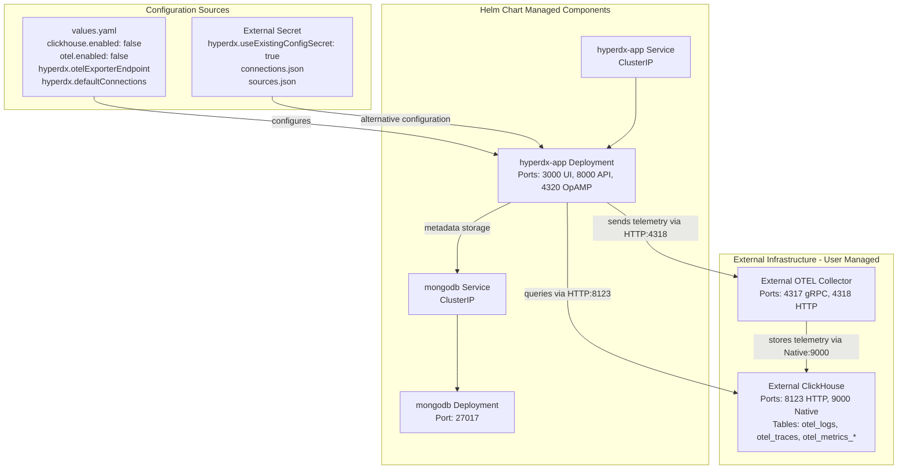
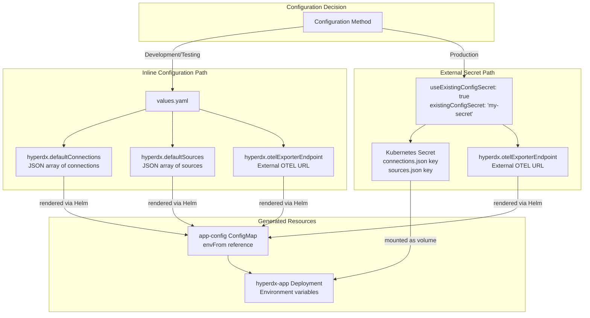
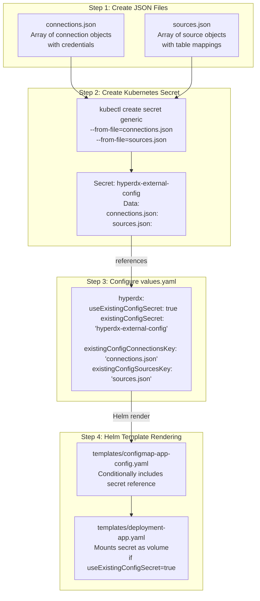
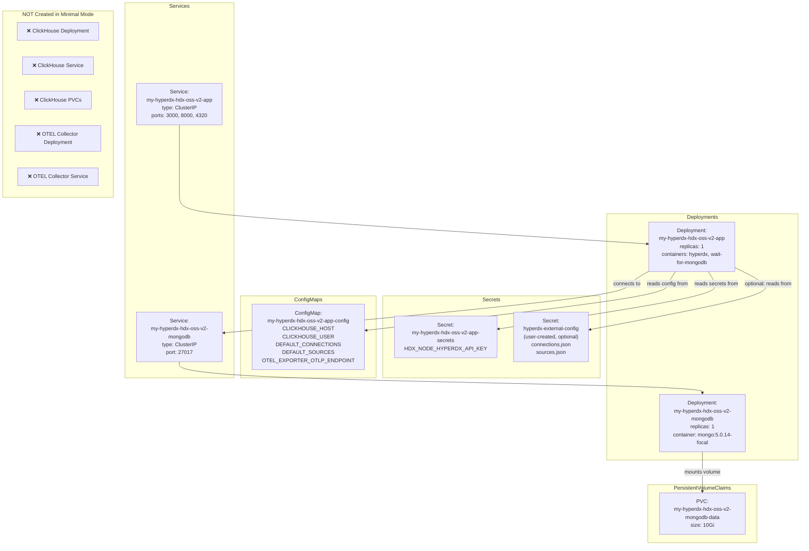
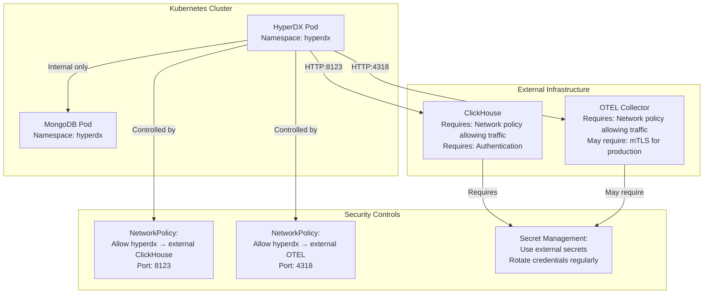

# Minimal Deployment

> **Relevant source files**
> * [README.md](https://github.com/hyperdxio/helm-charts/blob/845dd482/README.md)
> * [charts/hdx-oss-v2/values.yaml](https://github.com/hyperdxio/helm-charts/blob/845dd482/charts/hdx-oss-v2/values.yaml)

## Purpose and Scope

This document describes how to deploy HyperDX in minimal mode, where only the HyperDX application and MongoDB are managed by the Helm chart, while ClickHouse and the OpenTelemetry Collector are provided externally. This deployment scenario is intended for organizations that already have existing infrastructure for data storage and telemetry collection, or require centralized management of these components across multiple HyperDX instances.

For deploying all components together, see [Full Stack Deployment](/hyperdxio/helm-charts/4.1-full-stack-deployment). For using only an external ClickHouse or only an external OTEL Collector, see [External ClickHouse](/hyperdxio/helm-charts/4.2-external-clickhouse) and [External OTEL Collector](/hyperdxio/helm-charts/4.3-external-otel-collector) respectively. For cloud-specific configurations, see [Cloud Provider Specific Configurations](/hyperdxio/helm-charts/4.5-cloud-provider-specific-configurations).

---

## What is Minimal Deployment

Minimal deployment disables both the built-in ClickHouse database and OpenTelemetry Collector components, reducing the Helm chart's responsibility to only the HyperDX application (UI, API, OpAMP server) and MongoDB for metadata storage. All telemetry data storage and collection is handled by external systems that you manage independently.

**Sources:** [README.md L203-L234](https://github.com/hyperdxio/helm-charts/blob/845dd482/README.md#L203-L234)

### Deployment Topology



**Sources:** [README.md L203-L234](https://github.com/hyperdxio/helm-charts/blob/845dd482/README.md#L203-L234)

 [values.yaml L289-L321](https://github.com/hyperdxio/helm-charts/blob/845dd482/values.yaml#L289-L321)

 [values.yaml L368-L405](https://github.com/hyperdxio/helm-charts/blob/845dd482/values.yaml#L368-L405)

### When to Use Minimal Deployment

| Scenario | Reason |
| --- | --- |
| **Existing ClickHouse Cluster** | You have a centralized ClickHouse cluster serving multiple applications and want to consolidate data storage |
| **Centralized OTEL Infrastructure** | Your organization has a standardized OTEL Collector deployment with custom processors and exporters |
| **Resource Optimization** | You want to reduce resource consumption in the Kubernetes cluster by using external managed services |
| **Multi-Tenant Environments** | Multiple HyperDX instances share a single ClickHouse cluster with different databases or tables |
| **Compliance Requirements** | Data storage must be on specific infrastructure for regulatory or security reasons |

**Sources:** [README.md L203-L234](https://github.com/hyperdxio/helm-charts/blob/845dd482/README.md#L203-L234)

---

## Configuration Options

The Helm chart supports two methods for configuring external dependencies: inline configuration in `values.yaml` (simple, suitable for development) and external Kubernetes secrets (recommended for production).

### Chart-Level Flags

The following `values.yaml` settings disable the built-in components:

| Parameter | Value | Description |
| --- | --- | --- |
| `clickhouse.enabled` | `false` | Disables ClickHouse deployment, Service, ConfigMaps, and PVCs |
| `otel.enabled` | `false` | Disables OTEL Collector deployment, Service, and ConfigMaps |
| `mongodb.enabled` | `true` | Keeps MongoDB enabled (required for HyperDX metadata) |

**Sources:** [values.yaml L289-L321](https://github.com/hyperdxio/helm-charts/blob/845dd482/values.yaml#L289-L321)

 [values.yaml L368-L405](https://github.com/hyperdxio/helm-charts/blob/845dd482/values.yaml#L368-L405)

 [values.yaml L256-L259](https://github.com/hyperdxio/helm-charts/blob/845dd482/values.yaml#L256-L259)

### Configuration Flow Diagram



**Sources:** [values.yaml L77-L102](https://github.com/hyperdxio/helm-charts/blob/845dd482/values.yaml#L77-L102)

 [README.md L98-L184](https://github.com/hyperdxio/helm-charts/blob/845dd482/README.md#L98-L184)

---

## Inline Configuration Method

### values.yaml Configuration

```css
# values-minimal-inline.yaml
clickhouse:
  enabled: false  # Disable built-in ClickHouse

otel:
  enabled: false  # Disable built-in OTEL Collector

hyperdx:
  # Point to your external OTEL collector
  otelExporterEndpoint: "http://your-otel-collector.yournamespace.svc.cluster.local:4318"
  
  # Define connection to external ClickHouse
  defaultConnections: |
    [
      {
        "name": "External ClickHouse",
        "host": "http://your-clickhouse-server.yournamespace.svc.cluster.local:8123",
        "port": 8123,
        "username": "hyperdx_user",
        "password": "your-password"
      }
    ]
  
  # Define data sources (logs, traces, metrics, sessions)
  defaultSources: |
    [
      {
        "from": {
          "databaseName": "default",
          "tableName": "otel_logs"
        },
        "kind": "log",
        "name": "Logs",
        "connection": "External ClickHouse",
        "timestampValueExpression": "TimestampTime",
        "displayedTimestampValueExpression": "Timestamp",
        "implicitColumnExpression": "Body",
        "serviceNameExpression": "ServiceName",
        "bodyExpression": "Body",
        "eventAttributesExpression": "LogAttributes",
        "resourceAttributesExpression": "ResourceAttributes",
        "severityTextExpression": "SeverityText",
        "traceIdExpression": "TraceId",
        "spanIdExpression": "SpanId",
        "traceSourceId": "Traces",
        "sessionSourceId": "Sessions",
        "metricSourceId": "Metrics"
      },
      {
        "from": {
          "databaseName": "default",
          "tableName": "otel_traces"
        },
        "kind": "trace",
        "name": "Traces",
        "connection": "External ClickHouse",
        "timestampValueExpression": "Timestamp",
        "displayedTimestampValueExpression": "Timestamp",
        "implicitColumnExpression": "SpanName",
        "serviceNameExpression": "ServiceName",
        "traceIdExpression": "TraceId",
        "spanIdExpression": "SpanId",
        "durationExpression": "Duration",
        "durationPrecision": 9,
        "parentSpanIdExpression": "ParentSpanId",
        "spanNameExpression": "SpanName",
        "logSourceId": "Logs",
        "sessionSourceId": "Sessions",
        "metricSourceId": "Metrics"
      },
      {
        "from": {
          "databaseName": "default",
          "tableName": ""
        },
        "kind": "metric",
        "name": "Metrics",
        "connection": "External ClickHouse",
        "timestampValueExpression": "TimeUnix",
        "resourceAttributesExpression": "ResourceAttributes",
        "metricTables": {
          "gauge": "otel_metrics_gauge",
          "histogram": "otel_metrics_histogram",
          "sum": "otel_metrics_sum"
        },
        "logSourceId": "Logs",
        "traceSourceId": "Traces",
        "sessionSourceId": "Sessions"
      },
      {
        "from": {
          "databaseName": "default",
          "tableName": "hyperdx_sessions"
        },
        "kind": "session",
        "name": "Sessions",
        "connection": "External ClickHouse",
        "timestampValueExpression": "TimestampTime",
        "displayedTimestampValueExpression": "Timestamp",
        "implicitColumnExpression": "Body",
        "serviceNameExpression": "ServiceName",
        "bodyExpression": "Body",
        "eventAttributesExpression": "LogAttributes",
        "resourceAttributesExpression": "ResourceAttributes",
        "severityTextExpression": "SeverityText",
        "traceIdExpression": "TraceId",
        "spanIdExpression": "SpanId",
        "logSourceId": "Logs",
        "traceSourceId": "Traces",
        "metricSourceId": "Metrics"
      }
    ]
```

**Sources:** [README.md L207-L234](https://github.com/hyperdxio/helm-charts/blob/845dd482/README.md#L207-L234)

 [values.yaml L92-L202](https://github.com/hyperdxio/helm-charts/blob/845dd482/values.yaml#L92-L202)

### Key Configuration Parameters

| Parameter | Type | Purpose |
| --- | --- | --- |
| `hyperdx.otelExporterEndpoint` | String | HTTP endpoint where HyperDX sends its own telemetry data |
| `hyperdx.defaultConnections` | JSON Array | ClickHouse connection definitions for querying telemetry data |
| `hyperdx.defaultSources` | JSON Array | Data source mappings to ClickHouse tables with column expressions |

**Sources:** [values.yaml L59-L60](https://github.com/hyperdxio/helm-charts/blob/845dd482/values.yaml#L59-L60)

 [values.yaml L92-L102](https://github.com/hyperdxio/helm-charts/blob/845dd482/values.yaml#L92-L102)

 [values.yaml L104-L202](https://github.com/hyperdxio/helm-charts/blob/845dd482/values.yaml#L104-L202)

### defaultConnections Schema

Each connection object in the `defaultConnections` array must include:

```css
{
  "name": "String identifier",           # Referenced by sources
  "host": "http://hostname:port",        # ClickHouse HTTP endpoint
  "port": 8123,                           # HTTP port (typically 8123)
  "username": "String",                   # ClickHouse username
  "password": "String"                    # ClickHouse password
}
```

**Sources:** [values.yaml L92-L102](https://github.com/hyperdxio/helm-charts/blob/845dd482/values.yaml#L92-L102)

 [README.md L86-L95](https://github.com/hyperdxio/helm-charts/blob/845dd482/README.md#L86-L95)

### defaultSources Schema

Each source object defines how to query a specific type of telemetry data:

| Field | Required | Purpose |
| --- | --- | --- |
| `from.databaseName` | Yes | ClickHouse database name |
| `from.tableName` | Yes | ClickHouse table name (empty for metrics due to multiple tables) |
| `kind` | Yes | Data type: `"log"`, `"trace"`, `"metric"`, or `"session"` |
| `name` | Yes | Display name in HyperDX UI |
| `connection` | Yes | References a `name` from `defaultConnections` |
| `timestampValueExpression` | Yes | ClickHouse column expression for filtering by time |
| `serviceNameExpression` | Yes | Column expression for service name |
| `traceIdExpression` | For logs/traces | Column expression for trace ID correlation |
| `spanIdExpression` | For logs/traces | Column expression for span ID correlation |
| `*SourceId` | Yes | Cross-references to other source names for correlation |

**Sources:** [values.yaml L104-L202](https://github.com/hyperdxio/helm-charts/blob/845dd482/values.yaml#L104-L202)

---

## External Secret Configuration Method

For production deployments, credentials and connection information should be stored in Kubernetes secrets rather than inline in `values.yaml`.

### Secret Creation Process



**Sources:** [README.md L98-L183](https://github.com/hyperdxio/helm-charts/blob/845dd482/README.md#L98-L183)

 [values.yaml L87-L90](https://github.com/hyperdxio/helm-charts/blob/845dd482/values.yaml#L87-L90)

### Creating the Secret

```python
# 1. Create connections.json
cat <<EOF > connections.json
[
  {
    "name": "Production ClickHouse",
    "host": "https://clickhouse.prod.example.com:8123",
    "port": 8123,
    "username": "hyperdx_user",
    "password": "SecurePassword123!"
  }
]
EOF

# 2. Create sources.json (use full schema from inline example)
cat <<EOF > sources.json
[
  {
    "from": {"databaseName": "default", "tableName": "otel_logs"},
    "kind": "log",
    "name": "Logs",
    "connection": "Production ClickHouse",
    "timestampValueExpression": "TimestampTime",
    "displayedTimestampValueExpression": "Timestamp",
    "implicitColumnExpression": "Body",
    "serviceNameExpression": "ServiceName",
    "bodyExpression": "Body",
    "eventAttributesExpression": "LogAttributes",
    "resourceAttributesExpression": "ResourceAttributes",
    "severityTextExpression": "SeverityText",
    "traceIdExpression": "TraceId",
    "spanIdExpression": "SpanId",
    "traceSourceId": "Traces",
    "sessionSourceId": "Sessions",
    "metricSourceId": "Metrics"
  }
]
EOF

# 3. Create the Kubernetes secret
kubectl create secret generic hyperdx-external-config \
  --from-file=connections.json=connections.json \
  --from-file=sources.json=sources.json

# 4. Clean up local files
rm connections.json sources.json
```

**Sources:** [README.md L119-L183](https://github.com/hyperdxio/helm-charts/blob/845dd482/README.md#L119-L183)

### values.yaml for External Secret

```yaml
# values-minimal-secret.yaml
clickhouse:
  enabled: false

otel:
  enabled: false

hyperdx:
  otelExporterEndpoint: "http://your-otel-collector:4318"
  
  # Use external secret instead of inline configuration
  useExistingConfigSecret: true
  existingConfigSecret: "hyperdx-external-config"
  existingConfigConnectionsKey: "connections.json"
  existingConfigSourcesKey: "sources.json"
```

**Sources:** [README.md L102-L117](https://github.com/hyperdxio/helm-charts/blob/845dd482/README.md#L102-L117)

 [values.yaml L87-L90](https://github.com/hyperdxio/helm-charts/blob/845dd482/values.yaml#L87-L90)

### Configuration Precedence

The Helm templates implement the following precedence logic:

1. If `useExistingConfigSecret: true`, the secret keys override any inline `defaultConnections` and `defaultSources`
2. If `useExistingConfigSecret: false` or unset, inline values from `values.yaml` are used
3. Empty strings (`""`) for `defaultConnections` or `defaultSources` disable those configurations entirely

**Sources:** [values.yaml L77-L90](https://github.com/hyperdxio/helm-charts/blob/845dd482/values.yaml#L77-L90)

---

## Deployment Procedure

### Prerequisites Verification

Before deploying, ensure your external infrastructure is ready:

| Component | Requirement | Verification Command |
| --- | --- | --- |
| **External ClickHouse** | Tables created: `otel_logs`, `otel_traces`, `otel_metrics_*`, `hyperdx_sessions` | `clickhouse-client --query "SHOW TABLES FROM default"` |
| **External OTEL Collector** | ClickHouse exporter configured to write to your ClickHouse instance | Check OTEL config exporters section |
| **Network Connectivity** | HyperDX pods can reach both ClickHouse HTTP:8123 and OTEL HTTP:4318 | `kubectl run test --rm -it --image=busybox -- wget -O- http://your-clickhouse:8123` |
| **ClickHouse User** | User created with SELECT/INSERT permissions | `GRANT SELECT, INSERT ON default.* TO hyperdx_user` |

**Sources:** [values.yaml L92-L202](https://github.com/hyperdxio/helm-charts/blob/845dd482/values.yaml#L92-L202)

### Installation Steps

```csharp
# 1. Add the HyperDX Helm repository
helm repo add hyperdx https://hyperdxio.github.io/helm-charts
helm repo update

# 2. Create your values file (choose inline or secret method)
# For inline method:
cat <<EOF > values-minimal.yaml
clickhouse:
  enabled: false

otel:
  enabled: false

hyperdx:
  otelExporterEndpoint: "http://otel-collector.otel-system.svc.cluster.local:4318"
  defaultConnections: |
    [
      {
        "name": "External ClickHouse",
        "host": "http://clickhouse.data.svc.cluster.local:8123",
        "port": 8123,
        "username": "hyperdx_user",
        "password": "your-password"
      }
    ]
  # Include full defaultSources configuration here (see inline example above)
EOF

# 3. Install the chart
helm install my-hyperdx hyperdx/hdx-oss-v2 \
  -f values-minimal.yaml \
  --namespace hyperdx \
  --create-namespace

# 4. Verify deployment
kubectl get pods -n hyperdx
# Expected: my-hyperdx-hdx-oss-v2-app and my-hyperdx-hdx-oss-v2-mongodb pods

# 5. Check that ClickHouse and OTEL pods are NOT created
kubectl get pods -n hyperdx | grep -E "(clickhouse|otel-collector)"
# Expected: no results
```

**Sources:** [README.md L38-L50](https://github.com/hyperdxio/helm-charts/blob/845dd482/README.md#L38-L50)

 [README.md L203-L234](https://github.com/hyperdxio/helm-charts/blob/845dd482/README.md#L203-L234)

### Deployed Resources

In minimal mode, the Helm chart creates only the following Kubernetes resources:



**Sources:** [values.yaml L14-L55](https://github.com/hyperdxio/helm-charts/blob/845dd482/values.yaml#L14-L55)

 [values.yaml L256-L287](https://github.com/hyperdxio/helm-charts/blob/845dd482/values.yaml#L256-L287)

---

## Configuration Validation

### Verifying Environment Variables

After deployment, verify that the HyperDX application has the correct environment variables:

```markdown
# Check environment variables in the app pod
kubectl exec -n hyperdx deployment/my-hyperdx-hdx-oss-v2-app -- env | grep -E "(CLICKHOUSE|OTEL|DEFAULT_)" | sort

# Expected output includes:
# CLICKHOUSE_HOST=<external-clickhouse-endpoint>
# CLICKHOUSE_USER=<your-username>
# DEFAULT_CONNECTIONS=<json-array>
# DEFAULT_SOURCES=<json-array>
# OTEL_EXPORTER_OTLP_ENDPOINT=http://your-otel-collector:4318
```

**Sources:** [values.yaml L59-L60](https://github.com/hyperdxio/helm-charts/blob/845dd482/values.yaml#L59-L60)

 [values.yaml L92-L102](https://github.com/hyperdxio/helm-charts/blob/845dd482/values.yaml#L92-L102)

### Testing Connectivity

```python
# Test ClickHouse connectivity from the app pod
kubectl exec -n hyperdx deployment/my-hyperdx-hdx-oss-v2-app -- \
  wget -O- "http://your-clickhouse-server:8123/?query=SELECT%201"
# Expected: 1

# Test OTEL Collector connectivity
kubectl exec -n hyperdx deployment/my-hyperdx-hdx-oss-v2-app -- \
  wget -O- http://your-otel-collector:4318/v1/traces
# Expected: HTTP 405 (Method Not Allowed) is OK - endpoint exists but needs POST
```

### Verifying Data Sources

Check the HyperDX UI after deployment:

1. Access the HyperDX UI (via ingress or port-forward)
2. Navigate to **Settings** → **Data Sources**
3. Verify that your configured sources appear with the correct connection names
4. Test querying each source to ensure data retrieval works

**Sources:** [values.yaml L104-L202](https://github.com/hyperdxio/helm-charts/blob/845dd482/values.yaml#L104-L202)

---

## Common Issues and Troubleshooting

### Connection Refused Errors

**Symptom:** Logs show `connection refused` or `dial tcp ... connect: connection refused`

**Causes and Solutions:**

| Cause | Diagnosis | Solution |
| --- | --- | --- |
| **Incorrect endpoint URL** | Check `OTEL_EXPORTER_OTLP_ENDPOINT` and `CLICKHOUSE_HOST` env vars | Use fully qualified service names: `service.namespace.svc.cluster.local` |
| **External service not accessible** | Test connectivity with `kubectl exec ... wget` | Verify network policies, security groups, firewall rules |
| **Wrong port** | Check service definition and endpoint configuration | ClickHouse HTTP uses 8123, OTEL HTTP uses 4318 |
| **Service not ready** | Check external service health | Ensure external ClickHouse and OTEL are running and accepting connections |

**Sources:** [README.md L625-L631](https://github.com/hyperdxio/helm-charts/blob/845dd482/README.md#L625-L631)

### Authentication Failures

**Symptom:** ClickHouse returns `Authentication failed` or `Access denied`

**Diagnosis:**

```sql
# Verify credentials in ConfigMap
kubectl get configmap my-hyperdx-hdx-oss-v2-app-config -n hyperdx -o yaml | grep -A5 DEFAULT_CONNECTIONS

# Test credentials directly
clickhouse-client --host=your-clickhouse --user=hyperdx_user --password=your-password --query="SELECT 1"
```

**Solutions:**

* Verify username/password in `defaultConnections` match ClickHouse user
* Ensure ClickHouse user has `SELECT` and `INSERT` grants on target database
* Check if external secret keys are correctly named and mounted

**Sources:** [values.yaml L92-L102](https://github.com/hyperdxio/helm-charts/blob/845dd482/values.yaml#L92-L102)

### Missing Data Sources

**Symptom:** No data appears in HyperDX UI, or specific telemetry types are missing

**Diagnosis:**

```markdown
# Check if sources configuration is present
kubectl exec -n hyperdx deployment/my-hyperdx-hdx-oss-v2-app -- env | grep DEFAULT_SOURCES

# Verify ClickHouse tables exist
clickhouse-client --query "SHOW TABLES FROM default"
```

**Solutions:**

* Ensure `defaultSources` or external secret includes all four source types: log, trace, metric, session
* Verify table names match between `defaultSources` and actual ClickHouse tables
* Check that `connection` field in each source matches a `name` in `defaultConnections`
* For external secrets, verify JSON syntax is valid and keys are correct

**Sources:** [values.yaml L104-L202](https://github.com/hyperdxio/helm-charts/blob/845dd482/values.yaml#L104-L202)

### Pod CrashLoopBackOff

**Symptom:** `my-hyperdx-hdx-oss-v2-app` pod repeatedly crashes

**Diagnosis:**

```markdown
# Check pod logs
kubectl logs -n hyperdx deployment/my-hyperdx-hdx-oss-v2-app --tail=100

# Check events
kubectl describe pod -n hyperdx -l app.kubernetes.io/name=hdx-oss-v2
```

**Common causes:**

* MongoDB not ready: The `wait-for-mongodb` init container should resolve this, but verify MongoDB is running
* Invalid JSON in `defaultConnections` or `defaultSources`: Check for syntax errors
* Missing required environment variables: Verify all required config is present
* External ClickHouse unreachable: May cause startup health checks to fail

**Sources:** [values.yaml L19-L22](https://github.com/hyperdxio/helm-charts/blob/845dd482/values.yaml#L19-L22)

### Configuration Not Applied

**Symptom:** Changes to `values.yaml` don't appear in the deployed pods

**Solution:**

```markdown
# After modifying values.yaml, upgrade the release
helm upgrade my-hyperdx hyperdx/hdx-oss-v2 -f values-minimal.yaml -n hyperdx

# Force pod restart to pick up new ConfigMap
kubectl rollout restart deployment/my-hyperdx-hdx-oss-v2-app -n hyperdx

# Verify new configuration
kubectl get configmap my-hyperdx-hdx-oss-v2-app-config -n hyperdx -o yaml
```

**Sources:** [README.md L504-L510](https://github.com/hyperdxio/helm-charts/blob/845dd482/README.md#L504-L510)

---

## Resource Requirements

In minimal deployment mode, the resource footprint is significantly reduced since ClickHouse and OTEL Collector are not deployed.

### Typical Resource Usage

| Component | Default CPU Request | Default Memory Request | Notes |
| --- | --- | --- | --- |
| `hyperdx-app` | Not specified | Not specified | Set in `values.yaml` under `hyperdx.resources` |
| `mongodb` | Not specified | Not specified | Set in `values.yaml` under `mongodb.resources` |
| **Total (minimal)** | ~500m recommended | ~1Gi recommended | vs. ~2-3Gi for full stack |

**Recommended production settings:**

```yaml
# values-minimal-production.yaml
hyperdx:
  replicas: 2  # For high availability
  resources:
    requests:
      memory: "512Mi"
      cpu: "500m"
    limits:
      memory: "2Gi"
      cpu: "2000m"

mongodb:
  resources:
    requests:
      memory: "256Mi"
      cpu: "250m"
    limits:
      memory: "1Gi"
      cpu: "1000m"
  persistence:
    enabled: true
    dataSize: 20Gi  # Increase for production
```

**Sources:** [values.yaml L241](https://github.com/hyperdxio/helm-charts/blob/845dd482/values.yaml#L241-L241)

 [values.yaml L273-L275](https://github.com/hyperdxio/helm-charts/blob/845dd482/values.yaml#L273-L275)

---

## Security Considerations

### Network Isolation

In minimal deployment, pay special attention to network security since components are distributed:



**Recommendations:**

* Use `useExistingConfigSecret: true` for production to keep credentials out of Helm values
* Implement NetworkPolicies to restrict egress from HyperDX pods to only required external endpoints
* Use TLS for ClickHouse connections in production (requires ClickHouse TLS configuration)
* Consider using Kubernetes service accounts with workload identity for cloud-managed ClickHouse
* Rotate ClickHouse passwords regularly and update the Kubernetes secret

**Sources:** [README.md L98-L117](https://github.com/hyperdxio/helm-charts/blob/845dd482/README.md#L98-L117)

 [values.yaml L87-L90](https://github.com/hyperdxio/helm-charts/blob/845dd482/values.yaml#L87-L90)

### MongoDB Security

Even in minimal deployment, MongoDB remains within the cluster and should be secured:

```yaml
# Recommended MongoDB security settings
mongodb:
  # Enable authentication if supported by your MongoDB image
  persistence:
    enabled: true
    dataSize: 20Gi
  # Add resource limits to prevent resource exhaustion
  resources:
    limits:
      memory: "1Gi"
```

**Sources:** [values.yaml L256-L287](https://github.com/hyperdxio/helm-charts/blob/845dd482/values.yaml#L256-L287)