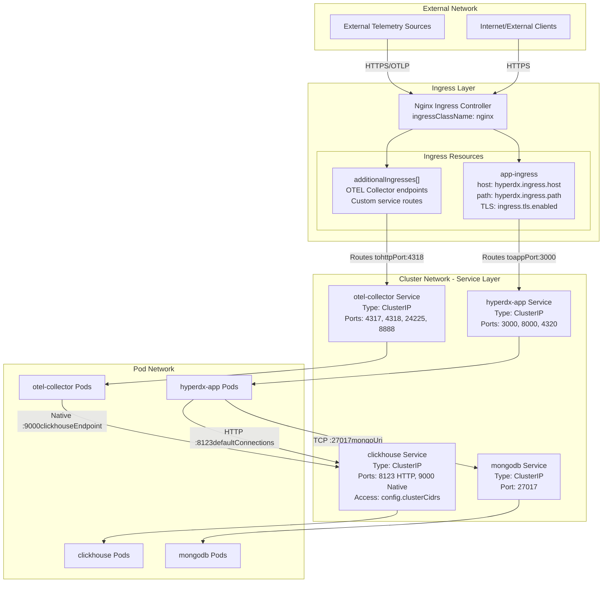
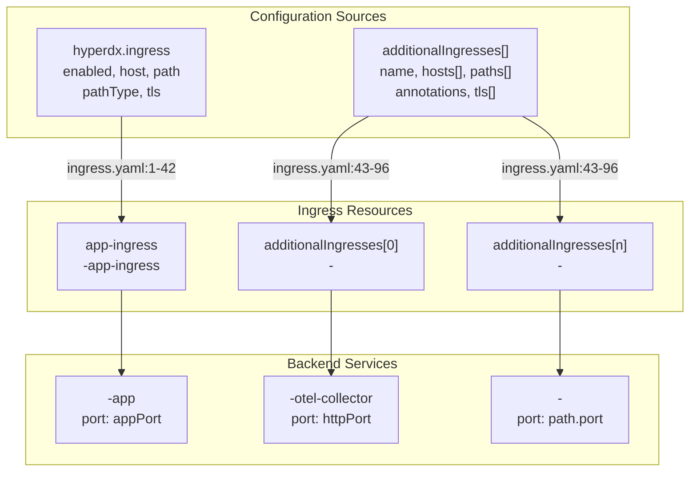
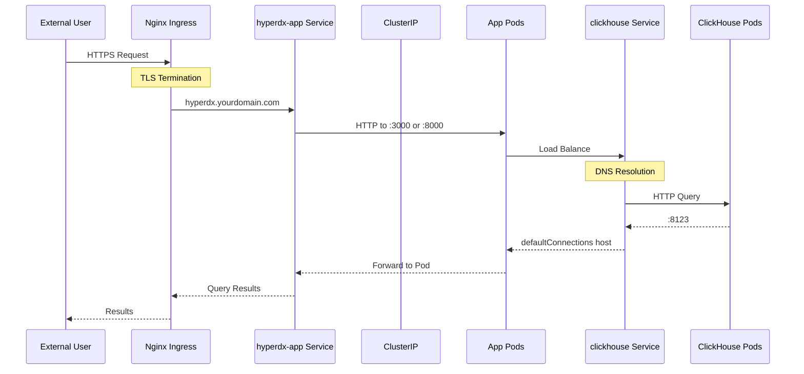
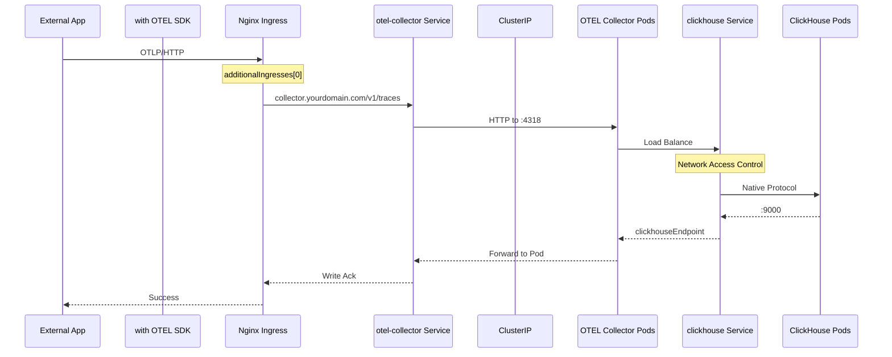

# Networking and Security

> **Relevant source files**
> * [README.md](https://github.com/hyperdxio/helm-charts/blob/845dd482/README.md)
> * [charts/hdx-oss-v2/templates/ingress.yaml](https://github.com/hyperdxio/helm-charts/blob/845dd482/charts/hdx-oss-v2/templates/ingress.yaml)
> * [charts/hdx-oss-v2/tests/ingress_test.yaml](https://github.com/hyperdxio/helm-charts/blob/845dd482/charts/hdx-oss-v2/tests/ingress_test.yaml)
> * [charts/hdx-oss-v2/values.yaml](https://github.com/hyperdxio/helm-charts/blob/845dd482/charts/hdx-oss-v2/values.yaml)

This page provides an overview of the networking architecture and security features in the HyperDX Helm chart deployment. It covers service discovery, network access patterns, ingress configuration, and security mechanisms including API keys, secrets management, and network access control.

For detailed information on specific topics:

* Service types, ports, and internal DNS resolution: see [Service Architecture](/hyperdxio/helm-charts/7.1-service-architecture)
* Ingress setup, TLS configuration, and external access patterns: see [Ingress and External Access](/hyperdxio/helm-charts/7.2-ingress-and-external-access)
* API keys, secrets, ClickHouse access control, and image pull secrets: see [Security Configuration](/hyperdxio/helm-charts/7.3-security-configuration)

## Network Architecture Overview

The HyperDX deployment follows a security-first network architecture where all internal services use `ClusterIP` service types and external access is exclusively controlled through Ingress resources. This design ensures that database and collector services are not directly exposed outside the cluster, requiring explicit ingress configuration for any external connectivity.

**Key Architectural Principles:**

1. **ClusterIP Services**: All services (HyperDX app, ClickHouse, MongoDB, OTEL Collector) default to `ClusterIP` type
2. **Ingress-Based External Access**: User-facing UI/API and optional telemetry endpoints exposed via Ingress
3. **Internal Service Discovery**: Kubernetes DNS enables service-to-service communication using FQDNs
4. **Network Segmentation**: ClickHouse implements network access control via `clusterCidrs`



**Diagram: Complete Network Architecture**

Sources: [charts/hdx-oss-v2/values.yaml L1-L477](https://github.com/hyperdxio/helm-charts/blob/845dd482/charts/hdx-oss-v2/values.yaml#L1-L477)

 [README.md L1-L631](https://github.com/hyperdxio/helm-charts/blob/845dd482/README.md#L1-L631)

## Service Discovery and Internal DNS

Kubernetes provides automatic DNS-based service discovery for all services within the cluster. Services are accessible via short names within the same namespace or fully qualified domain names (FQDNs) across namespaces.

**DNS Resolution Patterns:**

| Service | Short Name | FQDN Format | Example |
| --- | --- | --- | --- |
| HyperDX App | `<release>-hdx-oss-v2-app` | `<release>-hdx-oss-v2-app.<namespace>.svc.cluster.local` | `my-hyperdx-hdx-oss-v2-app.default.svc.cluster.local` |
| ClickHouse | `<release>-hdx-oss-v2-clickhouse` | `<release>-hdx-oss-v2-clickhouse.<namespace>.svc.cluster.local` | `my-hyperdx-hdx-oss-v2-clickhouse.default.svc.cluster.local` |
| OTEL Collector | `<release>-hdx-oss-v2-otel-collector` | `<release>-hdx-oss-v2-otel-collector.<namespace>.svc.cluster.local` | `my-hyperdx-hdx-oss-v2-otel-collector.default.svc.cluster.local` |
| MongoDB | `<release>-hdx-oss-v2-mongodb` | `<release>-hdx-oss-v2-mongodb.<namespace>.svc.cluster.local` | `my-hyperdx-hdx-oss-v2-mongodb.default.svc.cluster.local` |

**Default Connection Configuration:**

The chart uses Helm template functions to construct service endpoints dynamically:

* **MongoDB URI**: `mongodb://{{ include "hdx-oss.fullname" . }}-mongodb:{{ .Values.mongodb.port }}/hyperdx` [charts/hdx-oss-v2/values.yaml L61](https://github.com/hyperdxio/helm-charts/blob/845dd482/charts/hdx-oss-v2/values.yaml#L61-L61)
* **ClickHouse Host**: `http://{{ include "hdx-oss.fullname" . }}-clickhouse:8123` [charts/hdx-oss-v2/values.yaml L96](https://github.com/hyperdxio/helm-charts/blob/845dd482/charts/hdx-oss-v2/values.yaml#L96-L96)
* **OTEL Exporter**: `http://{{ include "hdx-oss.fullname" . }}-otel-collector:{{ .Values.otel.httpPort }}` [charts/hdx-oss-v2/values.yaml L60](https://github.com/hyperdxio/helm-charts/blob/845dd482/charts/hdx-oss-v2/values.yaml#L60-L60)

**Cloud Provider Consideration - GKE LoadBalancer Issue:**

On Google Kubernetes Engine (GKE), LoadBalancer services may cause DNS resolution to return external IPs instead of cluster-internal IPs, breaking pod-to-pod communication. The workaround is to use FQDNs explicitly:

```yaml
otel:
  opampServerUrl: "http://my-hyperdx-hdx-oss-v2-app.default.svc.cluster.local:4320"
```

Sources: [charts/hdx-oss-v2/values.yaml L60-L440](https://github.com/hyperdxio/helm-charts/blob/845dd482/charts/hdx-oss-v2/values.yaml#L60-L440)

 [README.md L531-L549](https://github.com/hyperdxio/helm-charts/blob/845dd482/README.md#L531-L549)

## Port Architecture

Each service exposes multiple ports for different protocols and purposes:

### HyperDX Application Service

| Port | Name | Protocol | Purpose | Configuration Key |
| --- | --- | --- | --- | --- |
| 3000 | `app` | HTTP | UI/Frontend | `hyperdx.appPort` |
| 8000 | `api` | HTTP | API Server | `hyperdx.apiPort` |
| 4320 | `opamp` | HTTP | OpAMP Server for OTEL Collector management | `hyperdx.opampPort` |

### OpenTelemetry Collector Service

| Port | Name | Protocol | Purpose | Configuration Key |
| --- | --- | --- | --- | --- |
| 4317 | `grpc` | gRPC | OTLP gRPC receiver | `otel.grpcPort` |
| 4318 | `http` | HTTP | OTLP HTTP receiver | `otel.httpPort` |
| 24225 | `native` | TCP | Fluentd forward protocol | `otel.nativePort` |
| 8888 | `health` | HTTP | Health check and metrics | `otel.healthPort` |
| 13133 | `port` | HTTP | Extension health check | `otel.port` |

### ClickHouse Service

| Port | Name | Protocol | Purpose | Configuration Key |
| --- | --- | --- | --- | --- |
| 8123 | `http` | HTTP | HTTP interface for queries | `clickhouse.port` |
| 9000 | `native` | TCP | Native protocol for data insertion | `clickhouse.nativePort` |
| 9363 | `prometheus` | HTTP | Prometheus metrics endpoint | `clickhouse.prometheus.port` |

### MongoDB Service

| Port | Name | Protocol | Purpose | Configuration Key |
| --- | --- | --- | --- | --- |
| 27017 | `mongo` | TCP | MongoDB wire protocol | `mongodb.port` |

Sources: [charts/hdx-oss-v2/values.yaml L48-L404](https://github.com/hyperdxio/helm-charts/blob/845dd482/charts/hdx-oss-v2/values.yaml#L48-L404)

## Ingress Configuration Patterns

The chart provides flexible ingress configuration through a primary app ingress and optional additional ingresses for exposing other services like the OTEL Collector.



**Diagram: Ingress Configuration Structure**

### Main Application Ingress

The primary ingress routes traffic to the HyperDX UI and API:

**Key Configuration:**

* **Enabled**: `hyperdx.ingress.enabled` [charts/hdx-oss-v2/values.yaml L208](https://github.com/hyperdxio/helm-charts/blob/845dd482/charts/hdx-oss-v2/values.yaml#L208-L208)
* **Ingress Class**: `hyperdx.ingress.ingressClassName` (default: `nginx`) [charts/hdx-oss-v2/values.yaml L209](https://github.com/hyperdxio/helm-charts/blob/845dd482/charts/hdx-oss-v2/values.yaml#L209-L209)
* **Host**: `hyperdx.ingress.host` [charts/hdx-oss-v2/values.yaml L212](https://github.com/hyperdxio/helm-charts/blob/845dd482/charts/hdx-oss-v2/values.yaml#L212-L212)
* **Path**: `hyperdx.ingress.path` (default: `"/(.*)"`) [charts/hdx-oss-v2/values.yaml L213](https://github.com/hyperdxio/helm-charts/blob/845dd482/charts/hdx-oss-v2/values.yaml#L213-L213)
* **Path Type**: `hyperdx.ingress.pathType` (default: `"ImplementationSpecific"`) [charts/hdx-oss-v2/values.yaml L214](https://github.com/hyperdxio/helm-charts/blob/845dd482/charts/hdx-oss-v2/values.yaml#L214-L214)

**Nginx-Specific Annotations:**

When `ingressClassName` is `nginx`, the chart automatically applies required annotations:

```
nginx.ingress.kubernetes.io/rewrite-target: "/$1"
nginx.ingress.kubernetes.io/use-regex: "true"
nginx.ingress.kubernetes.io/proxy-body-size: "100m"
nginx.ingress.kubernetes.io/proxy-connect-timeout: "60"
nginx.ingress.kubernetes.io/proxy-send-timeout: "60"
nginx.ingress.kubernetes.io/proxy-read-timeout: "60"
```

Sources: [charts/hdx-oss-v2/templates/ingress.yaml L10-L22](https://github.com/hyperdxio/helm-charts/blob/845dd482/charts/hdx-oss-v2/templates/ingress.yaml#L10-L22)

 [charts/hdx-oss-v2/values.yaml L207-L221](https://github.com/hyperdxio/helm-charts/blob/845dd482/charts/hdx-oss-v2/values.yaml#L207-L221)

### Additional Ingresses

The `additionalIngresses` array allows exposing other services through separate ingress resources. This is commonly used to expose OTEL Collector endpoints for external telemetry submission:

**Configuration Structure:**

```yaml
hyperdx:
  ingress:
    additionalIngresses:
      - name: "otel-collector"  # Required: becomes <release>-otel-collector
        ingressClassName: "nginx"
        annotations:
          custom.annotation/key: "value"
        hosts:
          - host: "collector.example.com"
            paths:
              - path: "/v1/(traces|metrics|logs)"
                pathType: "Prefix"
                port: 4318  # otel.httpPort
                name: "otel-collector"  # Optional: service name suffix
        tls:
          - secretName: "collector-tls"
            hosts:
              - "collector.example.com"
```

**Path Configuration:**

Each path in `additionalIngresses` must specify:

* `path`: URL path pattern (validated at [charts/hdx-oss-v2/templates/ingress.yaml L83-L85](https://github.com/hyperdxio/helm-charts/blob/845dd482/charts/hdx-oss-v2/templates/ingress.yaml#L83-L85) )
* `pathType`: Kubernetes path matching type (`Prefix`, `Exact`, `ImplementationSpecific`)
* `port`: Target service port number
* `name` (optional): Service name suffix; if omitted, uses base release name

The backend service name is constructed as: `{{ include "hdx-oss.fullname" $ }}-{{ .name }}` when `name` is provided, otherwise just `{{ include "hdx-oss.fullname" $ }}` [charts/hdx-oss-v2/templates/ingress.yaml L90](https://github.com/hyperdxio/helm-charts/blob/845dd482/charts/hdx-oss-v2/templates/ingress.yaml#L90-L90)

Sources: [charts/hdx-oss-v2/values.yaml L223-L239](https://github.com/hyperdxio/helm-charts/blob/845dd482/charts/hdx-oss-v2/values.yaml#L223-L239)

 [charts/hdx-oss-v2/templates/ingress.yaml L43-L96](https://github.com/hyperdxio/helm-charts/blob/845dd482/charts/hdx-oss-v2/templates/ingress.yaml#L43-L96)

 [charts/hdx-oss-v2/tests/ingress_test.yaml L211-L627](https://github.com/hyperdxio/helm-charts/blob/845dd482/charts/hdx-oss-v2/tests/ingress_test.yaml#L211-L627)

## Security Features

### Service Type Security

All services default to `ClusterIP` type, ensuring they are only accessible within the cluster network:

* **HyperDX App**: `hyperdx.service.type: ClusterIP` [charts/hdx-oss-v2/values.yaml L248](https://github.com/hyperdxio/helm-charts/blob/845dd482/charts/hdx-oss-v2/values.yaml#L248-L248)
* **ClickHouse**: `clickhouse.service.type: ClusterIP` [charts/hdx-oss-v2/values.yaml L338](https://github.com/hyperdxio/helm-charts/blob/845dd482/charts/hdx-oss-v2/values.yaml#L338-L338)

This prevents accidental exposure of database services and requires explicit ingress configuration for external access, following security best practices.

### API Key Management

The HyperDX application requires an API key for telemetry data collection. The API key is configured via `hyperdx.apiKey` and stored in a Kubernetes Secret named `<release>-app-secrets`.

**Configuration:**

```yaml
hyperdx:
  apiKey: "xxxxxxxx-xxxx-xxxx-xxxx-xxxxxxxxxxxx"
```

The default value is a placeholder that should be replaced after initial deployment. The API key can be retrieved from the HyperDX Team settings UI and updated via Helm upgrade.

Sources: [charts/hdx-oss-v2/values.yaml L48](https://github.com/hyperdxio/helm-charts/blob/845dd482/charts/hdx-oss-v2/values.yaml#L48-L48)

 [README.md L236-L273](https://github.com/hyperdxio/helm-charts/blob/845dd482/README.md#L236-L273)

### Secrets Management

The chart supports multiple secret management patterns:

**1. Inline Configuration (Development)**

Default pattern where secrets are specified directly in `values.yaml`:

```yaml
hyperdx:
  apiKey: "my-api-key"
  
clickhouse:
  config:
    users:
      appUserPassword: "hyperdx"
      otelUserPassword: "otelcollectorpass"
```

**2. External Kubernetes Secrets (Production)**

For production deployments, use `useExistingConfigSecret` to reference pre-created secrets:

```yaml
hyperdx:
  useExistingConfigSecret: true
  existingConfigSecret: "hyperdx-external-config"
  existingConfigConnectionsKey: "connections.json"
  existingConfigSourcesKey: "sources.json"
```

This separates sensitive data from Helm values and enables integration with external secret management systems (HashiCorp Vault, AWS Secrets Manager, etc.).

Sources: [charts/hdx-oss-v2/values.yaml L77-L358](https://github.com/hyperdxio/helm-charts/blob/845dd482/charts/hdx-oss-v2/values.yaml#L77-L358)

 [README.md L98-L323](https://github.com/hyperdxio/helm-charts/blob/845dd482/README.md#L98-L323)

### ClickHouse Network Access Control

ClickHouse implements network-level access control using the `clusterCidrs` configuration. This restricts connections to specific IP ranges, typically the Kubernetes pod network CIDR:

**Default Configuration:**

```yaml
clickhouse:
  config:
    clusterCidrs:
      - "10.0.0.0/8"      # Most Kubernetes clusters (GKE, EKS, AKS)
      - "172.16.0.0/12"   # Docker Desktop, some cloud providers
      - "192.168.0.0/16"  # OrbStack, Minikube, local development
```

**Production Hardening:**

For production deployments, remove development CIDRs and specify only your cluster's pod network CIDR. Cloud provider examples:

* **GKE**: `10.8.0.0/16` or custom VPC CIDR
* **EKS**: `192.168.0.0/16` or custom VPC CIDR
* **AKS**: `10.244.0.0/16` or custom VNET CIDR

The `clusterCidrs` are rendered into the ClickHouse users configuration, creating network-restricted user profiles.

Sources: [charts/hdx-oss-v2/values.yaml L359-L366](https://github.com/hyperdxio/helm-charts/blob/845dd482/charts/hdx-oss-v2/values.yaml#L359-L366)

 [README.md L552-L609](https://github.com/hyperdxio/helm-charts/blob/845dd482/README.md#L552-L609)

### Image Pull Secrets

To avoid Docker Hub rate limiting and access private registries, configure image pull secrets:

```yaml
global:
  imagePullSecrets:
    - name: regcred
    - name: docker-hub-secret
```

These secrets must be pre-created in the target namespace using `kubectl create secret docker-registry`.

Sources: [charts/hdx-oss-v2/values.yaml L2-L9](https://github.com/hyperdxio/helm-charts/blob/845dd482/charts/hdx-oss-v2/values.yaml#L2-L9)

## TLS and HTTPS Configuration

### Main Ingress TLS

Enable TLS for the main application ingress:

```yaml
hyperdx:
  frontendUrl: "https://hyperdx.yourdomain.com"  # Must match protocol
  ingress:
    enabled: true
    host: "hyperdx.yourdomain.com"
    tls:
      enabled: true
      secretName: "hyperdx-tls"  # Kubernetes TLS secret
```

When TLS is enabled, the chart automatically adds SSL redirect annotations for Nginx:

```
nginx.ingress.kubernetes.io/ssl-redirect: "true"
nginx.ingress.kubernetes.io/force-ssl-redirect: "true"
```

Sources: [charts/hdx-oss-v2/values.yaml L219-L221](https://github.com/hyperdxio/helm-charts/blob/845dd482/charts/hdx-oss-v2/values.yaml#L219-L221)

 [charts/hdx-oss-v2/templates/ingress.yaml L18-L21](https://github.com/hyperdxio/helm-charts/blob/845dd482/charts/hdx-oss-v2/templates/ingress.yaml#L18-L21)

 [README.md L367-L388](https://github.com/hyperdxio/helm-charts/blob/845dd482/README.md#L367-L388)

### Additional Ingress TLS

Each additional ingress can have independent TLS configuration:

```yaml
hyperdx:
  ingress:
    additionalIngresses:
      - name: otel-collector
        hosts:
          - host: "collector.example.com"
            paths:
              - path: "/v1/(traces|metrics|logs)"
                pathType: "Prefix"
                port: 4318
        tls:
          - secretName: "collector-tls"
            hosts:
              - "collector.example.com"
```

The TLS configuration is validated to ensure `hosts` property is present [charts/hdx-oss-v2/templates/ingress.yaml L64-L67](https://github.com/hyperdxio/helm-charts/blob/845dd482/charts/hdx-oss-v2/templates/ingress.yaml#L64-L67)

Sources: [charts/hdx-oss-v2/templates/ingress.yaml L62-L76](https://github.com/hyperdxio/helm-charts/blob/845dd482/charts/hdx-oss-v2/templates/ingress.yaml#L62-L76)

 [charts/hdx-oss-v2/tests/ingress_test.yaml L301-L402](https://github.com/hyperdxio/helm-charts/blob/845dd482/charts/hdx-oss-v2/tests/ingress_test.yaml#L301-L402)

## Network Traffic Flow



**Diagram: User Request Flow through Network Layers**



**Diagram: Telemetry Data Ingestion Flow**

Sources: [charts/hdx-oss-v2/values.yaml L1-L477](https://github.com/hyperdxio/helm-charts/blob/845dd482/charts/hdx-oss-v2/values.yaml#L1-L477)

 [charts/hdx-oss-v2/templates/ingress.yaml L1-L97](https://github.com/hyperdxio/helm-charts/blob/845dd482/charts/hdx-oss-v2/templates/ingress.yaml#L1-L97)

## Network Security Best Practices

### Production Deployment Checklist

1. **Service Types**: Verify all services use `ClusterIP` type [charts/hdx-oss-v2/values.yaml L248-L338](https://github.com/hyperdxio/helm-charts/blob/845dd482/charts/hdx-oss-v2/values.yaml#L248-L338)
2. **ClickHouse Access Control**: Configure production-specific `clusterCidrs` [charts/hdx-oss-v2/values.yaml L363-L366](https://github.com/hyperdxio/helm-charts/blob/845dd482/charts/hdx-oss-v2/values.yaml#L363-L366)
3. **TLS Configuration**: Enable TLS for all ingresses with valid certificates [charts/hdx-oss-v2/values.yaml L219-L221](https://github.com/hyperdxio/helm-charts/blob/845dd482/charts/hdx-oss-v2/values.yaml#L219-L221)
4. **External Secrets**: Use `useExistingConfigSecret` instead of inline credentials [charts/hdx-oss-v2/values.yaml L87-L90](https://github.com/hyperdxio/helm-charts/blob/845dd482/charts/hdx-oss-v2/values.yaml#L87-L90)
5. **Image Pull Secrets**: Configure to avoid rate limiting [charts/hdx-oss-v2/values.yaml L9](https://github.com/hyperdxio/helm-charts/blob/845dd482/charts/hdx-oss-v2/values.yaml#L9-L9)
6. **Frontend URL**: Match `frontendUrl` with ingress host and protocol [charts/hdx-oss-v2/values.yaml L56](https://github.com/hyperdxio/helm-charts/blob/845dd482/charts/hdx-oss-v2/values.yaml#L56-L56)
7. **OpAMP FQDN**: Use FQDN for `opampServerUrl` on GKE [charts/hdx-oss-v2/values.yaml L440](https://github.com/hyperdxio/helm-charts/blob/845dd482/charts/hdx-oss-v2/values.yaml#L440-L440)

### Network Isolation Patterns

The architecture enforces multiple layers of network isolation:

1. **Ingress Layer**: Only explicitly configured paths exposed externally
2. **Service Layer**: ClusterIP prevents direct external access
3. **Pod Network**: Kubernetes NetworkPolicies can be added for additional isolation
4. **Application Layer**: ClickHouse user-based access control and CIDR restrictions

### Common Security Misconfigurations

| Misconfiguration | Risk | Solution |
| --- | --- | --- |
| Using `LoadBalancer` service type | Exposes database ports publicly | Use `ClusterIP` and Ingress |
| Default API key | Compromised telemetry collection | Update `hyperdx.apiKey` post-deployment |
| Broad `clusterCidrs` in production | Allows non-cluster connections | Specify exact pod network CIDR |
| HTTP-only ingress | Unencrypted traffic | Enable `ingress.tls.enabled` |
| Inline credentials | Secrets in version control | Use `useExistingConfigSecret` |

Sources: [charts/hdx-oss-v2/values.yaml L248-L366](https://github.com/hyperdxio/helm-charts/blob/845dd482/charts/hdx-oss-v2/values.yaml#L248-L366)

 [README.md L610-L624](https://github.com/hyperdxio/helm-charts/blob/845dd482/README.md#L610-L624)