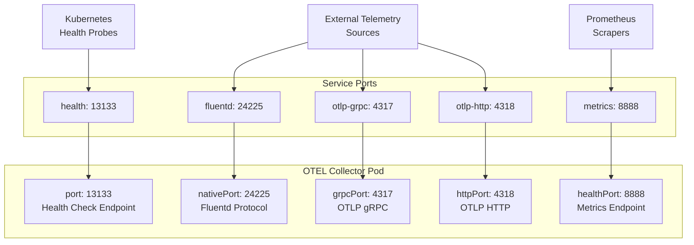
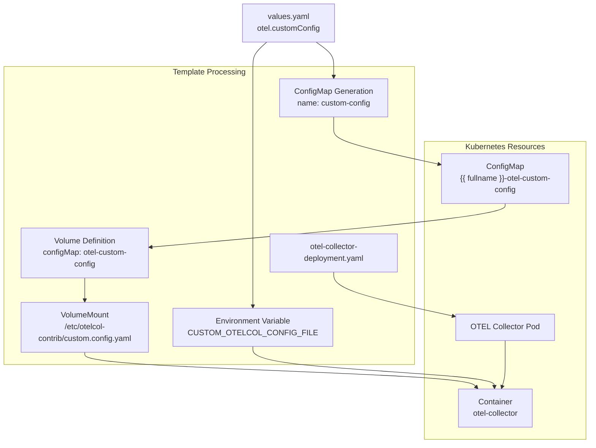

# OpenTelemetry Collector Configuration

> **Relevant source files**
> * [charts/hdx-oss-v2/templates/otel-collector-deployment.yaml](https://github.com/hyperdxio/helm-charts/blob/845dd482/charts/hdx-oss-v2/templates/otel-collector-deployment.yaml)
> * [charts/hdx-oss-v2/tests/otel-collector_test.yaml](https://github.com/hyperdxio/helm-charts/blob/845dd482/charts/hdx-oss-v2/tests/otel-collector_test.yaml)
> * [charts/hdx-oss-v2/values.yaml](https://github.com/hyperdxio/helm-charts/blob/845dd482/charts/hdx-oss-v2/values.yaml)

This page documents the configuration options for the OpenTelemetry Collector component in the HyperDX Helm chart. The OTEL Collector is responsible for receiving telemetry data (logs, traces, metrics) from external sources and forwarding it to ClickHouse for storage.

For detailed information about the OTEL Collector's internal architecture and data processing pipeline, see [Component Deep Dives - OpenTelemetry Collector](/hyperdxio/helm-charts/5.3-opentelemetry-collector). For information about ingress configuration to expose OTEL endpoints externally, see [Ingress Configuration](/hyperdxio/helm-charts/3.6-ingress-configuration).

## Overview

The OpenTelemetry Collector deployment is configured through the `otel` section in `values.yaml`. The collector can be enabled or disabled entirely, allowing for deployment scenarios where an external OTEL Collector is used instead.

**Sources:** [charts/hdx-oss-v2/values.yaml L368-L464](https://github.com/hyperdxio/helm-charts/blob/845dd482/charts/hdx-oss-v2/values.yaml#L368-L464)

## Enabling and Disabling

The OTEL Collector is enabled by default. To disable it (for example, when using an external collector), set:

```yaml
otel:
  enabled: false
```

When disabled, no OTEL Collector resources are created. The HyperDX application must be configured to point to an external collector using `hyperdx.otelExporterEndpoint`.

**Sources:** [charts/hdx-oss-v2/values.yaml L405](https://github.com/hyperdxio/helm-charts/blob/845dd482/charts/hdx-oss-v2/values.yaml#L405-L405)

 [charts/hdx-oss-v2/templates/otel-collector-deployment.yaml L1](https://github.com/hyperdxio/helm-charts/blob/845dd482/charts/hdx-oss-v2/templates/otel-collector-deployment.yaml#L1-L1)

## Container Image Configuration

### Image Repository and Tag

```yaml
otel:
  image:
    repository: docker.hyperdx.io/hyperdx/hyperdx-otel-collector
    tag: ""  # Defaults to Chart.AppVersion if empty
    pullPolicy: IfNotPresent
```

The `tag` field defaults to the chart's `appVersion` when left empty. This ensures the OTEL Collector version stays synchronized with the HyperDX application version.

**Sources:** [charts/hdx-oss-v2/values.yaml L369-L372](https://github.com/hyperdxio/helm-charts/blob/845dd482/charts/hdx-oss-v2/values.yaml#L369-L372)

 [charts/hdx-oss-v2/templates/otel-collector-deployment.yaml L47](https://github.com/hyperdxio/helm-charts/blob/845dd482/charts/hdx-oss-v2/templates/otel-collector-deployment.yaml#L47-L47)

## Port Configuration

The OTEL Collector exposes multiple ports for different protocols and purposes:



### Port Definitions

| Configuration Key | Default | Service Name | Purpose |
| --- | --- | --- | --- |
| `otel.port` | 13133 | health | Health check endpoint for liveness/readiness probes |
| `otel.nativePort` | 24225 | fluentd | Fluentd forward protocol receiver |
| `otel.grpcPort` | 4317 | otlp-grpc | OTLP gRPC protocol receiver |
| `otel.httpPort` | 4318 | otlp-http | OTLP HTTP protocol receiver |
| `otel.healthPort` | 8888 | metrics | Prometheus metrics export endpoint |

**Sources:** [charts/hdx-oss-v2/values.yaml L400-L404](https://github.com/hyperdxio/helm-charts/blob/845dd482/charts/hdx-oss-v2/values.yaml#L400-L404)

 [charts/hdx-oss-v2/templates/otel-collector-deployment.yaml L49-L54](https://github.com/hyperdxio/helm-charts/blob/845dd482/charts/hdx-oss-v2/templates/otel-collector-deployment.yaml#L49-L54)

 [charts/hdx-oss-v2/templates/otel-collector-deployment.yaml L125-L140](https://github.com/hyperdxio/helm-charts/blob/845dd482/charts/hdx-oss-v2/templates/otel-collector-deployment.yaml#L125-L140)

## Replica Configuration

```yaml
otel:
  replicas: 1
```

The number of OTEL Collector pod replicas. For high-availability deployments, increase this value. Note that the OTEL Collector should be stateless, making horizontal scaling straightforward.

**Sources:** [charts/hdx-oss-v2/values.yaml L373](https://github.com/hyperdxio/helm-charts/blob/845dd482/charts/hdx-oss-v2/values.yaml#L373-L373)

 [charts/hdx-oss-v2/templates/otel-collector-deployment.yaml L10](https://github.com/hyperdxio/helm-charts/blob/845dd482/charts/hdx-oss-v2/templates/otel-collector-deployment.yaml#L10-L10)

## Environment Variables and Connection Settings

The OTEL Collector deployment uses several environment variables to configure connections to dependent services. The template automatically generates these from values or uses sensible defaults.

```mermaid
flowchart TD

V1["otel.clickhouseEndpoint"]
V2["otel.clickhouseUser"]
V3["otel.clickhousePassword"]
V4["otel.opampServerUrl"]
V5["otel.clickhousePrometheusEndpoint"]
V6["otel.clickhouseDatabase"]
V7["otel.env[]"]
T1["Default Generation:<br>{{ include hdx-oss.fullname . }}-clickhouse:9000"]
T2["Default: clickhouse.config.users.otelUserName"]
T3["Default: clickhouse.config.users.otelUserPassword"]
T4["Default: {{ include hdx-oss.fullname . }}-app:4320"]
E1["CLICKHOUSE_ENDPOINT"]
E2["CLICKHOUSE_SERVER_ENDPOINT"]
E3["CLICKHOUSE_USER"]
E4["CLICKHOUSE_PASSWORD"]
E5["OPAMP_SERVER_URL"]
E6["CLICKHOUSE_PROMETHEUS_METRICS_ENDPOINT"]
E7["HYPERDX_OTEL_EXPORTER_CLICKHOUSE_DATABASE"]
E8["HYPERDX_LOG_LEVEL"]
E9["HYPERDX_API_KEY"]
E10["Custom Variables"]

V1 --> E1
T1 --> E1
V1 --> E2
T1 --> E2
V2 --> E3
T2 --> E3
V3 --> E4
T3 --> E4
V4 --> E5
T4 --> E5
V5 --> E6
V6 --> E7
V7 --> E10

subgraph subGraph2 ["Environment Variables"]
    E1
    E2
    E3
    E4
    E5
    E6
    E7
    E8
    E9
    E10
end

subgraph subGraph1 ["Template Logic"]
    T1
    T2
    T3
    T4
end

subgraph values.yaml ["values.yaml"]
    V1
    V2
    V3
    V4
    V5
    V6
    V7
end
```



### ClickHouse Connection Configuration

```yaml
otel:
  clickhouseEndpoint: ""  # Defaults to internal service
  clickhouseUser: ""      # Defaults to otelcollector
  clickhousePassword: ""  # Defaults to clickhouse.config.users.otelUserPassword
  clickhouseDatabase: "default"
```

**Environment Variable Mapping:**

* `CLICKHOUSE_ENDPOINT`: Generated as `tcp://<service>:<port>?dial_timeout=10s` format
* `CLICKHOUSE_SERVER_ENDPOINT`: Service hostname without protocol
* `CLICKHOUSE_USER`: Username for ClickHouse authentication
* `CLICKHOUSE_PASSWORD`: Password for ClickHouse authentication
* `HYPERDX_OTEL_EXPORTER_CLICKHOUSE_DATABASE`: Target database name

When `clickhouseEndpoint` is empty, the template generates:

```
tcp://{{ include "hdx-oss.fullname" . }}-clickhouse:{{ .Values.clickhouse.nativePort }}?dial_timeout=10s
```

**Sources:** [charts/hdx-oss-v2/values.yaml L441-L452](https://github.com/hyperdxio/helm-charts/blob/845dd482/charts/hdx-oss-v2/values.yaml#L441-L452)

 [charts/hdx-oss-v2/templates/otel-collector-deployment.yaml L80-L102](https://github.com/hyperdxio/helm-charts/blob/845dd482/charts/hdx-oss-v2/templates/otel-collector-deployment.yaml#L80-L102)

### ClickHouse Prometheus Endpoint

```yaml
otel:
  clickhousePrometheusEndpoint: ""
```

When `clickhouse.prometheus.enabled` is `true`, this environment variable is automatically set:

```html
CLICKHOUSE_PROMETHEUS_METRICS_ENDPOINT: <service>:<port>
```

Default format when empty: `{{ include "hdx-oss.fullname" . }}-clickhouse:{{ .Values.clickhouse.prometheus.port }}`

**Sources:** [charts/hdx-oss-v2/values.yaml L447-L450](https://github.com/hyperdxio/helm-charts/blob/845dd482/charts/hdx-oss-v2/values.yaml#L447-L450)

 [charts/hdx-oss-v2/templates/otel-collector-deployment.yaml L84-L87](https://github.com/hyperdxio/helm-charts/blob/845dd482/charts/hdx-oss-v2/templates/otel-collector-deployment.yaml#L84-L87)

### OpAMP Server Configuration

```yaml
otel:
  opampServerUrl: ""
```

The OpAMP (Open Agent Management Protocol) server URL for dynamic collector configuration. When empty, defaults to the HyperDX application's OpAMP port:

```
http://{{ include "hdx-oss.fullname" . }}-app:{{ .Values.hyperdx.opampPort }}
```

Set a custom URL to use an external OpAMP server:

```yaml
otel:
  opampServerUrl: "http://custom-opamp-server:4320"
```

**Sources:** [charts/hdx-oss-v2/values.yaml L437-L440](https://github.com/hyperdxio/helm-charts/blob/845dd482/charts/hdx-oss-v2/values.yaml#L437-L440)

 [charts/hdx-oss-v2/templates/otel-collector-deployment.yaml L88-L89](https://github.com/hyperdxio/helm-charts/blob/845dd482/charts/hdx-oss-v2/templates/otel-collector-deployment.yaml#L88-L89)

### Additional Environment Variables

```yaml
otel:
  env:
    - name: CUSTOM_VAR
      value: "my-value"
    - name: SECRET_VAR
      valueFrom:
        secretKeyRef:
          name: my-secret
          key: secret-key
```

Custom environment variables can be added to the OTEL Collector container. Both literal values and references to secrets/configmaps are supported.

**Sources:** [charts/hdx-oss-v2/values.yaml L406-L416](https://github.com/hyperdxio/helm-charts/blob/845dd482/charts/hdx-oss-v2/values.yaml#L406-L416)

 [charts/hdx-oss-v2/templates/otel-collector-deployment.yaml L107-L109](https://github.com/hyperdxio/helm-charts/blob/845dd482/charts/hdx-oss-v2/templates/otel-collector-deployment.yaml#L107-L109)

### Standard Environment Variables

The following environment variables are always set:

| Variable | Source | Description |
| --- | --- | --- |
| `HYPERDX_LOG_LEVEL` | `hyperdx.logLevel` | Log verbosity level |
| `HYPERDX_API_KEY` | Secret reference | API key from app-secrets |

**Sources:** [charts/hdx-oss-v2/templates/otel-collector-deployment.yaml L90-L98](https://github.com/hyperdxio/helm-charts/blob/845dd482/charts/hdx-oss-v2/templates/otel-collector-deployment.yaml#L90-L98)

## Custom Configuration File

The OTEL Collector supports loading a custom configuration file that can extend or override the default collector pipeline configuration.

```yaml
otel:
  customConfig: |
    receivers:
      hostmetrics:
        collection_interval: 5s
        scrapers:
          cpu:
          load:
          memory:
    service:
      pipelines:
        metrics/hostmetrics:
          receivers: [hostmetrics]
          processors: [memory_limiter, batch]
          exporters: [clickhouse]
```

When `customConfig` is set:

1. A ConfigMap named `<release>-otel-custom-config` is created containing the configuration
2. The ConfigMap is mounted at `/etc/otelcol-contrib/custom.config.yaml`
3. The environment variable `CUSTOM_OTELCOL_CONFIG_FILE` points to this file



**Sources:** [charts/hdx-oss-v2/values.yaml L417-L436](https://github.com/hyperdxio/helm-charts/blob/845dd482/charts/hdx-oss-v2/values.yaml#L417-L436)

 [charts/hdx-oss-v2/templates/otel-collector-deployment.yaml L39-L44](https://github.com/hyperdxio/helm-charts/blob/845dd482/charts/hdx-oss-v2/templates/otel-collector-deployment.yaml#L39-L44)

 [charts/hdx-oss-v2/templates/otel-collector-deployment.yaml L103-L116](https://github.com/hyperdxio/helm-charts/blob/845dd482/charts/hdx-oss-v2/templates/otel-collector-deployment.yaml#L103-L116)

## Resource Allocation

```yaml
otel:
  resources:
    requests:
      memory: "127Mi"
      cpu: "100m"
    limits:
      memory: "256Mi"
      cpu: "200m"
```

Kubernetes resource requests and limits for the OTEL Collector pod. When not specified, no resource constraints are applied.

Resource configuration is optional but recommended for production deployments to ensure:

* Guaranteed minimum resources (requests)
* Prevention of resource exhaustion (limits)
* Proper pod scheduling by Kubernetes

**Sources:** [charts/hdx-oss-v2/values.yaml L374-L382](https://github.com/hyperdxio/helm-charts/blob/845dd482/charts/hdx-oss-v2/values.yaml#L374-L382)

 [charts/hdx-oss-v2/templates/otel-collector-deployment.yaml L55-L58](https://github.com/hyperdxio/helm-charts/blob/845dd482/charts/hdx-oss-v2/templates/otel-collector-deployment.yaml#L55-L58)

## Health Probes

The OTEL Collector deployment includes configurable liveness and readiness probes.

### Liveness Probe

```yaml
otel:
  livenessProbe:
    enabled: true
    initialDelaySeconds: 10
    periodSeconds: 30
    timeoutSeconds: 5
    failureThreshold: 3
```

The liveness probe performs an HTTP GET request to `http://localhost:<port>/` where `<port>` is the value of `otel.port` (default 13133).

**Sources:** [charts/hdx-oss-v2/values.yaml L453-L458](https://github.com/hyperdxio/helm-charts/blob/845dd482/charts/hdx-oss-v2/values.yaml#L453-L458)

 [charts/hdx-oss-v2/templates/otel-collector-deployment.yaml L59-L68](https://github.com/hyperdxio/helm-charts/blob/845dd482/charts/hdx-oss-v2/templates/otel-collector-deployment.yaml#L59-L68)

### Readiness Probe

```yaml
otel:
  readinessProbe:
    enabled: true
    initialDelaySeconds: 5
    periodSeconds: 10
    timeoutSeconds: 5
    failureThreshold: 3
```

The readiness probe uses the same endpoint as the liveness probe but with different timing parameters to detect when the collector is ready to receive traffic.

**Sources:** [charts/hdx-oss-v2/values.yaml L459-L464](https://github.com/hyperdxio/helm-charts/blob/845dd482/charts/hdx-oss-v2/values.yaml#L459-L464)

 [charts/hdx-oss-v2/templates/otel-collector-deployment.yaml L69-L78](https://github.com/hyperdxio/helm-charts/blob/845dd482/charts/hdx-oss-v2/templates/otel-collector-deployment.yaml#L69-L78)

## Pod Placement and Scheduling

### Node Selector

```yaml
otel:
  nodeSelector:
    kubernetes.io/os: linux
    node-role.kubernetes.io/worker: "true"
```

Constrains the OTEL Collector pods to run on specific nodes based on labels. Empty by default, allowing scheduling on any node.

**Sources:** [charts/hdx-oss-v2/values.yaml L388-L392](https://github.com/hyperdxio/helm-charts/blob/845dd482/charts/hdx-oss-v2/values.yaml#L388-L392)

 [charts/hdx-oss-v2/templates/otel-collector-deployment.yaml L27-L30](https://github.com/hyperdxio/helm-charts/blob/845dd482/charts/hdx-oss-v2/templates/otel-collector-deployment.yaml#L27-L30)

### Tolerations

```yaml
otel:
  tolerations:
    - key: "key1"
      operator: "Equal"
      value: "value1"
      effect: "NoSchedule"
```

Allows the OTEL Collector pods to be scheduled on nodes with matching taints. Empty by default.

**Sources:** [charts/hdx-oss-v2/values.yaml L393-L399](https://github.com/hyperdxio/helm-charts/blob/845dd482/charts/hdx-oss-v2/values.yaml#L393-L399)

 [charts/hdx-oss-v2/templates/otel-collector-deployment.yaml L31-L34](https://github.com/hyperdxio/helm-charts/blob/845dd482/charts/hdx-oss-v2/templates/otel-collector-deployment.yaml#L31-L34)

## Pod Annotations

```yaml
otel:
  annotations:
    prometheus.io/scrape: "true"
    prometheus.io/port: "8888"
    prometheus.io/path: "/metrics"
```

Pod-level annotations that are applied to the OTEL Collector deployment pods. These can be used for service mesh integration, monitoring configuration, or custom metadata.

**Sources:** [charts/hdx-oss-v2/values.yaml L383-L386](https://github.com/hyperdxio/helm-charts/blob/845dd482/charts/hdx-oss-v2/values.yaml#L383-L386)

 [charts/hdx-oss-v2/templates/otel-collector-deployment.yaml L20-L25](https://github.com/hyperdxio/helm-charts/blob/845dd482/charts/hdx-oss-v2/templates/otel-collector-deployment.yaml#L20-L25)

## Image Pull Secrets

Image pull secrets are configured globally and automatically applied to the OTEL Collector deployment:

```yaml
global:
  imagePullSecrets:
    - name: regcred
    - name: docker-hub-secret
```

This helps avoid rate limiting when pulling images from private registries or Docker Hub.

**Sources:** [charts/hdx-oss-v2/templates/otel-collector-deployment.yaml L35-L38](https://github.com/hyperdxio/helm-charts/blob/845dd482/charts/hdx-oss-v2/templates/otel-collector-deployment.yaml#L35-L38)

## Configuration Reference Table

The following table summarizes all OTEL Collector configuration keys:

| Key Path | Type | Default | Description |
| --- | --- | --- | --- |
| `otel.enabled` | boolean | `true` | Enable/disable OTEL Collector deployment |
| `otel.image.repository` | string | `docker.hyperdx.io/hyperdx/hyperdx-otel-collector` | Container image repository |
| `otel.image.tag` | string | `""` (uses `appVersion`) | Container image tag |
| `otel.image.pullPolicy` | string | `IfNotPresent` | Image pull policy |
| `otel.replicas` | integer | `1` | Number of pod replicas |
| `otel.port` | integer | `13133` | Health check endpoint port |
| `otel.nativePort` | integer | `24225` | Fluentd protocol port |
| `otel.grpcPort` | integer | `4317` | OTLP gRPC port |
| `otel.httpPort` | integer | `4318` | OTLP HTTP port |
| `otel.healthPort` | integer | `8888` | Metrics endpoint port |
| `otel.customConfig` | string | `""` | Custom OTEL configuration YAML |
| `otel.opampServerUrl` | string | `""` (auto-generated) | OpAMP server URL |
| `otel.clickhouseEndpoint` | string | `""` (auto-generated) | ClickHouse connection endpoint |
| `otel.clickhouseUser` | string | `""` (uses `otelUserName`) | ClickHouse username |
| `otel.clickhousePassword` | string | `""` (uses `otelUserPassword`) | ClickHouse password |
| `otel.clickhousePrometheusEndpoint` | string | `""` (auto-generated) | ClickHouse Prometheus endpoint |
| `otel.clickhouseDatabase` | string | `default` | Target ClickHouse database |
| `otel.resources` | object | `{}` | Resource requests and limits |
| `otel.annotations` | object | `{}` | Pod annotations |
| `otel.nodeSelector` | object | `{}` | Node selector constraints |
| `otel.tolerations` | array | `[]` | Pod tolerations |
| `otel.env` | array | `[]` | Additional environment variables |
| `otel.livenessProbe.enabled` | boolean | `true` | Enable liveness probe |
| `otel.livenessProbe.initialDelaySeconds` | integer | `10` | Liveness probe initial delay |
| `otel.livenessProbe.periodSeconds` | integer | `30` | Liveness probe period |
| `otel.livenessProbe.timeoutSeconds` | integer | `5` | Liveness probe timeout |
| `otel.livenessProbe.failureThreshold` | integer | `3` | Liveness probe failure threshold |
| `otel.readinessProbe.enabled` | boolean | `true` | Enable readiness probe |
| `otel.readinessProbe.initialDelaySeconds` | integer | `5` | Readiness probe initial delay |
| `otel.readinessProbe.periodSeconds` | integer | `10` | Readiness probe period |
| `otel.readinessProbe.timeoutSeconds` | integer | `5` | Readiness probe timeout |
| `otel.readinessProbe.failureThreshold` | integer | `3` | Readiness probe failure threshold |

**Sources:** [charts/hdx-oss-v2/values.yaml L368-L464](https://github.com/hyperdxio/helm-charts/blob/845dd482/charts/hdx-oss-v2/values.yaml#L368-L464)

## Configuration Examples

### Example 1: Production Configuration with Resource Limits

```yaml
otel:
  enabled: true
  replicas: 3
  resources:
    requests:
      memory: "256Mi"
      cpu: "200m"
    limits:
      memory: "512Mi"
      cpu: "500m"
  annotations:
    prometheus.io/scrape: "true"
    prometheus.io/port: "8888"
  nodeSelector:
    workload-type: telemetry
```

### Example 2: External ClickHouse Configuration

```yaml
otel:
  enabled: true
  clickhouseEndpoint: "tcp://external-clickhouse.example.com:9000"
  clickhouseUser: "otel_user"
  clickhousePassword: "secure_password"
  clickhouseDatabase: "telemetry_data"
```

### Example 3: Custom Configuration with Host Metrics

```yaml
otel:
  enabled: true
  customConfig: |
    receivers:
      hostmetrics:
        collection_interval: 10s
        scrapers:
          cpu:
          disk:
          load:
          filesystem:
          memory:
          network:
          processes:
    
    service:
      pipelines:
        metrics/host:
          receivers: [hostmetrics]
          processors: [batch, memory_limiter]
          exporters: [clickhouse]
```

### Example 4: Disabled for External Collector

```yaml
otel:
  enabled: false

hyperdx:
  otelExporterEndpoint: "http://external-otel-collector.example.com:4318"
```

**Sources:** [charts/hdx-oss-v2/values.yaml L368-L464](https://github.com/hyperdxio/helm-charts/blob/845dd482/charts/hdx-oss-v2/values.yaml#L368-L464)

 [charts/hdx-oss-v2/templates/otel-collector-deployment.yaml L1-L145](https://github.com/hyperdxio/helm-charts/blob/845dd482/charts/hdx-oss-v2/templates/otel-collector-deployment.yaml#L1-L145)