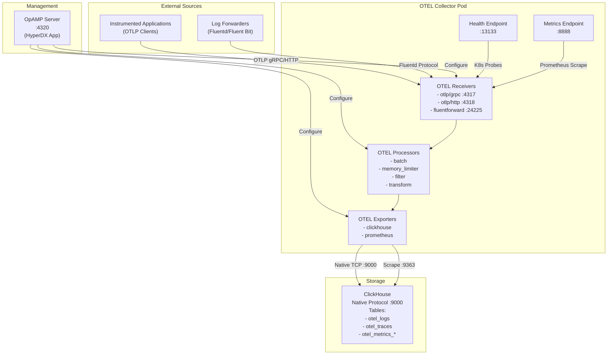
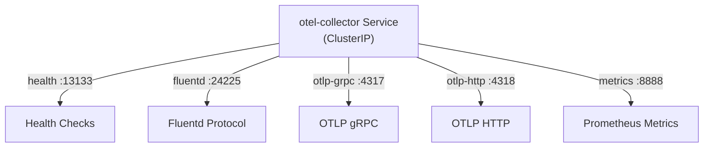
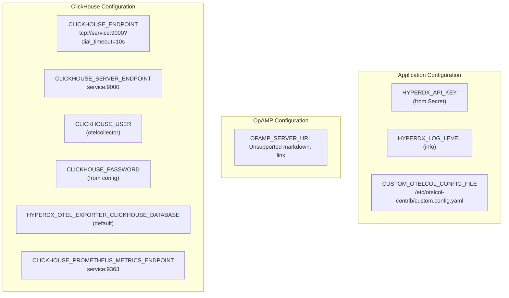
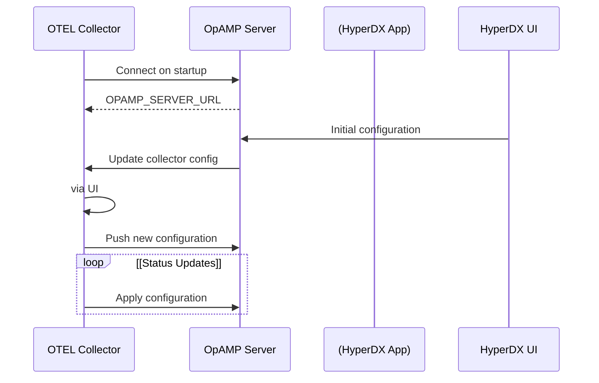
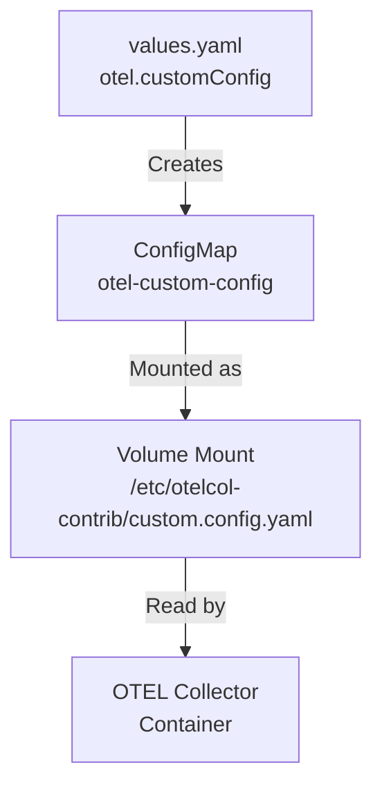
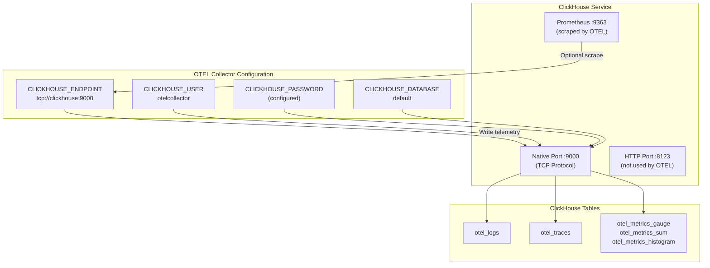

# OpenTelemetry Collector

> **Relevant source files**
> * [charts/hdx-oss-v2/templates/otel-collector-deployment.yaml](https://github.com/hyperdxio/helm-charts/blob/845dd482/charts/hdx-oss-v2/templates/otel-collector-deployment.yaml)
> * [charts/hdx-oss-v2/tests/otel-collector_test.yaml](https://github.com/hyperdxio/helm-charts/blob/845dd482/charts/hdx-oss-v2/tests/otel-collector_test.yaml)
> * [charts/hdx-oss-v2/values.yaml](https://github.com/hyperdxio/helm-charts/blob/845dd482/charts/hdx-oss-v2/values.yaml)

## Purpose and Scope

This document covers the OpenTelemetry Collector component deployed by the HyperDX Helm chart. The OTEL Collector is responsible for receiving, processing, and exporting telemetry data (logs, traces, metrics) from external applications and infrastructure to ClickHouse storage.

For information about the HyperDX application that queries this stored data, see [HyperDX Application](/hyperdxio/helm-charts/5.1-hyperdx-application). For ClickHouse database configuration, see [ClickHouse Database](/hyperdxio/helm-charts/5.2-clickhouse-database). For configuring telemetry ingestion endpoints, see [Ingress and External Access](/hyperdxio/helm-charts/7.2-ingress-and-external-access).

## Overview

The OpenTelemetry Collector is a vendor-agnostic telemetry data pipeline that receives data in multiple formats (OTLP gRPC, OTLP HTTP, Fluentd), processes it through configurable pipelines, and exports it to ClickHouse for storage. The collector is dynamically managed by the OpAMP (Open Agent Management Protocol) server running within the HyperDX application.

**Key Responsibilities:**

* Receive telemetry data from instrumented applications
* Process and transform telemetry through configured pipelines
* Export logs to the `otel_logs` table in ClickHouse
* Export traces to the `otel_traces` table in ClickHouse
* Export metrics to `otel_metrics_*` tables in ClickHouse
* Scrape ClickHouse Prometheus metrics (optional)
* Report status and accept configuration from OpAMP server

Sources: [charts/hdx-oss-v2/values.yaml L368-L465](https://github.com/hyperdxio/helm-charts/blob/845dd482/charts/hdx-oss-v2/values.yaml#L368-L465)

 [charts/hdx-oss-v2/templates/otel-collector-deployment.yaml L1-L144](https://github.com/hyperdxio/helm-charts/blob/845dd482/charts/hdx-oss-v2/templates/otel-collector-deployment.yaml#L1-L144)

## System Architecture

### Component Diagram



Sources: [charts/hdx-oss-v2/templates/otel-collector-deployment.yaml L45-L116](https://github.com/hyperdxio/helm-charts/blob/845dd482/charts/hdx-oss-v2/templates/otel-collector-deployment.yaml#L45-L116)

 [charts/hdx-oss-v2/values.yaml L368-L465](https://github.com/hyperdxio/helm-charts/blob/845dd482/charts/hdx-oss-v2/values.yaml#L368-L465)

### Data Flow Diagram

```mermaid
sequenceDiagram
  participant Application
  participant (OTLP SDK)
  participant Ingress
  participant (Optional)
  participant otel-collector Service
  participant OTEL Collector
  participant Container
  participant ClickHouse
  participant :9000
  participant OpAMP Server
  participant :4320

  OpAMP Server->>OTEL Collector: Push Configuration
  OTEL Collector->>OpAMP Server: Report Status
  Application->>Ingress: POST /v1/traces
  Ingress->>otel-collector Service: POST /v1/logs
  otel-collector Service->>OTEL Collector: POST /v1/metrics
  OTEL Collector->>OTEL Collector: Forward
  OTEL Collector->>ClickHouse: OTLP HTTP :4318
  ClickHouse-->>OTEL Collector: or gRPC :4317
  OTEL Collector-->>Application: Process (batch, filter, transform)
```

Sources: [charts/hdx-oss-v2/templates/otel-collector-deployment.yaml L79-L109](https://github.com/hyperdxio/helm-charts/blob/845dd482/charts/hdx-oss-v2/templates/otel-collector-deployment.yaml#L79-L109)

 [charts/hdx-oss-v2/values.yaml L437-L450](https://github.com/hyperdxio/helm-charts/blob/845dd482/charts/hdx-oss-v2/values.yaml#L437-L450)

## Deployment Configuration

The OTEL Collector is deployed as a Kubernetes Deployment with an associated ClusterIP Service. The deployment can be toggled using `otel.enabled` in the values configuration.

### Container Specification

| Field | Value | Configuration Path |
| --- | --- | --- |
| Image Repository | `docker.hyperdx.io/hyperdx/hyperdx-otel-collector` | `otel.image.repository` |
| Image Tag | Defaults to Chart `appVersion` | `otel.image.tag` |
| Pull Policy | `IfNotPresent` | `otel.image.pullPolicy` |
| Replicas | `1` (default) | `otel.replicas` |

The container image is defined at [charts/hdx-oss-v2/templates/otel-collector-deployment.yaml L47](https://github.com/hyperdxio/helm-charts/blob/845dd482/charts/hdx-oss-v2/templates/otel-collector-deployment.yaml#L47-L47)

 and uses the appVersion from Chart.yaml if no explicit tag is provided.

Sources: [charts/hdx-oss-v2/values.yaml L369-L372](https://github.com/hyperdxio/helm-charts/blob/845dd482/charts/hdx-oss-v2/values.yaml#L369-L372)

 [charts/hdx-oss-v2/templates/otel-collector-deployment.yaml L46-L48](https://github.com/hyperdxio/helm-charts/blob/845dd482/charts/hdx-oss-v2/templates/otel-collector-deployment.yaml#L46-L48)

### Service Definition

The OTEL Collector is exposed as a ClusterIP Service named `{{ release-name }}-hdx-oss-v2-otel-collector` with the following ports:



The Service definition is located at [charts/hdx-oss-v2/templates/otel-collector-deployment.yaml L118-L144](https://github.com/hyperdxio/helm-charts/blob/845dd482/charts/hdx-oss-v2/templates/otel-collector-deployment.yaml#L118-L144)

Sources: [charts/hdx-oss-v2/templates/otel-collector-deployment.yaml L118-L144](https://github.com/hyperdxio/helm-charts/blob/845dd482/charts/hdx-oss-v2/templates/otel-collector-deployment.yaml#L118-L144)

## Network Ports

The OTEL Collector exposes five network ports for different protocols and purposes:

| Port | Name | Protocol | Purpose | Configuration |
| --- | --- | --- | --- | --- |
| 13133 | `health` | HTTP | Health check endpoint for Kubernetes probes | `otel.port` |
| 24225 | `fluentd` | TCP | Fluentd forward protocol receiver | `otel.nativePort` |
| 4317 | `otlp-grpc` | gRPC | OTLP gRPC receiver for traces/logs/metrics | `otel.grpcPort` |
| 4318 | `otlp-http` | HTTP | OTLP HTTP receiver for traces/logs/metrics | `otel.httpPort` |
| 8888 | `metrics` | HTTP | Internal metrics and Prometheus scrape endpoint | `otel.healthPort` |

All ports are defined in both the container specification [charts/hdx-oss-v2/templates/otel-collector-deployment.yaml L49-L54](https://github.com/hyperdxio/helm-charts/blob/845dd482/charts/hdx-oss-v2/templates/otel-collector-deployment.yaml#L49-L54)

 and the Service resource [charts/hdx-oss-v2/templates/otel-collector-deployment.yaml L125-L140](https://github.com/hyperdxio/helm-charts/blob/845dd482/charts/hdx-oss-v2/templates/otel-collector-deployment.yaml#L125-L140)

**Port Usage Examples:**

* Applications using OpenTelemetry SDKs should send to `http://<service>:4318` (HTTP) or `<service>:4317` (gRPC)
* Fluentd/Fluent Bit forwarders should send to `<service>:24225`
* Kubernetes probes check `http://<service>:13133/`
* Prometheus can scrape metrics from `http://<service>:8888/metrics`

Sources: [charts/hdx-oss-v2/values.yaml L400-L404](https://github.com/hyperdxio/helm-charts/blob/845dd482/charts/hdx-oss-v2/values.yaml#L400-L404)

 [charts/hdx-oss-v2/templates/otel-collector-deployment.yaml L49-L54](https://github.com/hyperdxio/helm-charts/blob/845dd482/charts/hdx-oss-v2/templates/otel-collector-deployment.yaml#L49-L54)

 [charts/hdx-oss-v2/templates/otel-collector-deployment.yaml L125-L140](https://github.com/hyperdxio/helm-charts/blob/845dd482/charts/hdx-oss-v2/templates/otel-collector-deployment.yaml#L125-L140)

## Environment Variables

The OTEL Collector container is configured through environment variables that control ClickHouse connectivity, OpAMP integration, and behavior customization.

### Core Environment Variables



### Environment Variable Reference

| Variable | Default Value | Purpose | Source |
| --- | --- | --- | --- |
| `CLICKHOUSE_ENDPOINT` | `tcp://{{ release }}-clickhouse:9000?dial_timeout=10s` | Primary ClickHouse connection URL | [otel-collector-deployment.yaml L80-L81](https://github.com/hyperdxio/helm-charts/blob/845dd482/otel-collector-deployment.yaml#L80-L81) |
| `CLICKHOUSE_SERVER_ENDPOINT` | `{{ release }}-clickhouse:9000` | ClickHouse server address without protocol | [otel-collector-deployment.yaml L82-L83](https://github.com/hyperdxio/helm-charts/blob/845dd482/otel-collector-deployment.yaml#L82-L83) |
| `CLICKHOUSE_USER` | `otelcollector` | ClickHouse username for authentication | [otel-collector-deployment.yaml L99-L100](https://github.com/hyperdxio/helm-charts/blob/845dd482/otel-collector-deployment.yaml#L99-L100) |
| `CLICKHOUSE_PASSWORD` | From `clickhouse.config.users.otelUserPassword` | ClickHouse password | [otel-collector-deployment.yaml L101-L102](https://github.com/hyperdxio/helm-charts/blob/845dd482/otel-collector-deployment.yaml#L101-L102) |
| `HYPERDX_OTEL_EXPORTER_CLICKHOUSE_DATABASE` | `default` | Target database name in ClickHouse | [otel-collector-deployment.yaml L92-L93](https://github.com/hyperdxio/helm-charts/blob/845dd482/otel-collector-deployment.yaml#L92-L93) |
| `CLICKHOUSE_PROMETHEUS_METRICS_ENDPOINT` | `{{ release }}-clickhouse:9363` | ClickHouse Prometheus metrics endpoint (if enabled) | [otel-collector-deployment.yaml L84-L87](https://github.com/hyperdxio/helm-charts/blob/845dd482/otel-collector-deployment.yaml#L84-L87) |
| `OPAMP_SERVER_URL` | `http://{{ release }}-app:4320` | OpAMP server URL for dynamic configuration | [otel-collector-deployment.yaml L88-L89](https://github.com/hyperdxio/helm-charts/blob/845dd482/otel-collector-deployment.yaml#L88-L89) |
| `HYPERDX_API_KEY` | From Secret `app-secrets` key `api-key` | API key for authentication | [otel-collector-deployment.yaml L94-L98](https://github.com/hyperdxio/helm-charts/blob/845dd482/otel-collector-deployment.yaml#L94-L98) |
| `HYPERDX_LOG_LEVEL` | From `hyperdx.logLevel` (default: `info`) | Logging verbosity level | [otel-collector-deployment.yaml L90-L91](https://github.com/hyperdxio/helm-charts/blob/845dd482/otel-collector-deployment.yaml#L90-L91) |
| `CUSTOM_OTELCOL_CONFIG_FILE` | `/etc/otelcol-contrib/custom.config.yaml` | Path to custom OTEL config (if provided) | [otel-collector-deployment.yaml L103-L106](https://github.com/hyperdxio/helm-charts/blob/845dd482/otel-collector-deployment.yaml#L103-L106) |

### Custom Environment Variables

Additional environment variables can be injected via `otel.env` in values.yaml:

```yaml
otel:
  env:
    - name: CUSTOM_VAR
      value: "my-value"
    - name: SECRET_VAR
      valueFrom:
        secretKeyRef:
          name: my-secret
          key: secret-key
```

Custom environment variables are appended at [charts/hdx-oss-v2/templates/otel-collector-deployment.yaml L107-L109](https://github.com/hyperdxio/helm-charts/blob/845dd482/charts/hdx-oss-v2/templates/otel-collector-deployment.yaml#L107-L109)

Sources: [charts/hdx-oss-v2/templates/otel-collector-deployment.yaml L79-L109](https://github.com/hyperdxio/helm-charts/blob/845dd482/charts/hdx-oss-v2/templates/otel-collector-deployment.yaml#L79-L109)

 [charts/hdx-oss-v2/values.yaml L406-L416](https://github.com/hyperdxio/helm-charts/blob/845dd482/charts/hdx-oss-v2/values.yaml#L406-L416)

## OpAMP Integration

The OTEL Collector integrates with the OpAMP (Open Agent Management Protocol) server running within the HyperDX application for dynamic configuration management.

### OpAMP Configuration Flow



### OpAMP Server URL Configuration

The OpAMP server URL is configured via the `OPAMP_SERVER_URL` environment variable. By default, it points to the HyperDX application's OpAMP port:

```
http://{{ include "hdx-oss.fullname" . }}-app:{{ .Values.hyperdx.opampPort }}
```

This resolves to `http://<release-name>-hdx-oss-v2-app:4320` by default.

**Custom OpAMP Server:**

To use an external OpAMP server, set `otel.opampServerUrl` in values:

```yaml
otel:
  opampServerUrl: "http://custom-opamp-server:8080"
```

The configuration logic is at [charts/hdx-oss-v2/templates/otel-collector-deployment.yaml L88-L89](https://github.com/hyperdxio/helm-charts/blob/845dd482/charts/hdx-oss-v2/templates/otel-collector-deployment.yaml#L88-L89)

**Google Kubernetes Engine (GKE) Considerations:**

On GKE, LoadBalancer services may not have a resolvable DNS name immediately. If using an external OpAMP server exposed via LoadBalancer, you must use the fully qualified domain name (FQDN) instead of relying on Kubernetes service DNS.

Sources: [charts/hdx-oss-v2/templates/otel-collector-deployment.yaml L88-L89](https://github.com/hyperdxio/helm-charts/blob/845dd482/charts/hdx-oss-v2/templates/otel-collector-deployment.yaml#L88-L89)

 [charts/hdx-oss-v2/values.yaml L437-L440](https://github.com/hyperdxio/helm-charts/blob/845dd482/charts/hdx-oss-v2/values.yaml#L437-L440)

## Custom Configuration

The OTEL Collector supports custom configuration files to extend or override the default telemetry pipeline configuration.

### Custom Configuration Mechanism

When `otel.customConfig` is provided in values.yaml, the chart creates a ConfigMap and mounts it into the collector container:



The ConfigMap is created when `otel.customConfig` is not empty, and the volume is mounted at [charts/hdx-oss-v2/templates/otel-collector-deployment.yaml L39-L44](https://github.com/hyperdxio/helm-charts/blob/845dd482/charts/hdx-oss-v2/templates/otel-collector-deployment.yaml#L39-L44)

 and [charts/hdx-oss-v2/templates/otel-collector-deployment.yaml L110-L116](https://github.com/hyperdxio/helm-charts/blob/845dd482/charts/hdx-oss-v2/templates/otel-collector-deployment.yaml#L110-L116)

### Configuration Example

```yaml
otel:
  customConfig: |
    receivers:
      hostmetrics:
        collection_interval: 5s
        scrapers:
          cpu:
          load:
          memory:
    
    processors:
      batch:
        timeout: 1s
        send_batch_size: 1024
    
    service:
      pipelines:
        metrics/hostmetrics:
          receivers: [hostmetrics]
          processors: [memory_limiter, batch]
          exporters: [clickhouse]
```

The custom configuration file path is exposed via the `CUSTOM_OTELCOL_CONFIG_FILE` environment variable at [charts/hdx-oss-v2/templates/otel-collector-deployment.yaml L103-L106](https://github.com/hyperdxio/helm-charts/blob/845dd482/charts/hdx-oss-v2/templates/otel-collector-deployment.yaml#L103-L106)

### ConfigMap Template

When custom configuration is provided, a ConfigMap is generated:

**Resource Name:** `{{ include "hdx-oss.fullname" . }}-otel-custom-config`

**Key:** `custom.config.yaml`

**Mount Path:** `/etc/otelcol-contrib/custom.config.yaml`

The OTEL Collector process reads this file location from the `CUSTOM_OTELCOL_CONFIG_FILE` environment variable and merges it with the default configuration managed by OpAMP.

Sources: [charts/hdx-oss-v2/values.yaml L417-L436](https://github.com/hyperdxio/helm-charts/blob/845dd482/charts/hdx-oss-v2/values.yaml#L417-L436)

 [charts/hdx-oss-v2/templates/otel-collector-deployment.yaml L39-L44](https://github.com/hyperdxio/helm-charts/blob/845dd482/charts/hdx-oss-v2/templates/otel-collector-deployment.yaml#L39-L44)

 [charts/hdx-oss-v2/templates/otel-collector-deployment.yaml L103-L116](https://github.com/hyperdxio/helm-charts/blob/845dd482/charts/hdx-oss-v2/templates/otel-collector-deployment.yaml#L103-L116)

## ClickHouse Integration

The OTEL Collector connects to ClickHouse using the native TCP protocol (port 9000) for high-performance telemetry data ingestion.

### Connection Architecture



### Connection Configuration

**Default Connection:**

```
tcp://{{ release-name }}-hdx-oss-v2-clickhouse:9000?dial_timeout=10s
```

**Custom ClickHouse Endpoint:**

To connect to an external ClickHouse instance:

```yaml
otel:
  clickhouseEndpoint: "tcp://external-clickhouse.example.com:9000"
  clickhouseUser: "custom-user"
  clickhousePassword: "custom-password"
  clickhouseDatabase: "telemetry"
```

The endpoint configuration logic is at [charts/hdx-oss-v2/templates/otel-collector-deployment.yaml L80-L83](https://github.com/hyperdxio/helm-charts/blob/845dd482/charts/hdx-oss-v2/templates/otel-collector-deployment.yaml#L80-L83)

### Authentication

**Default Credentials:**

* Username: `otelcollector` (from `clickhouse.config.users.otelUserName`)
* Password: `otelcollectorpass` (from `clickhouse.config.users.otelUserPassword`)

These credentials are defined at [charts/hdx-oss-v2/values.yaml L356-L358](https://github.com/hyperdxio/helm-charts/blob/845dd482/charts/hdx-oss-v2/values.yaml#L356-L358)

 and referenced at [charts/hdx-oss-v2/templates/otel-collector-deployment.yaml L99-L102](https://github.com/hyperdxio/helm-charts/blob/845dd482/charts/hdx-oss-v2/templates/otel-collector-deployment.yaml#L99-L102)

**Custom Credentials:**

Override the default credentials for external ClickHouse:

```yaml
otel:
  clickhouseUser: "production-otel-user"
  clickhousePassword: "secure-password"
```

### Database Selection

The target database is configured via `HYPERDX_OTEL_EXPORTER_CLICKHOUSE_DATABASE` environment variable, defaulting to `default`. Change it with:

```yaml
otel:
  clickhouseDatabase: "custom_telemetry_db"
```

This configuration is at [charts/hdx-oss-v2/templates/otel-collector-deployment.yaml L92-L93](https://github.com/hyperdxio/helm-charts/blob/845dd482/charts/hdx-oss-v2/templates/otel-collector-deployment.yaml#L92-L93)

 and [charts/hdx-oss-v2/values.yaml L451-L452](https://github.com/hyperdxio/helm-charts/blob/845dd482/charts/hdx-oss-v2/values.yaml#L451-L452)

### Prometheus Metrics Scraping

If ClickHouse Prometheus exporter is enabled (`clickhouse.prometheus.enabled: true`), the OTEL Collector can scrape ClickHouse internal metrics:

```yaml
clickhouse:
  prometheus:
    enabled: true
    port: 9363
    endpoint: "/metrics"
```

The Prometheus endpoint is configured at [charts/hdx-oss-v2/templates/otel-collector-deployment.yaml L84-L87](https://github.com/hyperdxio/helm-charts/blob/845dd482/charts/hdx-oss-v2/templates/otel-collector-deployment.yaml#L84-L87)

Sources: [charts/hdx-oss-v2/templates/otel-collector-deployment.yaml L80-L102](https://github.com/hyperdxio/helm-charts/blob/845dd482/charts/hdx-oss-v2/templates/otel-collector-deployment.yaml#L80-L102)

 [charts/hdx-oss-v2/values.yaml L441-L452](https://github.com/hyperdxio/helm-charts/blob/845dd482/charts/hdx-oss-v2/values.yaml#L441-L452)

 [charts/hdx-oss-v2/values.yaml L350-L358](https://github.com/hyperdxio/helm-charts/blob/845dd482/charts/hdx-oss-v2/values.yaml#L350-L358)

## Health Checks and Probes

The OTEL Collector deployment includes Kubernetes liveness and readiness probes to ensure proper container health monitoring.

### Probe Configuration

Both probes use HTTP GET requests to the health endpoint:

| Probe Type | Endpoint | Port | Configuration Path |
| --- | --- | --- | --- |
| Liveness | `GET /` | 13133 (`otel.port`) | `otel.livenessProbe` |
| Readiness | `GET /` | 13133 (`otel.port`) | `otel.readinessProbe` |

### Default Probe Settings

**Liveness Probe:**

```yaml
livenessProbe:
  enabled: true
  initialDelaySeconds: 10
  periodSeconds: 30
  timeoutSeconds: 5
  failureThreshold: 3
```

The pod is restarted if the liveness probe fails 3 consecutive times (90 seconds).

**Readiness Probe:**

```yaml
readinessProbe:
  enabled: true
  initialDelaySeconds: 5
  periodSeconds: 10
  timeoutSeconds: 5
  failureThreshold: 3
```

The pod is removed from service endpoints if the readiness probe fails 3 consecutive times (30 seconds).

The probe implementation is at [charts/hdx-oss-v2/templates/otel-collector-deployment.yaml L59-L78](https://github.com/hyperdxio/helm-charts/blob/845dd482/charts/hdx-oss-v2/templates/otel-collector-deployment.yaml#L59-L78)

### Custom Probe Configuration

Adjust probe timing for different environments:

```yaml
otel:
  livenessProbe:
    enabled: true
    initialDelaySeconds: 20
    periodSeconds: 60
    timeoutSeconds: 10
    failureThreshold: 5
  
  readinessProbe:
    enabled: true
    initialDelaySeconds: 15
    periodSeconds: 20
    timeoutSeconds: 3
    failureThreshold: 2
```

### Disabling Probes

Disable probes for debugging or specialized deployments:

```yaml
otel:
  livenessProbe:
    enabled: false
  readinessProbe:
    enabled: false
```

Sources: [charts/hdx-oss-v2/values.yaml L453-L464](https://github.com/hyperdxio/helm-charts/blob/845dd482/charts/hdx-oss-v2/values.yaml#L453-L464)

 [charts/hdx-oss-v2/templates/otel-collector-deployment.yaml L59-L78](https://github.com/hyperdxio/helm-charts/blob/845dd482/charts/hdx-oss-v2/templates/otel-collector-deployment.yaml#L59-L78)

## Resource Management

The OTEL Collector supports Kubernetes resource requests and limits for CPU and memory management.

### Resource Configuration

**Default Behavior:**

By default, no resource constraints are set (`otel.resources: {}`), allowing the container to use available node resources.

**Example Resource Configuration:**

```yaml
otel:
  resources:
    requests:
      memory: "127Mi"
      cpu: "100m"
    limits:
      memory: "256Mi"
      cpu: "200m"
```

Resource configuration is applied at [charts/hdx-oss-v2/templates/otel-collector-deployment.yaml L55-L58](https://github.com/hyperdxio/helm-charts/blob/845dd482/charts/hdx-oss-v2/templates/otel-collector-deployment.yaml#L55-L58)

### Resource Sizing Guidelines

| Deployment Scale | Memory Request | Memory Limit | CPU Request | CPU Limit |
| --- | --- | --- | --- | --- |
| Development | 64Mi | 128Mi | 50m | 100m |
| Small Production | 127Mi | 256Mi | 100m | 200m |
| Medium Production | 256Mi | 512Mi | 250m | 500m |
| Large Production | 512Mi | 1Gi | 500m | 1000m |

**Factors Affecting Resource Usage:**

* **Telemetry volume:** Higher ingestion rates require more memory for batching
* **Pipeline complexity:** More processors increase CPU usage
* **Batch size:** Larger batches require more memory but reduce CPU overhead
* **Export frequency:** More frequent exports reduce memory usage but increase CPU

### Replica Configuration

Scale horizontally by increasing replica count:

```yaml
otel:
  replicas: 3
```

Multiple replicas improve availability and distribute load. Each replica operates independently and connects to the same ClickHouse and OpAMP endpoints.

The replica configuration is at [charts/hdx-oss-v2/templates/otel-collector-deployment.yaml L10](https://github.com/hyperdxio/helm-charts/blob/845dd482/charts/hdx-oss-v2/templates/otel-collector-deployment.yaml#L10-L10)

 and [charts/hdx-oss-v2/values.yaml L373](https://github.com/hyperdxio/helm-charts/blob/845dd482/charts/hdx-oss-v2/values.yaml#L373-L373)

**Load Balancing:**

When using multiple replicas with ingress or external load balancers, ensure proper distribution of connections. OTLP HTTP endpoints work well with standard HTTP load balancing, but OTLP gRPC may require gRPC-aware load balancers or connection pooling on the client side.

Sources: [charts/hdx-oss-v2/values.yaml L373-L382](https://github.com/hyperdxio/helm-charts/blob/845dd482/charts/hdx-oss-v2/values.yaml#L373-L382)

 [charts/hdx-oss-v2/templates/otel-collector-deployment.yaml L10](https://github.com/hyperdxio/helm-charts/blob/845dd482/charts/hdx-oss-v2/templates/otel-collector-deployment.yaml#L10-L10)

 [charts/hdx-oss-v2/templates/otel-collector-deployment.yaml L55-L58](https://github.com/hyperdxio/helm-charts/blob/845dd482/charts/hdx-oss-v2/templates/otel-collector-deployment.yaml#L55-L58)

## Advanced Configuration

### Node Selector and Tolerations

Control pod scheduling with node selectors and tolerations:

```yaml
otel:
  nodeSelector:
    kubernetes.io/os: linux
    node-role.kubernetes.io/worker: "true"
  
  tolerations:
    - key: "telemetry-node"
      operator: "Equal"
      value: "true"
      effect: "NoSchedule"
```

These settings are applied at [charts/hdx-oss-v2/templates/otel-collector-deployment.yaml L27-L34](https://github.com/hyperdxio/helm-charts/blob/845dd482/charts/hdx-oss-v2/templates/otel-collector-deployment.yaml#L27-L34)

**Use Cases:**

* **Dedicated nodes:** Schedule OTEL collectors on specific nodes with high network bandwidth
* **Resource isolation:** Separate telemetry infrastructure from application workloads
* **Cloud zones:** Distribute collectors across availability zones for resilience

### Pod Annotations

Add annotations for monitoring, service mesh integration, or custom metadata:

```yaml
otel:
  annotations:
    prometheus.io/scrape: "true"
    prometheus.io/port: "8888"
    prometheus.io/path: "/metrics"
    sidecar.istio.io/inject: "false"
```

Annotations are applied at [charts/hdx-oss-v2/templates/otel-collector-deployment.yaml L20-L25](https://github.com/hyperdxio/helm-charts/blob/845dd482/charts/hdx-oss-v2/templates/otel-collector-deployment.yaml#L20-L25)

### Image Pull Secrets

Configure image pull secrets for private registries to avoid rate limiting:

```yaml
global:
  imagePullSecrets:
    - name: docker-hub-secret
    - name: private-registry-secret
```

Image pull secrets are applied at [charts/hdx-oss-v2/templates/otel-collector-deployment.yaml L35-L38](https://github.com/hyperdxio/helm-charts/blob/845dd482/charts/hdx-oss-v2/templates/otel-collector-deployment.yaml#L35-L38)

### Disabling the OTEL Collector

To use an external OTEL Collector instead of the bundled one:

```yaml
otel:
  enabled: false

hyperdx:
  otelExporterEndpoint: "http://external-otel-collector:4318"
```

When disabled, no OTEL Collector deployment or service resources are created (see [charts/hdx-oss-v2/templates/otel-collector-deployment.yaml L1](https://github.com/hyperdxio/helm-charts/blob/845dd482/charts/hdx-oss-v2/templates/otel-collector-deployment.yaml#L1-L1)

).

The HyperDX application itself uses the `otelExporterEndpoint` to send its internal telemetry. This configuration is at [charts/hdx-oss-v2/values.yaml L59-L60](https://github.com/hyperdxio/helm-charts/blob/845dd482/charts/hdx-oss-v2/values.yaml#L59-L60)

Sources: [charts/hdx-oss-v2/values.yaml L387-L399](https://github.com/hyperdxio/helm-charts/blob/845dd482/charts/hdx-oss-v2/values.yaml#L387-L399)

 [charts/hdx-oss-v2/templates/otel-collector-deployment.yaml L20-L38](https://github.com/hyperdxio/helm-charts/blob/845dd482/charts/hdx-oss-v2/templates/otel-collector-deployment.yaml#L20-L38)

 [charts/hdx-oss-v2/values.yaml L405](https://github.com/hyperdxio/helm-charts/blob/845dd482/charts/hdx-oss-v2/values.yaml#L405-L405)

## Configuration Matrix

The following table summarizes all configuration options for the OTEL Collector:

| Configuration Key | Type | Default | Description |
| --- | --- | --- | --- |
| `otel.enabled` | boolean | `true` | Deploy the OTEL Collector |
| `otel.image.repository` | string | `docker.hyperdx.io/hyperdx/hyperdx-otel-collector` | Container image repository |
| `otel.image.tag` | string | Chart `appVersion` | Container image tag |
| `otel.image.pullPolicy` | string | `IfNotPresent` | Image pull policy |
| `otel.replicas` | integer | `1` | Number of replica pods |
| `otel.port` | integer | `13133` | Health check port |
| `otel.nativePort` | integer | `24225` | Fluentd protocol port |
| `otel.grpcPort` | integer | `4317` | OTLP gRPC port |
| `otel.httpPort` | integer | `4318` | OTLP HTTP port |
| `otel.healthPort` | integer | `8888` | Metrics/health port |
| `otel.opampServerUrl` | string | Auto-generated | OpAMP server URL |
| `otel.clickhouseEndpoint` | string | Auto-generated | ClickHouse native endpoint |
| `otel.clickhouseUser` | string | `otelcollector` | ClickHouse username |
| `otel.clickhousePassword` | string | `otelcollectorpass` | ClickHouse password |
| `otel.clickhouseDatabase` | string | `default` | ClickHouse database |
| `otel.clickhousePrometheusEndpoint` | string | Auto-generated | ClickHouse Prometheus endpoint |
| `otel.customConfig` | string | `""` | Custom OTEL configuration YAML |
| `otel.resources` | object | `{}` | CPU/Memory requests and limits |
| `otel.nodeSelector` | object | `{}` | Node selector for pod placement |
| `otel.tolerations` | array | `[]` | Pod tolerations |
| `otel.annotations` | object | `{}` | Pod annotations |
| `otel.env` | array | `[]` | Additional environment variables |
| `otel.livenessProbe.enabled` | boolean | `true` | Enable liveness probe |
| `otel.readinessProbe.enabled` | boolean | `true` | Enable readiness probe |

Sources: [charts/hdx-oss-v2/values.yaml L368-L465](https://github.com/hyperdxio/helm-charts/blob/845dd482/charts/hdx-oss-v2/values.yaml#L368-L465)