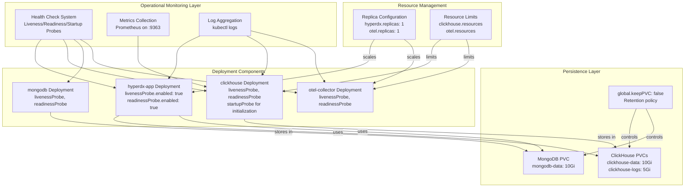
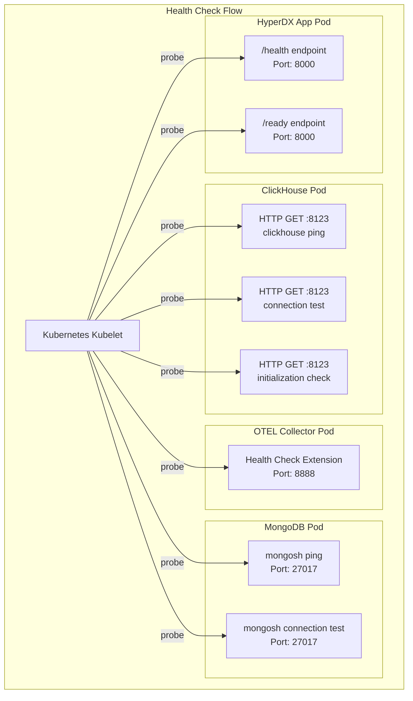
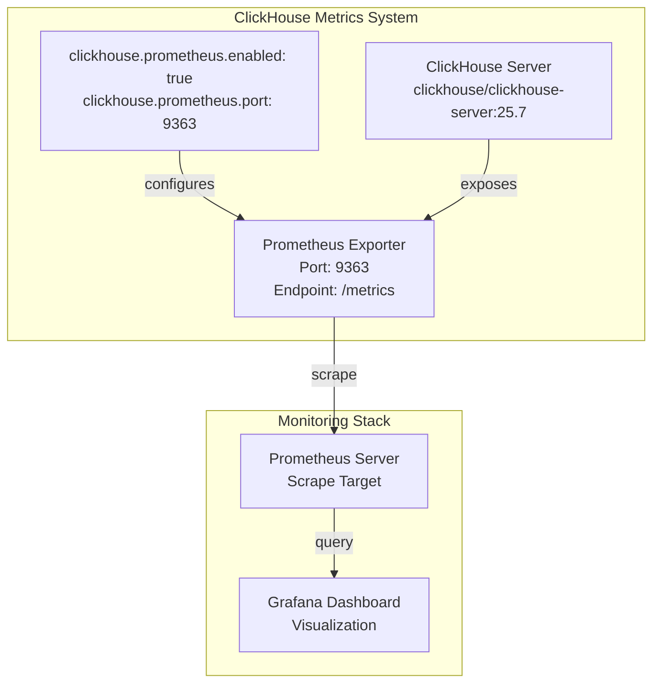
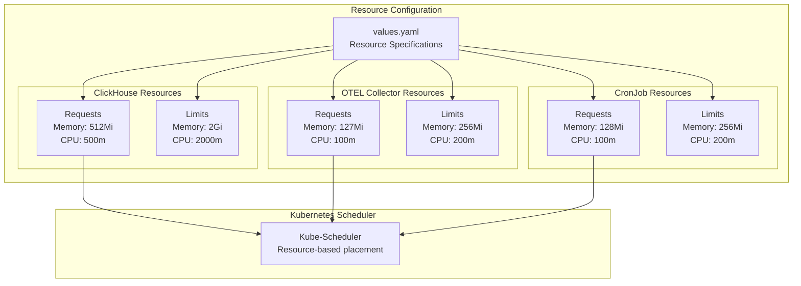
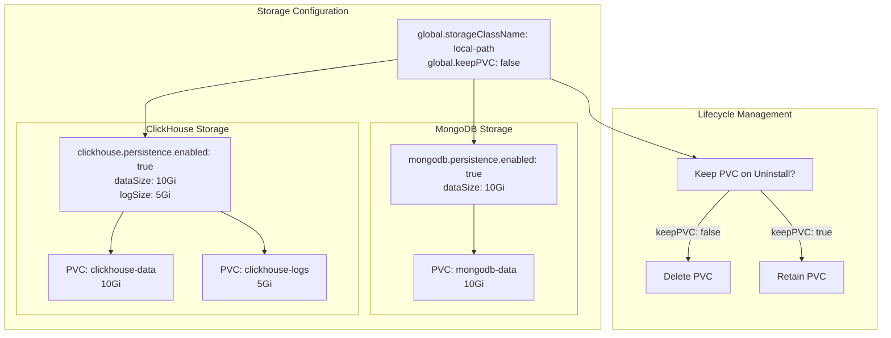
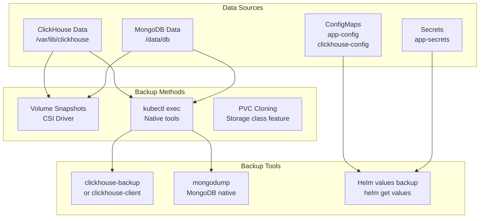
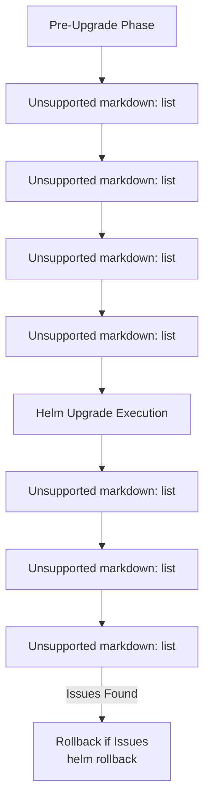
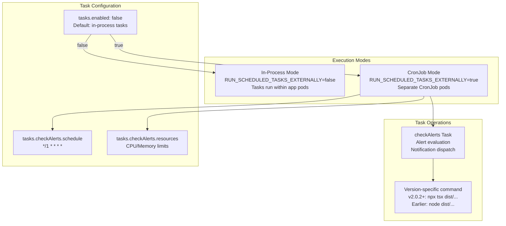
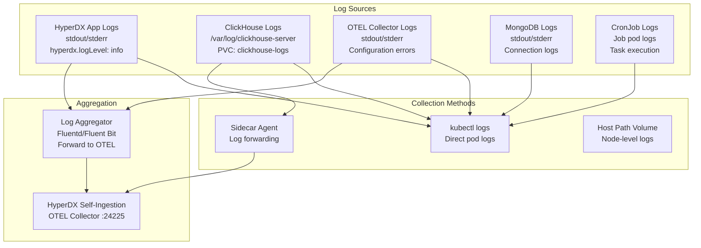
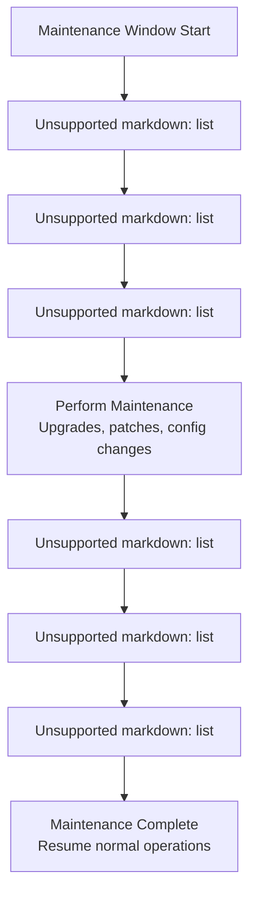

# Operations and Maintenance

> **Relevant source files**
> * [CHANGELOG.md](https://github.com/hyperdxio/helm-charts/blob/845dd482/CHANGELOG.md)
> * [README.md](https://github.com/hyperdxio/helm-charts/blob/845dd482/README.md)
> * [charts/hdx-oss-v2/values.yaml](https://github.com/hyperdxio/helm-charts/blob/845dd482/charts/hdx-oss-v2/values.yaml)

This document covers day-to-day operational procedures, monitoring, and maintenance tasks for HyperDX deployments. It provides guidance on ensuring system health, managing resources, handling data persistence, and troubleshooting common issues.

For detailed configuration of individual components, see [Component Deep Dives](/hyperdxio/helm-charts/5-component-deep-dives). For deployment and initial setup procedures, see [Getting Started](/hyperdxio/helm-charts/2-getting-started). For network and security configuration, see [Networking and Security](/hyperdxio/helm-charts/7-networking-and-security).

## Operational Overview

HyperDX deployments consist of multiple components that require ongoing monitoring and maintenance. The Helm chart provides built-in health checks, resource management, and persistence mechanisms to ensure reliable operation.



**Sources:** [charts/hdx-oss-v2/values.yaml L23-L34](https://github.com/hyperdxio/helm-charts/blob/845dd482/charts/hdx-oss-v2/values.yaml#L23-L34)

 [charts/hdx-oss-v2/values.yaml L276-L287](https://github.com/hyperdxio/helm-charts/blob/845dd482/charts/hdx-oss-v2/values.yaml#L276-L287)

 [charts/hdx-oss-v2/values.yaml L303-L320](https://github.com/hyperdxio/helm-charts/blob/845dd482/charts/hdx-oss-v2/values.yaml#L303-L320)

 [charts/hdx-oss-v2/values.yaml L453-L464](https://github.com/hyperdxio/helm-charts/blob/845dd482/charts/hdx-oss-v2/values.yaml#L453-L464)

## Health Monitoring System

### Kubernetes Health Probes

Each component has configurable health probes that Kubernetes uses to determine pod health and readiness:

| Component | Liveness Probe | Readiness Probe | Startup Probe |
| --- | --- | --- | --- |
| **hyperdx-app** | Enabled by defaultinitialDelay: 10speriod: 30stimeout: 5sfailureThreshold: 3 | Enabled by defaultinitialDelay: 1speriod: 10stimeout: 5sfailureThreshold: 3 | Not configured |
| **clickhouse** | Enabled by defaultinitialDelay: 10speriod: 30stimeout: 5sfailureThreshold: 3 | Enabled by defaultinitialDelay: 1speriod: 10stimeout: 5sfailureThreshold: 3 | Enabled by defaultinitialDelay: 5speriod: 10sfailureThreshold: 30 |
| **mongodb** | Enabled by defaultinitialDelay: 10speriod: 30stimeout: 5sfailureThreshold: 3 | Enabled by defaultinitialDelay: 1speriod: 10stimeout: 5sfailureThreshold: 3 | Not configured |
| **otel-collector** | Enabled by defaultinitialDelay: 10speriod: 30stimeout: 5sfailureThreshold: 3 | Enabled by defaultinitialDelay: 5speriod: 10stimeout: 5sfailureThreshold: 3 | Not configured |

**Probe Configuration Locations:**

* HyperDX: [charts/hdx-oss-v2/values.yaml L23-L34](https://github.com/hyperdxio/helm-charts/blob/845dd482/charts/hdx-oss-v2/values.yaml#L23-L34)
* ClickHouse: [charts/hdx-oss-v2/values.yaml L303-L320](https://github.com/hyperdxio/helm-charts/blob/845dd482/charts/hdx-oss-v2/values.yaml#L303-L320)
* MongoDB: [charts/hdx-oss-v2/values.yaml L276-L287](https://github.com/hyperdxio/helm-charts/blob/845dd482/charts/hdx-oss-v2/values.yaml#L276-L287)
* OTEL Collector: [charts/hdx-oss-v2/values.yaml L453-L464](https://github.com/hyperdxio/helm-charts/blob/845dd482/charts/hdx-oss-v2/values.yaml#L453-L464)

### Health Check Endpoints



**Sources:** [charts/hdx-oss-v2/values.yaml L23-L34](https://github.com/hyperdxio/helm-charts/blob/845dd482/charts/hdx-oss-v2/values.yaml#L23-L34)

 [charts/hdx-oss-v2/values.yaml L303-L320](https://github.com/hyperdxio/helm-charts/blob/845dd482/charts/hdx-oss-v2/values.yaml#L303-L320)

 [charts/hdx-oss-v2/values.yaml L453-L464](https://github.com/hyperdxio/helm-charts/blob/845dd482/charts/hdx-oss-v2/values.yaml#L453-L464)

### Checking Pod Health

Monitor pod health using kubectl commands:

```html
# Check pod status across all components
kubectl get pods -l app.kubernetes.io/name=hdx-oss-v2

# Watch pod health in real-time
kubectl get pods -l app.kubernetes.io/name=hdx-oss-v2 -w

# Detailed pod status with conditions
kubectl describe pod <pod-name>

# Check specific component health
kubectl get pods -l app.kubernetes.io/component=app
kubectl get pods -l app.kubernetes.io/component=clickhouse
kubectl get pods -l app.kubernetes.io/component=mongodb
kubectl get pods -l app.kubernetes.io/component=otel-collector
```

**Sources:** [README.md L626-L631](https://github.com/hyperdxio/helm-charts/blob/845dd482/README.md#L626-L631)

## Metrics and Observability

### Prometheus Metrics Export

ClickHouse exposes Prometheus metrics for monitoring database performance:



**Configuration:**

```yaml
clickhouse:
  prometheus:
    enabled: true    # Enable Prometheus metrics
    port: 9363      # Metrics endpoint port
    endpoint: "/metrics"
```

**Sources:** [charts/hdx-oss-v2/values.yaml L350-L353](https://github.com/hyperdxio/helm-charts/blob/845dd482/charts/hdx-oss-v2/values.yaml#L350-L353)

### OTEL Collector Metrics

The OTEL Collector exposes its own metrics on the health port:

```yaml
otel:
  healthPort: 8888  # Metrics and health endpoint
```

Access collector metrics:

```markdown
# Forward port to access metrics locally
kubectl port-forward svc/my-hyperdx-hdx-oss-v2-otel-collector 8888:8888

# Query metrics endpoint
curl http://localhost:8888/metrics
```

**Sources:** [charts/hdx-oss-v2/values.yaml L404](https://github.com/hyperdxio/helm-charts/blob/845dd482/charts/hdx-oss-v2/values.yaml#L404-L404)

## Resource Management

### Replica Configuration

Control the number of replicas for scalable components:

```yaml
hyperdx:
  replicas: 1  # HyperDX application instances

otel:
  replicas: 1  # OTEL Collector instances
```

**Scaling operations:**

```markdown
# Scale HyperDX application
kubectl scale deployment my-hyperdx-hdx-oss-v2-app --replicas=3

# Scale OTEL Collector
kubectl scale deployment my-hyperdx-hdx-oss-v2-otel-collector --replicas=2

# Check current replica count
kubectl get deployment -l app.kubernetes.io/name=hdx-oss-v2
```

**Sources:** [charts/hdx-oss-v2/values.yaml L241](https://github.com/hyperdxio/helm-charts/blob/845dd482/charts/hdx-oss-v2/values.yaml#L241-L241)

 [charts/hdx-oss-v2/values.yaml L373](https://github.com/hyperdxio/helm-charts/blob/845dd482/charts/hdx-oss-v2/values.yaml#L373-L373)

### Resource Limits and Requests

Configure CPU and memory allocation for components:



**Example resource configuration:**

```yaml
clickhouse:
  resources:
    requests:
      memory: "512Mi"
      cpu: "500m"
    limits:
      memory: "2Gi"
      cpu: "2000m"

otel:
  resources:
    requests:
      memory: "127Mi"
      cpu: "100m"
    limits:
      memory: "256Mi"
      cpu: "200m"

tasks:
  checkAlerts:
    resources:
      requests:
        memory: "128Mi"
        cpu: "100m"
      limits:
        memory: "256Mi"
        cpu: "200m"
```

**Sources:** [charts/hdx-oss-v2/values.yaml L294-L302](https://github.com/hyperdxio/helm-charts/blob/845dd482/charts/hdx-oss-v2/values.yaml#L294-L302)

 [charts/hdx-oss-v2/values.yaml L374-L382](https://github.com/hyperdxio/helm-charts/blob/845dd482/charts/hdx-oss-v2/values.yaml#L374-L382)

 [charts/hdx-oss-v2/values.yaml L470-L476](https://github.com/hyperdxio/helm-charts/blob/845dd482/charts/hdx-oss-v2/values.yaml#L470-L476)

### Monitoring Resource Usage

```html
# Check resource usage across pods
kubectl top pods -l app.kubernetes.io/name=hdx-oss-v2

# Detailed resource requests/limits
kubectl describe pod <pod-name> | grep -A 5 "Limits:"

# Node resource availability
kubectl top nodes
```

**Sources:** [README.md L626-L631](https://github.com/hyperdxio/helm-charts/blob/845dd482/README.md#L626-L631)

## Persistence and Data Management

### Persistent Volume Configuration



**Configuration details:**

```python
global:
  storageClassName: "local-path"  # Storage class for all PVCs
  keepPVC: false                  # Delete PVCs on helm uninstall

clickhouse:
  persistence:
    enabled: true
    dataSize: 10Gi   # ClickHouse data volume
    logSize: 5Gi     # ClickHouse log volume

mongodb:
  persistence:
    enabled: true
    dataSize: 10Gi   # MongoDB data volume
```

**Sources:** [charts/hdx-oss-v2/values.yaml L10-L12](https://github.com/hyperdxio/helm-charts/blob/845dd482/charts/hdx-oss-v2/values.yaml#L10-L12)

 [charts/hdx-oss-v2/values.yaml L346-L349](https://github.com/hyperdxio/helm-charts/blob/845dd482/charts/hdx-oss-v2/values.yaml#L346-L349)

 [charts/hdx-oss-v2/values.yaml L273-L275](https://github.com/hyperdxio/helm-charts/blob/845dd482/charts/hdx-oss-v2/values.yaml#L273-L275)

### Managing Persistent Volumes

```python
# List all PVCs for the deployment
kubectl get pvc -l app.kubernetes.io/name=hdx-oss-v2

# Check PVC status and capacity
kubectl describe pvc <pvc-name>

# Check actual disk usage in pods
kubectl exec -it <clickhouse-pod> -- df -h /var/lib/clickhouse
kubectl exec -it <mongodb-pod> -- df -h /data/db

# Resize a PVC (if storage class supports it)
kubectl patch pvc <pvc-name> -p '{"spec":{"resources":{"requests":{"storage":"20Gi"}}}}'
```

### Backup Strategies



**ClickHouse backup example:**

```sql
# Backup using clickhouse-client
kubectl exec -it <clickhouse-pod> -- clickhouse-client --query="BACKUP DATABASE default TO Disk('backups', 'backup-$(date +%Y%m%d).zip')"

# Export specific tables
kubectl exec -it <clickhouse-pod> -- clickhouse-client --query="SELECT * FROM default.otel_logs FORMAT Native" > otel_logs_backup.native

# Create volume snapshot (if CSI driver supports it)
kubectl create -f clickhouse-snapshot.yaml
```

**MongoDB backup example:**

```markdown
# MongoDB dump
kubectl exec -it <mongodb-pod> -- mongodump --archive=/data/backup-$(date +%Y%m%d).gz --gzip --db hyperdx

# Copy backup to local machine
kubectl cp <mongodb-pod>:/data/backup-20240101.gz ./mongodb-backup-20240101.gz
```

**Helm configuration backup:**

```markdown
# Backup current Helm values
helm get values my-hyperdx > hyperdx-values-backup.yaml

# Backup all Kubernetes resources
kubectl get all,pvc,configmap,secret -l app.kubernetes.io/name=hdx-oss-v2 -o yaml > hyperdx-k8s-backup.yaml
```

**Sources:** [charts/hdx-oss-v2/values.yaml L346-L349](https://github.com/hyperdxio/helm-charts/blob/845dd482/charts/hdx-oss-v2/values.yaml#L346-L349)

 [charts/hdx-oss-v2/values.yaml L273-L275](https://github.com/hyperdxio/helm-charts/blob/845dd482/charts/hdx-oss-v2/values.yaml#L273-L275)

## Upgrade Procedures

### Pre-Upgrade Checklist



**Sources:** [CHANGELOG.md L1-L154](https://github.com/hyperdxio/helm-charts/blob/845dd482/CHANGELOG.md#L1-L154)

 [README.md L502-L516](https://github.com/hyperdxio/helm-charts/blob/845dd482/README.md#L502-L516)

### Standard Upgrade Process

```sql
# 1. Update Helm repository
helm repo update hyperdx

# 2. Check available versions
helm search repo hyperdx/hdx-oss-v2 --versions

# 3. Review changes in target version
helm show readme hyperdx/hdx-oss-v2 --version <target-version>

# 4. Backup current configuration
helm get values my-hyperdx > pre-upgrade-values.yaml
kubectl get pvc -l app.kubernetes.io/name=hdx-oss-v2 > pre-upgrade-pvcs.yaml

# 5. Perform upgrade
helm upgrade my-hyperdx hyperdx/hdx-oss-v2 \
  -f values.yaml \
  --version <target-version>

# 6. Monitor rollout
kubectl rollout status deployment/my-hyperdx-hdx-oss-v2-app
kubectl rollout status deployment/my-hyperdx-hdx-oss-v2-clickhouse
kubectl rollout status deployment/my-hyperdx-hdx-oss-v2-otel-collector

# 7. Verify pods are running
kubectl get pods -l app.kubernetes.io/name=hdx-oss-v2

# 8. Check application logs for errors
kubectl logs -l app.kubernetes.io/component=app --tail=100
```

**Sources:** [README.md L504-L516](https://github.com/hyperdxio/helm-charts/blob/845dd482/README.md#L504-L516)

### Version-Specific Upgrade Notes

#### ClickHouse 25.7 Upgrade (Chart v0.8.0+)

The chart implements a safe ClickHouse upgrade process with controlled termination:

```yaml
clickhouse:
  terminationGracePeriodSeconds: 90  # Allow time for graceful shutdown
```

**Important considerations:**

* ClickHouse v25.7 upgrade includes breaking changes
* Ensure 90-second grace period for clean shutdown
* Monitor ClickHouse logs during upgrade for any migration issues

**Sources:** [CHANGELOG.md L28-L34](https://github.com/hyperdxio/helm-charts/blob/845dd482/CHANGELOG.md#L28-L34)

 [charts/hdx-oss-v2/values.yaml L293](https://github.com/hyperdxio/helm-charts/blob/845dd482/charts/hdx-oss-v2/values.yaml#L293-L293)

#### Alert CronJob Path Changes (Chart v0.8.3+)

Starting with chart v0.8.3, alert checking uses updated command paths for newer HyperDX versions:

```markdown
# Check which version-specific command is being used
kubectl describe cronjob my-hyperdx-hdx-oss-v2-task-checkalerts | grep command

# Verify cronjob is running correctly after upgrade
kubectl get jobs -l app.kubernetes.io/component=task-checkalerts
```

**Sources:** [CHANGELOG.md L9-L13](https://github.com/hyperdxio/helm-charts/blob/845dd482/CHANGELOG.md#L9-L13)

 [CHANGELOG.md L5-L7](https://github.com/hyperdxio/helm-charts/blob/845dd482/CHANGELOG.md#L5-L7)

### Rollback Procedure

```markdown
# List release history
helm history my-hyperdx

# Rollback to previous release
helm rollback my-hyperdx <revision-number>

# Rollback to previous release (automatic revision detection)
helm rollback my-hyperdx

# Verify rollback
kubectl get pods -l app.kubernetes.io/name=hdx-oss-v2
helm list
```

**Sources:** [README.md L504-L516](https://github.com/hyperdxio/helm-charts/blob/845dd482/README.md#L504-L516)

## Scheduled Tasks Management

### CronJob Configuration

The chart includes a scheduled task system for background operations:



**Configuration options:**

```yaml
tasks:
  enabled: false  # Set to true for separate CronJob execution
  checkAlerts:
    schedule: "*/1 * * * *"  # Every minute
    resources:
      requests:
        memory: "128Mi"
        cpu: "100m"
      limits:
        memory: "256Mi"
        cpu: "200m"
```

**When to use CronJob mode (`tasks.enabled: true`):**

* Heavy alert processing workload
* Need isolated resource allocation for tasks
* Want independent scaling of task execution
* Require separate monitoring of task performance

**When to use in-process mode (`tasks.enabled: false`):**

* Default for most deployments
* Simpler operational model
* Lower resource overhead
* Adequate for typical alert volumes

**Sources:** [charts/hdx-oss-v2/values.yaml L466-L476](https://github.com/hyperdxio/helm-charts/blob/845dd482/charts/hdx-oss-v2/values.yaml#L466-L476)

 [CHANGELOG.md L83-L86](https://github.com/hyperdxio/helm-charts/blob/845dd482/CHANGELOG.md#L83-L86)

### Monitoring Scheduled Tasks

```python
# List CronJobs
kubectl get cronjobs -l app.kubernetes.io/name=hdx-oss-v2

# View CronJob details and schedule
kubectl describe cronjob my-hyperdx-hdx-oss-v2-task-checkalerts

# List completed and active jobs
kubectl get jobs -l app.kubernetes.io/component=task-checkalerts

# Check logs from latest job execution
kubectl logs -l job-name=<job-name> --tail=100

# Manually trigger a job execution
kubectl create job manual-alert-check-$(date +%s) \
  --from=cronjob/my-hyperdx-hdx-oss-v2-task-checkalerts
```

**Sources:** [README.md L324-L332](https://github.com/hyperdxio/helm-charts/blob/845dd482/README.md#L324-L332)

## Log Collection and Analysis

### Component Log Locations



**Collecting logs:**

```python
# Stream logs from HyperDX application
kubectl logs -f deployment/my-hyperdx-hdx-oss-v2-app

# Get logs from all app pods
kubectl logs -l app.kubernetes.io/component=app --tail=100

# ClickHouse logs (stdout)
kubectl logs -l app.kubernetes.io/component=clickhouse --tail=100

# ClickHouse logs (from volume)
kubectl exec -it <clickhouse-pod> -- tail -f /var/log/clickhouse-server/clickhouse-server.log

# OTEL Collector logs
kubectl logs -l app.kubernetes.io/component=otel-collector --tail=100

# MongoDB logs
kubectl logs -l app.kubernetes.io/component=mongodb --tail=100

# CronJob execution logs
kubectl logs -l app.kubernetes.io/component=task-checkalerts --tail=100

# Export logs to file
kubectl logs deployment/my-hyperdx-hdx-oss-v2-app > app-logs.txt
```

**Sources:** [charts/hdx-oss-v2/values.yaml L57](https://github.com/hyperdxio/helm-charts/blob/845dd482/charts/hdx-oss-v2/values.yaml#L57-L57)

 [README.md L626-L631](https://github.com/hyperdxio/helm-charts/blob/845dd482/README.md#L626-L631)

## Common Operational Issues

### Pod Restart Loops

**Symptoms:**

* Pod shows `CrashLoopBackOff` status
* Restart count incrementing

**Diagnosis:**

```html
# Check pod status
kubectl get pods -l app.kubernetes.io/name=hdx-oss-v2

# View recent events
kubectl describe pod <pod-name>

# Check container logs
kubectl logs <pod-name> --previous
```

**Common causes:**

1. **Failed health checks:** Probe timeouts too short
2. **Resource limits:** OOMKilled events
3. **Configuration errors:** Invalid environment variables
4. **Dependency issues:** MongoDB/ClickHouse not ready

**Resolution:**

```yaml
# Increase probe delays and timeouts
hyperdx:
  livenessProbe:
    initialDelaySeconds: 30
    timeoutSeconds: 10
    failureThreshold: 5
```

**Sources:** [charts/hdx-oss-v2/values.yaml L23-L34](https://github.com/hyperdxio/helm-charts/blob/845dd482/charts/hdx-oss-v2/values.yaml#L23-L34)

### Init Container Failures

**Symptoms:**

* Pod stuck in `Init:Error` or `Init:CrashLoopBackOff`
* HyperDX app pod waiting for MongoDB

**Diagnosis:**

```html
# Check init container logs
kubectl logs <pod-name> -c wait-for-mongodb

# Verify MongoDB service is accessible
kubectl get svc my-hyperdx-hdx-oss-v2-mongodb
kubectl get pods -l app.kubernetes.io/component=mongodb
```

**Configuration:**

```yaml
hyperdx:
  waitForMongodb:
    image: "busybox@sha256:1fcf5df..."
    pullPolicy: IfNotPresent
```

**Sources:** [charts/hdx-oss-v2/values.yaml L19-L22](https://github.com/hyperdxio/helm-charts/blob/845dd482/charts/hdx-oss-v2/values.yaml#L19-L22)

 [CHANGELOG.md L36-L37](https://github.com/hyperdxio/helm-charts/blob/845dd482/CHANGELOG.md#L36-L37)

### ClickHouse Connection Issues

**Symptoms:**

* HyperDX app cannot query data
* "Connection refused" errors in logs

**Diagnosis:**

```python
# Check ClickHouse service
kubectl get svc my-hyperdx-hdx-oss-v2-clickhouse

# Test ClickHouse connectivity from app pod
kubectl exec -it <app-pod> -- curl http://my-hyperdx-hdx-oss-v2-clickhouse:8123/ping

# Check ClickHouse CIDR configuration
kubectl get configmap my-hyperdx-hdx-oss-v2-clickhouse-config -o yaml
```

**Network CIDR configuration:**

```yaml
clickhouse:
  config:
    clusterCidrs:
      - "10.0.0.0/8"      # Kubernetes pod network
      - "172.16.0.0/12"   # Docker network
      - "192.168.0.0/16"  # Development networks
```

**Sources:** [charts/hdx-oss-v2/values.yaml L359-L366](https://github.com/hyperdxio/helm-charts/blob/845dd482/charts/hdx-oss-v2/values.yaml#L359-L366)

 [README.md L528-L618](https://github.com/hyperdxio/helm-charts/blob/845dd482/README.md#L528-L618)

### OTEL Collector OpAMP Connection Failures

**Symptoms:**

* OTEL Collector logs show "connection refused" to OpAMP server
* Particularly common on GKE with LoadBalancer services

**Diagnosis:**

```markdown
# Check OTEL Collector logs
kubectl logs -l app.kubernetes.io/component=otel-collector --tail=50

# Verify OpAMP server URL configuration
kubectl get configmap my-hyperdx-hdx-oss-v2-otel-custom-config -o yaml
```

**GKE-specific resolution:**

```yaml
otel:
  # Use FQDN instead of service name to avoid external IP resolution
  opampServerUrl: "http://my-hyperdx-hdx-oss-v2-app.default.svc.cluster.local:4320"
```

**Sources:** [README.md L528-L549](https://github.com/hyperdxio/helm-charts/blob/845dd482/README.md#L528-L549)

 [charts/hdx-oss-v2/values.yaml L437-L440](https://github.com/hyperdxio/helm-charts/blob/845dd482/charts/hdx-oss-v2/values.yaml#L437-L440)

### Persistent Volume Issues

**Symptoms:**

* Pods stuck in `Pending` with `FailedScheduling` events
* "no persistent volumes available" errors

**Diagnosis:**

```html
# Check PVC status
kubectl get pvc -l app.kubernetes.io/name=hdx-oss-v2

# Describe PVC for events
kubectl describe pvc <pvc-name>

# Check storage class
kubectl get storageclass
```

**Resolution:**

```python
# Set appropriate storage class for your cluster
global:
  storageClassName: "standard"  # AWS: gp2, GKE: standard, AKS: default
```

**Sources:** [charts/hdx-oss-v2/values.yaml L10](https://github.com/hyperdxio/helm-charts/blob/845dd482/charts/hdx-oss-v2/values.yaml#L10-L10)

## Maintenance Windows

### Planned Maintenance Procedure



**Maintenance commands:**

```markdown
# 1. Backup current state
helm get values my-hyperdx > pre-maintenance-values.yaml
kubectl get all,pvc,configmap,secret -l app.kubernetes.io/name=hdx-oss-v2 -o yaml > pre-maintenance-state.yaml

# 2. Scale down OTEL collector to pause ingestion
kubectl scale deployment my-hyperdx-hdx-oss-v2-otel-collector --replicas=0

# 3. Perform maintenance (upgrade, patch, etc.)
helm upgrade my-hyperdx hyperdx/hdx-oss-v2 -f values.yaml

# 4. Scale up OTEL collector
kubectl scale deployment my-hyperdx-hdx-oss-v2-otel-collector --replicas=1

# 5. Verify all pods are healthy
kubectl get pods -l app.kubernetes.io/name=hdx-oss-v2

# 6. Run smoke tests
curl -I https://hyperdx.yourdomain.com
```

### Zero-Downtime Considerations

For production deployments requiring minimal downtime:

```sql
# Configure pod disruption budgets
hyperdx:
  podDisruptionBudget:
    enabled: true
    minAvailable: 1

# Scale to multiple replicas
hyperdx:
  replicas: 3

otel:
  replicas: 2

# Configure rolling update strategy (in templates)
# maxUnavailable: 1, maxSurge: 1
```

**Sources:** [charts/hdx-oss-v2/values.yaml L243-L244](https://github.com/hyperdxio/helm-charts/blob/845dd482/charts/hdx-oss-v2/values.yaml#L243-L244)

## Node Scheduling and Affinity

### Node Selector Configuration

Direct pods to specific nodes based on labels:

```yaml
hyperdx:
  nodeSelector:
    kubernetes.io/os: linux
    node-role.kubernetes.io/worker: "true"
    disk-type: ssd  # Custom label for high-performance storage

clickhouse:
  nodeSelector:
    kubernetes.io/os: linux
    storage: high-performance

mongodb:
  nodeSelector:
    kubernetes.io/os: linux

otel:
  nodeSelector:
    kubernetes.io/os: linux
```

**Applying node labels:**

```markdown
# Label nodes for specific workloads
kubectl label nodes <node-name> disk-type=ssd
kubectl label nodes <node-name> storage=high-performance

# Verify node labels
kubectl get nodes --show-labels
```

**Sources:** [charts/hdx-oss-v2/values.yaml L36-L40](https://github.com/hyperdxio/helm-charts/blob/845dd482/charts/hdx-oss-v2/values.yaml#L36-L40)

 [charts/hdx-oss-v2/values.yaml L261-L265](https://github.com/hyperdxio/helm-charts/blob/845dd482/charts/hdx-oss-v2/values.yaml#L261-L265)

 [charts/hdx-oss-v2/values.yaml L322-L327](https://github.com/hyperdxio/helm-charts/blob/845dd482/charts/hdx-oss-v2/values.yaml#L322-L327)

 [charts/hdx-oss-v2/values.yaml L388-L392](https://github.com/hyperdxio/helm-charts/blob/845dd482/charts/hdx-oss-v2/values.yaml#L388-L392)

### Tolerations for Tainted Nodes

Allow pods to schedule on tainted nodes:

```yaml
hyperdx:
  tolerations:
    - key: "dedicated"
      operator: "Equal"
      value: "hyperdx"
      effect: "NoSchedule"
    - key: "high-memory"
      operator: "Exists"
      effect: "NoSchedule"

clickhouse:
  tolerations:
    - key: "database"
      operator: "Equal"
      value: "true"
      effect: "NoSchedule"
```

**Applying taints:**

```markdown
# Taint nodes for dedicated workloads
kubectl taint nodes <node-name> dedicated=hyperdx:NoSchedule

# Remove taint
kubectl taint nodes <node-name> dedicated=hyperdx:NoSchedule-
```

**Sources:** [charts/hdx-oss-v2/values.yaml L41-L47](https://github.com/hyperdxio/helm-charts/blob/845dd482/charts/hdx-oss-v2/values.yaml#L41-L47)

 [charts/hdx-oss-v2/values.yaml L266-L272](https://github.com/hyperdxio/helm-charts/blob/845dd482/charts/hdx-oss-v2/values.yaml#L266-L272)

 [charts/hdx-oss-v2/values.yaml L328-L334](https://github.com/hyperdxio/helm-charts/blob/845dd482/charts/hdx-oss-v2/values.yaml#L328-L334)

 [charts/hdx-oss-v2/values.yaml L393-L399](https://github.com/hyperdxio/helm-charts/blob/845dd482/charts/hdx-oss-v2/values.yaml#L393-L399)

## Service Configuration

### Service Type and Annotations

Configure Kubernetes service types and cloud provider-specific annotations:

```css
hyperdx:
  service:
    type: ClusterIP  # Default: internal only
    annotations:
      # AWS ELB annotations
      service.beta.kubernetes.io/aws-load-balancer-internal: "true"
      service.beta.kubernetes.io/aws-load-balancer-type: "nlb"
      
      # GCP Load Balancer annotations
      cloud.google.com/load-balancer-type: "Internal"
      
      # Azure Load Balancer annotations
      service.beta.kubernetes.io/azure-load-balancer-internal: "true"

clickhouse:
  service:
    type: ClusterIP  # Always ClusterIP for security
    annotations: {}
```

**Service types:**

* `ClusterIP` (default): Internal cluster access only - **recommended for security**
* `LoadBalancer`: External cloud load balancer - **use with caution**
* `NodePort`: Access via node IP:port - **not recommended for production**

**Sources:** [charts/hdx-oss-v2/values.yaml L247-L254](https://github.com/hyperdxio/helm-charts/blob/845dd482/charts/hdx-oss-v2/values.yaml#L247-L254)

 [charts/hdx-oss-v2/values.yaml L337-L344](https://github.com/hyperdxio/helm-charts/blob/845dd482/charts/hdx-oss-v2/values.yaml#L337-L344)

## Uninstallation and Cleanup

### Standard Uninstall

```markdown
# Uninstall Helm release
helm uninstall my-hyperdx

# Verify pods are terminating
kubectl get pods -l app.kubernetes.io/name=hdx-oss-v2 -w
```

### PVC Retention Policy

By default, PVCs are deleted on uninstall. To preserve data:

```yaml
global:
  keepPVC: true  # Retain PVCs when uninstalling
```

**Manual PVC cleanup:**

```sql
# List remaining PVCs
kubectl get pvc -l app.kubernetes.io/name=hdx-oss-v2

# Delete specific PVC
kubectl delete pvc <pvc-name>

# Delete all PVCs for the deployment
kubectl delete pvc -l app.kubernetes.io/name=hdx-oss-v2
```

**Sources:** [charts/hdx-oss-v2/values.yaml L12](https://github.com/hyperdxio/helm-charts/blob/845dd482/charts/hdx-oss-v2/values.yaml#L12-L12)

 [README.md L519-L526](https://github.com/hyperdxio/helm-charts/blob/845dd482/README.md#L519-L526)

### Complete Cleanup Procedure

```sql
# 1. Backup data if needed
kubectl get all,pvc,configmap,secret -l app.kubernetes.io/name=hdx-oss-v2 -o yaml > final-backup.yaml

# 2. Uninstall Helm release
helm uninstall my-hyperdx

# 3. Delete persistent volumes (if keepPVC was enabled)
kubectl delete pvc -l app.kubernetes.io/name=hdx-oss-v2

# 4. Delete any orphaned resources
kubectl delete all -l app.kubernetes.io/name=hdx-oss-v2

# 5. Clean up secrets (if manually created)
kubectl delete secret hyperdx-external-config
kubectl delete secret hyperdx-tls

# 6. Verify all resources are removed
kubectl get all,pvc,configmap,secret -l app.kubernetes.io/name=hdx-oss-v2
```

**Sources:** [README.md L519-L526](https://github.com/hyperdxio/helm-charts/blob/845dd482/README.md#L519-L526)

---

For detailed component-specific troubleshooting and health checks, see [Health Checks and Monitoring](/hyperdxio/helm-charts/8.1-health-checks-and-monitoring). For resource tuning and optimization, see [Resource Management](/hyperdxio/helm-charts/8.2-resource-management). For backup strategies and data recovery, see [Persistence and Backups](/hyperdxio/helm-charts/8.3-persistence-and-backups). For detailed troubleshooting scenarios, see [Troubleshooting](/hyperdxio/helm-charts/8.4-troubleshooting).