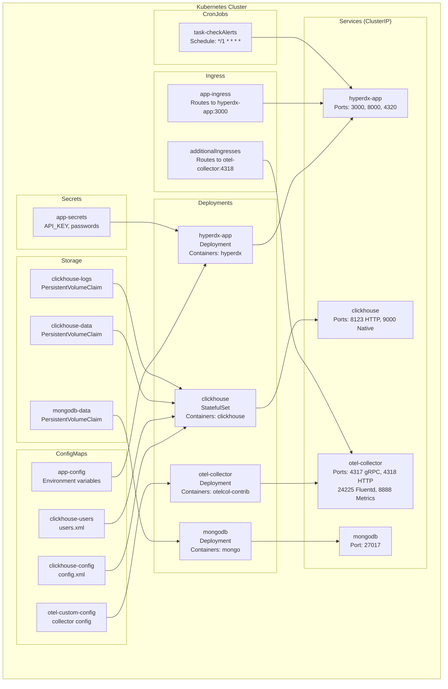
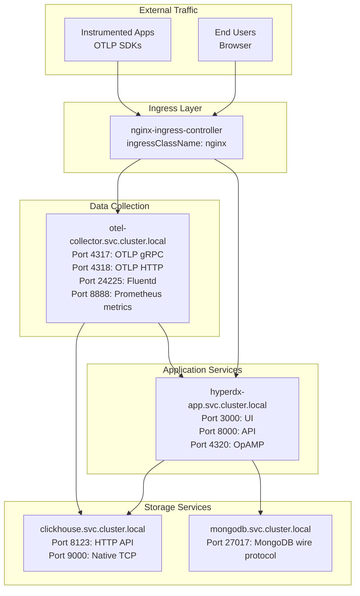
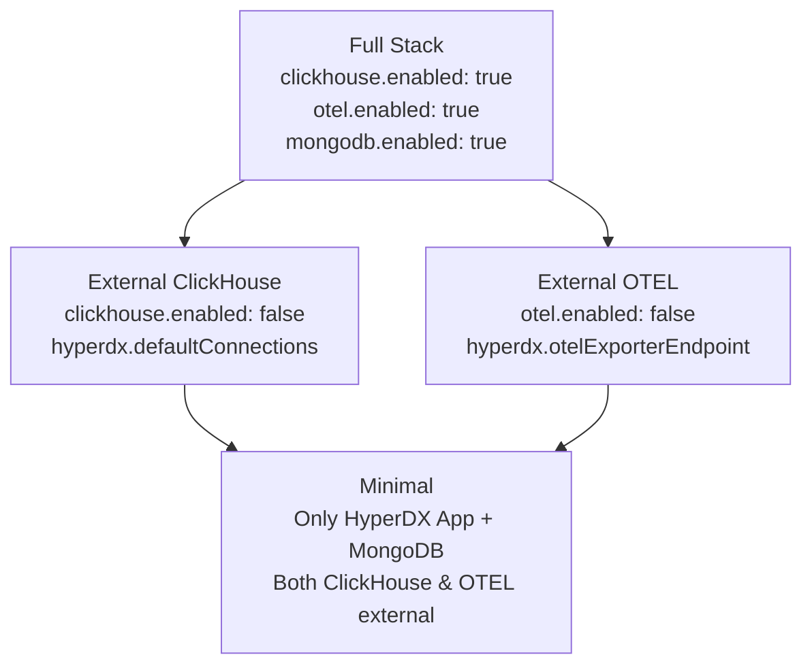

# Overview

> **Relevant source files**
> * [CHANGELOG.md](https://github.com/hyperdxio/helm-charts/blob/845dd482/CHANGELOG.md)
> * [README.md](https://github.com/hyperdxio/helm-charts/blob/845dd482/README.md)
> * [charts/hdx-oss-v2/Chart.yaml](https://github.com/hyperdxio/helm-charts/blob/845dd482/charts/hdx-oss-v2/Chart.yaml)

## Purpose and Scope

This document provides an introduction to the HyperDX Helm Charts repository, which contains Kubernetes deployment configurations for HyperDX OSS V2, an open-source observability platform. This page covers the fundamental architecture, system components, and deployment model.

For detailed installation procedures, see [Getting Started](/hyperdxio/helm-charts/2-getting-started). For comprehensive configuration options, see [Configuration Reference](/hyperdxio/helm-charts/3-configuration-reference). For specific deployment patterns, see [Deployment Scenarios](/hyperdxio/helm-charts/4-deployment-scenarios).

**Sources:** [README.md L1-L4](https://github.com/hyperdxio/helm-charts/blob/845dd482/README.md#L1-L4)

 [Chart.yaml L1-L7](https://github.com/hyperdxio/helm-charts/blob/845dd482/Chart.yaml#L1-L7)

## What is HyperDX OSS V2?

HyperDX OSS V2 is a self-hosted observability platform that collects, stores, and visualizes telemetry data (logs, traces, and metrics) from distributed systems. It provides a unified interface for searching, analyzing, and monitoring application behavior.

The platform consists of:

* **HyperDX Application**: Web UI, REST API, and OpAMP server for collector management
* **OpenTelemetry Collector**: Receives and processes telemetry data via OTLP and Fluentd protocols
* **ClickHouse Database**: Column-oriented database storing telemetry data in tables (`otel_logs`, `otel_traces`, `otel_metrics_*`)
* **MongoDB**: Document database storing application metadata, user configurations, and dashboards

**Sources:** [README.md L56-L62](https://github.com/hyperdxio/helm-charts/blob/845dd482/README.md#L56-L62)

 [Chart.yaml L3](https://github.com/hyperdxio/helm-charts/blob/845dd482/Chart.yaml#L3-L3)

## What This Repository Provides

This repository contains the `hdx-oss-v2` Helm chart, which automates the deployment and configuration of HyperDX OSS V2 on Kubernetes clusters. The chart manages:

* Kubernetes resource generation (Deployments, Services, ConfigMaps, Secrets, Ingress, PersistentVolumeClaims)
* Component lifecycle management and configuration
* Network service discovery and ingress routing
* Persistent storage provisioning
* Optional scheduled tasks via CronJobs

**Chart Metadata:**

* **Name**: `hdx-oss-v2`
* **Type**: `application`
* **Current Chart Version**: `0.8.4`
* **Current App Version**: `2.7.1`

**Sources:** [Chart.yaml L1-L7](https://github.com/hyperdxio/helm-charts/blob/845dd482/Chart.yaml#L1-L7)

 [README.md L1-L4](https://github.com/hyperdxio/helm-charts/blob/845dd482/README.md#L1-L4)

## Repository Structure

```mermaid
flowchart TD

ChartYAML["Chart.yaml<br>Chart metadata"]
ValuesYAML["values.yaml<br>Default configuration"]
ChangelogMD["CHANGELOG.md<br>Version history"]
PackageJSON["package.json<br>@changesets/cli tooling"]
Templates["templates/<br>Kubernetes manifests"]
AppDeploy["hyperdx-deployment.yaml<br>Main app deployment"]
CHDeploy["clickhouse-deployment.yaml<br>ClickHouse stateful set"]
OTELDeploy["otel-collector-deployment.yaml<br>Collector deployment"]
MongoDeploy["mongodb-deployment.yaml<br>MongoDB deployment"]
Services["*-service.yaml<br>ClusterIP services"]
ConfigMaps["*-configmap.yaml<br>Configuration data"]
Secrets["secrets.yaml<br>Sensitive data"]
IngressRes["ingress.yaml<br>External routing"]
CronJobs["task-check-alerts.yaml<br>Scheduled tasks"]
GHActions[".github/workflows/<br>Automation"]
ChartTest["chart-test.yml<br>Test pipeline"]
Release["release.yml<br>Release automation"]
UpdateApp["update-app-version.yml<br>Version updates"]

ChartYAML --> Templates
ValuesYAML --> Templates
PackageJSON --> GHActions

subgraph subGraph3 ["CI/CD Workflows"]
    GHActions
    ChartTest
    Release
    UpdateApp
    GHActions --> ChartTest
    GHActions --> Release
    GHActions --> UpdateApp
end

subgraph charts/hdx-oss-v2/ ["charts/hdx-oss-v2/"]
    Templates
    Templates --> AppDeploy
    Templates --> CHDeploy
    Templates --> OTELDeploy
    Templates --> MongoDeploy
    Templates --> Services
    Templates --> ConfigMaps
    Templates --> Secrets
    Templates --> IngressRes
    Templates --> CronJobs

subgraph subGraph1 ["Template Files"]
    AppDeploy
    CHDeploy
    OTELDeploy
    MongoDeploy
    Services
    ConfigMaps
    Secrets
    IngressRes
    CronJobs
end
end

subgraph subGraph0 ["Repository Root"]
    ChartYAML
    ValuesYAML
    ChangelogMD
    PackageJSON
end
```

**Sources:** [Chart.yaml L1-L7](https://github.com/hyperdxio/helm-charts/blob/845dd482/Chart.yaml#L1-L7)

 [README.md L1-L4](https://github.com/hyperdxio/helm-charts/blob/845dd482/README.md#L1-L4)

## Deployed System Architecture

The following diagram shows the Kubernetes resources created by the Helm chart and their relationships:

**Sources:** [README.md L56-L62](https://github.com/hyperdxio/helm-charts/blob/845dd482/README.md#L56-L62)

## Component Connectivity and Data Flow

The following diagram maps service names and ports to show how components communicate within the Kubernetes cluster:

**Sources:** [README.md L56-L62](https://github.com/hyperdxio/helm-charts/blob/845dd482/README.md#L56-L62)

 [README.md L86-L95](https://github.com/hyperdxio/helm-charts/blob/845dd482/README.md#L86-L95)

## Key Configuration Concepts

### Chart vs Application Versioning

The Helm chart maintains two distinct version numbers:

* **Chart Version** (`version: 0.8.4`): Incremented when chart templates, values, or packaging changes
* **Application Version** (`appVersion: 2.7.1`): Tracks the HyperDX application container image version

These versions evolve independently. A chart version bump may include new Kubernetes features or configuration options without changing the application. An application version bump updates the running HyperDX software.

**Sources:** [Chart.yaml L5-L6](https://github.com/hyperdxio/helm-charts/blob/845dd482/Chart.yaml#L5-L6)

 [CHANGELOG.md L1-L19](https://github.com/hyperdxio/helm-charts/blob/845dd482/CHANGELOG.md#L1-L19)

### Configuration Injection Patterns

The chart uses three primary methods to inject configuration into pods:

1. **ConfigMap Environment Variables** (`envFrom: configMapRef`): Bulk environment variable injection from `app-config` ConfigMap
2. **Secret References** (`env: secretKeyRef`): Individual sensitive values from `app-secrets` Secret
3. **ConfigMap Volumes**: Configuration files mounted as volumes (e.g., `clickhouse-config`, `otel-custom-config`)

**Sources:** [README.md L275-L323](https://github.com/hyperdxio/helm-charts/blob/845dd482/README.md#L275-L323)

### Service Discovery

All internal service-to-service communication uses Kubernetes DNS with fully qualified domain names (FQDNs):

* Format: `<service-name>.<namespace>.svc.cluster.local`
* Example: `clickhouse.default.svc.cluster.local:8123`

This FQDN approach avoids DNS resolution issues in certain cloud environments (particularly GKE LoadBalancer configurations).

**Sources:** [README.md L543-L549](https://github.com/hyperdxio/helm-charts/blob/845dd482/README.md#L543-L549)

## Deployment Flexibility

The chart supports progressive externalization of components:

Each component can be disabled and replaced with external services by setting `<component>.enabled: false` and providing connection details.

**Sources:** [README.md L54-L234](https://github.com/hyperdxio/helm-charts/blob/845dd482/README.md#L54-L234)

## Version History and Updates

Recent chart releases include:

| Version | Changes | AppVersion |
| --- | --- | --- |
| 0.8.4 | Fixed CronJob command path for version compatibility | 2.7.1 |
| 0.8.3 | Updated alert CronJob template for newer image tags | 2.7.1 |
| 0.8.2 | Updated application to 2.7.1 | 2.7.1 |
| 0.8.1 | Parameterized initContainer image configuration | 2.7.0 |
| 0.8.0 | ClickHouse v25.7 upgrade, resource limits support | 2.6.0 |
| 0.7.3 | Updated application versions (2.4.0, 2.5.0, 2.6.0) | 2.6.0 |
| 0.7.2 | Added custom OTEL collector config support | 2.2.1 |
| 0.7.0 | Added frontend URL configuration, secret support for connections | 2.1.2 |

For complete version history, see [What's New](/hyperdxio/helm-charts/1.2-what's-new). For upgrade procedures, see [Upgrading](/hyperdxio/helm-charts/2.3-upgrading).

**Sources:** [CHANGELOG.md L1-L154](https://github.com/hyperdxio/helm-charts/blob/845dd482/CHANGELOG.md#L1-L154)

## Next Steps

* To install HyperDX, see [Installation](/hyperdxio/helm-charts/2.1-installation)
* For architectural details, see [System Architecture](/hyperdxio/helm-charts/1.1-system-architecture)
* For configuration options, see [Configuration Reference](/hyperdxio/helm-charts/3-configuration-reference)
* For specific deployment patterns, see [Deployment Scenarios](/hyperdxio/helm-charts/4-deployment-scenarios)