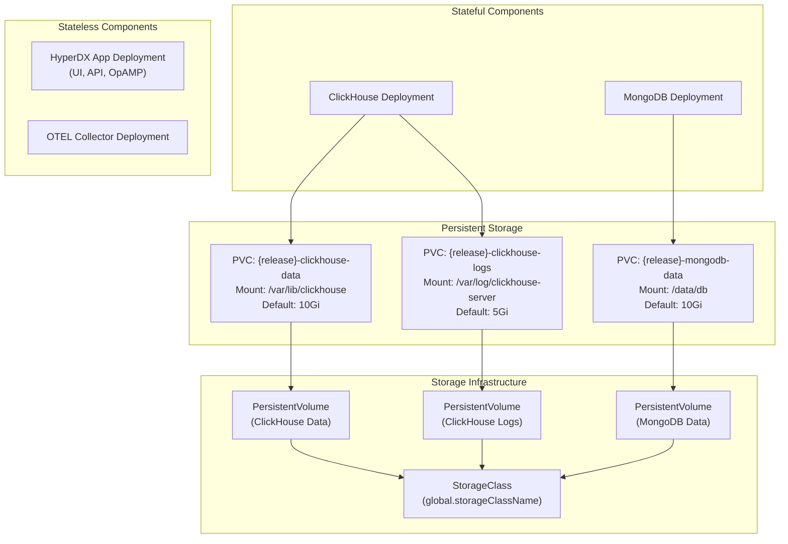
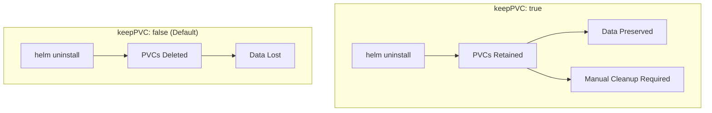
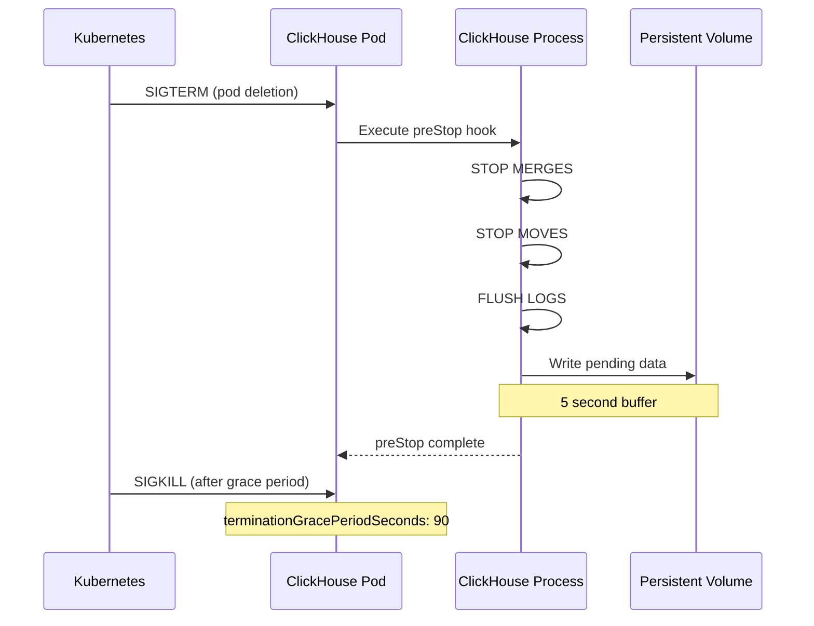

# Persistence and Backups

> **Relevant source files**
> * [README.md](https://github.com/hyperdxio/helm-charts/blob/845dd482/README.md)
> * [charts/hdx-oss-v2/templates/clickhouse-deployment.yaml](https://github.com/hyperdxio/helm-charts/blob/845dd482/charts/hdx-oss-v2/templates/clickhouse-deployment.yaml)
> * [charts/hdx-oss-v2/values.yaml](https://github.com/hyperdxio/helm-charts/blob/845dd482/charts/hdx-oss-v2/values.yaml)

## Purpose and Scope

This document covers the persistent storage architecture, configuration, and backup strategies for HyperDX deployments. It details how data is persisted across pod restarts, PersistentVolumeClaim (PVC) configuration, storage class selection, and recommended approaches for backing up and recovering data.

For information about storage capacity planning and resource allocation, see [Resource Management](/hyperdxio/helm-charts/8.2-resource-management). For troubleshooting storage-related issues, see [Troubleshooting](/hyperdxio/helm-charts/8.4-troubleshooting).

## Storage Architecture Overview

HyperDX uses persistent storage for two stateful components: ClickHouse (observability data) and MongoDB (application metadata). The OpenTelemetry Collector and HyperDX application components are stateless and do not require persistent storage.



**Persistent Storage Locations**

| Component | PVC Name | Mount Path | Default Size | Purpose |
| --- | --- | --- | --- | --- |
| ClickHouse | `{release}-clickhouse-data` | `/var/lib/clickhouse` | 10Gi | Database files, tables, and indexes |
| ClickHouse | `{release}-clickhouse-logs` | `/var/log/clickhouse-server` | 5Gi | ClickHouse server logs and query logs |
| MongoDB | `{release}-mongodb-data` | `/data/db` | 10Gi | Application metadata and configuration |

Sources: [charts/hdx-oss-v2/values.yaml L10-L12](https://github.com/hyperdxio/helm-charts/blob/845dd482/charts/hdx-oss-v2/values.yaml#L10-L12)

 [charts/hdx-oss-v2/values.yaml L273-L275](https://github.com/hyperdxio/helm-charts/blob/845dd482/charts/hdx-oss-v2/values.yaml#L273-L275)

 [charts/hdx-oss-v2/values.yaml L346-L349](https://github.com/hyperdxio/helm-charts/blob/845dd482/charts/hdx-oss-v2/values.yaml#L346-L349)

 [charts/hdx-oss-v2/templates/clickhouse-deployment.yaml L98-L122](https://github.com/hyperdxio/helm-charts/blob/845dd482/charts/hdx-oss-v2/templates/clickhouse-deployment.yaml#L98-L122)

## Persistent Volume Claims Configuration

### Global Storage Settings

The chart provides global storage configuration that applies to all PVCs:

```python
global:
  # Storage class for all PVCs
  storageClassName: "local-path"
  
  # Retain PVCs when uninstalling the Helm release
  keepPVC: false
```

**Configuration Details:**

* **`global.storageClassName`**: Specifies the Kubernetes StorageClass to use for all PVCs. Common values include: * `local-path`: Local path provisioner (default for development) * `gp2` or `gp3`: AWS EBS volumes (EKS) * `pd-standard` or `pd-ssd`: Google Persistent Disk (GKE) * `managed-premium` or `managed`: Azure Disk (AKS)
* **`global.keepPVC`**: Controls PVC retention behavior. When set to `true`, adds the `helm.sh/resource-policy: keep` annotation to PVCs, preventing their deletion during `helm uninstall`.

Sources: [charts/hdx-oss-v2/values.yaml L10-L12](https://github.com/hyperdxio/helm-charts/blob/845dd482/charts/hdx-oss-v2/values.yaml#L10-L12)

### ClickHouse Persistence

ClickHouse uses two separate PVCs for data and logs:

```yaml
clickhouse:
  persistence:
    enabled: true
    dataSize: 10Gi
    logSize: 5Gi
```

**PVC Templates:**

The ClickHouse deployment creates two PVCs when `clickhouse.persistence.enabled` is `true`:

```css
# Data PVC
apiVersion: v1
kind: PersistentVolumeClaim
metadata:
  name: {{ include "hdx-oss.fullname" . }}-clickhouse-data
  annotations:
    helm.sh/resource-policy: keep  # Only if global.keepPVC is true
spec:
  accessModes:
    - ReadWriteOnce
  storageClassName: {{ .Values.global.storageClassName }}
  resources:
    requests:
      storage: {{ .Values.clickhouse.persistence.dataSize }}

# Logs PVC (similar structure with logSize)
```

**Volume Mounts:**

```yaml
volumeMounts:
  - name: data
    mountPath: /var/lib/clickhouse
  - name: logs
    mountPath: /var/log/clickhouse-server
```

When `clickhouse.persistence.enabled` is `false`, both volumes use `emptyDir: {}`, which means data is lost when pods restart.

Sources: [charts/hdx-oss-v2/templates/clickhouse-deployment.yaml L175-L216](https://github.com/hyperdxio/helm-charts/blob/845dd482/charts/hdx-oss-v2/templates/clickhouse-deployment.yaml#L175-L216)

 [charts/hdx-oss-v2/templates/clickhouse-deployment.yaml L98-L122](https://github.com/hyperdxio/helm-charts/blob/845dd482/charts/hdx-oss-v2/templates/clickhouse-deployment.yaml#L98-L122)

### MongoDB Persistence

MongoDB uses a single PVC for database files:

```yaml
mongodb:
  persistence:
    enabled: true
    dataSize: 10Gi
```

The PVC is mounted to `/data/db`, MongoDB's default data directory. When disabled, an `emptyDir` is used instead.

Sources: [charts/hdx-oss-v2/values.yaml L273-L275](https://github.com/hyperdxio/helm-charts/blob/845dd482/charts/hdx-oss-v2/values.yaml#L273-L275)

### Disabling Persistence

For testing or development environments, you can disable persistence entirely:

```yaml
clickhouse:
  persistence:
    enabled: false

mongodb:
  persistence:
    enabled: false
```

**Warning:** With persistence disabled, all data is lost when pods are deleted or rescheduled. This configuration should only be used for ephemeral test environments.

## Storage Class Configuration

### Selecting a Storage Class

The storage class determines the underlying storage backend and performance characteristics. Choose based on your deployment environment:

**Development/Testing:**

```yaml
global:
  storageClassName: "local-path"
```

**Production - AWS EKS:**

```yaml
global:
  storageClassName: "gp3"  # General Purpose SSD (newer, more cost-effective)
  # or "gp2" for compatibility
```

**Production - Google GKE:**

```yaml
global:
  storageClassName: "pd-ssd"  # SSD for better performance
  # or "pd-standard" for cost savings
```

**Production - Azure AKS:**

```yaml
global:
  storageClassName: "managed-premium"  # SSD-backed
  # or "managed" for standard HDD
```

### Storage Performance Considerations

| Storage Class | IOPS | Throughput | Use Case |
| --- | --- | --- | --- |
| Local Path | Variable | Variable | Development, single-node |
| AWS gp3 | 3,000-16,000 | 125-1,000 MB/s | Production, customizable |
| GCP pd-ssd | 30/GB (max 15,000) | Up to 240 MB/s | High-performance production |
| Azure Premium | 120-20,000 | 25-900 MB/s | Production |

**ClickHouse Storage Requirements:**

ClickHouse is write-heavy and benefits from high IOPS storage. For production workloads:

* Minimum: 3,000 IOPS
* Recommended: 5,000+ IOPS for high-throughput scenarios
* Use SSD-backed storage classes

Sources: [charts/hdx-oss-v2/values.yaml L10](https://github.com/hyperdxio/helm-charts/blob/845dd482/charts/hdx-oss-v2/values.yaml#L10-L10)

## Data Retention and PVC Lifecycle

### The keepPVC Feature

The `global.keepPVC` setting controls whether PVCs are retained when the Helm release is uninstalled:

```yaml
global:
  keepPVC: true  # Recommended for production
```

**Behavior Comparison:**



**Implementation:**

When `global.keepPVC` is `true`, the chart adds a Helm resource policy annotation:

```yaml
metadata:
  annotations:
    "helm.sh/resource-policy": keep
```

This instructs Helm to skip the PVC during uninstallation.

**Manual PVC Cleanup:**

After uninstalling with `keepPVC: true`, PVCs remain in the cluster:

```sql
# List remaining PVCs
kubectl get pvc

# Delete specific PVC
kubectl delete pvc <release-name>-clickhouse-data

# Delete all PVCs for a release
kubectl delete pvc -l app.kubernetes.io/instance=<release-name>
```

Sources: [charts/hdx-oss-v2/templates/clickhouse-deployment.yaml L183-L186](https://github.com/hyperdxio/helm-charts/blob/845dd482/charts/hdx-oss-v2/templates/clickhouse-deployment.yaml#L183-L186)

 [charts/hdx-oss-v2/templates/clickhouse-deployment.yaml L203-L206](https://github.com/hyperdxio/helm-charts/blob/845dd482/charts/hdx-oss-v2/templates/clickhouse-deployment.yaml#L203-L206)

### Upgrade Considerations

PVCs are preserved during Helm upgrades regardless of the `keepPVC` setting. The setting only affects `helm uninstall` behavior.

**Safe Upgrade Process:**

1. Verify current PVCs: ``` kubectl get pvc -l app.kubernetes.io/instance=<release-name> ```
2. Perform upgrade: ``` helm upgrade <release-name> hyperdx/hdx-oss-v2 -f values.yaml ```
3. Verify data integrity after upgrade

## Data Lifecycle Management

### ClickHouse Graceful Shutdown

ClickHouse implements a `preStop` lifecycle hook to ensure data integrity during pod termination:

```yaml
lifecycle:
  preStop:
    exec:
      command:
        - /bin/sh
        - -c
        - |
          clickhouse-client --query "SYSTEM STOP MERGES" || true
          clickhouse-client --query "SYSTEM STOP MOVES" || true
          clickhouse-client --query "SYSTEM FLUSH LOGS" || true
          sleep 5
```

**Shutdown Sequence:**



**Grace Period Configuration:**

```yaml
clickhouse:
  terminationGracePeriodSeconds: 90
```

This gives ClickHouse sufficient time to complete in-flight operations before forced termination.

Sources: [charts/hdx-oss-v2/templates/clickhouse-deployment.yaml L50-L60](https://github.com/hyperdxio/helm-charts/blob/845dd482/charts/hdx-oss-v2/templates/clickhouse-deployment.yaml#L50-L60)

 [charts/hdx-oss-v2/templates/clickhouse-deployment.yaml L23](https://github.com/hyperdxio/helm-charts/blob/845dd482/charts/hdx-oss-v2/templates/clickhouse-deployment.yaml#L23-L23)

## Backup Strategies

### Manual ClickHouse Backups

**Using ClickHouse BACKUP Command (Recommended):**

```sql
# Access ClickHouse pod
kubectl exec -it <clickhouse-pod-name> -- bash

# Create backup
clickhouse-client --query "BACKUP DATABASE default TO Disk('default', 'backup-$(date +%Y%m%d-%H%M%S)')"

# List backups
ls -lh /var/lib/clickhouse/disks/default/
```

**Using Volume Snapshots (Cloud Native):**

```sql
# AWS EBS Snapshot
aws ec2 create-snapshot \
  --volume-id <volume-id> \
  --description "HyperDX ClickHouse backup $(date +%Y-%m-%d)"

# GCP Persistent Disk Snapshot
gcloud compute disks snapshot <disk-name> \
  --snapshot-names=hyperdx-clickhouse-$(date +%Y%m%d)

# Azure Disk Snapshot
az snapshot create \
  --resource-group <resource-group> \
  --source <disk-id> \
  --name hyperdx-clickhouse-$(date +%Y%m%d)
```

**File-System Level Backup:**

```python
# Scale down ClickHouse deployment
kubectl scale deployment <release-name>-clickhouse --replicas=0

# Copy data from PVC using a temporary pod
kubectl run backup-pod --rm -i --tty \
  --image=busybox \
  --overrides='
{
  "spec": {
    "containers": [{
      "name": "backup",
      "image": "busybox",
      "command": ["tar"],
      "args": ["czf", "/backup/clickhouse-data.tar.gz", "-C", "/data", "."],
      "volumeMounts": [{
        "name": "data",
        "mountPath": "/data"
      }, {
        "name": "backup",
        "mountPath": "/backup"
      }]
    }],
    "volumes": [{
      "name": "data",
      "persistentVolumeClaim": {
        "claimName": "<release-name>-clickhouse-data"
      }
    }, {
      "name": "backup",
      "hostPath": {
        "path": "/tmp/backup"
      }
    }]
  }
}'

# Scale up ClickHouse deployment
kubectl scale deployment <release-name>-clickhouse --replicas=1
```

### Manual MongoDB Backups

**Using mongodump:**

```sql
# Access MongoDB pod
kubectl exec -it <mongodb-pod-name> -- bash

# Create backup
mongodump --out=/backup/mongodb-$(date +%Y%m%d-%H%M%S) --db=hyperdx

# Compress backup
tar czf /backup/mongodb-$(date +%Y%m%d-%H%M%S).tar.gz /backup/mongodb-$(date +%Y%m%d-%H%M%S)
```

**Copy backup from pod:**

```
kubectl cp <mongodb-pod-name>:/backup/mongodb-20240115.tar.gz ./mongodb-backup.tar.gz
```

### Automated Backup Solutions

**Velero (Kubernetes-Native):**

```sql
# Install Velero with your cloud provider plugin
# Example: AWS
velero install \
  --provider aws \
  --plugins velero/velero-plugin-for-aws:v1.8.0 \
  --bucket hyperdx-backups \
  --backup-location-config region=us-west-2 \
  --snapshot-location-config region=us-west-2

# Create scheduled backup
velero schedule create hyperdx-daily \
  --schedule="0 2 * * *" \
  --include-namespaces=default \
  --include-resources=pvc,pv \
  --selector app.kubernetes.io/instance=<release-name>

# Manual backup
velero backup create hyperdx-manual-backup \
  --include-namespaces=default \
  --selector app.kubernetes.io/instance=<release-name>
```

**CronJob-Based Backup:**

```yaml
apiVersion: batch/v1
kind: CronJob
metadata:
  name: hyperdx-backup
spec:
  schedule: "0 2 * * *"  # 2 AM daily
  jobTemplate:
    spec:
      template:
        spec:
          containers:
          - name: backup
            image: clickhouse/clickhouse-server:25.7-alpine
            command:
            - /bin/sh
            - -c
            - |
              clickhouse-client --host=<release-name>-clickhouse \
                --query="BACKUP DATABASE default TO Disk('default', 'backup-$(date +%Y%m%d)')"
          restartPolicy: OnFailure
```

## Data Recovery

### Restoring ClickHouse from Backup

**Using ClickHouse RESTORE Command:**

```python
# Access ClickHouse pod
kubectl exec -it <clickhouse-pod-name> -- bash

# List available backups
ls -lh /var/lib/clickhouse/disks/default/

# Restore from backup
clickhouse-client --query "RESTORE DATABASE default FROM Disk('default', 'backup-20240115')"
```

**From Volume Snapshot:**

```python
# Create PVC from snapshot
apiVersion: v1
kind: PersistentVolumeClaim
metadata:
  name: <release-name>-clickhouse-data-restored
spec:
  accessModes:
    - ReadWriteOnce
  storageClassName: <storage-class>
  dataSource:
    name: <snapshot-name>
    kind: VolumeSnapshot
    apiGroup: snapshot.storage.k8s.io
  resources:
    requests:
      storage: 10Gi
```

```sql
# Update deployment to use restored PVC
kubectl edit deployment <release-name>-clickhouse
# Change claimName in volumes section
```

**From File-System Backup:**

```css
# Scale down ClickHouse
kubectl scale deployment <release-name>-clickhouse --replicas=0

# Restore data using temporary pod
kubectl run restore-pod --rm -i --tty \
  --image=busybox \
  --overrides='
{
  "spec": {
    "containers": [{
      "name": "restore",
      "image": "busybox",
      "command": ["tar"],
      "args": ["xzf", "/backup/clickhouse-data.tar.gz", "-C", "/data"],
      "volumeMounts": [{
        "name": "data",
        "mountPath": "/data"
      }, {
        "name": "backup",
        "mountPath": "/backup"
      }]
    }],
    "volumes": [{
      "name": "data",
      "persistentVolumeClaim": {
        "claimName": "<release-name>-clickhouse-data"
      }
    }, {
      "name": "backup",
      "hostPath": {
        "path": "/tmp/backup"
      }
    }]
  }
}'

# Scale up ClickHouse
kubectl scale deployment <release-name>-clickhouse --replicas=1
```

### Restoring MongoDB from Backup

```markdown
# Copy backup to pod
kubectl cp ./mongodb-backup.tar.gz <mongodb-pod-name>:/tmp/

# Access MongoDB pod
kubectl exec -it <mongodb-pod-name> -- bash

# Extract and restore
cd /tmp
tar xzf mongodb-backup.tar.gz
mongorestore --db=hyperdx /tmp/mongodb-20240115/hyperdx
```

### Velero Restore

```python
# List available backups
velero backup get

# Restore from backup
velero restore create --from-backup=hyperdx-daily-20240115

# Monitor restore progress
velero restore describe <restore-name>
```

## Best Practices

### Production Deployments

**Storage Configuration:**

```yaml
# Production-ready storage settings
global:
  storageClassName: "gp3"  # Use cloud provider SSD
  keepPVC: true            # Protect against accidental deletion

clickhouse:
  persistence:
    enabled: true
    dataSize: 100Gi  # Size based on retention policy
    logSize: 20Gi    # 20% of data size

mongodb:
  persistence:
    enabled: true
    dataSize: 20Gi   # Based on expected metadata volume
```

**Backup Schedule:**

* **Daily automated backups**: Using Velero or CronJob
* **Weekly full backups**: Retained for 4 weeks
* **Monthly archival backups**: Retained for 1 year
* **Pre-upgrade manual backup**: Before any major version upgrade

**Monitoring:**

```go
# Monitor PVC usage
kubectl get pvc -o custom-columns=NAME:.metadata.name,CAPACITY:.spec.resources.requests.storage,USED:.status.capacity.storage

# ClickHouse disk usage
kubectl exec <clickhouse-pod> -- clickhouse-client --query "
  SELECT 
    formatReadableSize(sum(bytes)) AS size 
  FROM system.parts 
  WHERE active"

# MongoDB disk usage
kubectl exec <mongodb-pod> -- mongo hyperdx --eval "db.stats()"
```

### Development/Testing Environments

**Minimal Storage Configuration:**

```yaml
global:
  storageClassName: "local-path"
  keepPVC: false

clickhouse:
  persistence:
    enabled: true  # Enable for testing upgrades
    dataSize: 5Gi  # Minimal size
    logSize: 2Gi

mongodb:
  persistence:
    enabled: true
    dataSize: 5Gi
```

### Capacity Planning

**ClickHouse Storage Sizing:**

| Data Ingest Rate | Retention Period | Estimated Storage | Recommended PVC Size |
| --- | --- | --- | --- |
| 1 GB/day | 7 days | ~10 GB | 20 Gi |
| 10 GB/day | 7 days | ~100 GB | 150 Gi |
| 10 GB/day | 30 days | ~400 GB | 600 Gi |
| 100 GB/day | 7 days | ~1 TB | 1.5 Ti |

**Calculation Formula:**

```
Storage = (Daily Ingest × Retention Days) × 1.5 (compression + overhead)
```

**MongoDB Storage Sizing:**

MongoDB storage grows slowly as it only stores:

* User accounts and teams
* Dashboards and saved queries
* Alert configurations
* API keys and tokens

Typical: 1-5 GB for small-medium deployments, 10-20 GB for large deployments.

### Disaster Recovery Checklist

* Automated daily backups configured
* Backup retention policy defined and implemented
* Backup restoration tested at least quarterly
* Recovery Time Objective (RTO) documented
* Recovery Point Objective (RPO) documented
* Off-site backup copies stored (different region/provider)
* Backup monitoring and alerting configured
* Disaster recovery runbook documented and accessible
* Team trained on restoration procedures

Sources: [charts/hdx-oss-v2/values.yaml L10-L12](https://github.com/hyperdxio/helm-charts/blob/845dd482/charts/hdx-oss-v2/values.yaml#L10-L12)

 [charts/hdx-oss-v2/values.yaml L273-L275](https://github.com/hyperdxio/helm-charts/blob/845dd482/charts/hdx-oss-v2/values.yaml#L273-L275)

 [charts/hdx-oss-v2/values.yaml L346-L349](https://github.com/hyperdxio/helm-charts/blob/845dd482/charts/hdx-oss-v2/values.yaml#L346-L349)

 [charts/hdx-oss-v2/templates/clickhouse-deployment.yaml L175-L216](https://github.com/hyperdxio/helm-charts/blob/845dd482/charts/hdx-oss-v2/templates/clickhouse-deployment.yaml#L175-L216)