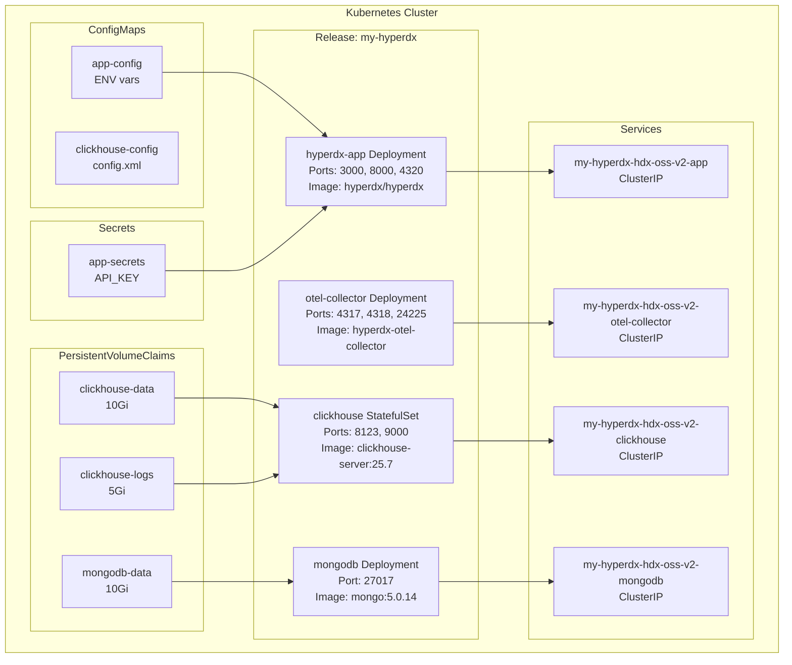
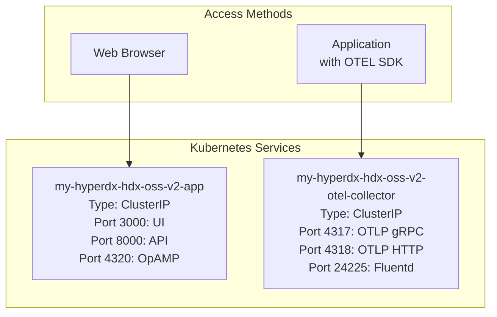
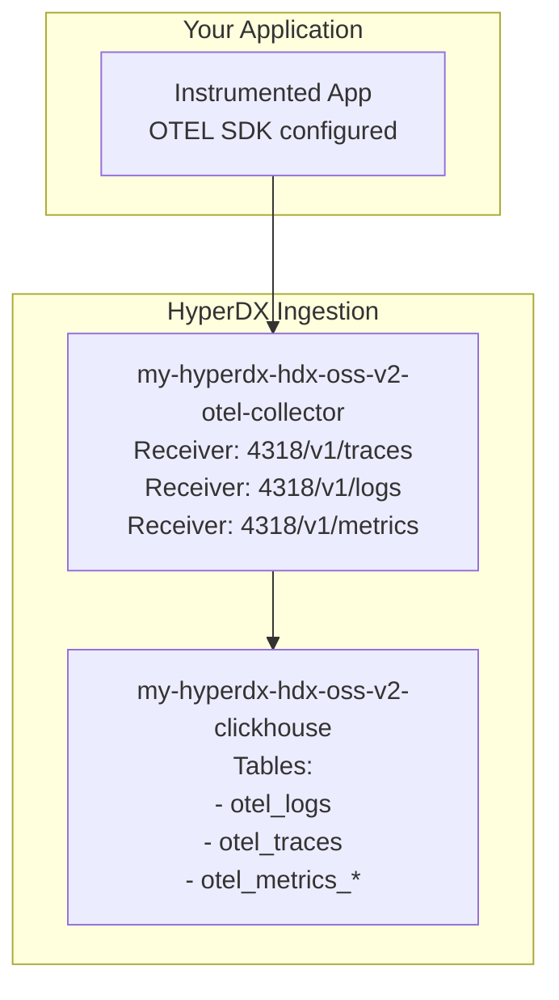
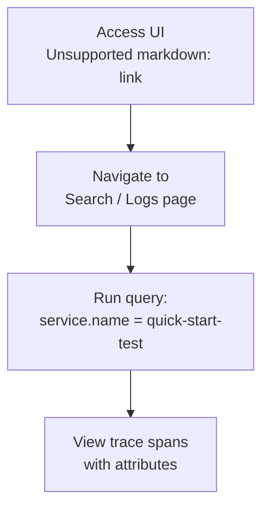

# Quick Start Guide

> **Relevant source files**
> * [README.md](https://github.com/hyperdxio/helm-charts/blob/845dd482/README.md)
> * [charts/hdx-oss-v2/templates/configmaps/app-configmap.yaml](https://github.com/hyperdxio/helm-charts/blob/845dd482/charts/hdx-oss-v2/templates/configmaps/app-configmap.yaml)
> * [charts/hdx-oss-v2/values.yaml](https://github.com/hyperdxio/helm-charts/blob/845dd482/charts/hdx-oss-v2/values.yaml)

This guide provides the fastest path to get HyperDX running on your Kubernetes cluster and sending your first telemetry data. It covers basic installation with default settings, accessing the UI, and verifying data ingestion. For detailed installation options and configuration, see [Installation](/hyperdxio/helm-charts/2.1-installation). For production deployment scenarios, see [Deployment Scenarios](/hyperdxio/helm-charts/4-deployment-scenarios).

## Prerequisites

Before starting, ensure you have the following:

| Requirement | Minimum Version | Purpose |
| --- | --- | --- |
| Helm | v3.0+ | Chart deployment manager |
| Kubernetes | v1.20+ | Container orchestration platform |
| kubectl | Compatible with cluster | Cluster interaction tool |
| Storage provisioner | Any | PVC creation for data persistence |

Verify your environment:

```markdown
# Check Helm version
helm version

# Check kubectl access
kubectl cluster-info

# Check available storage classes
kubectl get storageclass
```

**Sources:** [README.md L30-L34](https://github.com/hyperdxio/helm-charts/blob/845dd482/README.md#L30-L34)

## Default Full Stack Deployment

By default, this Helm chart deploys all components needed for a complete observability platform. Understanding what gets deployed helps troubleshoot issues and plan resource allocation.

### Components Deployed



**Sources:** [values.yaml L14-L18](https://github.com/hyperdxio/helm-charts/blob/845dd482/values.yaml#L14-L18)

 [values.yaml L256-L259](https://github.com/hyperdxio/helm-charts/blob/845dd482/values.yaml#L256-L259)

 [values.yaml L289-L293](https://github.com/hyperdxio/helm-charts/blob/845dd482/values.yaml#L289-L293)

 [values.yaml L368-L373](https://github.com/hyperdxio/helm-charts/blob/845dd482/values.yaml#L368-L373)

 [README.md L56-L68](https://github.com/hyperdxio/helm-charts/blob/845dd482/README.md#L56-L68)

## Installation Steps

### Step 1: Add Helm Repository

```sql
# Add the HyperDX Helm repository
helm repo add hyperdx https://hyperdxio.github.io/helm-charts

# Update repository index
helm repo update hyperdx
```

### Step 2: Install with Default Values

```markdown
# Install the chart (installs all components)
helm install my-hyperdx hyperdx/hdx-oss-v2

# Expected output:
# NAME: my-hyperdx
# LAST DEPLOYED: ...
# NAMESPACE: default
# STATUS: deployed
```

This creates a release named `my-hyperdx` in the `default` namespace with all components enabled.

**Sources:** [README.md L38-L52](https://github.com/hyperdxio/helm-charts/blob/845dd482/README.md#L38-L52)

### Step 3: Verify Deployment

```markdown
# Check pod status
kubectl get pods -l app.kubernetes.io/instance=my-hyperdx

# Expected pods:
# NAME                                              READY   STATUS
# my-hyperdx-hdx-oss-v2-app-xxxxxxxxx-xxxxx        1/1     Running
# my-hyperdx-hdx-oss-v2-clickhouse-0               1/1     Running
# my-hyperdx-hdx-oss-v2-mongodb-xxxxxxxxx-xxxxx    1/1     Running
# my-hyperdx-hdx-oss-v2-otel-collector-xxxx-xxxxx  1/1     Running
```

**Wait for all pods to reach `Running` status** before proceeding. This typically takes 1-3 minutes depending on image pull speeds.

**Sources:** [README.md L627-L631](https://github.com/hyperdxio/helm-charts/blob/845dd482/README.md#L627-L631)

## Accessing the HyperDX UI

### Service Architecture and Ports



**Sources:** [values.yaml L49-L51](https://github.com/hyperdxio/helm-charts/blob/845dd482/values.yaml#L49-L51)

 [values.yaml L400-L404](https://github.com/hyperdxio/helm-charts/blob/845dd482/values.yaml#L400-L404)

 [values.yaml L247-L254](https://github.com/hyperdxio/helm-charts/blob/845dd482/values.yaml#L247-L254)

### Option 1: Port Forwarding (Development)

```markdown
# Forward the UI port (3000)
kubectl port-forward service/my-hyperdx-hdx-oss-v2-app 3000:3000

# Access UI at: http://localhost:3000
```

Keep this terminal session open while accessing the UI.

### Option 2: LoadBalancer Service (Cloud)

For cloud environments (GKE, EKS, AKS):

```css
# Patch service to LoadBalancer type
kubectl patch service my-hyperdx-hdx-oss-v2-app -p '{"spec":{"type":"LoadBalancer"}}'

# Get external IP (may take a few minutes)
kubectl get service my-hyperdx-hdx-oss-v2-app

# Access UI at: http://<EXTERNAL-IP>:3000
```

### Option 3: Ingress (Production)

For production deployments, use Ingress with proper TLS. See [Ingress Configuration](/hyperdxio/helm-charts/3.6-ingress-configuration) for detailed setup.

**Sources:** [README.md L46-L50](https://github.com/hyperdxio/helm-charts/blob/845dd482/README.md#L46-L50)

 [values.yaml L207-L221](https://github.com/hyperdxio/helm-charts/blob/845dd482/values.yaml#L207-L221)

## Sending First Telemetry Data

### Understanding the Data Flow



**Sources:** [values.yaml L59-L60](https://github.com/hyperdxio/helm-charts/blob/845dd482/values.yaml#L59-L60)

 [values.yaml L402-L403](https://github.com/hyperdxio/helm-charts/blob/845dd482/values.yaml#L402-L403)

 [values.yaml L92-L201](https://github.com/hyperdxio/helm-charts/blob/845dd482/values.yaml#L92-L201)

### Configure OTEL Collector Endpoint

The OTEL Collector endpoint is constructed from the service name and port:

| Configuration Key | Default Value | Purpose |
| --- | --- | --- |
| `otel.httpPort` | `4318` | OTLP HTTP receiver port |
| `otel.grpcPort` | `4317` | OTLP gRPC receiver port |
| `hyperdx.otelExporterEndpoint` | `http://{{ release }}-otel-collector:4318` | Full endpoint URL |

For the default installation (`my-hyperdx`), the endpoint is:

```yaml
http://my-hyperdx-hdx-oss-v2-otel-collector:4318
```

**Sources:** [values.yaml L59-L60](https://github.com/hyperdxio/helm-charts/blob/845dd482/values.yaml#L59-L60)

 [values.yaml L402-L403](https://github.com/hyperdxio/helm-charts/blob/845dd482/values.yaml#L402-L403)

### Port Forward OTEL Collector

To send data from outside the cluster during testing:

```markdown
# Forward OTLP HTTP port
kubectl port-forward service/my-hyperdx-hdx-oss-v2-otel-collector 4318:4318

# Now applications can send to: http://localhost:4318
```

### Example: Send Test Traces

Using `curl` to send a test trace via OTLP HTTP:

```css
# Send a test trace
curl -X POST http://localhost:4318/v1/traces \
  -H "Content-Type: application/json" \
  -d '{
    "resourceSpans": [{
      "resource": {
        "attributes": [{
          "key": "service.name",
          "value": {"stringValue": "quick-start-test"}
        }]
      },
      "scopeSpans": [{
        "spans": [{
          "traceId": "5b8aa5a2d2c872e8321cf37308d69df2",
          "spanId": "051581bf3cb55c13",
          "name": "test-span",
          "kind": 1,
          "startTimeUnixNano": "1678886400000000000",
          "endTimeUnixNano": "1678886401000000000",
          "attributes": [{
            "key": "test.attribute",
            "value": {"stringValue": "quick-start"}
          }]
        }]
      }]
    }]
  }'
```

**Expected response:** HTTP 200 OK

### Example: Application Integration

For Node.js applications using OpenTelemetry:

```javascript
// Configure OTEL SDK
const { NodeSDK } = require('@opentelemetry/sdk-node');
const { OTLPTraceExporter } = require('@opentelemetry/exporter-trace-otlp-http');

const sdk = new NodeSDK({
  traceExporter: new OTLPTraceExporter({
    url: 'http://localhost:4318/v1/traces',
  }),
});

sdk.start();
```

For detailed application instrumentation, see [Integrating Applications](/hyperdxio/helm-charts/6.3-integrating-applications).

**Sources:** [values.yaml L402-L403](https://github.com/hyperdxio/helm-charts/blob/845dd482/values.yaml#L402-L403)

## Verifying Data Ingestion

### Step 1: Check OTEL Collector Logs

```markdown
# View OTEL collector logs
kubectl logs -l app.kubernetes.io/name=otel-collector

# Look for successful ingestion messages:
# "Traces" "Receiver accepted traces"
# "Exporter" "Data pushed to ClickHouse"
```

### Step 2: Query ClickHouse Directly

```sql
# Port forward ClickHouse HTTP port
kubectl port-forward service/my-hyperdx-hdx-oss-v2-clickhouse 8123:8123

# Query trace count
curl "http://localhost:8123/?query=SELECT%20count(*)%20FROM%20otel_traces&user=app&password=hyperdx"

# Query recent traces
curl "http://localhost:8123/?query=SELECT%20ServiceName,%20SpanName%20FROM%20otel_traces%20LIMIT%2010&user=app&password=hyperdx"
```

**Default ClickHouse credentials:**

* Username: `app` (from [values.yaml L98](https://github.com/hyperdxio/helm-charts/blob/845dd482/values.yaml#L98-L98) )
* Password: `hyperdx` (from [values.yaml L99](https://github.com/hyperdxio/helm-charts/blob/845dd482/values.yaml#L99-L99) )

**Sources:** [values.yaml L92-L101](https://github.com/hyperdxio/helm-charts/blob/845dd482/values.yaml#L92-L101)

 [values.yaml L290-L292](https://github.com/hyperdxio/helm-charts/blob/845dd482/values.yaml#L290-L292)

### Step 3: View Data in HyperDX UI



1. Open the HyperDX UI in your browser
2. Navigate to the **Search** or **Traces** page
3. Filter by `service.name = "quick-start-test"`
4. Verify your test trace appears with the correct span name and attributes

### Default Data Sources Configuration

The chart configures these default sources that query ClickHouse tables:

| Source Name | Kind | Table | Connection |
| --- | --- | --- | --- |
| `Logs` | `log` | `default.otel_logs` | `Local ClickHouse` |
| `Traces` | `trace` | `default.otel_traces` | `Local ClickHouse` |
| `Metrics` | `metric` | `default.otel_metrics_*` | `Local ClickHouse` |
| `Sessions` | `session` | `default.hyperdx_sessions` | `Local ClickHouse` |

**Sources:** [values.yaml L104-L202](https://github.com/hyperdxio/helm-charts/blob/845dd482/values.yaml#L104-L202)

## Configuration After Installation

### Setting the API Key

The default installation uses a placeholder API key: `xxxxxxxx-xxxx-xxxx-xxxx-xxxxxxxxxxxx` (from [values.yaml L48](https://github.com/hyperdxio/helm-charts/blob/845dd482/values.yaml#L48-L48)

).

After accessing the UI, generate a real API key:

1. Log into HyperDX dashboard
2. Navigate to **Team Settings**
3. Generate/retrieve your API key
4. Update the deployment:

```sql
# Update via Helm upgrade
helm upgrade my-hyperdx hyperdx/hdx-oss-v2 \
  --set hyperdx.apiKey="your-real-api-key-here"

# Restart pods to pick up new configuration
kubectl rollout restart deployment/my-hyperdx-hdx-oss-v2-app
kubectl rollout restart deployment/my-hyperdx-hdx-oss-v2-otel-collector
```

The API key is stored in the `my-hyperdx-hdx-oss-v2-app-secrets` secret and injected into pods as the `API_KEY` environment variable.

**Sources:** [values.yaml L48](https://github.com/hyperdxio/helm-charts/blob/845dd482/values.yaml#L48-L48)

 [README.md L239-L273](https://github.com/hyperdxio/helm-charts/blob/845dd482/README.md#L239-L273)

### Key Configuration Values

These values control the basic deployment behavior:

| Parameter | Default | Location | Purpose |
| --- | --- | --- | --- |
| `hyperdx.appPort` | `3000` | [values.yaml L50](https://github.com/hyperdxio/helm-charts/blob/845dd482/values.yaml#L50-L50) | UI port |
| `hyperdx.apiPort` | `8000` | [values.yaml L49](https://github.com/hyperdxio/helm-charts/blob/845dd482/values.yaml#L49-L49) | API port |
| `hyperdx.frontendUrl` | `http://localhost:3000` | [values.yaml L56](https://github.com/hyperdxio/helm-charts/blob/845dd482/values.yaml#L56-L56) | Browser-accessible URL |
| `hyperdx.logLevel` | `info` | [values.yaml L57](https://github.com/hyperdxio/helm-charts/blob/845dd482/values.yaml#L57-L57) | Application log verbosity |
| `otel.httpPort` | `4318` | [values.yaml L403](https://github.com/hyperdxio/helm-charts/blob/845dd482/values.yaml#L403-L403) | OTLP HTTP receiver |
| `clickhouse.persistence.enabled` | `true` | [values.yaml L347](https://github.com/hyperdxio/helm-charts/blob/845dd482/values.yaml#L347-L347) | Persistent storage |
| `mongodb.persistence.enabled` | `true` | [values.yaml L274](https://github.com/hyperdxio/helm-charts/blob/845dd482/values.yaml#L274-L274) | Persistent metadata storage |

**Sources:** [values.yaml L48-L61](https://github.com/hyperdxio/helm-charts/blob/845dd482/values.yaml#L48-L61)

 [values.yaml L346-L349](https://github.com/hyperdxio/helm-charts/blob/845dd482/values.yaml#L346-L349)

 [values.yaml L273-L275](https://github.com/hyperdxio/helm-charts/blob/845dd482/values.yaml#L273-L275)

## Resource Requirements

Default installation with no resource limits set. For production, configure resource requests/limits:

```yaml
# Example resource configuration
clickhouse:
  resources:
    requests:
      memory: "512Mi"
      cpu: "500m"
    limits:
      memory: "2Gi"
      cpu: "2000m"

otel:
  resources:
    requests:
      memory: "127Mi"
      cpu: "100m"
    limits:
      memory: "256Mi"
      cpu: "200m"
```

See [Resource Management](/hyperdxio/helm-charts/8.2-resource-management) for detailed tuning guidance.

**Sources:** [values.yaml L294-L302](https://github.com/hyperdxio/helm-charts/blob/845dd482/values.yaml#L294-L302)

 [values.yaml L374-L382](https://github.com/hyperdxio/helm-charts/blob/845dd482/values.yaml#L374-L382)

## Next Steps

Once HyperDX is running and ingesting data:

* **Production Configuration**: See [Deployment Scenarios](/hyperdxio/helm-charts/4-deployment-scenarios) for production-ready setups
* **External Databases**: Configure external ClickHouse ([External ClickHouse](/hyperdxio/helm-charts/4.2-external-clickhouse))
* **Ingress Setup**: Enable HTTPS access ([Ingress Configuration](/hyperdxio/helm-charts/3.6-ingress-configuration))
* **Application Integration**: Instrument your services ([Integrating Applications](/hyperdxio/helm-charts/6.3-integrating-applications))
* **Alert Configuration**: Enable scheduled tasks ([Scheduled Tasks Configuration](/hyperdxio/helm-charts/3.7-scheduled-tasks-configuration))
* **Monitoring**: Set up health checks ([Health Checks and Monitoring](/hyperdxio/helm-charts/8.1-health-checks-and-monitoring))
* **Troubleshooting**: Debug common issues ([Troubleshooting](/hyperdxio/helm-charts/8.4-troubleshooting))

**Sources:** [README.md L54-L68](https://github.com/hyperdxio/helm-charts/blob/845dd482/README.md#L54-L68)

 [README.md L236-L335](https://github.com/hyperdxio/helm-charts/blob/845dd482/README.md#L236-L335)