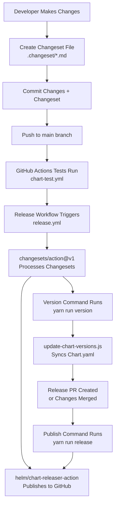
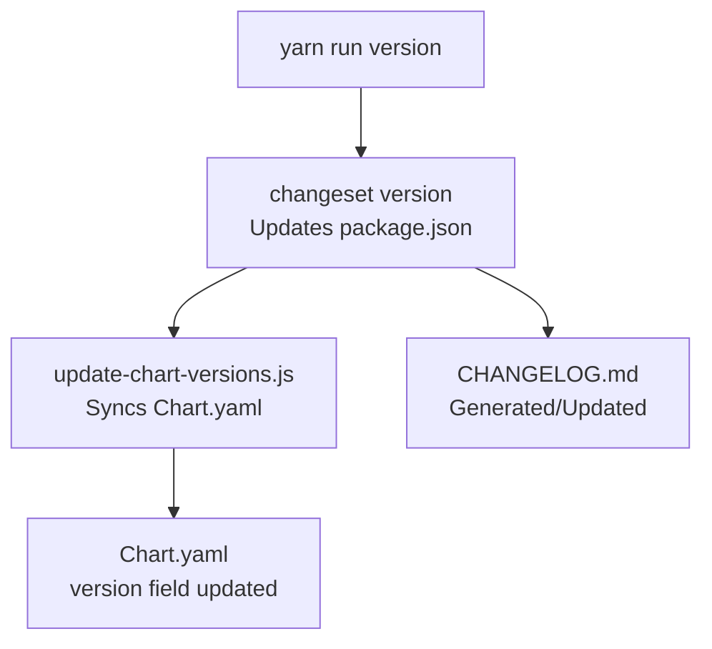
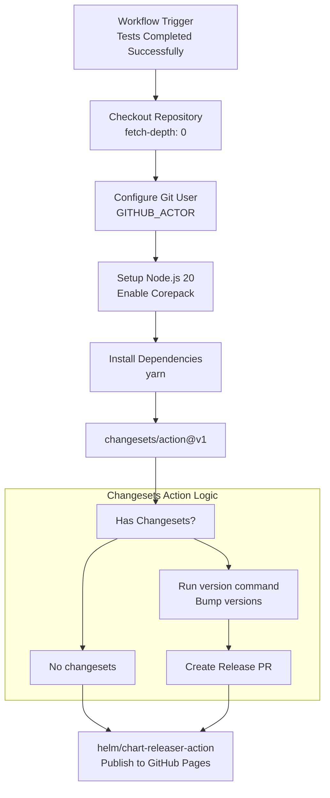
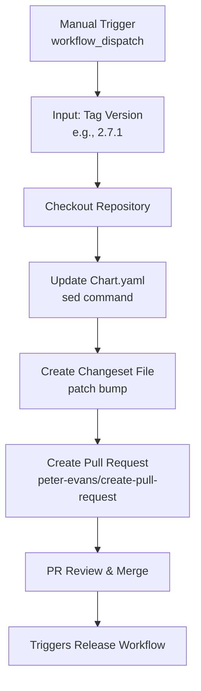
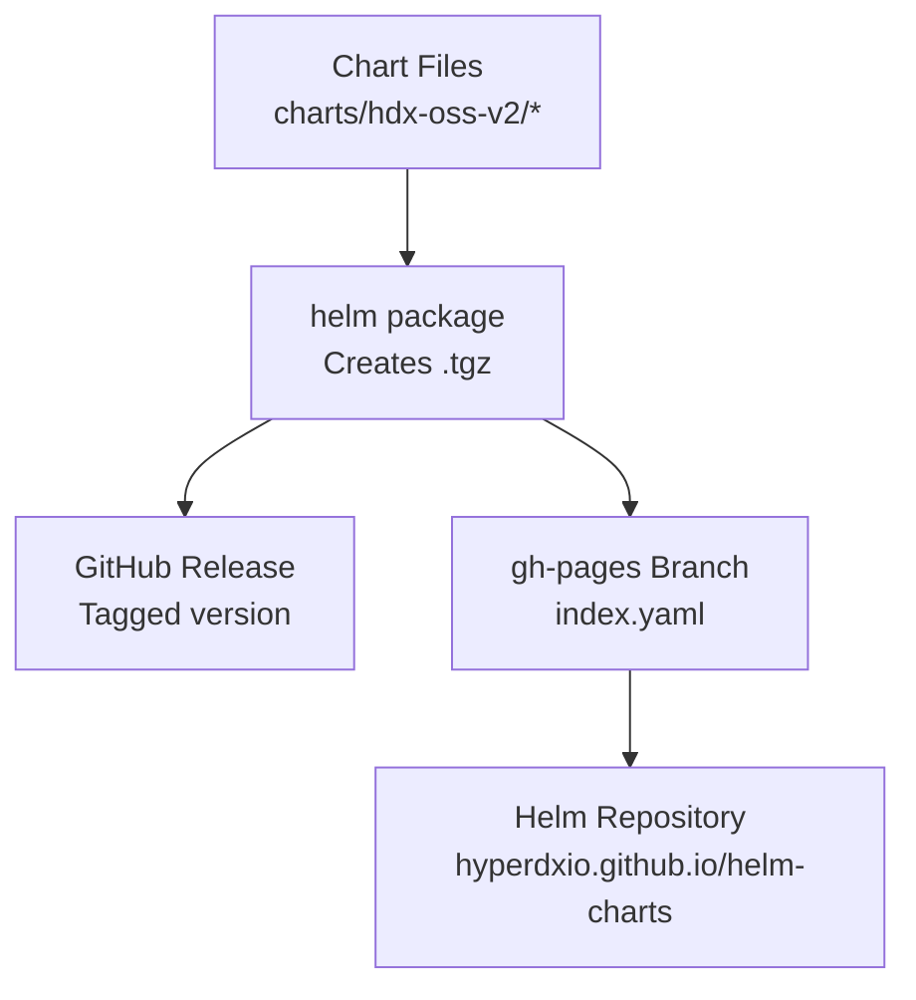

# Release Management

> **Relevant source files**
> * [.github/workflows/release.yml](https://github.com/hyperdxio/helm-charts/blob/845dd482/.github/workflows/release.yml)
> * [.github/workflows/update-app-version.yml](https://github.com/hyperdxio/helm-charts/blob/845dd482/.github/workflows/update-app-version.yml)
> * [charts/hdx-oss-v2/tests/helpers_test.yaml](https://github.com/hyperdxio/helm-charts/blob/845dd482/charts/hdx-oss-v2/tests/helpers_test.yaml)
> * [package.json](https://github.com/hyperdxio/helm-charts/blob/845dd482/package.json)

## Purpose and Scope

This document describes the release management system for the HyperDX Helm Charts repository, including version management, release workflows, and chart publishing. It covers how changes are tracked, versions are bumped, and charts are published to GitHub Releases and the Helm repository.

For information about testing releases before publication, see [Testing](/hyperdxio/helm-charts/9.2-testing). For details about CI/CD pipeline execution, see [CI/CD Pipeline](/hyperdxio/helm-charts/9.4-cicd-pipeline). For chart packaging and metadata, see [Chart Metadata and Packaging](/hyperdxio/helm-charts/9.5-chart-metadata-and-packaging).

## Version Management System

The HyperDX Helm Charts repository uses a dual-versioning system managed through the `@changesets/cli` package and custom automation.

### Chart Version vs AppVersion

The repository maintains two distinct version numbers:

| Version Type | Purpose | Example | Defined In |
| --- | --- | --- | --- |
| **Chart Version** | Version of the Helm chart packaging and templates | `0.8.4` | `charts/hdx-oss-v2/Chart.yaml` |
| **AppVersion** | Version of the HyperDX application being deployed | `2.7.1` | `charts/hdx-oss-v2/Chart.yaml` |

**Chart Version** changes when:

* Template modifications are made
* Configuration options are added or changed
* Kubernetes resource definitions are updated
* Chart dependencies are modified

**AppVersion** changes when:

* A new version of the HyperDX application is released
* Container image tags need to be updated

Sources: [package.json L1-L19](https://github.com/hyperdxio/helm-charts/blob/845dd482/package.json#L1-L19)

 [charts/hdx-oss-v2/tests/helpers_test.yaml L45-L49](https://github.com/hyperdxio/helm-charts/blob/845dd482/charts/hdx-oss-v2/tests/helpers_test.yaml#L45-L49)

### Changesets Workflow

The repository uses the `@changesets/cli` package to manage version bumping and changelog generation. Changesets provide a declarative way to describe changes and their semantic versioning impact.



Sources: [package.json L9-L12](https://github.com/hyperdxio/helm-charts/blob/845dd482/package.json#L9-L12)

 [.github/workflows/release.yml L1-L51](https://github.com/hyperdxio/helm-charts/blob/845dd482/.github/workflows/release.yml#L1-L51)

## Creating a Release

### Creating Changeset Files

When making changes to the Helm chart, developers create a changeset file in the `.changeset/` directory. Each changeset describes the change and specifies the semantic versioning bump type.

**Changeset File Format:**

```
---
"helm-charts": patch
---

Brief description of the change
```

The version bump type can be:

* `major` - Breaking changes (e.g., removed configuration options)
* `minor` - New features (e.g., new configuration options)
* `patch` - Bug fixes and minor updates

**Example from update-app-version workflow:**

```sql
---
"helm-charts": patch
---

chore: update appVersion to 2.7.1
```

Sources: [.github/workflows/update-app-version.yml L28-L37](https://github.com/hyperdxio/helm-charts/blob/845dd482/.github/workflows/update-app-version.yml#L28-L37)

### Version Bumping Process

The version bumping process is automated through npm scripts:



**Script Command:**
[package.json L11](https://github.com/hyperdxio/helm-charts/blob/845dd482/package.json#L11-L11)

```sql
"version": "changeset version && npm run update-chart-versions"
```

The `update-chart-versions.js` script reads the version from `package.json` and synchronizes it to `Chart.yaml`, ensuring consistency between npm versioning and Helm chart versioning.

Sources: [package.json L11-L12](https://github.com/hyperdxio/helm-charts/blob/845dd482/package.json#L11-L12)

 [.github/workflows/release.yml L42](https://github.com/hyperdxio/helm-charts/blob/845dd482/.github/workflows/release.yml#L42-L42)

## Automated Release Workflow

### Workflow Trigger

The release workflow triggers automatically after successful test runs on the `main` branch:

[.github/workflows/release.yml L2-L8](https://github.com/hyperdxio/helm-charts/blob/845dd482/.github/workflows/release.yml#L2-L8)

```yaml
on:
  workflow_run:
    workflows: ["Helm Chart Tests", "Helm Chart Integration Test"]
    types:
      - completed
    branches:
      - main
```

This ensures that only tested changes proceed to release.

### Release Workflow Steps



**Key Steps:**

1. **Git Configuration** [.github/workflows/release.yml L24-L27](https://github.com/hyperdxio/helm-charts/blob/845dd482/.github/workflows/release.yml#L24-L27) * Sets up Git user for commits using `GITHUB_ACTOR`
2. **Changesets Action** [.github/workflows/release.yml L36-L45](https://github.com/hyperdxio/helm-charts/blob/845dd482/.github/workflows/release.yml#L36-L45) * Processes changeset files * Runs `yarn run version` to bump versions * Runs `yarn run release` to publish * Creates or updates release PR
3. **Chart Releaser** [.github/workflows/release.yml L46-L50](https://github.com/hyperdxio/helm-charts/blob/845dd482/.github/workflows/release.yml#L46-L50) * Runs only when no pending changesets exist * Packages Helm chart * Creates GitHub Release * Updates Helm repository index on GitHub Pages

Sources: [.github/workflows/release.yml L1-L51](https://github.com/hyperdxio/helm-charts/blob/845dd482/.github/workflows/release.yml#L1-L51)

## Manual AppVersion Updates

### Update App Version Workflow

A separate workflow allows manual updates to the `appVersion` field without changing the chart version. This is useful when a new HyperDX application version is released but chart templates haven't changed.

**Workflow Dispatch:**
[.github/workflows/update-app-version.yml L4-L9](https://github.com/hyperdxio/helm-charts/blob/845dd482/.github/workflows/update-app-version.yml#L4-L9)

```sql
on:
  workflow_dispatch:
    inputs:
      tag:
        description: 'Tag to update appVersion to'
        required: true
        type: string
```



**Update Process:**

1. **Modify Chart.yaml** [.github/workflows/update-app-version.yml L24-L26](https://github.com/hyperdxio/helm-charts/blob/845dd482/.github/workflows/update-app-version.yml#L24-L26) ``` sed -i "s/^appVersion: .*/appVersion: ${{ github.event.inputs.tag }}/" \   charts/hdx-oss-v2/Chart.yaml ```
2. **Generate Changeset** [.github/workflows/update-app-version.yml L28-L37](https://github.com/hyperdxio/helm-charts/blob/845dd482/.github/workflows/update-app-version.yml#L28-L37) * Creates a changeset file with `patch` bump * Describes the appVersion update
3. **Create PR** [.github/workflows/update-app-version.yml L39-L50](https://github.com/hyperdxio/helm-charts/blob/845dd482/.github/workflows/update-app-version.yml#L39-L50) * Uses `peter-evans/create-pull-request@v5` * Creates a branch named `update-app-version-{tag}` * Includes updated `Chart.yaml` and changeset file

Sources: [.github/workflows/update-app-version.yml L1-L51](https://github.com/hyperdxio/helm-charts/blob/845dd482/.github/workflows/update-app-version.yml#L1-L51)

## Chart Publishing

### Publishing Destinations

The release workflow publishes charts to two locations:

| Destination | Purpose | Access Method |
| --- | --- | --- |
| **GitHub Releases** | Official release artifacts | Download from GitHub Releases page |
| **GitHub Pages** | Helm repository | `helm repo add` with GitHub Pages URL |

### Helm Chart Releaser Action

The `helm/chart-releaser-action@v1.7.0` handles packaging and publishing:

[.github/workflows/release.yml L46-L50](https://github.com/hyperdxio/helm-charts/blob/845dd482/.github/workflows/release.yml#L46-L50)

```yaml
- name: Run chart-releaser job
  if: steps.changesets.outputs.hasChangesets == 'false'
  uses: helm/chart-releaser-action@v1.7.0
  env:
    CR_TOKEN: "${{ secrets.GITHUB_TOKEN }}"
```

**Chart Releaser Functions:**

1. Packages the Helm chart into a `.tgz` archive
2. Creates a GitHub Release with the chart artifact
3. Updates the `index.yaml` file in the `gh-pages` branch
4. Makes the chart available via the Helm repository URL



Sources: [.github/workflows/release.yml L46-L50](https://github.com/hyperdxio/helm-charts/blob/845dd482/.github/workflows/release.yml#L46-L50)

## Version Synchronization

### Chart Version Consistency

The `update-chart-versions.js` script ensures version consistency across the repository:

**Files Synchronized:**

* `package.json` - npm package version (source of truth after changesets)
* `charts/hdx-oss-v2/Chart.yaml` - Helm chart version field

**Execution Context:**
[package.json L12](https://github.com/hyperdxio/helm-charts/blob/845dd482/package.json#L12-L12)

```sql
"update-chart-versions": "node scripts/update-chart-versions.js"
```

This script is called as part of the `version` script, immediately after `changeset version` updates `package.json`.

### Version Validation in Tests

The test suite validates that chart versions follow semantic versioning:

[charts/hdx-oss-v2/tests/helpers_test.yaml L45-L49](https://github.com/hyperdxio/helm-charts/blob/845dd482/charts/hdx-oss-v2/tests/helpers_test.yaml#L45-L49)

```yaml
- it: should render chart version in labels when available
  asserts:
    - matchRegex:
        path: metadata.labels["app.kubernetes.io/version"]
        pattern: ^\d+\.\d+\.\d+$
```

This ensures deployed resources correctly reflect the chart version in their metadata labels.

Sources: [package.json L12](https://github.com/hyperdxio/helm-charts/blob/845dd482/package.json#L12-L12)

 [charts/hdx-oss-v2/tests/helpers_test.yaml L45-L49](https://github.com/hyperdxio/helm-charts/blob/845dd482/charts/hdx-oss-v2/tests/helpers_test.yaml#L45-L49)

## Release Checklist

### For Chart Changes

1. Make changes to chart templates or configuration
2. Create a changeset file in `.changeset/` directory
3. Commit changes including the changeset
4. Push to `main` branch
5. Wait for tests to pass
6. Review auto-generated release PR
7. Merge release PR to trigger publication

### For AppVersion Updates

1. Navigate to GitHub Actions
2. Trigger "Update App Version" workflow
3. Input the new application version tag
4. Review the auto-generated PR
5. Merge PR to trigger chart publication

### Post-Release Verification

After a successful release:

1. Verify GitHub Release created with correct tag
2. Check that chart `.tgz` artifact is attached
3. Confirm `index.yaml` updated in `gh-pages` branch
4. Test chart installation from Helm repository: ```sql helm repo update helm search repo hdx-oss-v2 ```

Sources: [.github/workflows/release.yml L1-L51](https://github.com/hyperdxio/helm-charts/blob/845dd482/.github/workflows/release.yml#L1-L51)

 [.github/workflows/update-app-version.yml L1-L51](https://github.com/hyperdxio/helm-charts/blob/845dd482/.github/workflows/update-app-version.yml#L1-L51)