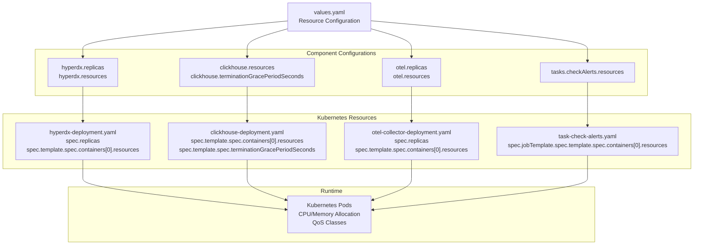
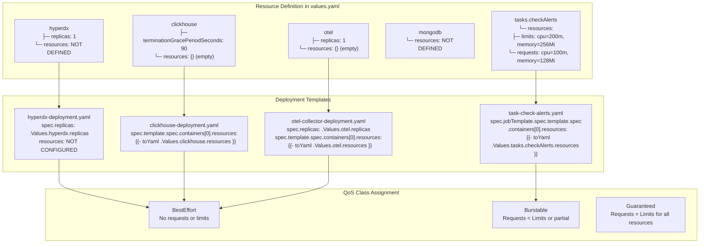
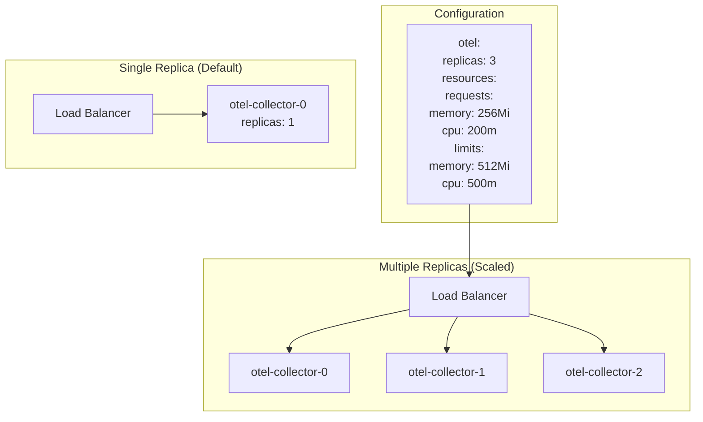
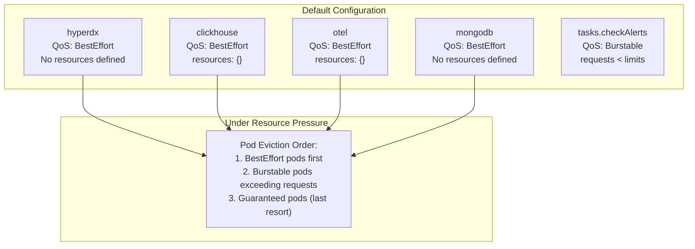
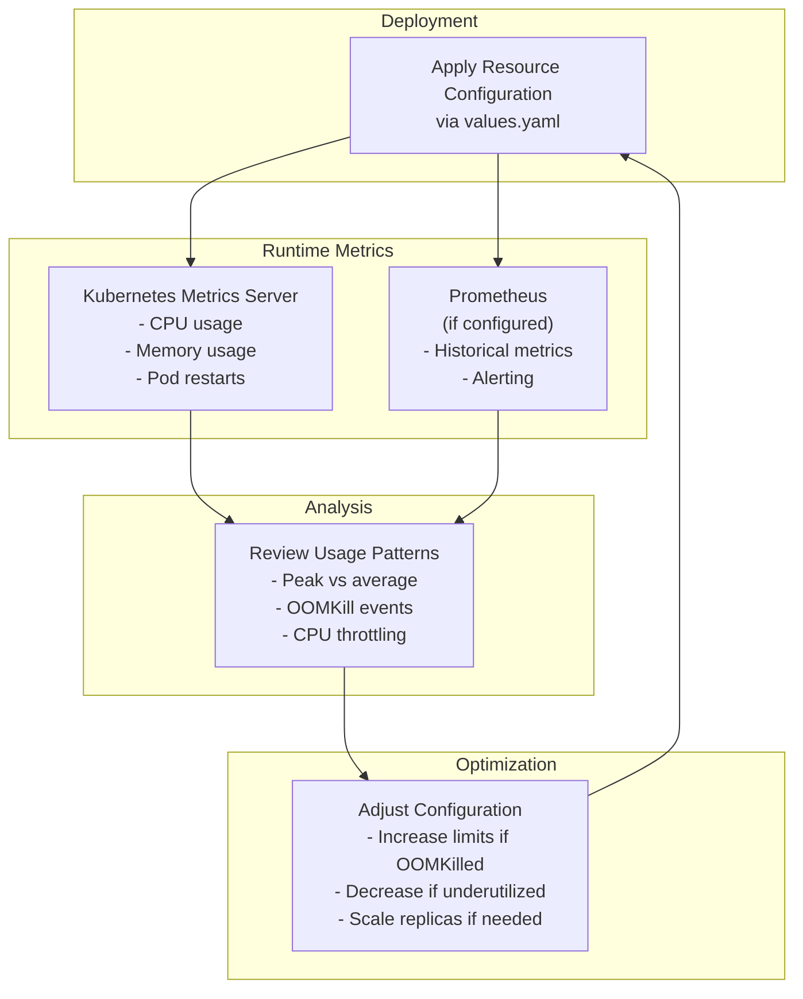

# Resource Management

> **Relevant source files**
> * [CHANGELOG.md](https://github.com/hyperdxio/helm-charts/blob/845dd482/CHANGELOG.md)
> * [charts/hdx-oss-v2/tests/otel-collector_test.yaml](https://github.com/hyperdxio/helm-charts/blob/845dd482/charts/hdx-oss-v2/tests/otel-collector_test.yaml)
> * [charts/hdx-oss-v2/values.yaml](https://github.com/hyperdxio/helm-charts/blob/845dd482/charts/hdx-oss-v2/values.yaml)

This document describes how to configure CPU and memory resources for all HyperDX components deployed via the Helm chart. It covers resource requests and limits, replica scaling, and optimization strategies for production deployments.

For monitoring resource usage and health checks, see [Health Checks and Monitoring](/hyperdxio/helm-charts/8.1-health-checks-and-monitoring). For persistent storage configuration, see [Persistence and Backups](/hyperdxio/helm-charts/8.3-persistence-and-backups).

## Overview

Resource management in the HyperDX Helm chart is configured through the `values.yaml` file using Kubernetes resource specifications. Each component (HyperDX application, ClickHouse, OTEL Collector, MongoDB, and scheduled tasks) can have independently configured resource constraints and replica counts.

By default, most components have empty resource configurations (`{}`), meaning they have no explicit CPU or memory limits. This allows for flexible testing but should be configured for production deployments to ensure stability and prevent resource contention.

**Resource Configuration Flow**



Sources: [charts/hdx-oss-v2/values.yaml L241-L476](https://github.com/hyperdxio/helm-charts/blob/845dd482/charts/hdx-oss-v2/values.yaml#L241-L476)

## Component Resource Configuration

### HyperDX Application

The HyperDX application deployment includes the UI (port 3000), API (port 8000), and OpAMP server (port 4320) in a single container. Resource configuration is not defined by default in `values.yaml`, meaning no limits are applied.

**Configuration Location:** [charts/hdx-oss-v2/values.yaml L14-L255](https://github.com/hyperdxio/helm-charts/blob/845dd482/charts/hdx-oss-v2/values.yaml#L14-L255)

**Replica Configuration:**

```yaml
hyperdx:
  replicas: 1
```

The HyperDX application does not expose a dedicated `resources` field in the default `values.yaml`. To add resource limits, you can extend the Deployment template or use `hyperdx.env` for advanced configurations.

**Recommended Production Settings:**

```markdown
# Not directly supported in values.yaml - requires template modification
# Recommended for production:
# requests:
#   memory: "512Mi"
#   cpu: "500m"
# limits:
#   memory: "2Gi"
#   cpu: "2000m"
```

**Pod Disruption Budget:**

The HyperDX application supports Pod Disruption Budget configuration for high availability scenarios:

```yaml
hyperdx:
  podDisruptionBudget:
    enabled: false
```

When enabled, this ensures a minimum number of pods remain available during voluntary disruptions like node drains or upgrades.

Sources: [charts/hdx-oss-v2/values.yaml L241-L245](https://github.com/hyperdxio/helm-charts/blob/845dd482/charts/hdx-oss-v2/values.yaml#L241-L245)

### ClickHouse

ClickHouse is the primary data store for logs, traces, and metrics. It is resource-intensive and should have explicit resource limits in production environments.

**Configuration Location:** [charts/hdx-oss-v2/values.yaml L289-L367](https://github.com/hyperdxio/helm-charts/blob/845dd482/charts/hdx-oss-v2/values.yaml#L289-L367)

**Resource Configuration:**

```css
clickhouse:
  terminationGracePeriodSeconds: 90
  resources:
    {}
    # Example:
    # requests:
    #   memory: "512Mi"
    #   cpu: "500m"
    # limits:
    #   memory: "2Gi"
    #   cpu: "2000m"
```

**Key Configuration Options:**

| Field | Default | Description |
| --- | --- | --- |
| `terminationGracePeriodSeconds` | `90` | Time to wait for graceful shutdown before forcing termination |
| `resources.requests.memory` | Not set | Memory reservation for pod scheduling |
| `resources.requests.cpu` | Not set | CPU reservation for pod scheduling |
| `resources.limits.memory` | Not set | Maximum memory before OOMKill |
| `resources.limits.cpu` | Not set | Maximum CPU throttling threshold |

**Production Recommendations:**

For ClickHouse, resource limits are critical because:

1. Query execution can consume significant memory
2. Background merges and compactions are CPU-intensive
3. Insufficient resources can lead to query timeouts or data loss

Recommended starting point for production:

```yaml
clickhouse:
  resources:
    requests:
      memory: "2Gi"
      cpu: "1000m"
    limits:
      memory: "8Gi"
      cpu: "4000m"
```

Scale based on:

* Number of ingested events per second
* Query complexity and frequency
* Retention period and data volume
* Number of concurrent queries

Sources: [charts/hdx-oss-v2/values.yaml L289-L334](https://github.com/hyperdxio/helm-charts/blob/845dd482/charts/hdx-oss-v2/values.yaml#L289-L334)

### OpenTelemetry Collector

The OTEL Collector receives, processes, and exports telemetry data. Resource configuration affects throughput and latency.

**Configuration Location:** [charts/hdx-oss-v2/values.yaml L368-L464](https://github.com/hyperdxio/helm-charts/blob/845dd482/charts/hdx-oss-v2/values.yaml#L368-L464)

**Resource Configuration:**

```css
otel:
  replicas: 1
  resources:
    {}
    # Example:
    # requests:
    #   memory: "127Mi"
    #   cpu: "100m"
    # limits:
    #   memory: "256Mi"
    #   cpu: "200m"
```

**Key Configuration Options:**

| Field | Default | Description |
| --- | --- | --- |
| `otel.replicas` | `1` | Number of OTEL Collector instances |
| `otel.resources.requests.memory` | Not set | Memory reservation |
| `otel.resources.requests.cpu` | Not set | CPU reservation |
| `otel.resources.limits.memory` | Not set | Maximum memory |
| `otel.resources.limits.cpu` | Not set | Maximum CPU |

**Scaling Considerations:**

The OTEL Collector can be scaled horizontally by increasing `replicas`. When using multiple replicas:

* Telemetry sources should be load-balanced across instances
* Each instance processes data independently
* State is not shared between replicas

**Production Recommendations:**

```yaml
otel:
  replicas: 2  # For high availability
  resources:
    requests:
      memory: "256Mi"
      cpu: "200m"
    limits:
      memory: "512Mi"
      cpu: "500m"
```

Adjust based on:

* Telemetry data volume (events per second)
* Number of processors in pipeline
* Batch sizes and flush intervals
* Number of exporters

Sources: [charts/hdx-oss-v2/values.yaml L368-L464](https://github.com/hyperdxio/helm-charts/blob/845dd482/charts/hdx-oss-v2/values.yaml#L368-L464)

 [charts/hdx-oss-v2/tests/otel-collector_test.yaml L526-L647](https://github.com/hyperdxio/helm-charts/blob/845dd482/charts/hdx-oss-v2/tests/otel-collector_test.yaml#L526-L647)

### MongoDB

MongoDB stores HyperDX metadata including user configurations, alert definitions, and dashboard settings. Resource requirements are typically lower than ClickHouse.

**Configuration Location:** [charts/hdx-oss-v2/values.yaml L256-L287](https://github.com/hyperdxio/helm-charts/blob/845dd482/charts/hdx-oss-v2/values.yaml#L256-L287)

MongoDB does not expose explicit `resources` or `replicas` fields in the default `values.yaml`. The deployment uses the standard MongoDB container image with default resource allocations.

**Recommended Production Settings:**

```markdown
# Not directly supported in values.yaml - requires template modification
# Recommended for production:
# requests:
#   memory: "256Mi"
#   cpu: "200m"
# limits:
#   memory: "1Gi"
#   cpu: "1000m"
```

MongoDB resource requirements depend on:

* Number of users and teams
* Number of dashboards and saved queries
* Alert rule complexity
* Session storage volume

Sources: [charts/hdx-oss-v2/values.yaml L256-L287](https://github.com/hyperdxio/helm-charts/blob/845dd482/charts/hdx-oss-v2/values.yaml#L256-L287)

### Scheduled Tasks

Scheduled tasks run as Kubernetes CronJobs and include operations like alert checking. Unlike long-running services, these have default resource limits configured.

**Configuration Location:** [charts/hdx-oss-v2/values.yaml L466-L476](https://github.com/hyperdxio/helm-charts/blob/845dd482/charts/hdx-oss-v2/values.yaml#L466-L476)

**Resource Configuration:**

```yaml
tasks:
  enabled: false
  checkAlerts:
    schedule: "*/1 * * * *"  # Runs every 1 minute
    resources:
      limits:
        cpu: 200m
        memory: 256Mi
      requests:
        cpu: 100m
        memory: 128Mi
```

**Key Configuration Options:**

| Field | Default | Description |
| --- | --- | --- |
| `tasks.enabled` | `false` | Enable external scheduled task execution |
| `tasks.checkAlerts.schedule` | `"*/1 * * * *"` | Cron schedule expression |
| `tasks.checkAlerts.resources.limits.cpu` | `200m` | Maximum CPU |
| `tasks.checkAlerts.resources.limits.memory` | `256Mi` | Maximum memory |
| `tasks.checkAlerts.resources.requests.cpu` | `100m` | CPU reservation |
| `tasks.checkAlerts.resources.requests.memory` | `128Mi` | Memory reservation |

**Important Notes:**

1. Scheduled tasks are disabled by default (`enabled: false`)
2. When enabled, tasks run externally to avoid duplicate execution with in-app cron
3. Resource limits prevent runaway jobs from affecting cluster stability
4. Failed jobs are retained for debugging (Kubernetes default: 1 failed job)

Sources: [charts/hdx-oss-v2/values.yaml L466-L476](https://github.com/hyperdxio/helm-charts/blob/845dd482/charts/hdx-oss-v2/values.yaml#L466-L476)

## Resource Configuration Patterns

**Component Resource Matrix**



Sources: [charts/hdx-oss-v2/values.yaml L241-L476](https://github.com/hyperdxio/helm-charts/blob/845dd482/charts/hdx-oss-v2/values.yaml#L241-L476)

## Replica Scaling

### Horizontal Scaling Support

Only specific components support horizontal scaling through replica configuration:

**HyperDX Application:**

```yaml
hyperdx:
  replicas: 1
```

Scaling considerations:

* Sessions may require sticky sessions or external session storage
* All replicas share the same MongoDB and ClickHouse backends
* Ingress should load balance across replicas

**OTEL Collector:**

```yaml
otel:
  replicas: 1
```

Scaling considerations:

* Stateless processing allows unlimited horizontal scaling
* Each replica independently receives and processes telemetry
* Load balancer should distribute traffic across replicas
* No coordination required between replicas

**Components Without Replica Support:**

| Component | Reason | Alternative |
| --- | --- | --- |
| ClickHouse | Single-node deployment | Use external ClickHouse cluster with sharding |
| MongoDB | Single-node deployment | Use external MongoDB replica set |
| Scheduled Tasks | CronJob runs single instance | Controlled by CronJob concurrencyPolicy |

**Horizontal Scaling Example**



Sources: [charts/hdx-oss-v2/values.yaml L241](https://github.com/hyperdxio/helm-charts/blob/845dd482/charts/hdx-oss-v2/values.yaml#L241-L241)

 [charts/hdx-oss-v2/values.yaml L373](https://github.com/hyperdxio/helm-charts/blob/845dd482/charts/hdx-oss-v2/values.yaml#L373-L373)

 [charts/hdx-oss-v2/tests/otel-collector_test.yaml L526-L557](https://github.com/hyperdxio/helm-charts/blob/845dd482/charts/hdx-oss-v2/tests/otel-collector_test.yaml#L526-L557)

## Resource Optimization Strategies

### Quality of Service (QoS) Classes

Kubernetes assigns QoS classes based on resource configuration:

| QoS Class | Criteria | Default Components | Priority |
| --- | --- | --- | --- |
| **Guaranteed** | requests = limits for CPU and memory | `tasks.checkAlerts` (when configured correctly) | Highest |
| **Burstable** | requests < limits or only requests set | Most components when resources configured | Medium |
| **BestEffort** | No requests or limits | HyperDX, ClickHouse, OTEL (default) | Lowest |

**Default QoS Assignment:**



### Production Resource Configuration

For production deployments, configure explicit resource limits to ensure:

1. **Predictable performance** - Resources are guaranteed
2. **Stability** - Prevents resource exhaustion
3. **Cost control** - Efficient resource utilization
4. **Proper QoS** - Higher priority during resource pressure

**Recommended Production Configuration:**

```yaml
hyperdx:
  replicas: 2
  # Note: Direct resource configuration not supported in values.yaml
  # Consider template modification or use external workload definitions

clickhouse:
  terminationGracePeriodSeconds: 90
  resources:
    requests:
      memory: "2Gi"
      cpu: "1000m"
    limits:
      memory: "8Gi"
      cpu: "4000m"

otel:
  replicas: 2
  resources:
    requests:
      memory: "256Mi"
      cpu: "200m"
    limits:
      memory: "512Mi"
      cpu: "500m"

tasks:
  enabled: true
  checkAlerts:
    schedule: "*/1 * * * *"
    resources:
      requests:
        cpu: 100m
        memory: 128Mi
      limits:
        cpu: 200m
        memory: 256Mi
```

### Resource Request vs Limit Guidelines

**Resource Requests:**

* Used for pod scheduling decisions
* Guaranteed minimum resources
* Should reflect steady-state usage
* Set conservatively to avoid resource waste

**Resource Limits:**

* Maximum resources pod can consume
* CPU: Throttled when limit reached
* Memory: Pod OOMKilled when limit exceeded
* Should account for peak usage and bursts

**Recommended Ratio:**

| Component | CPU Ratio (limit/request) | Memory Ratio (limit/request) | Reasoning |
| --- | --- | --- | --- |
| ClickHouse | 2-4x | 2-4x | Query spikes, background merges |
| OTEL Collector | 2-3x | 2x | Batch processing, buffer accumulation |
| HyperDX App | 2-4x | 2-3x | User query bursts, API traffic spikes |
| Scheduled Tasks | 2x | 2x | Short-lived, predictable workload |

### Memory Management

**ClickHouse Memory Considerations:**

ClickHouse memory usage patterns:

* Query execution memory
* Background merge operations
* Buffer pools and caches
* Connection overhead

Configure `terminationGracePeriodSeconds` to allow in-flight queries to complete during shutdown:

```yaml
clickhouse:
  terminationGracePeriodSeconds: 90  # Default, increase for long-running queries
```

**OTEL Collector Memory Management:**

The OTEL Collector uses memory for:

* Receive buffers for incoming telemetry
* Batch processing queues
* Export buffers to ClickHouse

Memory pressure can cause:

* Dropped telemetry data
* Increased latency
* Backpressure to telemetry sources

Monitor memory usage and scale when approaching limits.

Sources: [charts/hdx-oss-v2/values.yaml L293](https://github.com/hyperdxio/helm-charts/blob/845dd482/charts/hdx-oss-v2/values.yaml#L293-L293)

### Node Affinity and Tolerations

All major components support `nodeSelector` and `tolerations` for advanced scheduling:

**HyperDX Application:**

```css
hyperdx:
  nodeSelector:
    {}
    # Example:
    # kubernetes.io/os: linux
    # node-role.kubernetes.io/worker: "true"
  tolerations:
    []
    # Example:
    # - key: "key1"
    #   operator: "Equal"
    #   value: "value1"
    #   effect: "NoSchedule"
```

**ClickHouse:**

```yaml
clickhouse:
  nodeSelector:
    {}
  tolerations:
    []
```

**OTEL Collector:**

```yaml
otel:
  nodeSelector:
    {}
  tolerations:
    []
```

**MongoDB:**

```yaml
mongodb:
  nodeSelector:
    {}
  tolerations:
    []
```

Use cases:

* Schedule resource-intensive components (ClickHouse) on larger nodes
* Isolate production workloads from development
* Utilize GPU or specialized hardware nodes
* Handle tainted nodes in mixed workload clusters

Sources: [charts/hdx-oss-v2/values.yaml L35-L47](https://github.com/hyperdxio/helm-charts/blob/845dd482/charts/hdx-oss-v2/values.yaml#L35-L47)

 [charts/hdx-oss-v2/values.yaml L261-L272](https://github.com/hyperdxio/helm-charts/blob/845dd482/charts/hdx-oss-v2/values.yaml#L261-L272)

 [charts/hdx-oss-v2/values.yaml L322-L334](https://github.com/hyperdxio/helm-charts/blob/845dd482/charts/hdx-oss-v2/values.yaml#L322-L334)

 [charts/hdx-oss-v2/values.yaml L387-L399](https://github.com/hyperdxio/helm-charts/blob/845dd482/charts/hdx-oss-v2/values.yaml#L387-L399)

## Testing Resource Configuration

The Helm chart includes comprehensive unit tests validating resource configuration behavior:

**Resource Configuration Tests:**

1. **Replica Count Tests** - [charts/hdx-oss-v2/tests/otel-collector_test.yaml L526-L557](https://github.com/hyperdxio/helm-charts/blob/845dd482/charts/hdx-oss-v2/tests/otel-collector_test.yaml#L526-L557) * Validates default replica count of 1 * Verifies custom replica counts are applied correctly
2. **Resource Limits Tests** - [charts/hdx-oss-v2/tests/otel-collector_test.yaml L559-L647](https://github.com/hyperdxio/helm-charts/blob/845dd482/charts/hdx-oss-v2/tests/otel-collector_test.yaml#L559-L647) * Empty resources render as `null` in deployment * Full resource specifications (requests + limits) render correctly * Partial specifications (only limits or only requests) render correctly
3. **QoS Class Tests** - Implicit through resource configurations * BestEffort when resources not specified * Burstable when requests differ from limits * Guaranteed when requests equal limits

**Example Test Validation:**

```yaml
# Test: should render resources when specified
- it: should render resources when specified
  set:
    otel:
      enabled: true
      resources:
        limits:
          memory: "512Mi"
          cpu: "500m"
        requests:
          memory: "256Mi"
          cpu: "250m"
  asserts:
    - documentSelector: *deployment-selector
      equal:
        path: spec.template.spec.containers[0].resources
        value:
          limits:
            memory: "512Mi"
            cpu: "500m"
          requests:
            memory: "256Mi"
            cpu: "250m"
```

Sources: [charts/hdx-oss-v2/tests/otel-collector_test.yaml L574-L601](https://github.com/hyperdxio/helm-charts/blob/845dd482/charts/hdx-oss-v2/tests/otel-collector_test.yaml#L574-L601)

## Monitoring Resource Usage

After configuring resources, monitor actual usage to optimize allocations. See [Health Checks and Monitoring](/hyperdxio/helm-charts/8.1-health-checks-and-monitoring) for detailed information on:

* Prometheus metrics endpoints
* Resource utilization metrics
* Pod resource consumption
* Node capacity planning

Key metrics to monitor:

* `container_memory_usage_bytes` - Actual memory usage
* `container_cpu_usage_seconds_total` - CPU usage over time
* `container_memory_working_set_bytes` - Working set for OOMKill decisions
* Pod restarts due to OOMKill or CrashLoopBackOff

**Resource Monitoring Flow:**



Use `kubectl top` commands for quick resource usage checks:

```markdown
# Pod resource usage
kubectl top pods -n <namespace>

# Node resource usage
kubectl top nodes
```

Sources: [charts/hdx-oss-v2/values.yaml L350-L353](https://github.com/hyperdxio/helm-charts/blob/845dd482/charts/hdx-oss-v2/values.yaml#L350-L353)