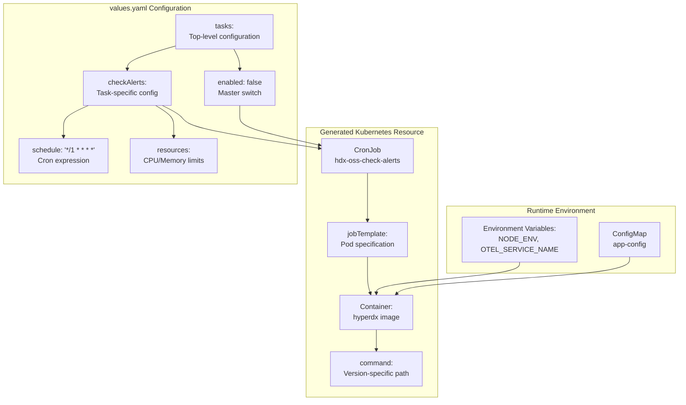
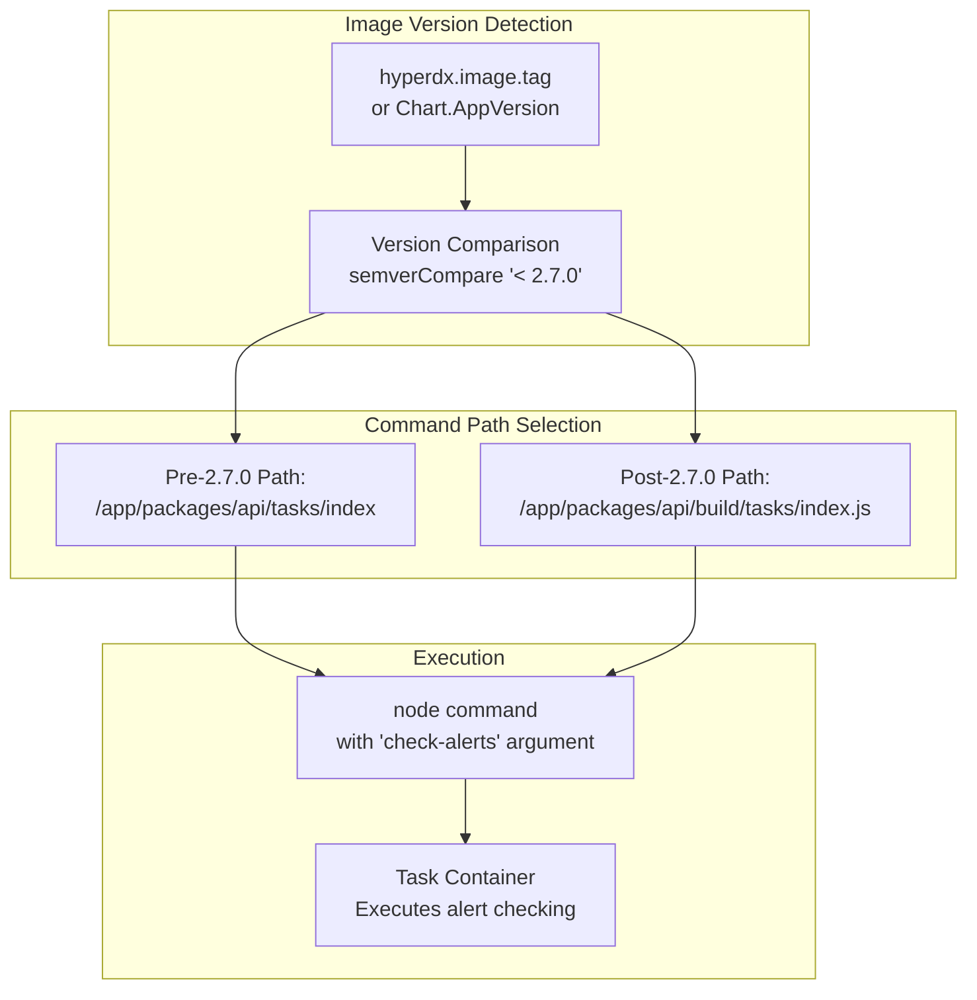
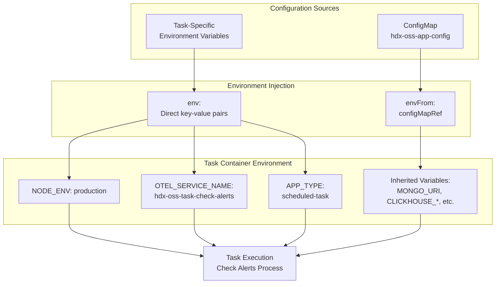
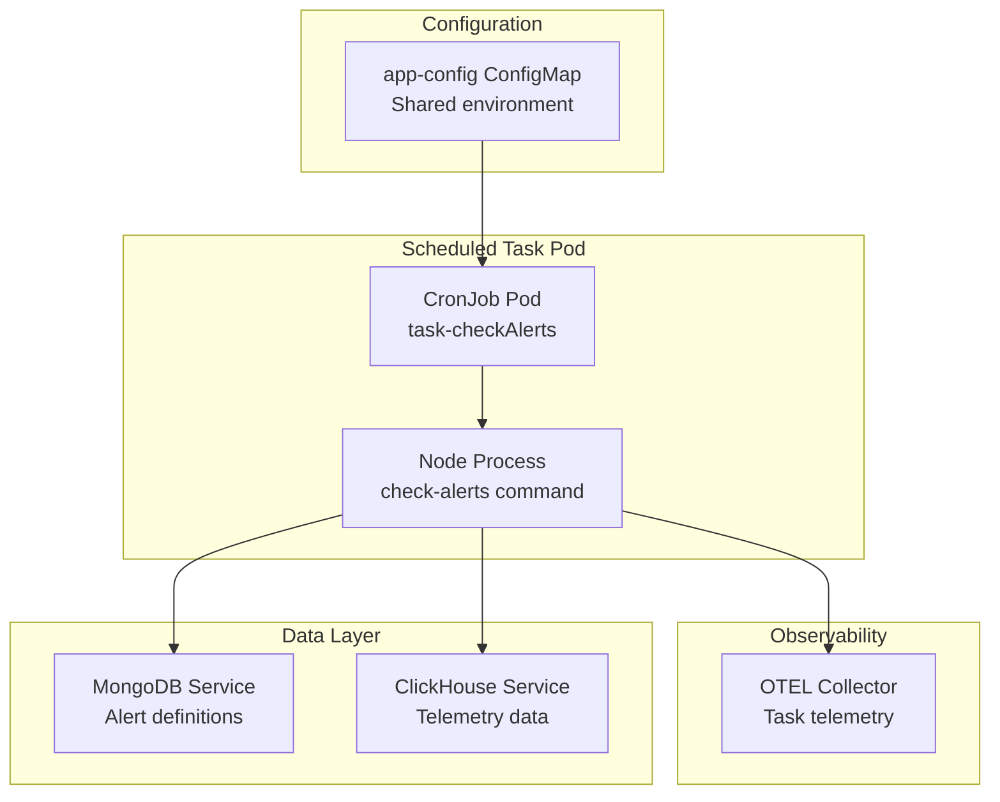

# Scheduled Tasks Configuration

> **Relevant source files**
> * [charts/hdx-oss-v2/templates/cronjobs/task-checkAlerts.yaml](https://github.com/hyperdxio/helm-charts/blob/845dd482/charts/hdx-oss-v2/templates/cronjobs/task-checkAlerts.yaml)
> * [charts/hdx-oss-v2/tests/task-checkAlerts_test.yaml](https://github.com/hyperdxio/helm-charts/blob/845dd482/charts/hdx-oss-v2/tests/task-checkAlerts_test.yaml)
> * [charts/hdx-oss-v2/values.yaml](https://github.com/hyperdxio/helm-charts/blob/845dd482/charts/hdx-oss-v2/values.yaml)

This page documents the configuration options for scheduled tasks in HyperDX, which use Kubernetes CronJobs to perform periodic background operations such as alert checking. Scheduled tasks are disabled by default and must be explicitly enabled in the configuration.

For detailed information about the scheduled tasks system architecture and implementation, see [Scheduled Tasks System](/hyperdxio/helm-charts/5.5-scheduled-tasks-system). For resource management considerations, see [Resource Management](/hyperdxio/helm-charts/8.2-resource-management).

## Overview

The HyperDX Helm chart includes a scheduled task system that executes background jobs on a recurring schedule. Currently, the primary scheduled task is `checkAlerts`, which periodically evaluates alert conditions against stored telemetry data.

The task system is built on Kubernetes CronJobs, with each task deployed as a separate CronJob resource that runs containers using the HyperDX application image. Tasks share the same application configuration as the main HyperDX deployment but run in isolated job pods.

**Sources:** [charts/hdx-oss-v2/values.yaml L466-L477](https://github.com/hyperdxio/helm-charts/blob/845dd482/charts/hdx-oss-v2/values.yaml#L466-L477)

 [charts/hdx-oss-v2/templates/cronjobs/task-checkAlerts.yaml L1-L48](https://github.com/hyperdxio/helm-charts/blob/845dd482/charts/hdx-oss-v2/templates/cronjobs/task-checkAlerts.yaml#L1-L48)

## Configuration Structure

The scheduled tasks configuration is located under the `tasks` key in `values.yaml`. The structure follows a two-level hierarchy: a top-level enable flag controls whether any tasks are deployed, and individual task configurations define specific execution parameters.



**Diagram: Scheduled Tasks Configuration Flow**

**Sources:** [charts/hdx-oss-v2/values.yaml L466-L477](https://github.com/hyperdxio/helm-charts/blob/845dd482/charts/hdx-oss-v2/values.yaml#L466-L477)

 [charts/hdx-oss-v2/templates/cronjobs/task-checkAlerts.yaml L6-L17](https://github.com/hyperdxio/helm-charts/blob/845dd482/charts/hdx-oss-v2/templates/cronjobs/task-checkAlerts.yaml#L6-L17)

## Configuration Options

The following table describes all available configuration options for scheduled tasks:

| Parameter | Type | Default | Description |
| --- | --- | --- | --- |
| `tasks.enabled` | boolean | `false` | Master switch to enable/disable all scheduled tasks |
| `tasks.checkAlerts.schedule` | string | `"*/1 * * * *"` | Cron expression defining task execution frequency |
| `tasks.checkAlerts.resources.limits.cpu` | string | `"200m"` | Maximum CPU allocation for task pods |
| `tasks.checkAlerts.resources.limits.memory` | string | `"256Mi"` | Maximum memory allocation for task pods |
| `tasks.checkAlerts.resources.requests.cpu` | string | `"100m"` | Requested CPU allocation for task pods |
| `tasks.checkAlerts.resources.requests.memory` | string | `"128Mi"` | Requested memory allocation for task pods |

**Sources:** [charts/hdx-oss-v2/values.yaml L466-L477](https://github.com/hyperdxio/helm-charts/blob/845dd482/charts/hdx-oss-v2/values.yaml#L466-L477)

## Alert Checking Task

The `checkAlerts` task is the primary scheduled operation, responsible for evaluating configured alert conditions against telemetry data stored in ClickHouse. This task runs at regular intervals defined by the `schedule` parameter.

### Basic Configuration

To enable the alert checking task:

```yaml
tasks:
  enabled: true
  checkAlerts:
    schedule: "*/5 * * * *"  # Run every 5 minutes
```

The `schedule` field accepts standard cron expressions following the format: `minute hour day-of-month month day-of-week`. Common patterns include:

* `"*/1 * * * *"` - Every minute (default)
* `"*/5 * * * *"` - Every 5 minutes
* `"0 * * * *"` - Every hour at minute 0
* `"0 0 * * *"` - Once daily at midnight

**Sources:** [charts/hdx-oss-v2/values.yaml L468-L469](https://github.com/hyperdxio/helm-charts/blob/845dd482/charts/hdx-oss-v2/values.yaml#L468-L469)

 [charts/hdx-oss-v2/templates/cronjobs/task-checkAlerts.yaml L10](https://github.com/hyperdxio/helm-charts/blob/845dd482/charts/hdx-oss-v2/templates/cronjobs/task-checkAlerts.yaml#L10-L10)

### Resource Configuration

The task requires dedicated resource allocation to prevent interference with the main application. Resources should be configured based on the complexity and volume of alerts being evaluated:

```yaml
tasks:
  enabled: true
  checkAlerts:
    resources:
      limits:
        cpu: 500m
        memory: 512Mi
      requests:
        cpu: 200m
        memory: 256Mi
```

**Resource Sizing Guidelines:**

| Alert Volume | CPU Request | Memory Request | CPU Limit | Memory Limit |
| --- | --- | --- | --- | --- |
| Low (< 10 alerts) | 100m | 128Mi | 200m | 256Mi |
| Medium (10-50 alerts) | 200m | 256Mi | 400m | 512Mi |
| High (> 50 alerts) | 400m | 512Mi | 800m | 1Gi |

**Sources:** [charts/hdx-oss-v2/values.yaml L470-L476](https://github.com/hyperdxio/helm-charts/blob/845dd482/charts/hdx-oss-v2/values.yaml#L470-L476)

## Version-Specific Behavior

The scheduled task implementation includes version-aware command path selection to accommodate changes in the HyperDX application's build structure. The Helm template automatically selects the correct command path based on the configured image tag.



**Diagram: Version-Specific Command Path Selection**

The template uses Go template logic to determine the appropriate path:

```yaml
{{- if and (regexMatch "^[0-9]+\\.[0-9]+\\.[0-9]+" $tag) (semverCompare "< 2.7.0" $tag) }}
  command: ["node", "/app/packages/api/tasks/index", "check-alerts"]
{{- else }}
  command: ["node", "/app/packages/api/build/tasks/index.js", "check-alerts"]
{{- end }}
```

**Version Command Mapping:**

| Version Range | Command Path | Notes |
| --- | --- | --- |
| < 2.7.0 | `/app/packages/api/tasks/index` | Legacy build structure |
| >= 2.7.0 | `/app/packages/api/build/tasks/index.js` | Post-ESBuild migration |
| Non-semver tags | `/app/packages/api/build/tasks/index.js` | Assumes latest structure |

**Sources:** [charts/hdx-oss-v2/templates/cronjobs/task-checkAlerts.yaml L29-L34](https://github.com/hyperdxio/helm-charts/blob/845dd482/charts/hdx-oss-v2/templates/cronjobs/task-checkAlerts.yaml#L29-L34)

 [charts/hdx-oss-v2/tests/task-checkAlerts_test.yaml L98-L156](https://github.com/hyperdxio/helm-charts/blob/845dd482/charts/hdx-oss-v2/tests/task-checkAlerts_test.yaml#L98-L156)

## Environment Configuration

Scheduled tasks inherit the application configuration through a combination of ConfigMap-based bulk environment variables and task-specific environment overrides.



**Diagram: Task Environment Configuration**

### Configuration Map Injection

The task container uses `envFrom` to bulk-import all environment variables from the application ConfigMap:

```yaml
envFrom:
  - configMapRef:
      name: {{ include "hdx-oss.fullname" . }}-app-config
```

This provides access to:

* `MONGO_URI` - MongoDB connection string
* `CLICKHOUSE_HOST` - ClickHouse HTTP endpoint
* `CLICKHOUSE_USER` and `CLICKHOUSE_PASSWORD` - ClickHouse credentials
* `HYPERDX_API_KEY` - API authentication key
* All other application configuration variables

**Sources:** [charts/hdx-oss-v2/templates/cronjobs/task-checkAlerts.yaml L35-L37](https://github.com/hyperdxio/helm-charts/blob/845dd482/charts/hdx-oss-v2/templates/cronjobs/task-checkAlerts.yaml#L35-L37)

### Task-Specific Variables

Additional environment variables are set directly on the task container to identify and configure the task execution context:

| Variable | Value | Purpose |
| --- | --- | --- |
| `NODE_ENV` | `"production"` | Sets Node.js execution mode |
| `OTEL_SERVICE_NAME` | `"hdx-oss-task-check-alerts"` | Identifies telemetry from this task |
| `APP_TYPE` | `"scheduled-task"` | Distinguishes task pods from application pods |

**Sources:** [charts/hdx-oss-v2/templates/cronjobs/task-checkAlerts.yaml L38-L44](https://github.com/hyperdxio/helm-charts/blob/845dd482/charts/hdx-oss-v2/templates/cronjobs/task-checkAlerts.yaml#L38-L44)

## CronJob Execution Policy

The task CronJob is configured with the `Forbid` concurrency policy to prevent overlapping executions:

```yaml
spec:
  concurrencyPolicy: Forbid
```

This ensures that if a task execution is still running when the next scheduled run time arrives, the new execution is skipped. This prevents resource contention and ensures data consistency during alert evaluation.

**Execution Behavior:**

* **On Success:** Pod is retained for log inspection, then cleaned up according to Kubernetes history limits
* **On Failure:** Pod is retained for debugging, job marked as failed, restarts according to `restartPolicy: OnFailure`
* **Concurrent Runs:** Skipped if previous execution is still active

**Sources:** [charts/hdx-oss-v2/templates/cronjobs/task-checkAlerts.yaml L11](https://github.com/hyperdxio/helm-charts/blob/845dd482/charts/hdx-oss-v2/templates/cronjobs/task-checkAlerts.yaml#L11-L11)

## Image Pull Configuration

Scheduled tasks respect the global `imagePullSecrets` configuration for accessing private container registries:

```yaml
global:
  imagePullSecrets:
    - name: regcred
    - name: docker-hub-secret

tasks:
  enabled: true
```

This configuration prevents rate limiting errors when pulling the HyperDX image for task execution. The image pull secrets are automatically applied to the task pod specification when defined.

**Sources:** [charts/hdx-oss-v2/templates/cronjobs/task-checkAlerts.yaml L20-L23](https://github.com/hyperdxio/helm-charts/blob/845dd482/charts/hdx-oss-v2/templates/cronjobs/task-checkAlerts.yaml#L20-L23)

 [charts/hdx-oss-v2/tests/task-checkAlerts_test.yaml L84-L96](https://github.com/hyperdxio/helm-charts/blob/845dd482/charts/hdx-oss-v2/tests/task-checkAlerts_test.yaml#L84-L96)

## Integration with HyperDX System

The scheduled task system integrates with other HyperDX components through shared configuration and service endpoints:



**Diagram: Task System Integration**

### Data Flow

1. **Configuration Loading:** Task pod reads `app-config` ConfigMap on startup
2. **Alert Definition Retrieval:** Connects to MongoDB to fetch configured alerts
3. **Telemetry Query:** Queries ClickHouse for relevant metrics, logs, or traces
4. **Alert Evaluation:** Processes query results against alert conditions
5. **Notification Dispatch:** Triggers configured notification channels for breached alerts
6. **Observability:** Sends execution metrics and traces to OTEL Collector

**Sources:** [charts/hdx-oss-v2/templates/cronjobs/task-checkAlerts.yaml L35-L44](https://github.com/hyperdxio/helm-charts/blob/845dd482/charts/hdx-oss-v2/templates/cronjobs/task-checkAlerts.yaml#L35-L44)

## Complete Configuration Example

The following example shows a complete production-ready scheduled tasks configuration:

```css
# Enable scheduled tasks
tasks:
  enabled: true
  
  # Alert checking task configuration
  checkAlerts:
    # Run every 2 minutes
    schedule: "*/2 * * * *"
    
    # Production resource allocation
    resources:
      limits:
        cpu: 500m
        memory: 512Mi
      requests:
        cpu: 200m
        memory: 256Mi

# Global configuration (affects tasks)
global:
  imagePullSecrets:
    - name: docker-registry-secret

# HyperDX application configuration (inherited by tasks)
hyperdx:
  image:
    repository: docker.hyperdx.io/hyperdx/hyperdx
    tag: "2.7.1"
    pullPolicy: IfNotPresent
  
  # MongoDB connection (used by tasks)
  mongoUri: mongodb://hdx-mongodb:27017/hyperdx
  
  # ClickHouse connection (used by tasks)
  defaultConnections: |
    [
      {
        "name": "Production ClickHouse",
        "host": "http://hdx-clickhouse:8123",
        "port": 8123,
        "username": "app",
        "password": "secure-password"
      }
    ]
```

**Sources:** [charts/hdx-oss-v2/values.yaml L466-L477](https://github.com/hyperdxio/helm-charts/blob/845dd482/charts/hdx-oss-v2/values.yaml#L466-L477)

 [charts/hdx-oss-v2/templates/cronjobs/task-checkAlerts.yaml L1-L48](https://github.com/hyperdxio/helm-charts/blob/845dd482/charts/hdx-oss-v2/templates/cronjobs/task-checkAlerts.yaml#L1-L48)

## Disabling Scheduled Tasks

To disable all scheduled tasks, set `tasks.enabled` to `false`:

```yaml
tasks:
  enabled: false
```

When disabled, no CronJob resources are rendered in the Helm chart, and no task pods will be scheduled or executed. This is the default configuration.

**Sources:** [charts/hdx-oss-v2/values.yaml L467](https://github.com/hyperdxio/helm-charts/blob/845dd482/charts/hdx-oss-v2/values.yaml#L467-L467)

 [charts/hdx-oss-v2/tests/task-checkAlerts_test.yaml L5-L11](https://github.com/hyperdxio/helm-charts/blob/845dd482/charts/hdx-oss-v2/tests/task-checkAlerts_test.yaml#L5-L11)