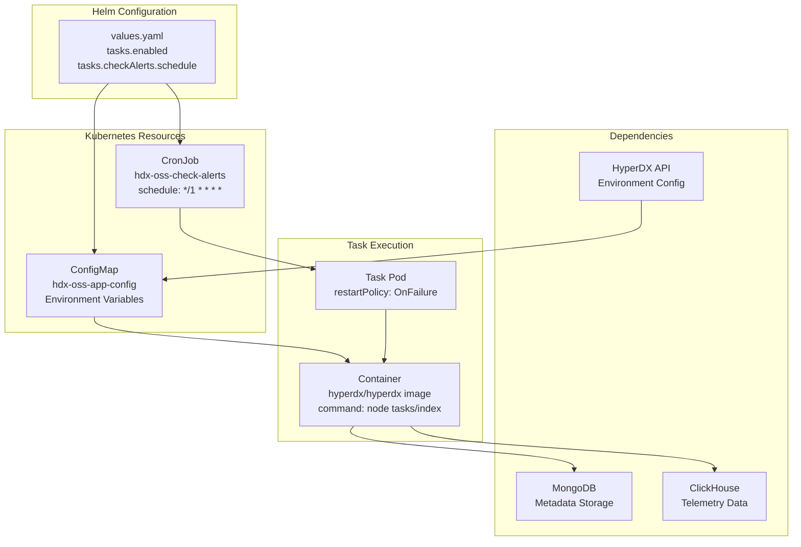
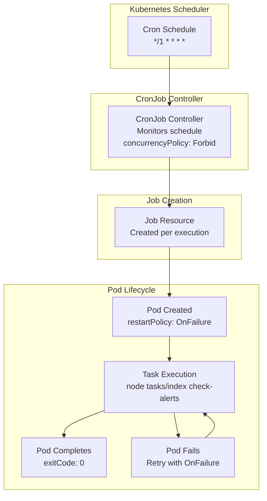
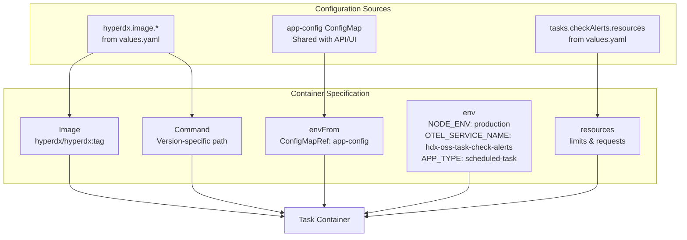
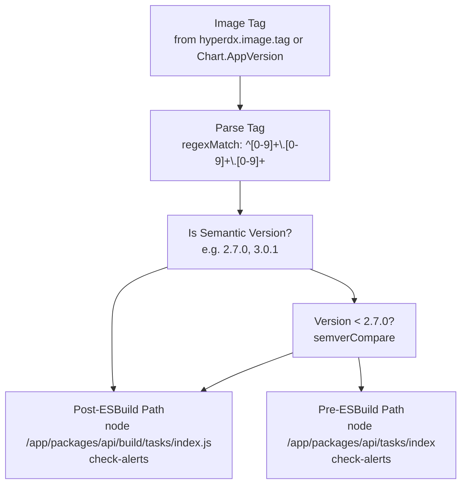

# Scheduled Tasks System

> **Relevant source files**
> * [CHANGELOG.md](https://github.com/hyperdxio/helm-charts/blob/845dd482/CHANGELOG.md)
> * [charts/hdx-oss-v2/templates/cronjobs/task-checkAlerts.yaml](https://github.com/hyperdxio/helm-charts/blob/845dd482/charts/hdx-oss-v2/templates/cronjobs/task-checkAlerts.yaml)
> * [charts/hdx-oss-v2/tests/task-checkAlerts_test.yaml](https://github.com/hyperdxio/helm-charts/blob/845dd482/charts/hdx-oss-v2/tests/task-checkAlerts_test.yaml)
> * [charts/hdx-oss-v2/values.yaml](https://github.com/hyperdxio/helm-charts/blob/845dd482/charts/hdx-oss-v2/values.yaml)

## Purpose and Scope

This document describes the Scheduled Tasks System in the HyperDX Helm chart, which provides CronJob-based background processing for recurring operational tasks. The system is currently used to run alert checking tasks at regular intervals outside of the main HyperDX application deployment.

For information about the main HyperDX application deployment, see [HyperDX Application](/hyperdxio/helm-charts/5.1-hyperdx-application). For configuration of the application's environment variables and settings, see [HyperDX Application Configuration](/hyperdxio/helm-charts/3.2-hyperdx-application-configuration).

---

## System Overview

The Scheduled Tasks System uses Kubernetes CronJobs to execute background tasks on a predefined schedule. Tasks run in separate pods that share the same container image as the main HyperDX application but execute specific task commands instead of running the API or UI servers.

### High-Level Architecture



**Sources:** [charts/hdx-oss-v2/templates/cronjobs/task-checkAlerts.yaml L1-L48](https://github.com/hyperdxio/helm-charts/blob/845dd482/charts/hdx-oss-v2/templates/cronjobs/task-checkAlerts.yaml#L1-L48)

 [charts/hdx-oss-v2/values.yaml L466-L476](https://github.com/hyperdxio/helm-charts/blob/845dd482/charts/hdx-oss-v2/values.yaml#L466-L476)

---

## Configuration

The Scheduled Tasks System is configured through the `tasks` section of `values.yaml`. Tasks are **disabled by default** and must be explicitly enabled.

### Core Configuration Options

| Parameter | Type | Default | Description |
| --- | --- | --- | --- |
| `tasks.enabled` | boolean | `false` | Master switch to enable/disable all scheduled tasks |
| `tasks.checkAlerts.schedule` | string | `"*/1 * * * *"` | Cron schedule expression (runs every 1 minute by default) |
| `tasks.checkAlerts.resources.limits.cpu` | string | `"200m"` | CPU limit for alert checking task |
| `tasks.checkAlerts.resources.limits.memory` | string | `"256Mi"` | Memory limit for alert checking task |
| `tasks.checkAlerts.resources.requests.cpu` | string | `"100m"` | CPU request for alert checking task |
| `tasks.checkAlerts.resources.requests.memory` | string | `"128Mi"` | Memory request for alert checking task |

**Sources:** [charts/hdx-oss-v2/values.yaml L466-L476](https://github.com/hyperdxio/helm-charts/blob/845dd482/charts/hdx-oss-v2/values.yaml#L466-L476)

### Example Configuration

```yaml
tasks:
  enabled: true
  checkAlerts:
    schedule: "*/5 * * * *"  # Run every 5 minutes
    resources:
      limits:
        cpu: 300m
        memory: 512Mi
      requests:
        cpu: 150m
        memory: 256Mi
```

**Sources:** [charts/hdx-oss-v2/tests/task-checkAlerts_test.yaml L18-L25](https://github.com/hyperdxio/helm-charts/blob/845dd482/charts/hdx-oss-v2/tests/task-checkAlerts_test.yaml#L18-L25)

---

## CronJob Architecture

### Task Execution Flow



**Sources:** [charts/hdx-oss-v2/templates/cronjobs/task-checkAlerts.yaml L10-L24](https://github.com/hyperdxio/helm-charts/blob/845dd482/charts/hdx-oss-v2/templates/cronjobs/task-checkAlerts.yaml#L10-L24)

### CronJob Specification

The CronJob template [charts/hdx-oss-v2/templates/cronjobs/task-checkAlerts.yaml L1-L48](https://github.com/hyperdxio/helm-charts/blob/845dd482/charts/hdx-oss-v2/templates/cronjobs/task-checkAlerts.yaml#L1-L48)

 creates a Kubernetes CronJob resource with the following key properties:

* **Concurrency Policy**: `Forbid` - Prevents overlapping executions. If a previous job is still running, the new execution is skipped.
* **Restart Policy**: `OnFailure` - Pod restarts only if the task command fails (non-zero exit code).
* **Image**: Uses the same `hyperdx.image.repository` and `hyperdx.image.tag` as the main application deployment.
* **Command**: Version-specific path to the task runner (see [Version-Specific Command Paths](https://github.com/hyperdxio/helm-charts/blob/845dd482/Version-Specific Command Paths) ).

**Sources:** [charts/hdx-oss-v2/templates/cronjobs/task-checkAlerts.yaml L10-L34](https://github.com/hyperdxio/helm-charts/blob/845dd482/charts/hdx-oss-v2/templates/cronjobs/task-checkAlerts.yaml#L10-L34)

---

## checkAlerts Task

The `checkAlerts` task is currently the only scheduled task supported by the system. It monitors configured alerts in MongoDB and evaluates them against metric data in ClickHouse.

### Task Container Configuration



**Sources:** [charts/hdx-oss-v2/templates/cronjobs/task-checkAlerts.yaml L26-L46](https://github.com/hyperdxio/helm-charts/blob/845dd482/charts/hdx-oss-v2/templates/cronjobs/task-checkAlerts.yaml#L26-L46)

### Environment Variables

The task container receives environment variables from two sources:

1. **ConfigMap** (`envFrom`): All environment variables from the `hdx-oss-app-config` ConfigMap, which includes MongoDB connection strings, ClickHouse configuration, and other application settings.
2. **Direct Environment Variables** (`env`): * `NODE_ENV`: Set to `"production"` * `OTEL_SERVICE_NAME`: Set to `"hdx-oss-task-check-alerts"` for telemetry identification * `APP_TYPE`: Set to `"scheduled-task"` to distinguish from web servers

**Sources:** [charts/hdx-oss-v2/templates/cronjobs/task-checkAlerts.yaml L35-L44](https://github.com/hyperdxio/helm-charts/blob/845dd482/charts/hdx-oss-v2/templates/cronjobs/task-checkAlerts.yaml#L35-L44)

### Resource Allocation

Default resource allocation ensures the task has sufficient resources without consuming excessive cluster capacity:

```yaml
resources:
  limits:
    cpu: 200m
    memory: 256Mi
  requests:
    cpu: 100m
    memory: 128Mi
```

These values can be overridden via `tasks.checkAlerts.resources` in `values.yaml`.

**Sources:** [charts/hdx-oss-v2/values.yaml L470-L476](https://github.com/hyperdxio/helm-charts/blob/845dd482/charts/hdx-oss-v2/values.yaml#L470-L476)

 [charts/hdx-oss-v2/templates/cronjobs/task-checkAlerts.yaml L45-L46](https://github.com/hyperdxio/helm-charts/blob/845dd482/charts/hdx-oss-v2/templates/cronjobs/task-checkAlerts.yaml#L45-L46)

---

## Version-Specific Command Paths

A critical aspect of the Scheduled Tasks System is handling version-specific command paths for the HyperDX application. Between version 2.6.0 and 2.7.0, the application's build system changed, resulting in different file paths for the task runner.

### Command Path Logic



**Sources:** [charts/hdx-oss-v2/templates/cronjobs/task-checkAlerts.yaml L29-L34](https://github.com/hyperdxio/helm-charts/blob/845dd482/charts/hdx-oss-v2/templates/cronjobs/task-checkAlerts.yaml#L29-L34)

### Version Path Mapping Table

| Version Range | Command Path | Reason |
| --- | --- | --- |
| `< 2.7.0` (e.g., 2.6.0, 2.5.0) | `node /app/packages/api/tasks/index check-alerts` | Pre-ESBuild: TypeScript files transpiled without build directory |
| `>= 2.7.0` (e.g., 2.7.0, 2.7.1, 3.0.0) | `node /app/packages/api/build/tasks/index.js check-alerts` | Post-ESBuild revert: Built files in `build/` directory |
| Non-semantic tags (e.g., `2-beta`, `latest`) | `node /app/packages/api/build/tasks/index.js check-alerts` | Default to post-ESBuild path |

**Sources:** [charts/hdx-oss-v2/templates/cronjobs/task-checkAlerts.yaml L29-L34](https://github.com/hyperdxio/helm-charts/blob/845dd482/charts/hdx-oss-v2/templates/cronjobs/task-checkAlerts.yaml#L29-L34)

 [charts/hdx-oss-v2/tests/task-checkAlerts_test.yaml L98-L156](https://github.com/hyperdxio/helm-charts/blob/845dd482/charts/hdx-oss-v2/tests/task-checkAlerts_test.yaml#L98-L156)

### Template Implementation

The Helm template [charts/hdx-oss-v2/templates/cronjobs/task-checkAlerts.yaml L29-L34](https://github.com/hyperdxio/helm-charts/blob/845dd482/charts/hdx-oss-v2/templates/cronjobs/task-checkAlerts.yaml#L29-L34)

 uses the following logic:

```yaml
{{- $tag := .Values.hyperdx.image.tag | default .Chart.AppVersion -}}
{{- if and (regexMatch "^[0-9]+\\.[0-9]+\\.[0-9]+" $tag) (semverCompare "< 2.7.0" $tag) }}
command: ["node", "/app/packages/api/tasks/index", "check-alerts"]
{{- else }}
command: ["node", "/app/packages/api/build/tasks/index.js", "check-alerts"]
{{- end }}
```

This ensures compatibility across HyperDX application versions without requiring manual intervention during upgrades.

**Sources:** [charts/hdx-oss-v2/templates/cronjobs/task-checkAlerts.yaml L29-L34](https://github.com/hyperdxio/helm-charts/blob/845dd482/charts/hdx-oss-v2/templates/cronjobs/task-checkAlerts.yaml#L29-L34)

---

## Deployment Considerations

### When to Enable Scheduled Tasks

Enable scheduled tasks (`tasks.enabled: true`) when:

1. **Alert Monitoring**: You have configured alerts in HyperDX that need to be evaluated on a schedule.
2. **Reduced Application Load**: You want to offload alert checking from the main application pods to dedicated task pods.
3. **Independent Scaling**: You want to scale alert checking independently from the API/UI.

### Relationship with RUN_SCHEDULED_TASKS_EXTERNALLY

Prior to chart version 0.6.8, the environment variable `CRON_IN_APP_DISABLED` (later renamed to `RUN_SCHEDULED_TASKS_EXTERNALLY`) controlled whether the HyperDX API would run scheduled tasks internally.

When `tasks.enabled: true`, the chart automatically sets `RUN_SCHEDULED_TASKS_EXTERNALLY: true` in the application's environment to prevent duplicate task execution:

* **CronJob enabled** (`tasks.enabled: true`): Tasks run in separate CronJob pods, application disables internal task execution.
* **CronJob disabled** (`tasks.enabled: false`): Application runs tasks internally (if supported by the application version).

**Sources:** [CHANGELOG.md L86](https://github.com/hyperdxio/helm-charts/blob/845dd482/CHANGELOG.md#L86-L86)

 [CHANGELOG.md L93](https://github.com/hyperdxio/helm-charts/blob/845dd482/CHANGELOG.md#L93-L93)

### Image Pull Secrets

The CronJob respects `global.imagePullSecrets` configuration to avoid Docker Hub rate limiting:

```yaml
global:
  imagePullSecrets:
    - name: regcred
    - name: docker-hub-secret
```

When configured, these secrets are included in the CronJob pod specification [charts/hdx-oss-v2/templates/cronjobs/task-checkAlerts.yaml L20-L23](https://github.com/hyperdxio/helm-charts/blob/845dd482/charts/hdx-oss-v2/templates/cronjobs/task-checkAlerts.yaml#L20-L23)

**Sources:** [charts/hdx-oss-v2/templates/cronjobs/task-checkAlerts.yaml L20-L23](https://github.com/hyperdxio/helm-charts/blob/845dd482/charts/hdx-oss-v2/templates/cronjobs/task-checkAlerts.yaml#L20-L23)

 [charts/hdx-oss-v2/values.yaml L1-L12](https://github.com/hyperdxio/helm-charts/blob/845dd482/charts/hdx-oss-v2/values.yaml#L1-L12)

---

## Testing

The Scheduled Tasks System includes comprehensive unit tests in [charts/hdx-oss-v2/tests/task-checkAlerts_test.yaml L1-L157](https://github.com/hyperdxio/helm-charts/blob/845dd482/charts/hdx-oss-v2/tests/task-checkAlerts_test.yaml#L1-L157)

 that verify:

### Test Coverage

| Test Case | Purpose |
| --- | --- |
| Disabled tasks | Verifies no CronJob is rendered when `tasks.enabled: false` |
| Enabled configuration | Validates correct CronJob structure with custom schedule and resources |
| Default schedule | Confirms default `"*/1 * * * *"` schedule is used when not specified |
| Image pull secrets | Tests both presence and absence of `imagePullSecrets` |
| Version-specific commands | Validates correct command path for versions 2.6.0, 2.7.0, 2.7.1, 2.8.0, 3.0.0 |
| Environment variables | Confirms `NODE_ENV`, `OTEL_SERVICE_NAME`, and `APP_TYPE` are set correctly |

**Sources:** [charts/hdx-oss-v2/tests/task-checkAlerts_test.yaml L1-L157](https://github.com/hyperdxio/helm-charts/blob/845dd482/charts/hdx-oss-v2/tests/task-checkAlerts_test.yaml#L1-L157)

### Running Tests

Tests use Helm's chart testing framework and can be executed with:

```
helm unittest charts/hdx-oss-v2
```

**Sources:** [charts/hdx-oss-v2/tests/task-checkAlerts_test.yaml L1-L4](https://github.com/hyperdxio/helm-charts/blob/845dd482/charts/hdx-oss-v2/tests/task-checkAlerts_test.yaml#L1-L4)

---

## Troubleshooting

### Task Not Running

**Symptom**: CronJob exists but no pods are created.

**Diagnosis**:

1. Verify `tasks.enabled: true` in values
2. Check CronJob schedule syntax: `kubectl get cronjob`
3. Review CronJob events: `kubectl describe cronjob <cronjob-name>`

### Task Failing

**Symptom**: Task pods fail with exit code 1.

**Diagnosis**:

1. Check pod logs: `kubectl logs <pod-name>`
2. Verify MongoDB connectivity from task pod
3. Verify ClickHouse connectivity and credentials
4. Ensure correct command path for the HyperDX version in use

### Version-Specific Path Errors

**Symptom**: Task fails with "Cannot find module" or similar errors after upgrade.

**Diagnosis**:

1. Verify `hyperdx.image.tag` matches actual deployed version
2. Check Helm template rendering: `helm template --debug`
3. Confirm command path in pod spec: `kubectl get cronjob <name> -o yaml`

**Sources:** [CHANGELOG.md L7](https://github.com/hyperdxio/helm-charts/blob/845dd482/CHANGELOG.md#L7-L7)

 [CHANGELOG.md L13](https://github.com/hyperdxio/helm-charts/blob/845dd482/CHANGELOG.md#L13-L13)

---

## Recent Changes

The following notable changes have been made to the Scheduled Tasks System:

| Version | Change | Impact |
| --- | --- | --- |
| 0.8.4 | Fixed cronjob path and version handling | Corrected command path selection for different HyperDX versions |
| 0.8.3 | Updated alert cron job template for newer versions | Ensured compatibility with post-2.7.0 image tag command paths |
| 0.6.8 | Renamed `CRON_IN_APP_DISABLED` to `RUN_SCHEDULED_TASKS_EXTERNALLY` | Improved clarity of environment variable naming |
| 0.6.7 | Updated entrypoint for version 2.0.2+ | Adapted to new task execution path in HyperDX application |

**Sources:** [CHANGELOG.md L3-L93](https://github.com/hyperdxio/helm-charts/blob/845dd482/CHANGELOG.md#L3-L93)