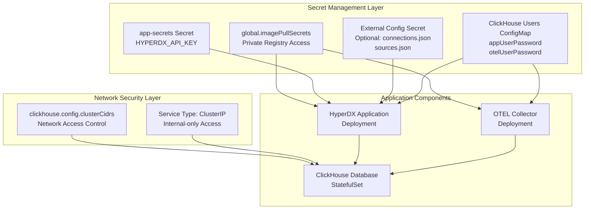
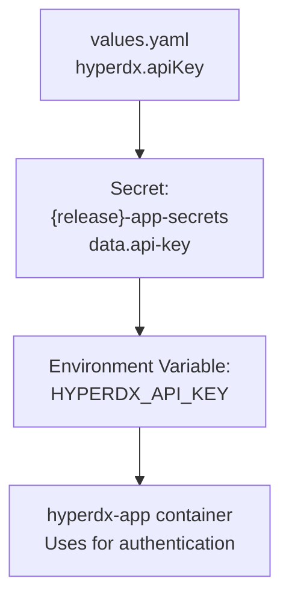
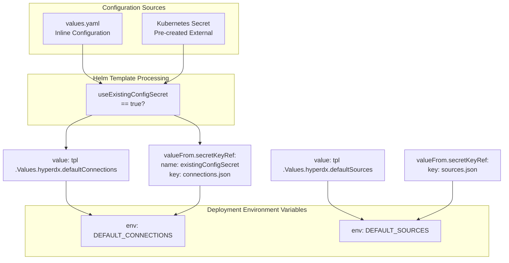
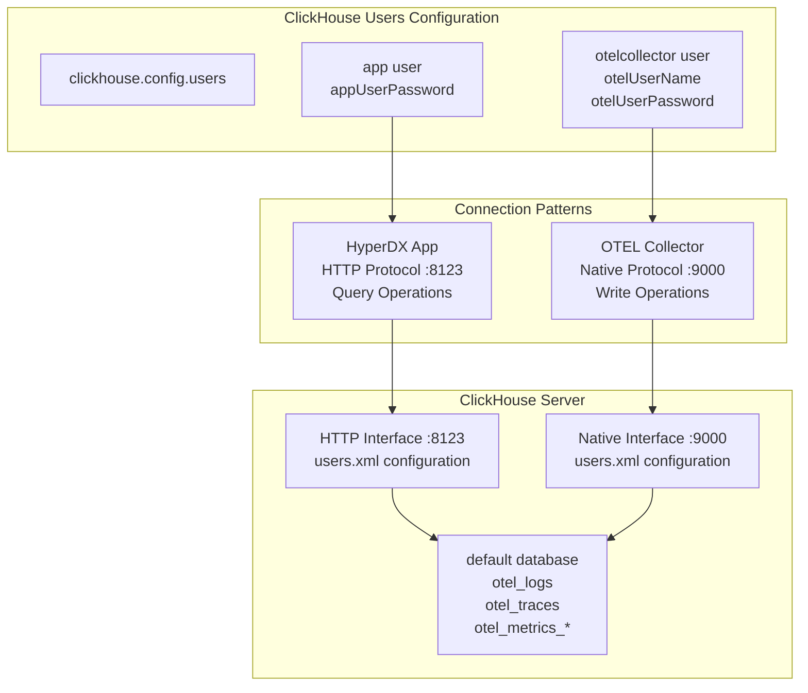
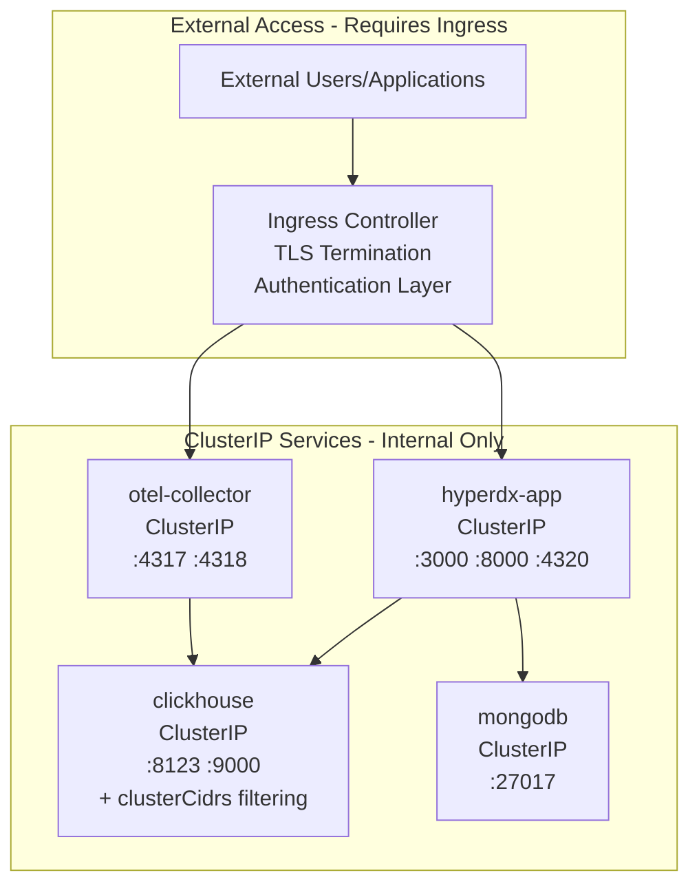

# Security Configuration

> **Relevant source files**
> * [README.md](https://github.com/hyperdxio/helm-charts/blob/845dd482/README.md)
> * [charts/hdx-oss-v2/templates/hyperdx-deployment.yaml](https://github.com/hyperdxio/helm-charts/blob/845dd482/charts/hdx-oss-v2/templates/hyperdx-deployment.yaml)
> * [charts/hdx-oss-v2/values.yaml](https://github.com/hyperdxio/helm-charts/blob/845dd482/charts/hdx-oss-v2/values.yaml)

## Purpose and Scope

This document covers security configuration for HyperDX deployments including API key management, secrets handling, ClickHouse access control, and image pull secrets. For network-level security and service architecture, see [Service Architecture](/hyperdxio/helm-charts/7.1-service-architecture). For external access and ingress security configuration, see [Ingress and External Access](/hyperdxio/helm-charts/7.2-ingress-and-external-access).

## Security Architecture Overview

The HyperDX Helm chart implements a multi-layered security model that protects authentication credentials, database access, and component communication.



**Sources:** [values.yaml L1-L477](https://github.com/hyperdxio/helm-charts/blob/845dd482/values.yaml#L1-L477)

 [hyperdx-deployment.yaml L46-L126](https://github.com/hyperdxio/helm-charts/blob/845dd482/hyperdx-deployment.yaml#L46-L126)

## API Key Management

### Default API Key Configuration

The HyperDX application requires an API key for authentication and telemetry collection. The default configuration stores this as an inline value:

```yaml
hyperdx:
  apiKey: "xxxxxxxx-xxxx-xxxx-xxxx-xxxxxxxxxxxx"
```

**Sources:** [values.yaml L48](https://github.com/hyperdxio/helm-charts/blob/845dd482/values.yaml#L48-L48)

### Secret Generation Mechanism

The Helm chart automatically generates a Kubernetes Secret named `<release-name>-app-secrets` that stores the API key securely. The deployment references this secret using `secretKeyRef`:

| Secret Name | Key | Environment Variable | Usage |
| --- | --- | --- | --- |
| `{release}-app-secrets` | `api-key` | `HYPERDX_API_KEY` | Application authentication |

**Sources:** [hyperdx-deployment.yaml L96-L100](https://github.com/hyperdxio/helm-charts/blob/845dd482/hyperdx-deployment.yaml#L96-L100)



**Sources:** [values.yaml L48](https://github.com/hyperdxio/helm-charts/blob/845dd482/values.yaml#L48-L48)

 [hyperdx-deployment.yaml L96-L100](https://github.com/hyperdxio/helm-charts/blob/845dd482/hyperdx-deployment.yaml#L96-L100)

### API Key Rotation Process

To rotate the API key after initial deployment:

1. **Retrieve the new API key** from the HyperDX UI (Team Settings)
2. **Update via Helm upgrade** with the new value: ``` helm upgrade my-hyperdx hyperdx/hdx-oss-v2 \   --set hyperdx.apiKey="new-api-key-here" ```
3. **Restart affected pods** to load the new secret: ``` kubectl rollout restart deployment my-hyperdx-hdx-oss-v2-app kubectl rollout restart deployment my-hyperdx-hdx-oss-v2-otel-collector ```

**Sources:** Referenced in README.md

## Secrets Management System

### Built-in Secret Template

The chart creates secrets automatically from values provided in `values.yaml`. This approach is suitable for development and testing environments.



**Sources:** [hyperdx-deployment.yaml L101-L123](https://github.com/hyperdxio/helm-charts/blob/845dd482/hyperdx-deployment.yaml#L101-L123)

 [values.yaml L77-L90](https://github.com/hyperdxio/helm-charts/blob/845dd482/values.yaml#L77-L90)

### External Secrets for Production

For production deployments, use the external secrets mechanism to separate credentials from Helm configuration:

**Configuration Parameters:**

| Parameter | Default | Description |
| --- | --- | --- |
| `hyperdx.useExistingConfigSecret` | `false` | Enable external secret |
| `hyperdx.existingConfigSecret` | `""` | Secret name |
| `hyperdx.existingConfigConnectionsKey` | `"connections.json"` | Key for connections data |
| `hyperdx.existingConfigSourcesKey` | `"sources.json"` | Key for sources data |

**Sources:** [values.yaml L87-L90](https://github.com/hyperdxio/helm-charts/blob/845dd482/values.yaml#L87-L90)

### Creating External Configuration Secrets

The external secret must contain JSON arrays for both connections and sources:

```sql
# Create connections.json with ClickHouse credentials
cat <<EOF > connections.json
[
  {
    "name": "Production ClickHouse",
    "host": "https://clickhouse.prod.example.com:8123",
    "port": 8123,
    "username": "hyperdx_app",
    "password": "secure-production-password"
  }
]
EOF

# Create sources.json with data source definitions
cat <<EOF > sources.json
[
  {
    "from": {"databaseName": "default", "tableName": "otel_logs"},
    "kind": "log",
    "name": "Logs",
    "connection": "Production ClickHouse",
    "timestampValueExpression": "TimestampTime"
  }
]
EOF

# Create the Kubernetes secret
kubectl create secret generic hyperdx-prod-config \
  --from-file=connections.json=connections.json \
  --from-file=sources.json=sources.json
```

Then reference it in `values.yaml`:

```yaml
hyperdx:
  useExistingConfigSecret: true
  existingConfigSecret: "hyperdx-prod-config"
```

**Sources:** [values.yaml L87-L90](https://github.com/hyperdxio/helm-charts/blob/845dd482/values.yaml#L87-L90)

 [hyperdx-deployment.yaml L101-L123](https://github.com/hyperdxio/helm-charts/blob/845dd482/hyperdx-deployment.yaml#L101-L123)

### ConfigMap vs Secret Usage

The chart uses different mechanisms for different types of configuration:

| Resource Type | Contains | Reason | Example |
| --- | --- | --- | --- |
| **Secret** | API keys, passwords | Base64-encoded, restricted access | `app-secrets` |
| **ConfigMap** | Non-sensitive config | Plaintext, easier to inspect | `app-config` |
| **Inline Environment** | Dynamic/templated values | Processed at deployment time | `DEFAULT_CONNECTIONS` |

**Sources:** [hyperdx-deployment.yaml L92-L126](https://github.com/hyperdxio/helm-charts/blob/845dd482/hyperdx-deployment.yaml#L92-L126)

## ClickHouse Security

### Authentication Model

ClickHouse uses separate users for different components with distinct credentials:



**Sources:** [values.yaml L355-L358](https://github.com/hyperdxio/helm-charts/blob/845dd482/values.yaml#L355-L358)

### User Configuration Details

The ClickHouse user credentials are defined in the values file:

| Parameter | Default Value | Used By | Protocol |
| --- | --- | --- | --- |
| `clickhouse.config.users.appUserPassword` | `"hyperdx"` | HyperDX API | HTTP :8123 |
| `clickhouse.config.users.otelUserName` | `"otelcollector"` | OTEL Collector | Native :9000 |
| `clickhouse.config.users.otelUserPassword` | `"otelcollectorpass"` | OTEL Collector | Native :9000 |

**Production Recommendation:** Change all default passwords before deploying to production.

**Sources:** [values.yaml L355-L358](https://github.com/hyperdxio/helm-charts/blob/845dd482/values.yaml#L355-L358)

### Default Connections Credential Flow

The HyperDX application receives ClickHouse credentials through the `DEFAULT_CONNECTIONS` environment variable:

```yaml
defaultConnections: |
  [
    {
      "name": "Local ClickHouse",
      "host": "http://{{ include "hdx-oss.fullname" . }}-clickhouse:8123",
      "port": 8123,
      "username": "app",
      "password": "{{ .Values.clickhouse.config.users.appUserPassword }}"
    }
  ]
```

This is templated at deployment time to inject the actual password value.

**Sources:** [values.yaml L92-L101](https://github.com/hyperdxio/helm-charts/blob/845dd482/values.yaml#L92-L101)

### Network Access Control

ClickHouse implements network-level security through CIDR-based filtering:

| Configuration | Purpose |
| --- | --- |
| `clickhouse.config.clusterCidrs` | Whitelist of allowed network ranges |

**Default Development CIDRs:**

```yaml
clusterCidrs:
  - "10.0.0.0/8"      # Most K8s clusters (GKE, EKS, AKS)
  - "172.16.0.0/12"   # Docker Desktop, some cloud providers
  - "192.168.0.0/16"  # OrbStack, Minikube, local development
```

**Production Configuration:**

For production deployments, restrict to your cluster's specific pod network CIDR:

```yaml
clickhouse:
  config:
    clusterCidrs:
      - "10.8.0.0/16"  # Example: GKE cluster-specific CIDR
```

**Sources:** [values.yaml L359-L366](https://github.com/hyperdxio/helm-charts/blob/845dd482/values.yaml#L359-L366)

### Service Type Security

ClickHouse uses `ClusterIP` service type to prevent external exposure:

```yaml
clickhouse:
  service:
    type: ClusterIP  # Internal-only access
```

This ensures ClickHouse is only accessible from within the Kubernetes cluster, with no external IP allocation.

**Sources:** [values.yaml L338](https://github.com/hyperdxio/helm-charts/blob/845dd482/values.yaml#L338-L338)

## Image Pull Secrets

### Rate Limiting Prevention

Docker Hub enforces rate limits on image pulls. Configure image pull secrets to avoid "429 Too Many Requests" errors:

```yaml
global:
  imagePullSecrets:
    - name: regcred
    - name: docker-hub-secret
```

**Sources:** [values.yaml L3-L9](https://github.com/hyperdxio/helm-charts/blob/845dd482/values.yaml#L3-L9)

### Creating Image Pull Secrets

For Docker Hub authentication:

```sql
kubectl create secret docker-registry docker-hub-secret \
  --docker-server=https://index.docker.io/v1/ \
  --docker-username=<your-username> \
  --docker-password=<your-password> \
  --docker-email=<your-email>
```

For private registries:

```sql
kubectl create secret docker-registry regcred \
  --docker-server=<your-registry-server> \
  --docker-username=<your-username> \
  --docker-password=<your-password>
```

**Sources:** [values.yaml L3-L9](https://github.com/hyperdxio/helm-charts/blob/845dd482/values.yaml#L3-L9)

### Image Pull Secret Injection

The deployment automatically includes configured pull secrets:

```yaml
spec:
  template:
    spec:
      imagePullSecrets:
        {{- toYaml .Values.global.imagePullSecrets | nindent 8 }}
```

This applies to all deployments: HyperDX app, OTEL Collector, ClickHouse, and MongoDB.

**Sources:** [hyperdx-deployment.yaml L46-L49](https://github.com/hyperdxio/helm-charts/blob/845dd482/hyperdx-deployment.yaml#L46-L49)

## Service Security Model

### ClusterIP Isolation Strategy

All services default to `ClusterIP` type for security:

| Service | Default Type | Ports | Rationale |
| --- | --- | --- | --- |
| `hyperdx-app` | `ClusterIP` | 3000, 8000, 4320 | UI/API accessed via Ingress |
| `clickhouse` | `ClusterIP` | 8123, 9000 | Database, internal-only |
| `mongodb` | `ClusterIP` | 27017 | Database, internal-only |
| `otel-collector` | `ClusterIP` | 4317, 4318, 24225, 8888 | Telemetry via Ingress |

**Sources:** [values.yaml L248](https://github.com/hyperdxio/helm-charts/blob/845dd482/values.yaml#L248-L248)

 [values.yaml L338](https://github.com/hyperdxio/helm-charts/blob/845dd482/values.yaml#L338-L338)

### Access Pattern Security



**Sources:** [values.yaml L248](https://github.com/hyperdxio/helm-charts/blob/845dd482/values.yaml#L248-L248)

 [values.yaml L338](https://github.com/hyperdxio/helm-charts/blob/845dd482/values.yaml#L338-L338)

### External Access Recommendations

For production environments:

1. **Never expose database services externally** * Keep `service.type: ClusterIP` for ClickHouse and MongoDB * Access only through application layer
2. **Use Ingress with TLS for application access** ```yaml hyperdx:   ingress:     enabled: true     tls:       enabled: true       secretName: "hyperdx-tls" ```
3. **Implement authentication at Ingress level** if exposing OTEL endpoints * Use Ingress annotations for basic auth * Consider API gateway for advanced auth

**Sources:** [values.yaml L207-L221](https://github.com/hyperdxio/helm-charts/blob/845dd482/values.yaml#L207-L221)

## Security Best Practices

### Development vs Production Configuration

| Aspect | Development | Production |
| --- | --- | --- |
| API Key | Default placeholder | Unique generated key |
| Secrets | Inline in values.yaml | External Kubernetes Secrets |
| ClickHouse Password | Default "hyperdx" | Strong unique passwords |
| Cluster CIDRs | Broad ranges (3 CIDRs) | Specific cluster CIDR only |
| TLS/HTTPS | Optional | Required via Ingress |
| Image Pull Secrets | Not required | Configured to avoid rate limits |

**Sources:** [values.yaml L48](https://github.com/hyperdxio/helm-charts/blob/845dd482/values.yaml#L48-L48)

 [values.yaml L87-L90](https://github.com/hyperdxio/helm-charts/blob/845dd482/values.yaml#L87-L90)

 [values.yaml L355-L366](https://github.com/hyperdxio/helm-charts/blob/845dd482/values.yaml#L355-L366)

### Credential Rotation Checklist

1. **API Key Rotation:** * Generate new key in HyperDX UI * Update Helm values or secret * Rollout restart deployments
2. **ClickHouse Password Rotation:** * Update `clickhouse.config.users.*Password` values * Update `hyperdx.defaultConnections` password * If using external secret, update secret data * Helm upgrade and restart affected pods
3. **External Secret Updates:** * Update Kubernetes secret data directly * No Helm upgrade needed * Restart pods to pick up changes

**Sources:** [values.yaml L92-L101](https://github.com/hyperdxio/helm-charts/blob/845dd482/values.yaml#L92-L101)

 [values.yaml L355-L358](https://github.com/hyperdxio/helm-charts/blob/845dd482/values.yaml#L355-L358)

### Production Security Hardening

**Mandatory configurations for production:**

```yaml
# 1. Strong unique credentials
hyperdx:
  apiKey: "<generate-unique-uuid>"

clickhouse:
  config:
    users:
      appUserPassword: "<strong-random-password>"
      otelUserPassword: "<strong-random-password>"

# 2. External secrets for connections
hyperdx:
  useExistingConfigSecret: true
  existingConfigSecret: "hyperdx-prod-config"

# 3. Restrict network access
clickhouse:
  config:
    clusterCidrs:
      - "10.8.0.0/16"  # Your specific cluster CIDR only

# 4. Enable TLS
hyperdx:
  ingress:
    enabled: true
    tls:
      enabled: true
      secretName: "hyperdx-prod-tls"
  frontendUrl: "https://hyperdx.prod.example.com"

# 5. Image pull authentication
global:
  imagePullSecrets:
    - name: docker-hub-prod-secret
```

**Sources:** [values.yaml L1-L477](https://github.com/hyperdxio/helm-charts/blob/845dd482/values.yaml#L1-L477)

### Monitoring Security Events

Key security-related events to monitor:

1. **Authentication failures** - Check HyperDX API logs
2. **ClickHouse connection errors** - Network policy violations
3. **Image pull failures** - Rate limiting or credential issues
4. **Pod restart frequency** - Potential liveness probe failures after config changes

**Sources:** Referenced throughout deployment templates