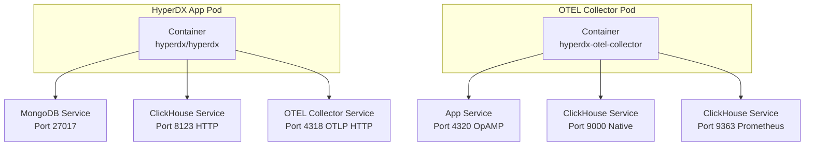

# Service Architecture

> **Relevant source files**
> * [charts/hdx-oss-v2/templates/clickhouse-deployment.yaml](https://github.com/hyperdxio/helm-charts/blob/845dd482/charts/hdx-oss-v2/templates/clickhouse-deployment.yaml)
> * [charts/hdx-oss-v2/templates/otel-collector-deployment.yaml](https://github.com/hyperdxio/helm-charts/blob/845dd482/charts/hdx-oss-v2/templates/otel-collector-deployment.yaml)
> * [charts/hdx-oss-v2/values.yaml](https://github.com/hyperdxio/helm-charts/blob/845dd482/charts/hdx-oss-v2/values.yaml)

## Purpose and Scope

This document describes the Kubernetes Service resources deployed by the HyperDX Helm chart, including their port configurations, service types, and internal DNS-based service discovery mechanisms. It focuses on the cluster-internal networking layer that enables communication between HyperDX components.

For external access configuration via Ingress resources, see [Ingress and External Access](/hyperdxio/helm-charts/7.2-ingress-and-external-access). For security aspects like access control and authentication, see [Security Configuration](/hyperdxio/helm-charts/7.3-security-configuration).

## Service Discovery Overview

The HyperDX Helm chart deploys all components with ClusterIP services by default, making them accessible only within the Kubernetes cluster. Service discovery is handled by Kubernetes DNS, which automatically creates DNS records for each service in the format:

```
<service-name>.<namespace>.svc.cluster.local
```

Within the same namespace, services can reference each other using the short form `<service-name>` or the partial FQDN `<service-name>.<namespace>`.

**Sources:** [charts/hdx-oss-v2/values.yaml L248](https://github.com/hyperdxio/helm-charts/blob/845dd482/charts/hdx-oss-v2/values.yaml#L248-L248)

 [charts/hdx-oss-v2/values.yaml L338](https://github.com/hyperdxio/helm-charts/blob/845dd482/charts/hdx-oss-v2/values.yaml#L338-L338)

## Service Topology

The following diagram shows all Kubernetes Services deployed by the chart with their actual resource names and exposed ports:

```mermaid
flowchart TD

AppService["{{include 'hdx-oss.fullname' .}}-app<br>Ports: 3000, 8000, 4320"]
OTELService["{{include 'hdx-oss.fullname' .}}-otel-collector<br>Ports: 13133, 24225, 4317, 4318, 8888"]
ClickHouseService["{{include 'hdx-oss.fullname' .}}-clickhouse<br>Ports: 8123, 9000, 9363*"]
MongoDBService["{{include 'hdx-oss.fullname' .}}-mongodb<br>Port: 27017"]
App3000["3000: UI HTTP"]
App8000["8000: API HTTP"]
App4320["4320: OpAMP Server"]
OTEL13133["13133: Health Check"]
OTEL24225["24225: Fluentd Forward"]
OTEL4317["4317: OTLP gRPC"]
OTEL4318["4318: OTLP HTTP"]
OTEL8888["8888: Metrics"]
CH8123["8123: HTTP Interface"]
CH9000["9000: Native TCP Protocol"]
CH9363["9363: Prometheus Metrics*"]
Mongo27017["27017: MongoDB Protocol"]

AppService --> App3000
AppService --> App8000
AppService --> App4320
OTELService --> OTEL13133
OTELService --> OTEL24225
OTELService --> OTEL4317
OTELService --> OTEL4318
OTELService --> OTEL8888
ClickHouseService --> CH8123
ClickHouseService --> CH9000
ClickHouseService --> CH9363
MongoDBService --> Mongo27017

subgraph subGraph1 ["Port Functions"]
    App3000
    App8000
    App4320
    OTEL13133
    OTEL24225
    OTEL4317
    OTEL4318
    OTEL8888
    CH8123
    CH9000
    CH9363
    Mongo27017
end

subgraph subGraph0 ["Kubernetes Services - ClusterIP Type"]
    AppService
    OTELService
    ClickHouseService
    MongoDBService
end
```



*Prometheus port only exposed when `clickhouse.prometheus.enabled: true`

**Sources:** [charts/hdx-oss-v2/templates/otel-collector-deployment.yaml L118-L144](https://github.com/hyperdxio/helm-charts/blob/845dd482/charts/hdx-oss-v2/templates/otel-collector-deployment.yaml#L118-L144)

 [charts/hdx-oss-v2/templates/clickhouse-deployment.yaml L124-L152](https://github.com/hyperdxio/helm-charts/blob/845dd482/charts/hdx-oss-v2/templates/clickhouse-deployment.yaml#L124-L152)

## HyperDX Application Service

The HyperDX application service exposes three distinct ports for different functions:

### Service Definition

The service is created with the name pattern `{{ include "hdx-oss.fullname" . }}-app` and defaults to type ClusterIP. The service type can be configured via `hyperdx.service.type`.

### Port Configuration

| Port | Name | Purpose | Configuration Key |
| --- | --- | --- | --- |
| 3000 | `app` | Frontend UI | `hyperdx.appPort` |
| 8000 | `api` | Backend API | `hyperdx.apiPort` |
| 4320 | `opamp` | OpAMP management server | `hyperdx.opampPort` |

The OTEL Collector connects to the OpAMP port for dynamic configuration management, as defined in the `OPAMP_SERVER_URL` environment variable.

### Service Annotations

The service supports custom annotations for cloud provider integrations:

```yaml
hyperdx:
  service:
    annotations:
      service.beta.kubernetes.io/aws-load-balancer-internal: "true"
```

**Sources:** [charts/hdx-oss-v2/values.yaml L247-L254](https://github.com/hyperdxio/helm-charts/blob/845dd482/charts/hdx-oss-v2/values.yaml#L247-L254)

 [charts/hdx-oss-v2/values.yaml L49-L51](https://github.com/hyperdxio/helm-charts/blob/845dd482/charts/hdx-oss-v2/values.yaml#L49-L51)

## ClickHouse Service

### Service Definition

The ClickHouse service is created as `{{ include "hdx-oss.fullname" . }}-clickhouse` with type ClusterIP (enforced for security). It exposes multiple ports for different protocols.

### Port Configuration

| Port | Name | Protocol | Purpose | Configuration Key |
| --- | --- | --- | --- | --- |
| 8123 | `http` | HTTP | Query interface, health checks | `clickhouse.port` |
| 9000 | `native` | Native TCP | Binary protocol for OTEL Collector | `clickhouse.nativePort` |
| 9363 | `prometheus` | HTTP | Prometheus metrics export | `clickhouse.prometheus.port` |

The native port (9000) is used exclusively by the OTEL Collector for high-performance data ingestion via ClickHouse's native protocol. The HTTP port (8123) is used by the HyperDX API for querying data.

### Network Access Control

ClickHouse implements IP-based access control via the `clusterCidrs` configuration, which restricts connections to specific network ranges:

```yaml
clickhouse:
  config:
    clusterCidrs:
      - "10.0.0.0/8"
      - "172.16.0.0/12"
      - "192.168.0.0/16"
```

These CIDRs are rendered into the ClickHouse configuration files to ensure only cluster-internal traffic can access the database.

**Sources:** [charts/hdx-oss-v2/templates/clickhouse-deployment.yaml L124-L152](https://github.com/hyperdxio/helm-charts/blob/845dd482/charts/hdx-oss-v2/templates/clickhouse-deployment.yaml#L124-L152)

 [charts/hdx-oss-v2/values.yaml L289-L367](https://github.com/hyperdxio/helm-charts/blob/845dd482/charts/hdx-oss-v2/values.yaml#L289-L367)

## OpenTelemetry Collector Service

### Service Definition

The OTEL Collector service is created as `{{ include "hdx-oss.fullname" . }}-otel-collector` and exposes five ports for different telemetry ingestion protocols and operational functions.

### Port Configuration

| Port | Name | Protocol | Purpose | Configuration Key |
| --- | --- | --- | --- | --- |
| 13133 | `health` | HTTP | Health check endpoint | `otel.port` |
| 24225 | `fluentd` | Fluentd Forward | Log ingestion via Fluentd protocol | `otel.nativePort` |
| 4317 | `otlp-grpc` | gRPC | OTLP over gRPC | `otel.grpcPort` |
| 4318 | `otlp-http` | HTTP | OTLP over HTTP | `otel.httpPort` |
| 8888 | `metrics` | HTTP | Collector's own metrics | `otel.healthPort` |

The OTLP ports (4317 and 4318) are the primary ingestion endpoints for OpenTelemetry-instrumented applications. The Fluentd port (24225) supports legacy log forwarders.

### Liveness Probe Configuration

The service's liveness probe uses port 13133 (the `health` port):

```yaml
livenessProbe:
  httpGet:
    path: /
    port: {{ .Values.otel.port }}
```

**Sources:** [charts/hdx-oss-v2/templates/otel-collector-deployment.yaml L118-L144](https://github.com/hyperdxio/helm-charts/blob/845dd482/charts/hdx-oss-v2/templates/otel-collector-deployment.yaml#L118-L144)

 [charts/hdx-oss-v2/values.yaml L400-L404](https://github.com/hyperdxio/helm-charts/blob/845dd482/charts/hdx-oss-v2/values.yaml#L400-L404)

## MongoDB Service

### Service Definition

The MongoDB service is created as `{{ include "hdx-oss.fullname" . }}-mongodb` and exposes the standard MongoDB port for metadata storage.

### Port Configuration

| Port | Protocol | Purpose | Configuration Key |
| --- | --- | --- | --- |
| 27017 | MongoDB | Document storage for HyperDX metadata | `mongodb.port` |

MongoDB is accessed exclusively by the HyperDX application pod for storing user configurations, dashboards, alerts, and other metadata.

**Sources:** [charts/hdx-oss-v2/values.yaml L256-L287](https://github.com/hyperdxio/helm-charts/blob/845dd482/charts/hdx-oss-v2/values.yaml#L256-L287)

## Service Communication Patterns

The following diagram illustrates how services reference each other using DNS names and which ports are used for internal communication:



### DNS Template References

The chart uses Helm template functions to generate service DNS names dynamically:

* **MongoDB URI**: `mongodb://{{ include "hdx-oss.fullname" . }}-mongodb:{{ .Values.mongodb.port }}/hyperdx`
* **ClickHouse HTTP**: `http://{{ include "hdx-oss.fullname" . }}-clickhouse:8123`
* **ClickHouse Native**: `tcp://{{ include "hdx-oss.fullname" . }}-clickhouse:{{ .Values.clickhouse.nativePort }}`
* **OTEL Collector HTTP**: `http://{{ include "hdx-oss.fullname" . }}-otel-collector:{{ .Values.otel.httpPort }}`
* **OpAMP Server**: `http://{{ include "hdx-oss.fullname" . }}-app:{{ .Values.hyperdx.opampPort }}`

These template expressions are evaluated at chart installation time and injected as environment variables or configuration values.

**Sources:** [charts/hdx-oss-v2/values.yaml L60-L61](https://github.com/hyperdxio/helm-charts/blob/845dd482/charts/hdx-oss-v2/values.yaml#L60-L61)

 [charts/hdx-oss-v2/values.yaml L92-L101](https://github.com/hyperdxio/helm-charts/blob/845dd482/charts/hdx-oss-v2/values.yaml#L92-L101)

 [charts/hdx-oss-v2/templates/otel-collector-deployment.yaml L80-L102](https://github.com/hyperdxio/helm-charts/blob/845dd482/charts/hdx-oss-v2/templates/otel-collector-deployment.yaml#L80-L102)

## Port Reference Table

This comprehensive table lists all ports used across all services:

| Service | Port | Name | Protocol | Internal Access | Purpose |
| --- | --- | --- | --- | --- | --- |
| **hyperdx-app** | 3000 | app | HTTP | UI requests | Frontend application |
|  | 8000 | api | HTTP | API requests | Backend REST API |
|  | 4320 | opamp | HTTP | OTEL Collector | OpAMP configuration server |
| **otel-collector** | 13133 | health | HTTP | Liveness probes | Health check endpoint |
|  | 24225 | fluentd | Fluentd Forward | Log forwarders | Fluentd protocol receiver |
|  | 4317 | otlp-grpc | gRPC | Applications | OTLP gRPC receiver |
|  | 4318 | otlp-http | HTTP | Applications, App self-telemetry | OTLP HTTP receiver |
|  | 8888 | metrics | HTTP | Monitoring | Collector metrics export |
| **clickhouse** | 8123 | http | HTTP | HyperDX API | Query interface |
|  | 9000 | native | Native TCP | OTEL Collector | Native protocol for data insertion |
|  | 9363 | prometheus | HTTP | OTEL Collector, monitoring | Prometheus metrics scraping |
| **mongodb** | 27017 | - | MongoDB | HyperDX API | Document database |

**Sources:** [charts/hdx-oss-v2/values.yaml L49-L51](https://github.com/hyperdxio/helm-charts/blob/845dd482/charts/hdx-oss-v2/values.yaml#L49-L51)

 [charts/hdx-oss-v2/values.yaml L258](https://github.com/hyperdxio/helm-charts/blob/845dd482/charts/hdx-oss-v2/values.yaml#L258-L258)

 [charts/hdx-oss-v2/values.yaml L291-L292](https://github.com/hyperdxio/helm-charts/blob/845dd482/charts/hdx-oss-v2/values.yaml#L291-L292)

 [charts/hdx-oss-v2/values.yaml L400-L404](https://github.com/hyperdxio/helm-charts/blob/845dd482/charts/hdx-oss-v2/values.yaml#L400-L404)

## Service Type Configuration

All services default to `ClusterIP` type, which restricts access to cluster-internal traffic only. This is the recommended security posture.

### Configurable Service Types

While all services default to ClusterIP, the HyperDX application and ClickHouse services support type configuration:

```yaml
hyperdx:
  service:
    type: ClusterIP  # LoadBalancer, NodePort also supported

clickhouse:
  service:
    type: ClusterIP  # Change not recommended for security
```

**Important:** Changing ClickHouse service type to LoadBalancer or NodePort exposes the database to external networks and should only be done with proper authentication and network policies in place.

For production deployments requiring external access, use Ingress resources instead of changing service types (see [Ingress and External Access](/hyperdxio/helm-charts/7.2-ingress-and-external-access)).

**Sources:** [charts/hdx-oss-v2/values.yaml L248](https://github.com/hyperdxio/helm-charts/blob/845dd482/charts/hdx-oss-v2/values.yaml#L248-L248)

 [charts/hdx-oss-v2/values.yaml L338](https://github.com/hyperdxio/helm-charts/blob/845dd482/charts/hdx-oss-v2/values.yaml#L338-L338)

 [charts/hdx-oss-v2/templates/clickhouse-deployment.yaml L137](https://github.com/hyperdxio/helm-charts/blob/845dd482/charts/hdx-oss-v2/templates/clickhouse-deployment.yaml#L137-L137)

## Service Labels and Selectors

All services use consistent label patterns for pod selection:

```yaml
selector:
  {{- include "hdx-oss.selectorLabels" . | nindent 4 }}
  app: <component-name>
```

The `hdx-oss.selectorLabels` helper template generates:

* `app.kubernetes.io/name: hdx-oss-v2`
* `app.kubernetes.io/instance: {{ .Release.Name }}`

The `app` label distinguishes between components: `otel-collector`, `clickhouse`, `mongodb`, or the HyperDX application.

**Sources:** [charts/hdx-oss-v2/templates/otel-collector-deployment.yaml L141-L143](https://github.com/hyperdxio/helm-charts/blob/845dd482/charts/hdx-oss-v2/templates/otel-collector-deployment.yaml#L141-L143)

 [charts/hdx-oss-v2/templates/clickhouse-deployment.yaml L150-L152](https://github.com/hyperdxio/helm-charts/blob/845dd482/charts/hdx-oss-v2/templates/clickhouse-deployment.yaml#L150-L152)

## Health Check Integration

Services expose specific ports for Kubernetes health probes:

### Liveness and Readiness Probes by Service

| Service | Probe Port | Probe Path | Protocol |
| --- | --- | --- | --- |
| hyperdx-app | 3000 | `/health` | HTTP |
| otel-collector | 13133 | `/` | HTTP |
| clickhouse | 8123 | `/ping` | HTTP |
| mongodb | 27017 | TCP socket | TCP |

The probe configurations are defined in `values.yaml` under each component's `livenessProbe` and `readinessProbe` sections and reference the appropriate service ports.

**Sources:** [charts/hdx-oss-v2/templates/otel-collector-deployment.yaml L59-L78](https://github.com/hyperdxio/helm-charts/blob/845dd482/charts/hdx-oss-v2/templates/otel-collector-deployment.yaml#L59-L78)

 [charts/hdx-oss-v2/templates/clickhouse-deployment.yaml L61-L90](https://github.com/hyperdxio/helm-charts/blob/845dd482/charts/hdx-oss-v2/templates/clickhouse-deployment.yaml#L61-L90)