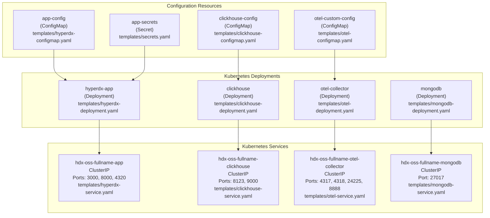
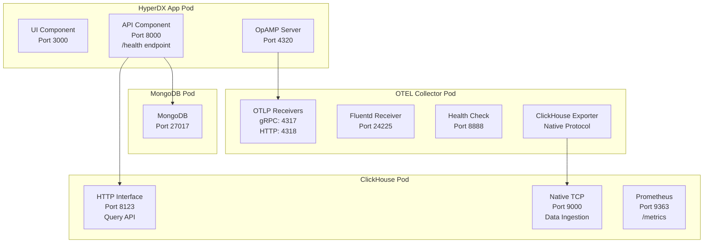
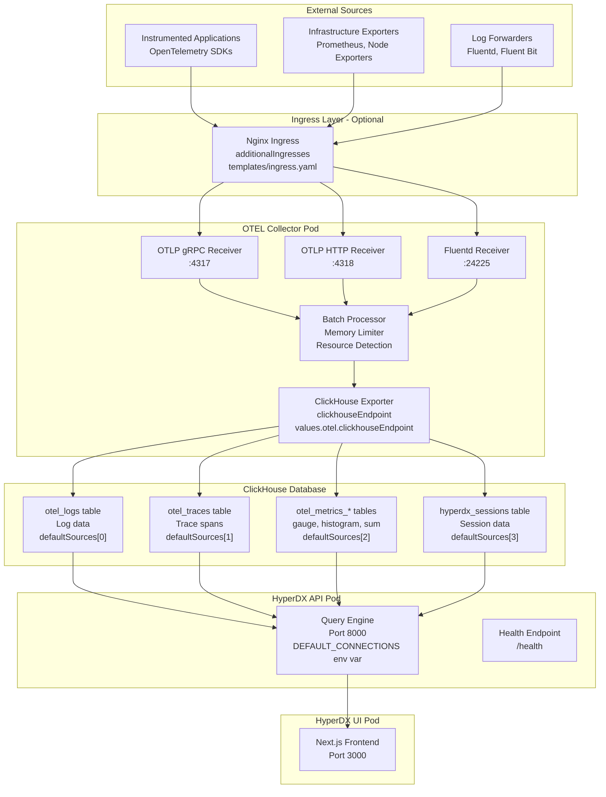
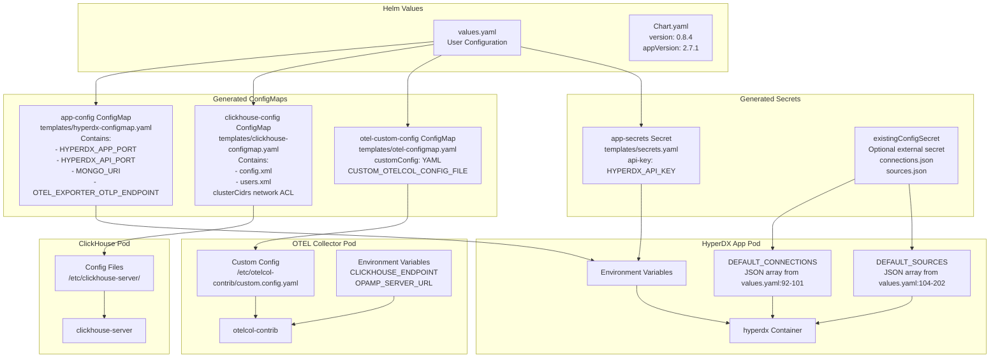
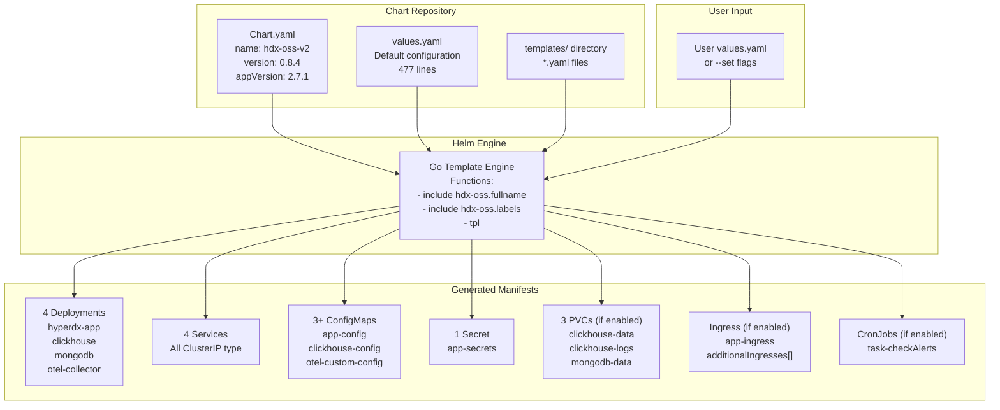
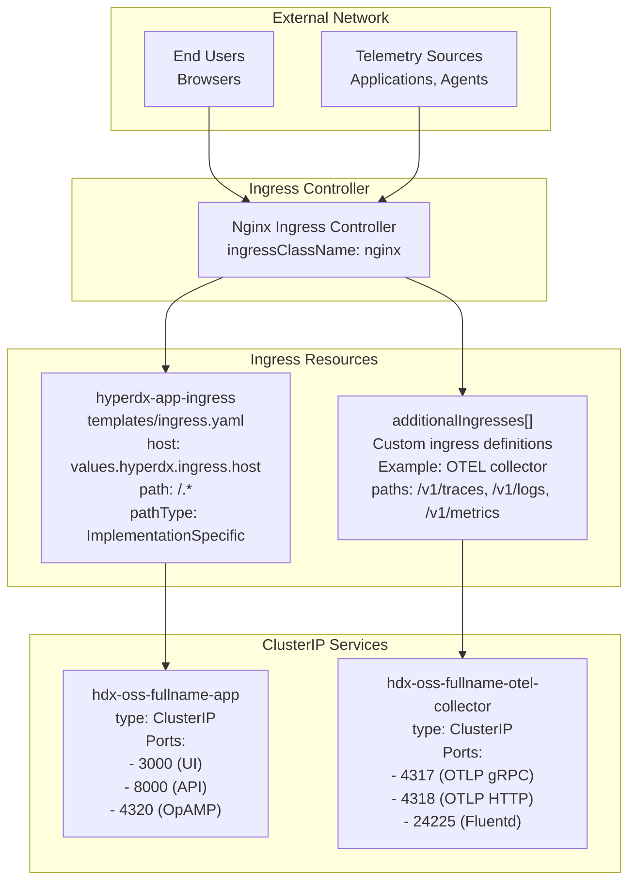
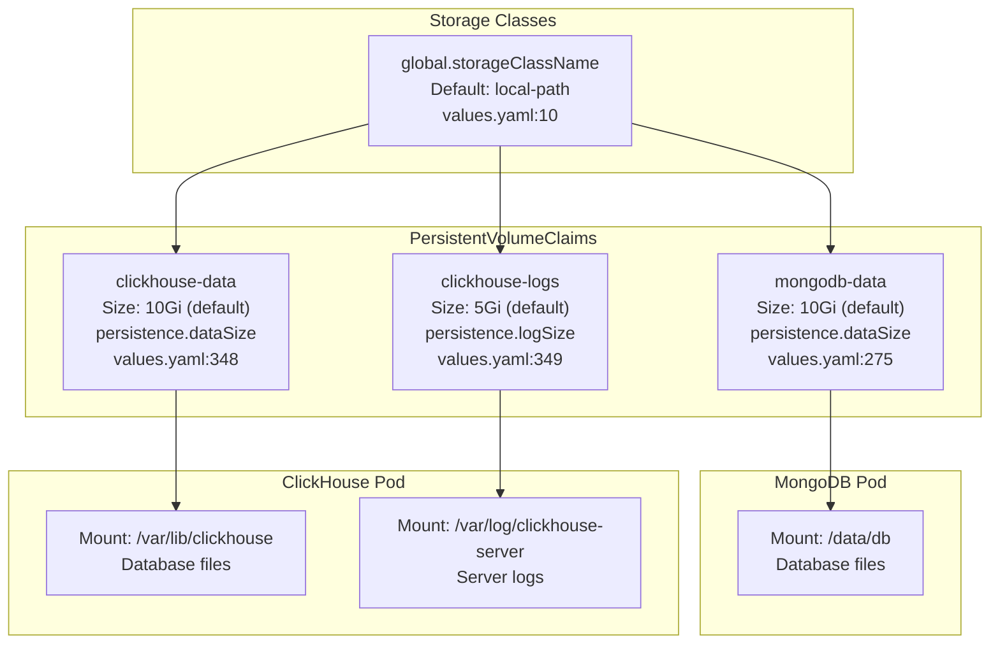
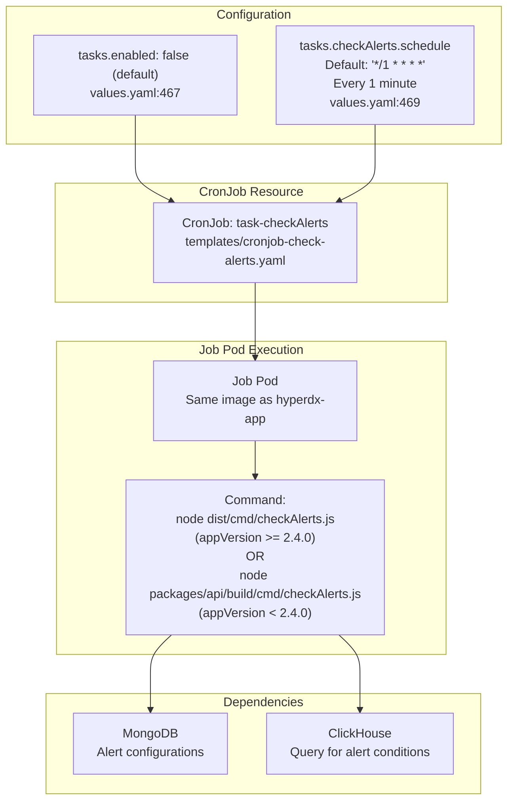

# System Architecture

> **Relevant source files**
> * [README.md](https://github.com/hyperdxio/helm-charts/blob/845dd482/README.md)
> * [charts/hdx-oss-v2/templates/hyperdx-deployment.yaml](https://github.com/hyperdxio/helm-charts/blob/845dd482/charts/hdx-oss-v2/templates/hyperdx-deployment.yaml)
> * [charts/hdx-oss-v2/values.yaml](https://github.com/hyperdxio/helm-charts/blob/845dd482/charts/hdx-oss-v2/values.yaml)

## Purpose and Scope

This document provides a high-level architectural overview of the HyperDX Helm Charts deployment system, showing how the core components interact and how data flows through the system. It focuses on the logical architecture and component relationships as defined by the Helm chart templates.

For detailed configuration of individual components, see [Configuration Reference](/hyperdxio/helm-charts/3-configuration-reference). For specific deployment patterns, see [Deployment Scenarios](/hyperdxio/helm-charts/4-deployment-scenarios). For in-depth component documentation, see [Component Deep Dives](/hyperdxio/helm-charts/5-component-deep-dives).

## Deployed Component Architecture

The HyperDX Helm chart (`hdx-oss-v2`) deploys a complete observability platform consisting of four primary components and supporting infrastructure. Each component is deployed as a Kubernetes Deployment with associated Services, ConfigMaps, and optional persistent storage.

### Core Components and Code Entities



**Component Roles:**

| Component | Container Image | Primary Function | Key Ports |
| --- | --- | --- | --- |
| `hyperdx-app` | `docker.hyperdx.io/hyperdx/hyperdx` | UI (port 3000), API (port 8000), OpAMP server (port 4320) | [values.yaml L49-L51](https://github.com/hyperdxio/helm-charts/blob/845dd482/values.yaml#L49-L51) |
| `clickhouse` | `clickhouse/clickhouse-server:25.7-alpine` | Time-series storage for logs, traces, metrics | HTTP: 8123, Native: 9000 [values.yaml L291-L292](https://github.com/hyperdxio/helm-charts/blob/845dd482/values.yaml#L291-L292) |
| `otel-collector` | `docker.hyperdx.io/hyperdx/hyperdx-otel-collector` | Telemetry ingestion and processing | OTLP gRPC: 4317, HTTP: 4318, Fluentd: 24225 [values.yaml L401-L404](https://github.com/hyperdxio/helm-charts/blob/845dd482/values.yaml#L401-L404) |
| `mongodb` | `mongo:5.0.14-focal` | Application metadata storage | 27017 [values.yaml L257-L258](https://github.com/hyperdxio/helm-charts/blob/845dd482/values.yaml#L257-L258) |

**Sources:** [values.yaml L14-L477](https://github.com/hyperdxio/helm-charts/blob/845dd482/values.yaml#L14-L477)

 [charts/hdx-oss-v2/templates/hyperdx-deployment.yaml](https://github.com/hyperdxio/helm-charts/blob/845dd482/charts/hdx-oss-v2/templates/hyperdx-deployment.yaml)

 [charts/hdx-oss-v2/templates/clickhouse-deployment.yaml](https://github.com/hyperdxio/helm-charts/blob/845dd482/charts/hdx-oss-v2/templates/clickhouse-deployment.yaml)

 [charts/hdx-oss-v2/templates/otel-deployment.yaml](https://github.com/hyperdxio/helm-charts/blob/845dd482/charts/hdx-oss-v2/templates/otel-deployment.yaml)

 [charts/hdx-oss-v2/templates/mongodb-deployment.yaml](https://github.com/hyperdxio/helm-charts/blob/845dd482/charts/hdx-oss-v2/templates/mongodb-deployment.yaml)

## Service Architecture and Internal Communication

The chart creates Kubernetes ClusterIP services for internal pod-to-pod communication. Service names are generated using the Helm template function `{{ include "hdx-oss.fullname" . }}` combined with component suffixes.

### Service DNS and Port Architecture



**Key Service Connection Patterns:**

1. **HyperDX API → ClickHouse**: Uses HTTP port 8123 for queries via `defaultConnections` configuration [values.yaml L92-L101](https://github.com/hyperdxio/helm-charts/blob/845dd482/values.yaml#L92-L101)
2. **OTEL Collector → ClickHouse**: Uses Native TCP port 9000 for high-throughput data ingestion [values.yaml L441-L444](https://github.com/hyperdxio/helm-charts/blob/845dd482/values.yaml#L441-L444)
3. **HyperDX API → MongoDB**: Connection string at `values.hyperdx.mongoUri` [values.yaml L61](https://github.com/hyperdxio/helm-charts/blob/845dd482/values.yaml#L61-L61)
4. **OTEL Collector ← OpAMP Server**: Dynamic configuration at `values.otel.opampServerUrl` [values.yaml L437-L440](https://github.com/hyperdxio/helm-charts/blob/845dd482/values.yaml#L437-L440)

**DNS Resolution Pattern:**
All services use Kubernetes DNS format: `<service-name>.<namespace>.svc.cluster.local`
Shortened form used in same namespace: `<service-name>`

**Sources:** [values.yaml L61](https://github.com/hyperdxio/helm-charts/blob/845dd482/values.yaml#L61-L61)

 [values.yaml L92-L101](https://github.com/hyperdxio/helm-charts/blob/845dd482/values.yaml#L92-L101)

 [values.yaml L437-L444](https://github.com/hyperdxio/helm-charts/blob/845dd482/values.yaml#L437-L444)

 [charts/hdx-oss-v2/templates/hyperdx-service.yaml](https://github.com/hyperdxio/helm-charts/blob/845dd482/charts/hdx-oss-v2/templates/hyperdx-service.yaml)

 [charts/hdx-oss-v2/templates/clickhouse-service.yaml](https://github.com/hyperdxio/helm-charts/blob/845dd482/charts/hdx-oss-v2/templates/clickhouse-service.yaml)

## Telemetry Data Flow Pipeline

This diagram shows the complete path telemetry data takes from external sources through ingestion, processing, storage, and visualization.

### End-to-End Data Flow



**Data Flow Stages:**

1. **Ingestion**: External sources send telemetry via OTLP (gRPC/HTTP) or Fluentd protocols
2. **Processing**: OTEL Collector applies batching, filtering, and resource detection [values.yaml L417-L436](https://github.com/hyperdxio/helm-charts/blob/845dd482/values.yaml#L417-L436)
3. **Storage**: Processed data written to ClickHouse tables via native protocol (port 9000)
4. **Query**: HyperDX API queries ClickHouse via HTTP (port 8123) using connections from `defaultConnections` [values.yaml L92-L101](https://github.com/hyperdxio/helm-charts/blob/845dd482/values.yaml#L92-L101)
5. **Visualization**: UI fetches data from API and renders dashboards

**ClickHouse Table Schema References:**

* `otel_logs`: Log entries with `TimestampTime`, `Body`, `ServiceName`, `TraceId` [values.yaml L106-L128](https://github.com/hyperdxio/helm-charts/blob/845dd482/values.yaml#L106-L128)
* `otel_traces`: Trace spans with `Timestamp`, `SpanName`, `Duration`, `ParentSpanId` [values.yaml L129-L157](https://github.com/hyperdxio/helm-charts/blob/845dd482/values.yaml#L129-L157)
* `otel_metrics_*`: Metrics tables (gauge, histogram, sum) with `TimeUnix` [values.yaml L158-L178](https://github.com/hyperdxio/helm-charts/blob/845dd482/values.yaml#L158-L178)
* `hyperdx_sessions`: Session data with same schema as logs [values.yaml L179-L202](https://github.com/hyperdxio/helm-charts/blob/845dd482/values.yaml#L179-L202)

**Sources:** [values.yaml L92-L202](https://github.com/hyperdxio/helm-charts/blob/845dd482/values.yaml#L92-L202)

 [values.yaml L401-L444](https://github.com/hyperdxio/helm-charts/blob/845dd482/values.yaml#L401-L444)

 [charts/hdx-oss-v2/templates/otel-deployment.yaml](https://github.com/hyperdxio/helm-charts/blob/845dd482/charts/hdx-oss-v2/templates/otel-deployment.yaml)

 [charts/hdx-oss-v2/templates/hyperdx-deployment.yaml L92-L126](https://github.com/hyperdxio/helm-charts/blob/845dd482/charts/hdx-oss-v2/templates/hyperdx-deployment.yaml#L92-L126)

## Configuration Management Architecture

The Helm chart manages configuration through multiple Kubernetes resources that are mounted into pods via different mechanisms.

### Configuration Resource Flow



**Configuration Injection Patterns:**

| Method | Use Case | Example Location |
| --- | --- | --- |
| `envFrom: configMapRef` | Bulk environment variables | [hyperdx-deployment.yaml L92-L94](https://github.com/hyperdxio/helm-charts/blob/845dd482/hyperdx-deployment.yaml#L92-L94) |
| `env: secretKeyRef` | Sensitive single values (API keys) | [hyperdx-deployment.yaml L96-L100](https://github.com/hyperdxio/helm-charts/blob/845dd482/hyperdx-deployment.yaml#L96-L100) |
| `env: value` with `tpl` | Template-rendered JSON configs | [hyperdx-deployment.yaml L115-L122](https://github.com/hyperdxio/helm-charts/blob/845dd482/hyperdx-deployment.yaml#L115-L122) |
| `volumes: configMap` | Configuration files | ClickHouse and OTEL configs |
| `volumes: persistentVolumeClaim` | Persistent data storage | ClickHouse and MongoDB data |

**Configuration Flexibility:**

The chart supports two configuration modes for `defaultConnections` and `defaultSources`:

1. **Inline Configuration** (default): JSON arrays defined directly in `values.yaml` [values.yaml L92-L202](https://github.com/hyperdxio/helm-charts/blob/845dd482/values.yaml#L92-L202)
2. **External Secret** (production): References existing Kubernetes secret with separate keys [values.yaml L87-L90](https://github.com/hyperdxio/helm-charts/blob/845dd482/values.yaml#L87-L90)

Controlled by `values.hyperdx.useExistingConfigSecret` flag [hyperdx-deployment.yaml L101-L123](https://github.com/hyperdxio/helm-charts/blob/845dd482/hyperdx-deployment.yaml#L101-L123)

**Sources:** [values.yaml L87-L202](https://github.com/hyperdxio/helm-charts/blob/845dd482/values.yaml#L87-L202)

 [charts/hdx-oss-v2/templates/hyperdx-deployment.yaml L92-L126](https://github.com/hyperdxio/helm-charts/blob/845dd482/charts/hdx-oss-v2/templates/hyperdx-deployment.yaml#L92-L126)

 [charts/hdx-oss-v2/templates/hyperdx-configmap.yaml](https://github.com/hyperdxio/helm-charts/blob/845dd482/charts/hdx-oss-v2/templates/hyperdx-configmap.yaml)

 [charts/hdx-oss-v2/templates/secrets.yaml](https://github.com/hyperdxio/helm-charts/blob/845dd482/charts/hdx-oss-v2/templates/secrets.yaml)

 [charts/hdx-oss-v2/templates/clickhouse-configmap.yaml](https://github.com/hyperdxio/helm-charts/blob/845dd482/charts/hdx-oss-v2/templates/clickhouse-configmap.yaml)

 [charts/hdx-oss-v2/templates/otel-configmap.yaml](https://github.com/hyperdxio/helm-charts/blob/845dd482/charts/hdx-oss-v2/templates/otel-configmap.yaml)

## Helm Chart Deployment Architecture

The chart uses Helm's templating engine to generate all Kubernetes resources from user-provided values and chart defaults.

### Helm Template Processing



**Key Template Functions:**

* `{{ include "hdx-oss.fullname" . }}`: Generates resource name prefix (release name + chart name)
* `{{ include "hdx-oss.labels" . }}`: Standard Kubernetes labels
* `{{ tpl .Values.hyperdx.defaultConnections . }}`: Template rendering for JSON configurations [hyperdx-deployment.yaml L117](https://github.com/hyperdxio/helm-charts/blob/845dd482/hyperdx-deployment.yaml#L117-L117)

**Conditional Resource Generation:**

| Resource | Enabled By | Values Path |
| --- | --- | --- |
| ClickHouse Deployment | `clickhouse.enabled: true` | [values.yaml L321](https://github.com/hyperdxio/helm-charts/blob/845dd482/values.yaml#L321-L321) |
| OTEL Collector Deployment | `otel.enabled: true` | [values.yaml L405](https://github.com/hyperdxio/helm-charts/blob/845dd482/values.yaml#L405-L405) |
| MongoDB Deployment | `mongodb.enabled: true` | [values.yaml L259](https://github.com/hyperdxio/helm-charts/blob/845dd482/values.yaml#L259-L259) |
| Ingress | `hyperdx.ingress.enabled: true` | [values.yaml L208](https://github.com/hyperdxio/helm-charts/blob/845dd482/values.yaml#L208-L208) |
| CronJobs | `tasks.enabled: true` | [values.yaml L467](https://github.com/hyperdxio/helm-charts/blob/845dd482/values.yaml#L467-L467) |
| Persistent Storage | `*.persistence.enabled: true` | [values.yaml L273-L346](https://github.com/hyperdxio/helm-charts/blob/845dd482/values.yaml#L273-L346) |

This allows deployment scenarios from full-stack (all components) to minimal (HyperDX app only with external dependencies).

**Sources:** [Chart.yaml](https://github.com/hyperdxio/helm-charts/blob/845dd482/Chart.yaml)

 [values.yaml L1-L477](https://github.com/hyperdxio/helm-charts/blob/845dd482/values.yaml#L1-L477)

 [charts/hdx-oss-v2/templates/](https://github.com/hyperdxio/helm-charts/blob/845dd482/charts/hdx-oss-v2/templates/)

 [README.md L54-L234](https://github.com/hyperdxio/helm-charts/blob/845dd482/README.md#L54-L234)

## Network and Ingress Architecture

External access to the HyperDX platform is managed through Kubernetes Ingress resources that route traffic to internal ClusterIP services.

### Ingress and Service Exposure



**Ingress Configuration Patterns:**

1. **Main Application Ingress** [values.yaml L207-L222](https://github.com/hyperdxio/helm-charts/blob/845dd482/values.yaml#L207-L222) : * Routes all traffic (`path: /(.*)`) to HyperDX app service * Configurable TLS with `tls.enabled` and `tls.secretName` * Nginx annotations for body size, timeouts * Requires `ingress.host` to match `frontendUrl` for proper asset loading
2. **Additional Ingresses** [values.yaml L223-L239](https://github.com/hyperdxio/helm-charts/blob/845dd482/values.yaml#L223-L239) : * Array of custom ingress definitions * Commonly used to expose OTEL collector endpoints * Supports separate TLS configuration per ingress * Each can target different services/ports

**Service Type Security:**

All services default to `ClusterIP` type for security [values.yaml L248-L338](https://github.com/hyperdxio/helm-charts/blob/845dd482/values.yaml#L248-L338)

:

* No direct external access without Ingress
* Internal pod-to-pod communication only
* External access requires explicit Ingress configuration with TLS

**Cloud-Specific Considerations:**

* **GKE LoadBalancer DNS Issue**: Requires FQDN for OpAMP server URL to avoid external IP resolution [README.md L534-L549](https://github.com/hyperdxio/helm-charts/blob/845dd482/README.md#L534-L549)
* **ClickHouse Network ACL**: `clusterCidrs` configuration restricts database access to cluster internal IPs [values.yaml L359-L366](https://github.com/hyperdxio/helm-charts/blob/845dd482/values.yaml#L359-L366)

**Sources:** [values.yaml L207-L239](https://github.com/hyperdxio/helm-charts/blob/845dd482/values.yaml#L207-L239)

 [values.yaml L248](https://github.com/hyperdxio/helm-charts/blob/845dd482/values.yaml#L248-L248)

 [values.yaml L338](https://github.com/hyperdxio/helm-charts/blob/845dd482/values.yaml#L338-L338)

 [values.yaml L359-L366](https://github.com/hyperdxio/helm-charts/blob/845dd482/values.yaml#L359-L366)

 [charts/hdx-oss-v2/templates/ingress.yaml](https://github.com/hyperdxio/helm-charts/blob/845dd482/charts/hdx-oss-v2/templates/ingress.yaml)

 [charts/hdx-oss-v2/templates/hyperdx-service.yaml](https://github.com/hyperdxio/helm-charts/blob/845dd482/charts/hdx-oss-v2/templates/hyperdx-service.yaml)

 [README.md L334-L499](https://github.com/hyperdxio/helm-charts/blob/845dd482/README.md#L334-L499)

## Health Monitoring and Probes

All deployments include Kubernetes health probes to ensure reliability and proper lifecycle management.

### Health Check Architecture

```mermaid
flowchart TD

LivenessProbes["Liveness Probes<br>Restart on failure"]
ReadinessProbes["Readiness Probes<br>Remove from service endpoints"]
StartupProbes["Startup Probes<br>Delay other probes"]
AppLiveness["HTTP GET /health<br>Port 8000<br>initialDelaySeconds: 10<br>periodSeconds: 30"]
AppReadiness["HTTP GET /health<br>Port 8000<br>initialDelaySeconds: 1<br>periodSeconds: 10"]
CHLiveness["HTTP GET /<br>Port 8123<br>initialDelaySeconds: 10"]
CHReadiness["HTTP GET /<br>Port 8123<br>initialDelaySeconds: 1"]
CHStartup["HTTP GET /<br>Port 8123<br>failureThreshold: 30<br>Allows 5 minutes to start"]
OtelLiveness["HTTP GET /<br>Port 8888 (health port)<br>initialDelaySeconds: 10"]
OtelReadiness["HTTP GET /<br>Port 8888<br>initialDelaySeconds: 5"]
MongoLiveness["TCP Socket<br>Port 27017<br>initialDelaySeconds: 10"]
MongoReadiness["TCP Socket<br>Port 27017<br>initialDelaySeconds: 1"]

LivenessProbes --> AppLiveness
LivenessProbes --> CHLiveness
LivenessProbes --> OtelLiveness
LivenessProbes --> MongoLiveness
ReadinessProbes --> AppReadiness
ReadinessProbes --> CHReadiness
ReadinessProbes --> OtelReadiness
ReadinessProbes --> MongoReadiness
StartupProbes --> CHStartup

subgraph subGraph4 ["MongoDB Pod"]
    MongoLiveness
    MongoReadiness
end

subgraph subGraph3 ["OTEL Collector Pod"]
    OtelLiveness
    OtelReadiness
end

subgraph subGraph2 ["ClickHouse Pod"]
    CHLiveness
    CHReadiness
    CHStartup
end

subgraph subGraph1 ["HyperDX App Pod"]
    AppLiveness
    AppReadiness
end

subgraph subGraph0 ["Kubelet Health Checks"]
    LivenessProbes
    ReadinessProbes
    StartupProbes
end
```



**Probe Configuration:**

| Component | Probe Type | Endpoint | Configuration Path |
| --- | --- | --- | --- |
| HyperDX App | HTTP `/health` on port 8000 | API health endpoint | [values.yaml L23-L34](https://github.com/hyperdxio/helm-charts/blob/845dd482/values.yaml#L23-L34) |
| ClickHouse | HTTP `/` on port 8123 | ClickHouse HTTP interface | [values.yaml L303-L320](https://github.com/hyperdxio/helm-charts/blob/845dd482/values.yaml#L303-L320) |
| OTEL Collector | HTTP `/` on port 8888 | OTEL health extension | [values.yaml L453-L464](https://github.com/hyperdxio/helm-charts/blob/845dd482/values.yaml#L453-L464) |
| MongoDB | TCP socket on port 27017 | MongoDB connection check | [values.yaml L276-L287](https://github.com/hyperdxio/helm-charts/blob/845dd482/values.yaml#L276-L287) |

**Init Containers:**

HyperDX app uses an init container to wait for MongoDB availability before starting [hyperdx-deployment.yaml L50-L56](https://github.com/hyperdxio/helm-charts/blob/845dd482/hyperdx-deployment.yaml#L50-L56)

:

```yaml
initContainers:
  - name: wait-for-mongodb
    image: busybox
    command: ['sh', '-c', 'until nc -z mongodb 27017; do echo waiting; sleep 2; done;']
```

This ensures proper startup ordering and prevents connection failures.

**Sources:** [values.yaml L23-L34](https://github.com/hyperdxio/helm-charts/blob/845dd482/values.yaml#L23-L34)

 [values.yaml L276-L287](https://github.com/hyperdxio/helm-charts/blob/845dd482/values.yaml#L276-L287)

 [values.yaml L303-L320](https://github.com/hyperdxio/helm-charts/blob/845dd482/values.yaml#L303-L320)

 [values.yaml L453-L464](https://github.com/hyperdxio/helm-charts/blob/845dd482/values.yaml#L453-L464)

 [charts/hdx-oss-v2/templates/hyperdx-deployment.yaml L50-L91](https://github.com/hyperdxio/helm-charts/blob/845dd482/charts/hdx-oss-v2/templates/hyperdx-deployment.yaml#L50-L91)

## Storage Architecture

The chart provisions persistent storage for stateful components using Kubernetes PersistentVolumeClaims (PVCs).

### Persistent Storage Layout



**Persistence Configuration:**

| Component | PVC | Default Size | Enabled By | Values Path |
| --- | --- | --- | --- | --- |
| ClickHouse Data | `clickhouse-data` | 10Gi | `clickhouse.persistence.enabled` | [values.yaml L346-L348](https://github.com/hyperdxio/helm-charts/blob/845dd482/values.yaml#L346-L348) |
| ClickHouse Logs | `clickhouse-logs` | 5Gi | `clickhouse.persistence.enabled` | [values.yaml L346-L349](https://github.com/hyperdxio/helm-charts/blob/845dd482/values.yaml#L346-L349) |
| MongoDB Data | `mongodb-data` | 10Gi | `mongodb.persistence.enabled` | [values.yaml L273-L275](https://github.com/hyperdxio/helm-charts/blob/845dd482/values.yaml#L273-L275) |

**PVC Lifecycle:**

The chart includes a `global.keepPVC` option [values.yaml L12](https://github.com/hyperdxio/helm-charts/blob/845dd482/values.yaml#L12-L12)

 that controls whether PVCs are deleted when the Helm release is uninstalled:

* `keepPVC: false` (default): PVCs deleted on uninstall
* `keepPVC: true`: PVCs retained, allowing data preservation across reinstalls

This is implemented via Helm annotations on PVC resources:

```yaml
annotations:
  "helm.sh/resource-policy": keep  # When keepPVC: true
```

**Storage Class Flexibility:**

Users can override the storage class per component or globally:

* Global: `global.storageClassName` [values.yaml L10](https://github.com/hyperdxio/helm-charts/blob/845dd482/values.yaml#L10-L10)
* Component-specific overrides available in deployment templates

**Sources:** [values.yaml L10-L12](https://github.com/hyperdxio/helm-charts/blob/845dd482/values.yaml#L10-L12)

 [values.yaml L273-L275](https://github.com/hyperdxio/helm-charts/blob/845dd482/values.yaml#L273-L275)

 [values.yaml L346-L349](https://github.com/hyperdxio/helm-charts/blob/845dd482/values.yaml#L346-L349)

 [charts/hdx-oss-v2/templates/clickhouse-pvc.yaml](https://github.com/hyperdxio/helm-charts/blob/845dd482/charts/hdx-oss-v2/templates/clickhouse-pvc.yaml)

 [charts/hdx-oss-v2/templates/mongodb-pvc.yaml](https://github.com/hyperdxio/helm-charts/blob/845dd482/charts/hdx-oss-v2/templates/mongodb-pvc.yaml)

## Scheduled Tasks Architecture

The chart supports CronJob-based scheduled tasks for periodic operations like alert checking.

### CronJob Configuration



**Task Execution Details:**

* **Default Mode**: Tasks run in-process within the HyperDX app container [README.md L326-L332](https://github.com/hyperdxio/helm-charts/blob/845dd482/README.md#L326-L332)
* **CronJob Mode**: Enabled by setting `tasks.enabled: true` [values.yaml L467](https://github.com/hyperdxio/helm-charts/blob/845dd482/values.yaml#L467-L467)
* **Resource Limits**: Configurable per task [values.yaml L470-L476](https://github.com/hyperdxio/helm-charts/blob/845dd482/values.yaml#L470-L476) : ```yaml tasks:   checkAlerts:     resources:       limits:         cpu: 200m         memory: 256Mi       requests:         cpu: 100m         memory: 128Mi ```

**Version-Specific Command Paths:**

The chart uses Helm template logic to select the correct command path based on `appVersion`:

* Versions >= 2.4.0: `node dist/cmd/checkAlerts.js`
* Versions < 2.4.0: `node packages/api/build/cmd/checkAlerts.js`

This ensures compatibility across different HyperDX application versions.

**Sources:** [values.yaml L466-L477](https://github.com/hyperdxio/helm-charts/blob/845dd482/values.yaml#L466-L477)

 [charts/hdx-oss-v2/templates/cronjob-check-alerts.yaml](https://github.com/hyperdxio/helm-charts/blob/845dd482/charts/hdx-oss-v2/templates/cronjob-check-alerts.yaml)

 [README.md L325-L333](https://github.com/hyperdxio/helm-charts/blob/845dd482/README.md#L325-L333)