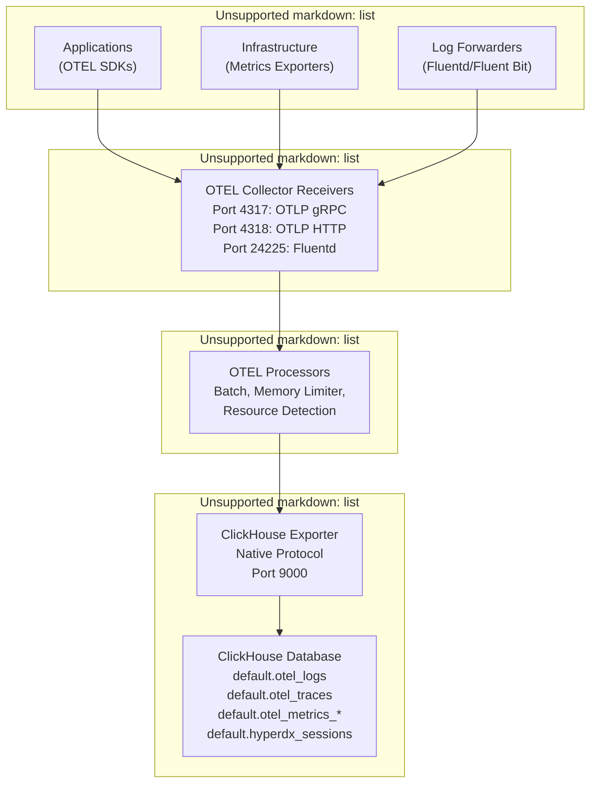
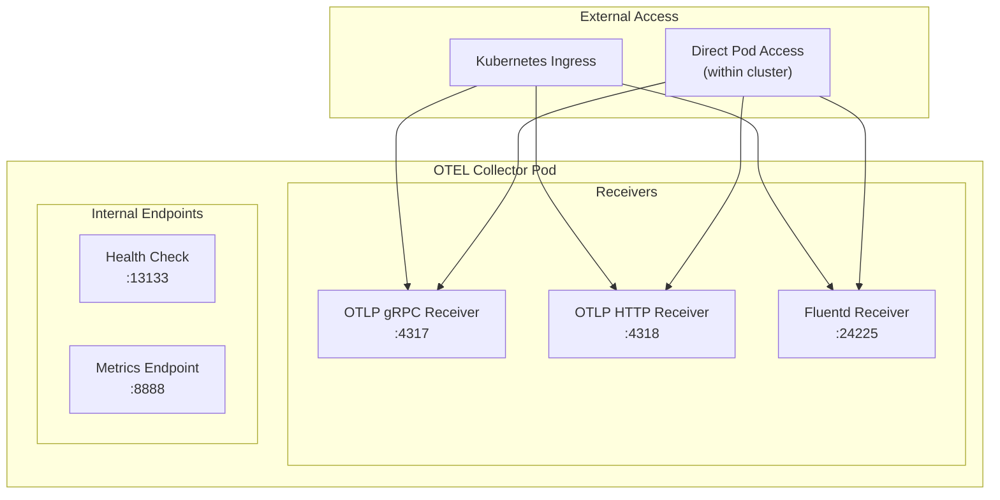
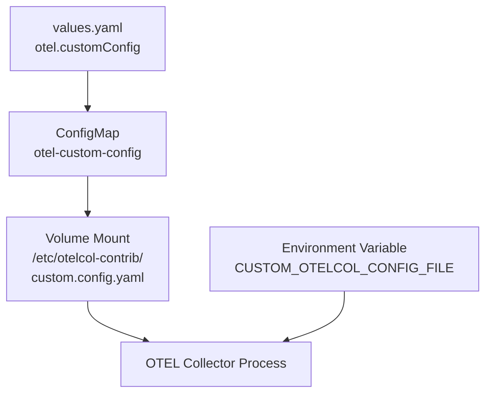
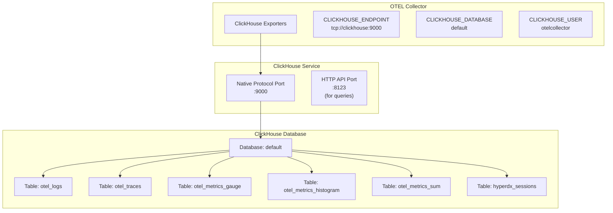
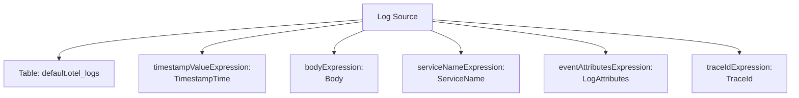
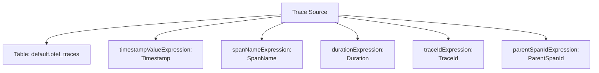
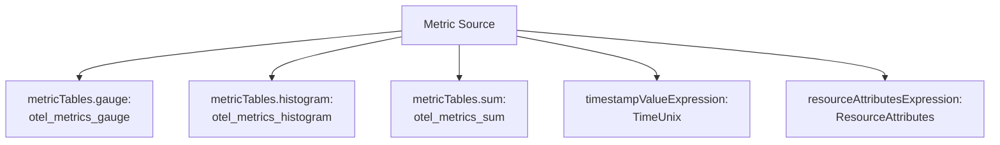
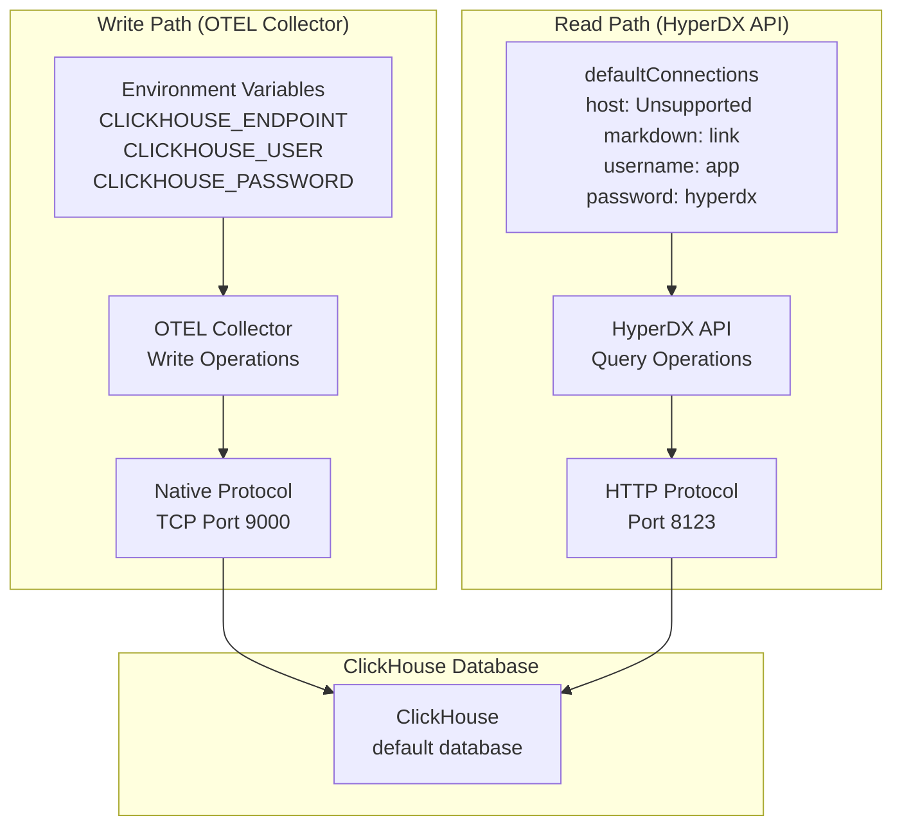
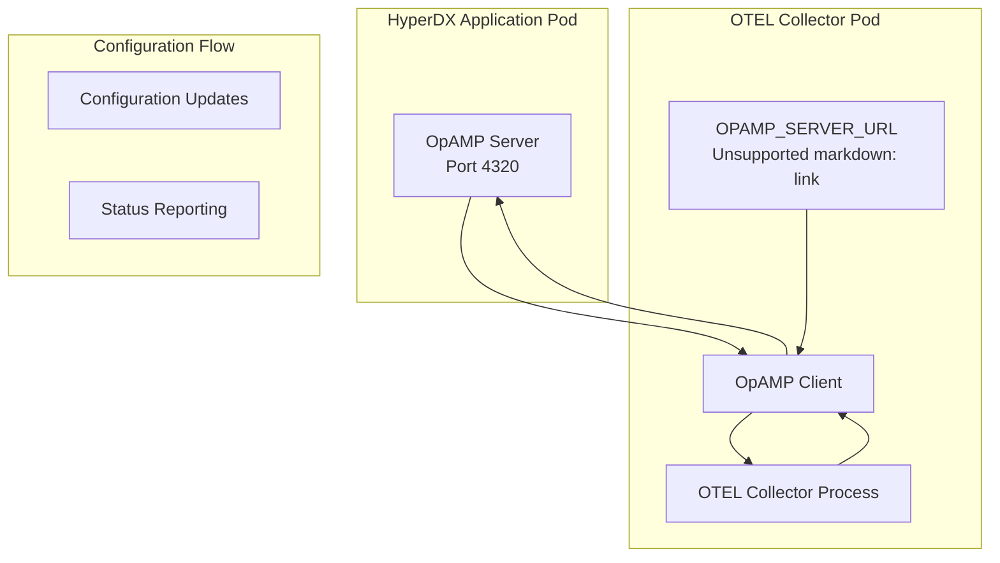

# Telemetry Data Pipeline

> **Relevant source files**
> * [README.md](https://github.com/hyperdxio/helm-charts/blob/845dd482/README.md)
> * [charts/hdx-oss-v2/templates/otel-collector-deployment.yaml](https://github.com/hyperdxio/helm-charts/blob/845dd482/charts/hdx-oss-v2/templates/otel-collector-deployment.yaml)
> * [charts/hdx-oss-v2/values.yaml](https://github.com/hyperdxio/helm-charts/blob/845dd482/charts/hdx-oss-v2/values.yaml)

## Purpose and Scope

This document describes the end-to-end telemetry data pipeline in HyperDX, covering how observability data (logs, traces, and metrics) flows from instrumented applications through the OpenTelemetry Collector to ClickHouse storage. This includes the data ingestion layer, processing stages, storage mechanisms, and the configuration that ties these components together.

For information about configuring data source connections and querying stored telemetry data, see [Data Sources and Connections](/hyperdxio/helm-charts/6.2-data-sources-and-connections). For guidance on instrumenting applications to send data to this pipeline, see [Integrating Applications](/hyperdxio/helm-charts/6.3-integrating-applications). For detailed deployment configuration of the OTEL Collector component, see [OpenTelemetry Collector](/hyperdxio/helm-charts/5.3-opentelemetry-collector).

## Pipeline Architecture Overview

The telemetry data pipeline consists of four primary stages:



**Sources:** [values.yaml L368-L452](https://github.com/hyperdxio/helm-charts/blob/845dd482/values.yaml#L368-L452)

 [otel-collector-deployment.yaml L1-L144](https://github.com/hyperdxio/helm-charts/blob/845dd482/otel-collector-deployment.yaml#L1-L144)

 [README.md L61-L63](https://github.com/hyperdxio/helm-charts/blob/845dd482/README.md#L61-L63)

## Data Ingestion Layer

The OpenTelemetry Collector serves as the primary ingestion point for all telemetry data. It exposes multiple protocols and ports to accommodate different data sources.

### Port Architecture

The OTEL Collector deployment exposes the following ports:

| Port | Protocol | Purpose | Service Name |
| --- | --- | --- | --- |
| 4317 | OTLP gRPC | OpenTelemetry Protocol (gRPC transport) | `otlp-grpc` |
| 4318 | OTLP HTTP | OpenTelemetry Protocol (HTTP transport) | `otlp-http` |
| 24225 | Fluentd | Forward protocol for log collection | `fluentd` |
| 13133 | HTTP | Health check endpoint | `health` |
| 8888 | HTTP | Internal metrics endpoint | `metrics` |

**Sources:** [values.yaml L400-L404](https://github.com/hyperdxio/helm-charts/blob/845dd482/values.yaml#L400-L404)

 [otel-collector-deployment.yaml L49-L54](https://github.com/hyperdxio/helm-charts/blob/845dd482/otel-collector-deployment.yaml#L49-L54)

 [otel-collector-deployment.yaml L125-L140](https://github.com/hyperdxio/helm-charts/blob/845dd482/otel-collector-deployment.yaml#L125-L140)

### Receiver Configuration



The collector deployment defines container ports that correspond to each receiver protocol. Applications can send telemetry data to any of these endpoints depending on their instrumentation setup.

**Sources:** [otel-collector-deployment.yaml L49-L54](https://github.com/hyperdxio/helm-charts/blob/845dd482/otel-collector-deployment.yaml#L49-L54)

 [values.yaml L400-L404](https://github.com/hyperdxio/helm-charts/blob/845dd482/values.yaml#L400-L404)

## Data Processing Layer

The OTEL Collector processes incoming telemetry data through a series of processors before exporting to ClickHouse. While the base configuration is managed by the HyperDX OTEL Collector image, custom processing pipelines can be defined.

### Custom Pipeline Configuration

Custom OTEL Collector configurations can be provided via the `customConfig` parameter, which is mounted as a ConfigMap at `/etc/otelcol-contrib/custom.config.yaml`:



The custom configuration is referenced through the `CUSTOM_OTELCOL_CONFIG_FILE` environment variable when present.

**Sources:** [values.yaml L417-L436](https://github.com/hyperdxio/helm-charts/blob/845dd482/values.yaml#L417-L436)

 [otel-collector-deployment.yaml L39-L44](https://github.com/hyperdxio/helm-charts/blob/845dd482/otel-collector-deployment.yaml#L39-L44)

 [otel-collector-deployment.yaml L103-L116](https://github.com/hyperdxio/helm-charts/blob/845dd482/otel-collector-deployment.yaml#L103-L116)

### Processing Pipeline Environment Variables

The OTEL Collector deployment configures several environment variables that define the processing pipeline behavior:

| Environment Variable | Purpose | Default Value |
| --- | --- | --- |
| `CLICKHOUSE_ENDPOINT` | TCP endpoint for ClickHouse native protocol | `tcp://<fullname>-clickhouse:9000` |
| `CLICKHOUSE_SERVER_ENDPOINT` | Server address for ClickHouse | `<fullname>-clickhouse:9000` |
| `CLICKHOUSE_PROMETHEUS_METRICS_ENDPOINT` | ClickHouse Prometheus metrics | `<fullname>-clickhouse:9363` |
| `OPAMP_SERVER_URL` | OpAMP management server | `http://<fullname>-app:4320` |
| `HYPERDX_OTEL_EXPORTER_CLICKHOUSE_DATABASE` | Target database name | `default` |
| `CLICKHOUSE_USER` | ClickHouse authentication user | `otelcollector` |
| `CLICKHOUSE_PASSWORD` | ClickHouse authentication password | `otelcollectorpass` |

**Sources:** [otel-collector-deployment.yaml L79-L109](https://github.com/hyperdxio/helm-charts/blob/845dd482/otel-collector-deployment.yaml#L79-L109)

 [values.yaml L441-L452](https://github.com/hyperdxio/helm-charts/blob/845dd482/values.yaml#L441-L452)

## Data Storage Layer

### ClickHouse Exporter Configuration

The OTEL Collector writes telemetry data to ClickHouse using the native TCP protocol (port 9000) rather than the HTTP API (port 8123). This provides higher performance and more efficient data transfer.



The connection is established using credentials defined in the OTEL Collector deployment, with a dedicated `otelcollector` user for write operations.

**Sources:** [otel-collector-deployment.yaml L80-L102](https://github.com/hyperdxio/helm-charts/blob/845dd482/otel-collector-deployment.yaml#L80-L102)

 [values.yaml L289-L293](https://github.com/hyperdxio/helm-charts/blob/845dd482/values.yaml#L289-L293)

 [values.yaml L441-L452](https://github.com/hyperdxio/helm-charts/blob/845dd482/values.yaml#L441-L452)

### Data Schema Overview

The pipeline stores telemetry data in ClickHouse using predefined table schemas. Each telemetry signal type has corresponding tables:

| Signal Type | Table Name | Primary Use |
| --- | --- | --- |
| Logs | `otel_logs` | Log entries from applications and infrastructure |
| Traces | `otel_traces` | Distributed tracing spans |
| Metrics (Gauge) | `otel_metrics_gauge` | Point-in-time metric values |
| Metrics (Histogram) | `otel_metrics_histogram` | Distribution metrics |
| Metrics (Sum) | `otel_metrics_sum` | Cumulative metric values |
| Sessions | `hyperdx_sessions` | User session data |

These tables are referenced in the `defaultSources` configuration, which maps data sources to their respective ClickHouse tables for querying.

**Sources:** [values.yaml L104-L202](https://github.com/hyperdxio/helm-charts/blob/845dd482/values.yaml#L104-L202)

## Default Data Sources Configuration

The `hyperdx.defaultSources` configuration defines how the HyperDX API queries telemetry data from ClickHouse. Each source specifies:

### Logs Source



Key expressions for the logs source:

* **Table**: `default.otel_logs`
* **Timestamp**: `TimestampTime` (for filtering), `Timestamp` (for display)
* **Body**: `Body` (log message content)
* **Severity**: `SeverityText`
* **Trace correlation**: `TraceId`, `SpanId`

**Sources:** [values.yaml L104-L128](https://github.com/hyperdxio/helm-charts/blob/845dd482/values.yaml#L104-L128)

### Traces Source



Key expressions for the traces source:

* **Table**: `default.otel_traces`
* **Timestamp**: `Timestamp`
* **Span identification**: `SpanName`, `SpanId`, `TraceId`, `ParentSpanId`
* **Duration**: `Duration` (precision: 9 decimal places, nanoseconds)
* **Status**: `StatusCode`, `StatusMessage`

**Sources:** [values.yaml L129-L157](https://github.com/hyperdxio/helm-charts/blob/845dd482/values.yaml#L129-L157)

### Metrics Source



The metrics source is unique in that it doesn't specify a single table but rather a mapping of metric types to their respective tables:

* **Gauge metrics**: `otel_metrics_gauge`
* **Histogram metrics**: `otel_metrics_histogram`
* **Sum metrics**: `otel_metrics_sum`
* **Timestamp**: `TimeUnix`

**Sources:** [values.yaml L158-L178](https://github.com/hyperdxio/helm-charts/blob/845dd482/values.yaml#L158-L178)

### Sessions Source

The sessions source follows a similar structure to logs, using the `hyperdx_sessions` table:

* **Table**: `default.hyperdx_sessions`
* **Timestamp**: `TimestampTime` (for filtering), `Timestamp` (for display)
* **Body**: `Body`
* **Service**: `ServiceName`

**Sources:** [values.yaml L179-L202](https://github.com/hyperdxio/helm-charts/blob/845dd482/values.yaml#L179-L202)

## Pipeline Configuration Management

### Connection Configuration

The pipeline uses two sets of connection information:

1. **OTEL Collector → ClickHouse**: Configured via environment variables in the OTEL Collector deployment
2. **HyperDX API → ClickHouse**: Configured via `defaultConnections` in values.yaml



The OTEL Collector uses the native protocol for efficient bulk writes, while the HyperDX API uses HTTP for flexible querying.

**Sources:** [values.yaml L92-L101](https://github.com/hyperdxio/helm-charts/blob/845dd482/values.yaml#L92-L101)

 [otel-collector-deployment.yaml L80-L102](https://github.com/hyperdxio/helm-charts/blob/845dd482/otel-collector-deployment.yaml#L80-L102)

### External Configuration Options

For deployments using external ClickHouse or OTEL Collector instances, the pipeline can be reconfigured:

#### External ClickHouse Configuration

To use an external ClickHouse cluster, disable the built-in ClickHouse and configure the endpoints:

```yaml
clickhouse:
  enabled: false

otel:
  clickhouseEndpoint: "tcp://external-clickhouse:9000"
  clickhouseUser: "otel_user"
  clickhousePassword: "secure_password"
  clickhouseDatabase: "telemetry"
  
hyperdx:
  defaultConnections: |
    [{
      "name": "External ClickHouse",
      "host": "http://external-clickhouse:8123",
      "port": 8123,
      "username": "app_user",
      "password": "app_password"
    }]
```

**Sources:** [values.yaml L289-L293](https://github.com/hyperdxio/helm-charts/blob/845dd482/values.yaml#L289-L293)

 [values.yaml L441-L446](https://github.com/hyperdxio/helm-charts/blob/845dd482/values.yaml#L441-L446)

 [values.yaml L92-L101](https://github.com/hyperdxio/helm-charts/blob/845dd482/values.yaml#L92-L101)

 [README.md L70-L96](https://github.com/hyperdxio/helm-charts/blob/845dd482/README.md#L70-L96)

#### External OTEL Collector Configuration

To use an external OTEL Collector:

```yaml
otel:
  enabled: false

hyperdx:
  otelExporterEndpoint: "http://external-otel-collector:4318"
```

This configuration is used by the HyperDX application itself to send its own telemetry data.

**Sources:** [values.yaml L59-L60](https://github.com/hyperdxio/helm-charts/blob/845dd482/values.yaml#L59-L60)

 [values.yaml L405](https://github.com/hyperdxio/helm-charts/blob/845dd482/values.yaml#L405-L405)

 [README.md L186-L197](https://github.com/hyperdxio/helm-charts/blob/845dd482/README.md#L186-L197)

### Configuration via External Secrets

For production deployments, connection credentials can be stored in Kubernetes secrets rather than inline configuration:

```yaml
hyperdx:
  useExistingConfigSecret: true
  existingConfigSecret: "hyperdx-external-config"
  existingConfigConnectionsKey: "connections.json"
  existingConfigSourcesKey: "sources.json"
```

The secret must contain JSON arrays for both connections and sources configurations, following the same schema as the inline `defaultConnections` and `defaultSources`.

**Sources:** [values.yaml L77-L90](https://github.com/hyperdxio/helm-charts/blob/845dd482/values.yaml#L77-L90)

 [README.md L98-L183](https://github.com/hyperdxio/helm-charts/blob/845dd482/README.md#L98-L183)

## OpAMP Dynamic Configuration

The OTEL Collector connects to an OpAMP (Open Agent Management Protocol) server for dynamic configuration management:



The OpAMP server URL is configurable and defaults to the HyperDX application service. In cloud environments like GKE where LoadBalancer DNS resolution may cause issues, this can be overridden with an FQDN.

**Sources:** [otel-collector-deployment.yaml L88-L89](https://github.com/hyperdxio/helm-charts/blob/845dd482/otel-collector-deployment.yaml#L88-L89)

 [values.yaml L437-L440](https://github.com/hyperdxio/helm-charts/blob/845dd482/values.yaml#L437-L440)

 [values.yaml L48-L51](https://github.com/hyperdxio/helm-charts/blob/845dd482/values.yaml#L48-L51)

 [README.md L530-L549](https://github.com/hyperdxio/helm-charts/blob/845dd482/README.md#L530-L549)

## Health and Monitoring

The OTEL Collector exposes health check and metrics endpoints:

### Liveness and Readiness Probes

Both probes check the health endpoint at port 13133:

```yaml
livenessProbe:
  httpGet:
    path: /
    port: 13133
  initialDelaySeconds: 10
  periodSeconds: 30
  timeoutSeconds: 5
  failureThreshold: 3

readinessProbe:
  httpGet:
    path: /
    port: 13133
  initialDelaySeconds: 5
  periodSeconds: 10
  timeoutSeconds: 5
  failureThreshold: 3
```

**Sources:** [otel-collector-deployment.yaml L59-L78](https://github.com/hyperdxio/helm-charts/blob/845dd482/otel-collector-deployment.yaml#L59-L78)

 [values.yaml L453-L464](https://github.com/hyperdxio/helm-charts/blob/845dd482/values.yaml#L453-L464)

### Internal Metrics Endpoint

The collector exposes its own operational metrics at port 8888, which can be scraped by Prometheus or other monitoring systems.

**Sources:** [otel-collector-deployment.yaml L54](https://github.com/hyperdxio/helm-charts/blob/845dd482/otel-collector-deployment.yaml#L54-L54)

 [otel-collector-deployment.yaml L138-L140](https://github.com/hyperdxio/helm-charts/blob/845dd482/otel-collector-deployment.yaml#L138-L140)

## Data Flow Summary

The complete telemetry data pipeline follows this flow:

1. **Ingestion**: Applications send telemetry data to OTEL Collector endpoints (ports 4317, 4318, or 24225)
2. **Processing**: OTEL Collector processes data through configured pipelines (batching, filtering, enrichment)
3. **Export**: Processed data is written to ClickHouse via native TCP protocol (port 9000)
4. **Storage**: Data is stored in appropriate ClickHouse tables based on signal type
5. **Query**: HyperDX API queries ClickHouse via HTTP (port 8123) using `defaultConnections` and `defaultSources` configuration
6. **Presentation**: Query results are presented through the HyperDX UI

This pipeline is designed for high throughput and reliability, with the OTEL Collector handling backpressure and the native ClickHouse protocol providing efficient data transfer.

**Sources:** [values.yaml L1-L477](https://github.com/hyperdxio/helm-charts/blob/845dd482/values.yaml#L1-L477)

 [otel-collector-deployment.yaml L1-L144](https://github.com/hyperdxio/helm-charts/blob/845dd482/otel-collector-deployment.yaml#L1-L144)

 [README.md L1-L631](https://github.com/hyperdxio/helm-charts/blob/845dd482/README.md#L1-L631)