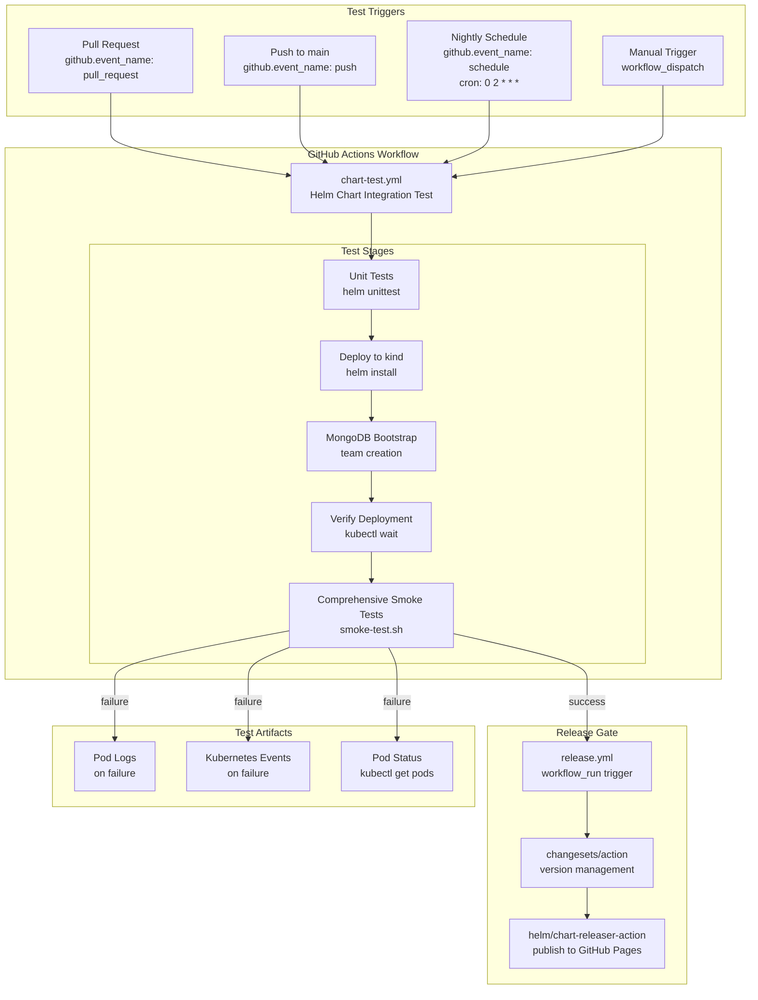
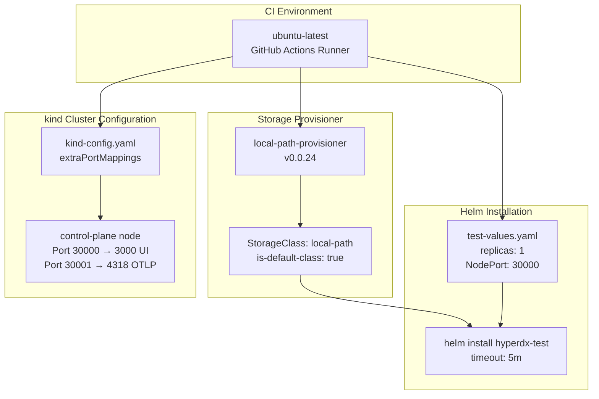
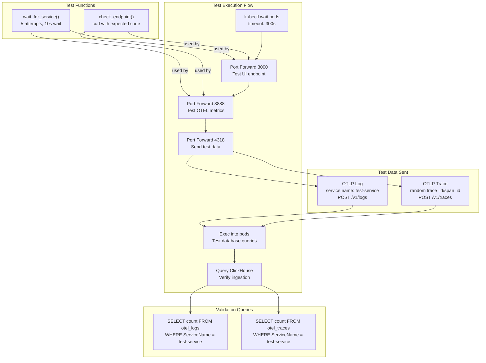
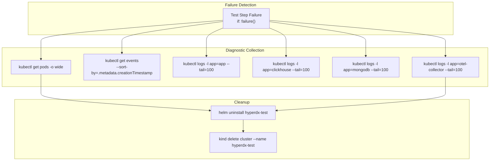
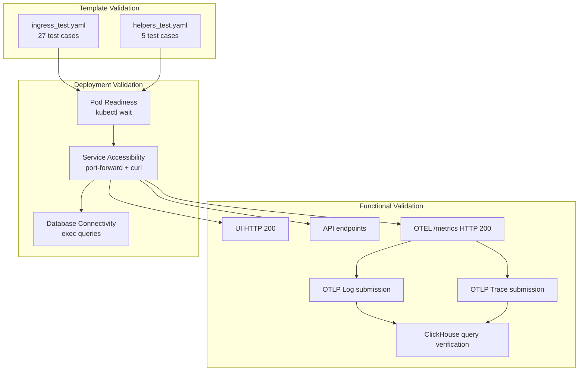

# Testing

> **Relevant source files**
> * [.github/workflows/chart-test.yml](https://github.com/hyperdxio/helm-charts/blob/845dd482/.github/workflows/chart-test.yml)
> * [.github/workflows/release.yml](https://github.com/hyperdxio/helm-charts/blob/845dd482/.github/workflows/release.yml)
> * [charts/hdx-oss-v2/templates/ingress.yaml](https://github.com/hyperdxio/helm-charts/blob/845dd482/charts/hdx-oss-v2/templates/ingress.yaml)
> * [charts/hdx-oss-v2/tests/helpers_test.yaml](https://github.com/hyperdxio/helm-charts/blob/845dd482/charts/hdx-oss-v2/tests/helpers_test.yaml)
> * [charts/hdx-oss-v2/tests/ingress_test.yaml](https://github.com/hyperdxio/helm-charts/blob/845dd482/charts/hdx-oss-v2/tests/ingress_test.yaml)
> * [scripts/smoke-test.sh](https://github.com/hyperdxio/helm-charts/blob/845dd482/scripts/smoke-test.sh)

This document describes the testing infrastructure for the HyperDX Helm charts, including unit tests, integration tests, and smoke tests. The testing system validates chart templates, deployment functionality, and runtime behavior across different scenarios. For information about the CI/CD pipeline that orchestrates these tests, see [CI/CD Pipeline](/hyperdxio/helm-charts/9.4-cicd-pipeline). For details on the release process triggered by successful tests, see [Release Management](/hyperdxio/helm-charts/9.3-release-management).

## Testing Overview

The HyperDX Helm charts employ a three-tier testing strategy:

| Test Type | Tool | Scope | Execution Time |
| --- | --- | --- | --- |
| Unit Tests | helm-unittest | Template rendering validation | Seconds |
| Integration Tests | kind + kubectl | Full deployment validation | Minutes |
| Smoke Tests | Bash script | Runtime behavior validation | Minutes |

All tests are executed automatically via GitHub Actions on pull requests, merges to main, and nightly scheduled runs. The release workflow [.github/workflows/release.yml L1-L51](https://github.com/hyperdxio/helm-charts/blob/845dd482/.github/workflows/release.yml#L1-L51)

 depends on successful completion of both chart tests and integration tests.

**Sources:** [.github/workflows/chart-test.yml L1-L184](https://github.com/hyperdxio/helm-charts/blob/845dd482/.github/workflows/chart-test.yml#L1-L184)

 [.github/workflows/release.yml L1-L51](https://github.com/hyperdxio/helm-charts/blob/845dd482/.github/workflows/release.yml#L1-L51)

## Testing Architecture



**Sources:** [.github/workflows/chart-test.yml L1-L184](https://github.com/hyperdxio/helm-charts/blob/845dd482/.github/workflows/chart-test.yml#L1-L184)

 [.github/workflows/release.yml L1-L51](https://github.com/hyperdxio/helm-charts/blob/845dd482/.github/workflows/release.yml#L1-L51)

## Unit Tests with helm-unittest

The chart uses the `helm-unittest` plugin to validate template rendering without deploying to a cluster. Unit tests are located in [charts/hdx-oss-v2/tests/](https://github.com/hyperdxio/helm-charts/blob/845dd482/charts/hdx-oss-v2/tests/)

 and follow a suite-based structure.

### Test Installation and Execution

The unit test plugin is installed and executed during CI:

```yaml
# From .github/workflows/chart-test.yml:64-67
- name: Run Helm unit tests
  run: |
    helm plugin install https://github.com/helm-unittest/helm-unittest.git || true
    helm unittest charts/hdx-oss-v2
```

### Unit Test Structure

Each test file defines a suite targeting specific templates. The test structure uses YAML with assertions:

| Test File | Templates Tested | Assertions Count |
| --- | --- | --- |
| `ingress_test.yaml` | ingress.yaml | 27 test cases |
| `helpers_test.yaml` | helper templates | 5 test cases |

#### Ingress Template Tests

The `ingress_test.yaml` file [charts/hdx-oss-v2/tests/ingress_test.yaml L1-L627](https://github.com/hyperdxio/helm-charts/blob/845dd482/charts/hdx-oss-v2/tests/ingress_test.yaml#L1-L627)

 validates:

* **Conditional Rendering**: Tests that ingress is not rendered when `hyperdx.ingress.enabled: false` [charts/hdx-oss-v2/tests/ingress_test.yaml L20-L27](https://github.com/hyperdxio/helm-charts/blob/845dd482/charts/hdx-oss-v2/tests/ingress_test.yaml#L20-L27)
* **TLS Configuration**: Validates `spec.tls` configuration and annotations when TLS is enabled [charts/hdx-oss-v2/tests/ingress_test.yaml L160-L192](https://github.com/hyperdxio/helm-charts/blob/845dd482/charts/hdx-oss-v2/tests/ingress_test.yaml#L160-L192)
* **Additional Ingresses**: Tests the `additionalIngresses` array for OTEL collector endpoints [charts/hdx-oss-v2/tests/ingress_test.yaml L211-L300](https://github.com/hyperdxio/helm-charts/blob/845dd482/charts/hdx-oss-v2/tests/ingress_test.yaml#L211-L300)
* **Annotation Merging**: Ensures user-defined annotations merge correctly with required annotations [charts/hdx-oss-v2/tests/ingress_test.yaml L94-L125](https://github.com/hyperdxio/helm-charts/blob/845dd482/charts/hdx-oss-v2/tests/ingress_test.yaml#L94-L125)
* **Validation Failures**: Tests that invalid configurations fail with appropriate error messages [charts/hdx-oss-v2/tests/ingress_test.yaml L404-L498](https://github.com/hyperdxio/helm-charts/blob/845dd482/charts/hdx-oss-v2/tests/ingress_test.yaml#L404-L498)

Example assertion pattern:

```yaml
# From charts/hdx-oss-v2/tests/ingress_test.yaml:46-48
- equal:
    path: spec.rules[0].host
    value: hyperdx.example.com
```

#### Document Selector Pattern

Tests use YAML anchors to select specific documents when multiple ingress resources are rendered:

```yaml
# From charts/hdx-oss-v2/tests/ingress_test.yaml:6-18
_selectors:
  app-ingress: &app-ingress-selector
    path: metadata.name
    value: RELEASE-NAME-hdx-oss-v2-app-ingress
  otel-collector-ingress: &otel-collector-ingress-selector
    path: metadata.name
    value: RELEASE-NAME-hdx-oss-v2-otel-collector
```

These selectors are referenced in assertions: `documentSelector: *app-ingress-selector`

**Sources:** [charts/hdx-oss-v2/tests/ingress_test.yaml L1-L627](https://github.com/hyperdxio/helm-charts/blob/845dd482/charts/hdx-oss-v2/tests/ingress_test.yaml#L1-L627)

 [charts/hdx-oss-v2/tests/helpers_test.yaml L1-L50](https://github.com/hyperdxio/helm-charts/blob/845dd482/charts/hdx-oss-v2/tests/helpers_test.yaml#L1-L50)

 [.github/workflows/chart-test.yml L64-L67](https://github.com/hyperdxio/helm-charts/blob/845dd482/.github/workflows/chart-test.yml#L64-L67)

## Integration Tests

Integration tests deploy the complete HyperDX stack to a kind (Kubernetes in Docker) cluster and validate end-to-end functionality.

### Test Environment Setup



The kind cluster configuration maps container ports to host ports for testing:

```yaml
# From .github/workflows/chart-test.yml:37-51
kind: Cluster
apiVersion: kind.x-k8s.io/v1alpha4
nodes:
- role: control-plane
  extraPortMappings:
  - containerPort: 30000
    hostPort: 3000
    protocol: TCP
  - containerPort: 30001
    hostPort: 4318
    protocol: TCP
```

### Test Values Configuration

Integration tests use minimal resource allocations for faster deployment:

| Component | Configuration | Purpose |
| --- | --- | --- |
| HyperDX | `replicas: 1`, `NodePort: 30000` | Direct access via port mapping |
| ClickHouse | `dataSize: 2Gi`, `logSize: 1Gi` | Reduced storage for CI |
| MongoDB | `dataSize: 2Gi` | Reduced storage for CI |
| OTEL | `memory: 128Mi-256Mi`, `cpu: 100m-200m` | Minimal resources |

**Sources:** [.github/workflows/chart-test.yml L37-L100](https://github.com/hyperdxio/helm-charts/blob/845dd482/.github/workflows/chart-test.yml#L37-L100)

### Nightly Build Testing

The workflow includes special handling for nightly builds that test unreleased versions:

```sql
# From .github/workflows/chart-test.yml:29-35
- name: Update appVersion for nightly builds
  if: github.event_name == 'schedule'
  run: |
    echo "Updating appVersion to 2-nightly for scheduled builds"
    sed -i 's/^appVersion:.*/appVersion: 2-nightly/' charts/hdx-oss-v2/Chart.yaml
```

This allows testing against the latest development images tagged with `2-nightly`.

### MongoDB Team Bootstrap

Before running tests, a test team is created in MongoDB with the API key used for telemetry submission:

```yaml
// From .github/workflows/chart-test.yml:115-123
db.teams.insertOne({
  name: 'CI Test Team',
  apiKey: 'test-api-key-for-ci',
  collectorAuthenticationEnforced: false,
  createdAt: new Date(),
  updatedAt: new Date()
})
```

This bootstrap process waits 30 seconds for the OpAMP server to reconfigure collectors with the new team configuration [.github/workflows/chart-test.yml L136-L137](https://github.com/hyperdxio/helm-charts/blob/845dd482/.github/workflows/chart-test.yml#L136-L137)

**Sources:** [.github/workflows/chart-test.yml L29-L137](https://github.com/hyperdxio/helm-charts/blob/845dd482/.github/workflows/chart-test.yml#L29-L137)

## Smoke Tests

The smoke test script [scripts/smoke-test.sh L1-L202](https://github.com/hyperdxio/helm-charts/blob/845dd482/scripts/smoke-test.sh#L1-L202)

 validates runtime behavior by testing endpoints and data ingestion.

### Smoke Test Architecture



### Endpoint Validation

The smoke test validates multiple endpoints:

| Endpoint | Port | Expected Status | Function |
| --- | --- | --- | --- |
| UI | 3000 | 200 | `check_endpoint "http://localhost:3000" "200" "UI"` |
| OTEL Metrics | 8888 | 200 | `check_endpoint "http://localhost:8888/metrics" "200" "OTEL Metrics"` |
| OTLP Logs | 4318 | 200/202 | POST to `/v1/logs` |
| OTLP Traces | 4318 | 200/202 | POST to `/v1/traces` |

The `wait_for_service()` function [scripts/smoke-test.sh L13-L34](https://github.com/hyperdxio/helm-charts/blob/845dd482/scripts/smoke-test.sh#L13-L34)

 retries connections up to 5 times with 10-second delays, while `check_endpoint()` [scripts/smoke-test.sh L36-L52](https://github.com/hyperdxio/helm-charts/blob/845dd482/scripts/smoke-test.sh#L36-L52)

 validates HTTP status codes.

### Data Ingestion Testing

Test telemetry is sent using OTLP JSON format:

**Log Payload:**

```python
{
  "resourceLogs": [{
    "resource": {
      "attributes": [
        {"key": "service.name", "value": {"stringValue": "test-service"}},
        {"key": "environment", "value": {"stringValue": "test"}}
      ]
    },
    "scopeLogs": [{
      "scope": {"name": "test-scope"},
      "logRecords": [{
        "timeUnixNano": "<timestamp>000000000",
        "severityText": "INFO",
        "body": {"stringValue": "Test log from deployment check"}
      }]
    }]
  }]
}
```

**Trace Payload:**

```json
{
  "resourceSpans": [{
    "resource": {
      "attributes": [
        {"key": "service.name", "value": {"stringValue": "test-service"}}
      ]
    },
    "scopeSpans": [{
      "scope": {"name": "test-tracer"},
      "spans": [{
        "traceId": "<random_16_bytes_hex>",
        "spanId": "<random_8_bytes_hex>",
        "name": "test-operation",
        "kind": 1,
        "startTimeUnixNano": "<timestamp>000000000",
        "endTimeUnixNano": "<timestamp+1>000000000"
      }]
    }]
  }]
}
```

Random IDs are generated using: `openssl rand -hex 16` for trace IDs and `openssl rand -hex 8` for span IDs [scripts/smoke-test.sh L129-L130](https://github.com/hyperdxio/helm-charts/blob/845dd482/scripts/smoke-test.sh#L129-L130)

### Database Connectivity Tests

Direct database queries validate that the databases are operational:

**ClickHouse Test:**

```sql
# From scripts/smoke-test.sh:163-169
kubectl exec -n $NAMESPACE deployment/$RELEASE_NAME-hdx-oss-v2-clickhouse -- \
  clickhouse-client --query "SELECT 1"
```

**MongoDB Test:**

```markdown
# From scripts/smoke-test.sh:171-177
kubectl exec -n $NAMESPACE deployment/$RELEASE_NAME-hdx-oss-v2-mongodb -- \
  mongosh --eval "db.adminCommand('ismaster')" --quiet
```

### Data Verification

After a 30-second ingestion delay [scripts/smoke-test.sh L181](https://github.com/hyperdxio/helm-charts/blob/845dd482/scripts/smoke-test.sh#L181-L181)

 the script queries ClickHouse to verify data was stored:

```sql
# From scripts/smoke-test.sh:184-188
log_count=$(kubectl exec -n $NAMESPACE deployment/$RELEASE_NAME-hdx-oss-v2-clickhouse -- \
  clickhouse-client --query \
  "SELECT count() FROM default.otel_logs WHERE ServiceName = 'test-service'")

trace_count=$(kubectl exec -n $NAMESPACE deployment/$RELEASE_NAME-hdx-oss-v2-clickhouse -- \
  clickhouse-client --query \
  "SELECT count() FROM default.otel_traces WHERE ServiceName = 'test-service'")
```

The test reports the counts but doesn't fail if no data is found, acknowledging that data processing delays are normal [scripts/smoke-test.sh L190-L194](https://github.com/hyperdxio/helm-charts/blob/845dd482/scripts/smoke-test.sh#L190-L194)

**Sources:** [scripts/smoke-test.sh L1-L202](https://github.com/hyperdxio/helm-charts/blob/845dd482/scripts/smoke-test.sh#L1-L202)

 [.github/workflows/chart-test.yml L152-L156](https://github.com/hyperdxio/helm-charts/blob/845dd482/.github/workflows/chart-test.yml#L152-L156)

## Test Failure Handling

When tests fail, the workflow collects diagnostic information:



The cleanup step runs unconditionally using `if: always()` [.github/workflows/chart-test.yml L180-L183](https://github.com/hyperdxio/helm-charts/blob/845dd482/.github/workflows/chart-test.yml#L180-L183)

 to ensure resources are released even after test failures.

**Sources:** [.github/workflows/chart-test.yml L158-L183](https://github.com/hyperdxio/helm-charts/blob/845dd482/.github/workflows/chart-test.yml#L158-L183)

## Running Tests Locally

### Running Unit Tests

```markdown
# Install helm-unittest plugin
helm plugin install https://github.com/helm-unittest/helm-unittest.git

# Run all unit tests
helm unittest charts/hdx-oss-v2

# Run specific test file
helm unittest -f 'tests/ingress_test.yaml' charts/hdx-oss-v2

# Run with verbose output
helm unittest -3 charts/hdx-oss-v2
```

### Running Integration Tests

```python
# Create kind cluster with port mappings
cat > kind-config.yaml << EOF
kind: Cluster
apiVersion: kind.x-k8s.io/v1alpha4
nodes:
- role: control-plane
  extraPortMappings:
  - containerPort: 30000
    hostPort: 3000
    protocol: TCP
  - containerPort: 30001
    hostPort: 4318
    protocol: TCP
EOF

kind create cluster --name hyperdx-test --config kind-config.yaml

# Install local-path-provisioner
kubectl apply -f https://raw.githubusercontent.com/rancher/local-path-provisioner/v0.0.24/deploy/local-path-storage.yaml
kubectl patch storageclass local-path -p '{"metadata": {"annotations":{"storageclass.kubernetes.io/is-default-class":"true"}}}'

# Deploy with test values
cat > test-values.yaml << EOF
hyperdx:
  apiKey: "test-api-key-for-ci"
  frontendUrl: "http://localhost:3000"
  replicas: 1
  service:
    type: NodePort
    nodePort: 30000

clickhouse:
  persistence:
    enabled: true
    dataSize: 2Gi
    logSize: 1Gi

mongodb:
  persistence:
    enabled: true
    dataSize: 2Gi

otel:
  resources:
    requests:
      memory: "128Mi"
      cpu: "100m"
    limits:
      memory: "256Mi"
      cpu: "200m"
EOF

helm install hyperdx-test ./charts/hdx-oss-v2 -f test-values.yaml --timeout=5m

# Bootstrap MongoDB team
kubectl wait --for=condition=Ready pods -l app=mongodb --timeout=300s
kubectl exec deployment/hyperdx-test-hdx-oss-v2-mongodb -- mongosh hyperdx --eval "
  db.teams.insertOne({
    name: 'CI Test Team',
    apiKey: 'test-api-key-for-ci',
    collectorAuthenticationEnforced: false,
    createdAt: new Date(),
    updatedAt: new Date()
  })
"

# Wait for reconfiguration
sleep 30

# Run smoke tests
RELEASE_NAME=hyperdx-test NAMESPACE=default ./scripts/smoke-test.sh

# Cleanup
helm uninstall hyperdx-test
kind delete cluster --name hyperdx-test
```

**Sources:** [.github/workflows/chart-test.yml L37-L183](https://github.com/hyperdxio/helm-charts/blob/845dd482/.github/workflows/chart-test.yml#L37-L183)

 [scripts/smoke-test.sh L1-L202](https://github.com/hyperdxio/helm-charts/blob/845dd482/scripts/smoke-test.sh#L1-L202)

## Test Configuration

### Environment Variables

The smoke test script accepts configuration via environment variables:

| Variable | Default | Purpose |
| --- | --- | --- |
| `NAMESPACE` | `default` | Kubernetes namespace for tests |
| `RELEASE_NAME` | `hyperdx-test` | Helm release name |
| `TIMEOUT` | `300` | Timeout in seconds for pod readiness |

Example usage:

```
RELEASE_NAME=my-hdx NAMESPACE=test TIMEOUT=600 ./scripts/smoke-test.sh
```

### Workflow Triggers

The chart test workflow [.github/workflows/chart-test.yml L3-L14](https://github.com/hyperdxio/helm-charts/blob/845dd482/.github/workflows/chart-test.yml#L3-L14)

 responds to:

* **Push Events**: Automatically runs on merge to `main` branch
* **Pull Requests**: Runs on PRs targeting `main` branch
* **Schedule**: Nightly at 2 AM UTC (`cron: '0 2 * * *'`)
* **Manual Dispatch**: Can be triggered manually via `workflow_dispatch`

### Test Resource Allocation

Integration tests use reduced resources compared to production deployments:

```python
# Production typical values
otel:
  resources:
    requests:
      memory: "512Mi"
      cpu: "500m"

# CI test values (from chart-test.yml:93-99)
otel:
  resources:
    requests:
      memory: "128Mi"
      cpu: "100m"
    limits:
      memory: "256Mi"
      cpu: "200m"
```

This allows tests to run on GitHub Actions runners with limited resources.

**Sources:** [.github/workflows/chart-test.yml L1-L184](https://github.com/hyperdxio/helm-charts/blob/845dd482/.github/workflows/chart-test.yml#L1-L184)

 [scripts/smoke-test.sh L5-L7](https://github.com/hyperdxio/helm-charts/blob/845dd482/scripts/smoke-test.sh#L5-L7)

## Test Coverage



The testing suite provides comprehensive coverage:

1. **Template-level**: Validates YAML generation and conditional logic
2. **Deployment-level**: Ensures all pods start and become ready
3. **Integration-level**: Verifies service-to-service communication
4. **End-to-end**: Tests complete data flow from ingestion to storage

**Sources:** [charts/hdx-oss-v2/tests/ingress_test.yaml L1-L627](https://github.com/hyperdxio/helm-charts/blob/845dd482/charts/hdx-oss-v2/tests/ingress_test.yaml#L1-L627)

 [charts/hdx-oss-v2/tests/helpers_test.yaml L1-L50](https://github.com/hyperdxio/helm-charts/blob/845dd482/charts/hdx-oss-v2/tests/helpers_test.yaml#L1-L50)

 [.github/workflows/chart-test.yml L1-L184](https://github.com/hyperdxio/helm-charts/blob/845dd482/.github/workflows/chart-test.yml#L1-L184)

 [scripts/smoke-test.sh L1-L202](https://github.com/hyperdxio/helm-charts/blob/845dd482/scripts/smoke-test.sh#L1-L202)