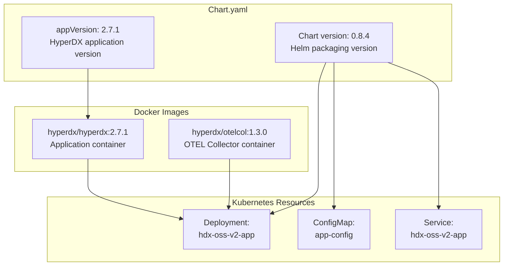
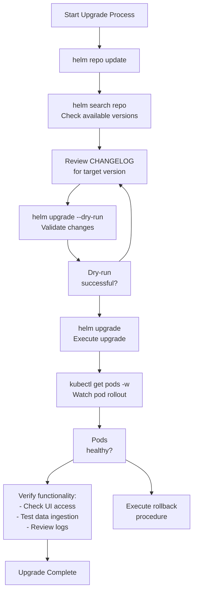
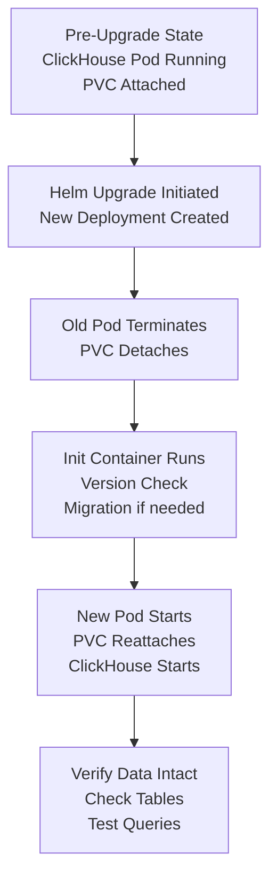
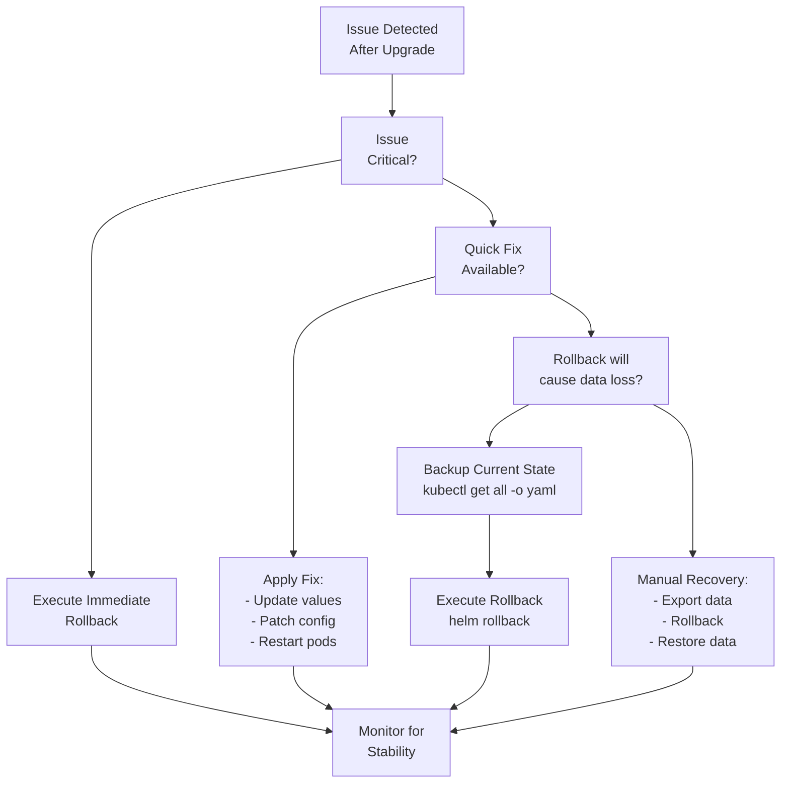

# Upgrading

> **Relevant source files**
> * [.github/workflows/update-app-version.yml](https://github.com/hyperdxio/helm-charts/blob/845dd482/.github/workflows/update-app-version.yml)
> * [CHANGELOG.md](https://github.com/hyperdxio/helm-charts/blob/845dd482/CHANGELOG.md)
> * [README.md](https://github.com/hyperdxio/helm-charts/blob/845dd482/README.md)

This document provides instructions for upgrading existing HyperDX deployments to newer chart or application versions. It covers the upgrade process, version management, rollback procedures, and version-specific considerations.

For initial installation instructions, see [Installation](/hyperdxio/helm-charts/2.1-installation). For deployment configuration options, see [Configuration Reference](/hyperdxio/helm-charts/3-configuration-reference).

## Purpose and Scope

This page covers:

* Understanding HyperDX versioning (Chart version vs appVersion)
* Pre-upgrade preparation and checklists
* Standard and version-specific upgrade procedures
* Post-upgrade verification steps
* Rollback procedures if issues occur
* Troubleshooting common upgrade problems

This does not cover migrating from external components to managed components or vice versa. For those scenarios, see [Deployment Scenarios](/hyperdxio/helm-charts/4-deployment-scenarios).

## Understanding Version Numbers

HyperDX Helm charts use two distinct version numbers that serve different purposes:

| Version Type | Location | Purpose | Example | Managed By |
| --- | --- | --- | --- | --- |
| **Chart Version** | `Chart.yaml:version` | Helm chart packaging version. Changes when templates, values, or chart structure changes. | `0.8.4` | Changesets + CI/CD |
| **appVersion** | `Chart.yaml:appVersion` | HyperDX application version. Corresponds to Docker image tags. | `2.7.1` | Manual workflow or changesets |

### Version Relationship Diagram



**Sources:** [charts/hdx-oss-v2/Chart.yaml L1-L10](https://github.com/hyperdxio/helm-charts/blob/845dd482/charts/hdx-oss-v2/Chart.yaml#L1-L10)

 [CHANGELOG.md L1-L154](https://github.com/hyperdxio/helm-charts/blob/845dd482/CHANGELOG.md#L1-L154)

### Version Increment Scenarios

* **Chart version bump (e.g., 0.8.3 → 0.8.4)**: Typically includes template changes, new configuration options, bug fixes, or feature additions to the Helm chart itself.
* **appVersion bump (e.g., 2.7.0 → 2.7.1)**: Updates the HyperDX application container image. May include application features, bug fixes, or security patches.
* **Both bumped**: Most releases bump both versions, combining chart improvements with application updates.

**Sources:** [CHANGELOG.md L3-L154](https://github.com/hyperdxio/helm-charts/blob/845dd482/CHANGELOG.md#L3-L154)

 [.github/workflows/update-app-version.yml L1-L51](https://github.com/hyperdxio/helm-charts/blob/845dd482/.github/workflows/update-app-version.yml#L1-L51)

## Pre-Upgrade Checklist

Before upgrading, complete the following steps to minimize risk and ensure a smooth upgrade:

### 1. Backup Critical Data

Backup persistent data volumes for ClickHouse and MongoDB:

```markdown
# Export current resource configurations
kubectl get all -l app.kubernetes.io/instance=my-hyperdx -o yaml > hyperdx-backup.yaml

# Note PVC names for ClickHouse and MongoDB
kubectl get pvc -l app.kubernetes.io/instance=my-hyperdx

# For ClickHouse data backup (if persistence enabled)
kubectl exec -it <clickhouse-pod-name> -- clickhouse-client --query "BACKUP DATABASE default TO Disk('default', 'backup/')"

# For MongoDB data backup (if persistence enabled)
kubectl exec -it <mongodb-pod-name> -- mongodump --out /tmp/backup
```

### 2. Review Release Notes

Check the CHANGELOG for breaking changes or important notes:

```markdown
# View CHANGELOG for specific version
curl -s https://raw.githubusercontent.com/hyperdxio/helm-charts/main/CHANGELOG.md | less

# Or check GitHub releases
open https://github.com/hyperdxio/helm-charts/releases
```

**Sources:** [CHANGELOG.md L1-L154](https://github.com/hyperdxio/helm-charts/blob/845dd482/CHANGELOG.md#L1-L154)

### 3. Check Current Deployment Status

```markdown
# Verify current chart version
helm list -n <namespace>

# Check pod health
kubectl get pods -l app.kubernetes.io/instance=my-hyperdx

# Review current values
helm get values my-hyperdx > current-values.yaml
```

### 4. Review Resource Requirements

Newer versions may have different resource requirements. Check if your cluster has sufficient capacity:

```markdown
# Check node resources
kubectl top nodes

# Check current pod resource usage
kubectl top pods -l app.kubernetes.io/instance=my-hyperdx
```

### Pre-Upgrade Checklist Table

| Task | Command | Purpose |
| --- | --- | --- |
| Backup configurations | `helm get values my-hyperdx > backup-values.yaml` | Save current configuration |
| Backup resources | `kubectl get all -o yaml > backup.yaml` | Save Kubernetes resources |
| Check disk space | `kubectl exec <pod> -- df -h` | Ensure sufficient storage |
| Review CHANGELOG | See CHANGELOG.md | Identify breaking changes |
| Test in staging | `helm upgrade --dry-run` | Validate changes |

**Sources:** [README.md L504-L527](https://github.com/hyperdxio/helm-charts/blob/845dd482/README.md#L504-L527)

## Standard Upgrade Procedures

### Checking Available Versions

Before upgrading, check what chart versions are available:

```sql
# Update Helm repository
helm repo update

# List available chart versions
helm search repo hyperdx/hdx-oss-v2 --versions

# Example output:
# NAME                VERSION   APP VERSION   DESCRIPTION
# hyperdx/hdx-oss-v2  0.8.4     2.7.1        HyperDX OSS V2 Helm Chart
# hyperdx/hdx-oss-v2  0.8.3     2.7.0        HyperDX OSS V2 Helm Chart
# hyperdx/hdx-oss-v2  0.8.2     2.7.1        HyperDX OSS V2 Helm Chart
```

**Sources:** [README.md L512-L516](https://github.com/hyperdxio/helm-charts/blob/845dd482/README.md#L512-L516)

### Basic Upgrade Command

The standard upgrade command using your existing values:

```markdown
# Upgrade to latest version
helm upgrade my-hyperdx hyperdx/hdx-oss-v2 -f values.yaml

# Upgrade to specific chart version
helm upgrade my-hyperdx hyperdx/hdx-oss-v2 --version 0.8.4 -f values.yaml

# Dry-run to see what will change
helm upgrade my-hyperdx hyperdx/hdx-oss-v2 -f values.yaml --dry-run --debug
```

### Upgrade Process Flow



**Sources:** [README.md L504-L516](https://github.com/hyperdxio/helm-charts/blob/845dd482/README.md#L504-L516)

### Monitoring the Upgrade

Watch the upgrade progress in real-time:

```markdown
# Watch pod rollout
kubectl get pods -l app.kubernetes.io/instance=my-hyperdx -w

# Check specific deployment rollout status
kubectl rollout status deployment/my-hyperdx-hdx-oss-v2-app
kubectl rollout status deployment/my-hyperdx-hdx-oss-v2-clickhouse
kubectl rollout status deployment/my-hyperdx-hdx-oss-v2-otel-collector

# View recent events
kubectl get events --sort-by='.lastTimestamp' | grep my-hyperdx
```

### Post-Upgrade Verification

After the upgrade completes, verify the deployment:

```markdown
# Check running pods
kubectl get pods -l app.kubernetes.io/instance=my-hyperdx

# Verify versions in running pods
kubectl get pods -l app.kubernetes.io/name=hdx-oss-v2 -o jsonpath='{.items[*].spec.containers[*].image}'

# Check application logs
kubectl logs -l app.kubernetes.io/name=hdx-oss-v2 --tail=50

# Test UI access
# Navigate to your HyperDX URL and verify login and dashboard functionality

# Test telemetry ingestion
# Send a test log/trace and verify it appears in HyperDX
```

**Sources:** [README.md L626-L631](https://github.com/hyperdxio/helm-charts/blob/845dd482/README.md#L626-L631)

## Version-Specific Upgrade Notes

This section documents important changes and considerations when upgrading between specific versions.

### Upgrading to 0.8.x from 0.7.x

#### Key Changes in 0.8.0

**ClickHouse Upgrade (Breaking Change)**

* ClickHouse upgraded from earlier version to v25.7
* Includes safe upgrade process with resource limits support
* **Action Required**: If you have persistent ClickHouse data, review ClickHouse migration compatibility

```yaml
# New resource limit options available in 0.8.0+
clickhouse:
  resources:
    requests:
      memory: "2Gi"
      cpu: "1000m"
    limits:
      memory: "4Gi"
      cpu: "2000m"
```

**Init Container Changes**

* Init container image and pullPolicy are now parameterized
* Busybox image pinned to specific digest for security

**Sources:** [CHANGELOG.md L28-L38](https://github.com/hyperdxio/helm-charts/blob/845dd482/CHANGELOG.md#L28-L38)

#### Changes in 0.8.1-0.8.4

**CronJob Command Path Updates (0.8.3-0.8.4)**

* Alert checking CronJob template updated to use correct command paths for newer versions
* Affects deployments with `tasks.enabled: true`
* **Action Required**: If you enable scheduled tasks, ensure they execute properly after upgrade

```yaml
# Verify task configuration after upgrade
tasks:
  enabled: true
  checkAlerts:
    schedule: "*/1 * * * *"
```

**Sources:** [CHANGELOG.md L3-L27](https://github.com/hyperdxio/helm-charts/blob/845dd482/CHANGELOG.md#L3-L27)

### Upgrading to 0.7.x from 0.6.x

#### Key Changes in 0.7.0

**Frontend URL Configuration**

* Added explicit `frontendUrl` configuration option
* Improved backwards compatibility for existing deployments
* **Action Required**: Review your ingress configuration and set `hyperdx.frontendUrl` explicitly

```yaml
hyperdx:
  frontendUrl: "https://hyperdx.yourdomain.com"
  ingress:
    enabled: true
    host: "hyperdx.yourdomain.com"
```

**External Secrets Support**

* Added support for external secrets for `defaultConnections` and `defaultSources`
* Enables better security for production deployments

```yaml
hyperdx:
  useExistingConfigSecret: true
  existingConfigSecret: "hyperdx-external-config"
  existingConfigConnectionsKey: "connections.json"
  existingConfigSourcesKey: "sources.json"
```

**Sources:** [CHANGELOG.md L54-L69](https://github.com/hyperdxio/helm-charts/blob/845dd482/CHANGELOG.md#L54-L69)

 [README.md L98-L183](https://github.com/hyperdxio/helm-charts/blob/845dd482/README.md#L98-L183)

### Upgrading to 0.6.x from 0.5.x

#### Key Changes in 0.6.0

**Image Value Refactoring (Breaking Change)**

* Image configuration structure changed
* Default image tag bumped to 2.0.0
* **Action Required**: Update your values file if you override image settings

**Additional Ingresses Feature**

* New capability to define additional ingress resources
* Useful for exposing OTEL collector endpoints
* Non-breaking change, but new feature available

**MongoDB Externalization Support**

* Can now use external MongoDB instance
* Similar to existing ClickHouse external support

**Sources:** [CHANGELOG.md L136-L154](https://github.com/hyperdxio/helm-charts/blob/845dd482/CHANGELOG.md#L136-L154)

## Component-Specific Upgrade Considerations

### ClickHouse Upgrades

When upgrading with persistence enabled:



**Best Practices:**

* Always backup ClickHouse data before major version upgrades
* Test queries after upgrade to ensure data integrity
* Monitor ClickHouse logs during first startup after upgrade

```sql
# Check ClickHouse version after upgrade
kubectl exec -it <clickhouse-pod> -- clickhouse-client --query "SELECT version()"

# Verify table schemas
kubectl exec -it <clickhouse-pod> -- clickhouse-client --query "SHOW TABLES FROM default"

# Check data counts
kubectl exec -it <clickhouse-pod> -- clickhouse-client --query "SELECT count() FROM default.otel_logs"
```

**Sources:** [CHANGELOG.md L28-L38](https://github.com/hyperdxio/helm-charts/blob/845dd482/CHANGELOG.md#L28-L38)

### Application Component Upgrades

When upgrading the HyperDX application (when appVersion changes):

**API Key Configuration:**
If you update the API key during upgrade, pods must be restarted:

```markdown
# After helm upgrade with new apiKey
kubectl rollout restart deployment/my-hyperdx-hdx-oss-v2-app
kubectl rollout restart deployment/my-hyperdx-hdx-oss-v2-otel-collector
```

**Environment Variable Changes:**
Check if new environment variables are required in newer versions:

```markdown
# Compare ConfigMaps before and after upgrade
kubectl get configmap my-hyperdx-hdx-oss-v2-app-config -o yaml
```

**Sources:** [README.md L240-L274](https://github.com/hyperdxio/helm-charts/blob/845dd482/README.md#L240-L274)

## Rollback Procedures

If issues occur during or after an upgrade, Helm provides built-in rollback capabilities.

### Viewing Release History

```markdown
# List all releases and their revisions
helm history my-hyperdx

# Example output:
# REVISION  UPDATED                   STATUS      CHART              APP VERSION  DESCRIPTION
# 1         Mon Jan 1 10:00:00 2024   superseded  hdx-oss-v2-0.8.2  2.7.1       Install complete
# 2         Mon Jan 8 14:30:00 2024   deployed    hdx-oss-v2-0.8.4  2.7.1       Upgrade complete
```

### Executing a Rollback

```markdown
# Rollback to previous revision
helm rollback my-hyperdx

# Rollback to specific revision
helm rollback my-hyperdx 1

# Rollback with timeout
helm rollback my-hyperdx --timeout 10m

# Dry-run rollback to see what will change
helm rollback my-hyperdx --dry-run
```

### Post-Rollback Verification

```markdown
# Verify rollback success
helm list | grep my-hyperdx

# Check pod status
kubectl get pods -l app.kubernetes.io/instance=my-hyperdx

# Verify running versions
kubectl get pods -o jsonpath='{.items[*].spec.containers[*].image}' \
  -l app.kubernetes.io/instance=my-hyperdx
```

### Rollback Decision Tree



**Sources:** [README.md L520-L527](https://github.com/hyperdxio/helm-charts/blob/845dd482/README.md#L520-L527)

## Post-Upgrade Tasks

### Restart Pods for Configuration Changes

Some configuration changes require pod restarts to take effect:

```sql
# Restart application pods
kubectl rollout restart deployment/my-hyperdx-hdx-oss-v2-app

# Restart OTEL collector
kubectl rollout restart deployment/my-hyperdx-hdx-oss-v2-otel-collector

# Restart scheduled tasks (if enabled)
kubectl delete job -l app.kubernetes.io/component=task-checkAlerts
```

### Verify Data Flow

After upgrade, verify the complete telemetry pipeline:

```sql
# 1. Check OTEL collector is receiving data
kubectl logs -l app.kubernetes.io/component=otel-collector --tail=100 | grep -i "traces\|logs\|metrics"

# 2. Verify ClickHouse is storing data
kubectl exec -it <clickhouse-pod> -- clickhouse-client --query \
  "SELECT count(), toStartOfMinute(Timestamp) as minute FROM default.otel_logs GROUP BY minute ORDER BY minute DESC LIMIT 10"

# 3. Test HyperDX UI query functionality
# Access UI and run a log search query
```

### Update Documentation

Document the upgrade for your team:

```markdown
# Record upgrade details
cat >> upgrade-log.md << EOF
## Upgrade $(date +%Y-%m-%d)
- Previous version: <old-version>
- New version: <new-version>
- Issues encountered: <none/list issues>
- Rollback performed: <yes/no>
EOF
```

**Sources:** [README.md L267-L272](https://github.com/hyperdxio/helm-charts/blob/845dd482/README.md#L267-L272)

## Troubleshooting Upgrade Issues

### Common Upgrade Problems

#### Pod Stuck in Pending State

**Symptoms:**

```markdown
kubectl get pods
# my-hyperdx-hdx-oss-v2-app-xxx   0/1   Pending   0   5m
```

**Diagnosis:**

```html
kubectl describe pod <pod-name>
# Check Events section for:
# - Insufficient CPU/memory
# - PVC binding issues
# - Image pull errors
```

**Solutions:**

* Scale down other workloads to free resources
* Check PVC status: `kubectl get pvc`
* Verify image pull secrets if using private registry

#### CrashLoopBackOff After Upgrade

**Symptoms:**

```markdown
kubectl get pods
# my-hyperdx-hdx-oss-v2-app-xxx   0/1   CrashLoopBackOff   5   5m
```

**Diagnosis:**

```html
kubectl logs <pod-name> --previous
# Check for:
# - Configuration errors
# - Missing environment variables
# - Database connection failures
```

**Solutions:**

* Validate ConfigMap: `kubectl get configmap <name> -o yaml`
* Check Secret exists: `kubectl get secret <name>`
* Review connectivity to ClickHouse/MongoDB

#### ClickHouse Migration Failures

**Symptoms:**

* ClickHouse pod fails to start
* Init container errors in pod description
* Data queries return empty results

**Diagnosis:**

```
kubectl logs <clickhouse-pod> -c init-clickhouse
kubectl logs <clickhouse-pod> clickhouse
```

**Solutions:**

```python
# If safe to reset data (dev environments only)
kubectl delete pvc <clickhouse-pvc-name>
helm upgrade my-hyperdx hyperdx/hdx-oss-v2 -f values.yaml

# For production, restore from backup
kubectl exec -it <clickhouse-pod> -- clickhouse-client \
  --query "RESTORE DATABASE default FROM Disk('default', 'backup/')"
```

#### OTEL Collector Connection Issues

**Symptoms:**

* OTEL collector cannot connect to OpAMP server
* Logs show "connection refused" errors

**Diagnosis:**

```
kubectl logs -l app.kubernetes.io/component=otel-collector | grep -i "opamp\|error"
```

**Solutions:**

```sql
# Verify service DNS resolution
kubectl run -it --rm debug --image=busybox --restart=Never -- \
  nslookup my-hyperdx-hdx-oss-v2-app.default.svc.cluster.local

# Update opampServerUrl to use FQDN (especially on GKE)
helm upgrade my-hyperdx hyperdx/hdx-oss-v2 \
  --set otel.opampServerUrl="http://my-hyperdx-hdx-oss-v2-app.default.svc.cluster.local:4320" \
  -f values.yaml
```

**Sources:** [README.md L535-L567](https://github.com/hyperdxio/helm-charts/blob/845dd482/README.md#L535-L567)

### Upgrade Troubleshooting Matrix

| Symptom | Likely Cause | Investigation Command | Resolution |
| --- | --- | --- | --- |
| Pods Pending | Resource constraints | `kubectl describe pod <name>` | Scale resources or cluster |
| CrashLoopBackOff | Config/env errors | `kubectl logs <pod> --previous` | Fix ConfigMap/Secret |
| Image Pull Errors | Registry auth | `kubectl get events` | Check imagePullSecrets |
| Service Unavailable | Ingress misconfigured | `kubectl get ingress` | Update ingress rules |
| Data Missing | PVC not bound | `kubectl get pvc` | Check storage class |
| Slow Startup | Init containers | `kubectl describe pod` | Review init logs |

### Helm-Specific Issues

```markdown
# If Helm upgrade hangs
helm upgrade my-hyperdx hyperdx/hdx-oss-v2 --timeout 10m --wait

# If release is in failed state
helm list --failed
helm rollback my-hyperdx

# If values don't apply
helm get values my-hyperdx  # Check current values
helm upgrade my-hyperdx hyperdx/hdx-oss-v2 -f values.yaml --force

# Clean up failed releases
helm uninstall my-hyperdx --keep-history
```

**Sources:** [README.md L625-L631](https://github.com/hyperdxio/helm-charts/blob/845dd482/README.md#L625-L631)

## Best Practices for Upgrades

### Development/Staging Environment

Always test upgrades in a non-production environment first:

```csharp
# Create test namespace
kubectl create namespace hyperdx-staging

# Install in staging
helm install hyperdx-staging hyperdx/hdx-oss-v2 \
  --namespace hyperdx-staging \
  -f values-staging.yaml

# Test upgrade in staging
helm upgrade hyperdx-staging hyperdx/hdx-oss-v2 \
  --namespace hyperdx-staging \
  --version 0.8.4 \
  -f values-staging.yaml
```

### Maintenance Windows

Schedule upgrades during low-traffic periods:

```markdown
# Example: Scale down before upgrade
kubectl scale deployment/my-hyperdx-hdx-oss-v2-app --replicas=0

# Perform upgrade
helm upgrade my-hyperdx hyperdx/hdx-oss-v2 -f values.yaml

# Scale back up
kubectl scale deployment/my-hyperdx-hdx-oss-v2-app --replicas=1
```

### Monitoring During Upgrades

Set up monitoring to catch issues quickly:

```markdown
# Terminal 1: Watch pods
kubectl get pods -l app.kubernetes.io/instance=my-hyperdx -w

# Terminal 2: Watch events
kubectl get events -w | grep my-hyperdx

# Terminal 3: Monitor logs
kubectl logs -f -l app.kubernetes.io/name=hdx-oss-v2
```

### Documentation

Maintain an upgrade log with:

* Date and time of upgrade
* Previous and new versions
* Custom values used
* Issues encountered and resolutions
* Rollback events if any

**Sources:** [README.md L611-L624](https://github.com/hyperdxio/helm-charts/blob/845dd482/README.md#L611-L624)

---

## Additional Resources

* [CHANGELOG.md](https://github.com/hyperdxio/helm-charts/blob/845dd482/CHANGELOG.md)  - Complete version history and changes
* [Installation](/hyperdxio/helm-charts/2.1-installation) - Initial installation procedures
* [Configuration Reference](/hyperdxio/helm-charts/3-configuration-reference) - Detailed configuration options
* [Troubleshooting](/hyperdxio/helm-charts/8.4-troubleshooting) - General troubleshooting guide
* [GitHub Releases](https://github.com/hyperdxio/helm-charts/blob/845dd482/GitHub Releases)  - Release notes and artifacts