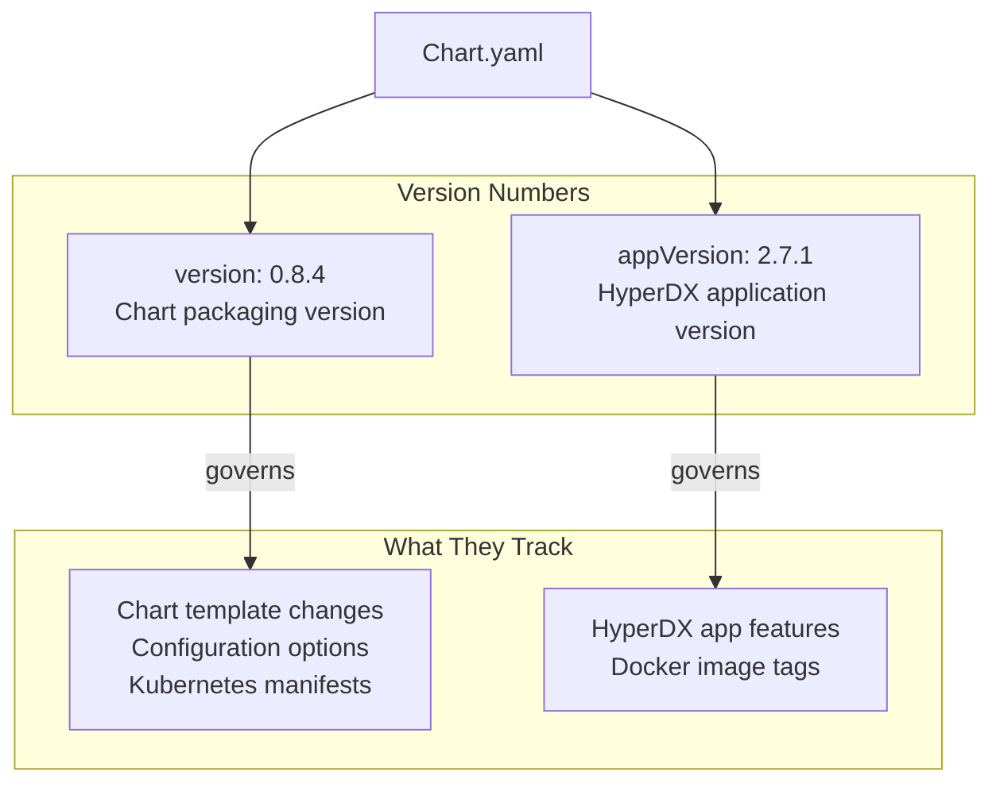
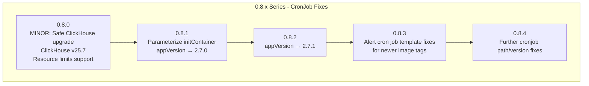
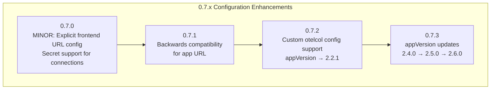
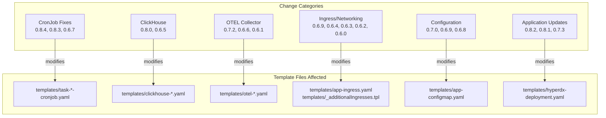
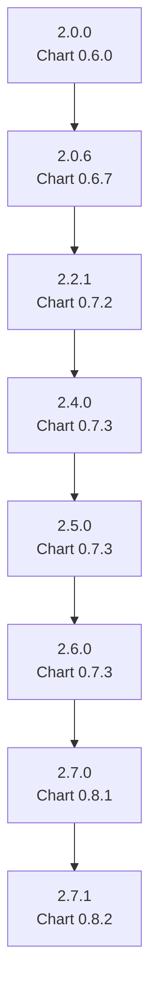

# What's New

> **Relevant source files**
> * [CHANGELOG.md](https://github.com/hyperdxio/helm-charts/blob/845dd482/CHANGELOG.md)
> * [charts/hdx-oss-v2/Chart.yaml](https://github.com/hyperdxio/helm-charts/blob/845dd482/charts/hdx-oss-v2/Chart.yaml)

This page documents the version history, recent changes, and notable updates to the HyperDX Helm chart (`hdx-oss-v2`). It provides an overview of feature additions, bug fixes, and breaking changes across chart releases.

**Scope**: This document focuses on changes to the Helm chart itself (packaging, templates, configuration options). For information about the underlying HyperDX application architecture, see [System Architecture](/hyperdxio/helm-charts/1.1-system-architecture). For installation and upgrade procedures, see [Installation](/hyperdxio/helm-charts/2.1-installation) and [Upgrading](/hyperdxio/helm-charts/2.3-upgrading).

## Versioning Strategy

The HyperDX Helm chart uses two distinct version numbers managed in [charts/hdx-oss-v2/Chart.yaml L1-L7](https://github.com/hyperdxio/helm-charts/blob/845dd482/charts/hdx-oss-v2/Chart.yaml#L1-L7)

:

**Sources**: [charts/hdx-oss-v2/Chart.yaml L5-L6](https://github.com/hyperdxio/helm-charts/blob/845dd482/charts/hdx-oss-v2/Chart.yaml#L5-L6)

| Version Field | Current Value | Purpose |
| --- | --- | --- |
| `version` | 0.8.4 | Chart packaging version (Helm template changes, new configuration options) |
| `appVersion` | 2.7.1 | HyperDX application version (Docker image tag, application features) |

The `version` field increments when chart templates or configuration options change. The `appVersion` field tracks the HyperDX application release and determines which Docker image tags are used by default.

## Current Version

**Chart Version**: 0.8.4
**Application Version**: 2.7.1
**Release Date**: Latest

**Sources**: [charts/hdx-oss-v2/Chart.yaml L5-L6](https://github.com/hyperdxio/helm-charts/blob/845dd482/charts/hdx-oss-v2/Chart.yaml#L5-L6)

 [CHANGELOG.md L3-L7](https://github.com/hyperdxio/helm-charts/blob/845dd482/CHANGELOG.md#L3-L7)

## Recent Release History

### Version 0.8.x Series - CronJob Stability

This series focuses on fixing scheduled task execution, particularly the alert checking CronJob.

**Sources**: [CHANGELOG.md L3-L37](https://github.com/hyperdxio/helm-charts/blob/845dd482/CHANGELOG.md#L3-L37)

#### 0.8.4

* **Type**: Patch
* **Key Changes**: * Further fixes to CronJob template to use correct path and version
* **Impact**: Ensures scheduled tasks (like `checkAlerts`) execute properly across all application versions

**Sources**: [CHANGELOG.md L3-L7](https://github.com/hyperdxio/helm-charts/blob/845dd482/CHANGELOG.md#L3-L7)

#### 0.8.3

* **Type**: Patch
* **Key Changes**: * Fixes alert cron job template so newer version image tags use the updated command path to start tasks
* **Impact**: Addresses breaking changes in HyperDX application entrypoint for versions 2.0.2+

**Sources**: [CHANGELOG.md L9-L13](https://github.com/hyperdxio/helm-charts/blob/845dd482/CHANGELOG.md#L9-L13)

#### 0.8.2

* **Type**: Patch
* **Key Changes**: * Updated `appVersion` to 2.7.1
* **Impact**: Chart deploys HyperDX application version 2.7.1 by default

**Sources**: [CHANGELOG.md L15-L19](https://github.com/hyperdxio/helm-charts/blob/845dd482/CHANGELOG.md#L15-L19)

#### 0.8.1

* **Type**: Patch
* **Key Changes**: * Parameterized hyperdx-deployment initContainer image and pullPolicy * Updated `appVersion` to 2.7.0
* **Impact**: Greater control over init container configuration, supports private registries

**Sources**: [CHANGELOG.md L21-L26](https://github.com/hyperdxio/helm-charts/blob/845dd482/CHANGELOG.md#L21-L26)

#### 0.8.0

* **Type**: Minor (breaking changes possible)
* **Key Changes**: * Implemented safe ClickHouse upgrade process * Added resource limits support for ClickHouse * Bumped ClickHouse to v25.7 * Pinned busybox image digest for init containers
* **Impact**: Major ClickHouse version upgrade, improved stability and resource management
* **Migration Note**: Review ClickHouse resource limits configuration before upgrading

**Sources**: [CHANGELOG.md L28-L37](https://github.com/hyperdxio/helm-charts/blob/845dd482/CHANGELOG.md#L28-L37)

### Version 0.7.x Series - Configuration Flexibility

This series introduced significant configuration enhancements, particularly around URLs and custom configurations.

**Sources**: [CHANGELOG.md L39-L59](https://github.com/hyperdxio/helm-charts/blob/845dd482/CHANGELOG.md#L39-L59)

#### 0.7.3

* **Type**: Patch
* **Key Changes**: * Progressive `appVersion` updates: 2.4.0 → 2.5.0 → 2.6.0
* **Impact**: Tracks rapid application development cycle

**Sources**: [CHANGELOG.md L39-L45](https://github.com/hyperdxio/helm-charts/blob/845dd482/CHANGELOG.md#L39-L45)

#### 0.7.2

* **Type**: Patch
* **Key Changes**: * Added support for custom OpenTelemetry Collector configuration * Updated `appVersion` to 2.2.1
* **Impact**: Enables advanced OTEL Collector customization via `otel.customConfig`

**Sources**: [CHANGELOG.md L47-L52](https://github.com/hyperdxio/helm-charts/blob/845dd482/CHANGELOG.md#L47-L52)

#### 0.7.1

* **Type**: Patch
* **Key Changes**: * Better backwards compatibility for app URL in existing deployments
* **Impact**: Safer upgrades from older versions

**Sources**: [CHANGELOG.md L54-L58](https://github.com/hyperdxio/helm-charts/blob/845dd482/CHANGELOG.md#L54-L58)

#### 0.7.0

* **Type**: Minor
* **Key Changes**: * Allows frontend URL to be explicitly configured * Added secret support for `defaultConnections` and `defaultSources`
* **Impact**: Production-ready secret management, explicit URL configuration for complex networking scenarios

**Sources**: [CHANGELOG.md L60-L68](https://github.com/hyperdxio/helm-charts/blob/845dd482/CHANGELOG.md#L60-L68)

### Version 0.6.x Series - Production Hardening

The 0.6.x series focused on production readiness with health checks, resource management, and networking improvements.

```mermaid
flowchart TD

v069["0.6.9<br>- livenessProbe/readinessProbe<br>- Custom ingress paths<br>- Image pull secrets<br>- Keep PVCs option"]
v060["0.6.0<br>MINOR: Additional ingresses<br>Image refactor<br>appVersion → 2.0.0"]
v061["0.6.1<br>- OTEL env variables"]
v062["0.6.2<br>- Custom ingressClassName"]
v063["0.6.3<br>- Ingress pathType fixes"]
v064["0.6.4<br>- Service type config<br>- Dynamic frontend URL<br>- Node selector/toleration"]
v065["0.6.5<br>- ClickHouse service config"]
v066["0.6.6<br>- OTEL collector replicas<br>- Resource limits<br>- Pod availability"]
v067["0.6.7<br>- Update alert cronjob entrypoint"]
v068["0.6.8<br>- Environment variable rename"]

subgraph subGraph0 ["Key Features by Version"]
    v069
    v060
    v061
    v062
    v063
    v064
    v065
    v066
    v067
    v068
    v060 --> v061
    v061 --> v062
    v062 --> v063
    v063 --> v064
    v064 --> v065
    v065 --> v066
    v066 --> v067
    v067 --> v068
    v068 --> v069
end
```

**Sources**: [CHANGELOG.md L70-L154](https://github.com/hyperdxio/helm-charts/blob/845dd482/CHANGELOG.md#L70-L154)

#### Notable Features Added

| Version | Feature | Configuration Path | Impact |
| --- | --- | --- | --- |
| 0.6.9 | Health probes | `livenessProbe`, `readinessProbe` | Pod health monitoring |
| 0.6.9 | Custom ingress paths | `ingress.path`, `ingress.pathType` | Support different ingress controllers |
| 0.6.9 | Image pull secrets | `imagePullSecrets` | Private registry support |
| 0.6.9 | Keep PVCs | `keepPVC` | Prevent data loss on uninstall |
| 0.6.8 | Environment variable | `RUN_SCHEDULED_TASKS_EXTERNALLY` | Clearer task configuration |
| 0.6.6 | OTEL replicas | `otel.replicas` | Horizontal scaling |
| 0.6.6 | Resource limits | `otel.resources` | Resource management |
| 0.6.4 | Node selector | `nodeSelector`, `tolerations` | Pod scheduling control |
| 0.6.0 | Additional ingresses | `additionalIngresses` | External OTEL endpoints |
| 0.6.0 | Image refactor | `image.registry`, `image.repository`, `image.tag` | Flexible image sources |

**Sources**: [CHANGELOG.md L70-L145](https://github.com/hyperdxio/helm-charts/blob/845dd482/CHANGELOG.md#L70-L145)

### Version 0.5.x Series - Foundation

The 0.5.x series established core functionality.

#### 0.5.2

* **Type**: Patch
* **Key Changes**: * Relocated MongoDB volume persistence field * Handle case when ClickHouse PVC is disabled * Added `clickhouseUser` and `clickhousePassword` OTEL settings * Removed snapshot tests, replaced with assertions
* **Impact**: Improved persistence handling and test reliability

**Sources**: [CHANGELOG.md L147-L154](https://github.com/hyperdxio/helm-charts/blob/845dd482/CHANGELOG.md#L147-L154)

## Change Type Distribution

The following diagram maps changelog entries to their corresponding configuration areas and template files:

**Sources**: [CHANGELOG.md L1-L154](https://github.com/hyperdxio/helm-charts/blob/845dd482/CHANGELOG.md#L1-L154)

## Breaking Changes and Migration Notes

### ClickHouse v25.7 Upgrade (0.8.0)

* **Impact**: Major ClickHouse version upgrade from previous versions
* **Action Required**: Review ClickHouse resource limits configuration
* **Related Configuration**: `clickhouse.resources`, `clickhouse.persistence`

### Environment Variable Rename (0.6.8)

* **Changed**: `CRON_IN_APP_DISABLED` → `RUN_SCHEDULED_TASKS_EXTERNALLY`
* **Impact**: If you manually set this environment variable, update your configuration
* **Backward Compatibility**: Old variable may not be recognized

### Alert CronJob Entrypoint (0.6.7, 0.8.3)

* **Impact**: HyperDX application v2.0.2+ changed the entrypoint for scheduled tasks
* **Action**: Ensure chart version 0.8.3+ is used with appVersion 2.0.2+
* **Symptom**: CronJobs fail to execute if version mismatch exists

### Image Value Refactor (0.6.0)

* **Changed**: Restructured image configuration from single string to structured object
* **Old Format**: Single image string
* **New Format**: `image.registry`, `image.repository`, `image.tag`, `image.pullPolicy`
* **Impact**: Custom image configurations need to be updated

**Sources**: [CHANGELOG.md L9-L13](https://github.com/hyperdxio/helm-charts/blob/845dd482/CHANGELOG.md#L9-L13)

 [CHANGELOG.md L28-L34](https://github.com/hyperdxio/helm-charts/blob/845dd482/CHANGELOG.md#L28-L34)

 [CHANGELOG.md L82-L93](https://github.com/hyperdxio/helm-charts/blob/845dd482/CHANGELOG.md#L82-L93)

 [CHANGELOG.md L136-L145](https://github.com/hyperdxio/helm-charts/blob/845dd482/CHANGELOG.md#L136-L145)

## Feature Timeline

The following table summarizes when major features were introduced:

| Feature Category | Version | Description |
| --- | --- | --- |
| **Resource Management** | 0.8.0 | ClickHouse resource limits |
|  | 0.6.6 | OTEL Collector replicas and resources |
|  | 0.6.4 | Node selector and tolerations |
| **Configuration Flexibility** | 0.7.2 | Custom OTEL Collector config |
|  | 0.7.0 | Secret support for connections/sources |
|  | 0.6.1 | Custom OTEL environment variables |
| **Networking** | 0.6.9 | Custom ingress paths and pathType |
|  | 0.6.2 | Custom ingressClassName and annotations |
|  | 0.6.0 | Additional ingresses for external OTEL endpoints |
| **Production Readiness** | 0.6.9 | Health probes (liveness/readiness) |
|  | 0.6.9 | Image pull secrets |
|  | 0.6.9 | Keep PVCs on uninstall |
|  | 0.6.6 | Improved pod availability |
| **Scheduled Tasks** | 0.8.4 | Robust CronJob path/version handling |
|  | 0.6.8 | Clear task configuration variable |
| **Storage** | 0.6.5 | ClickHouse service type and annotations |
|  | 0.5.2 | MongoDB volume persistence |

**Sources**: [CHANGELOG.md L1-L154](https://github.com/hyperdxio/helm-charts/blob/845dd482/CHANGELOG.md#L1-L154)

## Application Version Progression

The chart's `appVersion` field has tracked the HyperDX application through the following releases:

**Sources**: [CHANGELOG.md L19](https://github.com/hyperdxio/helm-charts/blob/845dd482/CHANGELOG.md#L19-L19)

 [CHANGELOG.md L26](https://github.com/hyperdxio/helm-charts/blob/845dd482/CHANGELOG.md#L26-L26)

 [CHANGELOG.md L42-L45](https://github.com/hyperdxio/helm-charts/blob/845dd482/CHANGELOG.md#L42-L45)

 [CHANGELOG.md L52](https://github.com/hyperdxio/helm-charts/blob/845dd482/CHANGELOG.md#L52-L52)

 [CHANGELOG.md L92](https://github.com/hyperdxio/helm-charts/blob/845dd482/CHANGELOG.md#L92-L92)

 [CHANGELOG.md L141](https://github.com/hyperdxio/helm-charts/blob/845dd482/CHANGELOG.md#L141-L141)

## Next Steps

* **For new installations**: See [Installation](/hyperdxio/helm-charts/2.1-installation) and [Quick Start Guide](/hyperdxio/helm-charts/2.2-quick-start-guide)
* **For upgrades**: See [Upgrading](/hyperdxio/helm-charts/2.3-upgrading) for version-specific migration instructions
* **For configuration options**: See [Configuration Reference](/hyperdxio/helm-charts/3-configuration-reference) for detailed parameter documentation
* **For release management**: See [Release Management](/hyperdxio/helm-charts/9.3-release-management) for information about the versioning and release process