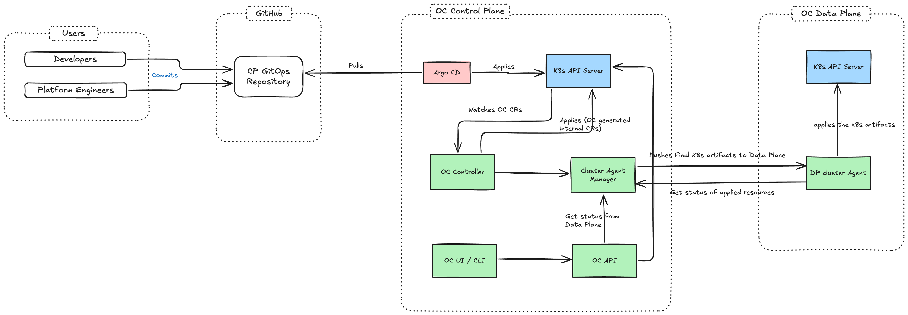

# Control Plane GitOps Architecture for OpenChoreo

**Authors**:
@vajiraprabuddhaka
@yashodgayashan

**Reviewers**:
@openchoreo/maintainers

**Created Date**:
2025-10-29

**Status**:
Submitted

**Related Issues/PRs**:
- Discussion: https://github.com/openchoreo/openchoreo/discussions/649

---

## Summary

This proposal describes the Control Plane (CP) GitOps architecture for OpenChoreo, enabling Git as the single source of truth for developer intent and platform configurations.
It focuses exclusively on Control Plane GitOps, establishing how OpenChoreo resources are managed through Git repositories and how promotions are handled in a GitOps-native way using the Release and ReleasePin pattern.

---

## Motivation

Many organizations require GitOps workflows to achieve declarative infrastructure, audit trails, and disaster recovery capabilities for their cloud-native applications. While users can install GitOps tools (Flux, ArgoCD) directly into their Kubernetes clusters and sync OpenChoreo CRs, OpenChoreo needs to define a GitOps-compatible promotion mechanism that works seamlessly with Git-based workflows.

**GitOps-Native Promotion Workflow**

Traditional promotion workflows in non-GitOps environments rely on API calls or UI interactions to move components between environments.
In a GitOps world, all changes must flow through Git commits and pull requests to maintain audit trails and enable review processes.
OpenChoreo needs a GitOps-native promotion mechanism where promotions are simple, auditable Git commits that can be reviewed and approved through standard Git PR processes. The Release and ReleasePin pattern provides this capability, creating clean Git diffs, clear rollback paths, and enforcement of approval workflows.

---

## Goals

1. **Demonstrate OpenChoreo architecture is GitOps-compatible**
    - Establish that OpenChoreo's existing architecture naturally supports GitOps
    - Show how OpenChoreo resources can be managed declaratively through Git repositories
    - Enable Git as the single source of truth for OpenChoreo resources (CP GitOps)

2. **Ensure GitOps tooling neutrality**
    - Allow integration with any Kubernetes-aware GitOps CD tooling (ArgoCD, FluxCD, etc.)
    - Provide documentation for integrating popular GitOps tools

3. **Unify OpenChoreo architecture for GitOps and non-GitOps modes**
    - Ensure OpenChoreo's architecture works consistently whether GitOps is enabled or not.
    - Allow users to switch between operational models without architectural changes.
    - Both UI & GitOps should reflect the same state of resources.

4. **Provide suggestions on GitOps repository structure for better using OpenChoreo with GitOps**
    - Offer recommended guidance on organizing OpenChoreo resources in Git
    - Align structure with OpenChoreo's architecture patterns (Projects, Components, Workloads, Classes, Bindings)
    - Support clear ownership boundaries between platform engineers and application developers

---

## Non-Goals

- **Data Plane GitOps**: This proposal does not cover Data Plane (DP) GitOps. Control plane controllers will continue to deploy final Kubernetes manifests directly to data plane clusters.
- **Automatic manifest generation**: Automatic generation of OpenChoreo manifests in the GitOps repository is not in scope.
- **Automated promotion**: Automatic environment promotion of components based on triggers or policies.
- **Automated image updates**: Automatic detection and update of container image versions in Git.
- **Shipping a default GitOps tool**: OpenChoreo will not bundle or ship ArgoCD, FluxCD, or any other GitOps tool by default.

---

## Impact

- **No impact on existing OpenChoreo deployments**: Users who do not use GitOps will experience no changes. OpenChoreo continues to work with its existing API-driven workflow.
- **New operational model**: Users who want GitOps will have a clear, documented path to operate OpenChoreo with CP GitOps using their preferred GitOps tool.

---

## Design

### High-Level Architecture



### Control Plane GitOps

#### Installation

The control plane GitOps installation is the responsibility of the user. OpenChoreo does **not** ship with a bundled GitOps tool. Users must:

1. Choose their preferred GitOps tool (ArgoCD, FluxCD, or any Kubernetes-aware GitOps tool)
2. Install the GitOps tool in their Kubernetes cluster
3. Configure the GitOps tool to sync the OpenChoreo GitOps repository to the control plane namespace

OpenChoreo will provide documentation and examples for setting up popular GitOps tools (ArgoCD and FluxCD) with recommended configurations.

#### Repository Structure

The following is the suggested repository structure for control plane GitOps. This structure can be scaffolded using the OpenChoreo CLI (`choreoctl`).

> [!NOTE]
> This structure is a suggestion, not a requirement. Users can adapt it to their organizational needs, but must ensure GitOps tooling is configured to sync all necessary resources.

```text
openchoreo-gitops/
├── CODEOWNERS                                    # Defines ownership for all paths
├── platform/                                     # Platform Engineer managed
│   ├── component-types/                          # Component type definitions (governance)
│   │   ├── service-types/
│   │   │   ├── default.yaml
│   │   │   ├── high-availability.yaml
│   │   │   └── serverless.yaml
│   │   ├── scheduledtask-types/
│   │   │   ├── default.yaml
│   │   │   └── batch-processing.yaml
│   │   ├── webapplication-types
│   │   │   ├── default.yaml
│   │   │   └── spa.yaml
│   │   └── api-proxy-types/
│   │       ├── default.yaml
│   │       └── rate-limited.yaml
│   ├── addons/                                   # Defines addons which could be shared across components
│   │   ├── add-volume-mount.yaml
│   │   └── file-loggind-side-car.yaml
│   └── infrastructure/                           # Infrastructure resources
│       ├── dataplanes/
│       │   ├── non-prod-dataplane.yaml
│       │   └── prod-dataplane.yaml
│       ├── environments/
│       │   ├── dev-environment.yaml
│       │   ├── staging-environment.yaml
│       │   └── prod-environment.yaml
│       └── deployment-pipelines/
│           ├── standard-pipeline.yaml
│           └── fast-track-pipeline.yaml
│
├── projects/                                     # Application Developer managed
│   └── <project-name>/                           # One directory per project
│       ├── project.yaml                          # Project resource
│       └── components/
│           └── <component-name>/                 # One directory per component
│ .             ├── releases
│               │   ├── release-v20251027-1.yaml  # Release resource for v1
│               │   └── release-v20251027-2.yaml  # Release resource for v2
│               ├── component.yaml                # ComponentV2 resource
│               ├── workload.yaml                 # Workload definition
│               └── env-bindings/                 # Environment-specific bindings
│                   ├── dev/
│                   │   ├── release-pin.yaml      # (TBD: whether we commit env-snapshot.yaml)
│                   │   └── env-settngs.yaml
│                   ├── staging/
│                   │   ├── release-pin.yaml
│                   │   └── env-settngs.yaml
│                   └── prod/
│                       ├── release-pin.yaml
│                       └── env-settngs.yaml
│
├── shared/                                       # Shared resources
│   └── configuration-groups/                     # Shared configs (secrets references)
│
└── README.md                                     # Repository documentation
```

### GitOps-Native Promotion Workflow

OpenChoreo supports GitOps-native promotions through the **Release** and **ReleasePin** pattern.
This pattern enables environment promotions to be executed through Git commits, maintaining audit trails and enabling review processes.

The Release and ReleasePin resources allow users to promote components across environments by updating environment-specific ReleasePin references through Git commits.
This creates clean, auditable Git diffs and leverages standard Git PR-based approval workflows.

**Resource Management Considerations:**

- **Garbage Collection**: Over time, as components are promoted through environments, older Release resources accumulate in the Git repository and etcd.
  A garbage collection mechanism is needed to automatically clean up Release resources that are no longer referenced by any ReleasePin across all environments.

- **Compression Strategy**: To minimize etcd load and reduce storage overhead, Release resources should employ compression strategies for storing snapshots and Git references.
  This ensures that the control plane remains performant even with a large number of releases over time.

Detailed specifications of the Release and ReleasePin resources, the promotion workflow, garbage collection policies, and compression strategies are covered in a separate [proposal](https://github.com/openchoreo/openchoreo/pull/629).

---

## Appendix

### Related Discussions

- [Discussion #528: GitOps Architecture for OpenChoreo](https://github.com/openchoreo/openchoreo/discussions/528)
- [Discussion #544: Selecting a GitOps Engine (ArgoCD vs FluxCD)](https://github.com/openchoreo/openchoreo/discussions/544)
- [Discussion #554: Promotion Mechanism with Release/ReleasePin](https://github.com/openchoreo/openchoreo/discussions/554)

### Future Enhancements

The following are potential future enhancements that are out of scope for this proposal but may be considered later:

- **Data Plane GitOps**: Extend GitOps architecture to data plane manifest deployments
- **CLI Scaffolding**: Enhanced `choreoctl` commands to scaffold GitOps repository structure
- **Automated Release Creation**: CI/CD pipeline integrations to automatically create Releases on successful builds
- **Multi-Repository Support**: Support for splitting OpenChoreo resources across multiple Git repositories
- **Advanced Promotion Strategies**: Canary, blue-green, and progressive delivery promotion workflows
