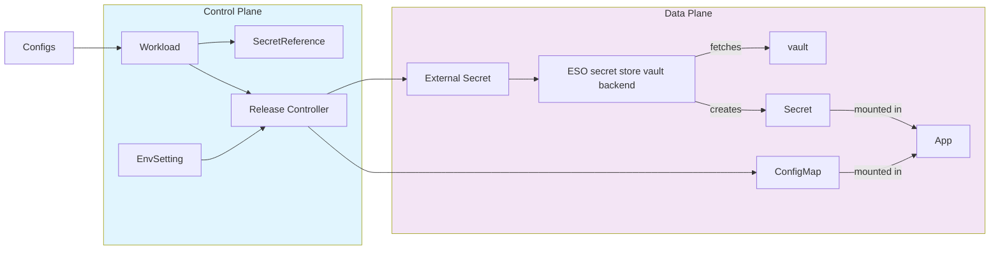

# Configuration Management for User Workloads

**Authors**:  
@JanakaSandaruwan

**Reviewers**:  
@Mirage20 @ChathurangaKCD @binura-g @lakwarus, @tishan89

**Created Date**:  
_2025-10-17_

**Status**:  
_Submitted_

**Related Issues/PRs**:  
_https://github.com/openchoreo/openchoreo/discussions/539_

---

## Summary

This proposal introduces a comprehensive configuration management system for OpenChoreo user workloads. It provides a unified mechanism for managing configurations and secrets, supporting both environment variables and file-based configurations while maintaining security and GitOps compatibility.

---

## Motivation

OpenChoreo currently lacks a unified, flexible way for managing configurations of user workloads.

Current Problems:

- **No standardized mechanism to inject configs and secrets**: 
Applications require configuration via both environment variables and mounted files, but there's no consistent interface to declare and manage them through OpenChoreo.

- **Lack of environment-specific configuration support**: 
No built-in mechanism to override configurations for different environments (dev, staging, production), leading to manual configuration management and increased deployment complexity.

- **Limited developer experience for configuration injection**:
Developers must currently understand and manipulate Kubernetes resources such as ConfigMaps, Secrets, and volume mounts to inject configurations. This adds unnecessary complexity and slows down the development process.

## Goals

- Provide a unified interface for configuration and secret management in workload definitions
- Support both environment variable and file-based configuration injection
- Enable environment-specific configuration overrides
- Maintain GitOps compatibility by avoiding secrets in committed files
- Simplify the developer experience for application configuration

---

## Non-Goals

- **Secret Creation**: This proposal does not focus on creating secrets or adding them to external secret management systems (e.g., adding secrets to Vault). It focuses only on resolving and retrieving secrets from existing secret stores.  
- **Configuration Sharing**: This proposal does not address sharing configurations across multiple applications. Each workload manages its own configuration independently.

---

## Impact

- **Release Controller**: Requires changes to create or update ConfigMaps, ExternalSecrets, and mount details in Deployments.  
- **CLI / UI**: Needs to be updated to allow managing configurations through the interface.

---

## Design

### Define Configurations for Workload

* Configurations and secrets are defined in the workload.yaml file within the source repository by developers.
  * Platform engineers are responsible for adding secrets to the vault and creating secret references ([\#474](https://github.com/openchoreo/openchoreo/discussions/474)) in the control plane.

```yaml
configurations:
  env: 
    - name: LOG_LEVEL #enviroment variables
      value: info
    - name: GIT_PAT #enviroment variables as secrets
      valueFrom:
        secretKeyRef: #reference to the secret reference key
          name: git-secrets
          key: pat
  file: 
    - name: ssl.pem #file as a secret
      mountPath: /tmp/
      valueFrom:
        secretKeyRef: 
          name: certificate
          key: privateKey
    - name: application.toml # file as a config. The file content is taken from the specified source path.
      mountPath: /tmp/
      valueFrom:
        path: resources/application.toml
    - name: application.yaml # file as a config. The file content is provided inline
      mountPath: /mnt/
      value: |
        server:
          port: 8080
          host: 0.0.0.0
        
        logging:
          level: INFO
          format: json
        
        features:
          enabled:
            - user-management
            - analytics
          disabled:
            - experimental-features
```

### Environment-Specific Configuration Overrides

* Configuration values can be overridden to be specific to an environment by using `configurationOverrides` in the EnvSettings CRD for the corresponding environment.
* New environment-specific configurations can be added that are not defined in workload.yaml.

```yaml
apiVersion: openchoreo.dev/v1alpha1
kind: ComponentDeployment
metadata:
  name: checkout-service-prod
spec:
  owner:
    componentName: checkout-service
  environment: production

  overrides:
    resources:
      requests:
        cpu: 500m
        memory: 1Gi
      limits:
        cpu: 2000m
        memory: 2Gi
    autoscaling:
      enabled: true
      minReplicas: 5
      maxReplicas: 50
      targetCPUUtilization: 70

  addonOverrides:
    persistent-volume-claim:
      app-data:
        size: 200Gi
        storageClass: premium

  # Configuration overrides to be injected as env vars or files
  configurationOverrides:
      env:
        - key: LOG_LEVEL # override value for the configs defined in workload.yaml
          value: error
        - key: GIT_PAT
          valueFrom:
            secretKeyRef:
              name: git-secrets-prod
              key: pat
        - key: IS_PRODUCTION # add environment specific new configuration
          value: true
      file:
        - key: application.toml # override file content
          value: |
            [database]
            url = "jdbc:postgresql://prod-db:5432/checkout"
            username = "checkout_user"
```

### Component Template Definitions with Configurations

* The mechanism for injecting configurations and secrets into containers is defined within the ComponentTypeDefinition CR.
  * New custom CEL function (`sanitizeK8sResourceName(parts...)`) is introduced for generating kubernetes names

```yaml
apiVersion: openchoreo.dev/v1alpha1
kind: ComponentTypeDefinition
metadata:
  name: deployment-component
spec:
  # Schema defines what developers can configure
  schema:
    parameters:
      # Static across environments
      replicas: integer | default=1
      imagePullPolicy: string | default=IfNotPresent

    envOverrides:
      # Can vary per environment
      resources:
        requests:
          cpu: string | default=100m
          memory: string | default=256Mi
        limits:
          cpu: string | default=500m
          memory: string | default=512Mi

  # Templates generate K8s resources dynamically
  resources:
    - id: deployment
      template:
        apiVersion: apps/v1
        kind: Deployment
        metadata:
          name: ${metadata.name}
          namespace: ${metadata.namespace}
        spec:
          selector:
            matchLabels:
              app: ${metadata.name}
          template:
            metadata:
              labels:
                app: ${metadata.name}
            spec:
              containers:
                - name: app
                  image: ${build.image}
                  envFrom: |
                    ${(has(configurations.configs.envs) && configurations.configs.envs.size() > 0 ?
                      [{
                        "configMapRef": {
                          "name": sanitizeK8sResourceName(metadata.name, "env-configs")
                        }
                      }] : []) +
                     (has(configurations.secrets.envs) && configurations.secrets.envs.size() > 0 ?
                      [{
                        "secretRef": {
                          "name": sanitizeK8sResourceName(metadata.name, "secret-configs")
                        }
                      }] : [])}
                  volumeMounts: |
                    ${has(configurations.configs.files) && configurations.configs.files.size() > 0 || has(configurations.secrets.files) && configurations.secrets.files.size() > 0 ?
                      (has(configurations.configs.files) && configurations.configs.files.size() > 0 ?
                        configurations.configs.files.map(f, {
                          "name": sanitizeK8sResourceName(f.name,"config-volume"),
                          "mountPath": f.mountPath+f.name
                        }) : []) +
                       (has(configurations.secrets.files) && configurations.secrets.files.size() > 0 ?
                        secrets.files.map(f, {
                          "name": sanitizeK8sResourceName(f.name,"secret-volume"),
                          "mountPath": f.mountPath+f.name
                        }) : [])
                    : omit()}
              volumes: |
                ${has(configurations.configs.files) && configurations.configs.files.size() > 0 || has(configurations.secrets.files) && configurations.secrets.files.size() > 0 ?
                  (has(configurations.configs.files) && configurations.configs.files.size() > 0 ?
                    configurations.configs.files.map(f, {
                      "name": sanitizeK8sResourceName(f.name,"config-volume"),
                      "configMap": {
                        "name": ${sanitizeK8sResourceName(metadata.name, "config", f.name)}
                      }
                    }) : []) +
                   (has(secrets.files) && secrets.files.size() > 0 ?
                    secrets.files.map(f, {
                      "name": sanitizeK8sResourceName(f.name,"secret-volume"),
                      "secret": {
                        "secretName": ${sanitizeK8sResourceName(metadata.name, "secret", f.name)}
                      }
                    }) : [])
                : omit()}

      - id: env-config
          includeWhen: ${has(configurations.configs.envs)}
          template:
            apiVersion: v1
            kind: ConfigMap
            metadata:
              name: ${sanitizeK8sResourceName(metadata.name, "env-configs")}
              namespace: ${metadata.namespace}
            data: |
              ${has(configurations.configs.envs) ? configurations.configs.envs.transformMapEntry(index, env, {env.name: env.value}) : omit()}

      - id: file-config
          forEach: ${configurations.configs.files}
          var: config
          includeWhen: ${has(configurations.configs.files)}
          template:
            apiVersion: v1
            kind: ConfigMap
            metadata:
              name: ${sanitizeK8sResourceName(metadata.name, "config", config.name)}
              namespace: ${metadata.namespace}
            data:
              ${config.name}: |
                ${config.value}

        - id: secret-env-external
          includeWhen: ${has(configurations.secrets.envs)}
          template:
            apiVersion: external-secrets.io/v1beta1
            kind: ExternalSecret
            metadata:
              name: ${sanitizeK8sResourceName(metadata.name, "env-secrets")}
              namespace: ${metadata.namespace}
            spec:
              refreshInterval: 15s
              secretStoreRef:
                name: ${dataplane.vault.secretStore}
                kind: SecretStore
              target:
                name: ${sanitizeK8sResourceName(metadata.name, "env-secrets")}
                creationPolicy: Owner
              data: |
                ${has(configurations.secrets.envs) ? configurations.secrets.envs.map(secret, {
                  "secretKey": secret.name,
                  "remoteRef": {
                    "key": secret.remoteRef.key,
                    "property": secret.remoteRef.property
                  }
                }) : omit()}

        - id: secret-file-external
          forEach: ${configurations.secrets.files}
          var: file
          includeWhen: ${has(configurations.secrets.files)}
          template:
            apiVersion: external-secrets.io/v1beta1
            kind: ExternalSecret
            metadata:
              name: ${sanitizeK8sResourceName(metadata.name, "secret", file.name)}
              namespace: ${metadata.namespace}
            spec:
              refreshInterval: 15s
              secretStoreRef:
                name: ${dataplane.vault.secretStore}
                kind: SecretStore
              target:
                name: ${sanitizeK8sResourceName(metadata.name,"secret", file.name)}
                creationPolicy: Owner
              data:
                - secretKey: ${file.name}
                  remoteRef:
                    key: ${file.remoteRef.key}
                    property: ${file.remoteRef.property}

```

### Architecture Overview




* In the component build, the Workload CRD is generated with environment variables, files, and secret references.

```yaml
apiVersion: openchoreo.dev/v1alpha1
  kind: Workload
  metadata:
    name: customer-service-workload
    namespace: default
  spec:
    owner:
      projectName: my-project
      componentName: customer-service
    containers:
      main:
        image: myregistry/customer-service:v1.0.0
        env:
          - key: LOG_LEVEL  # ad hoc environment variable
            value: info
          - key: GIT_PAT  # ad hoc secret environment variable
            secretKeyRef:
              name: git-secrets
              key: pat
        file:
          - key: ssl.pem  # ad hoc file secret
            mountPath: /tmp
            secretKeyRef:
              name: certificates
              key: privateKey
          - key: application.toml  # ad hoc file config
            mountPath: /tmp
            value: |
              schema_generation:
                enable: true   
```

* The release controller will be extended to generate the required ConfigMaps, SecretReferences, and mounts during deployment.  
* This leverages OpenChoreo's unified secret management architecture (detailed in [\#474](https://github.com/openchoreo/openchoreo/discussions/474)), which utilizes the [External Secrets Operator (ESO)](https://external-secrets.io/latest/) to synchronize secrets from external providers to target Kubernetes clusters.

