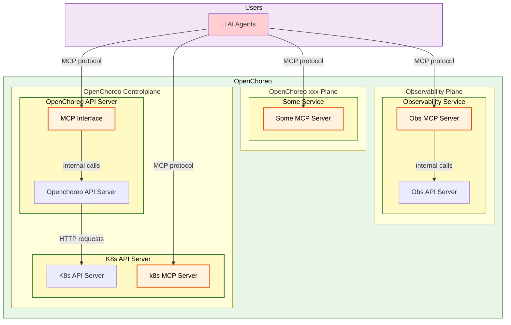

# Introduce MCP Server to OpenChoreo

**Authors**:
@chathuranga95

**Reviewers**:
@manjulaRathnayaka, @lakwarus, @tishan89, @Mirage20

**Created Date**:
2025-10-28

**Status**:
Submitted

**Related Issues/PRs**:
- Issue: [#570](https://github.com/openchoreo/openchoreo/issues/570)
- Discussion: [#522](https://github.com/openchoreo/openchoreo/discussions/522)
- Discussion: [#535](https://github.com/openchoreo/openchoreo/discussions/535)

---

## Summary

Introduce Model Context Protocol (MCP) servers to OpenChoreo's control plane and observability plane, enabling AI agents to interact with OpenChoreo's capabilities through a standardized protocol.

---

## Motivation

AI-powered development assistants and autonomous agents are becoming essential tools in modern software development. Currently, developers can only interact with OpenChoreo through the CLI or the REST APIs, limiting the potential for AI-assisted workflows. By implementing MCP servers, OpenChoreo can expose its platform capabilities to AI agents in a standardized, secure, and composable manner.

---

## Goals

- Enable AI agents to interact with OpenChoreo using the Model Context Protocol
- Expose OpenChoreo control plane and observability plane capabilities as MCP tools
- Provide authentication and authorization mechanisms for MCP server access
- Support integration with third-party AI assistants and internal AI workflows

---

## Non-Goals

- CLI-based stdio MCP server (deferred to future iterations)
- Authorization implementation (to be implemented after the first milestone)
- AI agent development guidelines (separate documentation effort)

---

## Impact

**Affected Components:**
- OpenChoreo control plane - API server
- OpenChoreo observability plane - Observability API server

**Benefits:**
- **Application Developers**: Enable query deployments, view logs, and trigger actions using natural language by integrating the MCP servers to AI agents
- **Platform Engineers**: Create AI-driven automation workflows
- **AI Agent Developers**: Integrate OpenChoreo into autonomous developer tools
- **OpenChoreo Contributors**: Build AI features leveraging OpenChoreo capabilities

**Backward Compatibility**: No breaking changes. MCP tools are backwards compatible by design

---

## Design

### Architecture

The architecture follows OpenChoreo's distributed plane model, with HTTP-based MCP servers hosted on both the control plane and observability plane.

**Key Design Decisions:**

1. **HTTP Transport**: MCP servers will use HTTP transport, not stdio
   - Enables remote access and centralized deployment
   - If stdio transport is needed, the controlplane's MCP server can be shipped with choreo CLI tool

2. **Per-Plane MCP Servers**: Each plane hosts its own MCP server
   - Aligns with OpenChoreo's plugin architecture
   - Enables independent scaling and security policies

3. **Separate `mcp` Package**: MCP server, capability logic in `pkg/mcp/` package
   - Easier maintenance

### MCP Features

**Controlplane MCP server Toolets**: Controlplane functionality exposed as MCP tools, organized in toolsets. Available toolsets can be configured for the MCP server.
- `organization`: Organization operations
- `project`: Project operations
- `components`: Component operations
- `build`: Build operations
- `deployment`: Deployment operations
- `infrastructure`: Environment and Dataplane operations

**Prompts**: Curated prompt templates to be used by interactive AI agents (Via slash commands)

### SDK Selection

Official [`modelcontextprotocol/go-sdk`](https://github.com/modelcontextprotocol/go-sdk)
- Official SDK with long-term support and semantic versioning
- Guaranteed compatibility with MCP specification evolution
- Community backing and ecosystem alignment

### Security

**Authentication**: Required for both control plane and observability plane MCP servers  
**Authorization**: Multi-tenant authorization to be implemented after the first milestone

---

## Appendix

Discord Discussions: [MCP Server Discussion](https://discord.com/channels/1349260186048528484/1427871075492036750/1427871075492036750)
Proposal Discussion: https://github.com/openchoreo/openchoreo/discussions/522
Meeting notes: https://github.com/openchoreo/openchoreo/discussions/535
