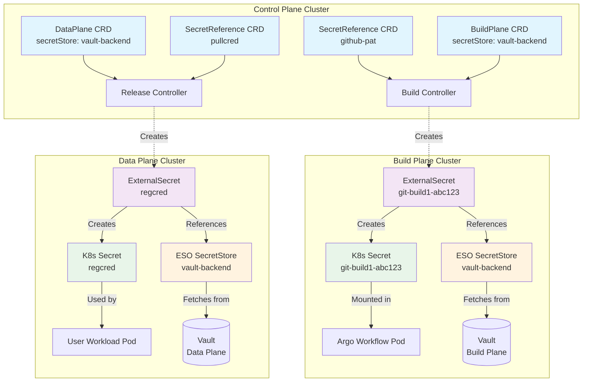
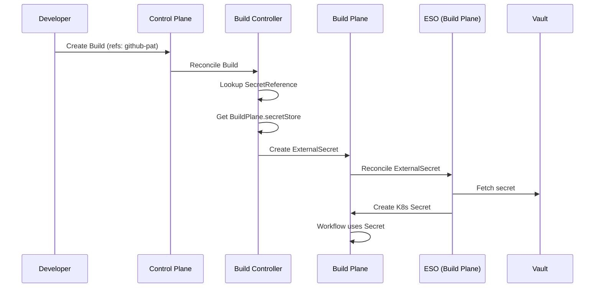
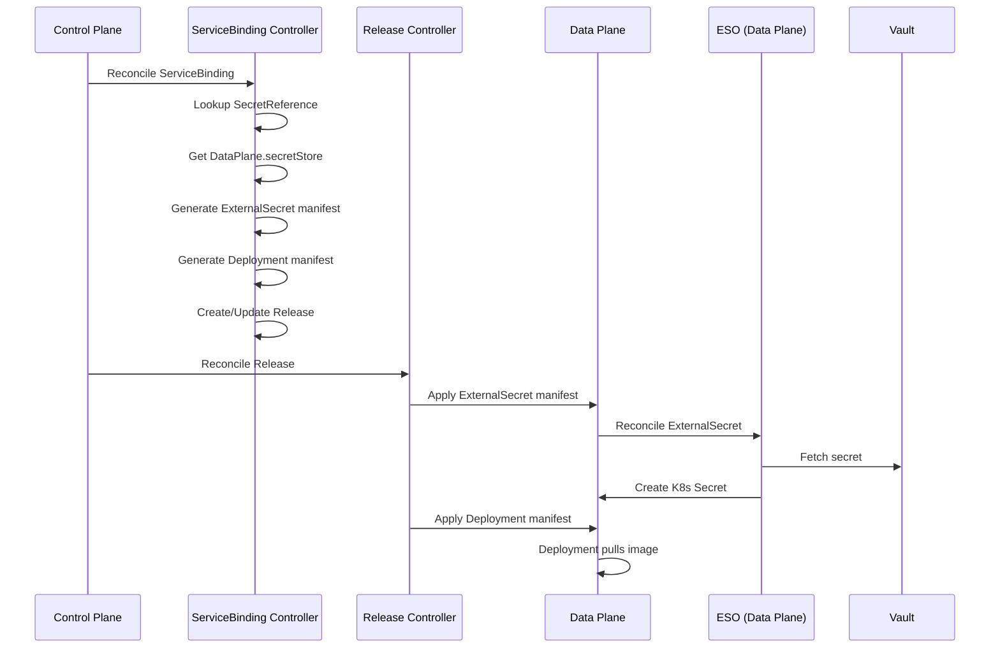

# Secret Management Across All Planes

**Authors**: @Mirage20

**Reviewers**: @sameerajayasoma, @lakwarus, @tishan89, @binura-g, @manjulaRathnayaka

**Created Date**: 2025-11-02

**Status**: Approved

**Related Issues/Discussions**:

- [Issue #616 – Add support for Secret Management in Different Planes (Epic)](https://github.com/openchoreo/openchoreo/issues/616)
- [Issue #420 – Add support for Secret Management in Control Plane and Build Plane](https://github.com/openchoreo/openchoreo/issues/420)
- [Discussion #474 – Secret Management Across All Planes](https://github.com/openchoreo/openchoreo/discussions/474)

---

## Summary

This proposal introduces a unified secret management architecture for OpenChoreo that addresses multi-plane requirements
while maintaining strict security boundaries. The solution leverages External Secrets Operator (ESO) as the
synchronization mechanism between external secret providers and Kubernetes clusters, introducing a new SecretReference
CRD that acts as a declarative pointer to secrets stored in external providers. This approach ensures secrets never
reside in the control plane, maintains plane isolation, and remains provider-agnostic.

---

## Motivation

OpenChoreo currently lacks a unified secret management system across all planes (Control, Build, and Data), creating
several critical limitations:

### Current Problems

1. **No Private Repository Support**: Build workflows cannot clone private Git repositories as there's no mechanism to
   provide authentication credentials
2. **No Private Registry Support**: Cannot push images to private container registries (DockerHub, ECR, ACR, GCR) due to
   missing credential management
3. **No Build-time Secrets**: Applications requiring private dependencies (npm tokens, Maven credentials) cannot be
   built
4. **No Unified Secret Management for User Workloads**: User workloads lacks a mechanism to consume secrets from
   external providers.

---

## Goals

- **Secure Multi-Plane Architecture**: Ensure secrets never pass through or reside in the control plane
- **Provider Independence**: Support multiple secret management providers through ESO abstraction
- **GitOps Compatibility**: Enable full GitOps workflows without compromising security
- **Developer Experience**: Provide simple secret references while hiding orchestration complexity

---

## Non-Goals

- **Secret Provider Implementation**: This proposal does not implement a secret storage system but integrates with
  existing providers
- **Secret Write Path**: This proposal focuses on secret consumption. The secret creation and management in providers is
  out of scope
- **Secret Rotation Automation**: Automatic secret rotation is out of scope for this proposal

---

## Impact

This proposal introduces:

- New CRD: `SecretReference` (v1alpha1) for declaring external secret mappings
- Extensions to existing CRDs:
    - `DataPlane`: Add `secretStore` field to reference ESO SecretStore
    - `BuildPlane`: Add `secretStore` field to reference ESO SecretStore
- New controllers for managing ExternalSecret resources across planes
- Helm chart updates to include External Secrets Operator

---

## Design

### Architecture Overview

The solution introduces a unified secret management architecture that addresses OpenChoreo's multi-plane requirements
while maintaining strict security boundaries.



### Key Design Principles

1. **Secrets Never in Control Plane**: Control plane only stores references and instructions, never actual secret values
2. **Plane Isolation**: Each plane connects to its own secret store instance with distinct access policies
3. **Provider Agnostic**: Leverages ESO's abstraction supporting 20+ secret backends
4. **GitOps Compatible**: Only SecretReference metadata is stored in Git repositories
5. **Principle of Least Privilege**: Different credentials for different purposes with minimal permissions
6. **Developer Transparency**: Developers reference secrets by logical names without understanding infrastructure

### Core Components

#### SecretReference CRD

A declarative pointer to secrets stored in external providers:

```yaml
apiVersion: openchoreo.dev/v1alpha1
kind: SecretReference
metadata:
  name: github-pat
  namespace: myorg
spec:
  template:
    type: Opaque    # K8s Secret type
  data:
    - secretKey: "token"                      # Key in K8s Secret
      remoteRef:
        key: "secret/data/github/pat"         # Vault/provider path
        property: "token"                      # Property in Vault secret
```

#### Plane Configuration

Planes specify their ESO SecretStore, which must be pre-configured by Platform/Ops Engineers:

```yaml
apiVersion: openchoreo.dev/v1alpha1
kind: BuildPlane
metadata:
  name: build-plane-1
  namespace: myorg
spec:
  secretStore: "vault-backend"  # ESO SecretStore name in build plane
```

```yaml
apiVersion: openchoreo.dev/v1alpha1
kind: DataPlane
metadata:
  name: prod-data-plane
  namespace: myorg
spec:
  secretStore: "vault-backend"  # ESO SecretStore name in data plane
```

**Setup Prerequisites**: The following infrastructure must be configured by Platform/Ops teams:

1. External Secrets Operator installed in each plane (build/data)
2. ESO SecretStore resources created with appropriate provider credentials
3. RBAC configured for secret provider access
4. SecretStore names mapped in BuildPlane/DataPlane CRDs

### Operational Flow Examples

#### Build Flow Sequence



#### Deploy Flow Sequence



### Use Cases

**Note**: The following use cases are illustrative examples of how SecretReferences could be consumed. Actual
implementations for Build, ServiceClass, and user workload secret consumption will be defined in their respective
domain-specific proposals.

#### Private Repository Access (Example)

```yaml
apiVersion: openchoreo.dev/v1alpha1
kind: Build
spec:
  repository:
    url: https://github.com/myorg/private-repo.git
    credentialsRef: github-pat  # References SecretReference
```

#### Private Registry Support (Example)

```yaml
apiVersion: openchoreo.dev/v1alpha1
kind: SecretReference
metadata:
  name: dockerhub-creds
spec:
  template:
    type: kubernetes.io/dockerconfigjson
  data:
    - secretKey: "username"
      remoteRef:
        key: "secret/data/registry/dockerhub"
        property: "username"
    - secretKey: "password"
      remoteRef:
        key: "secret/data/registry/dockerhub"
        property: "password"
```

#### Image Pull Secrets in ServiceClass (Example)

```yaml
apiVersion: openchoreo.dev/v1alpha1
kind: ServiceClass
metadata:
  name: private-registry-service
spec:
  deploymentTemplate:
    template:
      spec:
        imagePullSecrets:
          - name: dockerhub-creds  # References SecretReference
        containers:
          - name: main
            imagePullPolicy: Always
```

---

## Alternatives Considered

### CSI Secret Store Driver

- **Pros**: More secure (no K8s Secrets), direct mount to pods
- **Cons**: Doesn't work for controller access, limited to pod-level mounting
- **Decision**: Not suitable for OpenChoreo's controller-based architecture

### Custom Secret Controller

- **Pros**: Full control over implementation
- **Cons**: Duplicates ESO functionality, maintenance burden
- **Decision**: Leverage ESO's mature implementation

### Sealed Secrets

- **Pros**: GitOps friendly, encrypted secrets in Git
- **Cons**: Still stores secrets in control plane (encrypted), complex key management
- **Decision**: Doesn't meet requirement of secrets never in control plane
