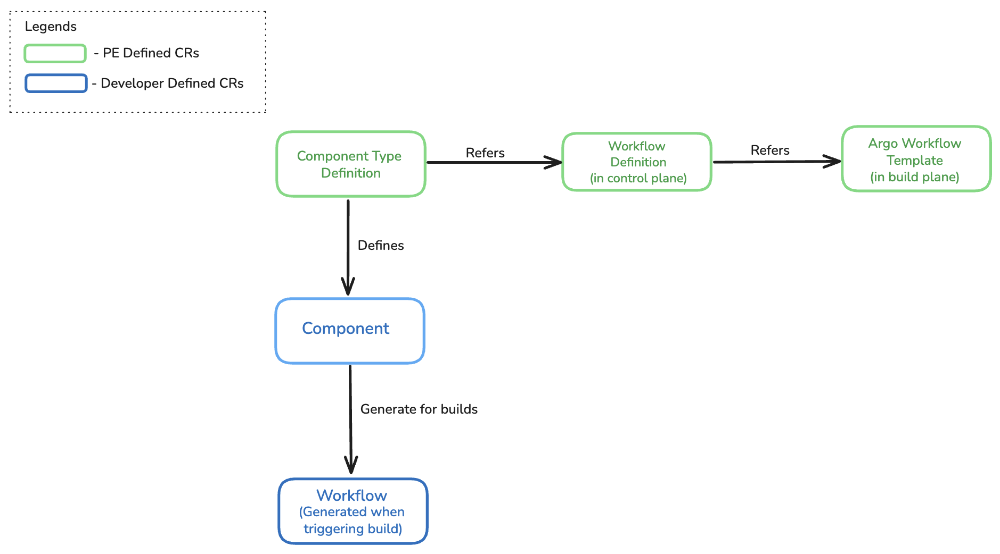
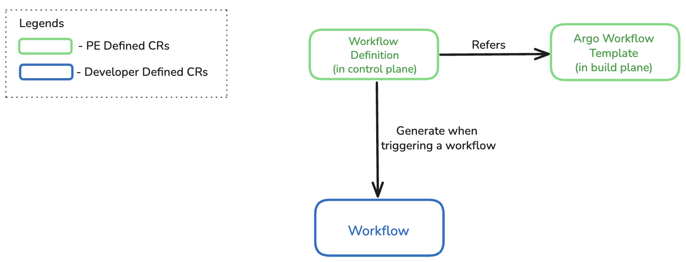

# Schema-Driven Workflow Architecture for OpenChoreo CI and Generic Workflows

**Authors**:  
@chalindukodikara

**Reviewers**:  
@mirage20 @sameerajayasoma @binura-g

**Created Date**:  
2025-10-30

**Status**:  
Submitted

**Related Issues/PRs**:  
[Issue #669](https://github.com/openchoreo/openchoreo/issues/669)  
[Proposal Discussion #568](https://github.com/openchoreo/openchoreo/discussions/568)

---

## Summary

This proposal introduces a schema-driven workflow architecture that replaces OpenChoreo's rigid Build CR with a flexible, template-based system which can be used for both OpenChoroe CI and Generic Workflows. The new design introduces **WorkflowDefinition** CRDs that enable platform engineers to define type-safe, validated schemas for both component-specific builds and organization-level generic workflows. This approach separates platform engineer governance (security policies, compliance requirements) from developer configuration (application-specific parameters) while maintaining a unified developer experience through the Component CR.

---

## Motivation

OpenChoreo's current Build CR uses a fixed schema with flat key-value parameter lists, creating several critical limitations for both platform engineers and developers:

### Current Limitations

**1. Rigid Schema Without Extensibility**

The Build CR uses a fixed schema that cannot be extended by platform engineers. The parameter section only supports flat key-value pairs without structure, type validation, or nested objects. While Argo Workflows supports descriptions, defaults, and enums, these are defined in the workflow template itself and not visible in the OpenChoreo developer experience.

```yaml
# Current Build CR - flat parameters and a Schema provided by OpenChoreo
apiVersion: openchoreo.dev/v1alpha1
kind: Build
metadata:
   name: private-app-build
   namespace: myorg
spec:
   owner:
      projectName: "backend-services"
      componentName: "user-service"
   # Schema provided by OpenChoreo
   repository:
      url: "https://github.com/myorg/private-user-service.git"
      revision:
         branch: "main"
      appPath: "."
      credentialsRef: "github-pat"
   templateRef:
      engine: "argo"
      name: "buildpack-nodejs"
      # Developer params provided by PE
      parameters:
         - name: "buildpack"
           value: "nodejs"
         - name: "dev-registry-url"
           value: "docker.io/myorg-dev"
         - name: "dev-registry-credentials"
           value: "dockerhub-push-dev"
         - name: "prod-registry-url"
           value: "docker.io/myorg-prod"
         - name: "prod-registry-credentials"
           value: "dockerhub-push-prod"
```

**Problems:**
- No nested structures for related configuration (e.g., `registry[0].url` and `registry[0].credentials`)
- No type validation (nothing prevents passing a string where an integer is expected)
- No enum validation for restricted values
- Relationships between related parameters are lost

**2. No Platform Engineer Control Over Security Policies**

Platform Engineers cannot enforce security, compliance, or resource policies through parameters that vary by component type without creating duplicate workflow templates:

Options:
- **Hardcoding in templates**: Cannot vary by component type (e.g., enable SCA for services, disable for scheduled tasks)
- **Letting developers control**: Developers can bypass security policies
- **Creating duplicate templates**: Results in `buildpacks-service/`, `buildpacks-webapp/`, `buildpacks-scheduled-task/` with nearly identical code

**What Platform Engineers Need**: Parameters that vary by component type but are hidden from developers.

**3. Limited Workflow Template Reusability**

Because PE-controlled parameters must be hardcoded, a single workflow template cannot be reused across component types with different policy requirements. For example, using the same buildpacks template for services (go, SCA enabled), web-apps (nodejs, SCA enabled), and scheduled-tasks (python, SCA disabled) currently requires three separate template definitions.

**4. No Support for Generic Workflows**

The Build CR schema is tightly coupled to container image builds, making it unsuitable for generic workflows like:
- Package publishing (npm, Maven Central, Ballerina Central)
- Infrastructure provisioning (Terraform/OpenTofu)
- Database migrations
- ETL pipelines and data processing
- Compliance scanning and security testing

Using separate CRs for builds and generic workflows creates technical debt through duplicate validation logic, parameter handling, and status tracking.

---

## Goals

- **Schema-Driven Extensibility**: Enable platform engineers to define custom, type-safe schemas for build workflow.
- **Separation of Concerns**: Platform engineers control security policies and compliance requirements while developers control application-specific parameters within PE-defined guardrails.
- **Template Reusability**: Allow a single WorkflowDefinition to be shared across multiple ComponentTypeDefinitions with different policy configurations.
- **Unified Architecture**: Support both component-specific builds and organization-level generic workflows through the same WorkflowDefinition mechanism.
- **Developer Experience**: Maintain a simplified developer experience through the Component CR with auto-generated UI forms based on defined schemas.
- **Type Safety**: Provide type validation, nested structures, enums, defaults, and documentation for all parameters.

---

## Non-Goals

- **Replace Existing Build Functionality**: This proposal extends rather than replaces the current build system architeture.
- **UI Implementation**: While the proposal mentions auto-generated UI forms based on schemas, the actual UI/portal implementation details are out of scope.
- **Workflow Templates**: This proposal defines the OpenChoreo abstraction layer for referencing workflows such as Argo Workflows, Tekton Pipelines, etc. But it does not cover the authoring of the underlying workflow templates themselves.

---

## Impact

### New CRDs
- **WorkflowDefinition** (v1alpha1): Defines schemas, parameter mappings, and fixed PE-controlled parameters
- **Workflow** (v1alpha1): Runtime execution resource replacing the current Build CR

### Modified CRDs
- **Component** (v1alpha1): Updated to support schema-based build configuration
- **ComponentTypeDefinition** (v1alpha1): Extended with `build.allowedTemplates` for workflow template restrictions

### Controllers
- **Workflow Controller**: New controller for managing workflow executions and rendering Argo Workflow resources
- **Build Controller**: Marked as deprecated

### Build Plane
- No changes required to BuildPlane infrastructure or Argo Workflows installation

---

## Design

This proposal introduces a flexible, schema-driven architecture using four key custom resources that separate concerns between platform engineering control and developer flexibility.

### Architecture Overview

**OpenChoreo CI Flow**



**Generic Workflows Flow**



### Design Principles

1. **Extensibility from Component Type Definition**: Follows the same template-driven approach as Component Type Definitions, enabling platform engineers to define flexible schemas

2. **Separation of Concerns**:
   - Platform Engineers control: security policies, compliance requirements, resource templates
   - Developers control: application-specific parameters within PE-defined guardrails

3. **Developer Experience**: Developers interact with a single, familiar Component CR with:
   - Type-safe parameter validation
   - Auto-generated UI forms with descriptions and defaults
   - Clear documentation of available options

4. **Reusability**:
   - WorkflowDefinitions can be shared across multiple ComponentTypeDefinitions
   - Same architecture supports both component-specific builds and organization-level generic workflows
   - PE parameters can be defined once and reused with different values across component types

5. **Generic Workflow Support**: The architecture supports any workflow type including:
   - Infrastructure Provisioning (Terraform/OpenTofu pipelines)
   - Data Processing (ETL pipelines, data transformation)
   - Storage Operations (S3/blob storage uploads)
   - Database Migrations (schema changes)
   - Testing (end-to-end, performance)
   - Compliance Scanning (security scans, license compliance)
   - Scheduled maintenance tasks (using Argo Events)
   - Package Publishing (npm, Maven Central, Ballerina Central)

---

### Custom Resource Definitions

#### 1. WorkflowDefinition CR

The WorkflowDefinition defines the schema for developer parameters and contains a resource template that will be rendered and applied to the build plane. Template variables are substituted at runtime by the controller.

**Available Template Variables:**
- `${ctx.workflowName}` - Workflow CR name
- `${ctx.componentName}` - Component name
- `${ctx.projectName}` - Project name
- `${ctx.orgName}` - Organization name (namespace)
- `${ctx.timestamp}` - Unix timestamp
- `${ctx.uuid}` - UUID (8 chars)
- `${schema.*}` - Developer-provided values from schema
- `${fixedParameters.*}` - PE-controlled fixed parameters

```yaml
apiVersion: openchoreo.dev/v1alpha1
kind: WorkflowDefinition
metadata:
   name: google-cloud-buildpacks
   annotations:
      openchoreo.dev/description: "Google Cloud Buildpacks workflow for containerized builds"
spec:
   # Developer-facing schema with type validation
   schema:
      repository:
         url: string
         revision:
            branch: string | default=main
            commit: string | default=HEAD
         appPath: string | default=.
         secretRef: string | enum=["reading-list-repo-credentials-dev","payments-repo-credentials-dev"]
      version: integer | default=1
      testMode: string | enum=["unit", "integration", "none"] default=unit
      command: '[]string | default=[]'
      args: "[]string | default=[]"
      resources:
         cpuCores: integer | default=1 minimum=1 maximum=8
         memoryGb: integer | default=2 minimum=1 maximum=32
      timeout: string | default="30m"
      cache:
         enabled: boolean | default=true
         paths: '[]string | default=["/root/.cache"]'
      limits:
         maxRetries: integer | default=3 minimum=0 maximum=10
         maxDurationMinutes: integer | default=60 minimum=5 maximum=240

   # Secret references to inject into build plane
   secrets:
      - ${schema.repository.secretRef}

   # Static, PE-controlled parameters (hidden from developer)
   fixedParameters:
      - name: builder-image
        value: gcr.io/buildpacks/builder@sha256:5977b4bd47d3e9ff729eefe9eb99d321d4bba7aa3b14986323133f40b622aef1
      - name: security-scan-enabled
        value: "true"
      - name: build-timeout
        value: "30m"

   # Rendered resource
   resource:
      template:
         apiVersion: argoproj.io/v1alpha1
         kind: Workflow
         metadata:
            name: ${ctx.workflowName} # PE needs to ensure uniqueness, workflowName is unique
            namespace: openchoreo-ci-${ctx.orgName}
         spec:
            arguments:
               parameters:
                  - name: component-name
                    value: ${ctx.componentName}
                  - name: project-name
                    value: ${ctx.projectName}
                  # Parameters from schema (developer-facing)
                  - name: git-repo
                    value: ${schema.repository.url}
                  - name: branch
                    value: ${schema.repository.revision.branch}
                  - name: commit
                    value: ${schema.repository.revision.commit}
                  - name: app-path
                    value: ${schema.repository.appPath}
                  - name: version
                    value: ${schema.version}
                  - name: test-mode
                    value: ${schema.testMode}
                  - name: command
                    value: ${schema.command}
                  - name: args
                    value: ${schema.args}
                  - name: cpu-cores
                    value: ${schema.resources.cpuCores}
                  - name: memory-gb
                    value: ${schema.resources.memoryGb}
                  - name: timeout
                    value: ${schema.timeout}
                  - name: cache-enabled
                    value: ${schema.cache.enabled}
                  - name: cache-paths
                    value: ${schema.cache.paths}
                  - name: max-retries
                    value: ${schema.limits.maxRetries}
                  - name: max-duration-minutes
                    value: ${schema.limits.maxDurationMinutes}
                  # Parameters from fixedParameters (PE-controlled)
                  - name: builder-image
                    value: ${fixedParameters["builder-image"]}
                  - name: registry-url
                    value: gcr.io/openchoreo-dev/images
                  - name: security-scan-enabled
                    value: ${fixedParameters["security-scan-enabled"]}
                  - name: build-timeout
                    value: ${fixedParameters["build-timeout"]}
                  - name: image-name
                    value: ${ctx.projectName}-${ctx.componentName}-image
                  - name: image-tag
                    value: v${schema.version}
            serviceAccountName: workflow-sa
            workflowTemplateRef:
               clusterScope: true
               name: google-cloud-buildpacks
```

**Key Features:**
- **Schema Definition**: Defines the structure developers interact with, including types, defaults, enums, and nested objects
- **Parameter Mapping**: Maps schema fields to Argo Workflow parameters using CEL expressions
- **Fixed Parameters**: PE-controlled parameters hidden from developers for security and compliance
- **Secret Management**: Declares which secrets need to be synchronized to the build plane

#### 2. ComponentTypeDefinition CR (Extended)

ComponentTypeDefinition is extended to restrict which workflow templates developers can use and override fixed parameters per component type.

```yaml
apiVersion: openchoreo.dev/v1alpha1
kind: ComponentTypeDefinition
metadata:
   name: service
spec:
   # Restrict which workflow templates developers can use for this component type
   build:
      allowedTemplates:
         - name: google-cloud-buildpacks
            # PE-controlled parameters that override WorkflowDefinition defaults
           fixedParameters:
              - name: security-scan-enabled
                value: "false"
              - name: build-timeout
                value: "45m"
         - name: docker
            # PE-controlled parameters that override WorkflowDefinition defaults
           fixedParameters:
              - name: build-timeout
                value: "45m"

   workloadType: deployment

   # rest ... 
```

**Key Features:**
- **Template Allowlist**: Controls which WorkflowDefinitions developers can use for this component type.
- **Parameter Overrides**: Overrides fixed parameters from WorkflowDefinition for component-type-specific policies.
- **Reusability**: Same WorkflowDefinition can be used across multiple component types with different fixed parameters.

#### 3. Component CR

Developer-created resource containing build configuration conforming to the WorkflowDefinition schema.

```yaml
apiVersion: openchoreo.dev/v1alpha1
kind: Component
metadata:
   name: reading-list-service
spec:
   owner:
      projectName: default
   # References the ComponentTypeDefinition
   componentType: deployment/service

   # Build configuration matching the schema from WorkflowDefinition
   build:
      # Selects a WorkflowDefinition from allowed templates in ComponentTypeDefinition
      workflowTemplate: google-cloud-buildpacks
      schema:
         # Nested structure from schema
         repository:
            url: "https://github.com/openchoreo/sample-workloads"
            revision:
               branch: "main"
               commit: ""
            appPath: "/service-go-reading-list"
            secretRef: "reading-list-repo-credentials-dev"

         version: 1
         testMode: "integration"  # From enum: ["unit", "integration", "none"]
         command: ["npm", "run", "build"]
         args: ["--production", "--verbose"]
         resources:
            cpuCores: 2
            memoryGb: 4
         timeout: "45m"
         cache:
            enabled: true
            paths: ["/root/.npm", "/root/.cache"]
         limits:
            maxRetries: 5
            maxDurationMinutes: 90
            
   # rest ...
```

**Key Features:**
- **Type Safety**: All fields are validated against the WorkflowDefinition schema
- **Nested Structures**: Supports complex parameter hierarchies
- **Enum Validation**: Restricts values to predefined options
- **Defaults**: Inherits default values from WorkflowDefinition schema

#### 4. Workflow CR

Runtime execution resource created when triggering a workflow. Contains the same parameters as Component but with ownership metadata and execution status.

```yaml
apiVersion: openchoreo.dev/v1alpha1
kind: Workflow
metadata:
   # Should be unique per execution, PEs must ensure uniqueness
   name: reading-list-service-build-01
spec:
   # Ownership tracking for the workflow execution
   owner:
      projectName: "default"
      componentName: "reading-list-service"

   # Reference to WorkflowDefinition
   workflowDefinitionRef: google-cloud-buildpacks

   # Developer parameters from Component CR (matching schema)
   schema:
      repository:
         url: "https://github.com/openchoreo/sample-workloads"
         revision:
            branch: "main"
            commit: ""
         appPath: "/service-go-reading-list"
         secretRef: "reading-list-repo-credentials-dev"
      version: 1
      testMode: "integration"
      command: ["npm", "run", "build"]
      args: ["--production", "--verbose"]
      resources:
         cpuCores: 2
         memoryGb: 4
      timeout: "45m"
      cache:
         enabled: true
         paths: ["/root/.npm", "/root/.cache"]
      limits:
         maxRetries: 5
         maxDurationMinutes: 90
```
---

### Generated Argo Workflow

The Workflow controller generates the final Argo Workflow CR by combining all parameter sources:

```yaml
apiVersion: argoproj.io/v1alpha1
kind: Workflow
metadata:
   name: reading-list-service-build-01
   namespace: openchoreo-ci-default
spec:
   arguments:
      parameters:
         - name: component-name
           value: reading-list-service
         - name: project-name
           value: default
         - name: git-repo
           value: https://github.com/openchoreo/sample-workloads
         - name: branch
           value: main
         - name: commit
           value: ""
         - name: app-path
           value: /service-go-greeter
         - name: credentialsRef
           value: reading-list-repo-credentials-dev
         - name: version
           value: "1"
         - name: test-mode
           value: integration
         - name: command
           value: '["npm","run","build"]'
         - name: args
           value: '["--production","--verbose"]'
         - name: cpu-cores
           value: "2"
         - name: memory-gb
           value: "4"
         - name: timeout
           value: 45m
         - name: cache-enabled
           value: "true"
         - name: cache-paths
           value: '["/root/.npm","/root/.cache"]'
         - name: max-retries
           value: "5"
         - name: max-duration-minutes
           value: "90"
         - name: builder-image
           value: gcr.io/buildpacks/builder@sha256:5977b4bd47d3e9ff729eefe9eb99d321d4bba7aa3b14986323133f40b622aef1
         - name: registry-url
           value: gcr.io/openchoreo-dev/images
         - name: security-scan-enabled
           value: unknown
         - name: build-timeout
           value: 0m
         - name: image-name
           value: reading-list-service-image
         - name: image-tag
           value: v1
   serviceAccountName: workflow-sa
   workflowTemplateRef:
      clusterScope: true
      name: google-cloud-buildpacks
```
