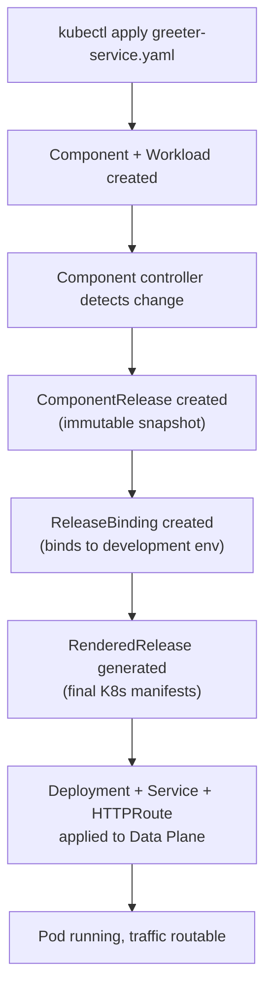

# OpenChoreo Samples

This directory contains sample implementations to help you understand, configure, and use OpenChoreo effectively. These samples demonstrate various deployment patterns and platform capabilities.

## Getting Started Resources

**[Getting Started](./getting-started)** contains the default resources needed to use OpenChoreo. Apply these after installing the control plane:

```bash
kubectl apply -f https://raw.githubusercontent.com/openchoreo/openchoreo/main/samples/getting-started/all.yaml
```

This creates a default project, three environments (development, staging, production), component types (service, web-application, scheduled-task), build workflows, and traits. See the [getting-started README](./getting-started/README.md) for details.

## Your First Deployment — End-to-End Walkthrough

This walkthrough takes you from a running OpenChoreo installation to a deployed service you can call with `curl`. It uses the [Go Greeter Service (from image)](./from-image/go-greeter-service/) sample.

### Prerequisites

- A running OpenChoreo installation (see the [Quick Start Guide](https://openchoreo.dev/docs/getting-started/quick-start-guide/))
- `kubectl` configured to connect to your cluster
- Getting-started resources applied (step 1 below)

### Step 1: Apply the Getting-Started Resources

These resources create a default project, environments, component types, and deployment pipeline:

```bash
kubectl apply -f https://raw.githubusercontent.com/openchoreo/openchoreo/main/samples/getting-started/all.yaml
```

Wait for all resources to become ready:

```bash
kubectl get project,environment,deploymentpipeline,clustercomponenttype
```

You should see a `default` project, three environments (`development`, `staging`, `production`), a `default` deployment pipeline, and four component types.

### Step 2: Deploy the Go Greeter Service

```bash
kubectl apply -f https://raw.githubusercontent.com/openchoreo/openchoreo/main/samples/from-image/go-greeter-service/greeter-service.yaml
```

### Step 3: Monitor the Deployment

Watch the Component, ReleaseBinding, and RenderedRelease progress:

```bash
# Check the Component status
kubectl get component greeter-service -o jsonpath='{.status.conditions}' | jq .

# Watch the ReleaseBinding until it becomes Ready
kubectl get releasebinding -w
```

The deployment typically takes 30–60 seconds. The ReleaseBinding status should show `Ready=True`.

### Step 4: Access the Service

```bash
# Get the hostname and path from the HTTPRoute
HOSTNAME=$(kubectl get httproute -A -l openchoreo.dev/component=greeter-service \
  -o jsonpath='{.items[0].spec.hostnames[0]}')
PATH_PREFIX=$(kubectl get httproute -A -l openchoreo.dev/component=greeter-service \
  -o jsonpath='{.items[0].spec.rules[0].matches[0].path.value}')

# Call the greeting endpoint
curl "http://${HOSTNAME}:19080${PATH_PREFIX}/greeter/greet?name=OpenChoreo"
```

Expected response:

```json
{"message": "Hello, OpenChoreo!"}
```

### Step 5: Clean Up

```bash
kubectl delete -f https://raw.githubusercontent.com/openchoreo/openchoreo/main/samples/from-image/go-greeter-service/greeter-service.yaml
```

### What Happened Behind the Scenes



### Next Steps

- Deploy a [web application](./from-image/react-starter-web-app/) to see a different component type
- Try [building from source](./from-source/) to see the CI pipeline in action
- Learn about [platform configuration](./platform-config/) to customize environments and pipelines

## Sample Categories

### [Deploy from Pre-built Images](./from-image)
Deploy applications using pre-built Docker images. This approach is ideal when you have existing CI systems that build and push container images to registries. These samples show how to deploy your containerized applications directly to OpenChoreo.

**Available Samples:**
- **[Go Greeter Service](./from-image/go-greeter-service/)** - Simple HTTP service demonstrating service deployment
- **[React Starter Web App](./from-image/react-starter-web-app/)** - Web application deployment example
- **[GitHub Issue Reporter](./from-image/issue-reporter-schedule-task/)** - Scheduled task deployment example

### [Build from Source](./from-source)
Build and deploy applications directly from source code using OpenChoreo's built-in CI system. OpenChoreo supports both BuildPacks (for automatic detection and containerization) and Docker (using your Dockerfile) to build applications from source code.

**Services:**
- **[Go Greeter Service (Docker)](./from-source/services/go-docker-greeter/)** - Build from source using Dockerfile
- **[Reading List Service (Buildpack)](./from-source/services/go-google-buildpack-reading-list/)** - Build from source using Google Cloud Buildpacks
- **[Patient Management Service (Buildpack)](./from-source/services/ballerina-buildpack-patient-management/)** - Ballerina service built with Buildpacks

**Web Applications:**
- **[React Starter](./from-source/web-apps/react-starter/)** - React web application built from source

### [Component Types](./component-types)
Low-level examples demonstrating how to define and use custom component types with OpenChoreo's ComponentType CRD. These samples show the underlying mechanics of how components work.

**Available Samples:**
- **[HTTP Service Component](./component-types/component-http-service/)** - Define a reusable HTTP service component type
- **[Web App Component](./component-types/component-web-app/)** - Define a reusable web application component type
- **[Component with Configs](./component-types/component-with-configs/)** - Demonstrate configuration management
- **[Component with Embedded Traits](./component-types/component-with-embedded-traits/)** - Demonstrate PE-defined embedded traits

### [Workflows](./workflows)
Reusable Workflow definitions for standalone automation tasks independent of any Component.

**Available Samples:**
- **[AWS RDS Postgres Create](./workflows/aws-rds-postgres/)** - Provision and destroy AWS RDS PostgreSQL instances using Terraform
- **[GitHub Stats Report](./workflows/github-stats-report/)** - Fetch GitHub repository statistics, transform the data, and generate a formatted report
- **[SCM Create Repo](./workflows/scm-create-repo/)** - Create repositories in GitHub or AWS CodeCommit

### [GCP Microservices Demo](./gcp-microservices-demo)
A complete microservices application based on Google's popular [microservices-demo](https://github.com/GoogleCloudPlatform/microservices-demo). This sample showcases how to deploy a full e-commerce application with multiple interconnected services using OpenChoreo.

### [MCP Server - AI Assistant Integration](./mcp)
Learn how to use OpenChoreo with AI assistants through the Model Context Protocol (MCP). Deploy and manage applications using natural language with AI assistants like Claude Code, Cursor, VS Code, and Claude Desktop.

**Prerequisites:**
- Running OpenChoreo instance
- MCP server configured
- AI assistant installed and configured

**Available Guides:**
- **[Getting Started](./mcp/getting-started/)** - Connect your AI assistant and explore OpenChoreo resources (10-15 min)
- **[Service Deployment](./mcp/service-deployment/)** - Deploy services from source code to production using AI assistants (30-45 min)
  - [Step-by-Step Guide](./mcp/service-deployment/step-by-step/) - Guided walkthrough with explicit prompts
  - [Developer Chat](./mcp/service-deployment/developer-chat/) - Natural conversation-based deployment
- **[Configuration Examples](./mcp/configs/)** - Setup instructions for different AI assistants

### [Platform Configuration](./platform-config)
Configuration samples targeted at Platform Engineers. Learn how to set up deployment pipelines, configure environments, and establish platform governance using OpenChoreo's abstractions.

**Available Configurations:**
- **[Deployment Pipeline](./platform-config/new-deployment-pipeline/)** - Define promotion pipelines across environments
- **[Environments](./platform-config/new-environments/)** - Configure development, QA, pre-production, and production environments
