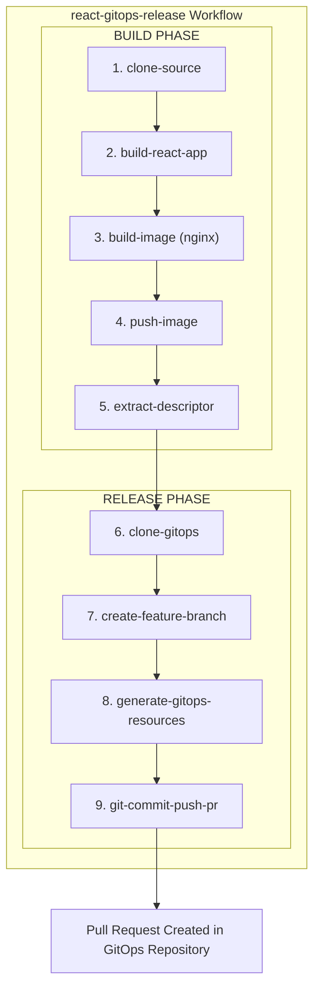

# GitOps Build and Release Workflow (React)

This directory contains a Workflow for automating the complete CI/CD pipeline for React web applications, from building the application to creating pull requests in your GitOps repository.

## Overview

The `react-gitops-release` Workflow automates:
1. Building a React application using Node.js
2. Packaging the build output into an nginx container image
3. Pushing to a container registry
4. Generating deployment manifests (Workload, ComponentRelease, ReleaseBinding)
5. Creating a pull request in your GitOps repository

## Architecture



## Prerequisites

- OpenChoreo installed with workflow plane
- ClusterSecretStore configured (comes with OpenChoreo installation)
- GitOps repository with OpenChoreo manifests
> [!NOTE]
> In the GitOps repository, it should have the manifests for the specified Project, Component, Deployment Pipeline, and Target Environment. A sample GitOps repository can be found in the [openchoreo/sample-gitops](https://github.com/openchoreo/sample-gitops) repository.
- GitHub Personal Access Token (PAT) with `repo` scope to access the GitOps repository
- Source code repository with a React application
- GitHub Personal Access Token (PAT) with `repo` scope to access the source repository

## Installation

### 1. Install the Workflow

> [!IMPORTANT]
> Before applying, edit `react-gitops-release.yaml` and set the `gitops-repo-url` parameter (under `spec.runTemplate.spec.arguments.parameters`) to a GitOps repository you have push access to. The workflow pushes a release branch and opens a pull request against this repo, so the default `https://github.com/openchoreo/sample-gitops` will fail unless you fork it first.

```bash
# Apply the ClusterWorkflowTemplate and the Workflow
kubectl apply -f samples/gitops-workflows/build-and-release/react/react-gitops-release-template.yaml
kubectl apply -f samples/gitops-workflows/build-and-release/react/react-gitops-release.yaml

# Verify installation
kubectl get clusterworkflowtemplate react-gitops-release
kubectl get workflows.openchoreo.dev react-gitops-release -n default
```

### 2. Configure Secrets in ClusterSecretStore

The workflow uses ExternalSecrets to automatically provision credentials. Add your tokens to the ClusterSecretStore:

> [!NOTE]
> The following commands use OpenBao (the default secret backend for local k3d development). For production, use your organization's secret provider.

```bash
# Your GitHub PAT for source repository (only needed for private repos)
SOURCE_GIT_TOKEN="ghp_your_source_repo_token"

# Your GitHub PAT for GitOps repository (required - must have repo scope)
GITOPS_GIT_TOKEN="ghp_your_gitops_repo_token"

# Store secrets in OpenBao
kubectl exec -n openbao openbao-0 -- sh -c "
  export BAO_ADDR=http://127.0.0.1:8200 BAO_TOKEN=root
  bao kv put secret/git-token git-token='${SOURCE_GIT_TOKEN}'
  bao kv put secret/gitops-token git-token='${GITOPS_GIT_TOKEN}'
"

# Verify ClusterSecretStore is healthy
kubectl get clustersecretstore default
```

#### Required Secret Keys

| Key            | Description                                               | Used By                                    |
|----------------|-----------------------------------------------------------|--------------------------------------------|
| `git-token`    | PAT for source repository (only needed for private repos) | `clone-source` step                        |
| `gitops-token` | PAT for GitOps repository (clone, push, PR creation)      | `clone-gitops`, `git-commit-push-pr` steps |

## Usage

### Basic Build and Release

```yaml
apiVersion: openchoreo.dev/v1alpha1
kind: WorkflowRun
metadata:
  name: react-starter-build-release-001
  namespace: default
spec:
  workflow:
    name: react-gitops-release

    parameters:
      componentName: "react-starter"
      projectName: "demo-project"
      repository:
        url: "https://github.com/openchoreo/sample-workloads"
        revision:
          branch: "main"
          commit: "abc123"
        appPath: "/webapp-react-nginx"
      react:
        nodeVersion: "20"
        buildCommand: "npm run build"
        outputDir: "build"
      workloadDescriptorPath: "workload.yaml"
```

### Monitor Progress

```bash
# Watch the WorkflowRun status
kubectl get workflowrun react-starter-build-release-001 -w

# View Argo Workflow status in the workflow plane
kubectl get workflows.argoproj.io -n workflows-default

# View logs for a specific step
kubectl logs -n workflows-default -l workflows.argoproj.io/workflow=<workflow-name> --all-containers=true
```

## Parameters Reference

| Parameter                    | Type   | Required | Default         | Description                                     |
|------------------------------|--------|----------|-----------------|-------------------------------------------------|
| `componentName`              | string | Yes      | -               | Component name                                  |
| `projectName`                | string | Yes      | -               | Project name                                    |
| `repository.url`             | string | Yes      | -               | Git repository URL                              |
| `repository.revision.branch` | string | No       | `main`          | Git branch to checkout                          |
| `repository.revision.commit` | string | No       | ""              | Git commit SHA                                  |
| `repository.appPath`         | string | No       | `.`             | Path to the React application directory         |
| `react.nodeVersion`          | string | No       | `18`            | Node.js version (16, 18, 20, 22)                |
| `react.buildCommand`         | string | No       | `npm run build` | Command to build the React application          |
| `react.outputDir`            | string | No       | `build`         | Build output directory (e.g., build, dist)      |
| `workloadDescriptorPath`     | string | No       | `workload.yaml` | Path to workload descriptor relative to appPath |

## Supported Node.js Versions

- Node.js 16 (LTS)
- Node.js 18 (LTS) - Default
- Node.js 20 (LTS)
- Node.js 22 (Current)

## Workflow Steps

| Step                           | Description                                                                      | Output                    |
|--------------------------------|----------------------------------------------------------------------------------|---------------------------|
| 1. `clone-source`              | Clones the source repository                                                     | Git revision (short SHA)  |
| 2. `build-react-app`           | Installs dependencies and builds React app                                       | Build output directory    |
| 3. `build-image`               | Packages build output into nginx container                                       | Container image tarball   |
| 4. `push-image`                | Pushes image to registry                                                         | Image reference           |
| 5. `extract-descriptor`        | Extracts workload descriptor from source                                         | Base64-encoded descriptor |
| 6. `clone-gitops`              | Clones the GitOps repository                                                     | GitOps workspace          |
| 7. `create-feature-branch`     | Creates a release branch                                                         | Branch name               |
| 8. `generate-gitops-resources` | Generates Workload, ComponentRelease, and ReleaseBinding manifests using occ CLI | All GitOps manifests      |
| 9. `git-commit-push-pr`        | Commits changes, pushes to remote, and creates PR using GitHub CLI               | PR URL                    |

## Files in This Directory

```text
react/
├── README.md                          # This file
├── react-gitops-release.yaml          # Workflow CR
└── react-gitops-release-template.yaml # ClusterWorkflowTemplate (9 steps)
```

## Support

For issues or questions:
- GitHub Issues: https://github.com/openchoreo/openchoreo/issues
- Documentation: https://openchoreo.dev/docs
