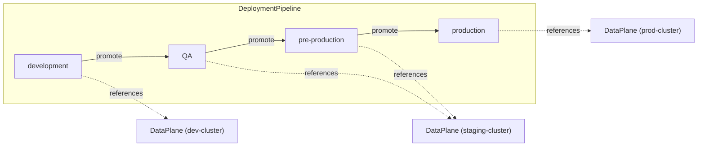

# Platform Configuration Samples

These samples demonstrate how platform engineers configure OpenChoreo's deployment infrastructure. Use them as starting points for customizing your platform beyond the [default getting-started resources](../getting-started/).

## Overview

Platform configuration in OpenChoreo revolves around two key resources:

- **Environments** — Define runtime contexts (dev, QA, pre-production, production) where components are deployed
- **DeploymentPipelines** — Define how releases promote between environments



## When to Customize

The default getting-started configuration creates a simple 3-environment pipeline (`development → staging → production`). Customize when you need:

| Scenario | What to configure |
|----------|-------------------|
| Additional environments (e.g., QA, pre-prod) | Create new Environment resources |
| Different promotion paths | Define a custom DeploymentPipeline |
| Multi-cluster deployment | Create DataPlane resources pointing to different clusters |
| Per-environment gateway URLs | Set `spec.gateway` on Environment resources |
| Production environment protections | Set `spec.isProduction: true` on Environment resources |

## Available Samples

### [New Deployment Pipeline](./new-deployment-pipeline/)

Demonates how to define a custom deployment pipeline with four environments and a branching promotion path:

```
development → QA → pre-production → production
```

**Key concepts:**
- `promotionPaths[].sourceEnvironmentRef` — where releases come from
- `promotionPaths[].targetEnvironmentRefs` — where releases can be promoted to
- Projects reference pipelines via `spec.deploymentPipelineRef`

### [New Environments](./new-environments/)

Demonstrates how to add custom environments beyond the defaults:

**Key concepts:**
- `spec.dataPlaneRef` — which cluster the environment deploys to
- `spec.isProduction` — marks an environment as production (enables extra protections)
- `spec.gateway` — environment-specific gateway configuration

## How Environments and Pipelines Work Together

1. **Create Environments** — Each environment references a DataPlane (the target cluster)
2. **Create a DeploymentPipeline** — Defines valid promotion paths between environments
3. **Create a Project** — References the DeploymentPipeline, which determines which environments the project's components can be deployed to
4. **Deploy Components** — ReleaseBindings are created for each environment in the pipeline

```yaml
# Example: Project references a custom pipeline
apiVersion: openchoreo.dev/v1alpha1
kind: Project
metadata:
  name: my-project
spec:
  deploymentPipelineRef:
    name: my-custom-pipeline
```

## Prerequisites

Before creating custom platform configuration:

- OpenChoreo control plane must be installed and running
- You need `kubectl` access to the control plane cluster
- If using multiple clusters, DataPlane resources must be configured for each cluster

## Next Steps

- Learn about [ComponentTypes](../component-types/) to define custom component templates
- Explore the [Resource Kind Reference Guide](../../docs/resource-kind-reference-guide.md) for full CRD specifications
- See the [getting-started resources](../getting-started/) for the default configuration
